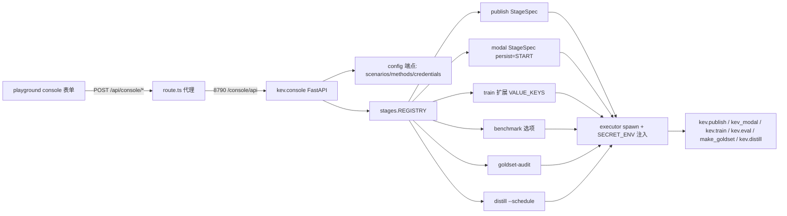

## 用户需求
为图形化控制台 console 补齐 `docs/medical/runbook-train_cn.md` §七 7.4 清单中标记「未实现」的 7 项步骤，使「医疗规则合成数据训练 Kev / 微调 Qwen3.5-0.8B」全流程既可用命令执行、也可用控制台执行，并最终回写 runbook 让每个步骤同时给出命令方式与控制台方式（未实现项补完后翻转标记）。

## 产品概述
在现有 `kev.console`（FastAPI 编排服务）+ playground 前端控制台之上，新增/扩展作业阶段（StageSpec）与对应表单：发布到 Hub、金标集审计、训练高级开关、benchmark 选项、distill 调度、Modal 部署、金标人工审校 UI。控制台只 spawn 编排进程，凭据经服务端环境变量注入，永不下发浏览器。

## 核心功能
- **publish 阶段**：控制台提交 `kev.publish`（run/repo/card/private/revision/replace/tag/message），凭据复用 KEV_HF_SECRET。
- **goldset-audit 阶段**：控制台触发 `make_goldset.py audit`（比对两份标注、--threshold 闸门），输出分歧率。
- **train 高级开关**：表单暴露 anchor/perm_kl/ord_w/校准屏/数据混合/快照等全部开关。
- **benchmark 选项**：表单暴露 --remote/--allow-test/--date_facts 等。
- **distill 调度**：表单支持 --schedule daemon/cron daily quota。
- **Modal 部署**：控制台触发 `kev_modal.py deploy` 长驻端点，凭据经 SECRET_ENV 注入 Modal token。
- **金标审校 UI**：载入 sample 产出的 jsonl，供临床/药师逐条改标签并导出可喂 --holdout 的金标文件。


## 技术栈
- 后端：Python + FastAPI + uvicorn（`kev.console`）；阶段以 `StageSpec.build_argv` 组装 argv 返回 `BuiltCommand`（argv/cwd/env/artifacts_in/out），executor spawn 子进程并注入 `SECRET_ENV`。
- 前端：Next.js 16 + React 19 + Tailwind v4 + shadcn + @base-ui/react + lucide-react（playground）；表单在 `src/components/console`，页面在 `src/app/console/<domain>`，经 `src/app/api/console/[...path]/route.ts` 代理到 `127.0.0.1:8790/console/api`。
- 测试：后端 pytest（`build_argv` 纯函数，红绿重构）；前端 `node --test`（`npm run test:console`）。

## 实现方法
沿用既有「StageSpec + build_argv」模式，每一项功能 = 一个（或一组）StageSpec + 一个前端表单，绝不另写生命周期管理。长驻类（Modal 部署）仿 `deploy.py` 用 `persist=Persist.START`。表单字段以 `config` 端点下发的 scenarios/methods/credentials 为驱动，沿用 `ArgvPreview`/`JobMonitor`/`GatePanel` 现有组件。TDD：先写 `build_argv` 失败用例，再实现，保证 argv 与 `kev/train.py`、`kev/publish.py` 等 argparse 严格一致（参数名下划线）。

## 关键决策与权衡
- **凭据**：publish 用现有 `KEV_HF_SECRET`/`HF_TOKEN`；Modal 需在 `executor.py:35 SECRET_ENV` 追加 Modal token（如 `MODAL_TOKEN`/`MODAL_API_TOKEN`，以 `kev_modal.py` 实际读取为准），`app.py:34 SECRET_NAMES` 同步，`config` 端点只下发布尔态。绝不进 argv/日志。
- **goldset-audit**：`make_goldset.py audit` 已存在，控制台只扩展 `data.py` 的 goldset 阶段新增 `goldset-audit` kind，复用既有 sample 表单结构。
- **金标审校 UI**：纯前端、无子进程；载入 jsonl -> 编辑 questions 标签 -> 导出金标 jsonl，供 `split_data.py --holdout` 使用。
- **distill 调度**：`--schedule` 在后端 argv 组装 + 前端表单；daemon 长驻走 Persist.START，cron 走一次性定时 spawn（实现按 `kev.distill` 实际 CLI 收敛）。

## 实现要点（防回归）
- 严格复用 `train.py:_with_values` 剔除空值，避免 `--flag ''` 误传。
- `train.py:7` 强调参数名下划线，新增开关逐一核对 `kev/train.py` argparse。
- 训练温度只从 `calibration.json` 取（仿 `deploy.py:67`），高级开关不得引入温度拟合。
- `SECRET_ENV` 变更属安全面，需回归 `tests` 确认凭据不入 argv、仅 env 注入。
- 启动方式保持 `uv run python -m kev.console`（PyCharm 用 Module `kev.console` + 仓库根目录），避免相对导入 ImportError。

## 架构设计


## 目录结构
```
kev/console/stages/
├── publish.py        # [NEW] StageSpec publish: 组装 kev.publish argv（run/repo/card/private/revision/replace/tag/message）
├── modal.py          # [NEW] StageSpec modal: 组装 kev_modal.py deploy，persist=Persist.START 长驻端点
├── train.py          # [MODIFY] 扩展 VALUE_KEYS 与 build_argv，纳入 anchor/perm_kl/ord_w/校准屏/数据混合/快照等高级开关
├── eval.py           # [MODIFY] benchmark 阶段新增 --remote/--allow-test/--date_facts/external_rows 选项
├── data.py           # [MODIFY] goldset 阶段扩展 goldset-audit kind（调用 make_goldset.py audit），保留 api_keys 注入
├── distill.py        # [MODIFY] 新增 --schedule daemon/cron daily quota 表单字段与 argv 组装
├── __init__.py       # [MODIFY] 注册 publish/modal/goldset-audit 等新 kind
├── base.py           # [MODIFY?] 视 daemon/cron 需在 Persist 上补充调度语义（由子代理确认）
├── executor.py       # [MODIFY] SECRET_ENV 追加 Modal token，确保凭据仅 env 注入
└── app.py            # [MODIFY] SECRET_NAMES 追加 Modal token；config 端点暴露新 kind 与字段
tests/console/stages/
├── test_publish.py        # [NEW] build_argv 单测（红绿）
├── test_modal.py          # [NEW] modal deploy argv + env 单测
├── test_train_advanced.py # [NEW] 高级开关 argv 单测
├── test_eval_benchmark.py # [NEW] benchmark 选项 argv 单测
├── test_goldset_audit.py  # [NEW] goldset-audit argv 单测
└── test_distill_schedule.py # [NEW] --schedule argv 单测

playground/src/components/console/
├── PublishForm.tsx          # [NEW] publish 表单（复用 ArgvPreview/JobMonitor）
├── GoldsetAuditForm.tsx     # [NEW] audit 表单（a/b 文件 + threshold）
├── GoldsetReview.tsx        # [NEW] 金标审校 UI（载入 jsonl 改标签导出）
├── ModalDeployForm.tsx      # [NEW] Modal 部署表单
├── TrainAdvancedFields.tsx  # [NEW] train 高级开关面板
├── BenchmarkOptions.tsx     # [NEW] benchmark 选项面板
└── DistillScheduleFields.tsx # [NEW] distill 调度面板

playground/src/app/console/
├── publish/page.tsx      # [NEW] 发布页
├── modal/page.tsx        # [NEW] Modal 部署页
├── goldset/page.tsx      # [NEW] audit 入口
├── goldset/review/page.tsx # [NEW] 金标审校页（item 7）
├── train/page.tsx        # [MODIFY] 集成 TrainAdvancedFields
├── eval/page.tsx         # [MODIFY] 集成 BenchmarkOptions
└── datasets/page.tsx     # [MODIFY] 集成 DistillScheduleFields（distill 所属页，由子代理确认）

docs/medical/runbook-train_cn.md  # [MODIFY] 每步补命令+控制台双列，翻转未实现标记
```

## 关键代码结构（StageSpec 契约）
```python
# kev/console/stages/base.py 既有契约（新增阶段须遵守）
class StageSpec:
    def __init__(self, kind: str, group: str, title: str,
                 build: Callable[[JobRequest], BuiltCommand],
                 persist: Persist = Persist.EXIT, outcome: str = "")
class BuiltCommand:
    argv: list[str]; cwd: str; env: dict = {}
    artifacts_in: list[str]; artifacts_out: list[str]

# 新增阶段写法（以 publish 为例，仅接口级）
def build(request: JobRequest) -> BuiltCommand: ...
publish = StageSpec("publish", "publish", "发布到 Hub", build,
                    outcome="可经 /console 验证 repo 状态")
```


## 设计风格
采用深色玻璃拟态（Glassmorphism）技术控制台风格：半透明面板 + 模糊背景 + 细发光边框，契合 ML 编排工具的专业感。顶部全局导航 + 左侧领域入口（datasets/train/eval/goldset/publish/modal/deploy/jobs），主区为「表单 + ArgvPreview 实时预览 + 凭据状态 + 提交/JobMonitor」四块结构，复用现有 ArgvPreview/JobMonitor/GatePanel。微交互：输入即刷新 argv 预览、凭据缺失时红色脉冲提示、提交后 JobMonitor 滑入。

## 页面规划（6 屏）
1. **控制台首页/任务台**：顶部导航 + 各阶段卡片网格，显示运行中的 Job 与凭据布尔态，点击进入对应表单。
2. **发布页（publish）**：左表单（run/repo/card/private/revision/remove/replace/tag/message），右 ArgvPreview；凭据缺失时 KEV_HF_SECRET 红点提示。
3. **金标集页（goldset）**：上 audit 表单（a/b 文件 + threshold 闸门），下展示分歧率与分歧样本；附「进入人工审校」入口。
4. **金标审校页（review，item 7）**：载入 sample jsonl，逐条展示 state + questions，下拉改标签，顶部进度与「导出 holdout」按钮，本地写出金标文件。
5. **Modal 部署页**：表单填 run/端口，persist=START 长驻，JobMonitor 显示端点状态与日志。
6. **训练/评估/蒸馏表单扩展**：train 页内嵌高级开关折叠面板，eval 页内嵌 benchmark 选项，datasets 页内嵌 distill 调度（daemon/cron daily quota）。

## Agent Extensions
### Skill
- **Superpowers**
  - 用途：贯穿 brainstorming/design/plan/TDD/subagent-driven-dev/code-review/finish 全流程方法，保证 7 项功能按阶段、可验证交付。
  - 预期结果：产出 design.md/plan.md/各阶段代码/review.md，每个 StageSpec 经红绿重构。
### SubAgent
- **code-explorer**
  - 用途：深入读取 `kev/console/stages/base.py`、`data.py`、`eval.py`、`distill.py`、现有 train 前端表单与 `kev_modal.py` CLI，产出阶段契约与各 stage 表单字段清单。
  - 预期结果：一份准确的字段/argv 映射文档，供实现子代理对照，避免参数名与 CLI 不一致。
- **implementer**
  - 用途：按任务简报逐条实现 StageSpec、前端表单与单测，严格 TDD，产出原子 commit 与报告。
  - 预期结果：每项功能均有失败用例先行、实现后转绿，且 commit 原子可追溯。
### MCP
- **Playwright MCP Server**
  - 用途：在步骤 7 对控制台全流程做浏览器冒烟验证（提交 publish/audit/modal/train 高级开关等，确认 argv 预览与 job 启动）。
  - 预期结果：证明控制台每个新增步骤可端到端跑通，并截图佐证 runbook 双列描述准确。
