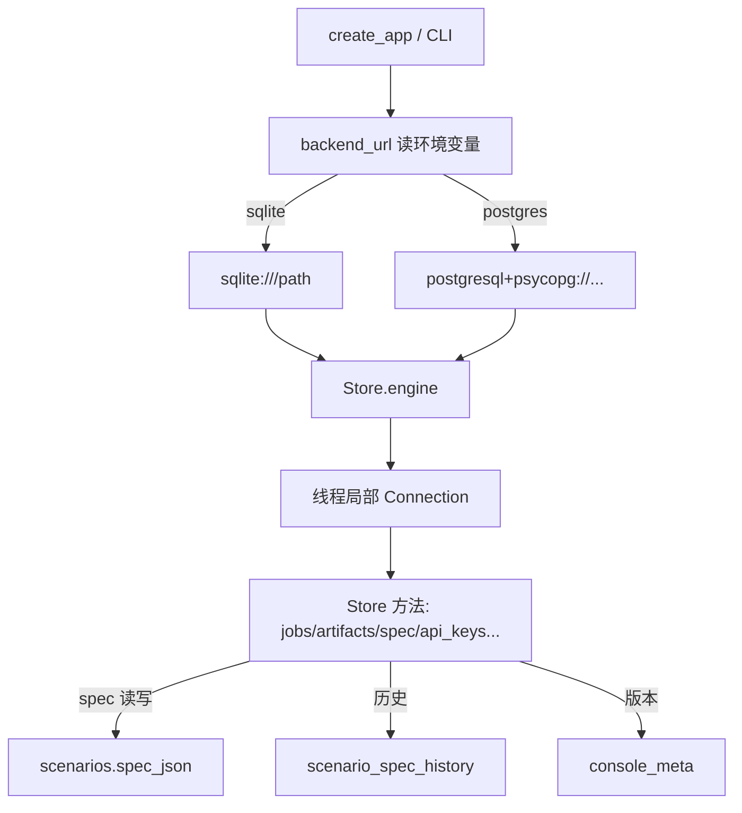

## 用户需求概览

优化 kev console 的持久化层，消除对本地配置文件的依赖，并支持在不同数据库后端之间动态切换。

## 核心功能

- **配置持久化**：将 7 个场景配置（diagnosis / critical-value / icd-coding / medication-review / nursing-quality / record-summary / triage 的 json）的当前内容与「最近 20 版」历史快照全部存入数据库。运行时不再读取或回写 `docs/medical/specs/*.json` 及 `data/console/spec-history/` 目录，空库经种子即可自包含。
- **数据库后端切换**：通过环境变量 `KEV_CONSOLE_DB_BACKEND=sqlite|postgres` 动态选择后端；sqlite 走 `KEV_CONSOLE_DB_PATH`（缺省 `data/console/kev-console.db`），postgres 走 `KEV_CONSOLE_DB_HOST/PORT/USER/PASSWORD/NAME`（可选 `SCHEMA`）。默认 sqlite，保持与现有 `Store(tmp_path/"db.sqlite")` 测试兼容。
- **初始化 SQL 生成**：提供单一数据源脚本，分别产出 sqlite 与 postgresql 两套建表 DDL + 初始数据（含 scenario_domains、scenarios 及 spec 内容）的 SQL 文件，并随代码提交避免漂移。

## 技术栈

- 语言/运行时：Python 3.12/3.13，kev console 既有的 `serve` 运行环境（FastAPI + uvicorn）。
- 持久层：引入 **SQLAlchemy Core 2.x**（`Engine`/`Connection`/`text()`/`sqlalchemy.dialects` 的 `insert().on_conflict_*`），手写 SQL，非 ORM。新增依赖 `sqlalchemy>=2.0` 与 `psycopg[binary]>=3.2`，挂在 pyproject 的 `serve` extra。
- 保持项目「不引 ORM」精神：只把 SQLAlchemy 当跨方言连接/事务/参数归一器，业务逻辑与 SQL 文本仍由本项目掌控。

## 实现方案

**总体策略**：在 `kev/console/db.py` 引入连接工厂 `backend_url()`（按 `KEV_CONSOLE_DB_BACKEND` 产出 SQLAlchemy URL），`Store` 改为持有一个 `Engine` 与线程局部 `Connection`；所有查询改写走 `text()` + 命名参数，SQLite 专有构造（PRAGMA、AUTOINCREMENT、INSERT OR IGNORE、last_insert_rowid）按后端分支用 SQLAlchemy 方言原语替换。spec 配置内容存入 `scenarios.spec_json`，历史快照迁入 `scenario_spec_history` 表。

**关键技术决策**

1. *连接与事务*：`Store._local = threading.local()` 缓存每条线程的 `Connection`；`tx()` 用 `conn.begin()` 维持既有「读-改-写串行化」语义；sqlite 分支在连接建立时执行 `PRAGMA journal_mode=WAL; PRAGMA foreign_keys=ON`，postgres 由引擎管理连接池（`pool_pre_ping=True`）。
2. *schema 版本*：弃用 `PRAGMA user_version`，改用两端通用的 `console_meta(key TEXT PRIMARY KEY, value TEXT)` 表；sqlite 旧库首次打开时回读 `PRAGMA user_version` 并写入 `console_meta` 以兼容既有库。
3. *方言归一*：① 占位符 `?` → `text()` 命名参数 `:name`（SQLAlchemy 自动映射到 psycopg 的 `%s`）；② `INSERT OR IGNORE` / `ON CONFLICT(...) DO UPDATE SET ...=excluded` → `dialects.sqlite/postgresql.insert(...).on_conflict_do_nothing(index_elements=...)` / `.on_conflict_do_update(index_elements=..., set_=...)`；③ `INTEGER PRIMARY KEY AUTOINCREMENT` → 两端通用 `Integer` 主键（sqlite 自增、postgres identity）；④ `last_insert_rowid()` → `RETURNING(id)` 配合 `cursor.fetchone()`；⑤ `COALESCE`/`substr` 两端通用，保留。
4. *DDL 双版本*：`DDL_SQLITE` 与 `DDL_POSTGRES` 分别声明类型差异（INTEGER/BIGSERIAL、TEXT/JSONB、种子 upsert 语法）；`executescript` 改为逐条 `engine.execute(text(...))`（postgres 不支持 executescript）。

**性能与可靠性**：每线程单连接 + 线程池路由保持与现状一致；spec 读取走 `scenarios` 单行点查（已建 `slug` 唯一索引），历史列表按 `scenario_id` 过滤并 `ORDER BY created_at DESC LIMIT 20`；写入历史后清理超 20 版用一条带子查询的 DELETE，避免全表扫描。迁移为「一次性、幂等」回灌，失败不影响启动（仅记录 system 事件）。

## 实现要点（防回归）

- 保留 `resolve_spec_path` 作为回退（仅当 `spec_json` 为 NULL 时读本地文件），保证旧库与测试不崩。
- `stages/data.py` 的 `_resolve_spec_path` 继续可用；训练数据生成改从 DB 读 `spec_json`（必要时回退文件）。
- 不改动 `api_keys`/`distill_providers` 等已入库表结构（仅在其 DDL 措辞上做方言对齐）。
- 保留 `write_spec_file` 的 JSON 合法性与必要字段（name/domain/state/questions）校验。

## 架构设计



## 目录结构与文件

```
kev/console/db.py          # [MODIFY] 引入 backend_url()/Engine；Store 改方言原语；新增 spec_json 读写与
                           #          scenario_spec_history 读写；DDL_SQLITE/DDL_POSTGRES；console_meta 版本；
                           #          旧库迁移（spec_json 回灌 + user_version 兼容）。
kev/console/paths.py       # [MODIFY] 新增后端相关环境变量读取辅助（DB_BACKEND/DB_HOST/PORT/USER/PASSWORD/NAME/PATH），
                           #          DB_PATH 保持为 sqlite 缺省。
kev/console/app.py         # [MODIFY] create_app 按新环境变量构建 Store（保留对旧 KEV_CONSOLE_DB 的兼容回退）。
kev/console/__main__.py    # [MODIFY] 增加 initdb 子命令，按当前后端执行对应 schema 文件。
pyproject.toml             # [MODIFY] serve extra 增加 sqlalchemy>=2.0、psycopg[binary]>=3.2。
scripts/gen_console_schema.py   # [NEW] 单一数据源脚本，生成两套 schema SQL 并提交。
deploy/console/schema.sqlite.sql    # [NEW] sqlite 建表 + 初始数据（含 7 个 spec 内容）。
deploy/console/schema.postgres.sql  # [NEW] postgres 建表 + 初始数据。
.env.example               # [MODIFY] 补充后端切换变量说明。
docs/medical/runbook*.md   # [MODIFY] 补充 sqlite/postgres 切换与 initdb 用法。
tests/test_console_db.py / test_console_scenarios.py  # [MODIFY] 适配 spec_json 与 history 表，sqlite 默认
                           #          可用；新增可选 postgres 集成测试（gated by KEV_CONSOLE_DB_BACKEND=postgres）。
```

## 关键代码结构

```python
# kev/console/db.py —— 后端 url 工厂（命名参数与方言无关）
def backend_url() -> "sa.URL":
    """读 KEV_CONSOLE_DB_BACKEND；sqlite→sqlite:///<path>，postgres→postgresql+psycopg://..。"""

# 方言 upsert 助手（避免在每个写入点重复分支）
def _upsert(table, values, index_elements) -> "sa.sql.Insert":
    """按 store.backend 选 dialects.sqlite/postgresql 的 insert().on_conflict_do_nothing/do_update。"""
```