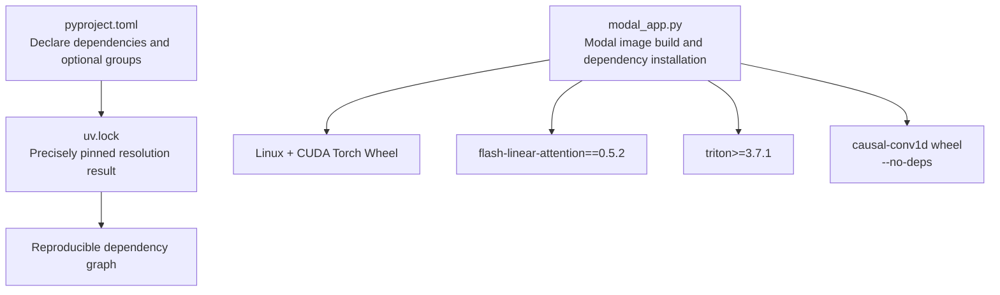
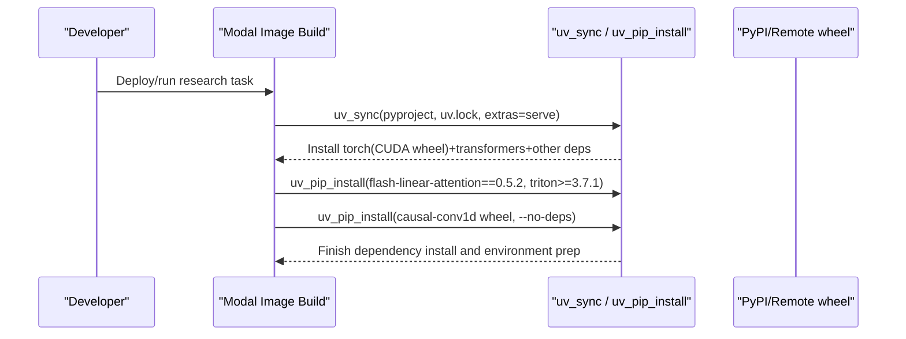
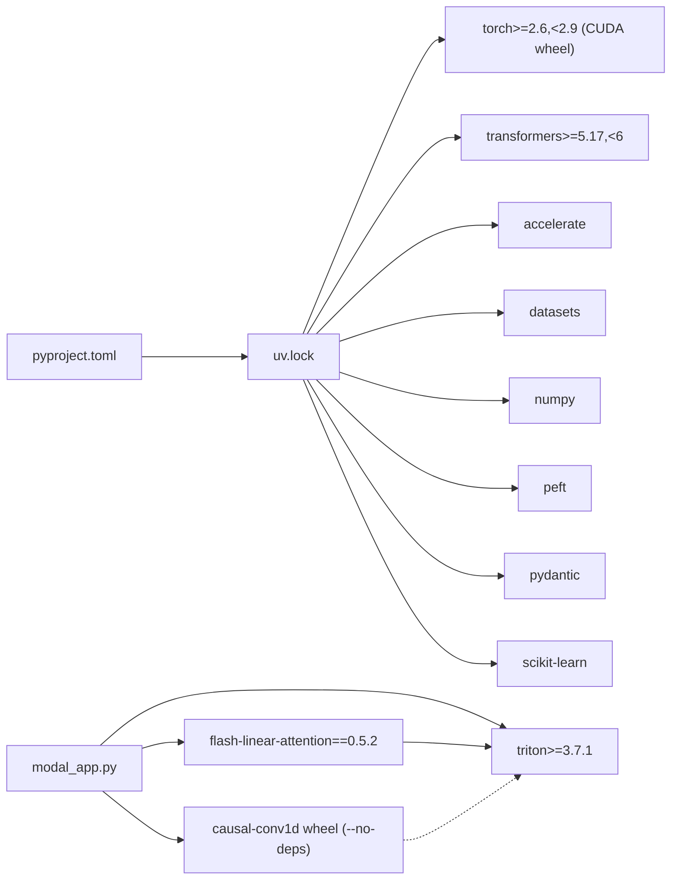

## Table of Contents
1. [Introduction](#introduction)
2. [Project Structure](#project-structure)
3. [Core Components](#core-components)
4. [Architecture Overview](#architecture-overview)
5. [Detailed Component Analysis](#detailed-component-analysis)
6. [Dependency Analysis](#dependency-analysis)
7. [Performance Considerations](#performance-considerations)
8. [Troubleshooting Guide](#troubleshooting-guide)
9. [Conclusion](#conclusion)

## Introduction
This document targets dependency management for the Kev project, focusing on the following objectives:
- Python 3.12/3.13 environment requirements and constraints.
- PyTorch and CUDA build selection, version ranges.
- transformers library version requirements.
- How to use uv_sync and uv_pip_install: precisely pin dependencies, select CUDA builds, and specially handle flash-linear-attention and triton.
- Custom package installation: pre-built causal-conv1d wheel, the role of --no-deps.
- Dependency conflict resolution and performance optimization suggestions.

## Project Structure
Kev uses declarative dependencies based on pyproject.toml, precisely pinned via uv.lock; in the Modal cloud GPU environment, modal_app.py defines the image build flow, installing dependencies uniformly and injecting environment variables.

Diagram sources
- [pyproject.toml:5-30](file://pyproject.toml#L5-L30)
- [modal_app.py:54-75](file://modal_app.py#L54-L75)

Section sources
- [pyproject.toml:5-30](file://pyproject.toml#L5-L30)
- [modal_app.py:54-75](file://modal_app.py#L54-L75)

## Core Components
- Python version requirement: requires-python = ">=3.12,<3.14"; local development recommends 3.13 (limited by torch wheel support).
- Core dependencies: torch>=2.6,<2.9; transformers>=5.17,<6; accelerate, datasets, numpy, peft, pydantic, scikit-learn.
- Optional dependencies: serve (FastAPI, typesafe-sdk, uvicorn, mlx-lm on darwin arm64); mlx (mlx-lm on darwin arm64).
- Development dependencies: httpx, matplotlib, modal==1.5.5, pytest.

Section sources
- [pyproject.toml:5-30](file://pyproject.toml#L5-L30)
- [pyproject.toml:37-54](file://pyproject.toml#L37-L54)
- [AGENTS.md:14-17](file://AGENTS.md#L14-L17)

## Architecture Overview
The Modal image build flow combines "precisely pinned dependencies" with "GPU-accelerated kernels":
- uv_sync syncs dependencies from pyproject.toml and uv.lock, automatically selecting the CUDA-version torch wheel on Linux.
- uv_pip_install installs flash-linear-attention and triton, ensuring the fused Qwen3.5 kernels are available.
- Install the pre-built causal-conv1d wheel separately, and use --no-deps to avoid overwriting the already-installed triton.

Diagram sources
- [modal_app.py:54-75](file://modal_app.py#L54-L75)

Section sources
- [modal_app.py:54-75](file://modal_app.py#L54-L75)

## Detailed Component Analysis

### Python and PyTorch/CUDA Version Constraints
- Python: >=3.12,<3.14; local .python-version and documentation recommend 3.13.
- PyTorch: >=2.6,<2.9; on Linux, the CUDA-build wheel is selected via uv_sync.
- transformers: >=5.17,<6; used with peft>=0.21 for the LoRA/full fine-tuning paths.

Section sources
- [pyproject.toml:13-30](file://pyproject.toml#L13-L30)
- [AGENTS.md:14-17](file://AGENTS.md#L14-L17)
- [modal_app.py:58-61](file://modal_app.py#L58-L61)

### uv_sync: Precise Dependency Pinning and CUDA Build Selection
- uv_sync reads pyproject.toml and uv.lock, installing serve-related dependencies per extras=["serve"].
- In the Linux environment, the torch wheel is a CUDA build, facilitating subsequent CUDA training and inference.
- uv.lock provides deterministic resolution results, ensuring dependency consistency across different machines/timepoints.

Section sources
- [modal_app.py:58-70](file://modal_app.py#L58-L70)
- [uv.lock:1-8](file://uv.lock#L1-L8)

### uv_pip_install: Special Handling of flash-linear-attention and triton
- flash-linear-attention==0.5.2: the fused Qwen3.5 kernel requires this fixed version; kev.fused_qwen35 patches fla's kernel launch.
- triton>=3.7.1: older triton has incorrect-result issues on the Hopper architecture; torch 2.8 defaults to pinning triton 3.4, so triton must be explicitly upgraded.
- Order matters: install fla and triton first, then causal-conv1d, to avoid its dependency resolution reintroducing the old triton.

Section sources
- [modal_app.py:59-65](file://modal_app.py#L59-L65)
- [AGENTS.md:242-246](file://AGENTS.md#L242-L246)

### Custom Package Installation: causal-conv1d Wheel and --no-deps
- Use the pre-built wheel: https://github.com/Dao-AILab/causal-conv1d/releases/download/v1.7.0/causal_conv1d-1.7.0%2Bcu12torch2.8cxx11abiTRUE-cp313-cp313-linux_x86_64.whl
- Match conditions: CUDA 12, torch 2.8, Python 3.13, Linux x86_64.
- --no-deps: prevents pip from resolving and installing causal-conv1d's dependencies on torch/triton, thus avoiding falling back to the torch-bound triton 3.4, which would cause fla to fail on Hopper.

Section sources
- [modal_app.py:54-65](file://modal_app.py#L54-L65)

### Dependency Conflict Resolution
- Conflict point: causal-conv1d's dependencies may pull in the torch-bound triton 3.4, conflicting with fla's compatibility on Hopper.
- Resolution strategy:
  - Install flash-linear-attention==0.5.2 and triton>=3.7.1 first.
  - Then install the causal-conv1d wheel with --no-deps.
- Verification points:
  - Confirm triton version >=3.7.1.
  - Confirm torch version is within >=2.6,<2.9.
  - Confirm the CUDA driver is compatible with the torch CUDA build.

Section sources
- [modal_app.py:59-65](file://modal_app.py#L59-L65)
- [AGENTS.md:242-246](file://AGENTS.md#L242-L246)

### Performance Optimization Suggestions
- Enable CUDA and fused kernels:
  - Install FastAPI and other dependencies via the serve extra, and use the CUDA wheel in the GPU container.
  - Keep flash-linear-attention==0.5.2 and triton>=3.7.1 to enable the DeltaNet fused kernel.
- Triton cache:
  - Set TRITON_CACHE_DIR to a persistent volume to reuse compiled kernels and autotuning results, reducing cold-start overhead.
- Long-context path:
  - Note that the long-row path may use a memory-efficient kernel, affecting precision and memory usage; keep the kernel set consistent when comparing tests.

Section sources
- [modal_app.py:45-47](file://modal_app.py#L45-L47)
- [modal_app.py:58-65](file://modal_app.py#L58-L65)
- [AGENTS.md:425-438](file://AGENTS.md#L425-L438)

## Dependency Analysis
The following diagram shows the coupling relationships and installation order among key dependencies.

Diagram sources
- [pyproject.toml:21-30](file://pyproject.toml#L21-L30)
- [modal_app.py:58-65](file://modal_app.py#L58-L65)

Section sources
- [pyproject.toml:21-30](file://pyproject.toml#L21-L30)
- [modal_app.py:58-65](file://modal_app.py#L58-L65)

## Performance Considerations
- Dependency level:
  - Use the CUDA wheel of torch to avoid the CPU-only path.
  - Pin flash-linear-attention and triton versions to ensure fused kernels are available and behave stably.
- Runtime level:
  - Warm up the Triton kernel (first step or first pass), and use TRITON_CACHE_DIR to improve subsequent performance.
  - In long-context scenarios, be aware of precision differences caused by kernel switching; align the kernel set when comparing.

[This section is general guidance and does not directly analyze specific files.]

## Troubleshooting Guide
- Symptom: fla returns incorrect results or fails to import on Hopper.
  - Check whether the triton version is >=3.7.1.
  - Confirm that triton was not replaced with 3.4 due to causal-conv1d's dependency resolution.
- Symptom: torch CUDA unavailable or version mismatch.
  - Confirm torch version is within >=2.6,<2.9.
  - Confirm the CUDA wheel is installed on Linux.
- Symptom: causal-conv1d import failure or performance degradation.
  - Confirm the matching wheel (cu12/torch2.8/cp313/linux_x86_64) is installed.
  - Confirm --no-deps was used.

Section sources
- [modal_app.py:59-65](file://modal_app.py#L59-L65)
- [AGENTS.md:242-246](file://AGENTS.md#L242-L246)

## Conclusion
Kev's dependency management centers on pyproject.toml and uv.lock, combined with modal_app.py's image build flow, achieving:
- Precisely pinned dependencies, ensuring cross-environment consistency.
- Automatic selection of the CUDA-version torch wheel on Linux.
- Enabling the fused Qwen3.5 kernel via flash-linear-attention==0.5.2 and triton>=3.7.1.
- Using the pre-built causal-conv1d wheel together with --no-deps to avoid triton version conflicts.
Following the above constraints and steps yields a stable, high-performance dependency and runtime environment both locally and in the Modal GPU environment.
