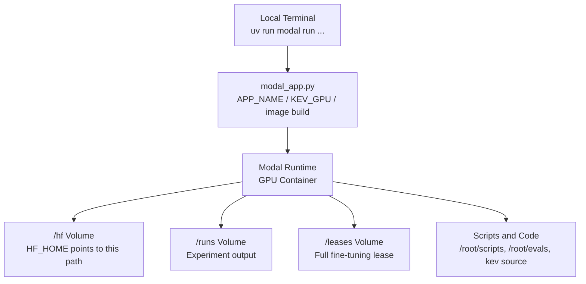
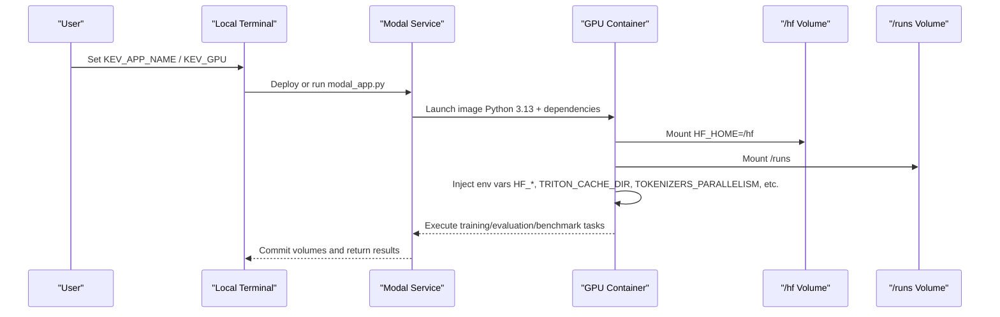
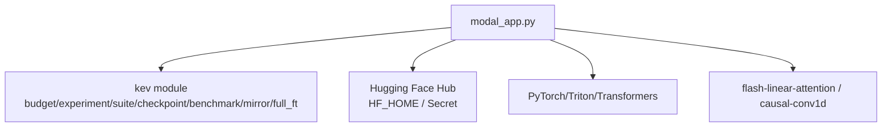

## Table of Contents
1. [Introduction](#introduction)
2. [Project Structure](#project-structure)
3. [Core Components](#core-components)
4. [Architecture Overview](#architecture-overview)
5. [Detailed Component Analysis](#detailed-component-analysis)
6. [Dependency Analysis](#dependency-analysis)
7. [Performance and Cost Considerations](#performance-and-cost-considerations)
8. [Troubleshooting Guide](#troubleshooting-guide)
9. [Conclusion](#conclusion)
10. [Appendix: Environment Variable List and Best Practices](#appendix-environment-variable-list-and-best-practices)

## Introduction
This document is aimed at developers running Kev research tasks on Modal, focusing on the following objectives:
- Explain the `APP_NAME` environment variable setting (default `kev-research`) and its impact on Modal App isolation.
- Explain the behavior, limitations, and cost implications of the `KEV_GPU=T4/H100/H200` GPU type selection.
- Document the container image build parameters: Python 3.13, dependency installation order, and custom package configuration.
- Clarify the roles and recommended values of key environment variables such as `HF_HOME`, `TRITON_CACHE_DIR`, `TOKENIZERS_PARALLELISM`, and others.
- Provide directly reusable configuration examples and best-practice recommendations.

## Project Structure
The entry point of the Modal app is `modal_app.py` at the repository root, which is responsible for:
- Defining the Modal App name and GPU type.
- Building a reproducible container image (based on Debian Slim + Python 3.13).
- Mounting persistent volumes (Hugging Face weight cache, training outputs, lease directory).
- Exposing remote functions for training, evaluation, benchmarking, publishing, image syncing, and more.
- Orchestrating tasks and fetching results via a local entrypoint.

Diagram sources
- [modal_app.py:38-75](file://modal_app.py#L38-L75)
- [modal_app.py:76-83](file://modal_app.py#L76-L83)

Section sources
- [modal_app.py:1-83](file://modal_app.py#L1-L83)

## Core Components
This section focuses on the core content directly related to "app configuration": App name, GPU type, image build, and environment variable injection.

- APP_NAME (Application name)
  - Determined by the `KEV_APP_NAME` environment variable; if not set, the default value `kev-research` is used.
  - This name is used to create the Modal App, achieving isolation between different research deployments.
  - Reference locations: [modal_app.py:38](file://modal_app.py#L38), [modal_app.py:52](file://modal_app.py#L52).

- GPU Type (KEV_GPU)
  - Determined by the `KEV_GPU` environment variable; default value is `H100`.
  - The free tier can use `T4`; high-end cards such as H100/H200 typically require a workspace-bound payment method.
  - All GPU-bearing functions use this variable as the default GPU resource.
  - Reference locations: [modal_app.py:42](file://modal_app.py#L42), [modal_app.py:103-115](file://modal_app.py#L103-L115).

- Image Build (Python 3.13, dependency order, custom packages)
  - Base image: Debian Slim + Python 3.13.
  - System tools: install git.
  - Dependency installation:
    - Use uv to sync project dependencies (pinned versions), with the serve optional dependency enabled.
    - Install flash-linear-attention and triton>=3.7.1 (to resolve kernel compatibility issues on the Hopper platform).
    - Pre-compiled causal-conv1d wheel (matching torch 2.8/CUDA 12/Python 3.13), using --no-deps to avoid overwriting the triton version.
    - Install pytest (for GPU testing).
  - Bake local source, evals, scripts, tests, and some experiment config files into the image.
  - Reference locations: [modal_app.py:54-75](file://modal_app.py#L54-L75), [pyproject.toml:21-46](file://pyproject.toml#L21-L46).

- Environment Variable Injection
  - worker_environment uniformly injects HF_HOME, HF_HUB_DISABLE_PROGRESS_BARS, TOKENIZERS_PARALLELISM, PYTHONUNBUFFERED, TRITON_CACHE_DIR, KEV_APP_NAME, KEV_GPU, and the optional KEV_HF_SECRET.
  - These environment variables are written into the image environment and take effect during each function execution.
  - Reference locations: [modal_app.py:44-50](file://modal_app.py#L44-L50), [modal_app.py:67](file://modal_app.py#L67).

Section sources
- [modal_app.py:38-75](file://modal_app.py#L38-L75)
- [pyproject.toml:21-46](file://pyproject.toml#L21-L46)

## Architecture Overview
The following diagram shows the key flow of the Modal app from local to container, as well as the scope of volumes and environment variables.

Diagram sources
- [modal_app.py:44-50](file://modal_app.py#L44-L50)
- [modal_app.py:76-83](file://modal_app.py#L76-L83)
- [modal_app.py:103-115](file://modal_app.py#L103-L115)

## Detailed Component Analysis

### APP_NAME and Modal App Isolation
- Behavior
  - When `KEV_APP_NAME` is not explicitly set, the default `kev-research` is used.
  - This name is used to create the Modal App, thereby isolating the resources and state of different research deployments.
  - It is recommended to assign an independent app name to each research effort in multi-team or multi-project scenarios, to avoid dependency counting and startup failures.
- Related code
  - Reading and app creation: [modal_app.py:38](file://modal_app.py#L38), [modal_app.py:52](file://modal_app.py#L52).
  - Documentation guidance on isolation: [README.md:172-184](file://README.md#L172-L184).

Section sources
- [modal_app.py:38-52](file://modal_app.py#L38-L52)
- [README.md:172-184](file://README.md#L172-L184)

### GPU Type Selection and Cost Impact
- Behavior
  - Default GPU is `H100`; the free tier recommends using `T4`.
  - All GPU-requiring functions (e.g., training, evaluation, benchmarking) inherit this default, and it can also be overridden via local_entrypoint parameters.
  - High-compute GPUs (H100/H200/B200) typically involve higher per-hour costs and may require a workspace-bound payment method.
- Cost and performance references
  - The "Serving Performance" table in the README provides latency and throughput comparisons across different models and GPUs, which can be used to estimate inference cost.
  - Training and evaluation costs also depend on task duration, concurrency, and disk I/O.
- Related code
  - Default GPU and comments: [modal_app.py:42](file://modal_app.py#L42).
  - GPU usage in training/evaluation functions: [modal_app.py:103-115](file://modal_app.py#L103-L115), [modal_app.py:179-180](file://modal_app.py#L179-L180), [modal_app.py:245-246](file://modal_app.py#L245-L246).
  - Performance table reference: [README.md:355-383](file://README.md#L355-L383).

Section sources
- [modal_app.py:42-115](file://modal_app.py#L42-L115)
- [README.md:355-383](file://README.md#L355-L383)

### Container Image Build Parameters and Dependency Order
- Python version
  - The image uses Python 3.13; the project requires Python >=3.12,<3.14.
  - Reference locations: [modal_app.py:56](file://modal_app.py#L56), [pyproject.toml:13](file://pyproject.toml#L13).
- Dependency installation order
  1. apt_install("git").
  2. uv_sync(uv_project_dir=ROOT, groups=[], extras=["serve"]): install with pinned dependencies, including the serve optional dependency.
  3. uv_pip_install("flash-linear-attention==0.5.2", "triton>=3.7.1"): resolve Triton compatibility on the Hopper platform.
  4. uv_pip_install(CAUSAL_CONV1D, extra_options="--no-deps"): pre-compiled CUDA kernel, avoiding overwriting triton.
  5. uv_pip_install("pytest"): support GPU testing.
- Custom package configuration
  - CAUSAL_CONV1D uses a wheel from a fixed URL, matching torch 2.8/CUDA 12/Python 3.13.
  - --no-deps prevents pip from falling back to an older triton when resolving its dependencies.
- Reference locations
  - Image build and dependency order: [modal_app.py:54-75](file://modal_app.py#L54-L75).
  - Project dependency declaration: [pyproject.toml:21-46](file://pyproject.toml#L21-L46).

Section sources
- [modal_app.py:54-75](file://modal_app.py#L54-L75)
- [pyproject.toml:21-46](file://pyproject.toml#L21-L46)

### Environment Variable Configuration and Roles
- HF_HOME
  - Points to `/hf`, used to store Hugging Face weight and dataset caches.
  - Persisted via Volume to avoid repeated downloads.
  - Reference locations: [modal_app.py:41](file://modal_app.py#L41), [modal_app.py:45](file://modal_app.py#L45), [modal_app.py:76](file://modal_app.py#L76).
- TRITON_CACHE_DIR
  - Points to `/hf/triton-cache`, used to cache DeltaNet kernel compilation and autotuning results, reused across containers.
  - Reference locations: [modal_app.py:45-46](file://modal_app.py#L45-L46).
- TOKENIZERS_PARALLELISM
  - Set to false to avoid thread contention and performance jitter caused by tokenizer parallelism.
  - Reference locations: [modal_app.py:45](file://modal_app.py#L45).
- PYTHONUNBUFFERED
  - Set to true to ensure real-time log output, facilitating debugging.
  - Reference locations: [modal_app.py:45](file://modal_app.py#L45).
- HF_HUB_DISABLE_PROGRESS_BARS
  - Disables progress bars to reduce log noise.
  - Reference locations: [modal_app.py:45](file://modal_app.py#L45).
- KEV_APP_NAME / KEV_GPU
  - Injected again inside the container to ensure subprocesses and scripts can read the current app name and GPU type.
  - Reference locations: [modal_app.py:47](file://modal_app.py#L47).
- KEV_HF_SECRET
  - Optional, used to mount a Hugging Face Secret, providing a token to access gated models.
  - Reference locations: [modal_app.py:48-49](file://modal_app.py#L48-L49), [modal_app.py:82-83](file://modal_app.py#L82-L83).

Section sources
- [modal_app.py:41-50](file://modal_app.py#L41-L50)
- [modal_app.py:76-83](file://modal_app.py#L76-L83)

## Dependency Analysis
- Application-layer dependencies
  - modal_app.py depends on the modal SDK and the kev module (budget, experiment, suite, checkpoint, predictors, benchmark, mirror, full_ft, etc.).
  - The local kev source is baked into the container via add_local_python_source("kev").
- External dependencies
  - Hugging Face Hub: weight and dataset downloads (controlled by HF_HOME and Secret).
  - PyTorch/Triton/Transformers: model loading and computation.
  - flash-linear-attention/causal-conv1d: kernels that accelerate the Qwen3.5 hybrid backbone.
- Potential circular dependencies
  - The image build stage does not import runtime logic, avoiding circular dependencies.
  - At runtime, lazy imports (e.g., `from kev.*` inside function bodies) reduce cold-start overhead.

Diagram sources
- [modal_app.py:33-36](file://modal_app.py#L33-L36)
- [modal_app.py:54-75](file://modal_app.py#L54-L75)

Section sources
- [modal_app.py:33-36](file://modal_app.py#L33-L36)
- [modal_app.py:54-75](file://modal_app.py#L54-L75)

## Performance and Cost Considerations
- GPU selection
  - T4: suitable for lightweight smoke tests and low-cost validation.
  - H100/H200/B200: suitable for large-scale training and high-performance inference, but at higher cost.
- Cache optimization
  - HF_HOME and TRITON_CACHE_DIR share the /hf volume, significantly reducing repeated downloads and kernel compilation time.
- Concurrency and timeouts
  - Training functions set a maximum container count and timeout to avoid occupying resources for long periods.
  - Evaluation and benchmarking set timeouts per suite to avoid slow tasks blocking the overall flow.
- Size and I/O
  - Large weights (e.g., 27B models) generate significant I/O during loading and merging; it is recommended to use persistent volumes and a reasonable ephemeral_disk configuration.

Section sources
- [modal_app.py:103-115](file://modal_app.py#L103-L115)
- [modal_app.py:179-180](file://modal_app.py#L179-L180)
- [modal_app.py:245-246](file://modal_app.py#L245-L246)
- [README.md:355-383](file://README.md#L355-L383)

## Troubleshooting Guide
- Dependency conflicts
  - If the Triton version is incompatible with flash-linear-attention, check whether the image build steps installed triton>=3.7.1 and causal-conv1d (--no-deps) in order.
  - Reference locations: [modal_app.py:60-65](file://modal_app.py#L60-L65).
- Permissions and Secrets
  - If gated models cannot be accessed, confirm that KEV_HF_SECRET is set and the Secret is correctly mounted.
  - Reference locations: [modal_app.py:48-49](file://modal_app.py#L48-L49), [modal_app.py:82-83](file://modal_app.py#L82-L83).
- Log buffering
  - If log output is delayed, confirm that PYTHONUNBUFFERED=1 is set.
  - Reference locations: [modal_app.py:45](file://modal_app.py#L45).
- Cache path
  - If the Triton kernel misses the cache, check whether TRITON_CACHE_DIR points to /hf/triton-cache and the volume is mounted.
  - Reference locations: [modal_app.py:45-46](file://modal_app.py#L45-L46), [modal_app.py:76](file://modal_app.py#L76).

Section sources
- [modal_app.py:45-50](file://modal_app.py#L45-L50)
- [modal_app.py:60-65](file://modal_app.py#L60-L65)
- [modal_app.py:76-83](file://modal_app.py#L76-L83)

## Conclusion
- APP_NAME is controlled by `KEV_APP_NAME` for Modal App isolation, defaulting to `kev-research`.
- GPU type is controlled by `KEV_GPU`, defaulting to `H100`; the free tier recommends using `T4`.
- The image build is based on Python 3.13 with a strict dependency installation order, ensuring Triton and causal-conv1d compatibility.
- Key environment variables (HF_HOME, TRITON_CACHE_DIR, TOKENIZERS_PARALLELISM, etc.) are uniformly injected in worker_environment, improving reproducibility and performance.
- It is recommended to assign an independent APP_NAME per research effort in production, and to choose an appropriate GPU and cache strategy based on task requirements.

## Appendix: Environment Variable List and Best Practices

- Environment variable list
  - KEV_APP_NAME: Modal App name, default `kev-research`.
  - KEV_GPU: GPU type, default `H100`; the free tier uses `T4`.
  - HF_HOME: Hugging Face cache directory, default `/hf`.
  - TRITON_CACHE_DIR: Triton kernel cache directory, default `/hf/triton-cache`.
  - TOKENIZERS_PARALLELISM: tokenizer parallelism switch, default `false`.
  - PYTHONUNBUFFERED: log buffering switch, default `true`.
  - HF_HUB_DISABLE_PROGRESS_BARS: disable progress bars, default `1`.
  - KEV_HF_SECRET: Hugging Face Secret name (optional).

- Best practices
  - Set an independent KEV_APP_NAME for each research effort to avoid deployment conflicts.
  - Use KEV_GPU=T4 on the free tier for quick validation, then switch to H100/H200 for formal training.
  - Keep HF_HOME and TRITON_CACHE_DIR consistent to fully leverage persistent volume caching.
  - Explicitly set all environment variables in CI or automation flows to improve reproducibility.
  - For gated models, be sure to configure KEV_HF_SECRET and verify that the Secret is mounted successfully.

Section sources
- [modal_app.py:38-50](file://modal_app.py#L38-L50)
- [modal_app.py:76-83](file://modal_app.py#L76-L83)
