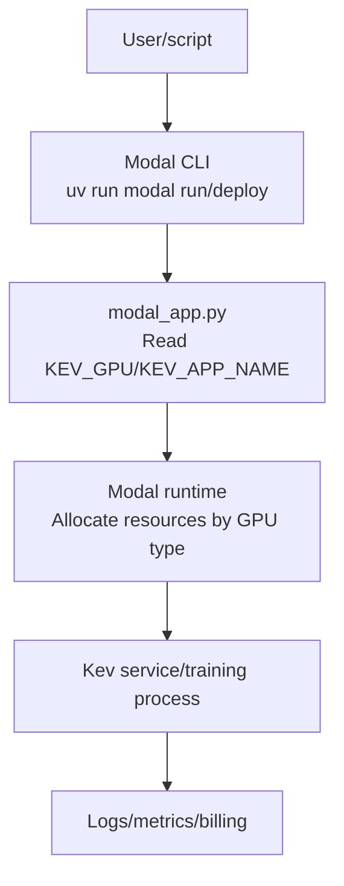
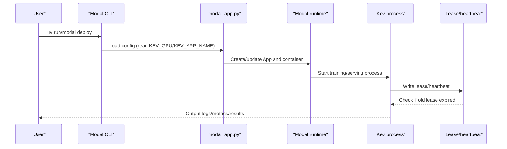
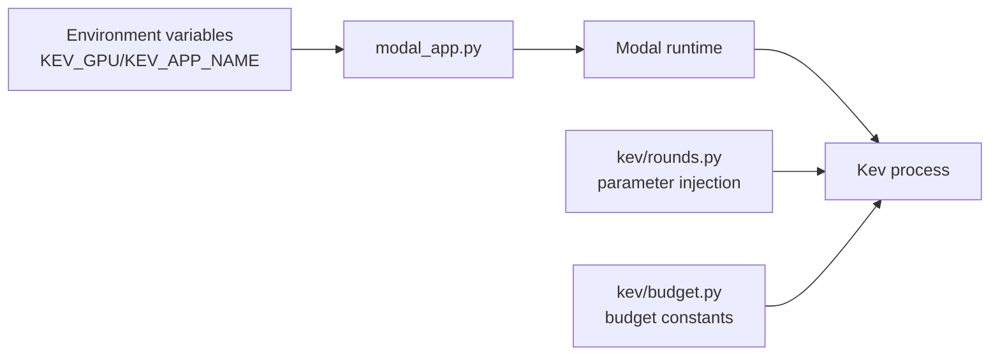

## Table of Contents
1. [Introduction](#introduction)
2. [Project Structure](#project-structure)
3. [Core Components](#core-components)
4. [Architecture Overview](#architecture-overview)
5. [Detailed Component Analysis](#detailed-component-analysis)
6. [Dependency Analysis](#dependency-analysis)
7. [Performance and Cost Considerations](#performance-and-cost-considerations)
8. [Troubleshooting Guide](#troubleshooting-guide)
9. [Conclusion](#conclusion)
10. [Appendix](#appendix)

## Introduction
This guide is for teams running Kev training and serving tasks on the Modal platform, and focuses on key topics such as "GPU type selection, auto scaling, idle instance cleanup, cost monitoring and budget control, and batch task scheduling and cache reuse". Based on the deployment entry points, environment configuration, and experiment descriptions in the repository, it provides actionable strategies, formulas, and cases to help you significantly reduce GPU costs while ensuring quality.

## Project Structure
This project centers on the following code and documentation directly related to cost optimization:
- Deployment entry point and environment variables: modal_app.py defines the default GPU, app name propagation, and Modal App initialization.
- Experiment and run descriptions: AGENTS.md and PLAN.md describe KEV_GPU selection, deployment commands, budget ceilings, concurrency, and resume mechanisms.
- Budget constants and constraints: kev/budget.py provides budget-related constants (such as max snapshots, timeouts, etc.).
- Rounds and parameter passing: kev/rounds.py injects environment variables such as app/GPU into child processes or remote calls.
- Quick start examples: README.md contains an end-to-end example using T4.

Diagram Sources
- [modal_app.py:2-52](file://modal_app.py#L2-L52)
- [AGENTS.md:246-247](file://AGENTS.md#L246-L247)

Section Sources
- [modal_app.py:2-52](file://modal_app.py#L2-L52)
- [AGENTS.md:246-247](file://AGENTS.md#L246-L247)

## Core Components
- GPU type selection and default
  - Specify the GPU type via the environment variable KEV_GPU; the default value is H100; T4 is used for the free tier.
  - This variable is passed into the worker process during deployment and execution, affecting underlying resource allocation and billing.
- App isolation and naming
  - KEV_APP_NAME is used to isolate different research deployments and avoid interference between environments.
- Budget and retry
  - Full-weight attempts are limited by budget ceilings; each study has a cost ceiling; limited retries are supported on failure.
- Concurrency and resume coordination
  - Use a lease and heartbeat mechanism to avoid duplicate starts; if an old lease has not expired, new resumes are rejected until it ends or expires.

Section Sources
- [modal_app.py:41-52](file://modal_app.py#L41-L52)
- [AGENTS.md:94-117](file://AGENTS.md#L94-L117)
- [AGENTS.md:246-247](file://AGENTS.md#L246-L247)

## Architecture Overview
The diagram below shows the complete chain from the command line to the Modal runtime to the Kev process, and marks cost-sensitive points (GPU type, concurrency, timeout, budget).

Diagram Sources
- [modal_app.py:41-52](file://modal_app.py#L41-L52)
- [AGENTS.md:94-117](file://AGENTS.md#L94-L117)

## Detailed Component Analysis

### GPU Type Selection Strategy: T4 (Free Tier) vs H100/H200 (High Performance)
- Selection principles
  - Development/smoke testing: Prefer T4 (free tier), low cost, suitable for small-scale validation.
  - Production/large-scale inference or training: H100/H200, high throughput, low latency, but higher unit price.
- Performance and cost comparison points
  - H100/H200 have a clear throughput advantage in high-concurrency, long-context scenarios; T4 is more suitable for small batches, short contexts, or offline batch processing.
  - At the same task scale, H100/H200 have shorter single-run times but higher per-unit-time cost; a trade-off must be made based on SLA and throughput targets.
- Practical recommendations
  - First use T4 to complete end-to-end validation and regression; then switch to H100/H200 for load testing and launch.
  - For long-context inference, prefer H100/H200; for short-context or offline batch processing, evaluate whether T4 meets the SLA.

Section Sources
- [modal_app.py:41-46](file://modal_app.py#L41-L46)
- [AGENTS.md:246-247](file://AGENTS.md#L246-L247)
- [README.md:308](file://README.md#L308)

### Auto Scaling and Concurrency Management: max_containers, concurrent tasks, resource utilization
- Scaling and concurrency
  - Balance throughput and cost by controlling the number of concurrent tasks and the container ceiling.
  - In high-concurrency scenarios, prefer high-performance GPUs (H100/H200) to reduce queuing and tail latency; in off-peak or offline tasks, use T4 to reduce cost.
- Resource utilization optimization
  - Set batch size and accumulation steps reasonably so GPU utilization approaches saturation without overflowing memory.
  - For long-context tasks, use chunked prefill and KV cache reuse to reduce repeated computation.
- Concurrency and resume protection
  - The lease + heartbeat mechanism ensures the same task is not executed repeatedly; if an old lease has not expired, new resumes are rejected, avoiding resource waste.

Section Sources
- [AGENTS.md:94-117](file://AGENTS.md#L94-L117)

### Idle Instance Cleanup: Timeouts, Auto Termination, and Resource Reclamation
- Timeout and termination
  - Set reasonable timeout ceilings for training/serving tasks to prevent long idle runs.
  - Combine budget ceilings with retry counts to avoid runaway costs from infinite resumes.
- Resource reclamation
  - Release containers and GPUs after tasks end; leverage Modal's auto-scaling to scale down to zero when there are no tasks.
  - For long-running services, enable health checks and graceful shutdown to ensure timely resource reclamation.

Section Sources
- [AGENTS.md:94-117](file://AGENTS.md#L94-L117)

### Cost Monitoring Tools: Console, Budget Alerts, and Cost Reports
- Console and billing
  - View GPU usage duration, concurrency, and cost trends via the Modal console.
- Budget alerts
  - Set monthly/weekly budget thresholds to trigger alert notifications; dynamically adjust combined with the KEV_GPU switching strategy.
- Cost analysis reports
  - Export task-level cost details, aggregated and analyzed by GPU type, task category, and time period, to locate high-cost hotspots.

Section Sources
- [AGENTS.md:94-117](file://AGENTS.md#L94-L117)

### Best Practices: Batch Task Scheduling, GPU Sharing, and Cache Reuse
- Batch task scheduling
  - Merge similar tasks into batches to improve GPU utilization; use length grouping and chunked prefill for long-context tasks.
- GPU sharing strategy
  - Consider multi-task sharing of a single card for small models or lightweight tasks; use a dedicated GPU for large models or high-concurrency scenarios.
- Cache reuse tips
  - Reuse KV cache and prefix cache to reduce repeated computation; use prefix cache for static inputs (e.g. system prompts).

Section Sources
- [AGENTS.md:325-328](file://AGENTS.md#L325-L328)

### Cost Calculation Formulas and Optimization Cases
- Basic formulas
  - Single task cost = runtime × GPU unit price
  - Daily average cost = Σ(each task runtime × GPU unit price)
  - Monthly average cost = Σ(daily cost)
  - Cost per unit output = total cost / output (e.g. number of requests, number of evaluation records)
- Optimization cases
  - Migrate smoke tests from H100 to T4, significantly reducing single-task cost; use H100/H200 only for load testing and launch.
  - For long-context inference, use chunked prefill and KV cache to reduce repeated computation and lower per-request cost.
  - Avoid duplicate execution via lease + heartbeat, reducing invalid GPU occupation.

Section Sources
- [AGENTS.md:94-117](file://AGENTS.md#L94-L117)
- [AGENTS.md:325-328](file://AGENTS.md#L325-L328)

## Dependency Analysis
- Environment variable dependencies
  - KEV_GPU: Determines the GPU type; defaults to H100; T4 is used for the free tier.
  - KEV_APP_NAME: Isolates different research deployments.
- Module dependencies
  - modal_app.py is responsible for reading environment variables and initializing the Modal App.
  - kev/rounds.py injects parameters such as app/GPU into child processes or remote calls.
  - kev/budget.py provides budget-related constants and constraints.

Diagram Sources
- [modal_app.py:41-52](file://modal_app.py#L41-L52)
- [kev/rounds.py:1044](file://kev/rounds.py#L1044)
- [kev/budget.py](file://kev/budget.py)

Section Sources
- [modal_app.py:41-52](file://modal_app.py#L41-L52)
- [kev/rounds.py:1044](file://kev/rounds.py#L1044)
- [kev/budget.py](file://kev/budget.py)

## Performance and Cost Considerations
- GPU type and task matching
  - Short context/offline batch: Prefer T4; long context/high concurrency: Prefer H100/H200.
- Concurrency and throughput
  - Increasing concurrency requires evaluating GPU capacity and queue latency; scale up to high-performance GPUs when necessary.
- Memory and VRAM
  - Pay attention to VRAM peaks for long-context tasks; use chunked prefill and KV cache reuse.
- Cost and SLA trade-off
  - Prefer low-cost GPUs while meeting the SLA; temporarily scale up to high-performance GPUs during peak periods.

[This section is general guidance and does not directly analyze specific files]

## Troubleshooting Guide
- Duplicate execution issues
  - Check whether the lease and heartbeat are working normally; confirm whether the old lease has expired or been released correctly.
- Budget overrun
  - Verify the budget ceiling and retry counts; check for abnormal resumes or long idle runs.
- GPU type not taking effect
  - Confirm whether the KEV_GPU environment variable is passed in correctly; check whether the deployment and run commands are consistent.
- Long-context OOM
  - Adjust chunk size and cache strategy; reduce concurrency or switch to a GPU with more VRAM.

Section Sources
- [AGENTS.md:94-117](file://AGENTS.md#L94-L117)

## Conclusion
By reasonably selecting GPU types on the Modal platform, finely controlling concurrency and scaling, strictly managing timeouts and budgets, and combining batch scheduling with cache reuse, GPU costs can be significantly reduced while ensuring quality and SLA. It is recommended to use T4 as the default development environment, switch to H100/H200 only when necessary, and prevent resource waste through lease + heartbeat and budget ceilings.

[This section is a summary and does not directly analyze specific files]

## Appendix
- Quick reference
  - Use T4 for end-to-end validation: Refer to the example commands in README.
  - Deployment and execution: Refer to the commands and steps in AGENTS.md and PLAN.md.
  - Budget and retry: Refer to the budget ceilings and resume mechanisms in AGENTS.md.

Section Sources
- [README.md:308](file://README.md#L308)
- [AGENTS.md:94-117](file://AGENTS.md#L94-L117)
- [PLAN.md:396](file://PLAN.md#L396)
