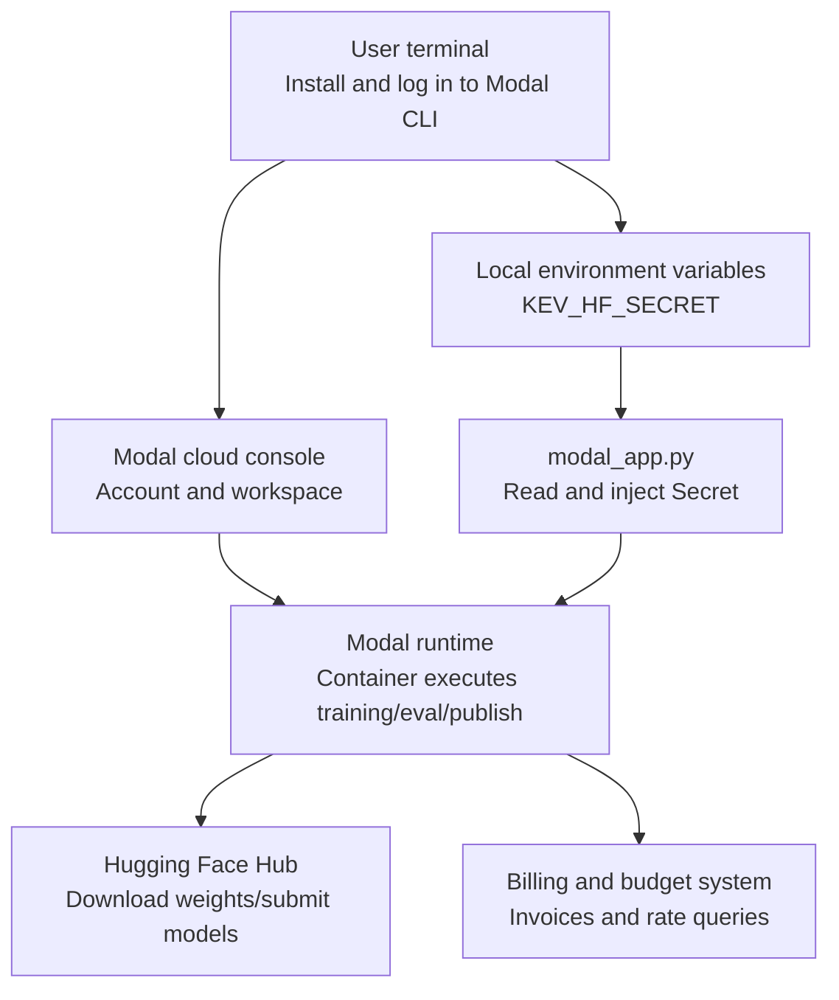
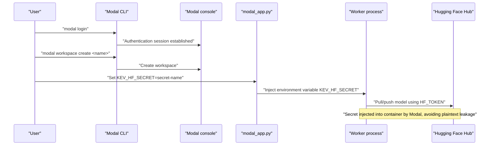
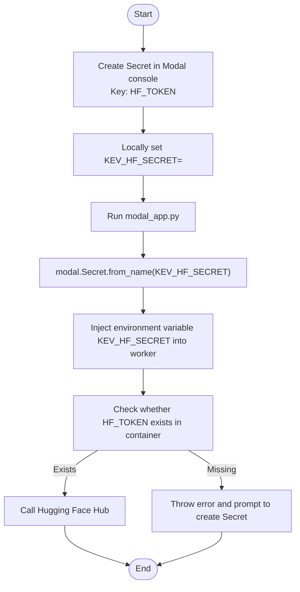
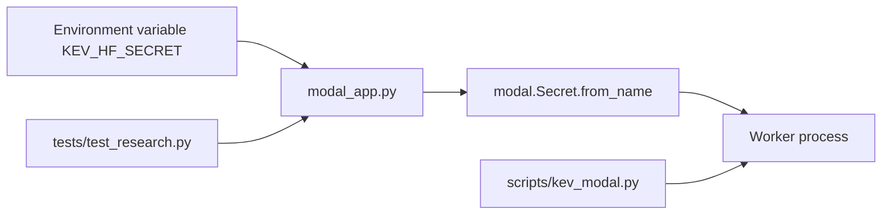

## Table of Contents
1. [Introduction](#introduction)
2. [Project Structure](#project-structure)
3. [Core Components](#core-components)
4. [Architecture Overview](#architecture-overview)
5. [Detailed Component Analysis](#detailed-component-analysis)
6. [Dependency Analysis](#dependency-analysis)
7. [Performance and Billing Considerations](#performance-and-billing-considerations)
8. [Troubleshooting Guide](#troubleshooting-guide)
9. [Conclusion](#conclusion)
10. [Appendix](#appendix)

## Introduction
This guide is for users configuring a Modal platform account for the first time or reconfiguring it, and covers the following key topics:
- Account registration and workspace creation flow (visiting modal.com, email verification, workspace creation)
- API key and environment variable configuration (Modal CLI login, KEV_HF_SECRET environment variable, Hugging Face Token integration)
- Billing and budget monitoring (free tier limits, paid upgrades, viewing invoices)
- Common command examples (modal login, modal workspace create, environment variable templates)
- Common error troubleshooting (authentication failures, network issues, permission misconfiguration)

Notes:
- This project runs training, evaluation, and publishing tasks via Modal, using KEV_HF_SECRET to inject the Hugging Face Token into containers.
- The billing and budget strategy is clearly constrained and monitored in the project documentation.

## Project Structure
The code and documentation directly related to Modal account and key configuration are concentrated in the following locations:
- modal_app.py: Defines the Modal app, Secret mounting, and environment variable injection logic
- AGENTS.md / PLAN.md: Billing, budget, quota, and monitoring related descriptions
- README.md: Project overview and external service references
- tests/test_research.py: Test assertions for KEV_HF_SECRET propagation
- runs/calibration-screen-startup/report.json: Records failure information caused by Secret not being propagated
- skills/kev-finetune/references/deploy.md and scripts/kev_modal.py: Usage and validation of KEV_HF_SECRET in the deployment script

Diagram Sources
- [modal_app.py:15-17](file://modal_app.py#L15-L17)
- [modal_app.py:48-82](file://modal_app.py#L48-L82)
- [AGENTS.md:94-117](file://AGENTS.md#L94-L117)
- [AGENTS.md:447](file://AGENTS.md#L447)

Section Sources
- [modal_app.py:15-17](file://modal_app.py#L15-L17)
- [modal_app.py:48-82](file://modal_app.py#L48-L82)
- [AGENTS.md:94-117](file://AGENTS.md#L94-L117)
- [AGENTS.md:447](file://AGENTS.md#L447)

## Core Components
- Modal account and workspace
  - After registering and verifying email at modal.com, create a workspace to isolate resources and billing.
- Modal CLI login
  - Use modal login to complete local-to-Modal authentication.
- Secret and Hugging Face Token
  - Manage HF_TOKEN via Modal Secret, and point KEV_HF_SECRET to that Secret name.
  - Inside the container, the Secret name is obtained via the KEV_HF_SECRET environment variable, then loaded via modal.Secret.from_name.
- Environment variable injection
  - modal_app.py injects KEV_HF_SECRET into the worker process environment variables, ensuring downstream scripts can access it.

Section Sources
- [modal_app.py:15-17](file://modal_app.py#L15-L17)
- [modal_app.py:48-82](file://modal_app.py#L48-L82)
- [kev_modal.py:386](file://skills/kev-finetune/scripts/kev_modal.py#L386)
- [kev_modal.py:563](file://skills/kev-finetune/scripts/kev_modal.py#L563)

## Architecture Overview
The diagram below shows the complete chain from the local terminal to the cloud container, including Secret transmission and Hugging Face integration.

Diagram Sources
- [modal_app.py:48-82](file://modal_app.py#L48-L82)
- [kev_modal.py:386](file://skills/kev-finetune/scripts/kev_modal.py#L386)

## Detailed Component Analysis

### Account Registration and Workspace Creation
- Visit modal.com to complete registration and confirm email verification.
- Use modal workspace create to create a new workspace for isolating resources and billing.
- It is recommended to create independent workspaces for different projects in a team environment, to facilitate cost allocation and permission control.

Section Sources
- [README.md:70](file://README.md#L70)

### API Key and Hugging Face Token Integration
- Create a Secret in the Modal console containing the key HF_TOKEN, with its value being your Hugging Face Token.
- Set the local environment variable KEV_HF_SECRET to point to that Secret name.
- modal_app.py reads KEV_HF_SECRET and loads the Secret via modal.Secret.from_name, injecting it into the worker process environment variables.
- The deployment script kev_modal.py checks whether HF_TOKEN exists inside the container; if missing, it errors out, prompting to provide it via a Modal Secret.

Diagram Sources
- [modal_app.py:81-82](file://modal_app.py#L81-L82)
- [kev_modal.py:386](file://skills/kev-finetune/scripts/kev_modal.py#L386)
- [kev_modal.py:563](file://skills/kev-finetune/scripts/kev_modal.py#L563)

Section Sources
- [modal_app.py:15-17](file://modal_app.py#L15-L17)
- [modal_app.py:48-82](file://modal_app.py#L48-L82)
- [kev_modal.py:386](file://skills/kev-finetune/scripts/kev_modal.py#L386)
- [kev_modal.py:563](file://skills/kev-finetune/scripts/kev_modal.py#L563)

### Billing Settings and Budget Monitoring
- Free tier limits: The default GPU type is T4 (limited by the free quota); higher compute requires upgrading to a paid plan.
- Paid upgrade: Upgrade the account plan in the Modal console to obtain more powerful GPUs and higher concurrency quotas.
- Budget monitoring:
  - Use modal billing summary --json to view cumulative costs and usage.
  - Use modal billing rates --json to view current rates.
  - The project's internal budget module (kev.budget) limits and estimates training and interpolation tasks, and records them in the logs.

Section Sources
- [AGENTS.md:94-117](file://AGENTS.md#L94-L117)
- [AGENTS.md:447](file://AGENTS.md#L447)
- [PLAN.md:382](file://PLAN.md#L382)

### Common Command Examples
- Log in to Modal CLI
  - modal login
- Create a workspace
  - modal workspace create <workspace-name>
- Set environment variable template
  - export KEV_HF_SECRET=huggingface-secret
  - uv run modal run modal_app.py::release_publish --run /runs/release/kev-27b-r23/checkpoint --repo jaredpalmer/kev-27b --card docs/model-cards/kev-27b.md --message '...' --public --confirm-public jaredpalmer/kev-27b --replace
- Deployment script reference
  - KEV_HF_SECRET=huggingface-secret modal run scripts/kev_modal.py::publish --name x-v1 --repo you/kev-4b-x

Section Sources
- [modal_app.py:15-17](file://modal_app.py#L15-L17)
- [deploy.md:84](file://skills/kev-finetune/references/deploy.md#L84)
- [kev_modal.py:8](file://skills/kev-finetune/scripts/kev_modal.py#L8)

## Dependency Analysis
- modal_app.py depends on:
  - The environment variable KEV_HF_SECRET
  - The Modal Secret mechanism (modal.Secret.from_name)
  - Worker process environment injection (env dict write)
- Test cases depend on:
  - tests/test_research.py asserts whether KEV_HF_SECRET is correctly propagated to worker_environment
- Deployment script depends on:
  - skills/kev-finetune/scripts/kev_modal.py checks whether HF_TOKEN exists inside the container, otherwise exits

Diagram Sources
- [modal_app.py:48-82](file://modal_app.py#L48-L82)
- [test_research.py:577-579](file://tests/test_research.py#L577-L579)
- [kev_modal.py:386](file://skills/kev-finetune/scripts/kev_modal.py#L386)

Section Sources
- [modal_app.py:48-82](file://modal_app.py#L48-L82)
- [test_research.py:577-579](file://tests/test_research.py#L577-L579)
- [kev_modal.py:386](file://skills/kev-finetune/scripts/kev_modal.py#L386)

## Performance and Billing Considerations
- The free tier is usually limited to T4 GPU; for more memory or higher throughput, upgrade to a paid plan.
- The resources and timeouts of training and evaluation tasks are constrained by the project's budget module (kev.budget) to avoid overspending.
- It is recommended to periodically monitor actual spend and rate changes via modal billing summary/rates.
- In large-scale experiments, prioritize using cache volumes (e.g. kev-hf-cache) to reduce repeated downloads and lower I/O and time costs.

Section Sources
- [AGENTS.md:94-117](file://AGENTS.md#L94-L117)
- [AGENTS.md:447](file://AGENTS.md#L447)
- [PLAN.md:382](file://PLAN.md#L382)

## Troubleshooting Guide
- Authentication failure
  - Symptom: modal login fails or the container cannot access the Hugging Face Hub.
  - Troubleshooting:
    - Confirm a Secret has been created in the Modal console with the key name HF_TOKEN.
    - Confirm the local KEV_HF_SECRET is set to point to that Secret.
    - Check whether modal_app.py correctly injects KEV_HF_SECRET into the worker process.
  - References:
    - [modal_app.py:48-82](file://modal_app.py#L48-L82)
    - [kev_modal.py:386](file://skills/kev-finetune/scripts/kev_modal.py#L386)

- Network connectivity issues
  - Symptom: The container cannot connect to the Hugging Face Hub.
  - Troubleshooting:
    - Check network proxy and firewall settings.
    - Confirm the Secret name and value are correct.
    - Try verifying connectivity locally via curl or huggingface-cli.

- Permission misconfiguration
  - Symptom: HF_TOKEN is missing inside the container, causing training or publishing to fail.
  - Troubleshooting:
    - Confirm KEV_HF_SECRET has been passed in and is effective.
    - Check whether the test cases pass (tests/test_research.py).
    - View the failure reason in runs/calibration-screen-startup/report.json.
  - References:
    - [test_research.py:577-579](file://tests/test_research.py#L577-L579)
    - [report.json:4](file://runs/calibration-screen-startup/report.json#L4)

Section Sources
- [modal_app.py:48-82](file://modal_app.py#L48-L82)
- [test_research.py:577-579](file://tests/test_research.py#L577-L579)
- [report.json:4](file://runs/calibration-screen-startup/report.json#L4)
- [kev_modal.py:386](file://skills/kev-finetune/scripts/kev_modal.py#L386)

## Conclusion
Through this document, you can complete Modal account registration, workspace creation, API key and environment variable configuration, and understand billing and budget monitoring methods. When encountering authentication, network, or permission issues, you can follow the troubleshooting guide to locate and resolve them step by step. It is recommended to unify Secret naming conventions and budget strategies in a team environment, ensuring controllable resource usage and transparent costs.

## Appendix
- Environment variable template
  - export KEV_HF_SECRET=huggingface-secret
- Common commands
  - modal login
  - modal workspace create <workspace-name>
  - uv run modal billing summary --json
  - uv run modal billing rates --json
