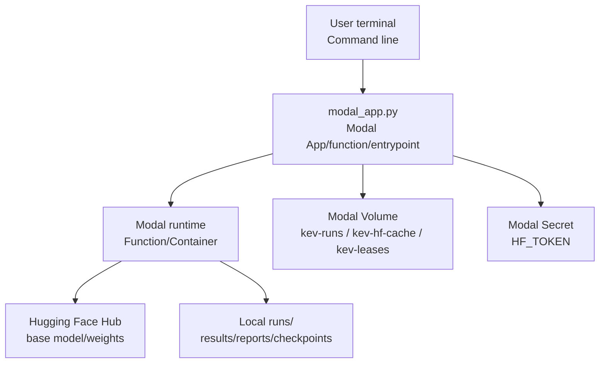
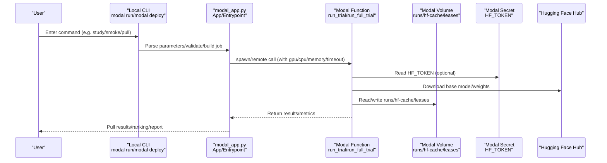
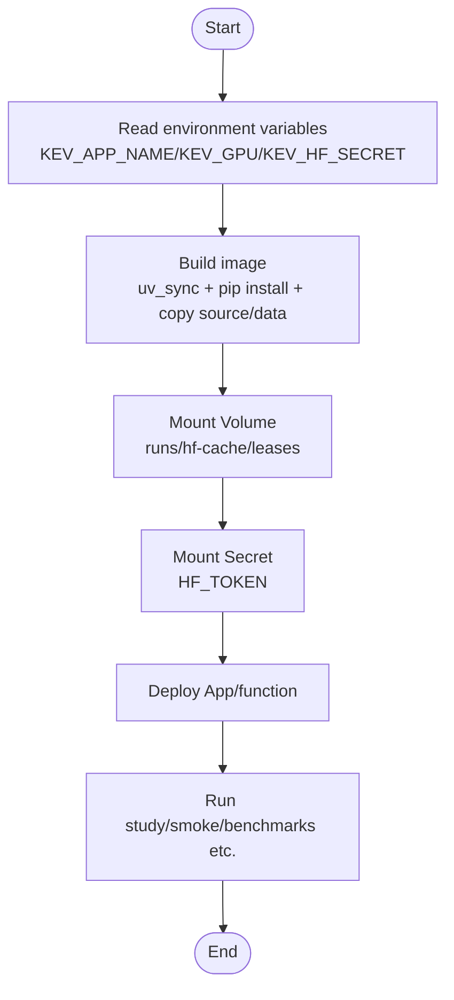
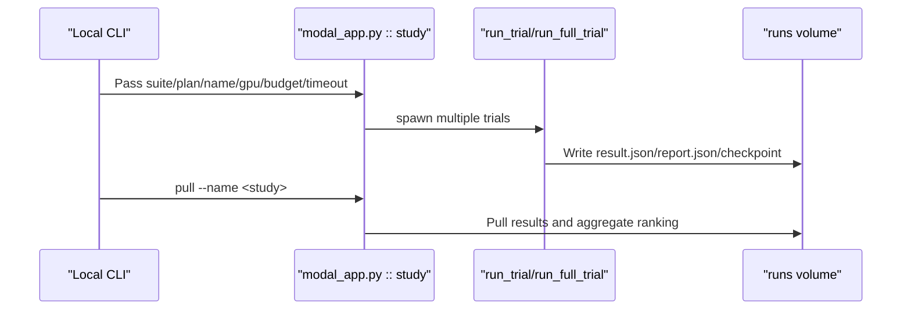
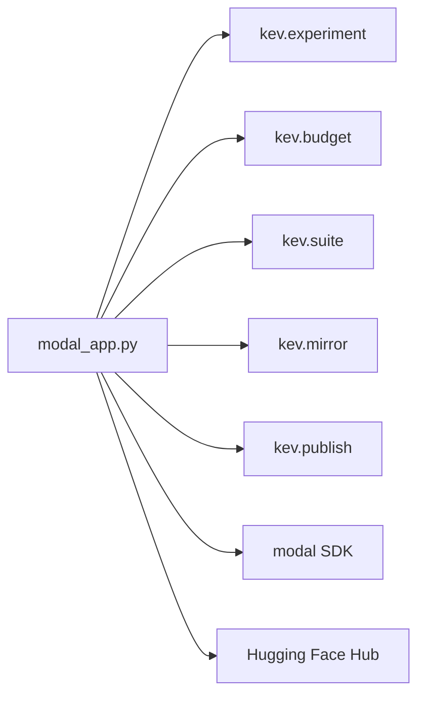

## Table of Contents
1. [Introduction](#introduction)
2. [Project Structure](#project-structure)
3. [Core Components](#core-components)
4. [Architecture Overview](#architecture-overview)
5. [Detailed Component Analysis](#detailed-component-analysis)
6. [Dependency Analysis](#dependency-analysis)
7. [Performance and Cost Optimization](#performance-and-cost-optimization)
8. [Monitoring, Logging, and Troubleshooting](#monitoring-logging-and-troubleshooting)
9. [Production Environment Best Practices](#production-environment-best-practices)
10. [Conclusion](#conclusion)
11. [Appendix: Commands and Configuration Templates](#appendix-commands-and-configuration-templates)

## Introduction
This guide is for engineers who want to train, evaluate, and deploy the Kev decision model on Modal. The content covers:
- Modal account registration, API keys, and workspace configuration
- Billing and budget control
- App deployment flow: configuration items of `modal_app.py`, GPU selection (T4, H100, H200), and container image building
- Cost optimization strategies: GPU type selection, auto scaling, and idle instance cleanup
- Monitoring and logging: runtime status viewing, error tracing, and performance metric collection
- Production environment best practices: high availability, backup, and disaster recovery
- Concrete command examples and configuration templates

## Project Structure
The core entry point directly related to Modal deployment in the repository is `modal_app.py`, which defines the Modal App, functions, Volume, Secret, image building, and the local CLI entrypoint; `README.md` provides quick start, deployment, and server-side instructions; `pyproject.toml` declares the Python version, dependencies, and dev dependencies (including `modal==1.5.5`).



**Diagram Sources**
- [modal_app.py:38-83](file://modal_app.py#L38-L83)
- [modal_app.py:96-115](file://modal_app.py#L96-L115)
- [modal_app.py:53-75](file://modal_app.py#L53-L75)

**Section Sources**
- [modal_app.py:38-83](file://modal_app.py#L38-L83)
- [modal_app.py:53-75](file://modal_app.py#L53-L75)
- [README.md:172-184](file://README.md#L172-L184)
- [pyproject.toml:1-62](file://pyproject.toml#L1-L62)

## Core Components
- Modal App and image
  - The App name is set via the environment variable `KEV_APP_NAME`, defaulting to `kev-research`.
  - The image is based on Debian Slim + Python 3.13, uses `uv_sync` to install precisely locked dependencies, and additionally installs packages required for inference and testing.
  - Local source directories such as `kev`, `evals`, `scripts`, and `tests` are packaged into the image to facilitate running scripts and evaluations inside the container.
- Persistent storage
  - `kev-runs`: Stores the results, checkpoints, snapshots, and intermediate artifacts of each trial.
  - `kev-hf-cache`: Caches Hugging Face base models and Triton kernel compilation artifacts.
  - `kev-leases`: Distributed leases for full fine-tuning attempts, to avoid concurrency conflicts.
- Secrets and access
  - Inject HF_TOKEN via `KEV_HF_SECRET` to access gated base models or private Hub repositories.
- GPU and resources
  - The default GPU is determined by `KEV_GPU`, defaulting to `H100`; the free tier can use `T4`.
  - Different functions are allocated CPU, memory, timeout, and ephemeral disk based on the task.

**Section Sources**
- [modal_app.py:38-83](file://modal_app.py#L38-L83)
- [modal_app.py:96-115](file://modal_app.py#L96-L115)
- [modal_app.py:53-75](file://modal_app.py#L53-L75)

## Architecture Overview
The diagram below shows the overall interaction from the local CLI to the Modal function, Volume, Secret, and Hugging Face Hub.



**Diagram Sources**
- [modal_app.py:96-115](file://modal_app.py#L96-L115)
- [modal_app.py:118-176](file://modal_app.py#L118-L176)
- [modal_app.py:53-83](file://modal_app.py#L53-L83)

## Detailed Component Analysis

### 1) Modal Account Registration and Configuration
- Installation and initialization
  - Install the Modal CLI and run initialization, then complete authentication in the browser.
- API keys and workspace
  - Use `modal token new` to generate a token; the workspace is managed in the Modal console.
- Secret mounting
  - Create a Secret for Hugging Face access (e.g. named `huggingface-secret`), and specify its name via the environment variable `KEV_HF_SECRET`.
- Billing and budget
  - Each study has an admission bound (maximum compute cost); cost can be estimated based on timeout and trial count.
  - Full fine-tuning (full_ft) has a longer timeout and a higher budget ceiling.

**Section Sources**
- [README.md:172-184](file://README.md#L172-L184)
- [modal_app.py:948-976](file://modal_app.py#L948-L976)

### 2) App Deployment Flow and `modal_app.py` Configuration
- Deploy the App
  - `modal deploy modal_app.py` deploys the App and all functions to Modal; subsequent `modal run` can execute on the deployed App.
- Key environment variables
  - `KEV_APP_NAME`: App name (default `kev-research`).
  - `KEV_GPU`: GPU type (default `H100`; use `T4` on the free tier).
  - `KEV_HF_SECRET`: The Secret name corresponding to HF_TOKEN.
- Image building key points
  - Use `uv_sync` to install locked dependencies, ensuring reproducibility.
  - Install `flash-linear-attention` and a compatible version of `triton` to enable efficient kernels for the Qwen3.5 hybrid backbone.
  - Pre-compile the causal-conv1d wheel to avoid dependency conflicts.
  - Package local source code and evaluation data into the image to ensure consistency of remote execution.



**Diagram Sources**
- [modal_app.py:38-83](file://modal_app.py#L38-L83)
- [modal_app.py:53-75](file://modal_app.py#L53-L75)

**Section Sources**
- [modal_app.py:38-83](file://modal_app.py#L38-L83)
- [modal_app.py:53-75](file://modal_app.py#L53-L75)

### 3) GPU Resource Selection (T4, H100, H200)
- T4
  - Suitable for smoke tests and lightweight tasks; available on the free tier.
- H100
  - The default GPU, suitable for most training and evaluation tasks.
- H200
  - Suitable for training and evaluating large models (e.g. Kev-27B); requires higher memory bandwidth and capacity.
- Selection method
  - Via the `KEV_GPU` environment variable or by passing the `gpu=` parameter in the entrypoint.

**Section Sources**
- [modal_app.py:42-47](file://modal_app.py#L42-L47)
- [modal_app.py:1074-1078](file://modal_app.py#L1074-L1078)

### 4) Container Image Building and Dependencies
- Python and system dependencies
  - Debian Slim + Python 3.13; install system tools such as git.
- Python dependencies
  - Use `uv_sync` to install dependencies from pyproject, ensuring reproducibility.
  - Additionally install `pytest` for GPU testing.
- Third-party libraries
  - `flash-linear-attention==0.5.2` and `triton>=3.7.1` to adapt to the Qwen3.5 hybrid backbone.
  - Pre-compile the `causal-conv1d` wheel to avoid torch/triton version conflicts.
- Source code and data
  - Package `kev`, `evals`, `scripts`, `tests`, and some experiment configuration files into the image.

**Section Sources**
- [modal_app.py:53-75](file://modal_app.py#L53-L75)
- [pyproject.toml:21-30](file://pyproject.toml#L21-L30)

### 5) Training and Evaluation Flow
- Single trial run
  - `run_trial`: A single trial runs in one container, mounting runs and hf-cache.
- Full fine-tuning
  - `run_full_trial`: Adds ephemeral disk and a leases volume for full_ft, supporting resumable training and snapshot uploads.
- Evaluation and benchmarking
  - `run_bench`: Benchmarks a checkpoint, outputting to `/runs/bench/<name>`.
  - `run_locked_test`: Performs a one-time locked test read of candidate trials.
- Result pulling
  - `pull`: Pulls study results from the runs volume to local `runs/<study>` and ranks them by result.



**Diagram Sources**
- [modal_app.py:96-115](file://modal_app.py#L96-L115)
- [modal_app.py:245-266](file://modal_app.py#L245-L266)
- [modal_app.py:1074-1078](file://modal_app.py#L1074-L1078)
- [modal_app.py:1232-1238](file://modal_app.py#L1232-L1238)

**Section Sources**
- [modal_app.py:96-115](file://modal_app.py#L96-L115)
- [modal_app.py:245-266](file://modal_app.py#L245-L266)
- [modal_app.py:1074-1078](file://modal_app.py#L1074-L1078)
- [modal_app.py:1232-1238](file://modal_app.py#L1232-L1238)

## Dependency Analysis
- External dependencies
  - Modal SDK: Used for App/Function/Volume/Secret management and execution.
  - Hugging Face Hub: Base model and weight downloads.
- Internal modules
  - `kev.experiment`: Trial execution, continuation, and aggregation.
  - `kev.budget`: Budget, resource, and lease related logic.
  - `kev.suite`: Evaluation suite loading and result writing.
  - `kev.mirror`: Mirrors checkpoints to a private Hub repository.
  - `kev.publish`: Publishes checkpoints to the Hub.



**Diagram Sources**
- [modal_app.py:35-36](file://modal_app.py#L35-L36)
- [modal_app.py:272-284](file://modal_app.py#L272-L284)
- [modal_app.py:688-706](file://modal_app.py#L688-L706)

**Section Sources**
- [modal_app.py:35-36](file://modal_app.py#L35-L36)
- [modal_app.py:272-284](file://modal_app.py#L272-L284)
- [modal_app.py:688-706](file://modal_app.py#L688-L706)

## Performance and Cost Optimization

### GPU Type Selection
- T4: Suitable for smoke and lightweight tasks, low cost.
- H100: The default GPU, balancing performance and cost.
- H200: Suitable for training and evaluating large models (Kev-27B), with more bandwidth and memory.
- Selection basis
  - Model size and task complexity.
  - Budget ceiling and timeout limits.

**Section Sources**
- [modal_app.py:42-47](file://modal_app.py#L42-L47)
- [modal_app.py:948-976](file://modal_app.py#L948-L976)

### Auto Scaling and Idle Instance Cleanup
- Auto scaling
  - Modal Functions support `max_containers` to control the maximum number of parallel containers.
  - Training and evaluation functions set reasonable concurrency ceilings to avoid resource contention.
- Idle instance cleanup
  - Run studies in detached mode; they continue running in the cloud after the local CLI exits.
  - After completion, pull results via `pull`, with no need to maintain a local connection.
  - For serving endpoints, Modal starts containers on demand and scales them down to zero when idle.

**Section Sources**
- [modal_app.py:103-115](file://modal_app.py#L103-L115)
- [README.md:172-184](file://README.md#L172-L184)

### Cost Optimization Strategies
- Set budget and timeout reasonably
  - Control the maximum compute cost via the admission bound.
  - Full fine-tuning allows longer timeouts and higher budgets.
- Choose the appropriate GPU
  - Small models use T4/L4, medium models use H100, large models use H200/B200.
- Leverage caching and Volumes
  - `kev-hf-cache` caches base models and Triton kernels, reducing repeated downloads.
  - `kev-runs` persists results, avoiding repeated computation.

**Section Sources**
- [modal_app.py:948-976](file://modal_app.py#L948-L976)
- [modal_app.py:76-83](file://modal_app.py#L76-L83)

## Monitoring, Logging, and Troubleshooting

### Runtime Status Viewing
- View study status
  - Use the detached mode of `modal run modal_app.py::study`; the study continues running after the local CLI exits.
  - Pull results via `pull --name <study>` and view the ranking.
- View single trial status
  - Use `run_resume` or `continue_full_trial` to view and continue interrupted trials.

**Section Sources**
- [modal_app.py:1074-1078](file://modal_app.py#L1074-L1078)
- [modal_app.py:1202-1230](file://modal_app.py#L1202-L1230)

### Error Tracing
- Common errors
  - Code inconsistency: The deployed app and the local checkout of `kev/*.py` have mismatched hashes.
  - Insufficient resources: GPU/CPU/memory shortage causing container startup failure.
  - Permission issues: HF_TOKEN not mounted correctly or wrong Secret name.
- Troubleshooting methods
  - Check the `KEV_APP_NAME`, `KEV_GPU`, `KEV_HF_SECRET` environment variables.
  - Confirm that `modal deploy modal_app.py` was deployed successfully.
  - View function logs and Volume status in the Modal console.

**Section Sources**
- [modal_app.py:979-990](file://modal_app.py#L979-L990)
- [modal_app.py:118-176](file://modal_app.py#L118-L176)

### Performance Metric Collection
- Built-in metrics
  - `result.json` contains objective, clean_acc, wall_seconds, etc.
  - `report.json` contains accuracy, Brier score, calibration error, etc.
- Custom metrics
  - Collect latency and throughput metrics via `scripts/serving_bench.py`.
  - Collect baseline model performance metrics via `scripts/base_mmlu_probe.py`.

**Section Sources**
- [modal_app.py:175-176](file://modal_app.py#L175-L176)
- [modal_app.py:245-266](file://modal_app.py#L245-L266)

## Production Environment Best Practices

### High Availability Configuration
- Multi-region deployment
  - Specify the Modal region via `KEV_REGION` to improve proximity access performance.
- Redundancy and failover
  - Use `run_mirror` to mirror checkpoints to a private Hub repository as a backup.
  - Use `run_release_publish` to publish checkpoints to the Hub, ensuring recoverability.

**Section Sources**
- [modal_app.py:272-284](file://modal_app.py#L272-L284)
- [modal_app.py:688-706](file://modal_app.py#L688-L706)

### Backup Strategy
- Periodically mirror checkpoints
  - Use `mirror_snapshots` to mirror checkpoints from the runs volume to a private Hub.
- Versioned management
  - Use `release_copy` and `release_publish` to manage release versions, ensuring traceability.

**Section Sources**
- [modal_app.py:645-662](file://modal_app.py#L645-L662)
- [modal_app.py:679-716](file://modal_app.py#L679-L716)

### Disaster Recovery
- Recover interrupted training
  - Use `resume` to continue interrupted trials, supporting resumable training.
- Recover inspection results
  - Use `pull` to re-pull study results, ensuring data consistency.

**Section Sources**
- [modal_app.py:1202-1230](file://modal_app.py#L1202-L1230)
- [modal_app.py:1232-1238](file://modal_app.py#L1232-L1238)

## Conclusion
Through `modal_app.py`, the Kev project implements a complete training, evaluation, and deployment pipeline on Modal. Combined with environment variables, Volumes, Secrets, and GPU resource selection, users can flexibly control cost and performance. In production environments, it is recommended to adopt high-availability configurations, regular backups, and disaster recovery strategies to ensure service stability and recoverability.

## Appendix: Commands and Configuration Templates

### Account and Secret Configuration
- Installation and initialization
  ```bash
  pip install modal && modal setup
  uv run modal token new
  ```
- Set HF_TOKEN
  ```bash
  export KEV_HF_SECRET=huggingface-secret
  ```

**Section Sources**
- [README.md:172-184](file://README.md#L172-L184)

### Deployment and App Execution
- Deploy the App
  ```bash
  uv run modal deploy modal_app.py
  ```
- Run a smoke test
  ```bash
  KEV_GPU=T4 uv run modal run modal_app.py::smoke
  ```
- Run a study
  ```bash
  uv run modal run modal_app.py::study \
      --suite evals/v7/decision-v7 \
      --plan experiments/v7-final.json \
      --name my-study \
      --transfer evals/v4/transfer-v4 \
      --budget 30 \
      --timeout 7200
  ```
- Pull results
  ```bash
  uv run modal run modal_app.py::pull --name my-study
  ```

**Section Sources**
- [README.md:303-322](file://README.md#L303-L322)
- [modal_app.py:1074-1078](file://modal_app.py#L1074-L1078)
- [modal_app.py:1232-1238](file://modal_app.py#L1232-L1238)

### GPU Resource Selection
- Select T4 (free tier)
  ```bash
  KEV_GPU=T4 uv run modal run modal_app.py::smoke
  ```
- Select H100 (default)
  ```bash
  KEV_GPU=H100 uv run modal run modal_app.py::study ...
  ```
- Select H200 (large model)
  ```bash
  KEV_GPU=H200 uv run modal run modal_app.py::study ...
  ```

**Section Sources**
- [modal_app.py:42-47](file://modal_app.py#L42-L47)

### Cost Optimization Configuration
- Set budget and timeout
  ```bash
  uv run modal run modal_app.py::study \
      --budget 20.0 \
      --timeout 1800
  ```
- Use caching and Volumes
  - Ensure `kev-hf-cache` and `kev-runs` are created and mounted.

**Section Sources**
- [modal_app.py:948-976](file://modal_app.py#L948-L976)
- [modal_app.py:76-83](file://modal_app.py#L76-L83)
