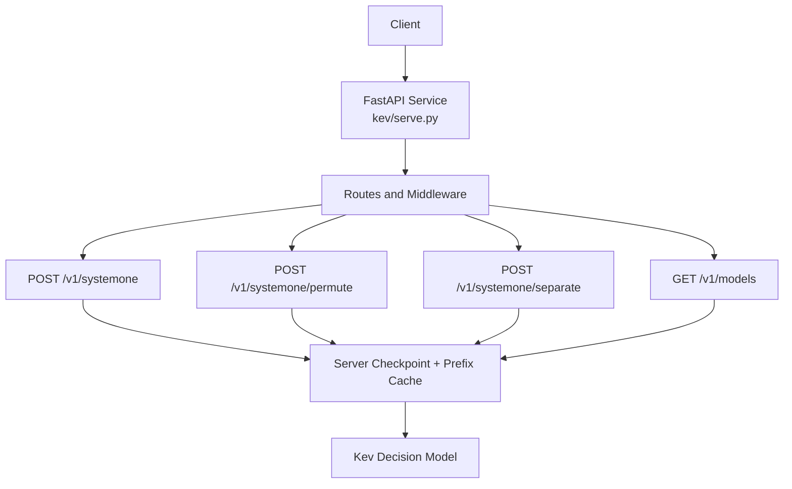
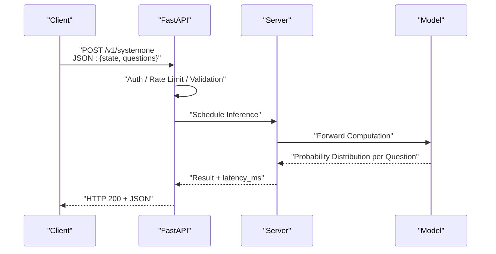
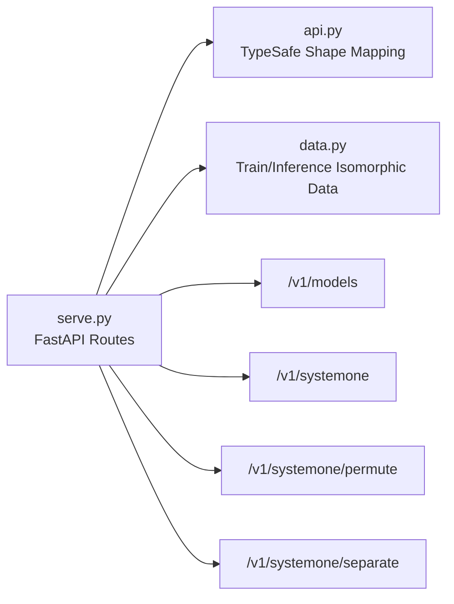

## Table of Contents
1. [Introduction](#introduction)
2. [Project Structure](#project-structure)
3. [Core Components](#core-components)
4. [Architecture Overview](#architecture-overview)
5. [Detailed Endpoint Reference](#detailed-endpoint-reference)
6. [Dependency Analysis](#dependency-analysis)
7. [Performance and Precision Notes](#performance-and-precision-notes)
8. [Error Handling and Status Codes](#error-handling-and-status-codes)
9. [Client Implementation Guide](#client-implementation-guide)
10. [Troubleshooting](#troubleshooting)
11. [Conclusion](#conclusion)

## Introduction
This document provides a complete reference for Kev's RESTful API, focusing on the following endpoints:
- POST /v1/systemone (primary inference endpoint)
- GET /v1/models (model information)
- POST /v1/systemone/permute (option-order perturbation)
- POST /v1/systemone/separate (per-question isolated forward pass)

Kev is a "decision model" service: it takes a document (state) and a set of typed questions (questions) and returns the probability distribution for each question in a single forward pass. Rather than generating text, it outputs thresholdable confidence scores, making it suitable for classification, routing, triage, or human review.

The API is compatible with TypeSafe's public System One contract and can be invoked directly via the `typesafe-sdk`.

**Section sources**
- [README.md:215-247](file://README.md#L215-L247)
- [AGENTS.md:309-334](file://AGENTS.md#L309-L334)

## Project Structure
The code related to this API mainly resides in the following modules:
- kev/api.py: defines TypeSafe-compatible request/response shapes mapped onto a single pointer primitive
- kev/serve.py: FastAPI application registering /v1/systemone, /v1/systemone/permute, /v1/systemone/separate, and /v1/models; the Server holds the checkpoint and prefix cache
- README.md: user-facing interface description and examples
- AGENTS.md: supplementary notes on authentication, additional endpoints, concurrency, and latency fields
- kev/data.py: training format aligned with the /v1/systemone request body, ensuring inference and training data are isomorphic

**Diagram sources**
- [serve.py](file://kev/serve.py)
- [api.py](file://kev/api.py)

**Section sources**
- [AGENTS.md:398](file://AGENTS.md#L398)
- [api.py](file://kev/api.py)

## Core Components
- FastAPI service layer: responsible for HTTP routing, authentication, request validation, concurrency control, and response wrapping
- Server: encapsulates model loading, forward execution, prefix cache, and runtime statistics
- Request/response shapes: follow TypeSafe's System One contract, mapping complex structures onto a single pointer primitive for efficient inference

Key responsibility division:
- Routing layer: parses URL, method, headers, and JSON body
- Business layer: constructs state/questions, schedules model inference, computes confidence and probability distributions
- Infrastructure layer: GPU/Mac device selection, bf16/fp32 precision paths, concurrency lock, and latency statistics

**Section sources**
- [AGENTS.md:398](file://AGENTS.md#L398)
- [api.py](file://kev/api.py)

## Architecture Overview
The diagram below shows the processing flow of a typical /v1/systemone request:

**Diagram sources**
- [serve.py](file://kev/serve.py)
- [api.py](file://kev/api.py)

## Detailed Endpoint Reference

### General Conventions
- Content type: application/json
- Version prefix: /v1
- Authentication: when the environment variable KEV_API_KEY is set, Bearer Token authentication is enabled; when unset, the server is open
- Response headers: every response includes x-typesafe-request-id
- Latency field: the /v1/systemone response includes latency_ms

**Section sources**
- [AGENTS.md:309-334](file://AGENTS.md#L309-L334)

### POST /v1/systemone
Purpose: receives a state and a set of questions, and returns the probability distribution and confidence for each question.

- Method: POST
- URL: /v1/systemone
- Authentication: optional (depends on whether KEV_API_KEY is set)
- Key request body fields:
  - state: string | object | array
    - string: plain-text document
    - object: structured document (key-value pairs)
    - array: array of document fragments
  - questions: array of objects, each representing one question, supporting three types: noul, choice, score
- Key response fields:
  - each question returns the probability distribution and confidence of its options
  - latency_ms: time taken for this request (milliseconds)

questions structure and criteria rules:
- noul: free-answer question with no option list (the model provides the answer and confidence)
- choice: select one or more from given options (per the specific schema)
- score: score an indicator (e.g., a Likert scale)

Notes:
- This endpoint is processed asynchronously and uses Server.lock internally for concurrency control
- Long states are batched into the eager state stage at the EAGER_STATES size

Suggestions:
- Monitor and alert on latency_ms on the client side
- Decide whether to escalate to human review based on the confidence threshold

**Section sources**
- [README.md:215-247](file://README.md#L215-L247)
- [AGENTS.md:309-334](file://AGENTS.md#L309-L334)

### GET /v1/models
Purpose: retrieves available model cards and details of the currently loaded checkpoint.

- Method: GET
- URL: /v1/models
- Authentication: same as above (affected by KEV_API_KEY)
- Response fields:
  - name: model name
  - description: model description
  - release_date: release date
  - backend: backend information
  - dtype: precision (bf16 or fp32)
  - max_state_tokens: maximum number of state tokens
  - other device and prefix-cache statistics

**Section sources**
- [README.md:245-247](file://README.md#L245-L247)
- [AGENTS.md:309-315](file://AGENTS.md#L309-L315)

### POST /v1/systemone/permute
Purpose: perturbs the option order of choice-type questions to evaluate stability and order bias.

- Method: POST
- URL: /v1/systemone/permute
- Key request body fields:
  - one choice-type question
  - n_perm: number of perturbations (1 to 64, default 6)
- Response: comparison of probability distributions across multiple perturbations, used to analyze order sensitivity

**Section sources**
- [README.md:246-247](file://README.md#L246-L247)
- [AGENTS.md:333-334](file://AGENTS.md#L333-L334)

### POST /v1/systemone/separate
Purpose: changes the packed multi-question merged forward pass into per-question isolated forward passes, making it easy to compare packed vs separate differences.

- Method: POST
- URL: /v1/systemone/separate
- Request body: same as /v1/systemone (state + questions)
- Response: results of each question's individual forward pass, convenient for comparison with packed mode

**Section sources**
- [README.md:246-247](file://README.md#L246-L247)
- [AGENTS.md:333-334](file://AGENTS.md#L333-L334)

## Dependency Analysis
- The FastAPI service dispatches to different handlers through routing
- All inference-related endpoints share a Server instance, uniformly accessing the model and prefix cache
- api.py defines TypeSafe-compatible request/response shapes, ensuring SDK compatibility
- data.py's training format is aligned with the /v1/systemone request body, ensuring inference and training data are isomorphic

**Diagram sources**
- [serve.py](file://kev/serve.py)
- [api.py](file://kev/api.py)
- [data.py](file://kev/data.py)

**Section sources**
- [api.py](file://kev/api.py)
- [data.py:389](file://kev/data.py#L389)

## Performance and Precision Notes
- Device and precision:
  - GPU and Mac default to bf16
  - switch to the fp32 path via KEV_DTYPE=fp32 to obtain numerical values consistent with published evaluations
- Probability differences:
  - on GPU, the difference between bf16 and fp32 probabilities does not exceed ~0.03
  - on Mac, the difference does not exceed ~0.05
  - the top answer changes roughly once per 300 questions
- Concurrency and latency:
  - /v1/systemone is processed asynchronously and uses Server.lock internally
  - the response includes latency_ms, which can be used for performance monitoring

**Section sources**
- [README.md:382](file://README.md#L382)
- [AGENTS.md:326-334](file://AGENTS.md#L326-L334)

## Error Handling and Status Codes
- Authentication failure: when KEV_API_KEY is enabled but a valid Bearer Token is not provided, return 401
- Invalid request body: when required fields are missing or types do not match, return 400
- Resource not found: when querying an unknown model or out-of-range parameters, return 404
- Server error: model loading failure, forward exception, etc., return 500
- Rate limiting: if a rate-limiting policy is deployed, return 429 when exceeded (requires gateway or middleware configuration)

Suggestions:
- Client should retry and back off on all non-2xx responses
- Record x-typesafe-request-id for log tracing

**Section sources**
- [AGENTS.md:309-334](file://AGENTS.md#L309-L334)

## Client Implementation Guide
- Base URL: http://127.0.0.1:8009 (local example)
- Authentication:
  - if the server has KEV_API_KEY set, include Authorization: Bearer <token> in the request header
- SDK: the typesafe-sdk can be used directly to connect to /v1/systemone without modification
- Request construction:
  - state: string | object | array
  - questions: array containing noul, choice, score question types
- Response handling:
  - read the probability distribution and confidence of each question
  - decide whether to escalate to human review based on the confidence threshold
  - record latency_ms for performance monitoring

Common use cases:
- Document classification: choice question, classify by the highest-probability option
- Scoring task: score question, judge the level by threshold
- Free Q&A: noul question, filter low-quality answers by confidence
- Order robustness: use /v1/systemone/permute to evaluate the impact of option order on results
- Mode comparison: use /v1/systemone/separate to compare packed vs separate differences

**Section sources**
- [README.md:63-247](file://README.md#L63-L247)
- [AGENTS.md:309-334](file://AGENTS.md#L309-L334)

## Troubleshooting
- Cannot connect: confirm the service is started and the port is reachable
- Authentication failure: check whether KEV_API_KEY and the Bearer Token are correct
- Invalid request body: confirm the type and required fields of state and questions
- Abnormal probability: switch KEV_DTYPE=fp32 to verify whether it is a precision-path difference
- High latency: check the concurrency lock and GPU load; scale up or optimize batching if necessary

**Section sources**
- [README.md:382](file://README.md#L382)
- [AGENTS.md:326-334](file://AGENTS.md#L326-L334)

## Conclusion
Kev's RESTful API provides stable, efficient decision-model inference and is compatible with TypeSafe's System One contract. Through /v1/systemone and its auxiliary endpoints, developers can complete tasks such as classification, scoring, free Q&A, and robustness analysis. It is recommended to implement authentication, rate limiting, retries, and monitoring on the client side, and to design a human-in-the-loop workflow based on confidence thresholds.
