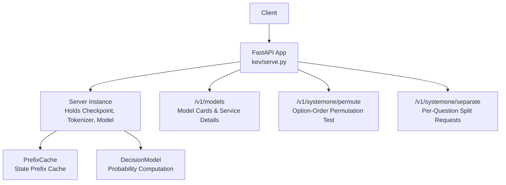
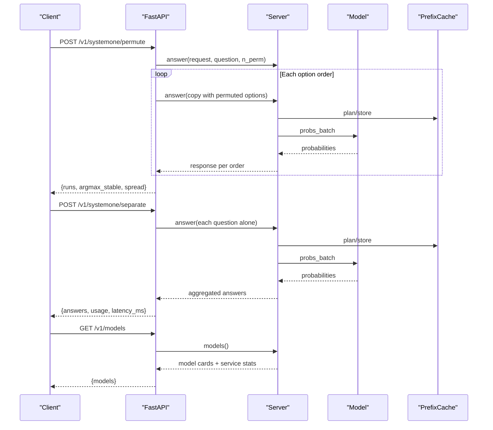
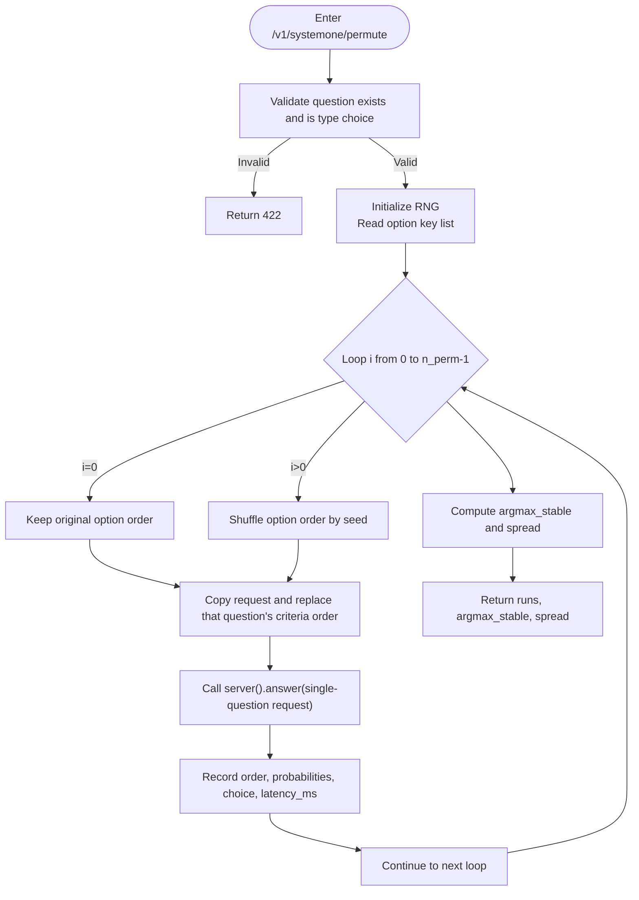
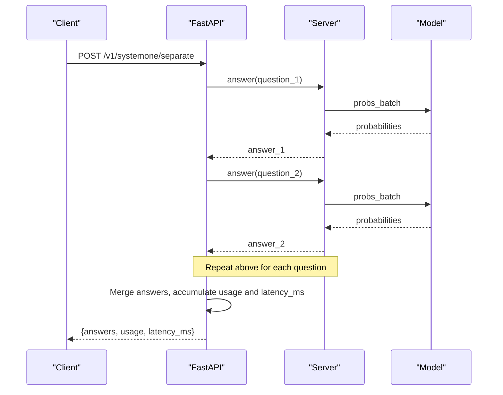
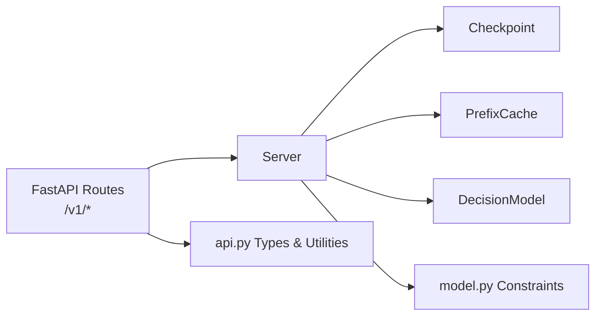

## Table of Contents
1. [Introduction](#introduction)
2. [Project Structure](#project-structure)
3. [Core Components](#core-components)
4. [Architecture Overview](#architecture-overview)
5. [Detailed Endpoint Reference](#detailed-endpoint-reference)
6. [Dependency Analysis](#dependency-analysis)
7. [Performance and Stability Notes](#performance-and-stability-notes)
8. [Troubleshooting Guide](#troubleshooting-guide)
9. [Conclusion](#conclusion)

## Introduction
This document focuses on Kev's auxiliary API endpoints, aimed at developers who need to diagnose model behavior, evaluate option-order sensitivity, and compare the differences between "packed questioning" and "per-question questioning". It covers the following three endpoints:
- `GET /v1/models`: retrieves the currently loaded model's card information, service details, and cache statistics.
- `POST /v1/systemone/permute`: runs an option-order permutation test on a single choice question, returning the probability distribution and stability metrics for each ordering.
- `POST /v1/systemone/separate`: splits the multiple questions in a single request into separate requests, making it easy to compare "packed vs separate" behavioral differences.

These endpoints are exposed by the FastAPI service and internally reuse the same inference logic, so their response structures are consistent with or extend upon the primary endpoint `/v1/systemone`.

## Project Structure
Kev's server-side implementation is located in `kev/serve.py`, which exposes FastAPI routes externally; meanwhile, the root-level `README.md` and `AGENTS.md` provide an API overview, environment variable descriptions, and usage scenarios.



**Diagram sources**
- [serve.py:228-312](file://kev/serve.py#L228-L312)

**Section sources**
- [serve.py:1-13](file://kev/serve.py#L1-L13)
- [README.md:214-249](file://README.md#L214-L249)
- [AGENTS.md:308-337](file://AGENTS.md#L308-L337)

## Core Components
- **Server**: encapsulates the loaded Checkpoint, Tokenizer, and Model, maintains a background thread for batched inference, and manages the state prefix cache and CUDA Graph capture.
- **PrefixCache**: an LRU-style state prefix cache that limits the maximum number of states and total tokens, avoiding OOM and improving throughput for repeated states.
- **Routing layer**: provides `/v1/systemone`, `/v1/systemone/permute`, `/v1/systemone/separate`, and `/v1/models`.
- **Authentication and header fields**: optional Bearer authentication; all responses carry `x-typesafe-request-id` and `server-timing`.

**Section sources**
- [serve.py:38-121](file://kev/serve.py#L38-L121)
- [serve.py:228-242](file://kev/serve.py#L228-L242)

## Architecture Overview
The diagram below shows the call paths of the auxiliary endpoints: the client request enters FastAPI, the route parses parameters and then calls `Server.answer` or combines multiple `Server.answer` calls, finally returning a TypeSafe-compatible response body.



**Diagram sources**
- [serve.py:255-312](file://kev/serve.py#L255-L312)

## Detailed Endpoint Reference

### `GET /v1/models`
Used to retrieve the currently loaded model's card information and service details.

- **Purpose**
  - View the model name, description, and release date.
  - View the backend device, backend type (torch/MLX), and precision (bf16/fp32).
  - View the temperature, maximum state length, whether truncation is enabled, CUDA Graph statistics, prefix cache statistics, batch counts, etc.

- **Request example**
  ```bash
  curl -s http://127.0.0.1:8009/v1/models
  ```

- **Response fields**
  - `models`: an array containing card objects for two model names:
    - `name`: `kev-latest` or `jev-latest`.
    - `description`: description based on the base model and the run information of the request.
    - `release_date`: release date.
    - `run`: the loaded run identifier or Hub version.
    - `base`: base model name.
    - `lora`: LoRA metadata.
    - `device`: device name.
    - `backend`: backend type.
    - `dtype`: inference precision.
    - `temperature`: the pointer head's temperature.
    - `max_state_tokens`: maximum number of state tokens.
    - `truncate_states`: whether truncation of over-long states is allowed.
    - `cuda_graphs`: CUDA Graph statistics (if enabled).
    - `prefix_cache`: prefix cache configuration and hit statistics.
    - `batches`: batch count, request count, queue length.

- **Usage scenarios**
  - Post-deployment self-check: confirm the model, device, precision, temperature, and prefix cache status.
  - Client adaptation: adjust input strategy based on `max_state_tokens` and `truncate_states`.
  - Performance observation: judge cache hit rate and throughput pressure through `prefix_cache` and `batches`.

- **Error handling**
  - This endpoint is a read-only query and usually does not fail due to business data; if the service is not started or authentication fails, an HTTP error is returned.

**Section sources**
- [serve.py:298-312](file://kev/serve.py#L298-L312)
- [README.md:245-246](file://README.md#L245-L246)
- [AGENTS.md:308-318](file://AGENTS.md#L308-L318)

---

### `POST /v1/systemone/permute`
Runs an option-order permutation test on a single choice question, supports controlling the number of permutations, and returns the probability distribution and stability analysis for each ordering.

- **Purpose**
  - Detect a choice question's sensitivity to option order.
  - Observe the magnitude of probability distribution changes across different orderings.
  - Judge whether the majority answer is stable.

- **Request body fields**
  - `request`: a TypeSafe-style SystemOne request, which must contain at least one `choice`-type question.
  - `question`: the ID of the question to test.
  - `n_perm`: number of permutations, ranging from 1 to 64, default 6.
  - `seed`: random seed, default 0, used to reproduce experiments.

- **Request example**
  ```bash
  curl -s http://127.0.0.1:8009/v1/systemone/permute \
    -H 'content-type: application/json' \
    -d '{
      "request": {
        "model": "kev-latest",
        "state": "鞋子晚到了两周且尺码不对，另外我卡上出现了两笔扣款。",
        "questions": {
          "department": {
            "type": "choice",
            "instructions": "应该由哪个团队处理？",
            "criteria": {
              "returns": "退换货、退款、错发或损坏商品",
              "shipping": "配送状态、延迟、丢件",
              "billing": "扣款、发票、支付问题"
            }
          }
        }
      },
      "question": "department",
      "n_perm": 6,
      "seed": 0
    }'
  ```

- **Response fields**
  - `runs`: an array, each item corresponding to one option ordering:
    - `order`: the option order used in that run.
    - `probabilities`: the option probability distribution under that ordering.
    - `choice`: the highest-probability option under that ordering.
    - `latency_ms`: the inference time of that run.
  - `argmax_stable`: a boolean indicating whether the top answer is consistent across all orderings.
  - `spread`: the difference between the maximum and minimum probability of each option across all orderings, reflecting order sensitivity.

- **Usage scenarios**
  - Choice-question robustness evaluation: if `argmax_stable` is false or some options have a large `spread`, it means the model is sensitive to the option order of that question.
  - Prompt engineering and evaluation: run systematic experiments combining different `n_perm` and `seed`.
  - Used together with `/v1/systemone/separate`: observe the option-order effect first, then the packed vs separate effect.

- **Edge cases and error handling**
  - If the specified `question` does not exist or is not a `choice` type, return 422.
  - `n_perm` outside the 1–64 range is rejected.
  - When `n_perm` is large, each ordering is a complete forward pass, so the total time and memory usage grow linearly with `n_perm`.



**Diagram sources**
- [serve.py:255-275](file://kev/serve.py#L255-L275)

**Section sources**
- [serve.py:255-275](file://kev/serve.py#L255-L275)
- [README.md:246-247](file://README.md#L246-L247)
- [AGENTS.md:333-335](file://AGENTS.md#L333-L335)

---

### `POST /v1/systemone/separate`
Splits the multiple questions in a single request into separate requests for comparison testing.

- **Purpose**
  - Compare the differences between "packed questioning" and "per-question questioning".
  - Observe the mutual influence when multiple questions share a state.
  - Tally the total tokens and total time after splitting.

- **Request body fields**
  - `request`: a TypeSafe-style SystemOne request, which may contain any number of questions.

- **Request example**
  ```bash
  curl -s http://127.0.0.1:8009/v1/systemone/separate \
    -H 'content-type: application/json' \
    -d '{
      "model": "kev-latest",
      "state": "鞋子晚到了两周且尺码不对，另外我卡上出现了两笔扣款。",
      "questions": {
        "department": {
          "type": "choice",
          "instructions": "应该由哪个团队处理？",
          "criteria": {
            "returns": "退换货、退款、错发或损坏商品",
            "shipping": "配送状态、延迟、丢件",
            "billing": "扣款、发票、支付问题"
          }
        },
        "escalate": {
          "type": "noul",
          "instructions": "是否需要紧急人工关注？"
        }
      }
    }'
  ```

- **Response fields**
  - `model`: model name.
  - `answers`: the answer object for each question ID, with a structure consistent with the answers of `/v1/systemone`.
  - `usage`:
    - `input_tokens`: the sum of the input_tokens of each split request.
    - `output_tokens`: the total number of tokens after serializing all answers.
  - `latency_ms`: the sum of the `latency_ms` of each split request.
  - If the server has state truncation enabled, it also carries `truncated` and `usage.state_tokens`, `usage.state_tokens_used`.

- **Usage scenarios**
  - Packed vs separate comparison: first obtain the packed result with `/v1/systemone`, then the split result with `/v1/systemone/separate`, and compare answers and probabilities item by item.
  - Isolation diagnosis: if answers change noticeably after splitting, it suggests possible interaction or context interference between questions.
  - Cost estimation: estimate the extra overhead of splitting via the accumulated `latency_ms` and `usage.input_tokens`.

- **Edge cases and error handling**
  - If the request is empty or has no valid questions, behavior depends on the underlying `/v1/systemone` validation.
  - Splitting issues N inferences, where N is the number of questions; when there are many questions, total time and token consumption increase significantly.
  - If the server has `KEV_TRUNCATE_STATES=1` enabled, the split result inherits the truncation flag.



**Diagram sources**
- [serve.py:278-286](file://kev/serve.py#L278-L286)

**Section sources**
- [serve.py:278-286](file://kev/serve.py#L278-L286)
- [README.md:247-248](file://README.md#L247-L248)
- [AGENTS.md:333-335](file://AGENTS.md#L333-L335)

---

### Common Behavior and Header Fields
- **Authentication**
  - If `KEV_API_KEY` is set, all `/v1/*` requests need to carry `Authorization: Bearer <key>`.
  - When not set, it is an open service, suitable for local debugging.

- **Response headers**
  - `x-typesafe-request-id`: a unique identifier for each request, convenient for tracing.
  - `server-timing`: in-process time, used to distinguish network time from processing time.

- **Status codes**
  - 200: normal response.
  - 401: missing or invalid API Key.
  - 422: malformed request or input out of range, e.g., a non-choice question passed to `/permute`, or a state that is too long and truncation is not enabled.
  - 503: service is shutting down.

**Section sources**
- [serve.py:232-242](file://kev/serve.py#L232-L242)
- [serve.py:132-145](file://kev/serve.py#L132-L145)
- [README.md:250-258](file://README.md#L250-L258)

## Dependency Analysis
The auxiliary endpoints depend on the following modules and concepts:
- **FastAPI routes**: define `/v1/systemone`, `/v1/systemone/permute`, `/v1/systemone/separate`, `/v1/models`.
- **Server**: uniformly encapsulates the inference flow, cache management, and concurrency control.
- **Checkpoint / LoadOptions**: determine the model loading method, device, precision, CUDA Graph, fused kernels, etc.
- **api.py data structures**: SystemOneRequest, to_record, to_answers, output_tokens, with_date_facts.
- **model.py constraints**: SERVE_MAX_STATE, ContextOverflow, admit.



**Diagram sources**
- [serve.py:22-26](file://kev/serve.py#L22-L26)
- [serve.py:93-220](file://kev/serve.py#L93-L220)

**Section sources**
- [serve.py:22-26](file://kev/serve.py#L22-L26)
- [serve.py:93-220](file://kev/serve.py#L93-L220)

## Performance and Stability Notes
- **Cost of option permutation tests**
  - The larger the `n_perm` of `/v1/systemone/permute`, the more forward passes. It is recommended to start with a smaller `n_perm` and gradually increase it.
  - Using a fixed `seed` ensures reproducible results.

- **Cost of split requests**
  - `/v1/systemone/separate` issues one inference per question, so the total time is approximately the sum of each question's time.
  - For a large number of questions, it is recommended to first evaluate the performance of the packed request before deciding whether to split.

- **State prefix cache**
  - Repeated states are cached, reducing repeated encoding cost.
  - You can observe hit statistics via `prefix_cache` in `/v1/models`.

- **State truncation**
  - By default, a state exceeding `SERVE_MAX_STATE` returns 422.
  - After setting `KEV_TRUNCATE_STATES=1`, the server reads the first `SERVE_MAX_STATE` tokens and marks `truncated` in the response.

- **Precision and backend**
  - By default, bf16 is used on GPU, which can be switched to the fp32 path via `KEV_DTYPE=fp32`.
  - You can confirm the actual runtime environment via `backend` and `dtype` in `/v1/models`.

**Section sources**
- [serve.py:27-34](file://kev/serve.py#L27-L34)
- [serve.py:172-191](file://kev/serve.py#L172-L191)
- [serve.py:289-295](file://kev/serve.py#L289-L295)
- [README.md:252-258](file://README.md#L252-L258)

## Troubleshooting Guide
- **422 error: non-choice question passed to `/permute`**
  - Check whether `question` exists in `request.questions`.
  - Check whether that question's `type` is `choice`.

- **422 error: state too long**
  - If `KEV_TRUNCATE_STATES=1` is not enabled, an over-long state is rejected.
  - After enabling truncation, note the `truncated` and `usage.state_tokens_used` in the response.

- **401 error: missing or invalid API Key**
  - If `KEV_API_KEY` is set, ensure the request header contains the correct `Authorization: Bearer <key>`.

- **503 error: service is shutting down**
  - Usually occurs while the service is shutting down, and new requests are rejected.

- **Performance anomaly**
  - Check `prefix_cache` and `batches` in `/v1/models`.
  - Check whether CUDA Graph, fused kernels, and the correct precision are enabled.

**Section sources**
- [serve.py:132-145](file://kev/serve.py#L132-L145)
- [serve.py:232-242](file://kev/serve.py#L232-L242)
- [serve.py:255-275](file://kev/serve.py#L255-L275)
- [serve.py:298-312](file://kev/serve.py#L298-L312)

## Conclusion
Kev's auxiliary endpoints provide practical tools for model diagnosis and evaluation:
- `/v1/models` helps confirm the model and service environment.
- `/v1/systemone/permute` helps evaluate a choice question's sensitivity to option order.
- `/v1/systemone/separate` helps compare the differences between packed and separate questioning.

When using them, pay attention to the performance cost brought by `n_perm` and the number of questions, and combine the output of `/v1/models` to monitor cache hit rate, device, and precision. When encountering errors such as 422, 401, or 503, first check the request structure, authentication configuration, and service status.
