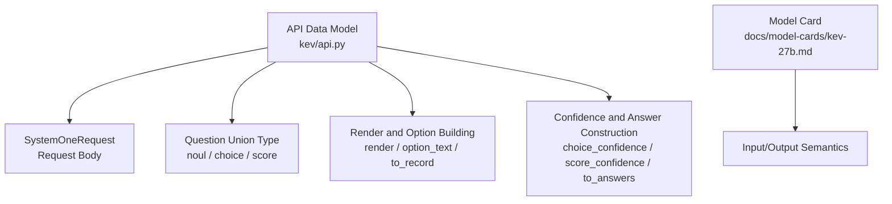
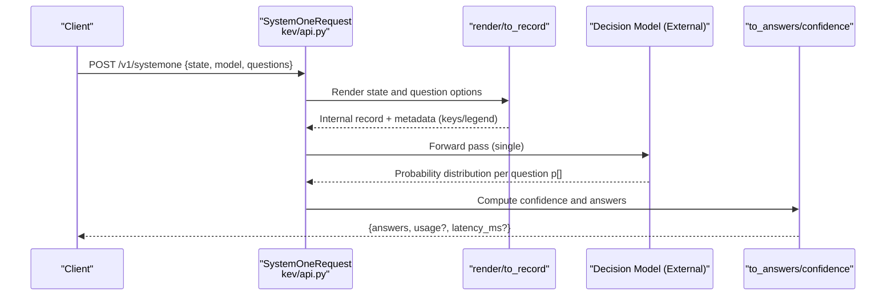
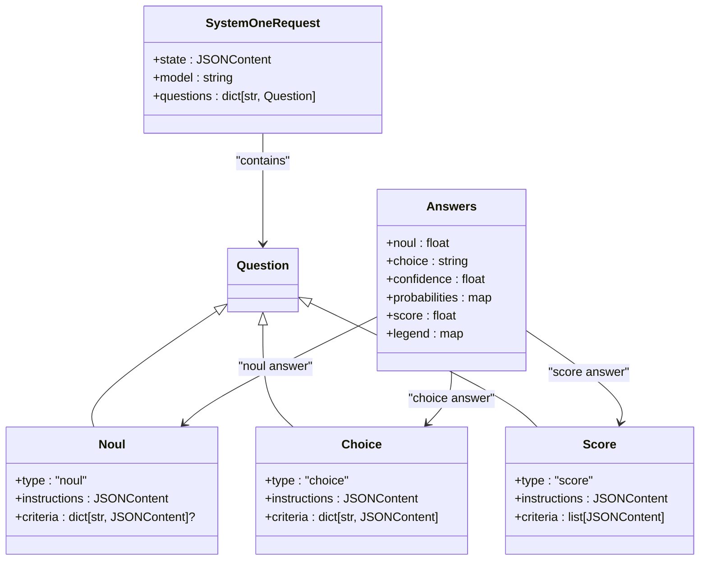

## Table of Contents
1. [Introduction](#introduction)
2. [Project Structure](#project-structure)
3. [Core Components](#core-components)
4. [Architecture Overview](#architecture-overview)
5. [Detailed Component Analysis](#detailed-component-analysis)
6. [Dependency Analysis](#dependency-analysis)
7. [Performance and Precision Notes](#performance-and-precision-notes)
8. [Troubleshooting Guide](#troubleshooting-guide)
9. [Conclusion](#conclusion)
10. [Appendix: Complete Data Structure Examples](#appendix-complete-data-structure-examples)

## Introduction
This document covers the data model of the Kev API, focusing on the SystemOneRequest request body, the three forms of state, the structure and validation rules of questions, and the answers, usage, and latency_ms fields in the response. The document also explains the meaning of confidence computation, probability distributions, and statistics, and provides complete, ready-to-use data structure examples and field descriptions for integration.

Kev is a "decision model" interface: it takes a state and a set of typed questions and returns the calibrated probability distribution for each question in a single forward pass, without generating free text. The interface is compatible with TypeSafe's System One API (POST /v1/systemone).

**Section sources**
- [kev-27b.md:82-110](file://docs/model-cards/kev-27b.md#L82-L110)

## Project Structure
The API data model definitions of this project are concentrated in kev/api.py, including the request body, question types, rendering logic, answer construction, confidence computation, and serialization. The model card docs/model-cards/kev-27b.md provides business-level supplementary explanations of input/output semantics.

**Diagram sources**
- [api.py:17-46](file://kev/api.py#L17-L46)
- [api.py:49-117](file://kev/api.py#L49-L117)
- [api.py:120-160](file://kev/api.py#L120-L160)
- [kev-27b.md:102-110](file://docs/model-cards/kev-27b.md#L102-L110)

**Section sources**
- [api.py:1-166](file://kev/api.py#L1-L166)
- [kev-27b.md:82-110](file://docs/model-cards/kev-27b.md#L82-L110)

## Core Components
- SystemOneRequest: the request body, containing state, model, and questions.
- Question union type:
  - noul: binary judgment (yes/no), criteria optional and a map keyed by false/true.
  - choice: multi-select classification, criteria is a key-value pair where keys are option names and values are optional descriptions; the number of options is limited to 1–255.
  - score: ordered-level scoring, criteria is an ordered list, length 1–255.
- JSONContent: the common type for state and criteria values, supporting string, object, array, number, boolean, and null.
- Renderer render: flattens str/object/array into model-visible text, preserving field names as labels.
- Option building option_text: concatenates an option name with an optional description into model-visible option text.
- to_record: converts the request into an internal record with per-question metadata (id, type, keys, legend).
- Confidence functions:
  - choice_confidence: normalized confidence based on the deviation of the maximum probability from the uniform distribution.
  - score_confidence: confidence based on the absolute deviation between the expected level and the most likely level.
- to_answers: constructs the final answers from the probability distribution, including choice/noul/score answer types.

**Section sources**
- [api.py:13-46](file://kev/api.py#L13-L46)
- [api.py:49-117](file://kev/api.py#L49-L117)
- [api.py:120-160](file://kev/api.py#L120-L160)

## Architecture Overview
The diagram below shows the key data flow from request to response: the client sends a SystemOneRequest, the server parses and renders the state and questions, computes the probability distribution, then constructs answers and returns them.

**Diagram sources**
- [api.py:43-46](file://kev/api.py#L43-L46)
- [api.py:49-117](file://kev/api.py#L49-L117)
- [api.py:120-160](file://kev/api.py#L120-L160)

## Detailed Component Analysis

### SystemOneRequest Request Body
- state: JSONContent, may be a string, object, or array.
  - String: direct text.
  - Object: structured data, rendered into text with field names.
  - Array: mixed content, rendered into indented list items.
- model: string, defaults to "kev-latest".
- questions: a dictionary with at least one question; keys are question IDs and values are the Question union type.

Validation rules:
- questions is non-empty (min_length=1).
- choice's criteria option count must be between 1–255.
- score's criteria list length must be between 1–255.
- noul's criteria is optional; if provided, it should be a map containing false/true keys.

**Section sources**
- [api.py:17-46](file://kev/api.py#L17-L46)
- [kev-27b.md:102-110](file://docs/model-cards/kev-27b.md#L102-L110)

### Three Types of the state Field
- String state: direct text, suitable for short context.
- Object state: structured data, field names are preserved as labels in the rendered text, helping the model understand hierarchy.
- Array state: mixed content, each item rendered as a list entry, suitable for multiple pieces of information or item collections.

Rendering behavior:
- Object: output "key: value" line by line, recursively indenting sub-objects/arrays.
- Array: output "- value" per item, recursively indenting sub-objects/arrays.
- Scalar: directly converted to string.

**Section sources**
- [api.py:49-55](file://kev/api.py#L49-L55)
- [kev-27b.md:102-110](file://docs/model-cards/kev-27b.md#L102-L110)

### questions Object Structure and criteria Format
- noul:
  - type = "noul"
  - instructions: optional, guidance.
  - criteria: optional, keys "false"/"true", values are optional descriptions.
  - Output: p(true), i.e., the probability of yes.
- choice:
  - type = "choice"
  - instructions: optional, guidance.
  - criteria: required, keys are option names, values are optional descriptions; number of options 1–255.
  - Output: the most likely option name, along with its probability distribution and confidence.
- score:
  - type = "score"
  - instructions: optional, guidance.
  - criteria: required, an ordered list of level descriptions, length 1–255.
  - Output: expected level index (probability-weighted average), level legend, probability distribution, and confidence.

Option text construction:
- If the description is empty or None, only the option name is shown.
- Otherwise, show "option name: description".

**Section sources**
- [api.py:17-40](file://kev/api.py#L17-L40)
- [api.py:58-59](file://kev/api.py#L58-L59)
- [api.py:94-117](file://kev/api.py#L94-L117)
- [kev-27b.md:102-110](file://docs/model-cards/kev-27b.md#L102-L110)

### Confidence Computation and Probability Distribution
- Probability normalization: divide all probabilities by their sum; if the sum is 0, fall back to a uniform distribution.
- choice_confidence:
  - Formula: (max(p) - 1/K) / (1 - 1/K), where K is the number of options.
  - Range: [0, 1]; 0 for a uniform distribution, 1 for a single option or full certainty.
- score_confidence:
  - With L levels as the interval, mode is the most likely level index.
  - D is the mean absolute deviation of the uniform distribution over [0, L-1].
  - Formula: max(0, 1 - E|level - mode| / D).
  - Range: [0, 1]; 1 when all mass is concentrated on one level, 0 when uniform or extremely dispersed.
- Probability serialization: rounded to four decimal places, ensuring that the error between sum(p) and 1 is below 0.02 for 255 options.

**Section sources**
- [api.py:120-146](file://kev/api.py#L120-L146)

### Answer Construction with answers, usage, latency_ms
- answers: a dictionary organized by question ID, each question containing:
  - noul: {"type": "noul", "noul": p(true)}
  - choice: {"type": "choice", "choice": most likely option name, "confidence": confidence, "probabilities": {option name: probability}}
  - score: {"type": "score", "score": expected level (float), "legend": {level index: level description}, "probabilities": {index: probability}, "confidence": confidence}
- usage: not explicitly populated in the current implementation; if billing or usage statistics are needed, it can be extended at the service layer.
- latency_ms: not explicitly populated in the current implementation; if latency statistics are needed, it can be extended at the service layer.
- output_tokens: used to estimate "the number of tokens after answer serialization", not a generated-token count.

**Section sources**
- [api.py:149-160](file://kev/api.py#L149-L160)
- [api.py:163-166](file://kev/api.py#L163-L166)

## Dependency Analysis
- SystemOneRequest depends on the Question union type (noul/choice/score).
- to_record depends on render, option_text, and question_keys, used to build the internal record and metadata.
- to_answers depends on choice_confidence, score_confidence, and round_prob, used to construct the final answers.
- The model card document provides business-level constraints on input/output semantics, consistent with the code implementation.

**Diagram sources**
- [api.py:17-46](file://kev/api.py#L17-L46)
- [api.py:149-160](file://kev/api.py#L149-L160)

**Section sources**
- [api.py:17-46](file://kev/api.py#L17-L46)
- [api.py:149-160](file://kev/api.py#L149-L160)

## Performance and Precision Notes
- Single forward pass: the model computes the shared state only once, with multiple questions branching in parallel, avoiding redundant computation.
- Context length: the service supports states up to 65,536 tokens, reserving at least 8,192 tokens of space for each question.
- Calibration temperature: a calibration temperature is applied by default; it can be disabled via an environment variable to obtain raw probabilities.
- Throughput and memory: see the serving parity table in the model card for specific values.

**Section sources**
- [kev-27b.md:94-96](file://docs/model-cards/kev-27b.md#L94-L96)
- [kev-27b.md:102-110](file://docs/model-cards/kev-27b.md#L102-L110)
- [kev-27b.md:261-270](file://docs/model-cards/kev-27b.md#L261-L270)

## Troubleshooting Guide
- Option count out of range:
  - choice's criteria must have 1–255 options; exceeding this raises a validation error.
  - score's criteria list length must be 1–255; exceeding this raises a validation error.
- Abnormal probability distribution:
  - If all probabilities are 0, the system falls back to a uniform distribution; check whether the input is missing valid evidence.
- Confidence of 0:
  - choice: confidence approaches 0 when the distribution is close to uniform.
  - score: confidence approaches 0 when the distribution is extremely dispersed or uniform.
- Missing answer fields:
  - usage and latency_ms are not populated in the current implementation; if you need them, add them yourself at the service layer.

**Section sources**
- [api.py:28-37](file://kev/api.py#L28-L37)
- [api.py:120-146](file://kev/api.py#L120-L146)
- [api.py:149-160](file://kev/api.py#L149-L160)

## Conclusion
Kev's SystemOneRequest data model carries flexible state through a unified JSONContent and covers binary judgment, multi-select classification, and ordered scoring scenarios with three question types. The computation of confidence and probability distributions follows the TypeSafe reference implementation, ensuring thresholdability and calibratability. The answers structure is clear, facilitating downstream automated processing; usage and latency_ms can be extended at the service layer to meet billing and monitoring needs.

## Appendix: Complete Data Structure Examples

### Request Example (SystemOneRequest)
- state: string, object, or array all accepted.
- model: defaults to "kev-latest".
- questions: at least one, of type noul/choice/score.

Example points:
- choice's criteria is a key-value pair, keys are option names, values are optional descriptions.
- score's criteria is an ordered list of level descriptions.
- noul's criteria is optional, keys "false"/"true".

**Section sources**
- [api.py:17-46](file://kev/api.py#L17-L46)
- [kev-27b.md:102-110](file://docs/model-cards/kev-27b.md#L102-L110)

### Response Example (answers)
- noul: {"type": "noul", "noul": probability}
- choice: {"type": "choice", "choice": option name, "confidence": confidence, "probabilities": {option name: probability}}
- score: {"type": "score", "score": expected level, "legend": {index: level description}, "probabilities": {index: probability}, "confidence": confidence}

usage and latency_ms: not populated in the current implementation, can be extended at the service layer.

**Section sources**
- [api.py:149-160](file://kev/api.py#L149-L160)
