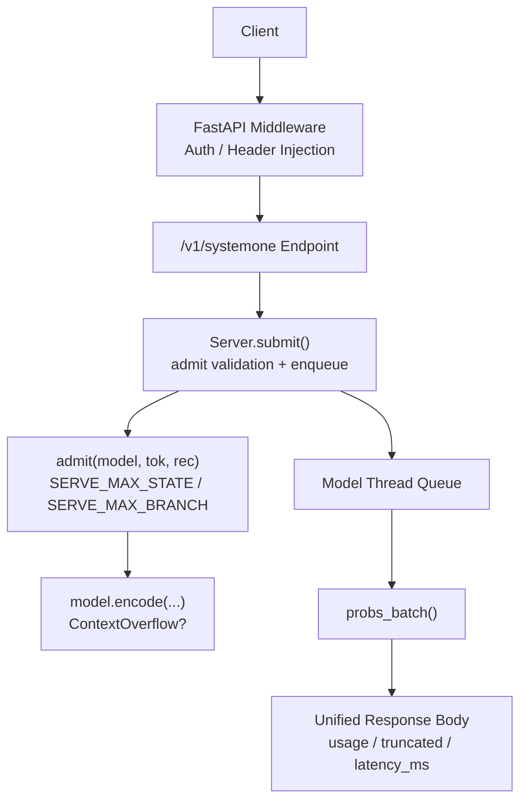
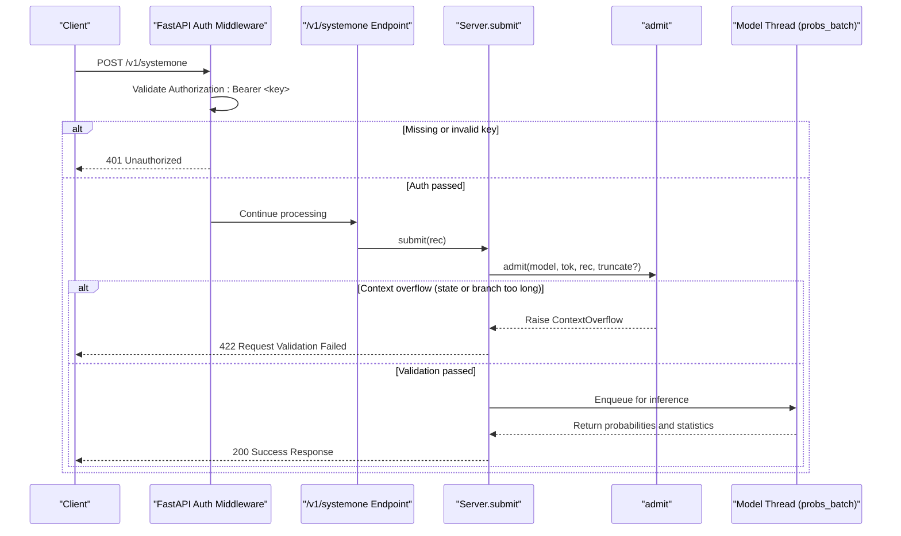
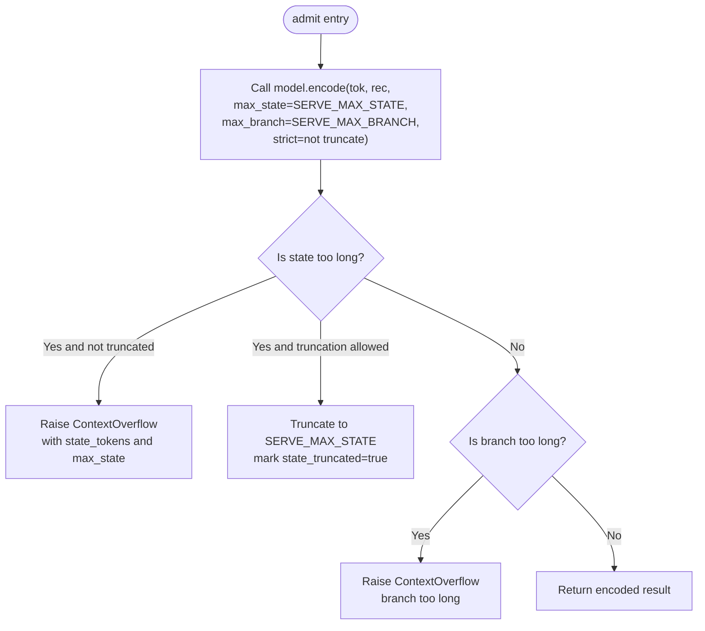
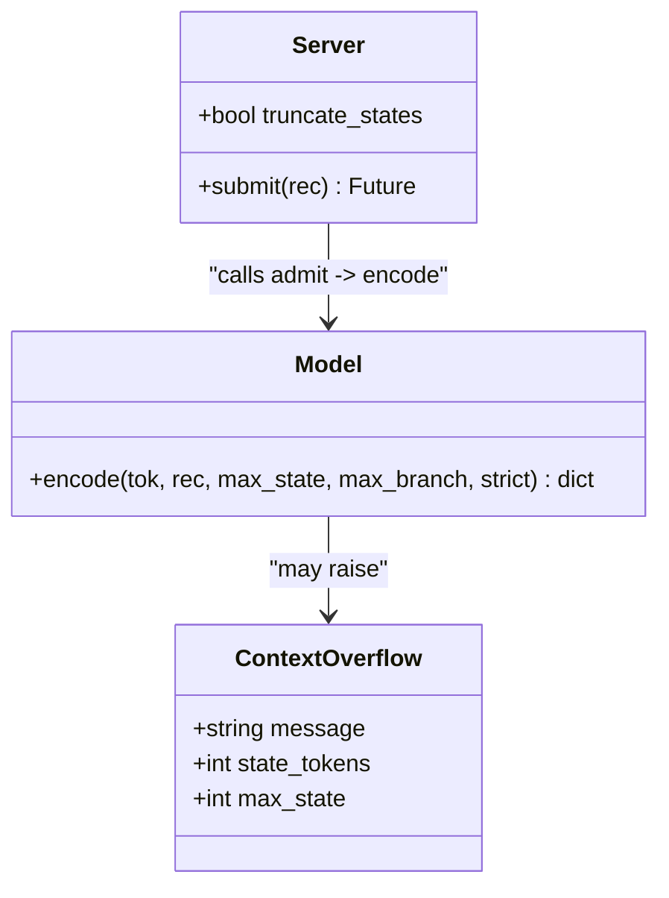
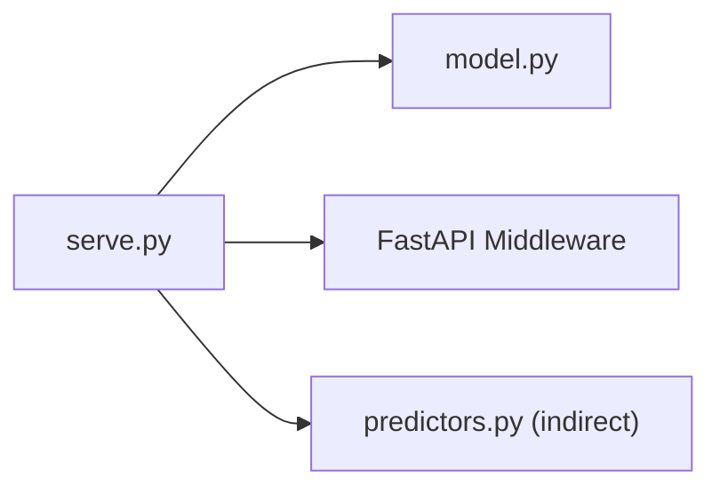

## Table of Contents
1. [Introduction](#introduction)
2. [Project Structure](#project-structure)
3. [Core Components](#core-components)
4. [Architecture Overview](#architecture-overview)
5. [Detailed Component Analysis](#detailed-component-analysis)
6. [Dependency Analysis](#dependency-analysis)
7. [Performance and Capacity Limits](#performance-and-capacity-limits)
8. [Diagnosis and Troubleshooting Guide](#diagnosis-and-troubleshooting-guide)
9. [Conclusion](#conclusion)

## Introduction
This document covers the error-handling mechanism of the Kev API, focusing on the following aspects:
- HTTP status code meanings: 401 (authentication failure), 422 (request validation failure), 503 (service stopped).
- Common error messages: context overflow, state length exceeded, question branch too long, etc.
- The validation logic of the `admit` function, including the SERVE_MAX_STATE and SERVE_MAX_BRANCH limits.
- How the ContextOverflow exception is handled, and the behavior of truncation mode KEV_TRUNCATE_STATES=1.
- Error diagnosis and troubleshooting suggestions to help quickly locate and fix problems.

## Project Structure
Kev's API error handling mainly involves two modules:
- kev.model: defines the context upper-bound constants, encoding and validation logic, and the ContextOverflow exception.
- kev.serve: the FastAPI server entry point, responsible for authentication, request enqueueing, calling admit validation, and returning a unified response body and error code.

**Diagram sources**
- [serve.py:232-242](file://kev/serve.py#L232-L242)
- [serve.py:249-252](file://kev/serve.py#L249-L252)
- [serve.py:132-145](file://kev/serve.py#L132-L145)
- [model.py:130-143](file://kev/model.py#L130-L143)

**Section sources**
- [serve.py:1-13](file://kev/serve.py#L1-L13)
- [model.py:15-28](file://kev/model.py#L15-L28)

## Core Components
- ContextOverflow: indicates that a record cannot be encoded within the given context (state or branch too long), used to raise a structured error message to the upper layer.
- admit: the server-side "admission" validation function that strictly checks the request based on SERVE_MAX_STATE and SERVE_MAX_BRANCH; supports an optional truncation strategy.
- Server.submit: hands the request to admit for validation; if it fails, returns 422 directly; if it passes, it enters the model thread queue for inference.
- FastAPI auth middleware: when KEV_API_KEY is set, performs Bearer authentication on /v1/* paths; on failure returns 401.

**Section sources**
- [model.py:50-58](file://kev/model.py#L50-L58)
- [model.py:130-143](file://kev/model.py#L130-L143)
- [serve.py:132-145](file://kev/serve.py#L132-L145)
- [serve.py:232-242](file://kev/serve.py#L232-L242)

## Architecture Overview
The diagram below shows the flow of a typical request from arriving at FastAPI to returning a result, and how error branches are captured and mapped to HTTP status codes.

**Diagram sources**
- [serve.py:232-242](file://kev/serve.py#L232-L242)
- [serve.py:249-252](file://kev/serve.py#L249-L252)
- [serve.py:132-145](file://kev/serve.py#L132-L145)
- [model.py:130-143](file://kev/model.py#L130-L143)

## Detailed Component Analysis

### HTTP Status Codes and Error Semantics
- 401 Unauthorized
  - Trigger: KEV_API_KEY is set, but the request does not carry the correct Authorization: Bearer <key>.
  - Behavior: the FastAPI middleware returns 401 directly and attaches www-authenticate: Bearer in the response header.
- 422 Request Validation Failed
  - Trigger: admit validation fails, e.g., the state exceeds SERVE_MAX_STATE or a question branch exceeds SERVE_MAX_BRANCH.
  - Behavior: the server returns 422, and the error message includes the specific reason and a fix suggestion; if the state is too long, it also hints that truncation mode can be enabled via KEV_TRUNCATE_STATES=1.
- 503 Service Stopped
  - Trigger: Server.close has been called, and the service is stopping or stopped.
  - Behavior: submit returns 503 directly, indicating "the server is stopping".

**Section sources**
- [serve.py:232-242](file://kev/serve.py#L232-L242)
- [serve.py:138-142](file://kev/serve.py#L138-L142)

### Validation Logic of the admit Function
admit is the server-side core "admission" function, responsible for converting the request into a model-acceptable encoding and applying the following limits:
- SERVE_MAX_STATE: the maximum number of state tokens (including the <state> token).
- SERVE_MAX_BRANCH: the row budget for a single question (state + that question's branch tokens).
- strict parameter: strict mode by default, raising ContextOverflow when exceeded; when truncate=True, it allows truncating the state to SERVE_MAX_STATE and marking state_truncated and state_tokens in the encoding result.

**Diagram sources**
- [model.py:130-143](file://kev/model.py#L130-L143)
- [model.py:87-127](file://kev/model.py#L87-L127)

**Section sources**
- [model.py:15-28](file://kev/model.py#L15-L28)
- [model.py:87-127](file://kev/model.py#L87-L127)
- [model.py:130-143](file://kev/model.py#L130-L143)

### ContextOverflow Exception and Truncation Mode
- ContextOverflow inherits from ValueError and includes additional fields:
  - state_tokens: the token count of the state (including <state>).
  - max_state: the limit value.
- Truncation mode KEV_TRUNCATE_STATES=1:
  - The server reads the environment variable TRUNCATE_STATES at startup.
  - Once enabled, admit calls encode with truncate=True, allowing an over-long state to be truncated to SERVE_MAX_STATE.
  - Each response carries usage.state_tokens and usage.state_tokens_used, plus a truncated flag indicating whether truncation occurred.

**Diagram sources**
- [model.py:50-58](file://kev/model.py#L50-L58)
- [serve.py:31-33](file://kev/serve.py#L31-L33)
- [serve.py:108-145](file://kev/serve.py#L108-L145)

**Section sources**
- [model.py:50-58](file://kev/model.py#L50-L58)
- [serve.py:31-33](file://kev/serve.py#L31-L33)
- [serve.py:108-145](file://kev/serve.py#L108-L145)

### Common Error Messages and Their Meanings
- "state exceeds ... tokens: ..."
  - Meaning: the number of state tokens exceeds SERVE_MAX_STATE.
  - Fix suggestion: shorten the document or split a long document across multiple requests; or enable KEV_TRUNCATE_STATES=1 on the server.
- "branch too long: ... tokens with a ...-token state (row limit ...)"
  - Meaning: a single question's branch is too long, causing the entire row (state + branch) to exceed SERVE_MAX_BRANCH.
  - Fix suggestion: simplify the question instructions or option descriptions to reduce branch length.
- "packed request exceeds the ...-token limit"
  - Meaning: the packed request exceeds the internal packed limit (more common on the predictor side, not the server's main path).
  - Fix suggestion: reduce the number of questions per request or simplify the input.

**Section sources**
- [model.py:102-113](file://kev/model.py#L102-L113)
- [model.py:138-142](file://kev/model.py#L138-L142)
- [predictors.py:129](file://kev/predictors.py#L129)

## Dependency Analysis
- serve.py depends on admit, ContextOverflow, and SERVE_MAX_STATE in model.py.
- The FastAPI middleware intercepts authentication on /v1/* paths and returns 401 on failure.
- Server.submit calls admit for validation, returning 422 on failure; on success, it enqueues the request for the model thread to execute probs_batch.
- The response body is uniformly constructed by _body, containing answers, usage, latency_ms, and, in truncation mode, the additional truncated and state_tokens/state_tokens_used fields.

**Diagram sources**
- [serve.py:23-25](file://kev/serve.py#L23-L25)
- [serve.py:232-242](file://kev/serve.py#L232-L242)
- [serve.py:132-145](file://kev/serve.py#L132-L145)

**Section sources**
- [serve.py:23-25](file://kev/serve.py#L23-L25)
- [serve.py:232-242](file://kev/serve.py#L232-L242)
- [serve.py:132-145](file://kev/serve.py#L132-L145)

## Performance and Capacity Limits
- State upper bound: SERVE_MAX_STATE = 65,536 tokens.
- Branch upper bound: SERVE_MAX_BRANCH = SERVE_MAX_STATE + 8,192.
- Packed upper bound: SERVE_MAX_PACKED = SERVE_MAX_STATE + SERVE_MAX_BRANCH.
- Row budget per pass: ROW_PASS_TOKENS = 16,384, used to control the attention mask size and memory usage.
- Training context: MAX_STATE = 384, MAX_BRANCH = 1,024, MAX_PACKED = 2,048 (different from serving).

These limits directly affect admit's validation and error-message generation.

**Section sources**
- [model.py:15-28](file://kev/model.py#L15-L28)
- [model.py:31-38](file://kev/model.py#L31-L38)

## Diagnosis and Troubleshooting Guide

### Quickly Identify Error Types
- Received 401: check whether KEV_API_KEY is set and ensure the request header contains Authorization: Bearer <key>.
- Received 422: check whether the error message contains "state exceeds" or "branch too long" to determine whether the state is too long or the branch is too long.
- Received 503: confirm whether the service is shutting down or has stopped; wait for the service to recover before retrying.

### Specific Handling for 422
- State too long (state exceeds)
  - Option 1: shorten the document or split the request.
  - Option 2: enable KEV_TRUNCATE_STATES=1 on the server so that over-long states only read the first 65,536 tokens and mark truncated=true in the response.
- Branch too long (branch too long)
  - Simplify the question instructions or option descriptions to ensure a single question's branch does not exceed SERVE_MAX_BRANCH.

### Notes on Using Truncation Mode
- After enabling KEV_TRUNCATE_STATES=1, all responses will contain:
  - truncated: whether truncation occurred.
  - usage.state_tokens: the token count of the original state.
  - usage.state_tokens_used: the number of tokens actually used (after truncation, less than or equal to the former).
- The client should check the truncated field and adjust the upstream data preprocessing logic if necessary.

### Common Troubleshooting Checklist
- Authentication failure (401)
  - Confirm KEV_API_KEY is set.
  - Confirm the request header Authorization: Bearer <key> is correct.
- Request validation failure (422)
  - Check whether the state length exceeds 65,536 tokens.
  - Check whether each question's branch length exceeds SERVE_MAX_BRANCH.
  - If over-long states must be handled, consider enabling KEV_TRUNCATE_STATES=1.
- Service unavailable (503)
  - Check whether the service process is still running.
  - Avoid submitting new requests while close() is in progress.

**Section sources**
- [serve.py:232-242](file://kev/serve.py#L232-L242)
- [serve.py:138-142](file://kev/serve.py#L138-L142)
- [serve.py:211-220](file://kev/serve.py#L211-L220)
- [README.md:252-258](file://README.md#L252-L258)

## Conclusion
Kev API's error handling revolves around three key status codes: 401 authentication failure, 422 request validation failure, and 503 service stopped. Among them, 422 is mainly triggered by admit's context limits, including state too long and branch too long. By understanding the meaning of SERVE_MAX_STATE and SERVE_MAX_BRANCH, combined with the truncation mode of KEV_TRUNCATE_STATES=1, you can effectively improve compatibility with over-long inputs. Together with the diagnosis and troubleshooting guide in this document, you can quickly locate and resolve most error scenarios.
