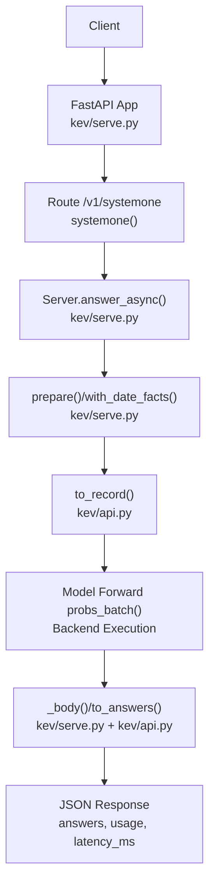
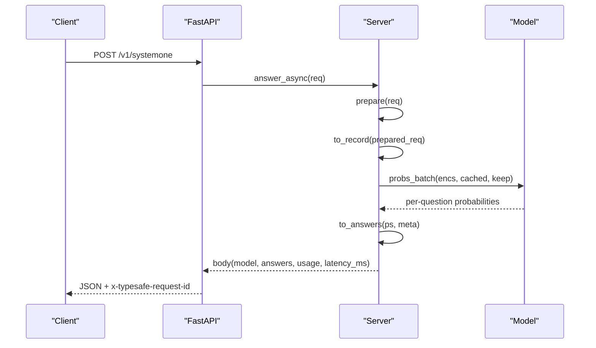
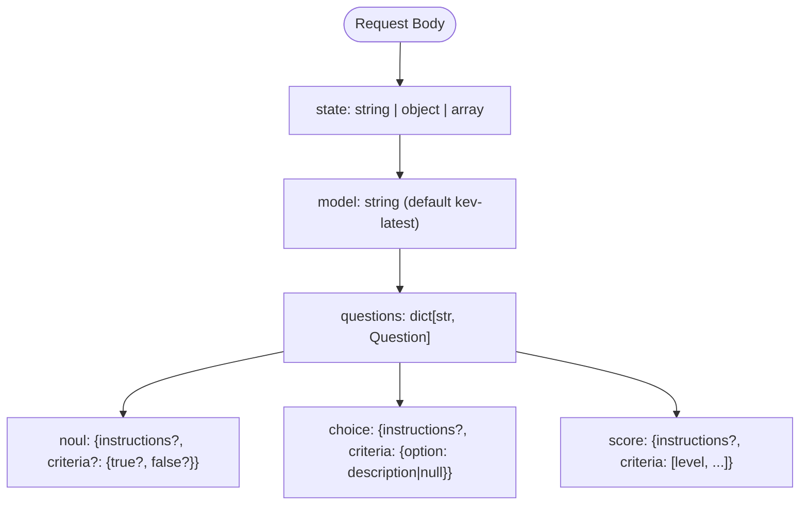
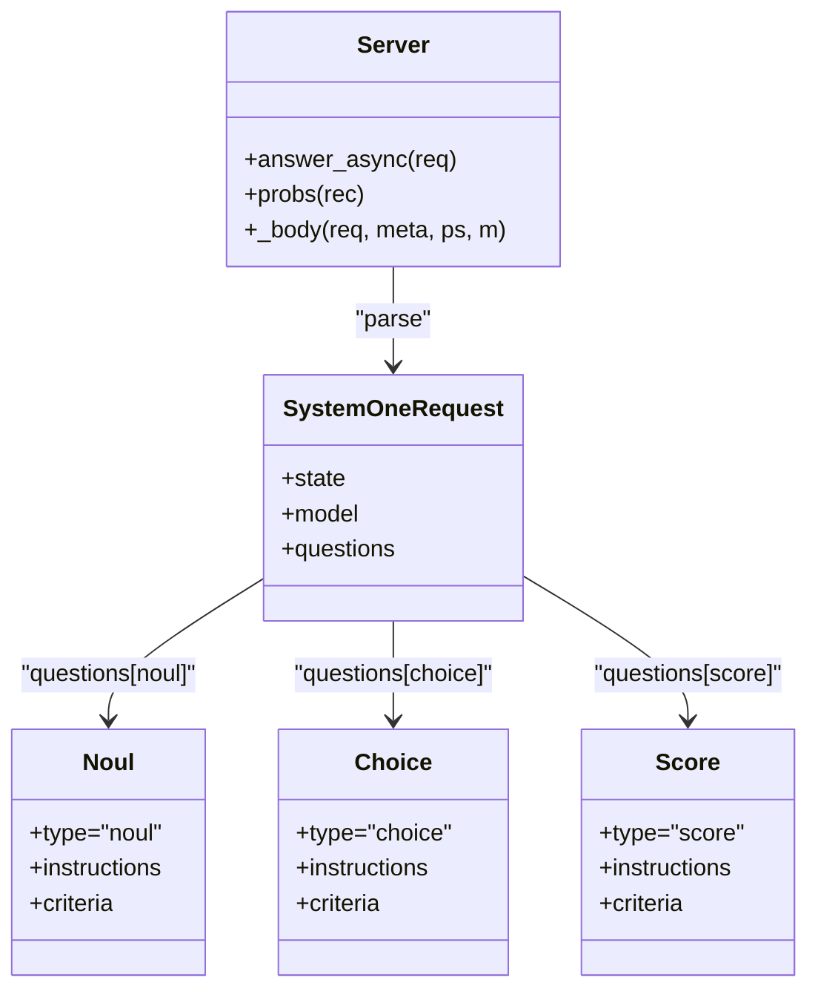

## Table of Contents
1. [Introduction](#introduction)
2. [Project Structure](#project-structure)
3. [Core Components](#core-components)
4. [Architecture Overview](#architecture-overview)
5. [Detailed Component Analysis](#detailed-component-analysis)
6. [Dependency Analysis](#dependency-analysis)
7. [Performance and Capacity Characteristics](#performance-and-capacity-characteristics)
8. [Troubleshooting Guide](#troubleshooting-guide)
9. [Conclusion](#conclusion)
10. [Appendix: Client Implementation and Common Use Cases](#appendix-client-implementation-and-common-use-cases)

## Introduction
This document is the complete technical reference for Kev's primary API endpoint `/v1/systemone`. This endpoint performs "single forward inference": it poses a set of structured questions about a document (state) and returns the probability distribution, confidence, and usage statistics for each question. It is compatible with the TypeSafe System One contract and supports three question types — noul (yes/no), choice (multi-select), and score — as well as three state field types: string, object, and array.

## Project Structure
Kev's HTTP service is provided by FastAPI, with the core logic concentrated in two modules:
- `kev/serve.py`: FastAPI application, authentication middleware, request routing, batching, state prefix cache, and response body assembly.
- `kev/api.py`: TypeSafe-compatible request/response data models, question type definitions, probability-to-answer mapping, confidence computation, and token counting.



**Diagram sources**
- [serve.py:228-252](file://kev/serve.py#L228-L252)
- [serve.py:200-225](file://kev/serve.py#L200-L225)
- [api.py:102-160](file://kev/api.py#L102-L160)

**Section sources**
- [serve.py:1-13](file://kev/serve.py#L1-L13)
- [api.py:1-6](file://kev/api.py#L1-L6)

## Core Components
- Request models
  - `SystemOneRequest`: contains `state`, optional `model`, and required `questions`.
  - `Question` union type: `Noul`, `Choice`, `Score`.
- Response models
  - `answers`: structured answers returned by question id.
  - `usage`: `input_tokens`, `output_tokens`; when truncation is enabled, also includes `state_tokens`, `state_tokens_used`.
  - `latency_ms`: model inference time.
  - optional `truncated`: true when the server truncates an over-long state.

**Section sources**
- [api.py:17-46](file://kev/api.py#L17-L46)
- [serve.py:211-220](file://kev/serve.py#L211-L220)

## Architecture Overview
The processing flow of `/v1/systemone` is as follows:
1. FastAPI receives the POST request and enters the `systemone()` route.
2. Calls `Server.answer_async(req)`, internally first performing optional preprocessing via `prepare()` (e.g., date-fact augmentation).
3. Converts the request into an internal record `to_record()`, attaching per-question metadata (id, type, keys, legend).
4. Submits to the model thread for batched inference, returning the probability distribution per question.
5. Maps probabilities to answers `to_answers()` and assembles fields such as usage and latency.
6. Returns the JSON response while setting the `x-typesafe-request-id` and `server-timing` response headers.



**Diagram sources**
- [serve.py:249-252](file://kev/serve.py#L249-L252)
- [serve.py:205-220](file://kev/serve.py#L205-L220)
- [api.py:102-160](file://kev/api.py#L102-L160)

## Detailed Component Analysis

### Endpoint Specification: POST /v1/systemone
- Method: POST
- Path: `/v1/systemone`
- Content type: `application/json`
- Authentication: when the environment variable `KEV_API_KEY` is set, `Authorization: Bearer <key>` is required; otherwise the server is open.
- Success response: HTTP 200, JSON body contains `model`, `answers`, `usage`, `latency_ms`, and optionally `truncated`.
- Error responses:
  - 401: missing or invalid API Key.
  - 422: request validation failure or state too long (unless truncation is enabled).
  - 503: service is shutting down.

**Section sources**
- [serve.py:232-242](file://kev/serve.py#L232-L242)
- [serve.py:138-145](file://kev/serve.py#L138-L145)

### Request Body Structure
- `state`: the content to be evaluated, of type `string | object | array`. Objects and arrays are serialized into labeled text for the model to read.
- `model`: string, defaults to `"kev-latest"`.
- `questions`: key-value pairs, where the key is your custom question id (not seen by the model) and the value is a Question object.



**Diagram sources**
- [api.py:17-46](file://kev/api.py#L17-L46)
- [api.py:49-59](file://kev/api.py#L49-L59)

**Section sources**
- [api.py:43-46](file://kev/api.py#L43-L46)
- [api.py:17-38](file://kev/api.py#L17-L38)

### Three State Field Types and Their Use Cases
- string: plain-text document, suitable for short messages, ticket bodies, comments, etc.
- object: structured document, suitable for forms, invoices, configuration items, etc., with field names preserved as labels.
- array: list-type document, suitable for collections of items, step lists, etc.

Objects and arrays are rendered internally as indented, labeled text to help the model understand the hierarchy.

**Section sources**
- [api.py:49-59](file://kev/api.py#L49-L59)

### questions Object Structure and Three Question Types

#### noul (yes/no question)
- `type`: `"noul"`
- `instructions`: optional, may be string/object/array.
- `criteria`: optional, of the form `{true?: ..., false?: ...}`. If not provided, default option names are used.
- Answer field: `noul`, the probability of yes.

**Section sources**
- [api.py:17-21](file://kev/api.py#L17-L21)
- [api.py:108-110](file://kev/api.py#L108-L110)
- [api.py:152-153](file://kev/api.py#L152-L153)

#### choice (multiple-choice question)
- `type`: `"choice"`
- `instructions`: optional.
- `criteria`: required, a dictionary whose keys are option names and values are descriptions or null. Number of options ranges from 1–255.
- Answer fields:
  - `choice`: the most likely option name.
  - `probabilities`: probability distribution by option name.
  - `confidence`: confidence based on the deviation of the maximum probability from the uniform distribution.

**Section sources**
- [api.py:23-31](file://kev/api.py#L23-L31)
- [api.py:111-112](file://kev/api.py#L111-L112)
- [api.py:154-156](file://kev/api.py#L154-L156)

#### score (scoring question)
- `type`: `"score"`
- `instructions`: optional.
- `criteria`: required, an ordered list from lowest to highest level, length 1–255.
- Answer fields:
  - `score`: expected level index (0-based).
  - `legend`: mapping from level index to description.
  - `probabilities`: probability distribution by level index.
  - `confidence`: confidence based on the concentration of the distribution.

**Section sources**
- [api.py:34-38](file://kev/api.py#L34-L38)
- [api.py:113-116](file://kev/api.py#L113-L116)
- [api.py:157-159](file://kev/api.py#L157-L159)

### Confidence Computation
- choice confidence: `(p_max − 1/K) / (1 − 1/K)`, where K is the number of options; confidence is 1 when there is a single option.
- score confidence: `max(0, 1 − E|level − mode| / D)`, where mode is the most likely level and D is the mean absolute deviation of the uniform distribution over the levels.

These formulas are consistent with the TypeSafe reference adapter and are not accuracy measures.

**Section sources**
- [api.py:120-140](file://kev/api.py#L120-L140)

### Response Format
- `model`: the model field from the request.
- `answers`: structured answers by question id.
- `usage`:
  - `input_tokens`: number of input tokens.
  - `output_tokens`: number of tokens in the serialized answer (not generated tokens).
  - when truncation is enabled: `state_tokens` (token count of the requested state), `state_tokens_used` (tokens actually read into the model).
- `latency_ms`: model inference time (milliseconds).
- `truncated`: true when the server truncates an over-long state.

**Section sources**
- [serve.py:211-220](file://kev/serve.py#L211-L220)
- [api.py:163-165](file://kev/api.py#L163-L165)

### Authentication Mechanism
- When `KEV_API_KEY` is set, all `/v1/*` paths require `Authorization: Bearer <key>`.
- Missing or invalid key returns 401, with `www-authenticate: Bearer` in the response header.
- When `KEV_API_KEY` is not set, the server is in open mode (local default).

**Section sources**
- [serve.py:232-242](file://kev/serve.py#L232-L242)

### Error Handling Strategy
- 401: authentication failure.
- 422: request validation failure or state exceeds limit (unless truncation is enabled).
- 503: service is shutting down.
- Other exceptions: exceptions in a batch propagate to all requests in the batch, but the model thread continues running.

**Section sources**
- [serve.py:138-145](file://kev/serve.py#L138-L145)
- [serve.py:161-168](file://kev/serve.py#L161-L168)

### Rate Limiting
The codebase does not implement an explicit rate limiter. The server throttles requests through batching (up to 64 requests per batch) and the model-thread queue. For production deployments, it is recommended to implement rate limiting and retry backoff at a fronting proxy layer (e.g., Nginx, Cloudflare, API Gateway).

**Section sources**
- [serve.py:34](file://kev/serve.py#L34)

## Dependency Analysis
- The FastAPI route depends on `Server.answer_async()`.
- `Server` depends on `Checkpoint`, `LoadOptions`, device abstraction, and the model forward interface.
- Request/response shapes are defined in `api.py` and reused by `serve.py`.
- The optional preprocessing `with_date_facts` is implemented in `api.py` and called by `serve.py`'s `prepare()`.



**Diagram sources**
- [api.py:17-46](file://kev/api.py#L17-L46)
- [serve.py:200-220](file://kev/serve.py#L200-L220)

**Section sources**
- [serve.py:93-122](file://kev/serve.py#L93-L122)
- [api.py:102-160](file://kev/api.py#L102-L160)

## Performance and Capacity Characteristics
- Batching: up to 64 requests per batch, reducing kernel launch overhead.
- State prefix cache: caches the prefix KV and DeltaNet state of repeated states, so on a hit only the cost of the question row is paid.
- Memory management: on OOM, the cache is automatically cleared and retried.
- Length limit: by default it rejects states exceeding `SERVE_MAX_STATE`; can be switched to truncation with `KEV_TRUNCATE_STATES=1`, returning a `truncated` flag.
- Precision and backend: GPU defaults to bf16; Apple Silicon defaults to MLX; dtype, backend, CUDA graphs, etc. can be switched via environment variables.

**Section sources**
- [serve.py:27-35](file://kev/serve.py#L27-L35)
- [serve.py:38-90](file://kev/serve.py#L38-L90)
- [serve.py:172-191](file://kev/serve.py#L172-L191)
- [serve.py:315-339](file://kev/serve.py#L315-L339)

## Troubleshooting Guide
- 401 authentication failure: check whether `KEV_API_KEY` is set and ensure the request carries the correct `Authorization: Bearer <key>`.
- 422 request or length error: check whether the state exceeds the limit; if truncation is needed, set `KEV_TRUNCATE_STATES=1`.
- 503 service shutting down: new requests fail while the server is closing.
- Poor long-document performance: consider enabling the state prefix cache (on by default), or using a more suitable GPU and batch size.
- Slow Apple Silicon: confirm the MLX backend is used; adjust dtype and backend if necessary.

**Section sources**
- [serve.py:232-242](file://kev/serve.py#L232-L242)
- [serve.py:138-145](file://kev/serve.py#L138-L145)
- [serve.py:172-191](file://kev/serve.py#L172-L191)

## Conclusion
`/v1/systemone` provides a TypeSafe-compatible decision-style API that supports three question types and three state types, returning calibrated probability distributions and confidence along with usage statistics and latency metrics. Environment variables control authentication, truncation, date-fact augmentation, dtype, and backend behavior. Production environments are advised to combine a fronting proxy for rate limiting and monitoring, and to select an appropriate model size and hardware based on business needs.

## Appendix: Client Implementation and Common Use Cases

### Complete Request Example
Below is a typical request for a customer-service ticket, including department classification (choice), whether urgent human attention is needed (noul), and customer sentiment scoring (score).

```jsonc
{
  "state": "Shoes arrived two weeks late and in the wrong size. Also I see two charges on my card.",
  "model": "kev-latest",
  "questions": {
    "department":  {"type": "choice", "instructions": "Which team should handle this?",
                    "criteria": {"returns": "Exchanges, refunds, wrong or damaged items",
                                 "shipping": "Delivery status, delays, lost packages",
                                 "billing": "Charges, invoices, payment problems"}},
    "escalate":    {"type": "noul",  "instructions": "Does this ticket need urgent human attention?"},
    "frustration": {"type": "score", "instructions": "How frustrated is the customer?",
                    "criteria": ["Calm", "Frustrated", "Very angry"]}
  }
}
```

**Section sources**
- [README.md:63-76](file://README.md#L63-L76)

### Complete Response Example
The typical response corresponding to the request above contains answers, usage, and latency_ms.

```jsonc
{
  "model": "kev-latest",
  "answers": {
    "department":  { "type": "choice", "choice": "returns", "confidence": 0.21,
                     "probabilities": { "returns": 0.47, "shipping": 0.28, "billing": 0.25 } },
    "escalate":    { "type": "noul", "noul": 0.93 },
    "frustration": { "type": "score", "score": 1.44, "confidence": 0.34,
                     "legend": { "0": "Calm", "1": "Frustrated", "2": "Very angry" },
                     "probabilities": { "0": 0.00, "1": 0.56, "2": 0.44 } }
  },
  "usage": { "input_tokens": 101, "output_tokens": 161 },
  "latency_ms": 495
}
```

**Section sources**
- [README.md:78-94](file://README.md#L78-L94)

### Client Implementation Guide
- The TypeSafe Python SDK can connect directly to the Kev service without modifying the calling code.
- Set `base_url` to point to the local or remote Kev service address.
- If `KEV_API_KEY` is enabled, pass `api_key` in the SDK.

```python
from typesafe_sdk import Choice, Noul, Score, TypeSafeClient

client = TypeSafeClient(
    api_key="local",
    base_url="http://127.0.0.1:8009",
    model="kev-latest",
)
response = client.system_one(
    state="I was charged twice. Please fix this ASAP.",
    questions={
        "billing": Noul(instructions="Is this ticket about billing?"),
        "tone": Choice(
            instructions="What is the customer's tone?",
            criteria={"calm": None, "frustrated": None, "angry": None},
        ),
        "urgency": Score(
            instructions="How urgent is this ticket?",
            criteria=["can wait", "this week", "today"],
        ),
    },
)
print(response.nouls["billing"].noul)
print(response.choices["tone"].choice)
print(response.scores["urgency"].score)
```

**Section sources**
- [README.md:98-127](file://README.md#L98-L127)

### Common Use Cases
- Ticket routing: determine the owning department by content (choice).
- Escalation judgment: whether urgent human intervention is needed (noul).
- Sentiment scoring: grade customer sentiment (score).
- Contract review: grade clause risk (score) and combine with choice to judge the responsible party.
- Multilingual support: adapt to different languages via the descriptions in instructions and criteria.

[This section is conceptual and does not directly analyze specific files]
