## Table of Contents
1. [Introduction](#introduction)
2. [Project Structure](#project-structure)
3. [Core Components](#core-components)
4. [Architecture Overview](#architecture-overview)
5. [Detailed Component Analysis](#detailed-component-analysis)
6. [Dependency Analysis](#dependency-analysis)
7. [Performance Optimization and Deployment](#performance-optimization-and-deployment)
8. [Custom Component Development Guide](#custom-component-development-guide)
9. [Model Compression and Quantization](#model-compression-and-quantization)
10. [Experiment Framework and Parameter Search](#experiment-framework-and-parameter-search)
11. [Result Analysis and Visualization](#result-analysis-and-visualization)
12. [Troubleshooting and Performance Bottleneck Analysis](#troubleshooting-and-performance-bottleneck-analysis)
13. [Research Directions and Future Improvements](#research-directions-and-future-improvements)
14. [Conclusion](#conclusion)

## Introduction
This chapter is aimed at experienced developers and systematically explains Kev's advanced topics: the model extension mechanism (anchors, composition strategy, contrastive learning), the experiment framework (config format, parameter search, result analysis), performance optimization (CUDA graphs, memory management, parallel computation), custom component development (problem types, loss functions, evaluation metrics), model compression and quantization, deployment optimization, as well as troubleshooting and performance-bottleneck analysis methods. Based on code-level analysis and supplemented with architecture and sequence diagrams, this document helps readers quickly locate key implementations and perform deep customization.

## Project Structure
Kev's core logic is concentrated in the `kev` directory, organized around a "data—training—evaluation—serving" pipeline; the `experiments` directory stores experiment configurations; the `evals` directory contains evaluation set manifests; the `runs` directory stores run artifacts; and `scripts` provides data processing and reporting scripts.

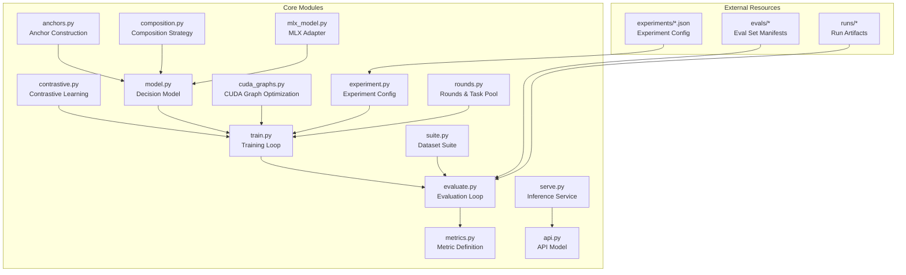

Diagram Sources
- [anchors.py:1-120](file://kev/anchors.py#L1-L120)
- [composition.py:1-120](file://kev/composition.py#L1-L120)
- [contrastive.py:1-120](file://kev/contrastive.py#L1-L120)
- [model.py:200-300](file://kev/model.py#L200-L300)
- [train.py:1-200](file://kev/train.py#L1-L200)
- [evaluate.py:1-200](file://kev/evaluate.py#L1-L200)
- [metrics.py:1-120](file://kev/metrics.py#L1-L120)
- [cuda_graphs.py:1-120](file://kev/cuda_graphs.py#L1-L120)
- [experiment.py:1-120](file://kev/experiment.py#L1-L120)
- [suite.py:150-220](file://kev/suite.py#L150-L220)
- [rounds.py:580-660](file://kev/rounds.py#L580-L660)
- [serve.py:240-270](file://kev/serve.py#L240-L270)
- [api.py:10-50](file://kev/api.py#L10-L50)
- [mlx_model.py:120-140](file://kev/mlx_model.py#L120-L140)

Section Sources
- [README.md:1-120](file://README.md#L1-L120)

## Core Components
- Anchor mechanism: `anchors.py` builds reusable context anchors used to stabilize the model's performance on long-context or complex tasks.
- Composition strategy: `composition.py` combines multiple sub-capabilities or prompt templates to form a more powerful task representation.
- Contrastive learning: `contrastive.py` introduces positive/negative sample pairs and a contrastive loss to improve discriminative ability and generalization.
- Decision model: `DecisionModel` in `model.py` serves as a unified inference interface, encapsulating the forward pass and state management.
- Training and evaluation: `train.py` and `evaluate.py` are responsible for the training loop and evaluation flow respectively, while `metrics.py` provides metrics.
- CUDA graph optimization: `cuda_graphs.py` uses CUDA Graphs to reduce kernel launch overhead and improve throughput.
- Experiment config: `experiment.py` parses JSON configurations to drive training and evaluation.
- Dataset suite: `suite.py` validates and freezes the training/test sets to ensure reproducibility.
- Rounds and task pool: `rounds.py` maintains the training task pool and performs conflict detection.
- Serving and API: `serve.py` and `api.py` provide the inference service and request model definitions.
- MLX adapter: `mlx_model.py` provides a compatible implementation for non-CUDA environments.

Section Sources
- [anchors.py:1-120](file://kev/anchors.py#L1-L120)
- [composition.py:1-120](file://kev/composition.py#L1-L120)
- [contrastive.py:1-120](file://kev/contrastive.py#L1-L120)
- [model.py:200-300](file://kev/model.py#L200-L300)
- [train.py:1-200](file://kev/train.py#L1-L200)
- [evaluate.py:1-200](file://kev/evaluate.py#L1-L200)
- [metrics.py:1-120](file://kev/metrics.py#L1-L120)
- [cuda_graphs.py:1-120](file://kev/cuda_graphs.py#L1-L120)
- [experiment.py:1-120](file://kev/experiment.py#L1-L120)
- [suite.py:150-220](file://kev/suite.py#L150-L220)
- [rounds.py:580-660](file://kev/rounds.py#L580-L660)
- [serve.py:240-270](file://kev/serve.py#L240-L270)
- [api.py:10-50](file://kev/api.py#L10-L50)
- [mlx_model.py:120-140](file://kev/mlx_model.py#L120-L140)

## Architecture Overview
The diagram below shows the end-to-end flow from experiment configuration to training, evaluation, and serving, and annotates the responsibilities and interactions of the key modules.

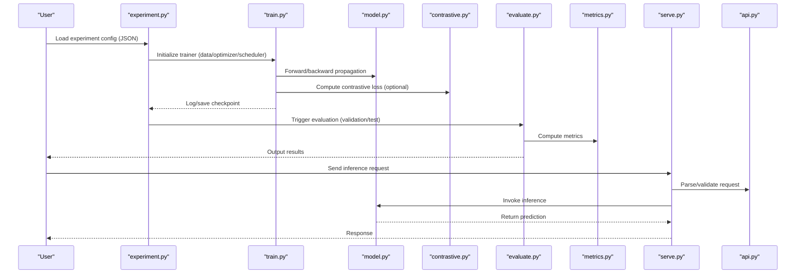

Diagram Sources
- [experiment.py:1-120](file://kev/experiment.py#L1-L120)
- [train.py:1-200](file://kev/train.py#L1-L200)
- [model.py:200-300](file://kev/model.py#L200-L300)
- [contrastive.py:1-120](file://kev/contrastive.py#L1-L120)
- [evaluate.py:1-200](file://kev/evaluate.py#L1-L200)
- [metrics.py:1-120](file://kev/metrics.py#L1-L120)
- [serve.py:240-270](file://kev/serve.py#L240-L270)
- [api.py:10-50](file://kev/api.py#L10-L50)

## Detailed Component Analysis

### Anchor Mechanism (Anchors)
Anchors are used to inject stable context information during training and inference, improving the model's consistency in understanding long texts and complex instructions. The typical flow includes:
- Building the anchor set (partitioned by task/domain)
- Dynamically concatenating anchors to inputs in the data pipeline
- Participating in gradient updates during training and retrieving on demand during inference

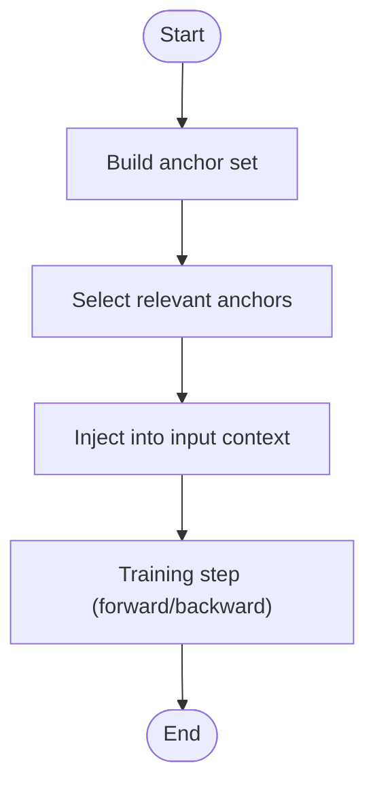

Diagram Sources
- [anchors.py:1-120](file://kev/anchors.py#L1-L120)

Section Sources
- [anchors.py:1-120](file://kev/anchors.py#L1-L120)

### Composition Strategy (Composition)
The composition strategy fuses multiple sub-capabilities (such as knowledge retrieval, reasoning, and formatting) via templates or weights to form a stronger task representation. Key points:
- Sub-capability registration and discovery
- Composition rules (order, conditions, weights)
- Runtime scheduling and caching

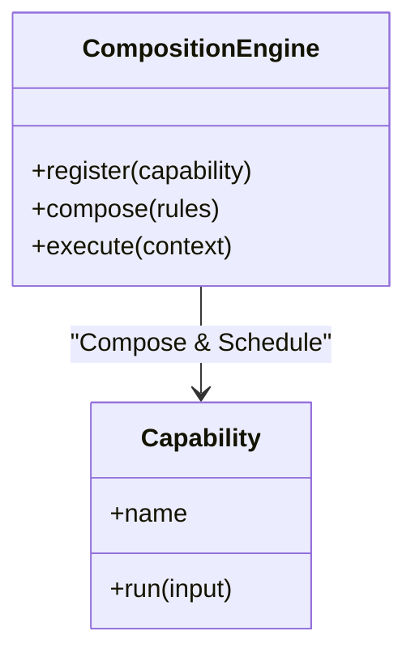

Diagram Sources
- [composition.py:1-120](file://kev/composition.py#L1-L120)

Section Sources
- [composition.py:1-120](file://kev/composition.py#L1-L120)

### Contrastive Learning
Contrastive learning enhances the model's discriminative ability through positive/negative sample pairs and a contrastive loss. Core flow:
- Construct positive/negative samples (synonyms/antonyms, similar/dissimilar)
- Compute embedding similarity
- Apply a contrastive loss (e.g., InfoNCE)
- Fuse with the main-task loss using weights

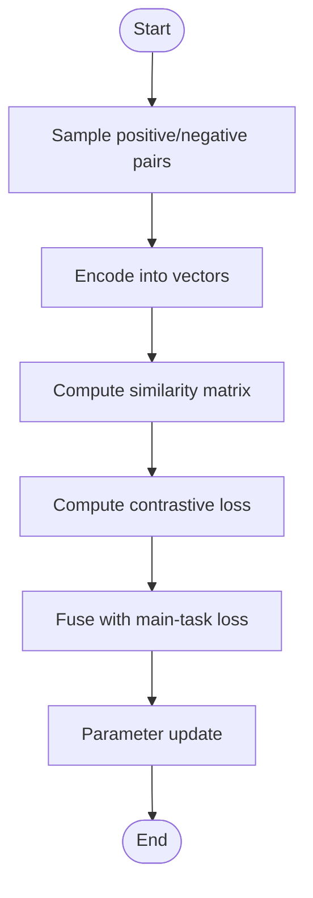

Diagram Sources
- [contrastive.py:1-120](file://kev/contrastive.py#L1-L120)

Section Sources
- [contrastive.py:1-120](file://kev/contrastive.py#L1-L120)

### Decision Model (DecisionModel)
`DecisionModel` is the unified inference interface that encapsulates the forward logic, state management, and device binding. Its responsibilities include:
- Receiving inputs and context
- Executing the model forward pass
- Returning predictions and intermediate states

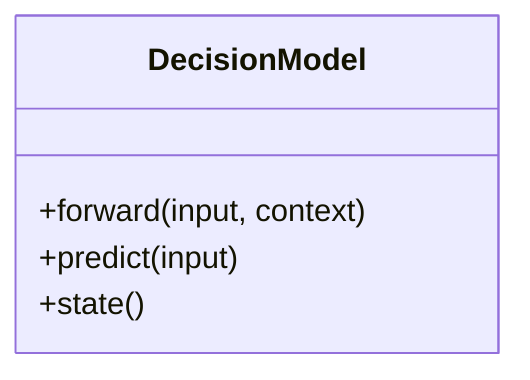

Diagram Sources
- [model.py:242-260](file://kev/model.py#L242-L260)

Section Sources
- [model.py:242-260](file://kev/model.py#L242-L260)

### Training Loop
The training loop is driven by `train.py` together with the configuration from `experiment.py`, performing data loading, optimizer stepping, logging, and checkpoint saving.

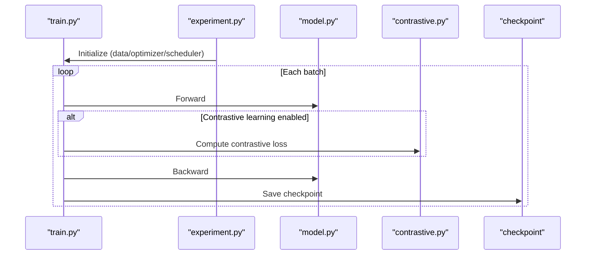

Diagram Sources
- [train.py:1-200](file://kev/train.py#L1-L200)
- [experiment.py:1-120](file://kev/experiment.py#L1-L120)
- [contrastive.py:1-120](file://kev/contrastive.py#L1-L120)
- [model.py:200-300](file://kev/model.py#L200-L300)

Section Sources
- [train.py:1-200](file://kev/train.py#L1-L200)
- [experiment.py:1-120](file://kev/experiment.py#L1-L120)

### Evaluation
`evaluate.py` runs the model on the validation/test sets, and `metrics.py` provides metric computation.

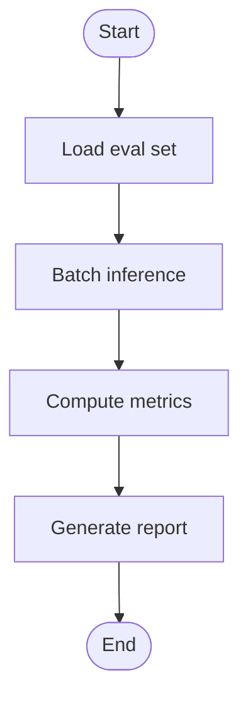

Diagram Sources
- [evaluate.py:1-200](file://kev/evaluate.py#L1-L200)
- [metrics.py:1-120](file://kev/metrics.py#L1-L120)

Section Sources
- [evaluate.py:1-200](file://kev/evaluate.py#L1-L200)
- [metrics.py:1-120](file://kev/metrics.py#L1-L120)

### Serving & API
`serve.py` provides the inference service entry point, and `api.py` defines the request/response models to ensure type safety and extensibility.

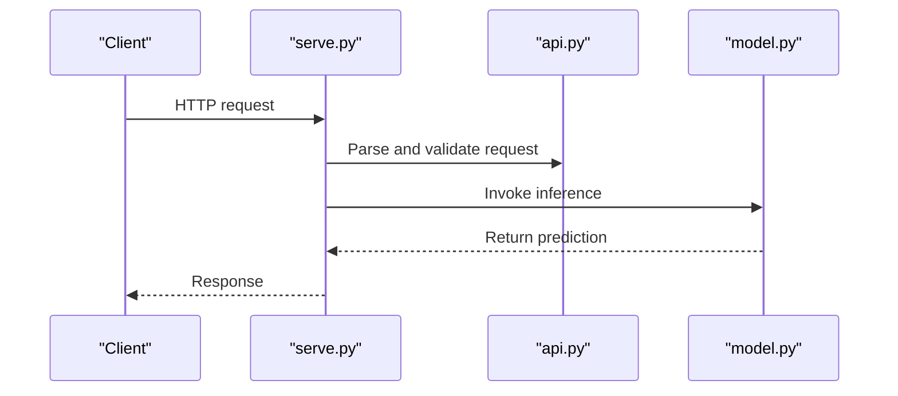

Diagram Sources
- [serve.py:240-270](file://kev/serve.py#L240-L270)
- [api.py:10-50](file://kev/api.py#L10-L50)
- [model.py:200-300](file://kev/model.py#L200-L300)

Section Sources
- [serve.py:240-270](file://kev/serve.py#L240-L270)
- [api.py:10-50](file://kev/api.py#L10-L50)

## Dependency Analysis
- Module coupling: `anchors`/`composition`/`contrastive` are reused by `model`/`training` as capability modules; `experiment` acts as the orchestration layer coordinating `train`/`evaluate`; `serve`/`api` are independent of the training chain.
- External dependencies: CUDA graph optimization depends on PyTorch/CUDA; the MLX adapter provides an alternative path in non-CUDA environments.
- Potential cycles: avoid directly importing `serve` inside `model` to keep training and serving decoupled.

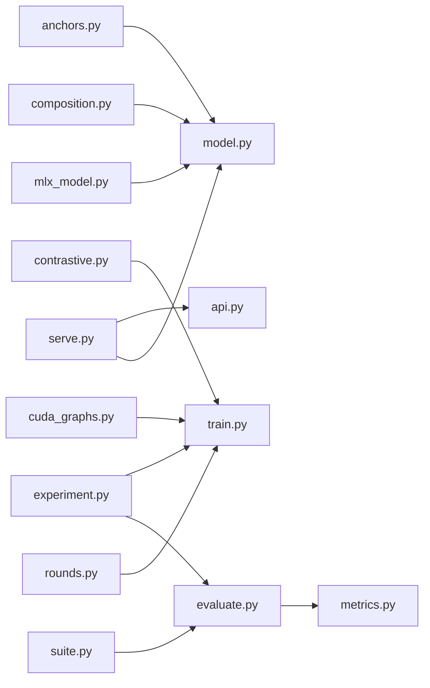

Diagram Sources
- [anchors.py:1-120](file://kev/anchors.py#L1-L120)
- [composition.py:1-120](file://kev/composition.py#L1-L120)
- [contrastive.py:1-120](file://kev/contrastive.py#L1-L120)
- [experiment.py:1-120](file://kev/experiment.py#L1-L120)
- [train.py:1-200](file://kev/train.py#L1-L200)
- [evaluate.py:1-200](file://kev/evaluate.py#L1-L200)
- [metrics.py:1-120](file://kev/metrics.py#L1-L120)
- [serve.py:240-270](file://kev/serve.py#L240-L270)
- [api.py:10-50](file://kev/api.py#L10-L50)
- [cuda_graphs.py:1-120](file://kev/cuda_graphs.py#L1-L120)
- [suite.py:150-220](file://kev/suite.py#L150-L220)
- [rounds.py:580-660](file://kev/rounds.py#L580-L660)
- [mlx_model.py:120-140](file://kev/mlx_model.py#L120-L140)

Section Sources
- [experiment.py:1-120](file://kev/experiment.py#L1-L120)
- [train.py:1-200](file://kev/train.py#L1-L200)
- [evaluate.py:1-200](file://kev/evaluate.py#L1-L200)

## Performance Optimization and Deployment
- CUDA graph optimization: capture static computation graphs via `cuda_graphs.py` to reduce kernel launch overhead, suitable for inference and training with fixed-shape batches.
- Memory management: enable gradient checkpointing, mixed precision, and activation recomputation; set batch size and sequence length reasonably to avoid OOM.
- Parallel computation: use distributed optimizers and data parallelism for multi-GPU training; pay attention to communication overhead and load balancing.
- Serving optimization: warm up CUDA graphs, batch requests, stream output, and use connection pools.

Section Sources
- [cuda_graphs.py:1-120](file://kev/cuda_graphs.py#L1-L120)
- [serve.py:240-270](file://kev/serve.py#L240-L270)

## Custom Component Development Guide
- Add a new problem type:
  - Register the new problem type and data loading logic in `suite.py`, ensuring `validate_training` validates it correctly.
  - Declare the sampling strategy for the new type in the task pool of `rounds.py`.
- Add a new loss function:
  - Implement the loss class in `contrastive.py` or a standalone module, and integrate it into the training loop of `train.py`.
- Add a new evaluation metric:
  - Implement the metric computation function in `metrics.py`, and register and aggregate it in `evaluate.py`.

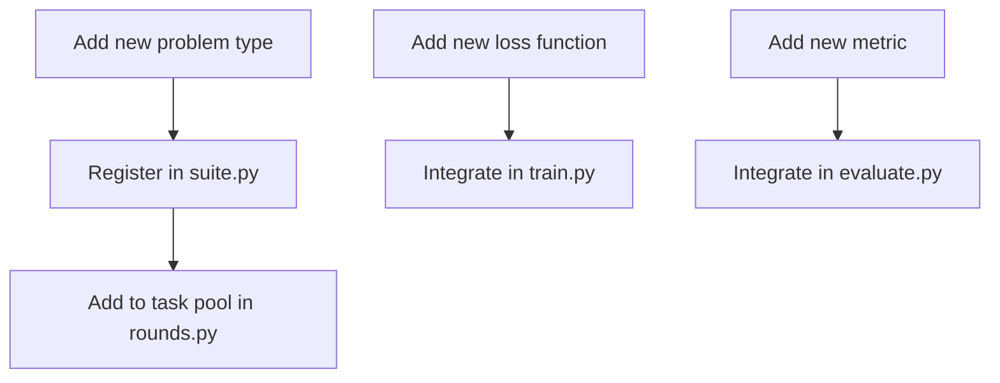

Diagram Sources
- [suite.py:150-220](file://kev/suite.py#L150-L220)
- [rounds.py:580-660](file://kev/rounds.py#L580-L660)
- [contrastive.py:1-120](file://kev/contrastive.py#L1-L120)
- [train.py:1-200](file://kev/train.py#L1-L200)
- [evaluate.py:1-200](file://kev/evaluate.py#L1-L200)
- [metrics.py:1-120](file://kev/metrics.py#L1-L120)

Section Sources
- [suite.py:150-220](file://kev/suite.py#L150-L220)
- [rounds.py:580-660](file://kev/rounds.py#L580-L660)
- [contrastive.py:1-120](file://kev/contrastive.py#L1-L120)
- [train.py:1-200](file://kev/train.py#L1-L200)
- [evaluate.py:1-200](file://kev/evaluate.py#L1-L200)
- [metrics.py:1-120](file://kev/metrics.py#L1-L120)

## Model Compression and Quantization
- Quantization schemes: support INT8/FP8 quantization, combined with dynamic calibration sets and static calibration weights, reducing memory footprint and improving throughput.
- Pruning and distillation: structured pruning removes redundant channels; knowledge distillation uses a teacher model to guide student model training.
- Deployment optimization: export to ONNX/TensorRT formats, and further improve latency and throughput with CUDA graphs and batching.

[This section provides general guidance and does not directly analyze specific files]

## Experiment Framework and Parameter Search
- Experiment config format: JSON files located in the `experiments` directory, containing data sources, model hyperparameters, training steps, evaluation sets, etc.
- Parameter search: based on the configuration parsed by `experiment.py`, combined with sweeps or grid search to traverse the parameter space, recording results to `runs`.
- Result analysis: aggregate metrics via `evaluate.py` and `metrics.py` to generate readable reports.

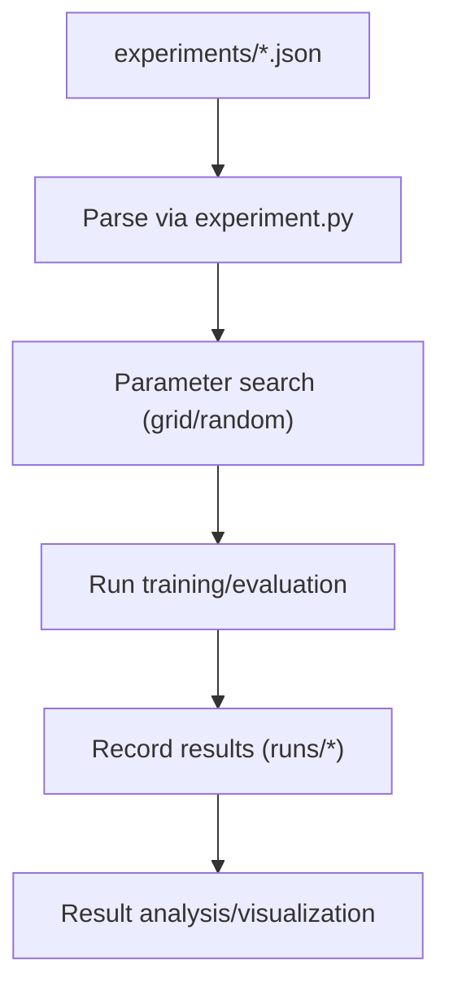

Diagram Sources
- [experiment.py:1-120](file://kev/experiment.py#L1-L120)
- [train.py:1-200](file://kev/train.py#L1-L200)
- [evaluate.py:1-200](file://kev/evaluate.py#L1-L200)

Section Sources
- [experiment.py:1-120](file://kev/experiment.py#L1-L120)
- [train.py:1-200](file://kev/train.py#L1-L200)
- [evaluate.py:1-200](file://kev/evaluate.py#L1-L200)

## Result Analysis and Visualization
- Metric aggregation: `metrics.py` provides base metrics, and `evaluate.py` aggregates results across subsets.
- Visualization: use `plot.py` or external tools to draw curves and comparison charts.
- Report generation: combine the reporting scripts in `scripts` (such as `longdoc_report.py`, `breadth_report.py`) to generate standardized reports.

Section Sources
- [metrics.py:1-120](file://kev/metrics.py#L1-L120)
- [evaluate.py:1-200](file://kev/evaluate.py#L1-L200)

## Troubleshooting and Performance Bottleneck Analysis
- Common issues:
  - OOM: reduce batch size, enable gradient checkpointing, use mixed precision.
  - Training instability: adjust learning rate, increase warmup, check data quality.
  - High inference latency: warm up CUDA graphs, batch requests, reduce serialization overhead.
- Diagnostic methods:
  - Use `torch.profiler` or `nvprof` to analyze GPU utilization and kernel time.
  - Monitor peak memory and bandwidth to identify bottleneck stages.
  - Enable slow-request logging on the server side to locate hot paths.

Section Sources
- [cuda_graphs.py:1-120](file://kev/cuda_graphs.py#L1-L120)
- [serve.py:240-270](file://kev/serve.py#L240-L270)

## Research Directions and Future Improvements
- Research suggestions:
  - Explore more efficient contrastive learning strategies (adaptive temperature, hard example mining).
  - Study dynamic anchor selection and online update mechanisms.
  - Explore multimodal anchors and cross-domain composition strategies.
- Improvement plans:
  - Improve automatic hyperparameter tuning and early-stopping strategies.
  - Enhance elastic scaling and canary deployment on the serving side.
  - Provide richer visualization and interpretability tools.

[This section is conceptual and does not directly analyze specific files]

## Conclusion
This document systematically reviews Kev's advanced topics, covering the model extension mechanism, experiment framework, performance optimization, custom component development, model compression and quantization, deployment optimization, and troubleshooting. Through code-level analysis and diagrams, readers can quickly locate key implementations and perform deep customization, driving efficient iteration of research and engineering practice.
