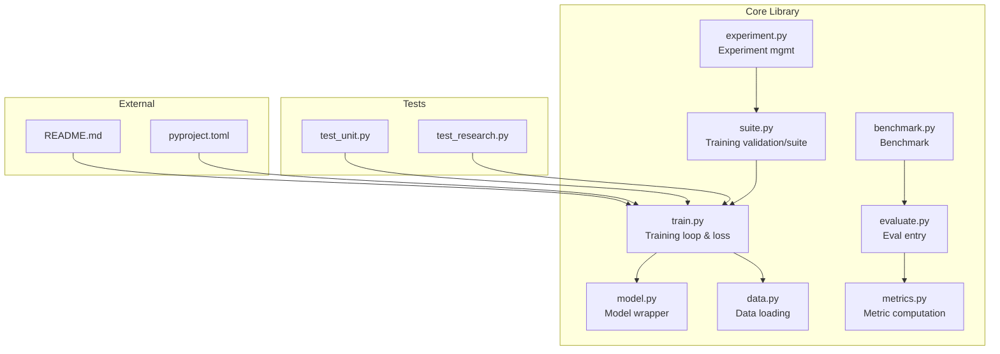
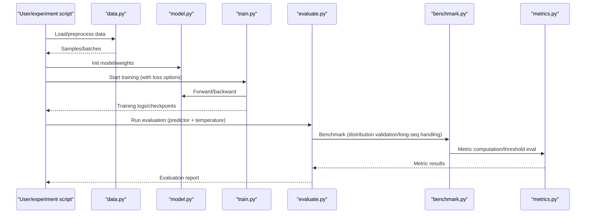
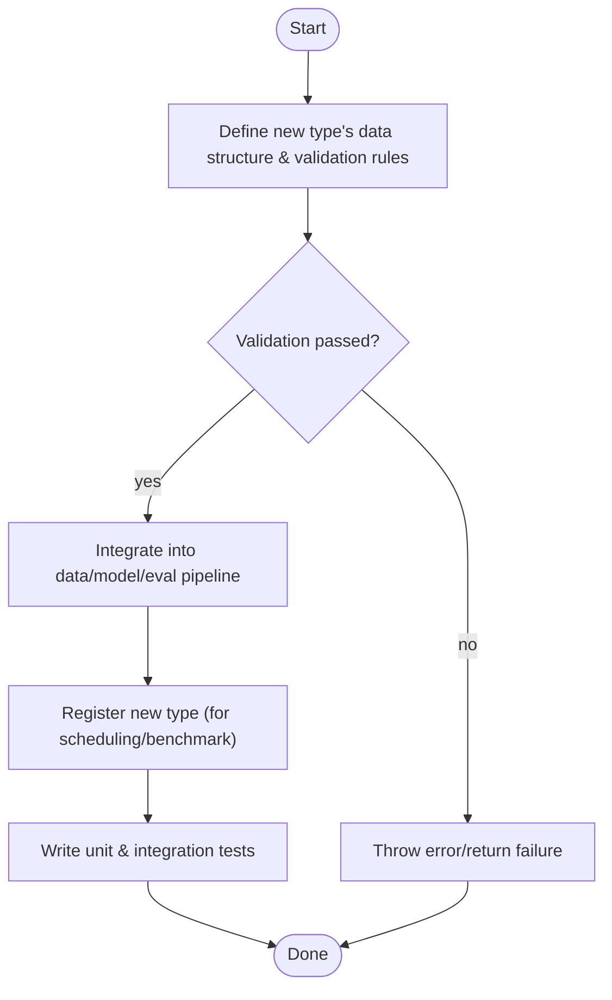
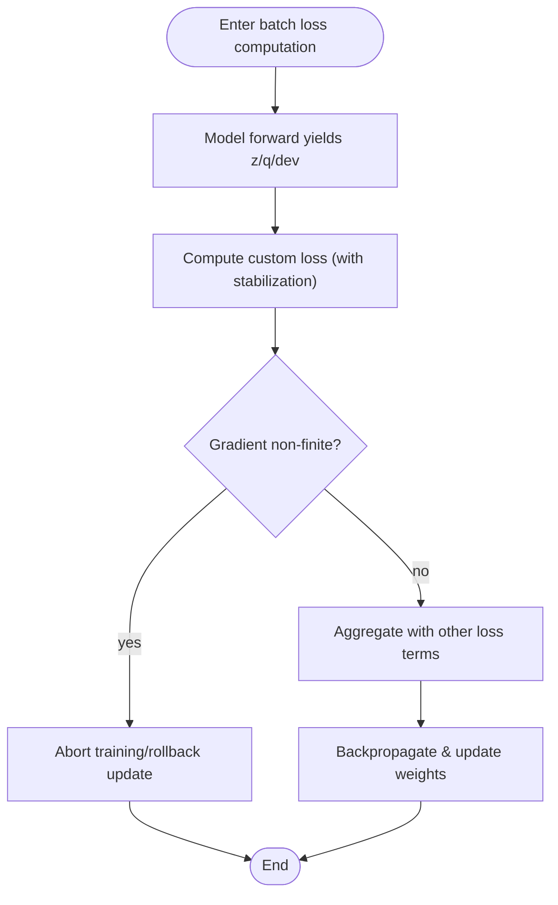
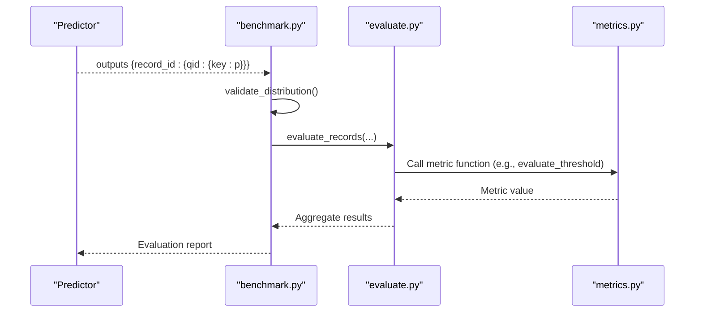
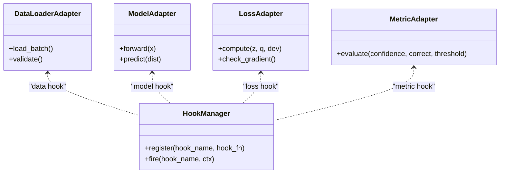
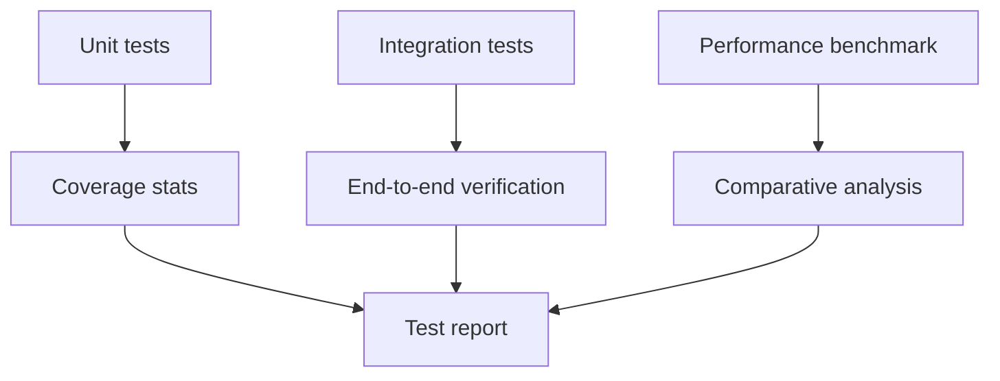
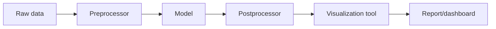
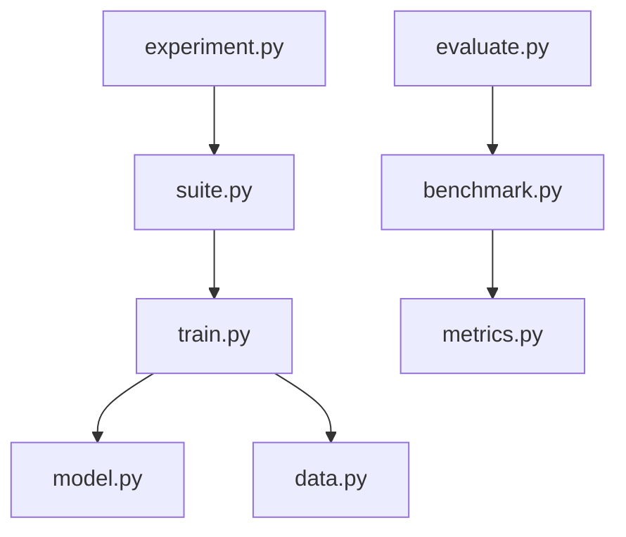

## Table of Contents
1. [Overview](#overview)
2. [Project Structure](#project-structure)
3. [Core Components](#core-components)
4. [Architecture Overview](#architecture-overview)
5. [Detailed Component Analysis](#detailed-component-analysis)
6. [Dependency Analysis](#dependency-analysis)
7. [Performance Considerations](#performance-considerations)
8. [Troubleshooting Guide](#troubleshooting-guide)
9. [Conclusion](#conclusion)
10. [Appendix](#appendix)

## Overview
This guide is for developers who want to perform "custom extensions" within the Kev framework, covering the following topics:
- How to add a new problem type (inherit the base class, implement validation logic, register the new type)
- How to develop custom loss functions (gradient computation, numerical stability, integration with the training flow)
- How to extend evaluation metrics (implement custom evaluation functions, integrate into the benchmark framework)
- Plugin patterns (usage ideas for adapter interfaces, hook mechanisms, and event systems)
- Debugging and testing best practices (unit tests, integration tests, performance benchmarks)
- Extending existing components (preprocessors, postprocessors, visualization tools)

Kev is an engineering framework centered on model training, evaluation, and experiment management, providing data loading, model wrapping, training loops, loss definitions, metric computation, benchmark evaluation, and visualization. By understanding its core modules and extension points, you can extend the system's capabilities with minimal intrusion.

## Project Structure
The repository uses a "functional domain + tool scripts" organization:
- kev/: core library code, including training, model, data, evaluation, metrics, benchmarking, and experiment orchestration
- tests/: unit and integration tests
- scripts/: data processing, dataset building, report generation, and other utility scripts
- experiments/: experiment configurations and run records
- evals/: benchmark datasets and evaluation scripts
- docs/: documentation and descriptions
- runs/: run artifacts from training and evaluation

Diagram Sources
- [kev/train.py:1-450](file://kev/train.py#L1-L450)
- [kev/model.py:1-200](file://kev/model.py#L1-L200)
- [kev/data.py:1-200](file://kev/data.py#L1-L200)
- [kev/metrics.py:1-400](file://kev/metrics.py#L1-L400)
- [kev/evaluate.py:1-200](file://kev/evaluate.py#L1-L200)
- [kev/benchmark.py:1-200](file://kev/benchmark.py#L1-L200)
- [kev/suite.py:1-200](file://kev/suite.py#L1-L200)
- [kev/experiment.py:1-200](file://kev/experiment.py#L1-L200)
- [tests/test_research.py:1-500](file://tests/test_research.py#L1-L500)
- [tests/test_unit.py:1-1200](file://tests/test_unit.py#L1-L1200)
- [pyproject.toml:1-200](file://pyproject.toml#L1-L200)
- [README.md:1-200](file://README.md#L1-L200)

Section Sources
- [README.md:1-200](file://README.md#L1-L200)
- [pyproject.toml:1-200](file://pyproject.toml#L1-L200)

## Core Components
- Training and loss: train.py defines the training loop, batch loss aggregation, anchor loss, and multiple loss options; supports label smoothing, Brier term, Focal Gamma, etc.
- Metrics and calibration: metrics.py provides threshold evaluation, temperature calibration cross-validation, and other tools.
- Evaluation and benchmark: evaluate.py and benchmark.py connect predictors into the evaluation flow, uniformly handling distribution validation, long-sequence skipping, temperature parameters, etc.
- Model and data: model.py and data.py respectively wrap model inference and data loading, providing the basis for training and evaluation.
- Suite and experiment: suite.py provides training-data validation and suite management; experiment.py provides experiment configuration and trial-level validation.

Section Sources
- [kev/train.py:1-450](file://kev/train.py#L1-L450)
- [kev/metrics.py:1-400](file://kev/metrics.py#L1-L400)
- [kev/evaluate.py:1-200](file://kev/evaluate.py#L1-L200)
- [kev/benchmark.py:1-200](file://kev/benchmark.py#L1-L200)
- [kev/model.py:1-200](file://kev/model.py#L1-L200)
- [kev/data.py:1-200](file://kev/data.py#L1-L200)
- [kev/suite.py:1-200](file://kev/suite.py#L1-L200)
- [kev/experiment.py:1-200](file://kev/experiment.py#L1-L200)

## Architecture Overview
The diagram below shows the overall flow from data to training, evaluation, and benchmarking, as well as the call relationships between modules.

Diagram Sources
- [kev/data.py:1-200](file://kev/data.py#L1-L200)
- [kev/model.py:1-200](file://kev/model.py#L1-L200)
- [kev/train.py:1-450](file://kev/train.py#L1-L450)
- [kev/evaluate.py:1-200](file://kev/evaluate.py#L1-L200)
- [kev/benchmark.py:1-200](file://kev/benchmark.py#L1-L200)
- [kev/metrics.py:1-400](file://kev/metrics.py#L1-L400)

## Detailed Component Analysis

### Add a New Problem Type (Inherit Base Class, Validation Logic, Registration)
Goal: add a new problem type without modifying the core training/evaluation flow.

Suggested steps:
1. Define the parsing and validation logic for the new type at the data layer (such as field constraints, format checks).
2. Provide type-specific input construction or output parsing in the model or predictor.
3. Register the type in the evaluation/benchmark flow so it can be auto-discovered and processed.
4. Write unit and integration cases to ensure the data flow is correct end-to-end.

Diagram Sources
- [kev/data.py:1-200](file://kev/data.py#L1-L200)
- [kev/model.py:1-200](file://kev/model.py#L1-L200)
- [kev/evaluate.py:1-200](file://kev/evaluate.py#L1-L200)
- [kev/benchmark.py:1-200](file://kev/benchmark.py#L1-L200)

Section Sources
- [kev/data.py:1-200](file://kev/data.py#L1-L200)
- [kev/model.py:1-200](file://kev/model.py#L1-L200)
- [kev/evaluate.py:1-200](file://kev/evaluate.py#L1-L200)
- [kev/benchmark.py:1-200](file://kev/benchmark.py#L1-L200)

### Custom Loss Function (Gradient, Numerical Stability, Training Integration)
Kev's training loop has multiple built-in loss options and supports label smoothing, Brier term, Focal Gamma, etc. When extending a custom loss, pay attention to:
- Gradient computation: ensure the differentiation path for key tensors is complete and differentiable.
- Numerical stability: avoid log/exp overflow, division by zero, and NaN/Inf propagation.
- Integration with the training flow: plug in at batch loss aggregation and remain compatible with existing loss options.

Diagram Sources
- [kev/train.py:1-450](file://kev/train.py#L1-L450)
- [tests/test_unit.py:970-1010](file://tests/test_unit.py#L970-L1010)

Section Sources
- [kev/train.py:1-450](file://kev/train.py#L1-L450)
- [tests/test_unit.py:970-1010](file://tests/test_unit.py#L970-L1010)

### Extend Evaluation Metrics (Custom Evaluation Function, Benchmark Integration)
The evaluation flow typically includes:
- The predictor outputs a probability distribution
- The benchmark side performs distribution validation and long-sequence filtering
- Metric computation (e.g., threshold evaluation, temperature calibration)

Diagram Sources
- [kev/benchmark.py:1-200](file://kev/benchmark.py#L1-L200)
- [kev/evaluate.py:1-200](file://kev/evaluate.py#L1-L200)
- [kev/metrics.py:1-400](file://kev/metrics.py#L1-L400)

Section Sources
- [kev/benchmark.py:1-200](file://kev/benchmark.py#L1-L200)
- [kev/evaluate.py:1-200](file://kev/evaluate.py#L1-L200)
- [kev/metrics.py:1-400](file://kev/metrics.py#L1-L400)

### Plugin Patterns (Adapter Interface, Hook Mechanism, Event System)
Although the repository does not explicitly expose an "event bus", plugin behavior can be achieved in the following ways:
- Adapter interface: define unified interfaces for data loading, model inference, loss computation, and metric computation to facilitate implementation substitution.
- Hook mechanism: insert hooks at key training-loop stages (forward, loss, optimizer step, checkpoint saving) for monitoring, logging, early stopping, etc.
- Event system: publish events in the evaluation/benchmark flow (such as "evaluation started", "metric computation completed") for external listening and recording.

Diagram Sources
- [kev/data.py:1-200](file://kev/data.py#L1-L200)
- [kev/model.py:1-200](file://kev/model.py#L1-L200)
- [kev/train.py:1-450](file://kev/train.py#L1-L450)
- [kev/metrics.py:1-400](file://kev/metrics.py#L1-L400)

Section Sources
- [kev/data.py:1-200](file://kev/data.py#L1-L200)
- [kev/model.py:1-200](file://kev/model.py#L1-L200)
- [kev/train.py:1-450](file://kev/train.py#L1-L450)
- [kev/metrics.py:1-400](file://kev/metrics.py#L1-L400)

### Debugging and Testing Best Practices
- Unit tests: assert against loss functions, metric functions, data validation, etc.; cover boundary conditions and exception paths.
- Integration tests: end-to-end verify the data → training → evaluation → benchmark chain; ensure new types and new losses integrate seamlessly.
- Performance benchmarks: compare the throughput and memory footprint of different loss/metric implementations; use fixed random seeds to ensure comparability.

Diagram Sources
- [tests/test_research.py:1-500](file://tests/test_research.py#L1-L500)
- [tests/test_unit.py:1-1200](file://tests/test_unit.py#L1-L1200)

Section Sources
- [tests/test_research.py:1-500](file://tests/test_research.py#L1-L500)
- [tests/test_unit.py:1-1200](file://tests/test_unit.py#L1-L1200)

### Extend Existing Components (Preprocessor, Postprocessor, Visualization Tools)
- Preprocessor: after data loading and before model input, clean, tokenize, and extract features from text/structured data.
- Postprocessor: after model output, normalize, threshold, and format the probability distribution.
- Visualization tools: plot training curves, metric trends, distribution changes, etc. into charts to aid analysis.

Diagram Sources
- [kev/data.py:1-200](file://kev/data.py#L1-L200)
- [kev/model.py:1-200](file://kev/model.py#L1-L200)
- [kev/plot.py:1-200](file://kev/plot.py#L1-L200)

Section Sources
- [kev/data.py:1-200](file://kev/data.py#L1-L200)
- [kev/model.py:1-200](file://kev/model.py#L1-L200)
- [kev/plot.py:1-200](file://kev/plot.py#L1-L200)

## Dependency Analysis
- The training module depends on the model and data modules and composes multiple loss terms internally.
- The evaluation module depends on the benchmark module for data validation and flow control, and finally calls the metric module to compute scores.
- The suite and experiment modules provide training-data validation and experiment configuration management throughout the training and evaluation lifecycle.

Diagram Sources
- [kev/train.py:1-450](file://kev/train.py#L1-L450)
- [kev/model.py:1-200](file://kev/model.py#L1-L200)
- [kev/data.py:1-200](file://kev/data.py#L1-L200)
- [kev/evaluate.py:1-200](file://kev/evaluate.py#L1-L200)
- [kev/benchmark.py:1-200](file://kev/benchmark.py#L1-L200)
- [kev/metrics.py:1-400](file://kev/metrics.py#L1-L400)
- [kev/suite.py:1-200](file://kev/suite.py#L1-L200)
- [kev/experiment.py:1-200](file://kev/experiment.py#L1-L200)

Section Sources
- [kev/train.py:1-450](file://kev/train.py#L1-L450)
- [kev/evaluate.py:1-200](file://kev/evaluate.py#L1-L200)
- [kev/benchmark.py:1-200](file://kev/benchmark.py#L1-L200)
- [kev/metrics.py:1-400](file://kev/metrics.py#L1-L400)
- [kev/suite.py:1-200](file://kev/suite.py#L1-L200)
- [kev/experiment.py:1-200](file://kev/experiment.py#L1-L200)

## Performance Considerations
- Training stage: reasonably set batch size, learning rate, and mixed precision; apply numerical stabilization to custom losses to avoid gradient explosion/vanishing.
- Evaluation stage: process samples in batches to reduce I/O and repeated computation; apply skipping strategies for long sequences to improve throughput.
- Metric computation: cache intermediate results to avoid repeated computation; vectorize threshold scans for optimization.

[This section provides general guidance and does not directly analyze specific files]

## Troubleshooting Guide
- Non-finite gradients: when NaN/Inf gradients are detected, training should abort or reject the update to prevent corrupting weights.
- Loss option validation: perform legality checks on loss options before training starts to avoid runtime crashes.
- Data distribution validation: validate the input distribution in benchmark evaluation to ensure it matches expectations.

Section Sources
- [tests/test_unit.py:970-1010](file://tests/test_unit.py#L970-L1010)
- [tests/test_research.py:400-450](file://tests/test_research.py#L400-L450)
- [kev/benchmark.py:1-200](file://kev/benchmark.py#L1-L200)

## Conclusion
By following this guide, you can extend problem types, loss functions, evaluation metrics, and visualization tools in Kev with minimal intrusion. Combined with adapter interfaces, hook mechanisms, and event systems, you can build a flexible and extensible machine-learning pipeline. Meanwhile, comprehensive testing and performance benchmarks help ensure the stability and efficiency of the extensions.

[This section is a summary and does not directly analyze specific files]

## Appendix
- Quick start: refer to README and pyproject.toml for environment installation and dependencies.
- Examples and cases: check the configurations and eval sets in experiments/ and evals/ to learn how to organize experiments and evaluations.

Section Sources
- [README.md:1-200](file://README.md#L1-L200)
- [pyproject.toml:1-200](file://pyproject.toml#L1-L200)
