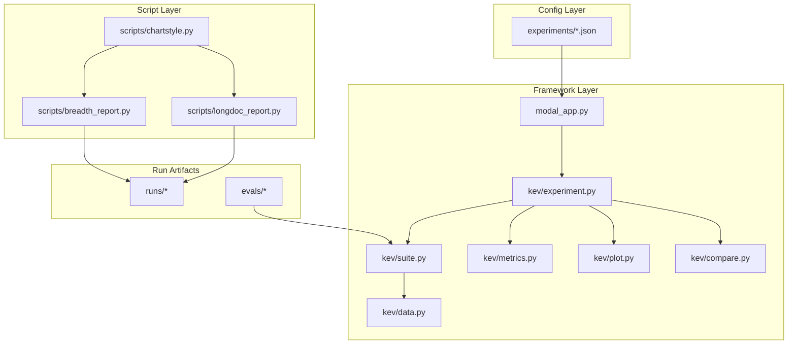
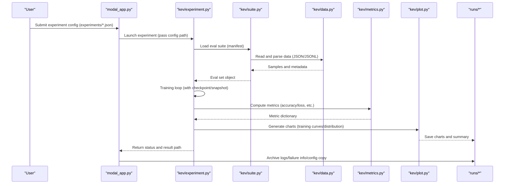
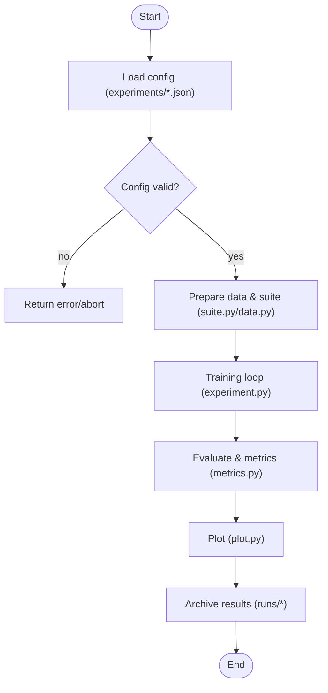
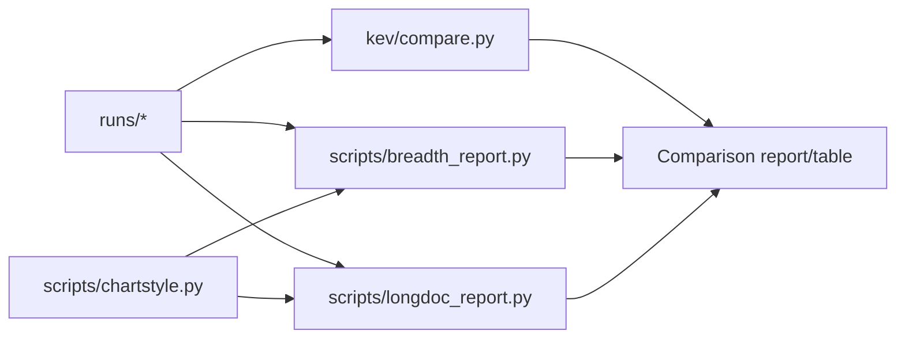
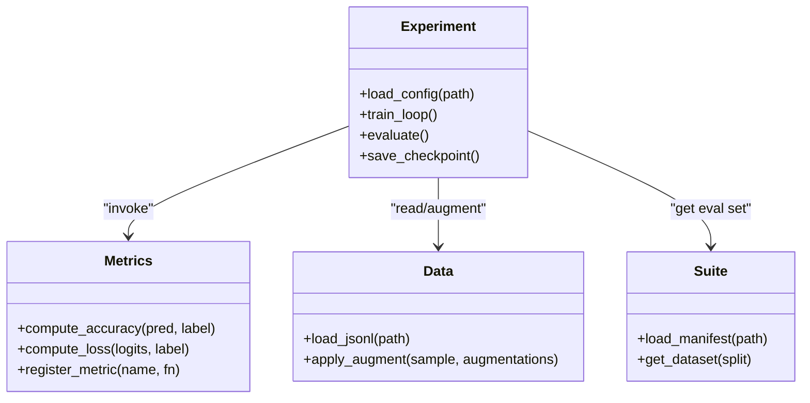
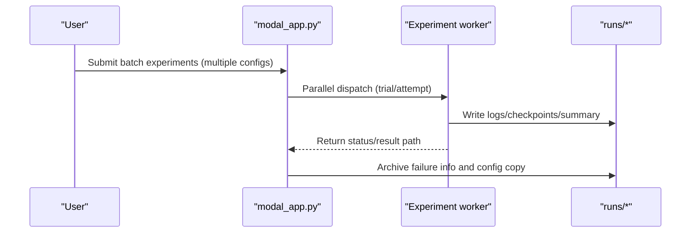
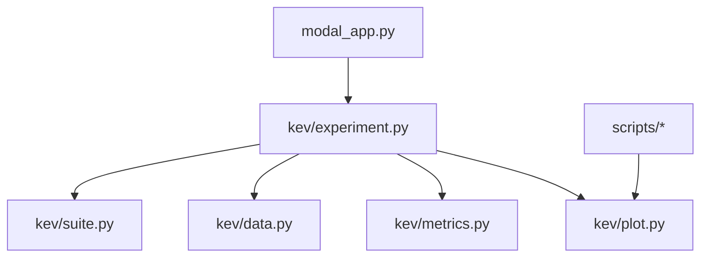

## Table of Contents
1. [Overview](#overview)
2. [Project Structure](#project-structure)
3. [Core Components](#core-components)
4. [Architecture Overview](#architecture-overview)
5. [Detailed Component Analysis](#detailed-component-analysis)
6. [Dependency Analysis](#dependency-analysis)
7. [Performance and Scalability](#performance-and-scalability)
8. [Troubleshooting Guide](#troubleshooting-guide)
9. [Conclusion](#conclusion)
10. [Appendix](#appendix)

## Overview
This document is a comprehensive reference for the Kev experiment framework, aimed at experiment designers, training engineers, and result analysts. It covers:
- Experiment config format (JSON): field definitions, parameter descriptions, and how the hyperparameter search space is organized
- Experiment execution flow: the end-to-end process from config loading to training, evaluation, and result archiving
- Result analysis tools: usage and output conventions for comparison, visualization, and statistical analysis scripts
- Experiment management best practices: naming conventions, version control, and result archiving strategies
- Custom extensions: integration paths for adding evaluation metrics, training strategies, and data augmentation methods
- Distributed experiments: key points for configuration and execution in the Modal environment

## Project Structure
The Kev repository is organized around "experiment config + run orchestration + evaluation and analysis":
- experiments: stores all JSON experiment configs, categorized by round, model scale, task type, etc.
- kev: the framework's core code, including the experiment lifecycle, data loading, metric computation, plotting, and comparison
- scripts: a collection of result analysis and visualization scripts
- runs: the run artifacts of each experiment (logs, checkpoints, summaries, failure records, etc.)
- evals: evaluation datasets and manifests
- modal_app.py: the Modal-based experiment scheduler and remote execution entry point

Diagram Sources
- [modal_app.py:700-900](file://modal_app.py#L700-L900)
- [kev/experiment.py:1-200](file://kev/experiment.py#L1-L200)
- [kev/suite.py:120-170](file://kev/suite.py#L120-L170)
- [kev/data.py:350-390](file://kev/data.py#L350-L390)
- [scripts/breadth_report.py:1-120](file://scripts/breadth_report.py#L1-L120)
- [scripts/longdoc_report.py:1-120](file://scripts/longdoc_report.py#L1-L120)
- [scripts/chartstyle.py:1-120](file://scripts/chartstyle.py#L1-L120)

Section Sources
- [README.md:1-120](file://README.md#L1-L120)
- [PLAN.md:350-370](file://PLAN.md#L350-L370)

## Core Components
- Experiment config (JSON): describes training objectives, data sources, optimizer, learning rate scheduler, evaluation suite, save strategy, and resource limits, etc.
- Experiment engine (experiment.py): parses config, builds the training loop, triggers evaluation, and writes results and checkpoints
- Suite and data (suite.py, data.py): unified eval-set loading, sample parsing, and label handling
- Metrics and plotting (metrics.py, plot.py): standardized metric computation and chart generation
- Comparison tool (compare.py): cross-experiment result aggregation and difference analysis
- Scheduling and execution (modal_app.py): parallelizes experiments on cloud clusters, managing timeouts, retries, logs, and failure info

Section Sources
- [kev/experiment.py:1-200](file://kev/experiment.py#L1-L200)
- [kev/suite.py:120-170](file://kev/suite.py#L120-L170)
- [kev/data.py:350-390](file://kev/data.py#L350-L390)
- [kev/metrics.py:1-120](file://kev/metrics.py#L1-L120)
- [kev/plot.py:1-120](file://kev/plot.py#L1-L120)
- [kev/compare.py:1-120](file://kev/compare.py#L1-L120)
- [modal_app.py:700-900](file://modal_app.py#L700-L900)

## Architecture Overview
The diagram below shows the complete chain from config to results: the user submits a JSON config → Modal schedules → the experiment engine loads the config → data and suite are prepared → training and evaluation → metrics and plotting → results are archived and compared.

Diagram Sources
- [modal_app.py:700-900](file://modal_app.py#L700-L900)
- [kev/experiment.py:1-200](file://kev/experiment.py#L1-L200)
- [kev/suite.py:120-170](file://kev/suite.py#L120-L170)
- [kev/data.py:350-390](file://kev/data.py#L350-L390)
- [kev/metrics.py:1-120](file://kev/metrics.py#L1-L120)
- [kev/plot.py:1-120](file://kev/plot.py#L1-L120)

## Detailed Component Analysis

### Experiment Config Format (JSON)
- Location and organization
  - Root-level examples: experiments/smoke.json, experiments/v7-final.json
  - Round templates: experiments/rounds/r10.json, etc.
  - Auto exploration: experiments/auto/*.json
- Typical fields (conceptual description)
  - Model and initialization: model name/weight path, whether to fine-tune, LoRA/full, etc.
  - Data and suite: eval set manifest path, data preprocessing options, sampling ratio
  - Training hyperparameters: learning rate, batch size, steps, optimizer, scheduler
  - Evaluation and metrics: evaluation suite, metric list, thresholds/decision rules
  - Storage and snapshots: checkpoint frequency, snapshot score points, result output directory
  - Resources and scheduling: device/GPU, concurrency, timeout, retry count
- Hyperparameter search space
  - Use experiments/auto/*.json or round templates to combine different hyperparameters for grid/random search
  - It is recommended to place variable parameters as placeholders in the template, with the scheduler instantiating the concrete config

Section Sources
- [experiments/smoke.json:1-120](file://experiments/smoke.json#L1-L120)
- [experiments/v7-final.json:1-120](file://experiments/v7-final.json#L1-L120)
- [experiments/rounds/r10.json:1-120](file://experiments/rounds/r10.json#L1-L120)

### Experiment Execution Flow
- Config loading
  - modal_app.py receives the config path and invokes the experiment engine
  - experiment.py parses the JSON, validates required fields, and merges defaults
- Data and suite preparation
  - suite.py loads the manifest, and data.py parses JSON/JSONL samples
- Training and evaluation
  - experiment.py drives the training loop and periodically saves checkpoints and snapshots
  - metrics.py computes metrics; plot.py generates charts
- Result archiving
  - modal_app.py collects logs, failure info, and config copies, and writes them to runs/*

Diagram Sources
- [modal_app.py:700-900](file://modal_app.py#L700-L900)
- [kev/experiment.py:1-200](file://kev/experiment.py#L1-L200)
- [kev/suite.py:120-170](file://kev/suite.py#L120-L170)
- [kev/data.py:350-390](file://kev/data.py#L350-L390)
- [kev/metrics.py:1-120](file://kev/metrics.py#L1-L120)
- [kev/plot.py:1-120](file://kev/plot.py#L1-L120)

Section Sources
- [modal_app.py:700-900](file://modal_app.py#L700-L900)
- [kev/experiment.py:1-200](file://kev/experiment.py#L1-L200)

### Result Analysis Tools
- Comparison scripts
  - compare.py: aggregates the results of multiple runs/* and generates a horizontal comparison table with significance-difference hints
- Report scripts
  - breadth_report.py: task report for breadth evaluation, summarizing key metrics and trends
  - longdoc_report.py: report generation for long-document evaluation, including the relationship chart between context length and performance
- Chart style
  - chartstyle.py: unified color scheme, fonts, and layout styles to ensure report consistency

Diagram Sources
- [kev/compare.py:1-120](file://kev/compare.py#L1-L120)
- [scripts/breadth_report.py:1-120](file://scripts/breadth_report.py#L1-L120)
- [scripts/longdoc_report.py:1-120](file://scripts/longdoc_report.py#L1-L120)
- [scripts/chartstyle.py:1-120](file://scripts/chartstyle.py#L1-L120)

Section Sources
- [kev/compare.py:1-120](file://kev/compare.py#L1-L120)
- [scripts/breadth_report.py:1-120](file://scripts/breadth_report.py#L1-L120)
- [scripts/longdoc_report.py:1-120](file://scripts/longdoc_report.py#L1-L120)
- [scripts/chartstyle.py:1-120](file://scripts/chartstyle.py#L1-L120)

### Experiment Management Best Practices
- Naming conventions
  - Config: experiments/{task}-{model}-{version}.json
  - Round: experiments/rounds/r{N}.json
  - Run: runs/{run-id}/trial-{T}/attempt-{A}/
- Version control
  - Include experiments/*.json in Git, and record the reason for changes and impact scope in commit messages
  - Use branches to isolate large changes (such as architecture/data pipelines); keep only stable configs on the main branch
- Result archiving
  - Independent directory per trial/attempt, containing logs, checkpoints, summaries, and failure records
  - Periodically archive important runs/* to long-term storage, and retain provenance (config copies, Git commit hashes)

Section Sources
- [modal_app.py:700-900](file://modal_app.py#L700-L900)
- [PLAN.md:350-370](file://PLAN.md#L350-L370)

### Custom Experiment Type Development Guide
- Add a new evaluation metric
  - Implement the new metric function in metrics.py, following the unified input/output interface
  - Register the metric in the experiment config and call it during the evaluation stage
- Add a new training strategy
  - Extend the training loop in experiment.py to support new optimization strategies or schedulers
  - Enable/switch strategies via config fields
- Add new data augmentation
  - Add an augmentation pipeline in data.py, providing a configurable list of augmentation methods
  - Inject augmentation steps into the data loading flow of suite.py

Diagram Sources
- [kev/experiment.py:1-200](file://kev/experiment.py#L1-L200)
- [kev/metrics.py:1-120](file://kev/metrics.py#L1-L120)
- [kev/data.py:350-390](file://kev/data.py#L350-L390)
- [kev/suite.py:120-170](file://kev/suite.py#L120-L170)

Section Sources
- [kev/experiment.py:1-200](file://kev/experiment.py#L1-L200)
- [kev/metrics.py:1-120](file://kev/metrics.py#L1-L120)
- [kev/data.py:350-390](file://kev/data.py#L350-L390)
- [kev/suite.py:120-170](file://kev/suite.py#L120-L170)

### Distributed Experiment Configuration and Execution
- Use Modal for distributed execution
  - modal_app.py is responsible for creating tasks, allocating resources, and setting timeouts and retries
  - Supports multi-GPU/multi-node parallelism, scheduled at the trial/attempt granularity
- Configuration key points
  - Specify device and concurrency in the JSON
  - Set timeout and retry strategies to avoid long blocking
  - Use logs and failure info in runs/* for monitoring and diagnosis

Diagram Sources
- [modal_app.py:700-900](file://modal_app.py#L700-L900)

Section Sources
- [modal_app.py:700-900](file://modal_app.py#L700-L900)

## Dependency Analysis
- Module coupling
  - experiment.py is the core coordinator, depending on suite.py, data.py, metrics.py, plot.py
  - modal_app.py acts as an external scheduler, decoupled from experiment.py, communicating via config path
- External dependencies
  - JSON/JSONL data formats (suite.py, data.py)
  - Charting libraries (plot.py, scripts/chartstyle.py)
  - Cloud runtime (modal_app.py)

Diagram Sources
- [kev/experiment.py:1-200](file://kev/experiment.py#L1-L200)
- [kev/suite.py:120-170](file://kev/suite.py#L120-L170)
- [kev/data.py:350-390](file://kev/data.py#L350-L390)
- [kev/metrics.py:1-120](file://kev/metrics.py#L1-L120)
- [kev/plot.py:1-120](file://kev/plot.py#L1-L120)
- [modal_app.py:700-900](file://modal_app.py#L700-L900)
- [scripts/chartstyle.py:1-120](file://scripts/chartstyle.py#L1-L120)

Section Sources
- [kev/experiment.py:1-200](file://kev/experiment.py#L1-L200)
- [modal_app.py:700-900](file://modal_app.py#L700-L900)

## Performance and Scalability
- Training efficiency
  - Reasonably set batch size and micro-batch balancing strategy, combined with shared prefixes and FSDP to improve throughput
  - Use snapshot score points to reduce unnecessary full saves
- Evaluation overhead
  - Use batched evaluation and caching for large-scale eval sets
- Scalability
  - The plugin design of metrics and data augmentation facilitates extension
  - Use Modal's elastic scaling to handle peak loads

[This section provides general guidance and does not directly analyze specific files]

## Troubleshooting Guide
- Common errors
  - Missing config or wrong field type: check the required items and types of experiments/*.json
  - Data parsing exceptions: confirm that the evals manifest is consistent with the JSON/JSONL format
  - Training interruption: check runs/* logs and failure records, adjust timeout and retries
- Localization methods
  - Use compare.py to compare the differences between adjacent trials and locate regressions
  - Use breadth_report.py/longdoc_report.py to quickly spot metric anomalies
- Recovery strategies
  - Resume training from the most recent checkpoint (resume)
  - Clean up failed attempts and re-schedule

Section Sources
- [modal_app.py:700-900](file://modal_app.py#L700-L900)
- [PLAN.md:350-370](file://PLAN.md#L350-L370)

## Conclusion
Centered on JSON configs and combined with Modal's distributed scheduling and modular core code, the Kev experiment framework provides a complete closed loop from training to evaluation, archiving, and analysis. Through standardized naming and version control, a complete script toolchain, and extensible metric/data-augmentation interfaces, teams can efficiently run large-scale experiments and continuously iterate on model capabilities.

[This section is a summary and does not directly analyze specific files]

## Appendix
- Common commands and paths
  - Run experiments: submit experiments/*.json via modal_app.py
  - View results: runs/{run-id}/trial-{T}/attempt-{A}/
  - Generate reports: scripts/breadth_report.py, scripts/longdoc_report.py
- Reference examples
  - experiments/smoke.json, experiments/v7-final.json, experiments/rounds/r10.json

[This section is supplementary information and does not directly analyze specific files]
