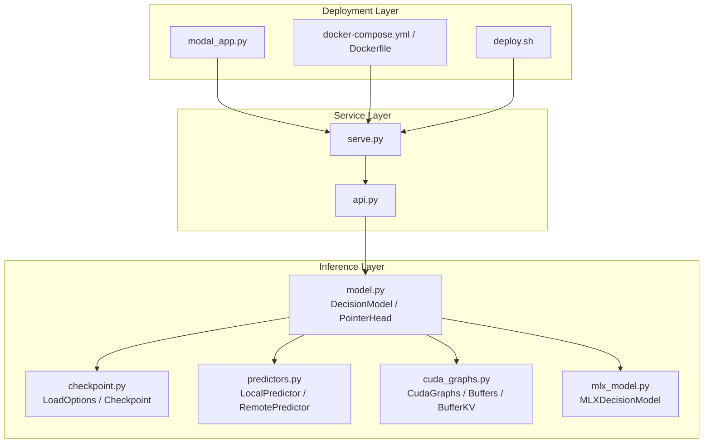
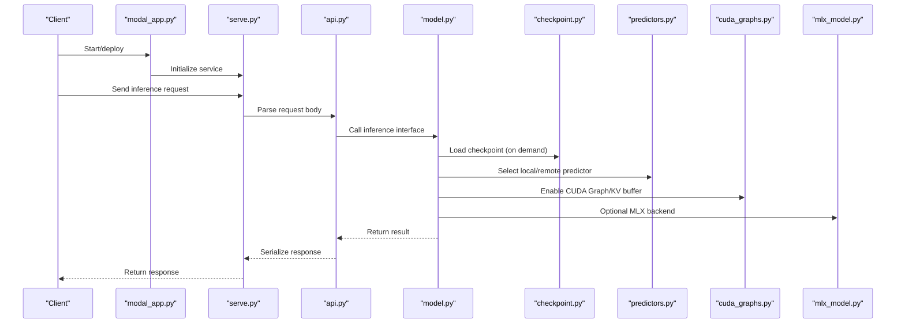
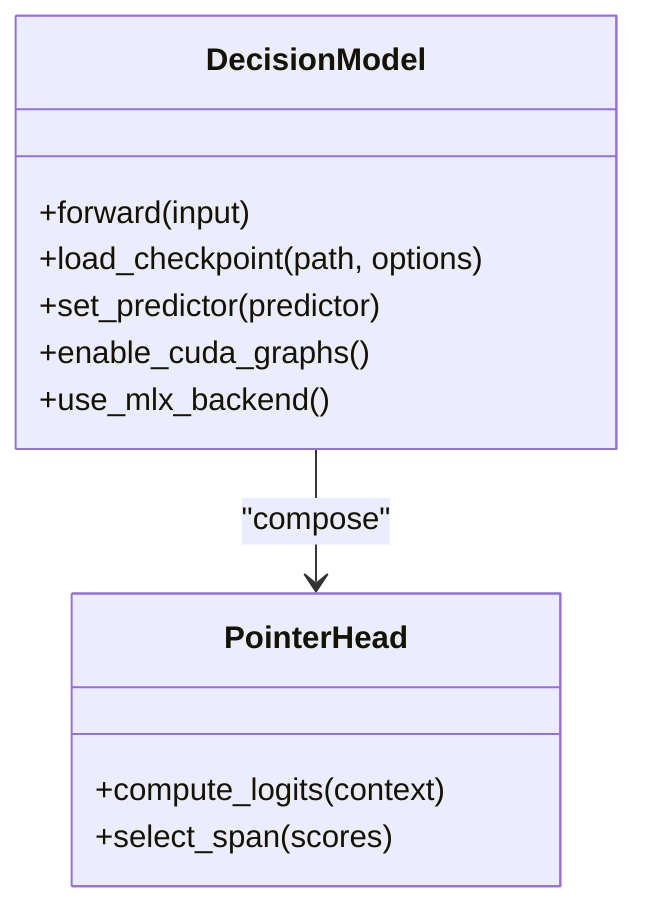
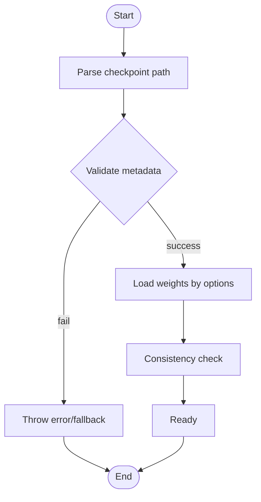
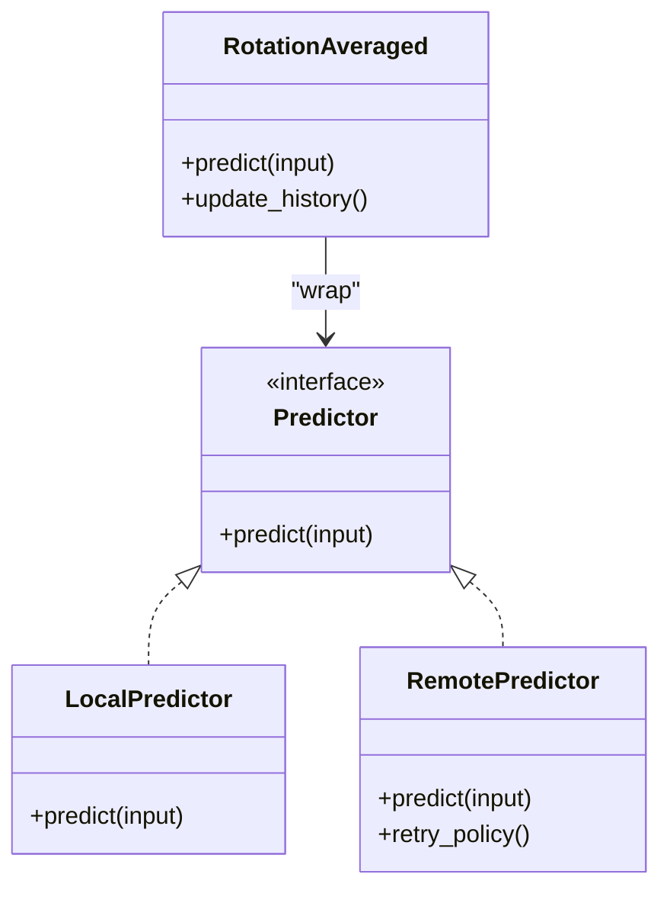
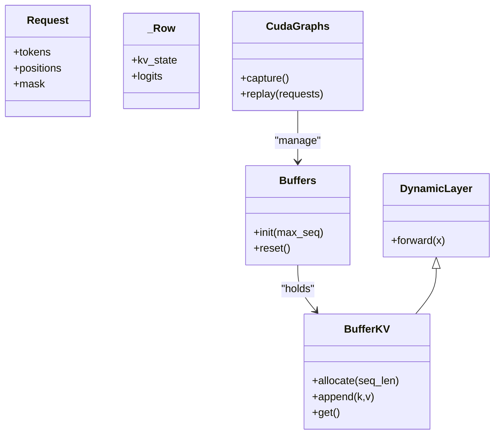
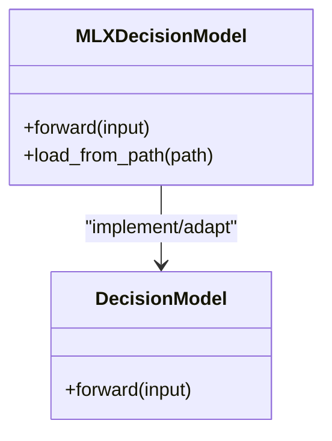
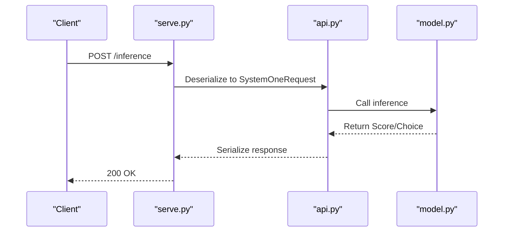
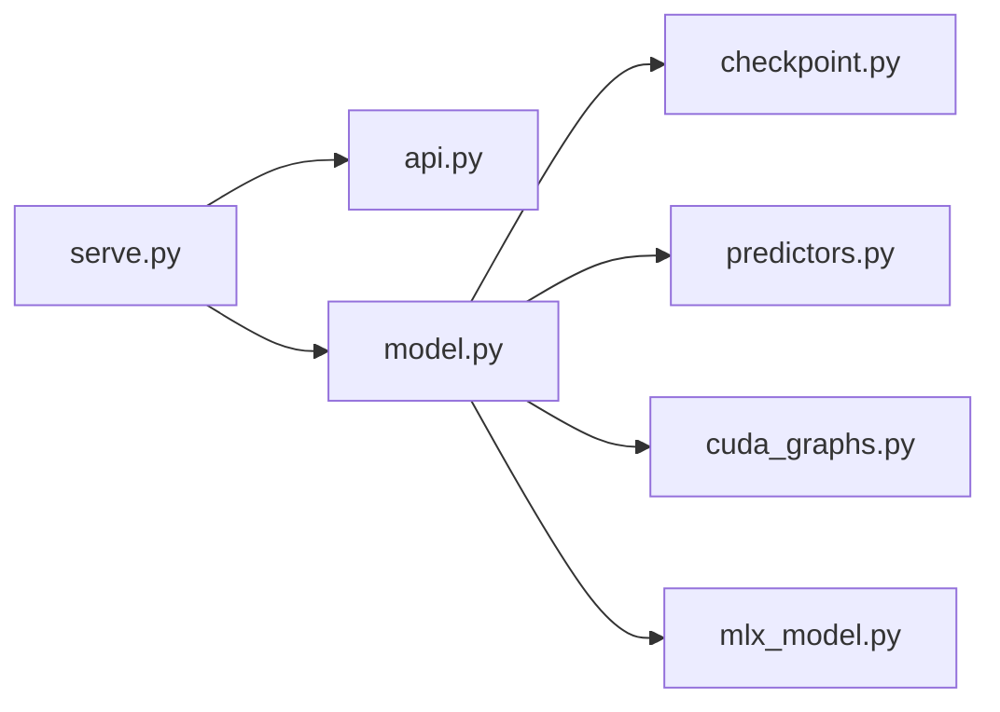

## Table of Contents
1. [Overview](#overview)
2. [Project Structure](#project-structure)
3. [Core Components](#core-components)
4. [Architecture Overview](#architecture-overview)
5. [Detailed Component Analysis](#detailed-component-analysis)
6. [Dependency Analysis](#dependency-analysis)
7. [Performance Considerations](#performance-considerations)
8. [Troubleshooting Guide](#troubleshooting-guide)
9. [Conclusion](#conclusion)
10. [Appendix](#appendix)

## Overview
This project is a "knowledge graph system" oriented toward inference and deployment, providing training, evaluation, serving, and cloud deployment capabilities around a decision model (DecisionModel). The system is organized in a modular way and covers:
- Model definition and inference interface
- Checkpoint loading and management
- Local and remote predictors
- CUDA Graph acceleration and KV cache
- MLX backend adaptation
- API and serving orchestration
- Docker/Modal deployment scripts

This repository also contains a large amount of experiment and evaluation data, but this document focuses on the core code structure and runtime flow to help readers quickly understand and get started with the system.

## Project Structure
- Top-level scripts and configuration
  - README.md: project description and usage guide
  - pyproject.toml: Python package and dependency declarations
  - modal_app.py: Modal cloud application entry point
  - docker-compose.yml: container orchestration
  - Dockerfile: image build
  - deploy.sh: deployment script
- Core modules (kev/)
  - api.py: request/response data models
  - model.py: decision model and pointer head
  - checkpoint.py: checkpoint metadata and load options
  - predictors.py: local/remote predictors and rotation-average strategy
  - cuda_graphs.py: CUDA Graph and KV buffer management
  - mlx_model.py: MLX backend decision-model wrapper
  - serve.py: serving entry point (HTTP/WS, etc.)
- Other auxiliary modules (not expanded in this section)
  - anchors.py, benchmark.py, budget.py, calibrate.py, compare.py, composition.py, contrastive.py, data.py, device.py, evaluate.py, experiment.py, full_ft.py, fused_qwen35.py, jev.py, metrics.py, mirror.py, plot.py, publish.py, rounds.py, shared_prefix.py, study_v3.py, suite.py, train.py, transfer_v9.py

**Diagram Sources**
- [modal_app.py:1-200](file://modal_app.py#L1-L200)
- [docker-compose.yml:1-200](file://docker-compose.yml#L1-L200)
- [Dockerfile:1-200](file://Dockerfile#L1-L200)
- [deploy.sh:1-200](file://deploy.sh#L1-L200)
- [serve.py:1-200](file://kev/serve.py#L1-L200)
- [kev/api.py:1-200](file://kev/api.py#L1-L200)
- [kev/model.py:1-300](file://kev/model.py#L1-L300)
- [kev/checkpoint.py:1-200](file://kev/checkpoint.py#L1-L200)
- [kev/predictors.py:1-300](file://kev/predictors.py#L1-L300)
- [kev/cuda_graphs.py:1-200](file://kev/cuda_graphs.py#L1-L200)
- [mlx_model.py:1-200](file://mlx_model.py#L1-L200)

**Section Sources**
- [README.md:1-200](file://README.md#L1-L200)
- [pyproject.toml:1-200](file://pyproject.toml#L1-L200)

## Core Components
- Decision Model (DecisionModel)
  - Responsible for the core inference logic, including a PointerHead for locating key information
  - Exposes a unified inference interface for upper-layer services to call
- Checkpoint management (Checkpoint / LoadOptions)
  - Unified checkpoint metadata and load parameters, supporting different backends and devices
- Predictors (LocalPredictor / RemotePredictor)
  - The local predictor calls the model directly; the remote predictor calls the remote service via HTTP/gRPC, etc.
  - Supports rotation averaging (RotationAveraged) to improve stability
- CUDA Graph and KV buffer (CudaGraphs / Buffers / BufferKV)
  - Uses CUDA Graph to reduce kernel launch overhead
  - DynamicLayer and KV buffer optimize long-context inference
- MLX backend (MLXDecisionModel)
  - Provides a decision-model wrapper for the MLX platform, facilitating cross-platform inference
- API and serving (api.py / serve.py)
  - Define request/response data structures
  - Provide a serving entry point that routes external requests to model inference

**Section Sources**
- [kev/model.py:1-300](file://kev/model.py#L1-L300)
- [kev/checkpoint.py:1-200](file://kev/checkpoint.py#L1-L200)
- [kev/predictors.py:1-300](file://kev/predictors.py#L1-L300)
- [kev/cuda_graphs.py:1-200](file://kev/cuda_graphs.py#L1-L200)
- [mlx_model.py:1-200](file://mlx_model.py#L1-L200)
- [kev/api.py:1-200](file://kev/api.py#L1-L200)
- [serve.py:1-200](file://kev/serve.py#L1-L200)

## Architecture Overview
The system uses a layered architecture:
- Deployment layer: Modal/Docker/Shell scripts handle environment preparation and resource scheduling
- Service layer: serve.py exposes HTTP/WS interfaces, and api.py defines structured requests/responses
- Inference layer: model.py is the core model, checkpoint.py handles weight loading, predictors.py abstracts local/remote inference paths, cuda_graphs.py provides GPU-side optimization, and mlx_model.py adapts the MLX backend

**Diagram Sources**
- [modal_app.py:1-200](file://modal_app.py#L1-L200)
- [serve.py:1-200](file://kev/serve.py#L1-L200)
- [kev/api.py:1-200](file://kev/api.py#L1-L200)
- [kev/model.py:1-300](file://kev/model.py#L1-L300)
- [kev/checkpoint.py:1-200](file://kev/checkpoint.py#L1-L200)
- [kev/predictors.py:1-300](file://kev/predictors.py#L1-L300)
- [kev/cuda_graphs.py:1-200](file://kev/cuda_graphs.py#L1-L200)
- [mlx_model.py:1-200](file://mlx_model.py#L1-L200)

## Detailed Component Analysis

### Decision Model and Pointer Head (model.py)
- DecisionModel: encapsulates the model's forward logic, unifies input/output formats, and coordinates sub-modules
- PointerHead: used to locate key spans or entities from context, enhancing interpretability and retrieval ability

**Diagram Sources**
- [kev/model.py:1-300](file://kev/model.py#L1-L300)

**Section Sources**
- [kev/model.py:1-300](file://kev/model.py#L1-L300)

### Checkpoint Management (checkpoint.py)
- Meta: describes checkpoint metadata (version, hash, config, etc.)
- LoadOptions: controls load behavior (device, precision, sharding, etc.)
- Checkpoint: unified load and verification flow

**Diagram Sources**
- [kev/checkpoint.py:1-200](file://kev/checkpoint.py#L1-L200)

**Section Sources**
- [kev/checkpoint.py:1-200](file://kev/checkpoint.py#L1-L200)

### Predictor Abstraction (predictors.py)
- LocalPredictor: in-process local inference, low latency
- RemotePredictor: calls the remote service over the network, suitable for distributed deployment
- RotationAveraged: performs rotation averaging over multiple rounds of predictions to improve robustness

**Diagram Sources**
- [kev/predictors.py:1-300](file://kev/predictors.py#L1-L300)

**Section Sources**
- [kev/predictors.py:1-300](file://kev/predictors.py#L1-L300)

### CUDA Graph and KV Buffer (cuda_graphs.py)
- Request/_Row: define request and row-level data structures
- DynamicLayer: dynamic layer base class supporting runtime shape changes
- BufferKV: KV cache management, reducing repeated computation
- Buffers/CudaGraphs: batch management and graph execution optimization

**Diagram Sources**
- [kev/cuda_graphs.py:1-200](file://kev/cuda_graphs.py#L1-L200)

**Section Sources**
- [kev/cuda_graphs.py:1-200](file://kev/cuda_graphs.py#L1-L200)

### MLX Backend Adaptation (mlx_model.py)
- MLXDecisionModel: implements decision-model inference on the MLX platform, shielding underlying differences

**Diagram Sources**
- [mlx_model.py:1-200](file://mlx_model.py#L1-L200)
- [kev/model.py:1-300](file://kev/model.py#L1-L300)

**Section Sources**
- [mlx_model.py:1-200](file://mlx_model.py#L1-L200)

### API and Serving (api.py / serve.py)
- api.py: defines structured data models such as Noul, Choice, Score, SystemOneRequest, etc.
- serve.py: serving entry point, handling request lifecycle, logging, monitoring, and error handling

**Diagram Sources**
- [serve.py:1-200](file://kev/serve.py#L1-L200)
- [kev/api.py:1-200](file://kev/api.py#L1-L200)
- [kev/model.py:1-300](file://kev/model.py#L1-L300)

**Section Sources**
- [kev/api.py:1-200](file://kev/api.py#L1-L200)
- [serve.py:1-200](file://kev/serve.py#L1-L200)

## Dependency Analysis
- Module coupling
  - serve.py depends on api.py and model.py
  - model.py depends on checkpoint.py, predictors.py, cuda_graphs.py, and mlx_model.py
  - predictors.py and cuda_graphs.py are composed and used by model.py
- External dependencies
  - The deployment layer depends on the Modal/Docker/Shell toolchain
  - The inference layer depends on PyTorch/TensorFlow (depending on the backend), and possible networking libraries (RemotePredictor)

**Diagram Sources**
- [serve.py:1-200](file://kev/serve.py#L1-L200)
- [kev/api.py:1-200](file://kev/api.py#L1-L200)
- [kev/model.py:1-300](file://kev/model.py#L1-L300)
- [kev/checkpoint.py:1-200](file://kev/checkpoint.py#L1-L200)
- [kev/predictors.py:1-300](file://kev/predictors.py#L1-L300)
- [kev/cuda_graphs.py:1-200](file://kev/cuda_graphs.py#L1-L200)
- [mlx_model.py:1-200](file://mlx_model.py#L1-L200)

**Section Sources**
- [serve.py:1-200](file://kev/serve.py#L1-L200)
- [kev/api.py:1-200](file://kev/api.py#L1-L200)
- [kev/model.py:1-300](file://kev/model.py#L1-L300)

## Performance Considerations
- CUDA Graph and KV buffer
  - Reduce kernel launch overhead by capturing static computation graphs
  - KV cache reuse avoids repeated computation, significantly lowering long-context inference latency
- Predictor selection
  - The local predictor suits low-latency scenarios; the remote predictor suits horizontal scaling and resource isolation
- Rotation averaging
  - Fuses multiple prediction results to improve stability and generalization
- Batching and parallelism
  - It is recommended to combine the serving layer's concurrency model with a queue mechanism to maximize throughput

[This section provides general guidance and does not directly analyze specific files]

## Troubleshooting Guide
- Checkpoint load failure
  - Confirm the path and permissions are correct
  - Verify that the metadata version and config match
  - Check the device and precision settings in LoadOptions
- Service unavailable
  - Check serve.py's port occupancy and listening status
  - Validate that the API request body conforms to the schema
  - Check the exception stack traces and timeout info in the logs
- Poor inference performance
  - Confirm whether CUDA Graph and KV buffer are enabled
  - Adjust batch size and concurrency
  - Evaluate whether to switch to the local predictor or optimize the network link

**Section Sources**
- [kev/checkpoint.py:1-200](file://kev/checkpoint.py#L1-L200)
- [serve.py:1-200](file://kev/serve.py#L1-L200)
- [kev/api.py:1-200](file://kev/api.py#L1-L200)

## Conclusion
Centered on DecisionModel and combined with checkpoint management, predictor abstraction, CUDA Graph/KV optimization, and MLX backend adaptation, this system forms a complete knowledge-graph inference and serving solution. Through modular design and clear responsibility separation, it ensures extensibility while also taking deployment and operations convenience into account. It is recommended to prioritize enabling CUDA Graph and KV buffer in real scenarios, and to choose appropriate predictors and concurrency strategies based on load characteristics.

[This section is a summary and does not directly analyze specific files]

## Appendix
- Deployment references
  - Modal: see modal_app.py
  - Docker: see docker-compose.yml and Dockerfile
  - Shell scripts: see deploy.sh
- Dependencies and environment
  - Python package and dependencies: see pyproject.toml
  - Project description and quick start: see README.md

**Section Sources**
- [modal_app.py:1-200](file://modal_app.py#L1-L200)
- [docker-compose.yml:1-200](file://docker-compose.yml#L1-L200)
- [Dockerfile:1-200](file://Dockerfile#L1-L200)
- [deploy.sh:1-200](file://deploy.sh#L1-L200)
- [pyproject.toml:1-200](file://pyproject.toml#L1-L200)
- [README.md:1-200](file://README.md#L1-L200)
