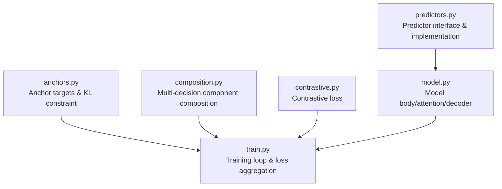
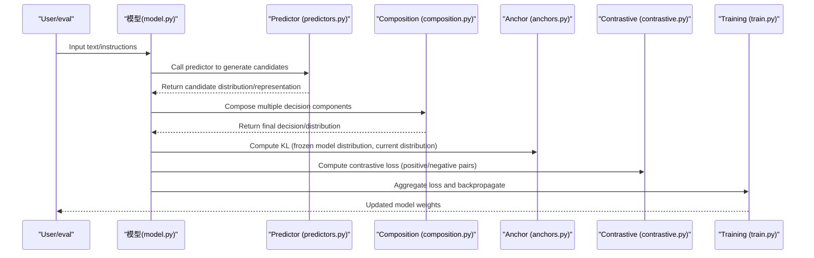
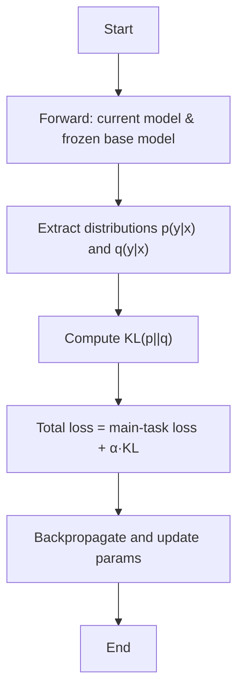
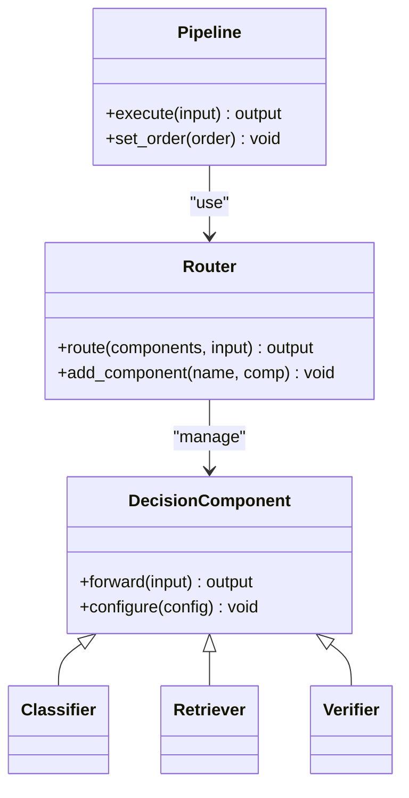
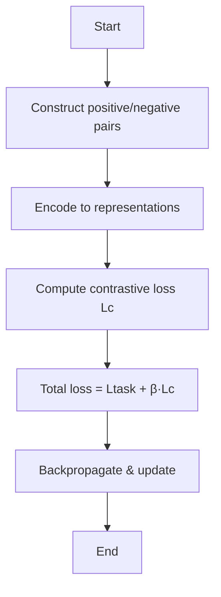
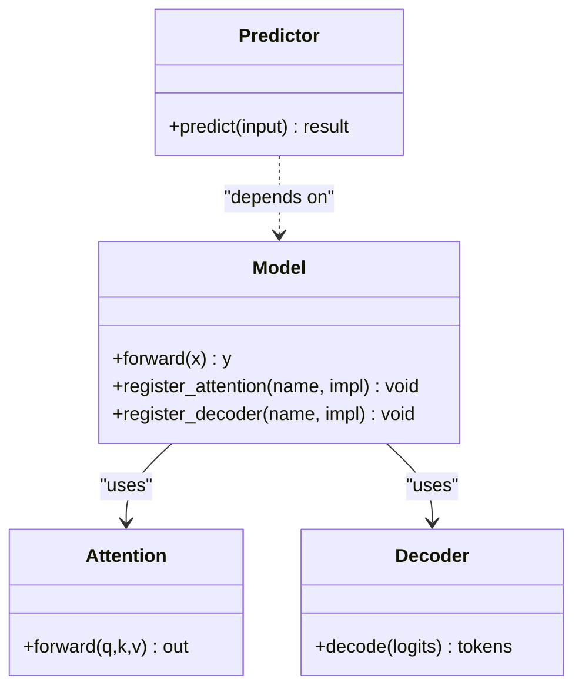
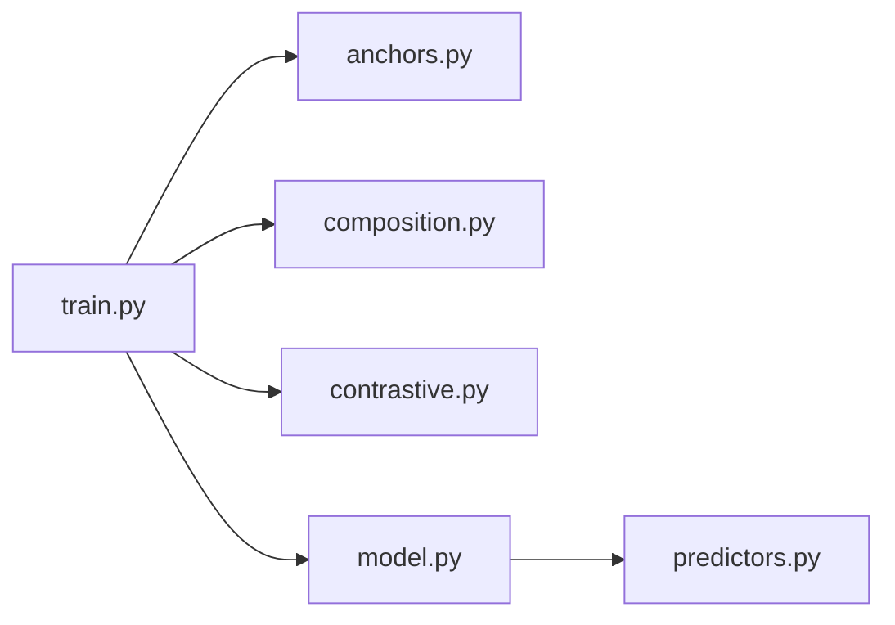

## Table of Contents
1. [Introduction](#introduction)
2. [Project Structure](#project-structure)
3. [Core Components](#core-components)
4. [Architecture Overview](#architecture-overview)
5. [Detailed Component Analysis](#detailed-component-analysis)
6. [Dependency Analysis](#dependency-analysis)
7. [Performance Considerations](#performance-considerations)
8. [Troubleshooting Guide](#troubleshooting-guide)
9. [Conclusion](#conclusion)
10. [Appendix](#appendix)

## Introduction
This document systematically explains Kev's model extension mechanism, focusing on the following topics:
- Anchor Targets: uses the zero-shot distribution of a frozen base model as a KL target to suppress "base-capability erosion" during fine-tuning.
- Composition strategy: composes multiple decision components into a complex reasoning system.
- Contrastive learning: improves discriminative ability through a contrastive loss function.
- Extension points: how to add new problem types, custom attention mechanisms, extend pointer-head decoders, and integrate new layer types, activation functions, and regularization techniques.
- Practical advice: performance optimization and best practices.

## Project Structure
Kev's core extension capabilities are concentrated in the following modules:
- anchors.py: implements anchor targets and KL constraints for stabilizing fine-tuning.
- composition.py: provides composition orchestration and routing logic for multiple decision components.
- contrastive.py: defines the contrastive loss and training flow.
- model.py: registration and assembly of the model body, attention, decoder, and other pluggable components.
- train.py: training loop, loss aggregation, optimizer scheduling, etc.
- predictors.py: predictor interface and implementations, supporting problem-type extension.

**Diagram Sources**
- [anchors.py:1-200](file://kev/anchors.py#L1-L200)
- [composition.py:1-200](file://kev/composition.py#L1-L200)
- [contrastive.py:1-200](file://kev/contrastive.py#L1-L200)
- [model.py:1-200](file://kev/model.py#L1-L200)
- [train.py:1-200](file://kev/train.py#L1-L200)
- [predictors.py:1-200](file://kev/predictors.py#L1-L200)

**Section Sources**
- [anchors.py:1-200](file://kev/anchors.py#L1-L200)
- [composition.py:1-200](file://kev/composition.py#L1-L200)
- [contrastive.py:1-200](file://kev/contrastive.py#L1-L200)
- [model.py:1-200](file://kev/model.py#L1-L200)
- [train.py:1-200](file://kev/train.py#L1-L200)
- [predictors.py:1-200](file://kev/predictors.py#L1-L200)

## Core Components
- Anchor Targets
  - Uses the frozen base model's output as the target distribution, applying a KL-divergence constraint on the current model's output to prevent degradation of base capabilities during fine-tuning.
  - Key points: the target distribution comes from the frozen model; the KL term is weighted in the total loss; weight control is supported at task or token granularity.
- Composition strategy
  - Composes multiple decision components (e.g., classifier, retriever, verifier) into a pipeline or graph structure, supporting conditional branching and dynamic routing.
  - Key points: unified component interface; configurable composition rules; supports parallel and serial execution modes.
- Contrastive Learning
  - Constructs a contrastive loss through positive/negative sample pairs to enhance the model's discrimination of similar/dissimilar inputs.
  - Key points: temperature parameter adjustment; in-batch negative sampling; can be jointly optimized with the main-task loss.
- Model Body and Extension Points
  - Attention, decoder, layer types, activation functions, and regularization can all be replaced via registries or factory methods.
  - Key points: unified interface contract; extensible configuration dictionary; backward-compatible default implementations.

**Section Sources**
- [anchors.py:1-200](file://kev/anchors.py#L1-L200)
- [composition.py:1-200](file://kev/composition.py#L1-L200)
- [contrastive.py:1-200](file://kev/contrastive.py#L1-L200)
- [model.py:1-200](file://kev/model.py#L1-L200)

## Architecture Overview
The diagram below shows the overall data flow from input to output, including where the anchor KL constraint, contrastive loss, and composition decision participate.

**Diagram Sources**
- [model.py:1-200](file://kev/model.py#L1-L200)
- [predictors.py:1-200](file://kev/predictors.py#L1-L200)
- [composition.py:1-200](file://kev/composition.py#L1-L200)
- [anchors.py:1-200](file://kev/anchors.py#L1-L200)
- [contrastive.py:1-200](file://kev/contrastive.py#L1-L200)
- [train.py:1-200](file://kev/train.py#L1-L200)

## Detailed Component Analysis

### Anchor Targets
- How it works
  - The frozen base model produces the target distribution q(y|x).
  - The current model p(y|x) is constrained by KL(p||q) to avoid deviating from base capabilities.
  - Different weight coefficients can be set at different tasks, tokens, or timesteps.
- Training flow
  - Forward: run the current model and the frozen base model simultaneously.
  - Loss: main-task loss + KL anchor loss (weighted).
  - Backward: update only trainable parameters; the frozen model does not participate in gradients.
- Extension methods
  - Add anchor targets: register a new target-distribution source in anchors.py (e.g., soft labels based on an external knowledge base).
  - Adjust KL weight: tune via configuration dictionary or hyperparameter search.

**Diagram Sources**
- [anchors.py:1-200](file://kev/anchors.py#L1-L200)
- [train.py:1-200](file://kev/train.py#L1-L200)

**Section Sources**
- [anchors.py:1-200](file://kev/anchors.py#L1-L200)
- [train.py:1-200](file://kev/train.py#L1-L200)

### Composition Strategy
- Design philosophy
  - Abstract multiple decision components into a unified interface, supporting serial, parallel, conditional branching, and loops.
  - Describe the dependencies and data flow between components via composition rules.
- Typical usage
  - First the retriever recalls candidates, then the classifier scores them, and finally the verifier validates them.
  - Dynamically select subsequent components based on a confidence threshold.
- Extension methods
  - Add decision components: implement the unified interface and register them in the composition registry.
  - Custom routing strategy: write conditional judgments or learned gating.

**Diagram Sources**
- [composition.py:1-200](file://kev/composition.py#L1-L200)

**Section Sources**
- [composition.py:1-200](file://kev/composition.py#L1-L200)

### Contrastive Learning
- Goals and motivation
  - Improve the discriminability of model representations by pulling positive pairs closer and pushing negative pairs apart.
- Implementation points
  - Temperature parameter τ controls the sharpness of the distribution.
  - In-batch negative sampling or an external negative pool.
  - Jointly optimized with the main-task loss, with an adjustable ratio coefficient β.
- Training flow
  - Construct positive/negative pairs → compute contrastive loss → weighted sum with main-task loss → backpropagate.

**Diagram Sources**
- [contrastive.py:1-200](file://kev/contrastive.py#L1-L200)
- [train.py:1-200](file://kev/train.py#L1-L200)

**Section Sources**
- [contrastive.py:1-200](file://kev/contrastive.py#L1-L200)
- [train.py:1-200](file://kev/train.py#L1-L200)

### Model Body and Extension Points
- Attention mechanism
  - Supports variants such as multi-head attention, relative position bias, and sparse attention.
  - Extension point: register a new attention implementation in model.py and switch via configuration.
- Decoder (pointer head)
  - Supports standard softmax decoding and pointer-network decoding.
  - Extension point: extend new decoding strategies (e.g., structured output, constrained decoding) in predictors.py or model.py.
- Layer types, activation functions, regularization
  - Layer types: linear, convolution, normalization, residual connections, etc. are replaceable.
  - Activation functions: ReLU, GELU, Swish, etc. can be injected via configuration.
  - Regularization: Dropout, LayerNorm, Weight Decay, Stochastic Depth, etc.
- Problem-type extension
  - Define a new problem's predictor class in predictors.py, implementing the unified interface.
  - Register the predictor in the composition strategy and configure its input/output format.

**Diagram Sources**
- [model.py:1-200](file://kev/model.py#L1-L200)
- [predictors.py:1-200](file://kev/predictors.py#L1-L200)

**Section Sources**
- [model.py:1-200](file://kev/model.py#L1-L200)
- [predictors.py:1-200](file://kev/predictors.py#L1-L200)

### Hands-on Examples (Code Snippet Paths)
- Add a new problem type
  - Reference path: [predictors.py:1-200](file://kev/predictors.py#L1-L200)
  - Steps: define a new predictor class → implement the predict interface → register it in the composition strategy → configure input/output.
- Custom attention mechanism
  - Reference path: [model.py:1-200](file://kev/model.py#L1-L200)
  - Steps: implement the Attention interface → register it in the model → enable via configuration.
- Extend the pointer-head decoder
  - Reference path: [model.py:1-200](file://kev/model.py#L1-L200), [predictors.py:1-200](file://kev/predictors.py#L1-L200)
  - Steps: implement the Decoder interface → register the decoder → select it during inference.

**Section Sources**
- [predictors.py:1-200](file://kev/predictors.py#L1-L200)
- [model.py:1-200](file://kev/model.py#L1-L200)

## Dependency Analysis
- Module coupling
  - train.py depends on anchors.py, contrastive.py, and model.py to aggregate losses and drive optimization.
  - composition.py and predictors.py are well decoupled, facilitating independent extension.
- External dependencies
  - Framework-level tensor operations and automatic differentiation (provided by the underlying deep learning framework).
  - Optional: distributed training, mixed precision, CUDA Graphs, and other acceleration features.

**Diagram Sources**
- [train.py:1-200](file://kev/train.py#L1-L200)
- [anchors.py:1-200](file://kev/anchors.py#L1-L200)
- [composition.py:1-200](file://kev/composition.py#L1-L200)
- [contrastive.py:1-200](file://kev/contrastive.py#L1-L200)
- [model.py:1-200](file://kev/model.py#L1-L200)
- [predictors.py:1-200](file://kev/predictors.py#L1-L200)

**Section Sources**
- [train.py:1-200](file://kev/train.py#L1-L200)
- [anchors.py:1-200](file://kev/anchors.py#L1-L200)
- [composition.py:1-200](file://kev/composition.py#L1-L200)
- [contrastive.py:1-200](file://kev/contrastive.py#L1-L200)
- [model.py:1-200](file://kev/model.py#L1-L200)
- [predictors.py:1-200](file://kev/predictors.py#L1-L200)

## Performance Considerations
- Anchor KL constraint
  - The forward overhead of the frozen base model must be counted in training cost; caching or batching can reduce repeated computation.
  - Set the KL weight α reasonably to avoid slow convergence caused by over-constraint.
- Contrastive learning
  - The temperature parameter τ affects numerical stability; a stable log-sum-exp implementation is recommended.
  - The number of negative samples is related to batch size; balance memory against discriminative effect.
- Composition strategy
  - Serial components may become a bottleneck; parallelize dependency-free components as much as possible.
  - Dynamic routing introduces extra overhead; evaluate whether the benefit is worth it.
- Decoder and attention
  - Pointer-network decoding may be slow on long sequences; combine with pruning or early-stop strategies.
  - Sparse attention reduces complexity but trades off expressiveness.

[This section provides general guidance and requires no specific file reference]

## Troubleshooting Guide
- KL divergence or non-convergence
  - Check whether the frozen model output is valid; confirm the KL weight α is not too large.
  - Reference path: [anchors.py:1-200](file://kev/anchors.py#L1-L200), [train.py:1-200](file://kev/train.py#L1-L200)
- Unstable contrastive loss
  - Adjust the temperature parameter τ; ensure positive/negative pairs are constructed correctly.
  - Reference path: [contrastive.py:1-200](file://kev/contrastive.py#L1-L200)
- Composition routing anomalies
  - Check the consistency of the component interface; confirm the routing condition logic.
  - Reference path: [composition.py:1-200](file://kev/composition.py#L1-L200)
- Decoder output anomalies
  - Verify the decoder implementation and configuration; check pointer-head dimension alignment.
  - Reference path: [model.py:1-200](file://kev/model.py#L1-L200), [predictors.py:1-200](file://kev/predictors.py#L1-L200)

**Section Sources**
- [anchors.py:1-200](file://kev/anchors.py#L1-L200)
- [contrastive.py:1-200](file://kev/contrastive.py#L1-L200)
- [composition.py:1-200](file://kev/composition.py#L1-L200)
- [model.py:1-200](file://kev/model.py#L1-L200)
- [predictors.py:1-200](file://kev/predictors.py#L1-L200)
- [train.py:1-200](file://kev/train.py#L1-L200)

## Conclusion
Kev's extension mechanism is built around three pillars — anchor KL constraint, compositional decision-making, and contrastive learning — providing clear extension points and flexible configuration. By following the unified interface and registration mechanism, users can conveniently add new problem types, customize attention and decoders, and integrate new layer types, activation functions, and regularization techniques. In practice, attention should be paid to key hyperparameters such as the KL weight, temperature parameter, and composition overhead, to achieve stable and efficient training and inference performance.

[This section is a summary and requires no specific file reference]

## Appendix
- Glossary
  - Anchor target: the target distribution produced by a frozen base model, used for the KL constraint.
  - Composition strategy: the mechanism of orchestrating multiple decision components into a complex reasoning system.
  - Contrastive learning: a method of optimizing representation discriminability through positive/negative sample pairs.
  - Pointer-head decoder: a decoding strategy based on a pointer network, supporting extractive output.

[This section is conceptual and requires no specific file reference]
