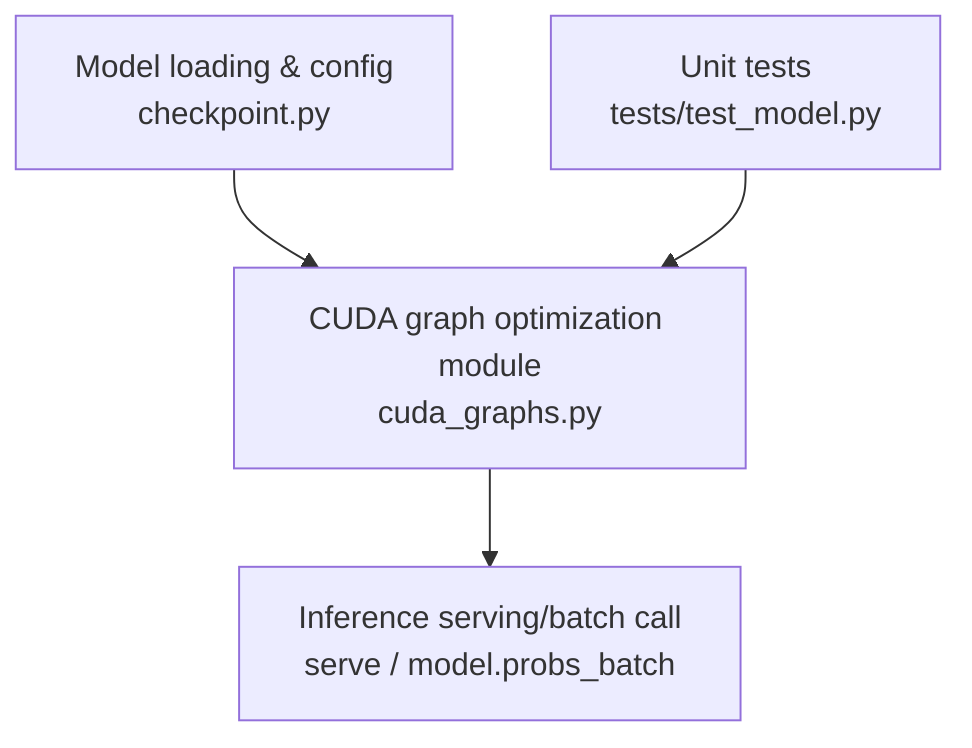
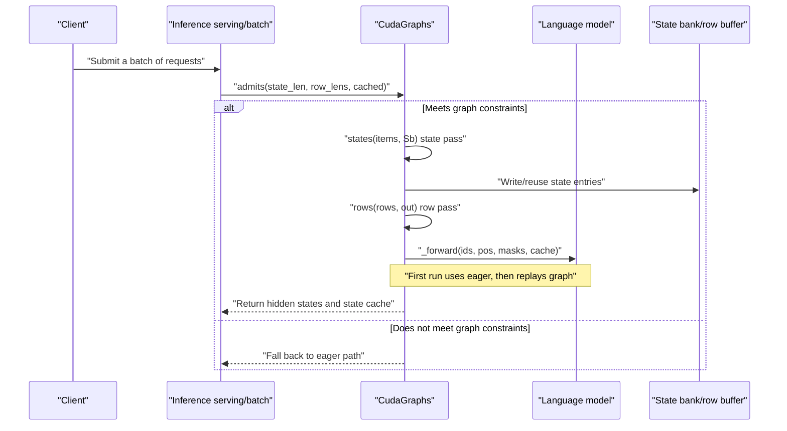
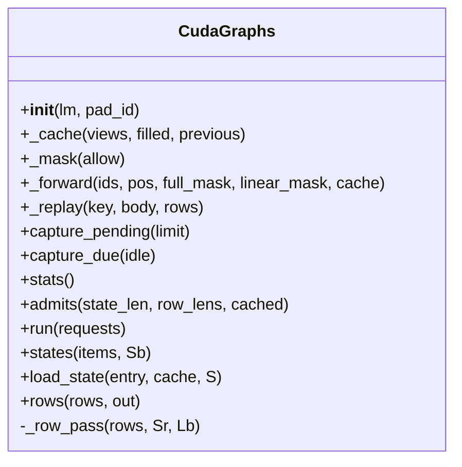
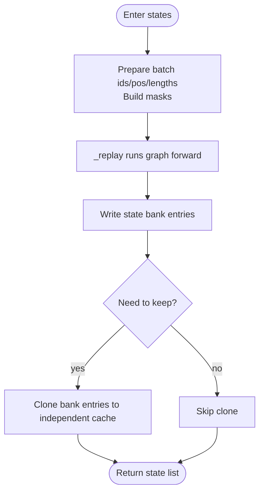
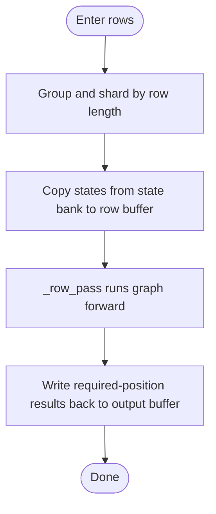
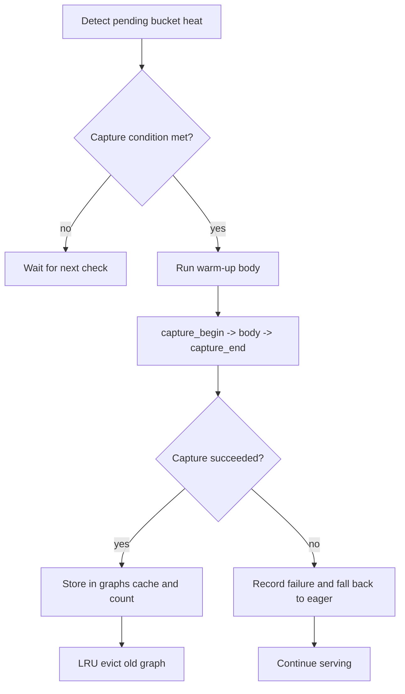
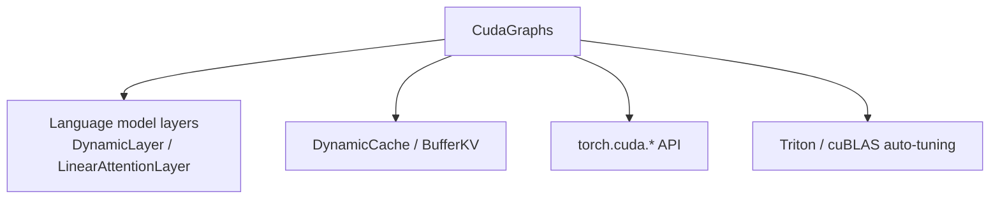

## Table of Contents
1. [Overview](#overview)
2. [Project Structure](#project-structure)
3. [Core Components](#core-components)
4. [Architecture Overview](#architecture-overview)
5. [Detailed Component Analysis](#detailed-component-analysis)
6. [Dependency Analysis](#dependency-analysis)
7. [Performance Considerations](#performance-considerations)
8. [Troubleshooting Guide](#troubleshooting-guide)
9. [Conclusion](#conclusion)
10. [Appendix](#appendix)

## Overview
This technical document focuses on the CUDA Graph optimization implementation in Kev's inference path. Centered on the capture-and-replay mechanism of torch.cuda.CUDAGraph, it explains how the two modes — "state pass" and "row pass" — merge a large number of kernel launches into a single execution, thereby significantly reducing Python/CUDA scheduling overhead. The document also details the buffer management strategy: the memory layout of the state bank and row buffers, and the pre-allocation of fixed-size buffers to avoid dynamic allocation; as well as key flows such as hot-bucket detection, asynchronous capture, and failure fallback. Finally, it provides benchmark testing points, tuning parameter descriptions (such as GRAPH_TOKENS, GRAPH_STATE, GRAPH_ROW, etc.), usage examples, and common troubleshooting suggestions.

## Project Structure
In Kev, the code directly related to CUDA graph optimization is concentrated in kev/cuda_graphs.py, with unit tests in tests/test_model.py. The overall organization is divided by functional modules: the CUDA graph optimization logic is an independent module, making it easy to enable on demand in the inference service.

Diagram Sources
- [cuda_graphs.py:165-375](file://kev/cuda_graphs.py#L165-L375)
- [test_model.py:321-351](file://tests/test_model.py#L321-L351)

Section Sources
- [cuda_graphs.py:165-375](file://kev/cuda_graphs.py#L165-L375)
- [test_model.py:321-351](file://tests/test_model.py#L321-L351)

## Core Components
- CudaGraphs: encapsulates the capture, replay, caching, and statistics of CUDA Graphs; provides the two key methods of state pass and row pass; maintains the state bank and row buffers; and is responsible for hot-bucket detection and asynchronous capture.
- Buffers: a low-level buffer abstraction used to generate views by layer type and reuse fixed-size GPU memory.
- DynamicCache/BufferKV/LinearAttentionLayer/DynamicLayer: model-side cache and attention-layer interfaces that require only in-place update semantics for attention layers and single-state DeltaNet layers, to guarantee buffer consistency during graph capture.

Section Sources
- [cuda_graphs.py:165-375](file://kev/cuda_graphs.py#L165-L375)

## Architecture Overview
The diagram below shows the overall data and control flow from request entry, through state pass and row pass, to graph replay.

Diagram Sources
- [cuda_graphs.py:267-375](file://kev/cuda_graphs.py#L267-L375)

## Detailed Component Analysis

### CudaGraphs Class and Key Methods
- Initialization and validation
  - Create the CUDA graph pool and capture stream; build the graph cache, pending capture queue, failure records, and statistics.
  - Probe the cache layout via one eager forward pass and validate that only attention layers and single-state DeltaNet layers are allowed, otherwise raise an exception.
  - Pre-allocate the state bank and row buffers, and construct shared views.
- Replay and capture
  - _replay: replay the graph if one exists; otherwise run eagerly and queue in pending for capture.
  - capture_pending: warm up and capture pending buckets in priority order by heat; on failure, keep the eager path and record the failure reason.
  - capture_due: decide whether to trigger a capture based on idle or hot-bucket thresholds.
- Inference scheduling
  - admits: determine whether a request can be processed by the graph path (based on row length and state length).
  - run: group state pass and row pass, output concatenated results and state cache.
  - states: graph forward for a batch of new states, producing state bank entries and an optional independent cache copy.
  - load_state: copy an external cache into the specified state bank entry.
  - rows/_row_pass: graph forward for a batch of question rows, writing the results at the required positions back to the output buffer.

Diagram Sources
- [cuda_graphs.py:165-375](file://kev/cuda_graphs.py#L165-L375)

Section Sources
- [cuda_graphs.py:165-375](file://kev/cuda_graphs.py#L165-L375)

### State Pass
- Goal: perform a single graph forward for a batch of new states (not yet present in the state bank), producing the bank entry corresponding to each state.
- Input: items = [(ids, pos, keep)], each state length not exceeding GRAPH_STATE.
- Process:
  - Construct left-padded ids/pos/real-length rows, and build the attention mask and linear-attention mask.
  - Execute a single graph forward via _forward, writing the result into the right-aligned region of the state bank.
  - For states that need to be retained, copy the bank entry into an independent DynamicCache for later use.
- Complexity and benefit: merge multiple short states into a single graph forward, reducing kernel launch and scheduling overhead.

Diagram Sources
- [cuda_graphs.py:301-330](file://kev/cuda_graphs.py#L301-L330)

Section Sources
- [cuda_graphs.py:301-330](file://kev/cuda_graphs.py#L301-L330)

### Row Pass
- Goal: perform a graph forward for a batch of question rows, read the corresponding states from the state bank, and compute and write out the required hidden states.
- Input: a list of _Row, containing ids, position, state length, bank entry index, output offset, etc.
- Process:
  - Group by row length and shard to fit the row buffer capacity (limited by GRAPH_TOKENS).
  - Copy the most recent Sr states of each row from the state bank to the row buffer, build the mask, then execute _forward.
  - index_copy the hidden states at the required positions into the final output buffer.
- Complexity and benefit: merge multiple rows into a single graph forward, avoiding per-row kernel launches.

Diagram Sources
- [cuda_graphs.py:340-375](file://kev/cuda_graphs.py#L340-L375)

Section Sources
- [cuda_graphs.py:340-375](file://kev/cuda_graphs.py#L340-L375)

### Buffer Management and Memory Layout
- State bank
  - Shape: [GRAPH_STATES, heads, BANK_WIDTH, dim] (attention layers); [GRAPH_STATES, *state] for DeltaNet layers.
  - States are right-aligned at the end of BANK_WIDTH, so that states of different lengths can share the same layout.
  - Generate per-layer views via bank.views(GRAPH_STATES, BANK_WIDTH) to ensure the state and row graphs share a consistent layout.
- Row buffer (rowbuf)
  - Shape: [GRAPH_TOKENS, GRAPH_ROWS], used to hold control information such as ids/pos/length.
  - Hidden buffer: [GRAPH_ROWS * GRAPH_ROW * hidden_size], holding intermediate row-forward results.
- Pre-allocation strategy
  - All buffers are allocated once at initialization to avoid fragmentation and latency caused by runtime dynamic allocation.
  - Reuse fixed memory via operations such as views and index_select to improve throughput and stability.

Section Sources
- [cuda_graphs.py:182-188](file://kev/cuda_graphs.py#L182-L188)
- [cuda_graphs.py:308-318](file://kev/cuda_graphs.py#L308-L318)
- [cuda_graphs.py:355-374](file://kev/cuda_graphs.py#L355-L374)

### Graph Capture Flow: Hot-Bucket Detection, Asynchronous Capture, Failure Fallback
- Hot-bucket detection
  - Count the eager run count of each bucket via pending and eager_runs, and select the capture order by heat.
  - capture_due triggers a capture when idle or when a bucket reaches the HOT_BUCKET threshold, avoiding request blocking.
- Asynchronous capture
  - Use an independent stream and graph_pool_handle to avoid affecting active requests on the current thread.
  - First run a warm-up body (triggering Triton/cuBLAS auto-tuning and lazy initialization), then begin capture_begin/capture_end.
- Failure fallback
  - On capture failure, clean up any residual graph pool routing, record the failure reason, mark the bucket as failed, and continue serving via the eager path.
  - Maintain server availability without interrupting service due to individual shape failures.

Diagram Sources
- [cuda_graphs.py:223-263](file://kev/cuda_graphs.py#L223-L263)

Section Sources
- [cuda_graphs.py:223-263](file://kev/cuda_graphs.py#L223-L263)

### Usage Examples and Integration Points
- Enable cuda_graphs=True when loading the model, and pass it via Checkpoint.load.
- The inference entry probs_batch calls admits/run, combining state pass and row pass to complete batching.
- Unit tests verify numerical consistency between the graph path and the eager path, covering extra-long state and extra-long row scenarios.

Section Sources
- [test_model.py:321-351](file://tests/test_model.py#L321-L351)

## Dependency Analysis
- Internal dependencies
  - CudaGraphs depends on the model config and layer types (DynamicLayer, LinearAttentionLayer), and requires only attention layers and single-state DeltaNet layers.
  - Depends on DynamicCache/BufferKV as cache-view abstractions to ensure buffer consistency during graph capture.
- External dependencies
  - CUDA APIs such as torch.cuda.graph_pool_handle, torch.cuda.Stream, torch.cuda.CUDAGraph, etc.
  - Triton/cuBLAS auto-tuning and lazy initialization must be warmed up outside capture.

Diagram Sources
- [cuda_graphs.py:165-375](file://kev/cuda_graphs.py#L165-L375)

Section Sources
- [cuda_graphs.py:165-375](file://kev/cuda_graphs.py#L165-L375)

## Performance Considerations
- Kernel launch merging
  - Merge thousands of kernel calls into a few graph replays via state pass and row pass, significantly reducing scheduling and synchronization overhead.
- Pre-allocated buffers
  - State bank and row buffers are allocated once, avoiding jitter and fragmentation from runtime dynamic allocation.
- Grouping and sharding
  - Group by state length and row length, and shard by GRAPH_TOKENS limit, maximizing intra-batch parallelism while avoiding overflow.
- Capture timing
  - Capture is triggered when idle or a hot-bucket threshold is reached, balancing latency and throughput; failure fallback guarantees service stability.
- Precision and numerical consistency
  - Unit tests verify the numerical error upper bound between the graph path and the eager path under bf16/fp32, ensuring optimization does not introduce bias.

Section Sources
- [cuda_graphs.py:267-375](file://kev/cuda_graphs.py#L267-L375)
- [test_model.py:321-351](file://tests/test_model.py#L321-L351)

## Troubleshooting Guide
- Capture failure
  - Symptom: prints "capturing ... failed, it runs eagerly", and the bucket continues to run via the eager path.
  - Cause: shape exceeds graph capability or insufficient memory; need to adjust GRAPH_TOKENS/GRAPH_STATE/GRAPH_ROW or reduce concurrency.
  - Handling: check the error type and message in the logs; if necessary, increase buffers or reduce batch size.
- Unsupported layer type
  - Symptom: initialization error "CUDA graphs support attention and single-state DeltaNet cache layers only".
  - Cause: there is a non-attention or non-single-state DeltaNet layer, or record_past semantics are used.
  - Handling: replace with supported layer types, or disable cuda_graphs.
- Numerical inconsistency
  - Symptom: the output difference between the graph path and the eager path exceeds the threshold.
  - Cause: mask or state layout inconsistency; check state right-alignment and mask construction.
  - Handling: regression unit test cases, confirming batch and length boundary conditions.

Section Sources
- [cuda_graphs.py:175-182](file://kev/cuda_graphs.py#L175-L182)
- [cuda_graphs.py:243-250](file://kev/cuda_graphs.py#L243-L250)
- [test_model.py:321-351](file://tests/test_model.py#L321-L351)

## Conclusion
Kev's CUDA graph optimization uses the two modes of state pass and row pass, combined with the fixed layout and pre-allocation strategy of the state bank and row buffers, to merge a large number of kernel launches into a few graph replays, significantly improving inference throughput and stability. The hot-bucket detection and asynchronous capture mechanism guarantees low latency while providing failure fallback to maintain service availability. Reasonably setting parameters such as GRAPH_TOKENS, GRAPH_STATE, and GRAPH_ROW, and grouping and sharding according to business load characteristics, can achieve good performance across different hardware and model scales.

## Appendix

### Key Configuration Items and Their Roles
- GRAPH_TOKENS: the total number of tokens a single pass can hold in the row pass (on the order of ~1 GB, depending on model scale), determining the row buffer size and sharding strategy.
- GRAPH_STATE: the maximum bucket length of a single state in the state pass; longer states go through the eager state pass and then batch rows.
- GRAPH_ROW: the maximum bucket length of a single question in the row pass; extra-long questions go through the eager row path.
- GRAPH_ROWS: the number of rows processed per graph pass; more rows are split into multiple replays.
- GRAPH_STATES: the number of entries processed per state pass (the number of state bank entries).

Section Sources
- [cuda_graphs.py:44-50](file://kev/cuda_graphs.py#L44-L50)
- [cuda_graphs.py:182-188](file://kev/cuda_graphs.py#L182-L188)
- [cuda_graphs.py:267-375](file://kev/cuda_graphs.py#L267-L375)
