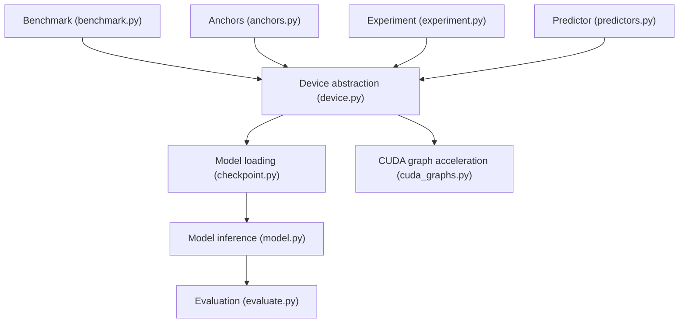
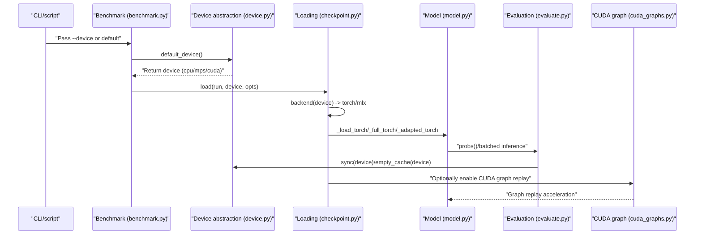
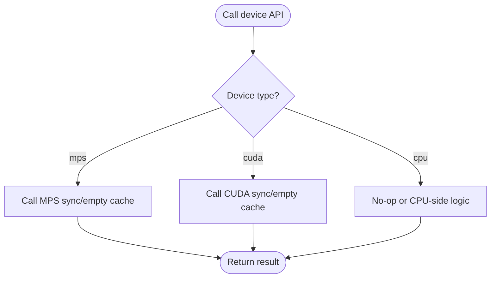
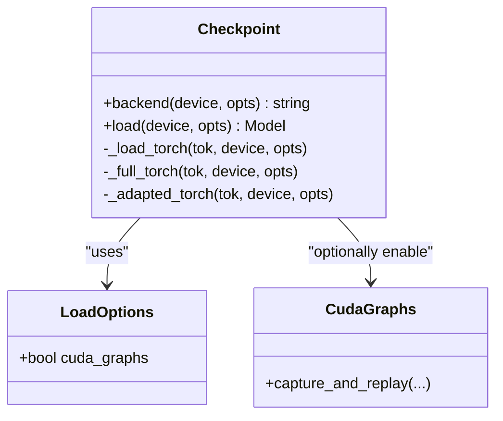
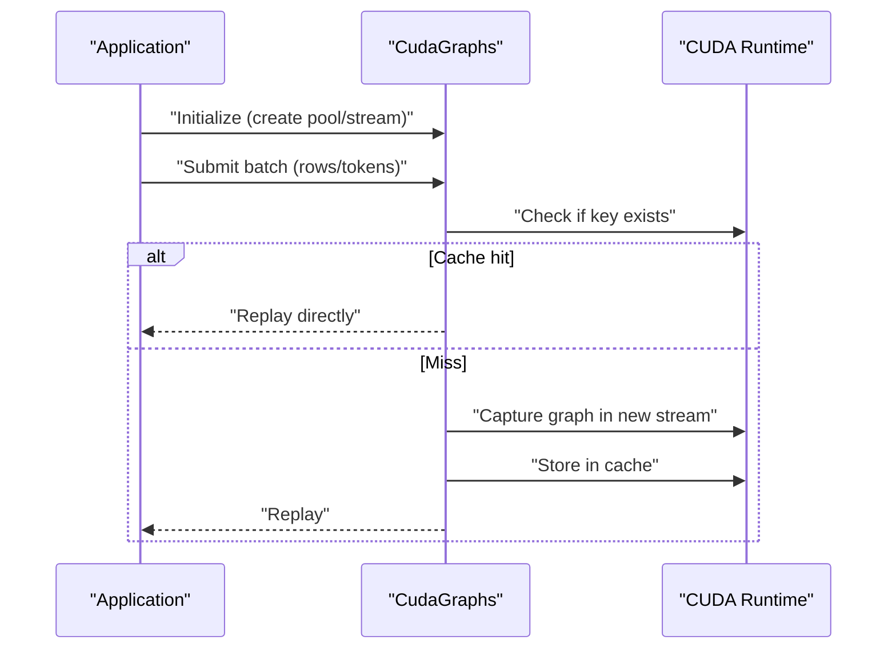
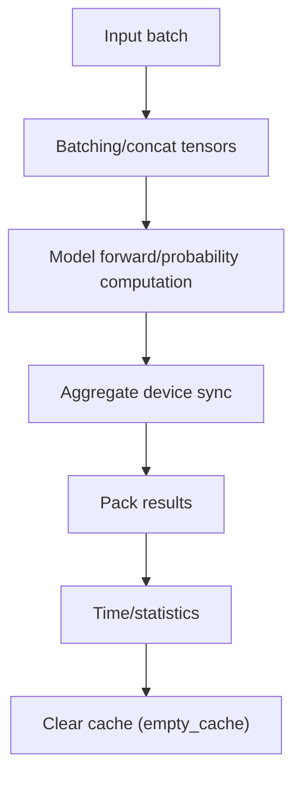
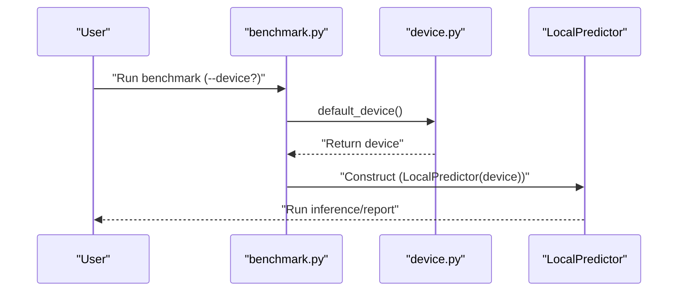
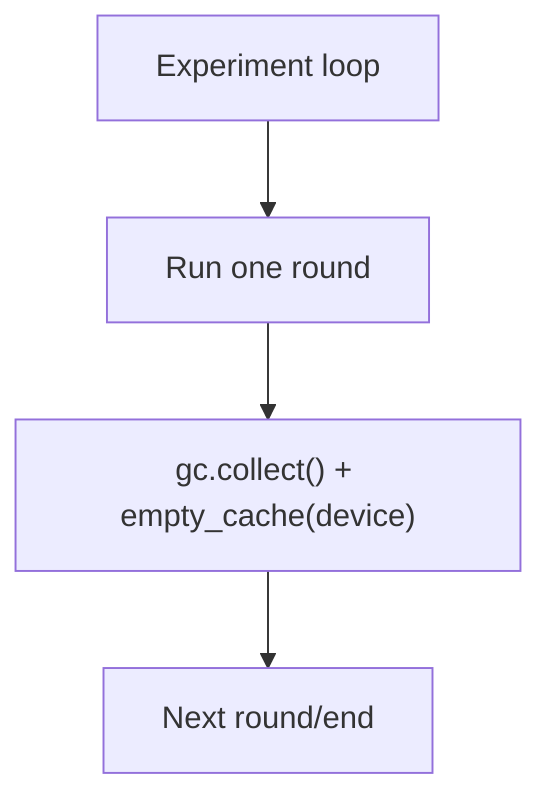
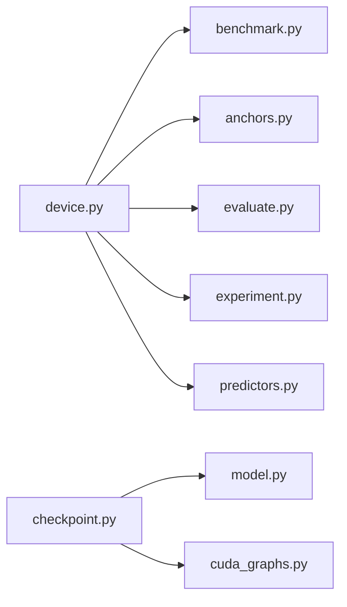

## Table of Contents
1. [Overview](#overview)
2. [Project Structure](#project-structure)
3. [Core Components](#core-components)
4. [Architecture Overview](#architecture-overview)
5. [Detailed Component Analysis](#detailed-component-analysis)
6. [Dependency Analysis](#dependency-analysis)
7. [Performance Considerations](#performance-considerations)
8. [Fault Diagnosis Guide](#fault-diagnosis-guide)
9. [Conclusion](#conclusion)
10. [Appendix](#appendix)

## Overview
This technical document focuses on the "device abstraction layer", systematically explaining how to design a unified interface that enables seamless switching between CPU, GPU (CUDA), and Apple Silicon (MPS). The content covers:
- Device detection and priority selection strategy
- Memory management abstraction (allocation, release, synchronization)
- Device-independent wrapping of tensor operations (type conversion, shape handling, precision control)
- Device-specific optimizations (CUDA streams and graphs, Metal backend, CPU vectorization)
- Multi-device parallelism patterns and performance comparison ideas
- Diagnosis and solutions for common device issues

## Project Structure
The key code around device abstraction is concentrated in the following modules:
- Device abstraction and default selection: device.py
- Model loading and backend selection (Torch/Metal/MLX): checkpoint.py
- CUDA graph acceleration and stream management: cuda_graphs.py
- Device usage in inference and evaluation: model.py, evaluate.py
- Benchmark entry point and parameters: benchmark.py
- Anchor construction and device passing: anchors.py
- Experiment execution and resource cleanup: experiment.py
- Synchronized calls in predictors: predictors.py

**Diagram Sources**
- [device.py:4-25](file://kev/device.py#L4-L25)
- [checkpoint.py:219-262](file://kev/checkpoint.py#L219-L262)
- [cuda_graphs.py:149-248](file://kev/cuda_graphs.py#L149-L248)
- [model.py:413-495](file://kev/model.py#L413-L495)
- [evaluate.py:16-200](file://kev/evaluate.py#L16-L200)
- [benchmark.py:179-201](file://kev/benchmark.py#L179-L201)
- [anchors.py:18-38](file://kev/anchors.py#L18-L38)
- [experiment.py:30-359](file://kev/experiment.py#L30-L359)
- [predictors.py:25-141](file://kev/predictors.py#L25-L141)

**Section Sources**
- [device.py:4-25](file://kev/device.py#L4-L25)
- [checkpoint.py:219-262](file://kev/checkpoint.py#L219-L262)
- [cuda_graphs.py:149-248](file://kev/cuda_graphs.py#L149-L248)
- [model.py:413-495](file://kev/model.py#L413-L495)
- [evaluate.py:16-200](file://kev/evaluate.py#L16-L200)
- [benchmark.py:179-201](file://kev/benchmark.py#L179-L201)
- [anchors.py:18-38](file://kev/anchors.py#L18-L38)
- [experiment.py:30-359](file://kev/experiment.py#L30-L359)
- [predictors.py:25-141](file://kev/predictors.py#L25-L141)

## Core Components
- Device abstraction and default selection
  - Provides a unified interface to obtain the default device and to perform synchronization and cache clearing across different backends.
  - Key capabilities: default_device(), sync(device), empty_cache(device), allocated_bytes(device).
- Model loading and backend selection
  - Automatically selects the Torch or MLX backend based on the device and base-model characteristics; prefers MLX on MPS with a hybrid base.
  - Supports enabling CUDA graph replay via an environment variable to improve serving throughput.
- CUDA graph and stream management
  - Captures and reuses computation graphs based on torch.cuda.graph, combined with an independent Stream and shared memory pool to reduce repeated overhead.
- Model inference and evaluation
  - Aggregates device synchronization in the inference path to reduce sync count; inserts synchronization and cache clearing in the evaluation flow to stabilize timing and memory usage.
- Benchmark and toolchain
  - The benchmark script exposes a --device option, defaulting to default_device(); anchor construction passes the device down to the model and tokenizer.
- Experiment and predictors
  - Experiment execution triggers garbage collection and empty cache after each round; predictors synchronize the device before and after requests to guarantee timing correctness.

**Section Sources**
- [device.py:4-25](file://kev/device.py#L4-L25)
- [checkpoint.py:219-262](file://kev/checkpoint.py#L219-L262)
- [cuda_graphs.py:149-248](file://kev/cuda_graphs.py#L149-L248)
- [model.py:413-495](file://kev/model.py#L413-L495)
- [evaluate.py:16-200](file://kev/evaluate.py#L16-L200)
- [benchmark.py:179-201](file://kev/benchmark.py#L179-L201)
- [anchors.py:18-38](file://kev/anchors.py#L18-L38)
- [experiment.py:30-359](file://kev/experiment.py#L30-L359)
- [predictors.py:25-141](file://kev/predictors.py#L25-L141)

## Architecture Overview
The diagram below shows the call chain from high-level scripts to the device abstraction, and the branching behavior on different hardware.

**Diagram Sources**
- [benchmark.py:179-201](file://kev/benchmark.py#L179-L201)
- [device.py:4-25](file://kev/device.py#L4-L25)
- [checkpoint.py:219-262](file://kev/checkpoint.py#L219-L262)
- [model.py:413-495](file://kev/model.py#L413-L495)
- [evaluate.py:16-200](file://kev/evaluate.py#L16-L200)
- [cuda_graphs.py:149-248](file://kev/cuda_graphs.py#L149-L248)

## Detailed Component Analysis

### Device Abstraction and Default Selection (device.py)
- Feature points
  - default_device(): returns the preferred device in the current environment (cpu/mps/cuda).
  - sync(device): calls the corresponding sync API for mps and cuda respectively.
  - empty_cache(device): calls the empty-cache API for mps/cuda.
  - allocated_bytes(device): queries allocated bytes for memory/GPU-memory monitoring.
- Design intent
  - Converge device differences into unified functions to avoid coupling the upper-layer logic to a specific backend.
  - Insert synchronization and cache clearing uniformly in evaluation, training, and prediction paths to ensure repeatability and stability.

**Diagram Sources**
- [device.py:4-25](file://kev/device.py#L4-L25)

**Section Sources**
- [device.py:4-25](file://kev/device.py#L4-L25)

### Model Loading and Backend Selection (checkpoint.py)
- Feature points
  - backend(device, opts): when device is mps and not an exact match, and there is an MLX and the base model is hybrid, select the mlx backend; otherwise use torch.
  - load(run, device, opts): select the loading path (mlx or torch) based on the backend.
  - _load_torch / _full_torch / _adapted_torch: provide different Torch-side loading variants.
  - The environment variable KEV_CUDA_GRAPHS controls whether CUDA graph replay is enabled in the serving path.
- Design intent
  - Centralize the "device → backend" mapping to facilitate adding new backends or adjusting the selection strategy.
  - Decouple optimization switches from configuration items and environment variables for flexible enabling in different deployment scenarios.

**Diagram Sources**
- [checkpoint.py:106-143](file://kev/checkpoint.py#L106-L143)
- [checkpoint.py:219-262](file://kev/checkpoint.py#L219-L262)
- [cuda_graphs.py:149-248](file://kev/cuda_graphs.py#L149-L248)

**Section Sources**
- [checkpoint.py:106-143](file://kev/checkpoint.py#L106-L143)
- [checkpoint.py:219-262](file://kev/checkpoint.py#L219-L262)

### CUDA Graph and Stream Management (cuda_graphs.py)
- Feature points
  - Initialize a shared memory pool and an independent Stream for graph capture and replay.
  - Avoid blocking synchronization and GC during the capture phase to prevent a busy server from stalling.
  - Use torch.cuda.CUDAGraph to capture subgraphs and cache captured graphs by key to reduce repeated overhead.
- Design intent
  - Encapsulate the "capture → cache → replay" flow so the upper layer need not care about low-level details.
  - Isolate CUDA calls from different threads via thread-local state to avoid cross-thread interference.

**Diagram Sources**
- [cuda_graphs.py:149-248](file://kev/cuda_graphs.py#L149-L248)

**Section Sources**
- [cuda_graphs.py:149-248](file://kev/cuda_graphs.py#L149-L248)

### Model Inference and Evaluation (model.py, evaluate.py)
- Inference path (model.py)
  - Aggregates device synchronization when producing batched output, reducing the overhead of multiple synchronizations.
  - Completes the computation of multiple question options with a fixed number of kernels and a single device synchronization, improving throughput.
- Evaluation path (evaluate.py)
  - Inserts sync(model.device) before and after key steps to ensure timing accuracy.
  - Calls empty_cache(dev) after evaluation to free GPU memory and avoid affecting subsequent tasks.

**Diagram Sources**
- [model.py:413-495](file://kev/model.py#L413-L495)
- [evaluate.py:16-200](file://kev/evaluate.py#L16-L200)

**Section Sources**
- [model.py:413-495](file://kev/model.py#L413-L495)
- [evaluate.py:16-200](file://kev/evaluate.py#L16-L200)

### Benchmark and Toolchain (benchmark.py, anchors.py)
- benchmark.py
  - Exposes the --device parameter, with choices including cpu/mps/cuda, defaulting to the value from default_device().
  - Passes the device to LocalPredictor, driving the subsequent inference path.
- anchors.py
  - Receives the device parameter; if unspecified, calls default_device().
  - Passes the device to the model and tokenizer to ensure data and weights are on the same device.

**Diagram Sources**
- [benchmark.py:179-201](file://kev/benchmark.py#L179-L201)
- [anchors.py:18-38](file://kev/anchors.py#L18-L38)
- [device.py:4-25](file://kev/device.py#L4-L25)

**Section Sources**
- [benchmark.py:179-201](file://kev/benchmark.py#L179-L201)
- [anchors.py:18-38](file://kev/anchors.py#L18-L38)

### Experiment and Predictors (experiment.py, predictors.py)
- experiment.py
  - Triggers gc.collect() and empty_cache(device) at the end of the experiment loop to stabilize memory usage.
- predictors.py
  - Calls sync(self.device) before and after requests to guarantee the timing consistency of the async pipeline.

**Diagram Sources**
- [experiment.py:30-359](file://kev/experiment.py#L30-L359)
- [predictors.py:25-141](file://kev/predictors.py#L25-L141)

**Section Sources**
- [experiment.py:30-359](file://kev/experiment.py#L30-L359)
- [predictors.py:25-141](file://kev/predictors.py#L25-L141)

## Dependency Analysis
- Component coupling
  - device.py is referenced in many places as a unified device-access entry point; it has low coupling but high cohesion.
  - checkpoint.py depends on device semantics (such as str(device) == "mps"), and can optionally import cuda_graphs.
  - model.py and evaluate.py perform synchronization and cache management via the device abstraction, avoiding direct backend API calls.
- External dependencies
  - PyTorch (CUDA/MPS), optional MLX (Apple Silicon backend).
- Potential cyclic dependencies
  - No obvious circular imports; cuda_graphs is dynamically imported only when needed, reducing startup cost.

**Diagram Sources**
- [device.py:4-25](file://kev/device.py#L4-L25)
- [checkpoint.py:219-262](file://kev/checkpoint.py#L219-L262)
- [cuda_graphs.py:149-248](file://kev/cuda_graphs.py#L149-L248)
- [benchmark.py:179-201](file://kev/benchmark.py#L179-L201)
- [anchors.py:18-38](file://kev/anchors.py#L18-L38)
- [evaluate.py:16-200](file://kev/evaluate.py#L16-L200)
- [experiment.py:30-359](file://kev/experiment.py#L30-L359)
- [predictors.py:25-141](file://kev/predictors.py#L25-L141)

**Section Sources**
- [device.py:4-25](file://kev/device.py#L4-L25)
- [checkpoint.py:219-262](file://kev/checkpoint.py#L219-L262)
- [cuda_graphs.py:149-248](file://kev/cuda_graphs.py#L149-L248)
- [benchmark.py:179-201](file://kev/benchmark.py#L179-L201)
- [anchors.py:18-38](file://kev/anchors.py#L18-L38)
- [evaluate.py:16-200](file://kev/evaluate.py#L16-L200)
- [experiment.py:30-359](file://kev/experiment.py#L30-L359)
- [predictors.py:25-141](file://kev/predictors.py#L25-L141)

## Performance Considerations
- CUDA graph replay
  - Capture and reuse subgraphs via CudaGraphs to significantly reduce repeated overhead; suitable for server-side batching scenarios.
  - It is recommended to enable it on demand via the environment variable KEV_CUDA_GRAPHS to avoid introducing extra complexity in inapplicable scenarios.
- Synchronization and batching
  - Aggregate synchronization for batched output in model.py to reduce sync count; insert synchronization at key nodes in evaluate.py to ensure timing accuracy.
- Memory management
  - Performing gc.collect() and empty_cache(device) at the end of the experiment loop helps stabilize long-running memory usage.
- Device selection
  - Default device selection should prefer GPU (CUDA/MPS) and fall back to CPU; on MPS with a hybrid base, prefer the MLX backend for better performance.

[This section provides general guidance and does not directly analyze specific files]

## Fault Diagnosis Guide
- Out of memory
  - Symptom: CUDA/OOM error or abnormal memory growth on MPS.
  - Troubleshooting:
    - Use allocated_bytes(device) to monitor allocated memory.
    - Call empty_cache(device) after evaluation or experiment to free the cache.
    - Reduce batch size or enable a lower dtype (such as bfloat16).
  - Reference locations:
    - [device.py:25-25](file://kev/device.py#L25-L25)
    - [evaluate.py:200-200](file://kev/evaluate.py#L200-L200)
    - [experiment.py:359-359](file://kev/experiment.py#L359-L359)
- Driver compatibility
  - Symptom: CUDA version and driver mismatch causing initialization failure or graph capture failure.
  - Troubleshooting:
    - Confirm the CUDA runtime is available; disable CUDA graphs if necessary (KEV_CUDA_GRAPHS=0).
    - On MPS, prefer the MLX backend (auto-selected by backend(device)).
  - Reference locations:
    - [checkpoint.py:219-224](file://kev/checkpoint.py#L219-L224)
    - [checkpoint.py:143-143](file://kev/checkpoint.py#L143-L143)
    - [cuda_graphs.py:227-248](file://kev/cuda_graphs.py#L227-L248)
- Performance bottleneck
  - Symptom: low throughput, high latency.
  - Troubleshooting:
    - Check whether CUDA graph replay is enabled; it is recommended for server-side batching scenarios.
    - Check the sync frequency: ensure aggregated sync in model.py to avoid frequent syncs.
    - Check device selection: ensure default_device() returns the expected device.
  - Reference locations:
    - [cuda_graphs.py:149-248](file://kev/cuda_graphs.py#L149-L248)
    - [model.py:413-495](file://kev/model.py#L413-L495)
    - [device.py:4-25](file://kev/device.py#L4-L25)

**Section Sources**
- [device.py:4-25](file://kev/device.py#L4-L25)
- [checkpoint.py:143-143](file://kev/checkpoint.py#L143-L143)
- [checkpoint.py:219-224](file://kev/checkpoint.py#L219-L224)
- [cuda_graphs.py:227-248](file://kev/cuda_graphs.py#L227-L248)
- [model.py:413-495](file://kev/model.py#L413-L495)
- [evaluate.py:200-200](file://kev/evaluate.py#L200-L200)
- [experiment.py:359-359](file://kev/experiment.py#L359-L359)

## Conclusion
This device abstraction layer encapsulates the differences among CPU, GPU (CUDA), and Apple Silicon (MPS) through a unified interface, achieving:
- Automated device detection and priority selection
- Unified wrapping of memory management and synchronization
- Strategic model loading and backend selection
- Optimized wrapping of CUDA graphs and streams
- Performance optimization practices in the inference and evaluation paths

This design allows upper-layer business code to be unaware of underlying device differences, while preserving room for fine-grained optimization per device.

[This section is a summary and does not directly analyze specific files]

## Appendix
- Device compatibility matrix (summarized from code behavior)
  - CPU: always available; dtype usually float32.
  - MPS (Apple Silicon): can be combined with the MLX backend; prefer MLX in hybrid-base scenarios.
  - CUDA (NVIDIA GPU): requires a matching CUDA runtime installed; CUDA graph replay can be enabled to improve throughput.
- Version requirements
  - PyTorch: must support CUDA and MPS; a newer version is recommended for better graph capture and performance.
  - MLX: optional dependency, used for hybrid-base optimization in MPS scenarios.
  - CUDA driver: must match the PyTorch/CUDA version to avoid graph capture failure.

[This section is supplementary information and does not directly analyze specific files]
