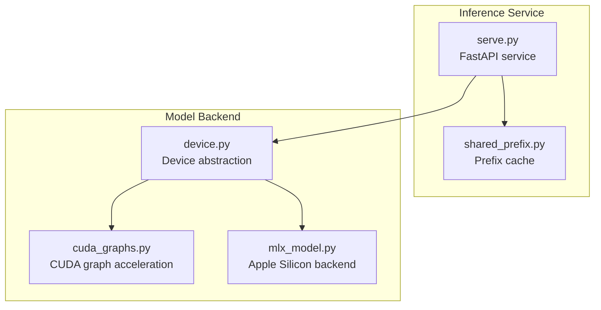
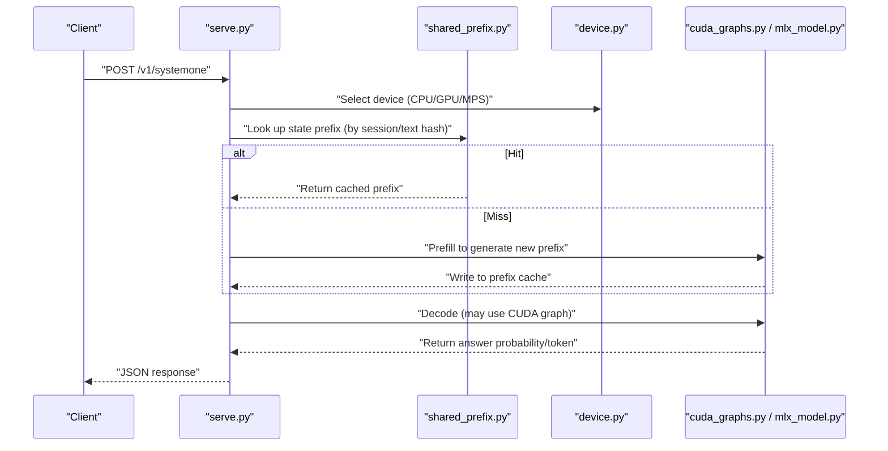
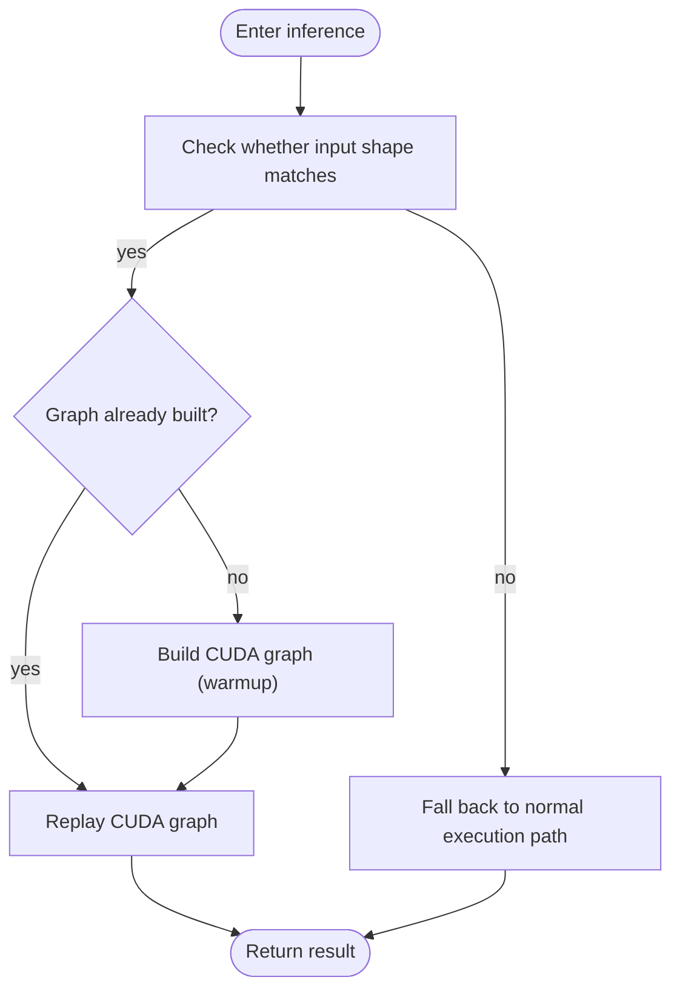
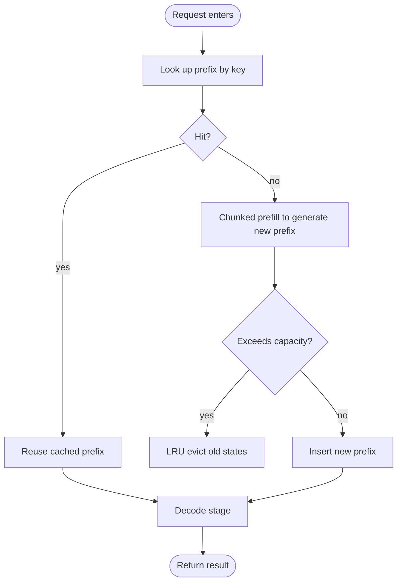
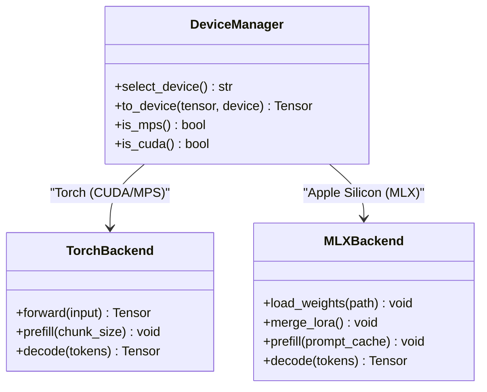
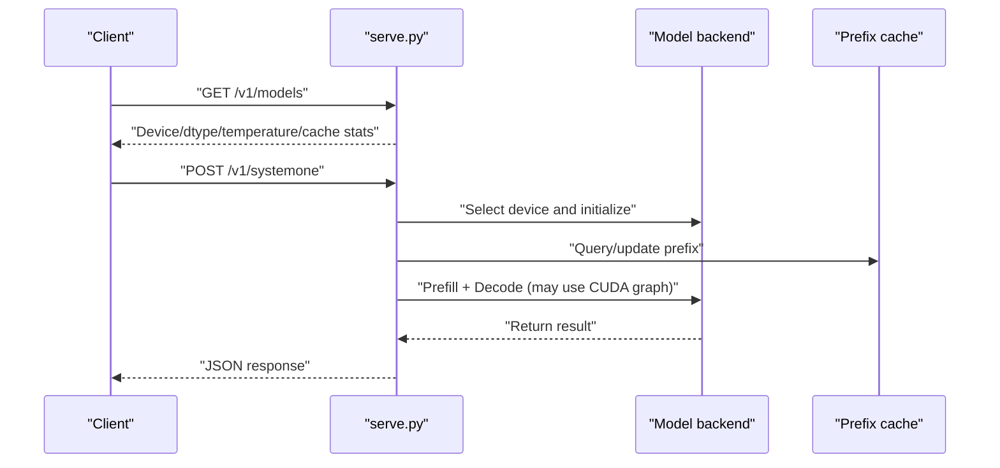
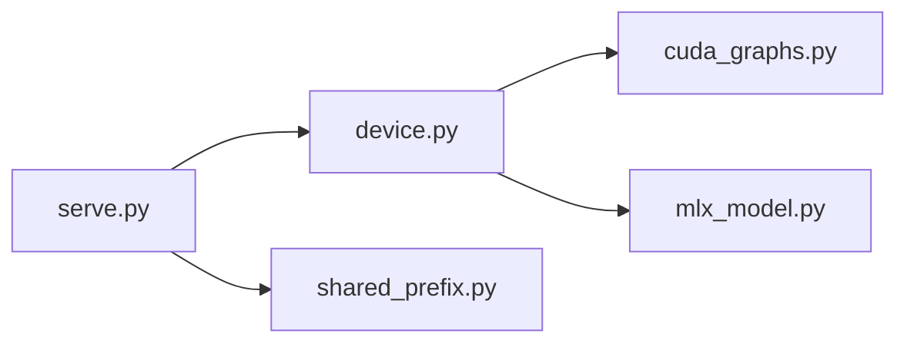

## Table of Contents
1. [Overview](#overview)
2. [Project Structure](#project-structure)
3. [Core Components](#core-components)
4. [Architecture Overview](#architecture-overview)
5. [Detailed Component Analysis](#detailed-component-analysis)
6. [Dependency Analysis](#dependency-analysis)
7. [Performance Considerations](#performance-considerations)
8. [Troubleshooting Guide](#troubleshooting-guide)
9. [Conclusion](#conclusion)

## Overview
This document focuses on Kev's performance optimization practices during the inference and serving stages, covering the following topics:
- CUDA graph optimization: reduce kernel launch overhead and improve throughput via torch.cuda.CUDAGraphs.
- Memory management and prefix cache: reuse state prefixes to reduce repeated computation and memory footprint.
- Parallel computation strategy: ideas and practical points for multi-GPU training, batching optimization, and pipeline parallelism.
- Device abstraction layer: seamless switching between CPU, GPU, and Apple Silicon (MLX).
- Performance monitoring and analysis: memory usage tracking, bottleneck identification, and throughput optimization techniques.
- Quantization and deployment optimization: the impact of quantization on performance and deployment recommendations.

## Project Structure
Kev's core implementation lives inside the kev package; the key performance-related modules are as follows:
- cuda_graphs.py: CUDA Graph wrapper and invocation entry point, used to accelerate inference.
- device.py: device selection and abstraction, unifying CPU/GPU/MPS backends.
- mlx_model.py: Apple Silicon backend (MLX), with an interface consistent with the Torch path.
- shared_prefix.py: prefix cache implementation, responsible for state-prefix hit, fill, and eviction.
- serve.py: FastAPI serving entry point, holding the model and prefix cache and exposing the inference API.
- README.md / AGENTS.md: project description, run methods, and performance metric references.

**Diagram Sources**
- [serve.py](file://kev/serve.py)
- [shared_prefix.py](file://kev/shared_prefix.py)
- [device.py](file://kev/device.py)
- [cuda_graphs.py](file://kev/cuda_graphs.py)
- [mlx_model.py](file://kev/mlx_model.py)

**Section Sources**
- [README.md](file://README.md)
- [AGENTS.md](file://AGENTS.md)

## Core Components
- CUDA graph optimization (cuda_graphs.py)
  - Goal: merge multiple kernel calls into a single graph execution, reducing Python/CUDA scheduling overhead and increasing throughput.
  - Use cases: inference stages with fixed-shape inputs and stable batches.
- Device abstraction (device.py)
  - Goal: hide underlying device differences and provide unified device selection and tensor placement logic.
  - Supports: CPU, NVIDIA GPU, Apple MPS/MLX.
- Apple Silicon backend (mlx_model.py)
  - Goal: efficient inference on M-series chips via the MLX engine, keeping an interface consistent with the Torch path.
  - Features: weight loading, LoRA merging, chunked prefill of the prompt cache.
- Prefix cache (shared_prefix.py)
  - Goal: reuse historical state prefixes to avoid repeated computation; LRU eviction policy controls memory usage.
  - Key parameters: max number of states, max token count, min token threshold, shape bucket size, etc.
- Serving entry (serve.py)
  - Goal: expose a REST API externally and manage the model instance and prefix cache lifecycle.
  - Integration: works in coordination with device abstraction, prefix cache, and CUDA graph optimization.

**Section Sources**
- [cuda_graphs.py](file://kev/cuda_graphs.py)
- [device.py](file://kev/device.py)
- [mlx_model.py](file://kev/mlx_model.py)
- [shared_prefix.py](file://kev/shared_prefix.py)
- [serve.py](file://kev/serve.py)

## Architecture Overview
The diagram below shows the key flow from request to inference, including device selection, prefix cache hit, CUDA graph execution, and result return.

**Diagram Sources**
- [serve.py](file://kev/serve.py)
- [shared_prefix.py](file://kev/shared_prefix.py)
- [device.py](file://kev/device.py)
- [cuda_graphs.py](file://kev/cuda_graphs.py)
- [mlx_model.py](file://kev/mlx_model.py)

## Detailed Component Analysis

### CUDA Graph Optimization (torch.cuda.CUDAGraphs)
- Design points
  - Capture a stable inference subgraph as a CUDA Graph to reduce kernel launch and synchronization overhead.
  - Suitable for inference paths with fixed shapes and batch sizes, typical of Q&A/classification tasks.
- Usage flow
  - Warmup: construct representative inputs to trigger graph building and baseline measurement.
  - Execution: subsequent inputs of the same shape directly replay the graph, avoiding Python-layer scheduling.
- Caveats
  - Dynamic shapes or frequently changing batches require rebuilding the graph or falling back to the normal execution path.
  - Ensure input/output tensors are on the correct device and have consistent shapes.

**Diagram Sources**
- [cuda_graphs.py](file://kev/cuda_graphs.py)

**Section Sources**
- [cuda_graphs.py](file://kev/cuda_graphs.py)

### Prefix Cache
- How it works
  - Generate a key based on the session or text content, and cache the intermediate state prefix (such as attention KV or hidden states).
  - LRU policy: when the cache exceeds the upper limit, evict the least recently used entries.
  - Chunked prefill: each read/write is done in fixed chunk sizes, balancing latency and throughput.
- Key configuration
  - KEV_PREFIX_CACHE: maximum number of states.
  - KEV_PREFIX_MAX_TOKENS: maximum cumulative token count across all states.
  - KEV_PREFIX_MIN_TOKENS: entries below this threshold are not cached (to avoid ineffective caching).
  - KEV_SHAPE_BUCKET: shape bucket size on MPS, reducing shape fragmentation.
- Behavioral characteristics
  - For pure-attention models, the default prefix_min_tokens=384; for hybrid architectures and the MLX backend it is 0 (the miss path recomputes states).
  - Space is reserved in advance (make_room) before batching, discarding soon-to-be-evicted states if necessary.

**Diagram Sources**
- [shared_prefix.py](file://kev/shared_prefix.py)

**Section Sources**
- [shared_prefix.py](file://kev/shared_prefix.py)
- [AGENTS.md](file://AGENTS.md)

### Device Abstraction Layer (CPU / GPU / Apple Silicon)
- Design goals
  - Unify device selection and tensor placement, hiding differences across backends.
  - Provide a consistent interface between Torch (CUDA/MPS) and MLX.
- Behavioral characteristics
  - Automatically detect available devices (CUDA, MPS, CPU).
  - On Apple Silicon, the MLX backend loads weights, performs LoRA merging (fp32 CPU stream), or loads full weights directly.
  - Coordinates with CUDA graph optimization: graph acceleration is enabled only on supported devices.

**Diagram Sources**
- [device.py](file://kev/device.py)
- [mlx_model.py](file://kev/mlx_model.py)

**Section Sources**
- [device.py](file://kev/device.py)
- [mlx_model.py](file://kev/mlx_model.py)
- [AGENTS.md](file://AGENTS.md)

### Serving Entry and Performance Integration (serve.py)
- Responsibilities
  - Expose FastAPI endpoints (/v1/systemone, /v1/models).
  - Hold the model instance and prefix cache, and coordinate device selection and the inference flow.
- Performance integration points
  - Combined with CUDA graph optimization to enable graph execution on supported hardware.
  - Linked with the prefix cache to reduce repeated computation and improve throughput.
  - Expose device, dtype, temperature, and prefix cache statistics for easy monitoring.

**Diagram Sources**
- [serve.py](file://kev/serve.py)
- [shared_prefix.py](file://kev/shared_prefix.py)
- [cuda_graphs.py](file://kev/cuda_graphs.py)

**Section Sources**
- [serve.py](file://kev/serve.py)
- [AGENTS.md](file://AGENTS.md)

## Dependency Analysis
- Module coupling
  - serve.py depends on device.py, shared_prefix.py, and the concrete backend (cuda_graphs.py or mlx_model.py).
  - shared_prefix.py is backend-independent, focusing only on the storage and eviction of state prefixes.
  - device.py acts as an abstraction layer, providing a unified interface upward to serve.py and connecting downward to Torch/MLX.
- External dependencies
  - PyTorch (CUDA/MPS), MLX (Apple Silicon), FastAPI.
- Potential cyclic dependencies
  - The current structure has no cyclic dependencies; front and back ends are decoupled via the device abstraction.

**Diagram Sources**
- [serve.py](file://kev/serve.py)
- [device.py](file://kev/device.py)
- [shared_prefix.py](file://kev/shared_prefix.py)
- [cuda_graphs.py](file://kev/cuda_graphs.py)
- [mlx_model.py](file://kev/mlx_model.py)

**Section Sources**
- [serve.py](file://kev/serve.py)
- [device.py](file://kev/device.py)
- [shared_prefix.py](file://kev/shared_prefix.py)
- [cuda_graphs.py](file://kev/cuda_graphs.py)
- [mlx_model.py](file://kev/mlx_model.py)

## Performance Considerations
- CUDA graph optimization
  - Suitable for inference with fixed shapes and stable batches; dynamic inputs require fallback or graph rebuild.
  - The warmup stage should include representative samples to ensure accurate graph construction.
- Prefix cache
  - Set KEV_PREFIX_CACHE and KEV_PREFIX_MAX_TOKENS reasonably to avoid memory overflow.
  - For long-context scenarios, prioritize enabling the cache to reduce repeated computation.
- Batching
  - Increasing batch size improves throughput but requires balancing memory against latency.
  - Use queues and concurrency control on the server side to smooth request peaks.
- Device selection
  - On NVIDIA GPUs, prioritize enabling CUDA graphs; on Apple Silicon, use the MLX backend.
  - Monitor device utilization to avoid data movement between CPU/GPU becoming a bottleneck.
- Quantization and deployment
  - Quantization reduces memory footprint and bandwidth pressure, but its accuracy impact must be evaluated.
  - Fix the dtype at deployment (e.g., bf16) to reduce type-conversion overhead.
  - On high-end GPUs such as H100/L40S, combining CUDA graphs with prefix cache yields significant throughput gains.

[This section provides general guidance and does not directly analyze specific files]

## Troubleshooting Guide
- Common issues
  - CUDA graph build failure: caused by changing input shapes or device inconsistency.
  - Low prefix cache hit rate: unstable key generation or cache capacity too small.
  - Slow Apple Silicon inference: MLX backend not enabled or incorrect weight loading path.
- Diagnostic steps
  - Check device-selection logs to confirm backend and dtype.
  - Observe prefix cache statistics (hits/misses/evictions).
  - Use performance profiling tools (such as nvprof, nsys, MLX's built-in profiler) to locate bottlenecks.
- Optimization suggestions
  - Fix input shapes and batch sizes to ensure CUDA graph stability.
  - Tune prefix cache parameters to balance hit rate and memory usage.
  - Add rate limiting and retry mechanisms on the server side to improve stability.

**Section Sources**
- [AGENTS.md](file://AGENTS.md)
- [README.md](file://README.md)

## Conclusion
Through CUDA graph optimization, prefix cache, device abstraction, and the MLX backend, Kev builds a high-performance inference and serving system. In production, it is recommended to:
- Enable CUDA graph optimization to improve throughput.
- Configure prefix cache parameters reasonably to maximize hit rate.
- Choose the appropriate backend (CUDA/MLX) based on hardware and fix the dtype.
- Continuously monitor performance metrics and iteratively tune batch size and cache strategy.

[This section is a summary and does not directly analyze specific files]
