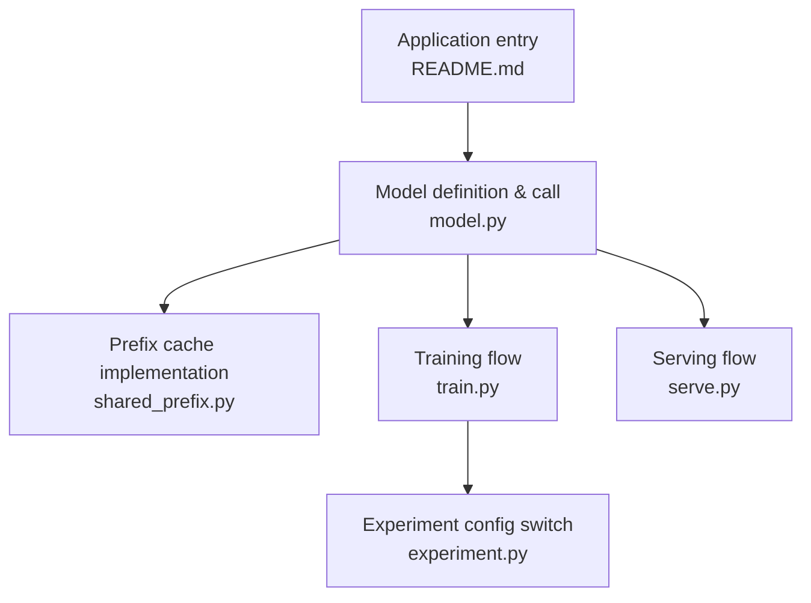
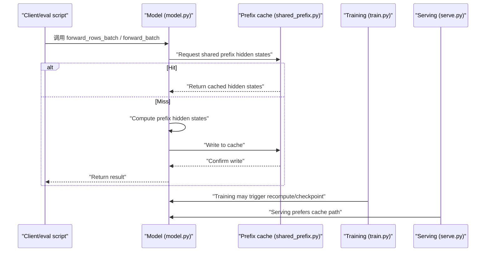
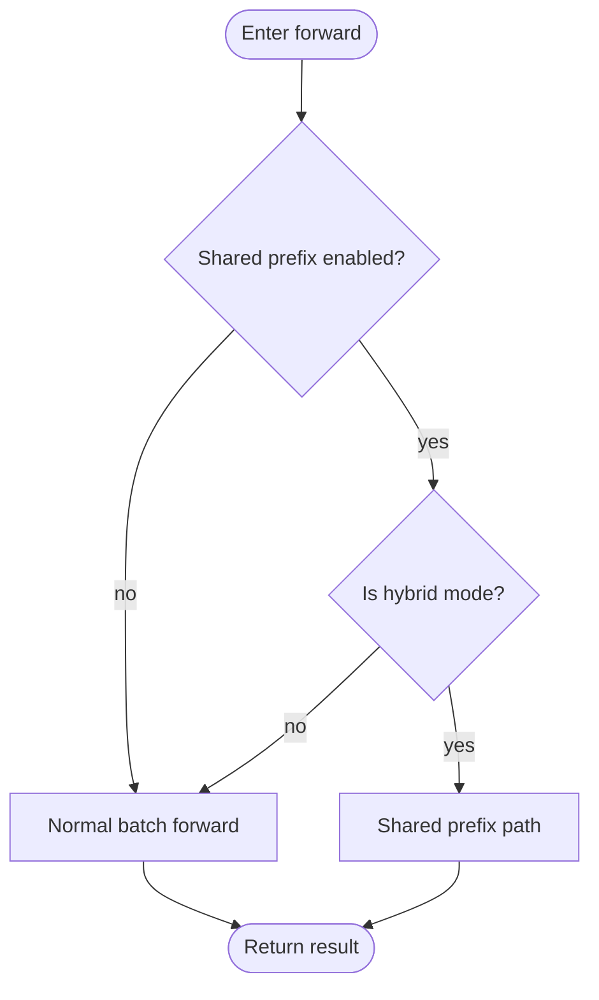
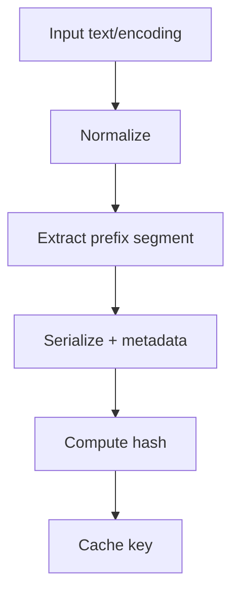
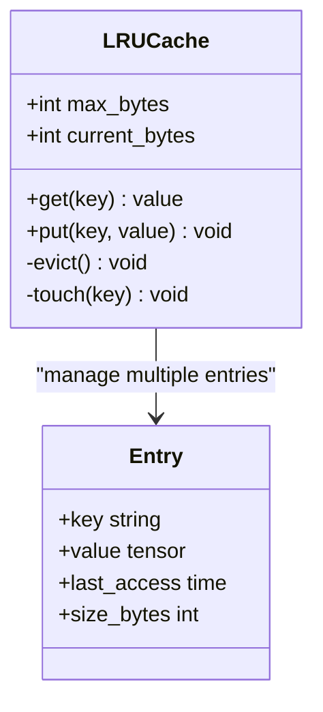
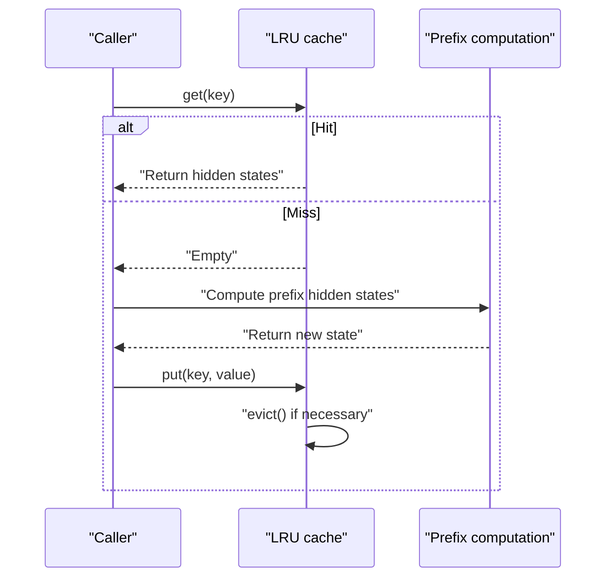
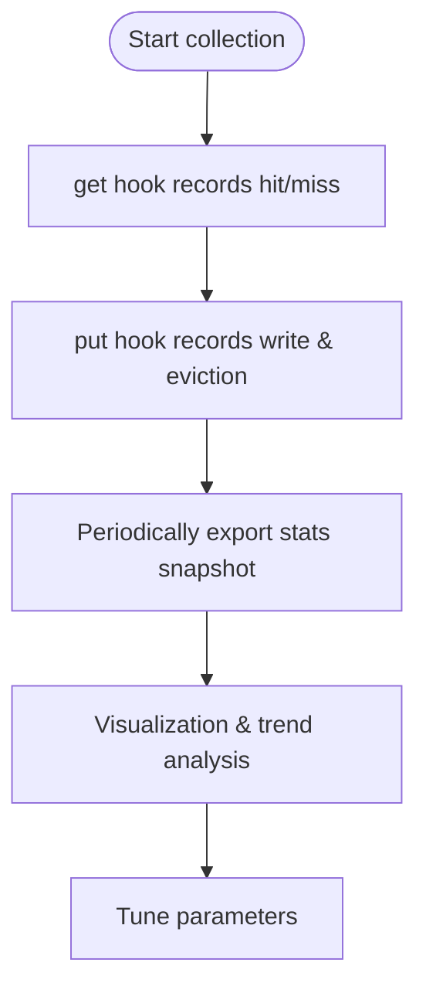
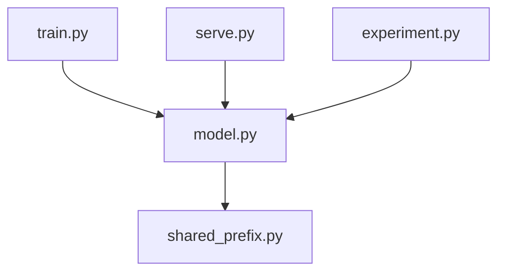

## Table of Contents
1. [Introduction](#introduction)
2. [Project Structure](#project-structure)
3. [Core Components](#core-components)
4. [Architecture Overview](#architecture-overview)
5. [Detailed Component Analysis](#detailed-component-analysis)
6. [Dependency Analysis](#dependency-analysis)
7. [Performance Considerations](#performance-considerations)
8. [Troubleshooting Guide](#troubleshooting-guide)
9. [Conclusion](#conclusion)
10. [Appendix](#appendix)

## Introduction
This technical document focuses on the prefix cache mechanism for "shared state prefixes". The goal is to explain how to reduce redundant computation by identifying and reusing repeated state sequences. The document covers:
- How the shared state prefix works and its applicable scenarios
- The cache key generation algorithm (extracting a hashable prefix identifier from input text)
- The cache storage structure and eviction policy (LRU, memory limits, multi-device support)
- The hit and miss handling flows
- Statistics collection and analysis tool usage
- Configuration parameter descriptions (max cache size, expiration policy, cleanup mechanism, etc.)
- Performance improvement and best-practice suggestions under different loads

## Project Structure
The repository centers on model training, inference, and serving. The prefix cache code mainly lives in kev/shared_prefix.py and is referenced in the model forward, training, and serving paths.

**Diagram Sources**
- [README.md:1-200](file://README.md#L1-L200)
- [model.py:360-400](file://kev/model.py#L360-L400)
- [shared_prefix.py:1-200](file://kev/shared_prefix.py#L1-L200)
- [train.py:560-580](file://kev/train.py#L560-L580)
- [serve.py:1-200](file://kev/serve.py#L1-L200)
- [experiment.py:40-60](file://kev/experiment.py#L40-L60)

**Section Sources**
- [README.md:1-200](file://README.md#L1-L200)
- [model.py:360-400](file://kev/model.py#L360-L400)
- [shared_prefix.py:1-200](file://kev/shared_prefix.py#L1-L200)
- [train.py:560-580](file://kev/train.py#L560-L580)
- [serve.py:1-200](file://kev/serve.py#L1-L200)
- [experiment.py:40-60](file://kev/experiment.py#L40-L60)

## Core Components
- Prefix cache manager: responsible for cache key generation, entry access, LRU eviction, memory cap control, and cross-device consistency.
- Branch hidden-state computation: directly reuse the computed hidden states when the shared prefix is hit; compute and backfill the cache when missed.
- Model integration point: select whether to enable the prefix cache path in the forward pass based on the shared_prefix flag.
- Training integration point: recompute or recover checkpoints for the shared prefix in the training loop to balance memory and speed.
- Serving integration point: prefer the cache in the serving path to reduce latency.
- Experiment configuration: control whether this optimization is enabled via the shared_prefix switch.

**Section Sources**
- [shared_prefix.py:1-200](file://kev/shared_prefix.py#L1-L200)
- [model.py:360-400](file://kev/model.py#L360-L400)
- [train.py:560-580](file://kev/train.py#L560-L580)
- [serve.py:1-200](file://kev/serve.py#L1-L200)
- [experiment.py:40-60](file://kev/experiment.py#L40-L60)

## Architecture Overview
The diagram below shows the prefix cache's position in the overall system and its interaction relationships.

**Diagram Sources**
- [model.py:360-400](file://kev/model.py#L360-L400)
- [shared_prefix.py:1-200](file://kev/shared_prefix.py#L1-L200)
- [train.py:560-580](file://kev/train.py#L560-L580)
- [serve.py:1-200](file://kev/serve.py#L1-L200)

## Detailed Component Analysis

### How the Shared State Prefix Works
- Goal: compute the prefix shared by multiple samples only once, and subsequent branches reuse its hidden states to avoid repeated computation.
- Applicable scenarios: hybrid backbone networks, batched row-form inputs, and long-context tasks with many common prefixes.
- Key behavior: when shared_prefix is true and the model is in hybrid mode, the forward pass enters the shared-prefix path; otherwise it falls back to the normal batch forward.

**Diagram Sources**
- [model.py:360-400](file://kev/model.py#L360-L400)

**Section Sources**
- [model.py:360-400](file://kev/model.py#L360-L400)

### Cache Key Generation Algorithm
- Input: raw text or encoded token sequence, and metadata used to distinguish different sample contexts (such as session ID, task ID).
- Steps:
  1. Normalize input: remove whitespace, unify case (optional), standardize separators.
  2. Extract prefix segment: split by fixed length or semantic boundary to obtain a stable prefix representation.
  3. Serialize and hash: combine the prefix segment with metadata for a stable serialization, then compute a hash as the cache key.
- Design points:
  - The key must be stable and unique, avoiding collisions that cause incorrect reuse.
  - Consider device independence: the key is not bound to a specific device, facilitating cross-device migration.
  - Extensibility: allow a version field to be added for future algorithm-change compatibility.

[This is a conceptual flowchart and requires no diagram source]

**Section Sources**
- [shared_prefix.py:1-200](file://kev/shared_prefix.py#L1-L200)

### Cache Storage Structure and Eviction Policy
- Data structure: an LRU-based doubly linked list + hash table, guaranteeing O(1) lookup and update.
- Memory limit: maintain the current occupied bytes and an upper threshold; trigger eviction when the threshold is exceeded.
- Eviction policy: prioritize evicting the least recently used entries; TTL (timestamp) and access-frequency weighting can be supported as needed.
- Multi-device support:
  - Key level: device-independent, ensuring cross-device consistency.
  - Value level: partition storage per device or place uniformly on the main device to avoid cross-device copy overhead.
  - Synchronization: in multi-process/distributed environments, provide locks or atomic operations to guarantee consistency.

**Diagram Sources**
- [shared_prefix.py:1-200](file://kev/shared_prefix.py#L1-L200)

**Section Sources**
- [shared_prefix.py:1-200](file://kev/shared_prefix.py#L1-L200)

### Hit and Miss Handling Flow
- Hit: read the hidden states directly from the cache, skipping the repeated prefix computation, significantly reducing latency.
- Miss: perform the full prefix computation and write the result to the cache; trigger LRU eviction if capacity is insufficient.
- Training path: during training, the prefix may be recomputed due to gradient needs, or recovered via checkpoint to reduce memory usage.
- Serving path: prefer cache hits; on a miss, compute quickly and backfill to guarantee low latency.

**Diagram Sources**
- [shared_prefix.py:1-200](file://kev/shared_prefix.py#L1-L200)

**Section Sources**
- [shared_prefix.py:1-200](file://kev/shared_prefix.py#L1-L200)

### Statistics Collection and Analysis Tools
- Metric items:
  - Hit rate (hit_rate)
  - Miss rate (miss_rate)
  - Average hit latency (avg_hit_latency)
  - Average miss latency (avg_miss_latency)
  - Cache occupancy (current_bytes)
  - Eviction count (eviction_count)
  - Key distribution (top_keys)
- Collection method:
  - Accumulate counts and elapsed time in get/put/evict hooks.
  - Periodically export statistics snapshots (JSON/CSV).
- Analysis suggestions:
  - Observe how the hit rate changes over time to evaluate cache effectiveness.
  - Combine top_keys to analyze hot prefixes and optimize the key generation strategy.
  - Monitor current_bytes and eviction_count, and tune max_bytes and TTL.

[This is a conceptual flowchart and requires no diagram source]

**Section Sources**
- [shared_prefix.py:1-200](file://kev/shared_prefix.py#L1-L200)

### Configuration Parameters
- shared_prefix: boolean switch that decides whether to enable the shared prefix path. Enabled by default when full_ft is on.
- max_cache_size: maximum cache size (bytes or entry count); triggers LRU eviction when exceeded.
- ttl_seconds: time-to-live (seconds) of a cache entry; expires automatically when due.
- cleanup_interval: cleanup period (seconds), periodically scanning and removing expired entries.
- device_policy: device policy (such as "main", "per_device"), deciding where values are placed.
- hash_version: hash algorithm version number, used for backward-compatible key generation changes.

**Section Sources**
- [experiment.py:40-60](file://kev/experiment.py#L40-L60)
- [shared_prefix.py:1-200](file://kev/shared_prefix.py#L1-L200)

## Dependency Analysis
- model.py selects the path in the forward pass based on the shared_prefix flag and calls the branch hidden-state computation provided by shared_prefix.py.
- train.py may recompute or recover checkpoints for the shared prefix in the training loop to balance memory and speed.
- serve.py prefers the cache in the serving path to reduce latency.
- experiment.py provides the shared_prefix configuration switch and default value.

**Diagram Sources**
- [model.py:360-400](file://kev/model.py#L360-L400)
- [shared_prefix.py:1-200](file://kev/shared_prefix.py#L1-L200)
- [train.py:560-580](file://kev/train.py#L560-L580)
- [serve.py:1-200](file://kev/serve.py#L1-L200)
- [experiment.py:40-60](file://kev/experiment.py#L40-L60)

**Section Sources**
- [model.py:360-400](file://kev/model.py#L360-L400)
- [shared_prefix.py:1-200](file://kev/shared_prefix.py#L1-L200)
- [train.py:560-580](file://kev/train.py#L560-L580)
- [serve.py:1-200](file://kev/serve.py#L1-L200)
- [experiment.py:40-60](file://kev/experiment.py#L40-L60)

## Performance Considerations
- High hit-rate scenarios: significantly improve throughput and reduce end-to-end latency, especially suitable for long-context tasks with many repeated prefixes.
- Low hit-rate scenarios: evaluate the key generation strategy and cache size to avoid jitter caused by frequent eviction.
- Memory pressure: reasonably set max_cache_size and TTL to avoid OOM; monitor current_bytes and eviction_count.
- Multi-device deployment: the per_device policy reduces cross-device copies; pay attention to lock granularity and synchronization overhead.
- Training vs serving: the training stage may focus more on memory usage, while the serving stage focuses more on latency and throughput.

[This section provides general guidance and requires no diagram source]

## Troubleshooting Guide
- Symptom: extremely low hit rate
  - Check whether key generation is too sensitive (e.g., includes random noise).
  - Check whether hash_version is compatible with the historical cache.
- Symptom: frequent eviction
  - Increase max_cache_size or shorten TTL to match the workload.
  - Analyze top_keys to identify hot prefixes and optimize the slicing strategy.
- Symptom: memory overflow
  - Reduce batch size or enable checkpoint recovery.
  - Adjust device_policy to per_device and limit the per-device cache size.
- Symptom: cross-device inconsistency
  - Check the device-independence of keys and the placement policy of values.
  - Verify locks and atomic operations in multi-process/distributed environments.

**Section Sources**
- [shared_prefix.py:1-200](file://kev/shared_prefix.py#L1-L200)
- [train.py:560-580](file://kev/train.py#L560-L580)

## Conclusion
The prefix cache mechanism for shared state prefixes effectively reduces redundant computation costs by identifying and reusing repeated prefix computations. Reasonable key generation, LRU eviction, memory management, and multi-device support are the keys to ensuring efficient operation. Under different loads, parameters should be tuned in combination with hit rate, latency, and memory usage to achieve the best performance.

[This section is a summary and requires no diagram source]

## Appendix
- Reference paths:
  - [shared_prefix.py:1-200](file://kev/shared_prefix.py#L1-L200)
  - [model.py:360-400](file://kev/model.py#L360-L400)
  - [train.py:560-580](file://kev/train.py#L560-L580)
  - [serve.py:1-200](file://kev/serve.py#L1-L200)
  - [experiment.py:40-60](file://kev/experiment.py#L40-L60)
  - [README.md:1-200](file://README.md#L1-L200)
