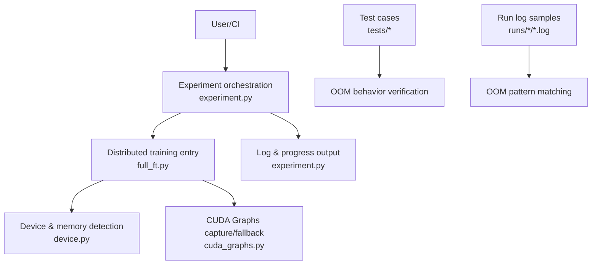
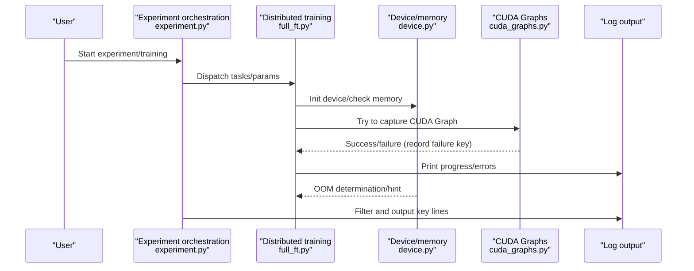
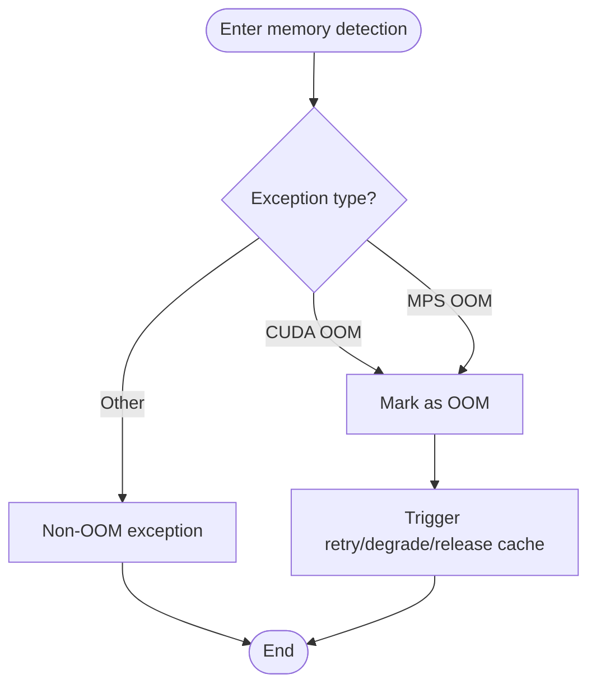
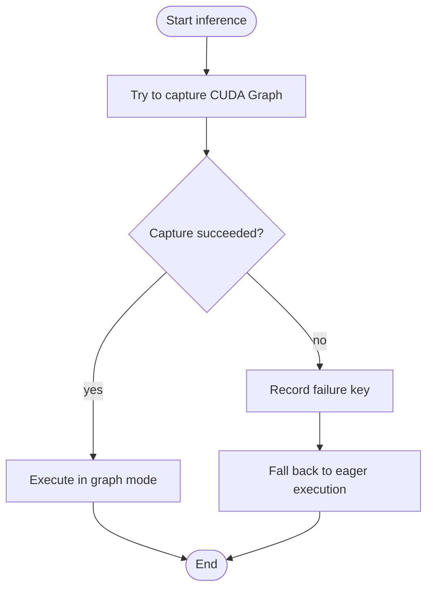
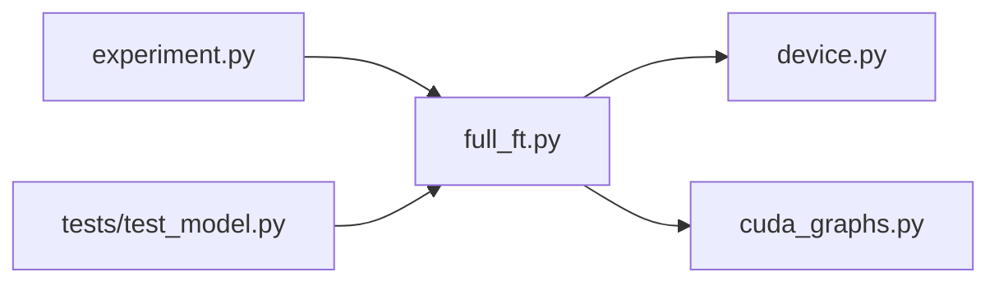
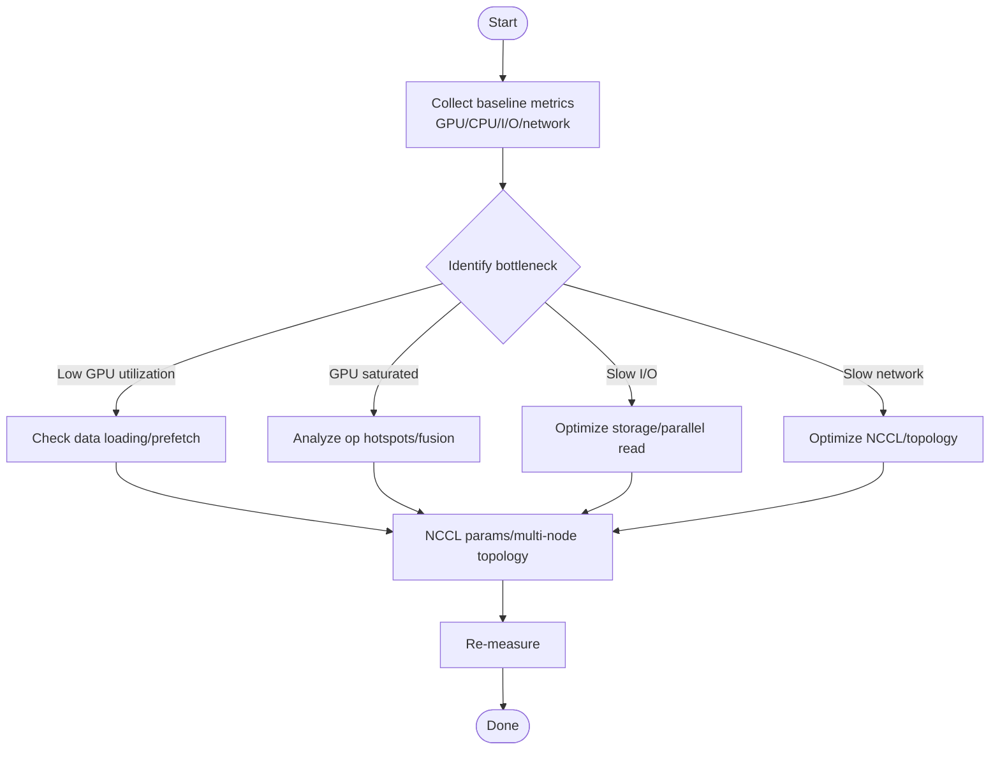

## Table of Contents
1. [Overview](#overview)
2. [Project Structure](#project-structure)
3. [Core Components](#core-components)
4. [Architecture Overview](#architecture-overview)
5. [Detailed Component Analysis](#detailed-component-analysis)
6. [Dependency Analysis](#dependency-analysis)
7. [Performance Considerations](#performance-considerations)
8. [Troubleshooting Guide](#troubleshooting-guide)
9. [Conclusion](#conclusion)
10. [Appendix](#appendix)

## Overview
This guide addresses common issues in Kev's training and inference processes, providing systematic troubleshooting steps, log analysis methods, debugging tool usage suggestions, and environment configuration approaches. Key coverage includes:
- Diagnosis and mitigation of CUDA out-of-memory (OOM)
- Locating and fixing model loading failures
- Common causes of non-converging training and tuning ideas
- Log analysis and exception tracing
- Using the PyTorch debugger, memory analysis, and performance profiling
- Environment configuration issues (dependency conflicts, version compatibility, platform differences)
- Performance bottleneck identification (CPU/GPU utilization, I/O, network communication)
- How to collect issue-report information and effectively ask the community for help

## Project Structure
The Kev repository contains training scripts, evaluation flows, experiment orchestration, distributed training support, CUDA Graphs optimization, and a large number of evaluation and run records. Code directly related to troubleshooting is concentrated in device and memory handling, distributed training, CUDA Graphs capture and fallback, and experiment log output modules; the repository also contains many real OOM log samples for comparative diagnosis.

Diagram Sources
- [experiment.py:299-480](file://kev/experiment.py#L299-L480)
- [full_ft.py:32-34](file://kev/full_ft.py#L32-L34)
- [device.py:20-22](file://kev/device.py#L20-L22)
- [cuda_graphs.py:248](file://kev/cuda_graphs.py#L248)
- [test_model.py:392-467](file://tests/test_model.py#L392-L467)
- [train-r21_step62_rank1.log:75-551](file://runs/sft-probe/r22-ceiling-27b-8xh200/train-r21_step62_rank1.log#L75-L551)

Section Sources
- [README.md](file://README.md)
- [pyproject.toml](file://pyproject.toml)

## Core Components
- Device and memory detection: uniformly determines CUDA/MPS OOM error types so upper-layer logic can retry or degrade.
- Distributed training: based on torch.distributed and FSDP, involving resource allocation and state synchronization for multi-process/multi-GPU training.
- CUDA Graphs: attempts graph capture in the inference path to improve throughput, falling back to eager execution on failure and recording the failure key.
- Experiment orchestration: responsible for task scheduling, log filtering, result aggregation, and the flow control of resuming training/evaluation.
- Test cases: assert and guard against OOM behavior to ensure robustness of critical paths.

Section Sources
- [device.py:20-22](file://kev/device.py#L20-L22)
- [full_ft.py:32-34](file://kev/full_ft.py#L32-L34)
- [cuda_graphs.py:248](file://kev/cuda_graphs.py#L248)
- [experiment.py:299-480](file://kev/experiment.py#L299-L480)
- [test_model.py:392-467](file://tests/test_model.py#L392-L467)

## Architecture Overview
The diagram below shows the typical call chain from experiment orchestration to training/evaluation execution, and the interaction with device, CUDA Graphs, and log output.

Diagram Sources
- [experiment.py:299-480](file://kev/experiment.py#L299-L480)
- [full_ft.py:32-34](file://kev/full_ft.py#L32-L34)
- [device.py:20-22](file://kev/device.py#L20-L22)
- [cuda_graphs.py:248](file://kev/cuda_graphs.py#L248)

## Detailed Component Analysis

### Device and Memory Detection (device.py)
- Function: identifies CUDA OutOfMemoryError and MPS "backend out of memory" runtime errors for unified handling by the upper layer.
- Impact: when OOM is detected, retry, cache clearing, or degradation strategies can be triggered to avoid interruption of training/inference.
- Suggestions:
  - Throw a standard OOM exception in custom extensions or third-party operators so it can be correctly recognized.
  - Combine log keywords to quickly locate where OOM occurs.

Diagram Sources
- [device.py:20-22](file://kev/device.py#L20-L22)

Section Sources
- [device.py:20-22](file://kev/device.py#L20-L22)

### CUDA Graphs Capture and Fallback (cuda_graphs.py)
- Function: tries to freeze the computation graph during inference to improve performance; if capture fails, records the failure key and executes in eager mode.
- Impact: capture failure does not cause a crash but may reduce throughput; the failure key can be used for later analysis of which input shapes/operations cannot be graphed.
- Suggestions:
  - Pay attention to the input dimensions or operator combinations corresponding to the failure key; adjust batch size or sequence length if necessary.
  - Monitor the failure rate in CI to prevent degradation.

Diagram Sources
- [cuda_graphs.py:248](file://kev/cuda_graphs.py#L248)

Section Sources
- [cuda_graphs.py:248](file://kev/cuda_graphs.py#L248)

### Distributed Training Entry (full_ft.py)
- Function: imports torch.distributed and FSDP for multi-GPU/multi-process full fine-tuning.
- Impact: in distributed environments, inter-process communication, memory allocation, and state synchronization must be considered; logs from different ranks need to be filtered by rank.
- Suggestions:
  - Use environment variables to control NCCL behavior (e.g., NCCL_DEBUG=INFO) to locate communication issues.
  - In multi-GPU scenarios, first check whether the memory usage of each GPU is balanced.

Section Sources
- [full_ft.py:32-34](file://kev/full_ft.py#L32-L34)

### Experiment Orchestration and Log Filtering (experiment.py)
- Function: responsible for experiment scheduling, resuming training/evaluation, key log-line filtering, and result aggregation.
- Impact: filtering keywords (such as Error, device, ablation, etc.) helps quickly locate anomalies and key events.
- Suggestions:
  - Keep the full logs in the report, but output only key lines in the summary for easy review.
  - Add idempotency checks to the "resume training/evaluation" path to avoid duplicate writes.

Section Sources
- [experiment.py:299-480](file://kev/experiment.py#L299-L480)

### OOM Behavior in Test Cases (tests/test_model.py)
- Function: verifies whether recovery via retry/cache clearing is possible after a real OOM, or whether it fails again when no cache is available.
- Impact: as a regression test, it guarantees service robustness under OOM.
- Suggestions:
  - When adding OOM-related branches, supplement corresponding assertions to ensure behavior matches expectations.

Section Sources
- [test_model.py:392-467](file://tests/test_model.py#L392-L467)

## Dependency Analysis
- External dependencies: PyTorch (including torch.distributed, FSDP), NCCL (multi-GPU communication), optional MPS (Apple Silicon).
- Internal coupling:
  - experiment.py drives the training flow of full_ft.py.
  - device.py provides unified OOM determination for the upper layer.
  - cuda_graphs.py collaborates with model/predictors in the inference path; failure does not affect the main flow.
- Potential cyclic dependencies: none observed; each module has clear responsibilities and a clear dependency direction.

Diagram Sources
- [experiment.py:299-480](file://kev/experiment.py#L299-L480)
- [full_ft.py:32-34](file://kev/full_ft.py#L32-L34)
- [device.py:20-22](file://kev/device.py#L20-L22)
- [cuda_graphs.py:248](file://kev/cuda_graphs.py#L248)
- [test_model.py:392-467](file://tests/test_model.py#L392-L467)

Section Sources
- [pyproject.toml](file://pyproject.toml)

## Performance Considerations
- CPU/GPU utilization:
  - Use nvidia-smi, nvtop, and torch.profiler to observe GPU utilization and kernel time.
  - If GPU utilization is low, check data loading (num_workers, prefetch_factor), operator fusion, and CUDA Graphs enablement.
- I/O bottlenecks:
  - Large model weight loading and dataset reads are often bottlenecks; it is recommended to use SSD/NVMe and enable prefetching and asynchronous loading.
  - For long-context scenarios, pay attention to the memory footprint of KV Cache and prefix cache.
- Network communication:
  - In multi-GPU training, pay attention to NCCL bandwidth and latency; adjust environment variables such as NCCL_IB_DISABLE and NCCL_SOCKET_IFNAME if necessary.
  - Use NCCL_DEBUG=INFO to capture communication stack information.

[This section provides general guidance and does not involve specific files]

## Troubleshooting Guide

### Common Issue 1: CUDA Out of Memory (OOM)
Symptoms
- A CUDA out of memory error occurs during training or inference, accompanied by "allocated by PyTorch / reserved but unallocated" memory statistics.
- Multiple ranks report OOM simultaneously in multi-GPU training.

Localization steps
1. Confirm the OOM type:
   - Use the OOM determination logic in device.py to distinguish CUDA OOM from MPS OOM.
2. Check the memory statistics in the logs:
   - Refer to the real OOM logs under the runs directory, focusing on "allocated by PyTorch" and "reserved but unallocated".
3. Narrow the scope:
   - Reduce batch size, sequence length, or activation saving switches.
   - Disable unnecessary logging and metric collection.
4. Mitigate fragmentation:
   - Set PYTORCH_CUDA_ALLOC_CONF=expandable_segments:True (hinted in the logs).
5. Distributed scenario:
   - Check whether the memory distribution across ranks is balanced; adjust per-card parallelism or gradient accumulation steps if necessary.

Mitigation measures
- Reduce batch size/sequence length
- Enable mixed precision (FSDP MixedPrecisionPolicy)
- Use gradient checkpointing (activation checkpointing)
- Adjust the CUDA allocator strategy (expandable segments)
- Clear KV Cache / Prefix Cache (combined with the behavior in test cases)

Section Sources
- [device.py:20-22](file://kev/device.py#L20-L22)
- [train-r21_step62_rank1.log:75-551](file://runs/sft-probe/r22-ceiling-27b-8xh200/train-r21_step62_rank1.log#L75-L551)
- [train.log:38](file://runs/sft-probe/sft-probe-27b-h200/train.log#L38)
- [test_model.py:392-467](file://tests/test_model.py#L392-L467)

### Common Issue 2: Model Loading Failure
Possible causes
- Weight path does not exist or insufficient permissions
- Weight format mismatch (e.g., inconsistent sharding/merging)
- OOM during loading causing mid-load failure
- Incompatible dependency library versions (e.g., transformers, torch versions)

Troubleshooting steps
1. Check path and permissions: confirm the weight directory is readable and complete.
2. Verify weight integrity: compare hashes or shard counts.
3. Observe OOM during loading: combine device.py's OOM determination with the memory statistics in the logs.
4. Upgrade/align dependencies: pin versions according to pyproject.toml to avoid API changes caused by dynamic dependencies.

Mitigation measures
- Use a smaller initial model or LoRA adapter to validate first
- Preload on CPU and re-save to a format suitable for the target device
- Pin dependency versions, manage the environment with uv.lock/pyproject.toml

Section Sources
- [pyproject.toml](file://pyproject.toml)
- [device.py:20-22](file://kev/device.py#L20-L22)

### Common Issue 3: Training Does Not Converge
Common signs
- Loss oscillates, does not decrease, or suddenly diverges
- Validation metrics stagnate or drop
- Gradient norm explodes or vanishes

Troubleshooting steps
1. Learning rate and scheduler:
   - Check whether warmup, cosine/step scheduling match the data scale.
2. Data quality:
   - Check label noise, class imbalance, and long-tail distribution.
3. Numerical stability:
   - Enable gradient clipping, mixed precision, and FP16/BF16 switching.
4. Distributed synchronization:
   - Check whether FSDP configuration and gradient synchronization are normal.

Mitigation measures
- Lower the learning rate, increase warmup
- Gradient clipping and stabilization tricks
- Data cleaning and resampling
- Check FSDP sharding strategy and communication overhead

Section Sources
- [full_ft.py:32-34](file://kev/full_ft.py#L32-L34)

### Log Analysis and Exception Tracing
- Key log-line filtering:
  - experiment.py filters lines containing specific keywords (such as Error, device, ablation, snapshot, resumed, etc.) for quick localization.
- Multi-rank logs:
  - Filter using the rank prefix (such as [rank0], [rank1]) to analyze each card's behavior separately.
- OOM log patterns:
  - Pay attention to keywords such as "CUDA out of memory", "allocated by PyTorch", and "reserved but unallocated".

Useful commands
- grep -E "(Error|OOM|rank)" train.log
- awk '/^\\[rank[0-9]+\\]/' train.log > rank0.log

Section Sources
- [experiment.py:299-480](file://kev/experiment.py#L299-L480)
- [train-r21_step62_rank1.log:75-551](file://runs/sft-probe/r22-ceiling-27b-8xh200/train-r21_step62_rank1.log#L75-L551)

### Debugging Tools and Techniques
- PyTorch debugger:
  - pdb/ipdb: insert breakpoints at key functions to step through tensor shapes and devices.
  - torch.autograd.detect_anomaly: locate the source of NaN/Inf.
- Memory analysis:
  - torch.cuda.memory_summary(), memory_allocated()/max_memory_allocated()
  - pynvml/nvidia-smi to monitor peak memory
- Performance profiling:
  - torch.profiler: record operator time and memory usage
  - nvprof/nsys: GPU kernel-level profiling (requires NVIDIA toolchain)

[This section provides general guidance and does not involve specific files]

### Environment Configuration Issues
- Dependency conflicts:
  - Use pyproject.toml and uv.lock to pin dependency versions and avoid pip/conda environment drift.
- Version compatibility:
  - Ensure versions of torch, transformers, accelerate, etc. match what the code expects.
- Platform-specific issues:
  - Apple Silicon (MPS): note that MPS OOM error types differ from CUDA and require device.py's unified determination.
  - Linux vs Windows: NCCL and CUDA driver versions must match.

Section Sources
- [pyproject.toml](file://pyproject.toml)
- [device.py:20-22](file://kev/device.py#L20-L22)

### Performance Tuning Diagnosis Flow

[This section provides general guidance and does not involve specific files]

### How to Collect Issue Report Information
Required information
- Environment info: Python, PyTorch, CUDA, OS, GPU model, and driver version
- Reproduction steps: minimal reproducible code/command, input data sample
- Logs and stack traces: full training/inference logs, key error lines
- Resource info: nvidia-smi screenshot, torch.cuda.memory_summary()
- Config snapshot: pyproject.toml, uv.lock, experiment config file

Submission channels
- GitHub Issues: attach the above information and a minimal reproduction
- Community forum/discussion: describe the background and solutions already attempted

[This section provides general guidance and does not involve specific files]

## Conclusion
Through unified OOM determination, CUDA Graphs fallback mechanism, experiment log filtering, and distributed training support, Kev achieves good observability and robustness in complex training and inference scenarios. In actual troubleshooting, it is recommended to first use device.py and log keywords to quickly locate the problem domain, then combine the PyTorch debugger and performance profiling tools for deeper analysis, and finally lock down the environment and dependencies to ensure reproducibility.

[This section is a summary and does not involve specific files]

## Appendix
- Common environment variables
  - PYTORCH_CUDA_ALLOC_CONF=expandable_segments:True
  - NCCL_DEBUG=INFO
  - CUDA_VISIBLE_DEVICES=0,1,2,3
- Reference log samples
  - runs/sft-probe/r22-ceiling-27b-8xh200/train-r21_step62_rank1.log
  - runs/sft-probe/sft-probe-27b-h200/train.log

Section Sources
- [train-r21_step62_rank1.log:75-551](file://runs/sft-probe/r22-ceiling-27b-8xh200/train-r21_step62_rank1.log#L75-L551)
- [train.log:38](file://runs/sft-probe/sft-probe-27b-h200/train.log#L38)
