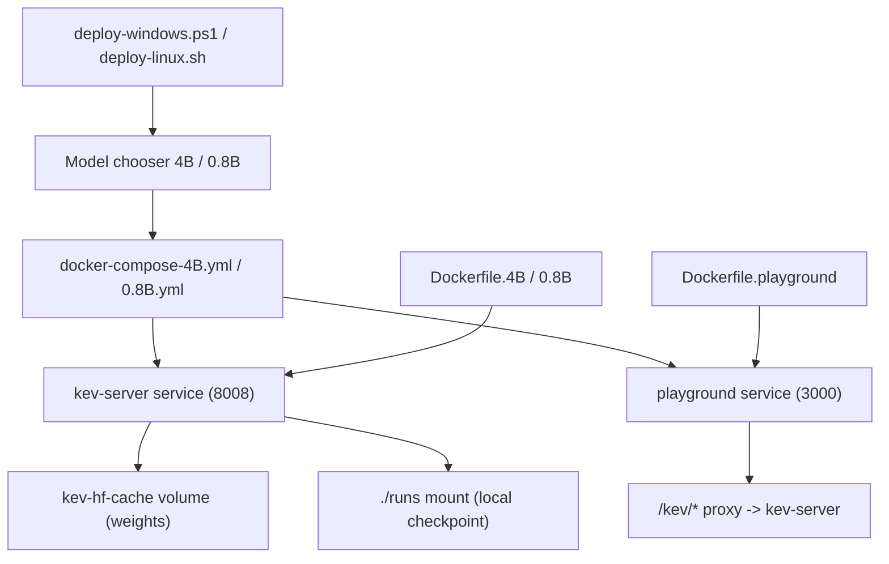
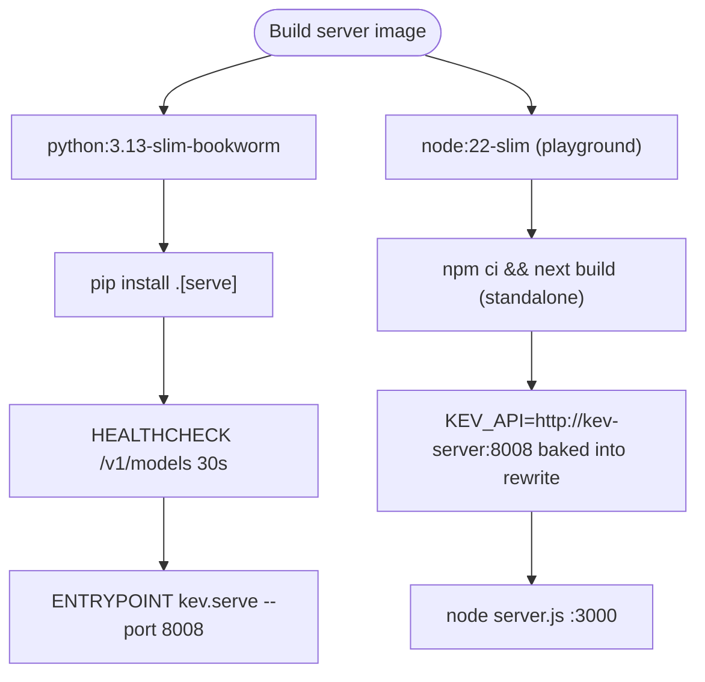
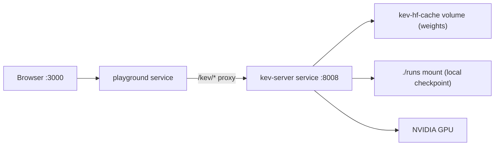
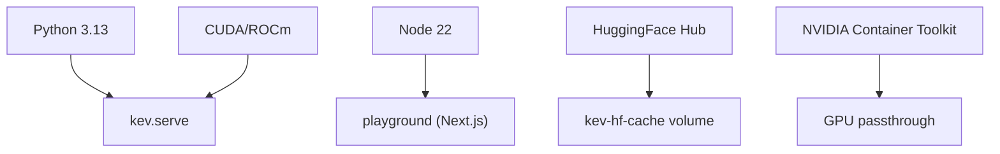

# Containerized Deployment

<cite>
**Files referenced in this document**
- [deploy/deploy-windows.ps1](file://deploy/deploy-windows.ps1)
- [deploy/deploy-linux.sh](file://deploy/deploy-linux.sh)
- [deploy/docker-compose-4B.yml](file://deploy/docker-compose-4B.yml)
- [deploy/docker-compose-0.8B.yml](file://deploy/docker-compose-0.8B.yml)
- [deploy/Dockerfile.4B](file://deploy/Dockerfile.4B)
- [deploy/Dockerfile.0.8B](file://deploy/Dockerfile.0.8B)
- [deploy/Dockerfile.playground](file://deploy/Dockerfile.playground)
- [deploy/README.md](file://deploy/README.md)
- [playground/next.config.ts](file://playground/next.config.ts)
- [scripts/test-api.py](file://scripts/test-api.py)
</cite>

## Table of Contents
1. [Introduction](#introduction)
2. [Project Structure](#project-structure)
3. [Core Components](#core-components)
4. [Architecture Overview](#architecture-overview)
5. [Detailed Component Analysis](#detailed-component-analysis)
6. [Dependency Analysis](#dependency-analysis)
7. [Performance & Capacity Planning](#performance--capacity-planning)
8. [Troubleshooting Guide](#troubleshooting-guide)
9. [Conclusion](#conclusion)
10. [Appendix: Local checkpoint layout & config variables](#appendix-local-checkpoint-layout--config-variables)

## Introduction
This document explains how to deploy the Kev decision-model server as containers using the scripts and Docker Compose files under the repo's `deploy/` directory, together with the Playground demo UI (Next.js, with the kev / chess tabs). It covers:
- One-shot deploy scripts: pick 4B or 0.8B (one PowerShell for Windows, one Bash for Linux)
- Docker image build: build `kev-server` and `playground` from local source; weights are **not** baked into the image
- Docker Compose orchestration: services `kev-server` (8008) + `playground` (3000) on a shared `kev-net` network
- Model source: a local run directory or a HuggingFace Hub id, with weights stored in a persistent `kev-hf-cache` volume
- Playground ↔ server communication: a Next.js server-side proxy `/kev/*` → `http://kev-server:8008`, so no host port or CORS handling is needed
- Verification, config variables, and troubleshooting

Kev ships a local inference service compatible with the TypeSafe System One API. One-click cloud deploy (Modal) is a separate path — see [skills/kev-deploy](file://skills/kev-deploy/README.md) (not covered here).

**Section source**
- [deploy/README.md](file://deploy/README.md)
- [deploy/docker-compose-4B.yml:1-20](file://deploy/docker-compose-4B.yml#L1-L20)
- [deploy/deploy-linux.sh:1-9](file://deploy/deploy-linux.sh#L1-L9)

## Project Structure
The containerized-deployment files under `deploy/`:



**Diagram source**
- [deploy/deploy-linux.sh:30-35](file://deploy/deploy-linux.sh#L30-L35)
- [deploy/docker-compose-4B.yml:22-140](file://deploy/docker-compose-4B.yml#L22-L140)
- [deploy/Dockerfile.0.8B:17-48](file://deploy/Dockerfile.0.8B#L17-L48)
- [deploy/Dockerfile.playground:9-48](file://deploy/Dockerfile.playground#L9-L48)

**Section source**
- [deploy/README.md:19-37](file://deploy/README.md#L19-L37)

## Core Components
- **Inference service `kev-server`**: started via `python -m kev.serve --host 0.0.0.0 --port 8008 --run <KEV_RUN>`; exposes `/v1/systemone`, `/v1/models`, etc. (TypeSafe System One compatible).
- **Server image**: based on `python:3.13-slim-bookworm`, installed from local source via `pip install ".[serve]"` (no git clone, no external repo). `Dockerfile.4B` and `Dockerfile.0.8B` differ only in their default `KEV_RUN`.
- **Playground image**: a multi-stage Next.js standalone build on `node:22-slim`; the proxy target `KEV_API=http://kev-server:8008` is baked in at build time (Next.js rewrites are evaluated at build time), so the server service name MUST stay `kev-server`.
- **Runtime backend**: CUDA/ROCm (GPU) or MLX (Apple Silicon); bf16 is the default precision.
- **Model source**: weights are **not** baked in. `KEV_RUN` points at a local run directory (`/kev/runs/<name>`, mounted from `./runs`) or a Hub id (downloaded into the `kev-hf-cache` volume).
- **Config & secrets**: injected via environment variables (`KEV_API_KEY`, `KEV_DTYPE`, `KEV_RUN`, …).

Key behaviors (from `deploy/README.md`):
- First run with a Hub id downloads the adapter and base-model weights into the `kev-hf-cache` volume.
- The server binds 0.0.0.0 on port 8008 by default.
- `KEV_API_KEY` enables Bearer auth; empty means an open server.
- bf16 by default; `KEV_DTYPE=fp32` switches to the exact eval path.

**Section source**
- [deploy/Dockerfile.0.8B:17-48](file://deploy/Dockerfile.0.8B#L17-L48)
- [deploy/Dockerfile.playground:9-48](file://deploy/Dockerfile.playground#L9-L48)
- [deploy/README.md:156-168](file://deploy/README.md#L156-L168)

## Architecture Overview
The diagram below shows the end-to-end flow from the browser to the inference service. The Playground talks to the server only through the in-network proxy, so the browser only ever hits port 3000.

```mermaid
sequenceDiagram
participant Browser as "Browser"
participant UI as "playground container (3000)"
participant Server as "kev-server container (8008)"
participant GPU as "GPU/MLX backend"
participant Hub as "HuggingFace Hub"
Browser->>UI : open http://localhost:3000
UI->>Server : same-origin proxy /kev/v1/systemone
Server->>Hub : fetch weights on first run (Hub id)
Hub-->>Server : weights -> kev-hf-cache volume
Server->>GPU : forward inference (bf16/fp32)
GPU-->>Server : probabilities/answer
Server-->>UI : JSON response
UI-->>Browser : render result
Note over UI,Server : both on kev-net; resolved by name kev-server
```

**Diagram source**
- [deploy/docker-compose-4B.yml:91-131](file://deploy/docker-compose-4B.yml#L91-L131)
- [deploy/Dockerfile.playground:20-23](file://deploy/Dockerfile.playground#L20-L23)

## Detailed Component Analysis

### One-shot deploy scripts (model chooser)
`deploy/deploy-windows.ps1` (PowerShell, Windows Docker Desktop WSL2) and `deploy/deploy-linux.sh` (Bash, Linux) switch between `4B` and `0.8B` via `-Model` / `--model`, automatically selecting the matching compose file, Dockerfile, default checkpoint directory, and Hub id, then building, starting, and waiting for readiness.

```powershell
# Windows
.\deploy\deploy-windows.ps1                       # default Kev-4B (local mode)
.\deploy\deploy-windows.ps1 -Model 0.8B           # switch to Kev-0.8B
.\deploy\deploy-windows.ps1 -Model 0.8B -Hub jaredpalmer/kev-0.8b -ApiKey <key>
```

```bash
# Linux
./deploy/deploy-linux.sh --model 4B
./deploy/deploy-linux.sh --model 0.8B --hub jaredpalmer/kev-0.8b --api-key <key>
```

Script highlights (from `deploy/deploy-linux.sh`):
- Detects Docker, the daemon, and the NVIDIA Container Toolkit; without a GPU the server starts in CPU mode (slow).
- Default is **local mode**: `KEV_RUN` points at `./deploy/runs/<name>` (in-container `/kev/runs/<name>`); you must place the checkpoint (including `head.pt`) there first, or it errors out.
- Pass `-Hub`/`--hub` to download from the Hub into the `kev-hf-cache` volume (first start takes a few minutes).
- Before starting, it auto-`down`s the other model's stack (both share the container names `kev-server`/`kev-playground` and the `kev-net` network) — only one model stack runs at a time.

**Section source**
- [deploy/deploy-linux.sh:18-35](file://deploy/deploy-linux.sh#L18-L35)
- [deploy/deploy-linux.sh:100-144](file://deploy/deploy-linux.sh#L100-L144)
- [deploy/README.md:39-74](file://deploy/README.md#L39-L74)

### Docker image build
Server image (`Dockerfile.4B` / `Dockerfile.0.8B`):
- Base `python:3.13-slim-bookworm`; ENV `PYTHONUNBUFFERED/PYTHONDONTWRITEBYTECODE/PIP_NO_CACHE_DIR`.
- `COPY kev ./kev` + `pip install ".[serve]"` (FastAPI/uvicorn/typesafe-sdk/torch/transformers/peft/accelerate…).
- Exposes 8008; healthcheck probes `/v1/models` every 30s; default `KEV_RUN` is the matching Hub id (4B=`jaredpalmer/kev-4b`, 0.8B=`jaredpalmer/kev-0.8b`), `KEV_DTYPE=bf16`, `KEV_PREFIX_CACHE=4`.
- Entrypoint `python -m kev.serve --host 0.0.0.0 --port 8008 --run "${KEV_RUN}"`.

Playground image (`Dockerfile.playground`):
- deps/builder/runner multi-stage; `npm ci` → `npm run build` (Next.js standalone).
- Build-time `ENV KEV_API=http://kev-server:8008` (rewrites are evaluated at build time, so it must be set here), same value at runtime.
- Exposes 3000; healthcheck probes `/`; starts `node server.js`.



**Section source**
- [deploy/Dockerfile.0.8B:17-48](file://deploy/Dockerfile.0.8B#L17-L48)
- [deploy/Dockerfile.playground:9-48](file://deploy/Dockerfile.playground#L9-L48)

### Docker Compose orchestration
One compose file per model (`docker-compose-4B.yml` / `docker-compose-0.8B.yml`), with two services:
- `kev-server`: builds `deploy/Dockerfile.4B` (or 0.8B), ports `8008:8008`, mounts the `kev-hf-cache` volume and `./runs`, GPU via the NVIDIA container toolkit (`deploy.resources.reservations.devices`).
- `playground`: builds `deploy/Dockerfile.playground`, ports `3000:3000`, `depends_on: kev-server: service_healthy`, mounts `../.qoder/repowiki` read-only for the /docs viewer.

Both sit on the `kev-net` network and Compose resolves `kev-server` / `playground` by service name, so the Playground needs no exposed 8008 and no CORS.



**Section source**
- [deploy/docker-compose-4B.yml:22-140](file://deploy/docker-compose-4B.yml#L22-L140)
- [deploy/README.md:84-101](file://deploy/README.md#L84-L101)

### Playground ↔ server communication (server-side proxy)
All of the Playground's API requests are same-origin `/kev/*`, forwarded server-side by Next.js to `KEV_API` (which is `http://kev-server:8008` inside Compose). The frontend `lib/kev.ts` ships a fallback key that matches the `--api-key`/`-ApiKey` passed to the script, so auth works when `KEV_API_KEY` is set. The browser only hits 3000; every `/kev` request is forwarded by the Next server.

**Section source**
- [deploy/docker-compose-4B.yml:105-116](file://deploy/docker-compose-4B.yml#L105-L116)
- [deploy/README.md:84-101](file://deploy/README.md#L84-L101)

### Manual compose deploy
You can also build and start without the script:

```bash
# 4B
docker compose -f deploy/docker-compose-4B.yml up -d --build
# 0.8B
docker compose -f deploy/docker-compose-0.8B.yml up -d --build
```

**Section source**
- [deploy/README.md:75-82](file://deploy/README.md#L75-L82)

## Dependency Analysis
- **Runtime**: Python 3.13 (server image), Node 22 (playground image); CUDA/ROCm (GPU) or MLX (Apple Silicon).
- **External**: HuggingFace Hub (weights in Hub-id mode); NVIDIA Container Toolkit (GPU passthrough).
- **Script deps**: only Docker / Docker Compose; no extra Python deps.



**Section source**
- [deploy/Dockerfile.0.8B:17-23](file://deploy/Dockerfile.0.8B#L17-L23)
- [deploy/Dockerfile.playground:10-17](file://deploy/Dockerfile.playground#L10-L17)
- [deploy/README.md:156-162](file://deploy/README.md#L156-L162)

## Performance & Capacity Planning
- **Model & GPU sizing**: Kev-0.8B bf16 needs only ~2–3 GB VRAM (runs on consumer GPUs, even CPU-usable); Kev-4B bf16 needs ~10–12 GB VRAM. Without a GPU it starts in CPU mode (slow).
- **Memory & VRAM**: see the Serving Performance table in README.
- **Precision**: bf16 default; `KEV_DTYPE=fp32` switches to the eval path.
- **Throughput & latency**: vary widely with GPU and input length (see the README tables).

**Section source**
- [deploy/Dockerfile.0.8B:36-40](file://deploy/Dockerfile.0.8B#L36-L40)
- [deploy/README.md:156-162](file://deploy/README.md#L156-L162)

## Troubleshooting Guide
- **Container unhealthy / fails to start**: `docker logs kev-server`; confirm 8008 isn't taken.
- **GPU not active (very slow inference)**: `docker run --rm --gpus all nvidia/cuda:12.4.0-base-ubuntu22.04 nvidia-smi`; on Linux check `nvidia-ctk cdi generate`.
- **First start takes > 5 min**: Hub weights are downloading — watch the logs; or pre-mount a local run and set `KEV_RUN`.
- **422 on over-long state**: by default states > `SERVE_MAX_STATE` are rejected; temporarily use `KEV_TRUNCATE_STATES=1`.
- **Auth 401**: server has `KEV_API_KEY` set — send `Authorization: Bearer <key>`.
- **Container-name conflict when switching models**: the deploy script auto-`down`s the other stack; if still conflicting, run `docker compose -f deploy/docker-compose-<other>.yml down`.

**Section source**
- [deploy/README.md:218-228](file://deploy/README.md#L218-L228)

## Conclusion
- The repo's `deploy/` provides a one-command containerized path that picks 4B/0.8B and handles build + start, with production-ready server and playground images, Docker Compose orchestration, and one-shot scripts.
- Weights are not baked into the image: either a local run directory or a Hub id works, with weights persisted in the `kev-hf-cache` volume.
- The Playground talks to the server through the in-network server-side proxy `http://kev-server:8008`, so no exposed 8008 and no CORS.
- For production, expose it behind a front Nginx/TLS reverse proxy and enable `KEV_API_KEY` auth (see the Security section of `deploy/README.md`).

## Appendix: Local checkpoint layout & config variables

### Local checkpoint directory (deploy/runs/&lt;name&gt;)
In the default local mode, `KEV_RUN` points at `./deploy/runs/<name>` (in-container `/kev/runs/<name>`). A LoRA-adapter layout needs at least `head.pt` + `adapter_config.json` + `adapter_model.safetensors` + tokenizer files; a full-weight run uses `config.json` + `model*.safetensors`. The base model (e.g. `Qwen/Qwen3.5-4B-Base`) is resolved from the `kev-hf-cache` volume and can run offline.

**Section source**
- [deploy/README.md:102-154](file://deploy/README.md#L102-L154)

### Config variables (environment)
compose passes these through as `${VAR:-default}`, overridable in the shell or an `.env` (all are read by `kev.serve`):

| Variable | Default | Notes |
|----------|---------|-------|
| `KEV_RUN` | 4B: `/kev/runs/kev-4b-local`<br>0.8B: `/kev/runs/kev-0.8b-local` | checkpoint: local dir or Hub id (with `@<rev>`) |
| `KEV_DTYPE` | `bf16` | compute dtype (`fp32` = exact path) |
| `KEV_PREFIX_CACHE` | `4` | state-prefix cache entries; `0` disables |
| `KEV_API_KEY` | empty | when set, enables Bearer auth |
| `KEV_DATE_FACTS` | `0` | `1` enables date preprocessing |
| `KEV_TRUNCATE_STATES` | `0` | `1` truncates over-long states (else 422) |
| `HF_HUB_OFFLINE` | `0` | `1` uses only an already-populated cache |
| `KEV_API` (playground) | `http://kev-server:8008` | Next.js server-side proxy target |

**Section source**
- [deploy/docker-compose-4B.yml:33-54](file://deploy/docker-compose-4B.yml#L33-L54)
- [deploy/docker-compose-4B.yml:105-111](file://deploy/docker-compose-4B.yml#L105-L111)
- [deploy/README.md:190-214](file://deploy/README.md#L190-L214)

### Verification
```bash
docker ps                                   # kev-server healthy; playground running/healthy
curl http://localhost:8008/v1/models
curl -s -o /dev/null -w "%{http_code}\n" http://localhost:3000/   # home 200
curl -s http://localhost:3000/kev/v1/models                  # via playground proxy to kev-server
python scripts/test-api.py                  # from the repo root
# Swagger UI: http://localhost:8008/docs
# Playground UI: http://localhost:3000
```

**Section source**
- [deploy/README.md:164-174](file://deploy/README.md#L164-L174)
