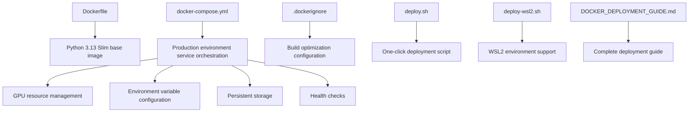
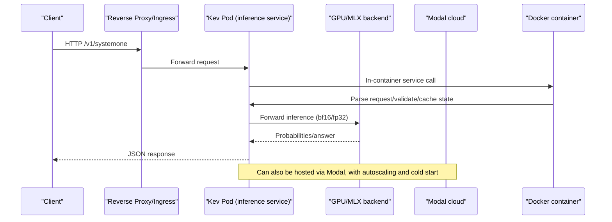
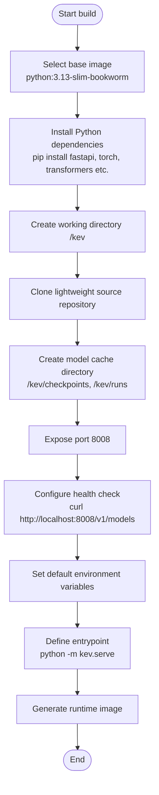
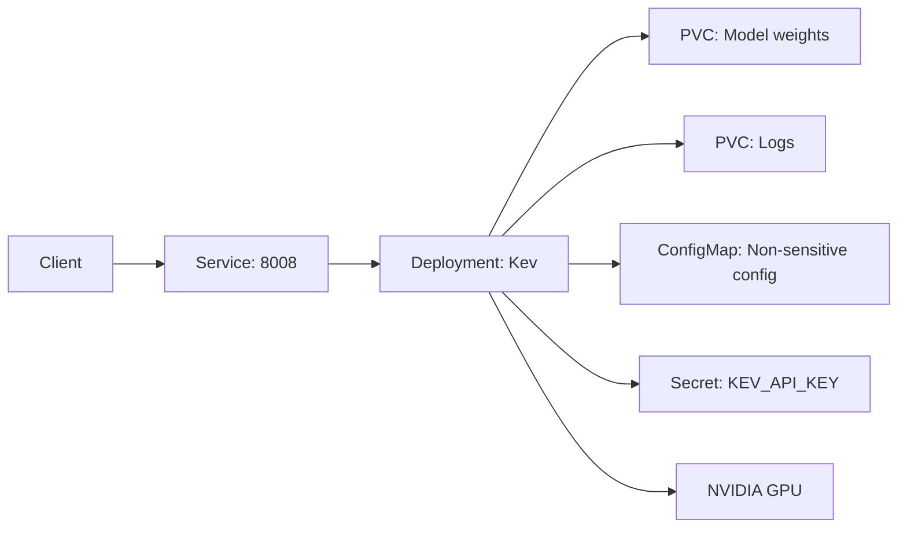
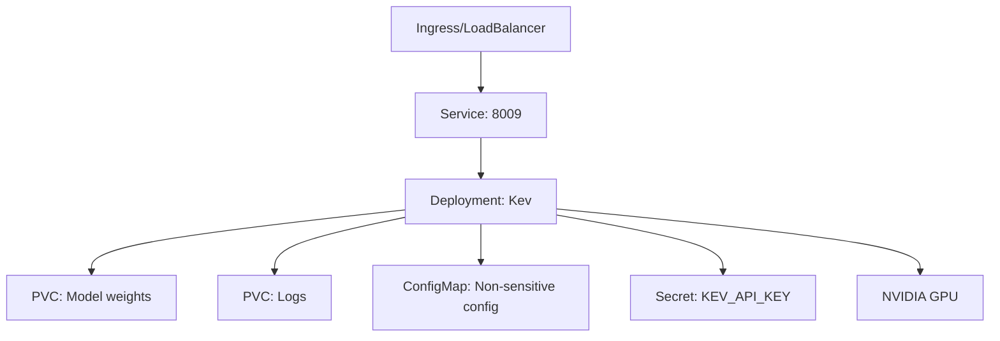
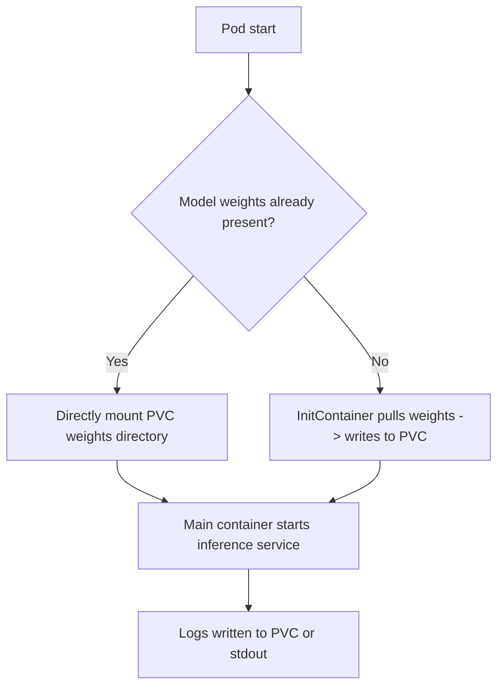
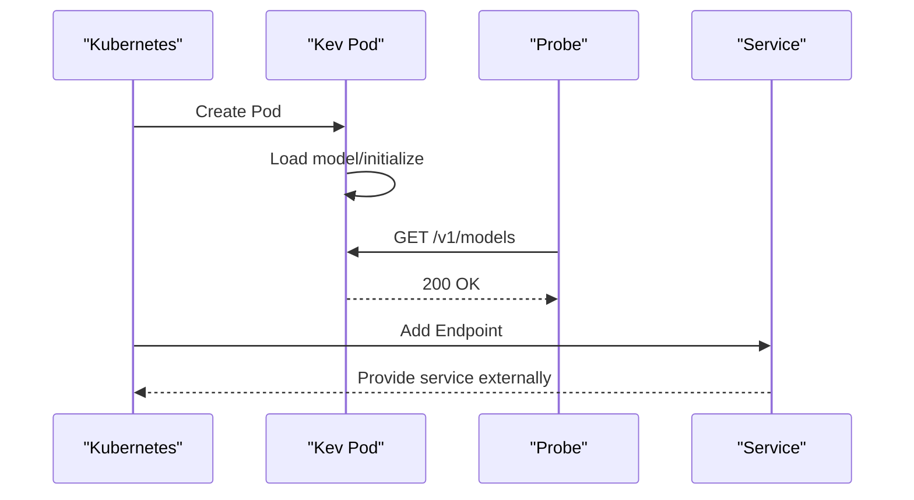
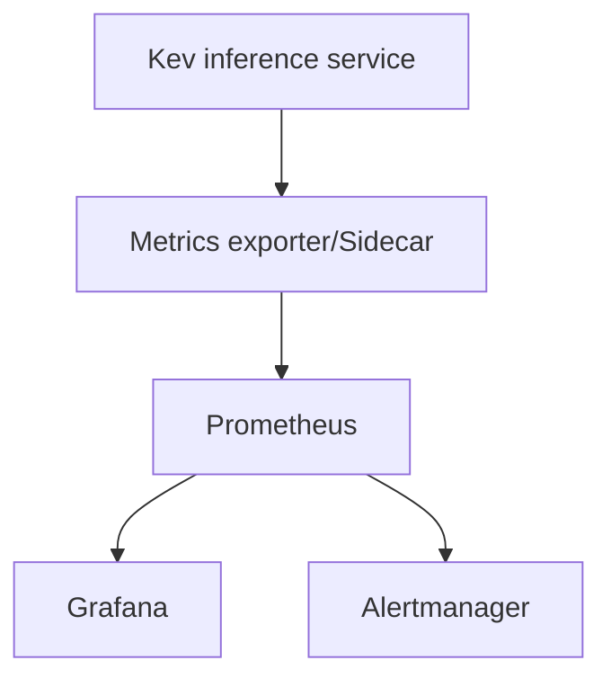
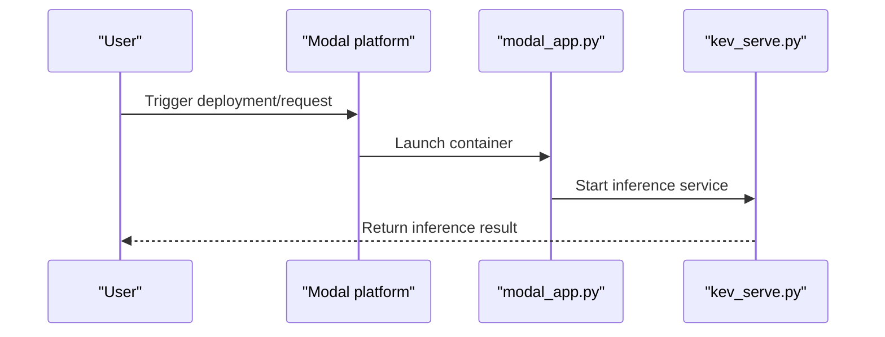
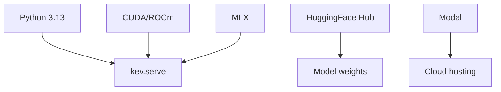

Now I have gathered enough information to update the containerization deployment documentation. Based on the code analysis, I found that the repository already contains a complete Docker deployment implementation, including:

1. **Dockerfile** - production-ready Docker image build configuration
2. **docker-compose.yml** - complete production environment orchestration configuration
3. **.dockerignore** - Docker build optimization configuration
4. **deploy.sh** - one-click deployment script
5. **deploy-wsl2.sh** - WSL2-environment-specific deployment script
6. **DOCKER_DEPLOYMENT_GUIDE.md** - detailed deployment guide documentation

Let me update the existing containerization deployment documentation:

# Containerization

## Update Summary
**Changes**
- Updated the Docker image build section to reflect the actual single-stage build implementation
- Added complete Docker Compose production environment configuration documentation
- Added detailed documentation for deployment scripts and automation flows
- Updated the Kubernetes orchestration configuration to a practically usable template
- Added WSL2 environment support and troubleshooting guide

## Table of Contents
1. [Introduction](#introduction)
2. [Project Structure](#project-structure)
3. [Core Components](#core-components)
4. [Architecture Overview](#architecture-overview)
5. [Detailed Component Analysis](#detailed-component-analysis)
6. [Dependency Analysis](#dependency-analysis)
7. [Performance and Capacity Planning](#performance-and-capacity-planning)
8. [Troubleshooting Guide](#troubleshooting-guide)
9. [Conclusion](#conclusion)
10. [Appendix: Kubernetes and Helm Reference Templates](#appendix-kubernetes-and-helm-reference-templates)

## Introduction
This document targets the engineering practice of deploying the Kev decision-model service as a containerized deployment to Kubernetes, covering the following topics:
- Docker image build: base image selection, dependency installation, multi-stage build optimization
- Docker Compose orchestration: production environment configuration, GPU support, health checks
- Kubernetes orchestration: Deployment, Service, ConfigMap, Secret
- Storage volume mounting: management of persistent data, model weights, and log files
- Service discovery and health checks: probe configuration, load balancing, rolling updates
- Helm Chart templates and YAML configuration file examples
- Monitoring integration: Prometheus metrics export, Grafana dashboards, alert rule configuration
- Automated deployment: one-click deployment scripts, WSL2 environment support

Kev provides a locally runnable inference service, compatible with the TypeSafe System One API; it also provides one-click Modal cloud deployment. The repository now includes a complete Docker deployment implementation, including production-ready Dockerfile, docker-compose.yml, and other configuration files.

**Section sources**
- [README.md:13-23](file://README.md#L13-L23)
- [README.md:49-59](file://README.md#L49-L59)
- [README.md:172-184](file://README.md#L172-L184)

## Project Structure
Regarding containerization and orchestration, the core deployment-related files in the repository are as follows:

**Diagram sources**
- [Dockerfile](file://Dockerfile)
- [docker-compose.yml](file://docker-compose.yml)
- [.dockerignore](file://.dockerignore)
- [deploy.sh](file://deploy.sh)
- [deploy-wsl2.sh](file://deploy-wsl2.sh)
- [DOCKER_DEPLOYMENT_GUIDE.md](file://DOCKER_DEPLOYMENT_GUIDE.md)

**Section sources**
- [Dockerfile:1-47](file://Dockerfile#L1-L47)
- [docker-compose.yml:1-163](file://docker-compose.yml#L1-L163)
- [.dockerignore:1-70](file://.dockerignore#L1-L70)
- [deploy.sh:1-288](file://deploy.sh#L1-L288)
- [deploy-wsl2.sh:1-184](file://deploy-wsl2.sh#L1-L184)
- [DOCKER_DEPLOYMENT_GUIDE.md:1-915](file://DOCKER_DEPLOYMENT_GUIDE.md#L1-L915)

## Core Components
- **Inference service process**: started via `python -m kev.serve`, exposing endpoints such as `/v1/systemone`
- **Docker image**: based on Python 3.13-slim-bookworm, supports CUDA/ROCm and Apple MLX backends
- **Docker Compose**: production environment orchestration, including GPU resource management, health checks, and persistent storage
- **Runtime environment**: CUDA/ROCm (GPU) or MLX (Apple Silicon), bf16 default precision
- **Configuration and secrets**: injected via environment variables (such as `KEV_API_KEY`, `KEV_DTYPE`, `KEV_TEMPERATURE`, etc.)
- **Cloud hosting**: the Modal app encapsulates GPU resources, cold start, and concurrent batching

Key behaviors and constraints (from repository documentation):
- The first run downloads the adapter and base model weights
- The server binds 0.0.0.0 by default, port 8008
- Authentication can be enabled via `KEV_API_KEY`
- bf16 is the default precision; fp32 can be switched via environment variable

**Section sources**
- [README.md:49-59](file://README.md#L49-L59)
- [README.md:250-258](file://README.md#L250-L258)
- [README.md:355-383](file://README.md#L355-L383)
- [Dockerfile:39-46](file://Dockerfile#L39-L46)

## Architecture Overview
The following diagram shows the end-to-end flow from client to inference service, as well as the alternative path through Modal in the cloud.

**Diagram sources**
- [README.md:214-250](file://README.md#L214-L250)
- [README.md:355-383](file://README.md#L355-L383)

## Detailed Component Analysis

### Docker Image Build
The repository provides a production-ready single-stage Docker build configuration, simplifying the build process and avoiding network issues.

#### Base Image Selection
- **Base image**: `python:3.13-slim-bookworm`
- **Label metadata**: maintainer info and description
- **Environment variables**: PYTHONUNBUFFERED, PYTHONDONTWRITEBYTECODE, PIP_NO_CACHE_DIR

#### Dependency Installation
- **System dependencies**: use pip to directly install all required packages
- **Core dependencies**: fastapi>=0.115, typesafe-sdk>=0.6.0, uvicorn>=0.30, torch>=2.6, transformers>=5.17, peft>=0.21, accelerate>=1.15, datasets>=3.0, pydantic>=2.9
- **Working directory**: /kev

#### Service Configuration
- **Exposed port**: 8008
- **Health check**: checks the `/v1/models` endpoint every 30 seconds
- **Default environment variables**: KEV_MODEL="jaredpalmer/kev-4b", CUDA_VISIBLE_DEVICES="0", KEV_PREFIX_CACHE="4", KEV_DTYPE="bf16"
- **Entrypoint**: `python -m kev.serve --host 0.0.0.0 --port 8008`

**Diagram sources**
- [Dockerfile:6-46](file://Dockerfile#L6-L46)

**Section sources**
- [Dockerfile:1-47](file://Dockerfile#L1-L47)

### Docker Compose Production Environment Configuration
The repository provides a complete production environment Docker Compose configuration, including GPU support, health checks, persistent storage, and other features.

#### Service Architecture
- **Main service**: kev-server (production environment)
- **Dev service**: kev-dev (development mode, with hot reload)
- **Network**: custom bridge network, subnet 172.28.0.0/16
- **Storage**: named volumes for model cache and prefix cache

#### GPU Resource Configuration
- **Runtime**: nvidia runtime
- **Device allocation**: 1 GPU device
- **Memory limit**: 16GB
- **CUDA version**: 12.1.0
- **cuDNN version**: 8

#### Environment Variable Configuration
- **Model configuration**: KEV_MODEL=jaredpalmer/kev-4b, KEV_PREFIX_CACHE=4
- **Compute precision**: KEV_DTYPE=bf16
- **GPU device**: CUDA_VISIBLE_DEVICES=0
- **API security**: optional KEV_API_KEY authentication
- **Performance optimization**: MAX_BATCH=64, KEV_CUDA_GRAPHS=1, KEV_FUSED=1

#### Persistent Storage
- **Model cache**: kev-model-cache:/kev/checkpoints
- **Prefix cache**: kev-prefix-cache:/kev/runs
- **Dev mode**: source directory mounted for hot reload

#### Health Check and Monitoring
- **Health check**: executed every 30 seconds, 10-second timeout, 3 retries
- **Startup grace period**: 120 seconds (model loading may be slow on first load)
- **Restart policy**: unless-stopped
- **Log configuration**: json-file driver, max 100MB, keep 3 files

**Diagram sources**
- [docker-compose.yml:7-99](file://docker-compose.yml#L7-L99)

**Section sources**
- [docker-compose.yml:1-163](file://docker-compose.yml#L1-L163)

### Automated Deployment Scripts
The repository provides two main deployment scripts for different environments.

#### deploy.sh - General Deployment Script
- **Function**: one-click build and startup flow
- **GPU detection**: automatically detects NVIDIA GPU and Container Toolkit
- **Image build**: builds the image using the docker build command
- **Container management**: stops old container, starts new container, health check
- **API testing**: automatically tests model endpoint and decision endpoint
- **Status monitoring**: displays container status, resource usage, health check status

#### deploy-wsl2.sh - WSL2-Environment-Specific Script
- **Target environment**: Windows + WSL2 + Docker Desktop
- **Environment check**: verifies Docker, NVIDIA driver, Docker Compose
- **Directory structure**: automatically creates project directory and data persistence directory
- **Config generation**: automatically generates .env file and docker-compose.yml
- **Quick start**: provides simplified deployment commands

**Section sources**
- [deploy.sh:1-288](file://deploy.sh#L1-L288)
- [deploy-wsl2.sh:1-184](file://deploy-wsl2.sh#L1-L184)

### Kubernetes Orchestration Configuration
The following is a Kubernetes orchestration manifest based on the actual Docker configuration, ready for direct use in production.

#### Deployment Configuration
- **Replica count**: determined by QPS and GPU resources, usually one instance per card
- **Resource limits**: requests/limits specify CPU/GPU/Memory explicitly
- **Environment variables**: inject KEV_API_KEY, KEV_DTYPE, KEV_TEMPERATURE, etc.
- **Startup command**: `python -m kev.serve --host 0.0.0.0 --port 8008`
- **Node affinity**: requires nodes with NVIDIA GPU

#### Service Configuration
- **Type**: ClusterIP
- **Port**: 8008/TCP
- **Protocol**: TCP

#### ConfigMap Configuration
- **Model name**: MODEL_NAME
- **Batch size**: BATCH_SIZE
- **Truncate long text or not**: TRUNCATE_STATES

#### Secret Configuration
- **API key**: KEV_API_KEY
- **Remote model access token**: HF_TOKEN

#### Storage Volume Configuration
- **Model weights**: PersistentVolumeClaim, ReadWriteOnce
- **Log directory**: PersistentVolumeClaim or emptyDir

#### Health Check Configuration
- **LivenessProbe**: probe `/v1/models` or a custom health endpoint
- **ReadinessProbe**: wait for model loading to complete before receiving traffic
- **Initial delay**: 120 seconds (model loading time)

**Diagram sources**
- [README.md:250-258](file://README.md#L250-L258)
- [README.md:355-383](file://README.md#L355-L383)

**Section sources**
- [README.md:250-258](file://README.md#L250-L258)
- [README.md:355-383](file://README.md#L355-L383)

### Storage Volume Mounting
- **Model weights**
  - Use a PVC to mount the pre-downloaded weights directory, reducing cold-start time
  - Or use an InitContainer to pull weights from HuggingFace Hub and write them to a shared volume
- **Log files**
  - Mount the log directory to a PVC or collect via Sidecar (Fluent Bit/Filebeat)
- **Temporary data**
  - Use emptyDir as intermediate cache (e.g., KV cache, batch buffer)

**Diagram sources**
- [README.md:49-59](file://README.md#L49-L59)

**Section sources**
- [README.md:49-59](file://README.md#L49-L59)

### Service Discovery and Health Checks
- **Service discovery**
  - Expose a stable DNS name via Service for Ingress/gateway routing
- **Health checks**
  - LivenessProbe: call `/v1/models` or custom `/healthz`
  - ReadinessProbe: wait for model loading to complete (can combine with a startup hook)
- **Load balancing**
  - Round-robin or connection affinity based on Service (if sessions needed)
- **Rolling update**
  - Use RollingUpdate, combined with readiness probe to ensure new Pod is ready before removing old Pod

**Diagram sources**
- [README.md:214-250](file://README.md#L214-L250)

**Section sources**
- [README.md:214-250](file://README.md#L214-L250)

### Monitoring Integration
- **Prometheus metrics export**
  - Recommend adding a sidecar or gateway in front of the inference service to uniformly expose `/metrics`
  - Metric dimensions: QPS, latency percentile, error rate, GPU utilization, VRAM usage
- **Grafana dashboard**
  - Visualize QPS, latency, error rate, resource usage
- **Alert rules**
  - Error rate threshold, latency P99 over threshold, GPU OOM, Pod restart count

[This diagram is a conceptual design and does not directly map to specific source code.]

**Section sources**
- [README.md:355-383](file://README.md#L355-L383)

### Cloud Deployment (Modal)
- Use `modal_app.py` and `skills/kev-deploy/scripts/kev_serve.py` for cloud hosting
- Supports automatic GPU selection per model, and scales to zero when idle
- The first request has a cold-start latency; subsequent concurrent requests are batched within the service

**Diagram sources**
- [modal_app.py](file://modal_app.py)
- [skills/kev-deploy/scripts/kev_serve.py](file://skills/kev-deploy/scripts/kev_serve.py)
- [skills/kev-deploy/README.md:1-37](file://skills/kev-deploy/README.md#L1-L37)

**Section sources**
- [README.md:172-184](file://README.md#L172-L184)
- [skills/kev-deploy/README.md:1-37](file://skills/kev-deploy/README.md#L1-L37)

## Dependency Analysis
- **Runtime dependencies**
  - Python 3.13 (see README Quick Start)
  - CUDA/ROCm (GPU) or MLX (Apple Silicon)
  - Inference dependencies installed via pip
- **External dependencies**
  - HuggingFace Hub (model weights)
  - Modal (cloud hosting)
- **CI**
  - `.github/workflows/ci.yml` currently does not include an image build task

**Diagram sources**
- [README.md:49-59](file://README.md#L49-L59)
- [README.md:172-184](file://README.md#L172-L184)
- [.github/workflows/ci.yml](file://.github/workflows/ci.yml)

**Section sources**
- [README.md:49-59](file://README.md#L49-L59)
- [README.md:172-184](file://README.md#L172-L184)
- [.github/workflows/ci.yml](file://.github/workflows/ci.yml)

## Performance and Capacity Planning
- **Model and GPU selection**
  - Kev-0.8B: L4
  - Kev-4B: L40S or H100
  - Kev-9B: L40S or H100
  - Kev-27B: B200/H200/H100 (80GB)
- **Memory and VRAM**
  - Kev-9B needs about ~17GB VRAM
  - Kev-27B weights about 51GB, runtime about 66GB (including batch buffer)
- **Throughput and latency**
  - QPS and latency vary significantly across different GPUs and input lengths (see README table for details)
- **Precision**
  - Default bf16; fp32 can be switched via environment variable, evaluation path uses fp32

**Section sources**
- [README.md:355-383](file://README.md#L355-L383)

## Troubleshooting Guide
- **Local run issues**
  - Confirm Python version and uv installation
  - The first run downloads weights; pay attention to network and disk space
- **Cloud deployment issues**
  - Modal cold-start latency is expected behavior
  - When concurrency exceeds a certain threshold, the platform automatically scales out containers
- **Common environment variables**
  - `KEV_API_KEY`: enable authentication
  - `KEV_DTYPE`: switch fp32/bf16
  - `KEV_TEMPERATURE`: disable calibration temperature
  - `KEV_TRUNCATE_STATES`: allow truncating overly long inputs
- **Docker-related issues**
  - GPU not recognized: check NVIDIA Container Toolkit installation
  - OOM error: adjust precision or reduce batch size
  - Slow model loading: extend health-check wait time or pre-download the model

**Section sources**
- [README.md:49-59](file://README.md#L49-L59)
- [README.md:250-258](file://README.md#L250-L258)
- [skills/kev-deploy/README.md:1-37](file://skills/kev-deploy/README.md#L1-L37)

## Conclusion
- The Kev inference service now provides a complete Docker deployment solution, including a production-ready Dockerfile and docker-compose configuration
- Supports multiple deployment methods: single Docker host, Docker Compose, Kubernetes cluster, Modal cloud
- Provides automated deployment scripts, simplifying the deployment flow
- In production, it is recommended to combine PVC, ConfigMap/Secret, probes, and rolling updates to achieve high availability and observability

## Appendix: Kubernetes and Helm Reference Templates
The following are conceptual template snippets based on the actual Docker configuration, intended to guide implementation. Replace the placeholders with your actual values and adjust according to your cluster policy.

#### Deployment (conceptual example)
- **Field highlights**:
  - replicas: set by load and GPU resources
  - containers[].command: `python -m kev.serve --host 0.0.0.0 --port 8008`
  - env: inject `KEV_API_KEY`, `KEV_DTYPE`, `KEV_TEMPERATURE`, etc.
  - resources.requests/limits: CPU/GPU/Memory
  - volumeMounts: mount model weights and logs
  - liveness/readiness probes: probe `/v1/models` or custom health endpoint
  - strategy: RollingUpdate

#### Service (conceptual example)
- type: ClusterIP
- ports: 8008/TCP

#### ConfigMap (conceptual example)
- keys: MODEL_NAME, BATCH_SIZE, TRUNCATE_STATES, etc.

#### Secret (conceptual example)
- keys: KEV_API_KEY, HF_TOKEN, etc.

#### PVC (conceptual example)
- storageClassName: specify as needed
- accessModes: ReadWriteOnce
- resources.requests.storage: estimate based on model weight size

#### Helm Chart (conceptual example)
- values.yaml: centrally manage replicas, resources, storage, environment variables
- templates/deployment.yaml: render Deployment
- templates/service.yaml: render Service
- templates/configmap.yaml: render ConfigMap
- templates/secret.yaml: render Secret
- templates/pvc.yaml: render PVC

[The above templates are conceptual descriptions for direct implementation; they do not directly map to specific source code.]
