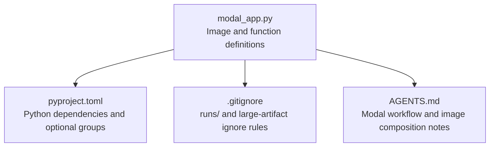
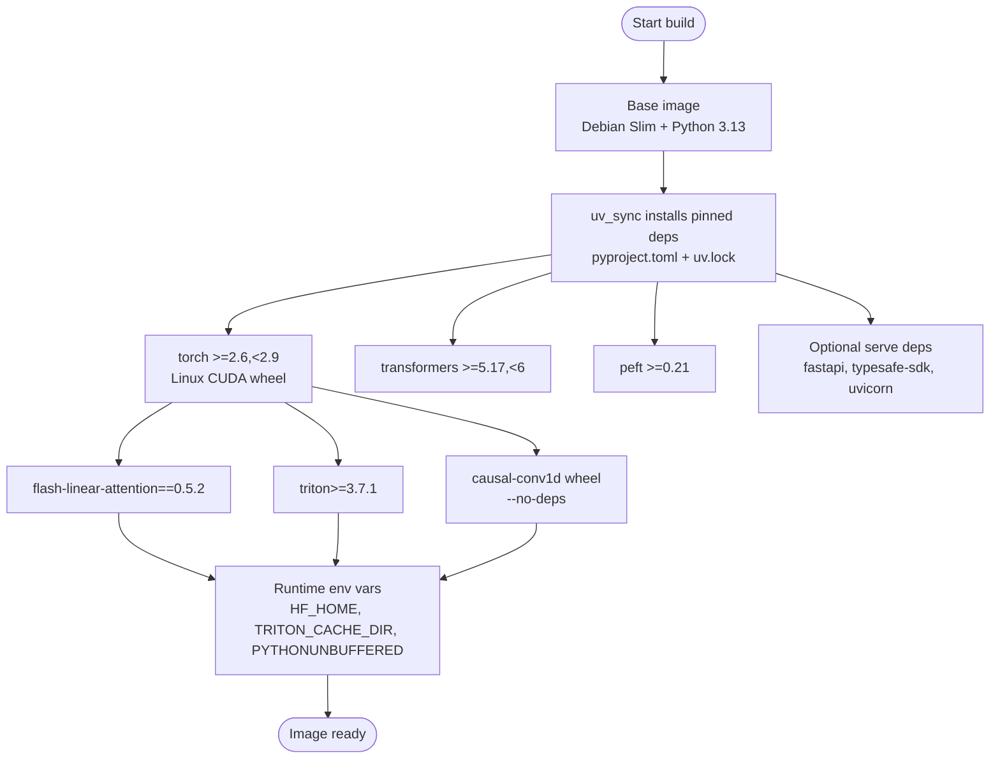
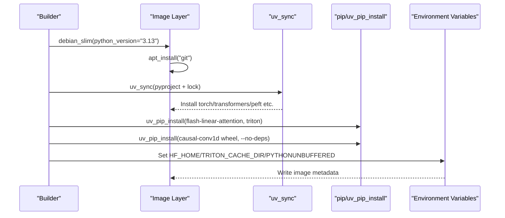
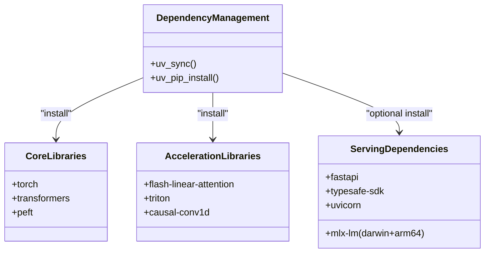
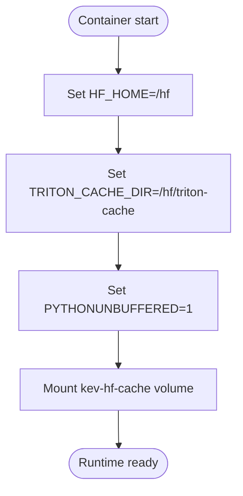
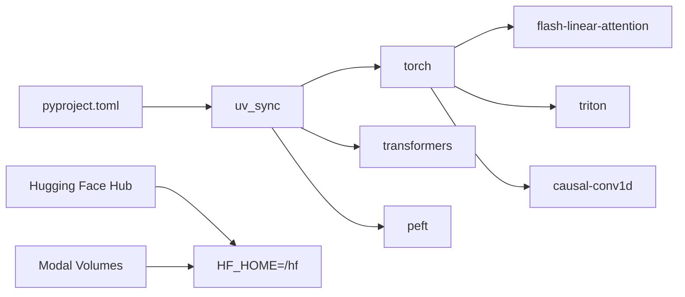

## Table of Contents
1. [Introduction](#introduction)
2. [Project Structure](#project-structure)
3. [Core Components](#core-components)
4. [Architecture Overview](#architecture-overview)
5. [Detailed Component Analysis](#detailed-component-analysis)
6. [Dependency Analysis](#dependency-analysis)
7. [Performance and Size Optimization](#performance-and-size-optimization)
8. [Troubleshooting Guide](#troubleshooting-guide)
9. [Conclusion](#conclusion)
10. [Appendix: Build Commands and Environment Variables](#appendix-build-commands-and-environment-variables)

## Introduction
This document is aimed at workflows running Kev training, evaluation, and serving on Modal, systematically explaining its Docker image build strategy and key configuration. The content covers base image selection, multi-stage dependency installation, CUDA/PyTorch/transformers ecosystem configuration, pinned dependency management, installation strategies for key acceleration libraries (flash-linear-attention, triton, causal-conv1d), and the impact of environment variables such as HF_HOME, TRITON_CACHE_DIR, and PYTHONUNBUFFERED on runtime behavior. It also provides caching and layered-build optimization suggestions, and summarizes directly reusable build commands and environment settings.

## Project Structure
This repository does not provide a standalone Dockerfile; the image is built declaratively by the Modal app via the Python API. The core definition is in modal_app.py, the dependency manifest is in pyproject.toml, the runtime artifact and weight path conventions are governed by .gitignore, and the overall engineering background and runtime semantics are supplemented in AGENTS.md.

**Diagram sources**
- [modal_app.py:53-75](file://modal_app.py#L53-L75)
- [pyproject.toml:1-62](file://pyproject.toml#L1-L62)
- [.gitignore:1-120](file://.gitignore#L1-L120)
- [AGENTS.md:242-253](file://AGENTS.md#L242-L253)

**Section sources**
- [modal_app.py:53-75](file://modal_app.py#L53-L75)
- [pyproject.toml:1-62](file://pyproject.toml#L1-L62)
- [.gitignore:1-120](file://.gitignore#L1-L120)
- [AGENTS.md:242-253](file://AGENTS.md#L242-L253)

## Core Components
- Base image and language version
  - Debian Slim-based Python 3.13 environment, meeting the compatibility requirements of torch 2.8 and the CUDA wheel.
- Dependency installation flow
  - Use uv_sync to precisely install dependencies from pyproject.toml and uv.lock; on Linux the CUDA-version torch wheel is automatically fetched.
  - Additionally install flash-linear-attention==0.5.2 and triton>=3.7.1 to enable the fast Gated DeltaNet kernel of the Qwen3.5 hybrid backend.
  - Pre-compiled causal-conv1d wheel (matching torch 2.8 / CUDA 12 / Python 3.13), with --no-deps to avoid overwriting the pinned triton version.
- Runtime environment variables
  - HF_HOME=/hf: persists Hugging Face models and dataset caches to the mounted volume kev-hf-cache.
  - TRITON_CACHE_DIR=/hf/triton-cache: caches Triton-compiled DeltaNet kernels and autotuning results, shortening cold-start time.
  - PYTHONUNBUFFERED=1: ensures real-time log output, facilitating remote debugging and monitoring.
- Code and data injection
  - Copy kev source, evals, scripts, tests, and experiments/sft-v1-lengths.json into the image root, so scripts and evaluation sets are executable inside the container.

**Section sources**
- [modal_app.py:44-75](file://modal_app.py#L44-L75)
- [AGENTS.md:242-253](file://AGENTS.md#L242-L253)

## Architecture Overview
The following diagram shows the key stages of image build and runtime dependency relationships.

**Diagram sources**
- [modal_app.py:53-75](file://modal_app.py#L53-L75)
- [pyproject.toml:21-46](file://pyproject.toml#L21-L46)

## Detailed Component Analysis

### Base Image Selection Strategy
- Reasons for choosing Debian Slim + Python 3.13
  - Binary-compatible with the CUDA 12 of the official torch 2.8 wheel.
  - Consistent with the ABI requirements of triton>=3.7.1 and flash-linear-attention 0.5.2.
  - Smaller system package footprint, reducing image size and attack surface.
- Alignment with project requirements
  - pyproject.toml allows Python 3.12 to 3.13, but the image fixes 3.13 to obtain a stable CUDA wheel and triton support.

**Section sources**
- [modal_app.py:53-66](file://modal_app.py#L53-L66)
- [pyproject.toml:13-13](file://pyproject.toml#L13-L13)

### Multi-Stage Build Process
- Stage 1: Base system and Git
  - Install git for possible subsequent source pulls or verification.
- Stage 2: Dependency installation
  - uv_sync precisely installs dependencies from pyproject.toml and uv.lock; on Linux the CUDA-version torch is auto-selected.
  - Install flash-linear-attention and triton to enable the high-performance DeltaNet kernel of the Qwen3.5 hybrid backend.
  - Install the pre-compiled causal-conv1d wheel, and use --no-deps to avoid replacing the pinned triton.
- Stage 3: Runtime environment and source injection
  - Set environment variables HF_HOME, TRITON_CACHE_DIR, PYTHONUNBUFFERED, etc.
  - Inject kev source, evals, scripts, tests, and experiment config files.

**Diagram sources**
- [modal_app.py:53-75](file://modal_app.py#L53-L75)

**Section sources**
- [modal_app.py:53-75](file://modal_app.py#L53-L75)

### Key Dependency Management and Install Configuration
- Pinned dependencies
  - Read pyproject.toml and uv.lock via uv_sync, ensuring a consistent dependency tree on every build.
- PyTorch and transformers
  - torch>=2.6,<2.9; transformers>=5.17,<6; peft>=0.21.
- Acceleration and kernels
  - flash-linear-attention==0.5.2: provides a fast implementation of the Gated DeltaNet for the Qwen3.5 hybrid backend.
  - triton>=3.7.1: backs the Triton kernel of flash-linear-attention.
  - causal-conv1d: short-convolution CUDA kernel, improving DeltaNet forward/backward efficiency.
- Optional serving dependencies
  - The serve optional group includes fastapi, typesafe-sdk, uvicorn; mlx-lm is optional on Apple Silicon.

**Diagram sources**
- [modal_app.py:53-75](file://modal_app.py#L53-L75)
- [pyproject.toml:21-46](file://pyproject.toml#L21-L46)

**Section sources**
- [modal_app.py:53-75](file://modal_app.py#L53-L75)
- [pyproject.toml:21-46](file://pyproject.toml#L21-L46)

### Environment Variables and Runtime Configuration
- HF_HOME=/hf
  - Caches Hugging Face models and datasets to the persistent volume kev-hf-cache, reused across containers, significantly reducing repeated download cost.
- TRITON_CACHE_DIR=/hf/triton-cache
  - Caches Triton-compiled DeltaNet kernels and autotuning results, avoiding recompilation on every cold start, saving seconds of latency.
- PYTHONUNBUFFERED=1
  - Disables Python stdout buffering, making logs visible in real time, facilitating remote debugging and monitoring.
- TOKENIZERS_PARALLELISM=false
  - Disables tokenizer parallelism, avoiding resource contention and unstable behavior in multi-process environments.

**Diagram sources**
- [modal_app.py:44-50](file://modal_app.py#L44-L50)

**Section sources**
- [modal_app.py:44-50](file://modal_app.py#L44-L50)

## Dependency Analysis
- Direct dependencies
  - torch, transformers, and peft are core inference and fine-tuning dependencies.
  - flash-linear-attention and triton are high-performance kernel dependencies.
  - causal-conv1d is a short-convolution kernel dependency.
- Indirect dependencies
  - uv_sync resolves pyproject.toml and uv.lock, generating a stable dependency graph.
  - The serve optional group pulls in web-serving-related dependencies.
- External integration points
  - Hugging Face Hub: model and dataset downloads, controlled by HF_HOME.
  - Modal Volumes: kev-hf-cache and kev-runs carry model cache and training/evaluation outputs respectively.

**Diagram sources**
- [pyproject.toml:21-46](file://pyproject.toml#L21-L46)
- [modal_app.py:53-75](file://modal_app.py#L53-L75)

**Section sources**
- [pyproject.toml:21-46](file://pyproject.toml#L21-L46)
- [modal_app.py:53-75](file://modal_app.py#L53-L75)

## Performance and Size Optimization
- Caching strategy
  - Use the Modal Volume kev-hf-cache to persist HF_HOME, avoiding repeated model and dataset downloads.
  - TRITON_CACHE_DIR caches Triton-compiled kernels, reducing cold-start overhead.
- Layered build
  - Install system tools (git) first, then dependencies (uv_sync), and finally inject source and data, maximizing Docker layer-cache reuse.
- Image size optimization
  - Install only necessary dependencies; serve and mlx are enabled on demand as optional groups.
  - Use the Debian Slim base image to reduce system package size.
  - causal-conv1d uses a pre-compiled wheel with --no-deps, avoiding repeated installation of unnecessary dependencies.
- Build stability
  - Pin all dependency versions via uv.lock, ensuring consistent builds across environments.
  - Explicitly specify triton>=3.7.1 and flash-linear-attention==0.5.2 to avoid known kernel compatibility issues.

[This section is general optimization guidance and does not directly analyze specific files.]

## Troubleshooting Guide
- Cannot import causal-conv1d, or DeltaNet kernel is slow
  - Check that the causal-conv1d wheel is installed and its version matches torch/CUDA/Python.
  - Confirm TRITON_CACHE_DIR is set correctly and is writable.
- Slow model loading or repeated downloads
  - Confirm HF_HOME points to the persistent volume /hf and that kev-hf-cache is mounted.
- Missing or incomplete logs
  - Confirm PYTHONUNBUFFERED=1 is set.
- Dependency conflict or triton version overwritten
  - Check whether another triton version was mistakenly installed; ensure causal-conv1d is installed with --no-deps.

**Section sources**
- [modal_app.py:53-75](file://modal_app.py#L53-L75)
- [AGENTS.md:426-438](file://AGENTS.md#L426-L438)

## Conclusion
This image, through the Debian Slim + Python 3.13 base image and uv_lock pinned dependencies, combined with the precise installation of flash-linear-attention, triton, and causal-conv1d, builds a stable and high-performance Kev runtime environment. Through the environment variable design of HF_HOME and TRITON_CACHE_DIR, it persists model and kernel caches, significantly improving cold-start and repeated-run efficiency. Layered builds and minimal dependencies further control image size and improve build and deployment maintainability.

[This section is summary content and does not directly analyze specific files.]

## Appendix: Build Commands and Environment Variables
- Build commands (based on the Modal image API)
  - Use modal.Image.debian_slim(python_version="3.13") to create the base image.
  - Use .apt_install("git") to install system tools.
  - Use .uv_sync(uv_project_dir=str(ROOT), groups=[], extras=["serve"]) to install pinned dependencies.
  - Use .uv_pip_install("flash-linear-attention==0.5.2", "triton>=3.7.1") to install acceleration libraries.
  - Use .uv_pip_install(CAUSAL_CONV1D, extra_options="--no-deps") to install the causal-conv1d wheel.
  - Use .env(worker_environment(APP_NAME, GPU, ...)) to set environment variables.
  - Use .add_local_python_source("kev") and .add_local_file/dir to inject source and data.
- Environment variables
  - HF_HOME=/hf
  - TRITON_CACHE_DIR=/hf/triton-cache
  - PYTHONUNBUFFERED=1
  - TOKENIZERS_PARALLELISM=false

**Section sources**
- [modal_app.py:44-75](file://modal_app.py#L44-L75)
