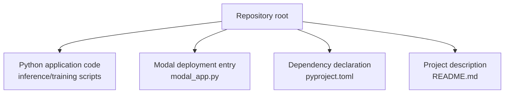
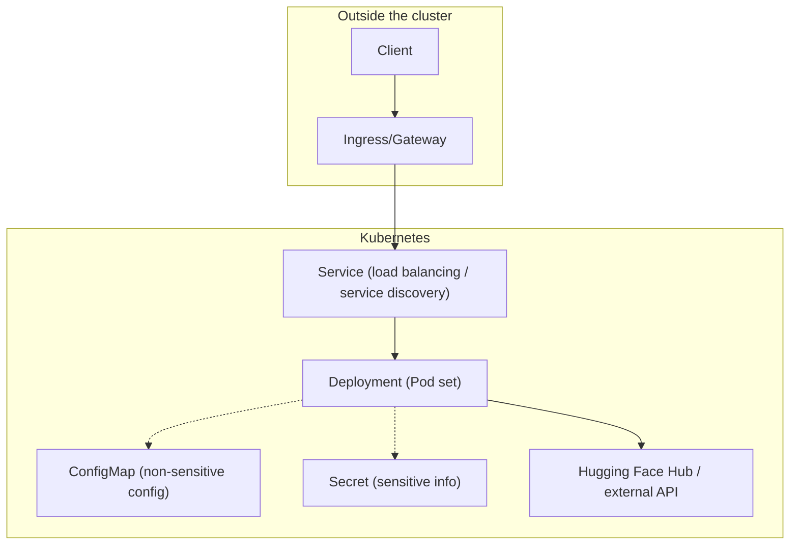
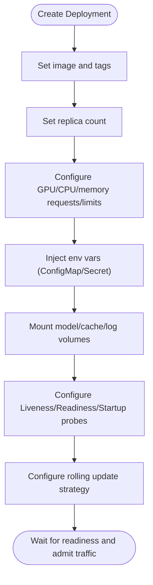
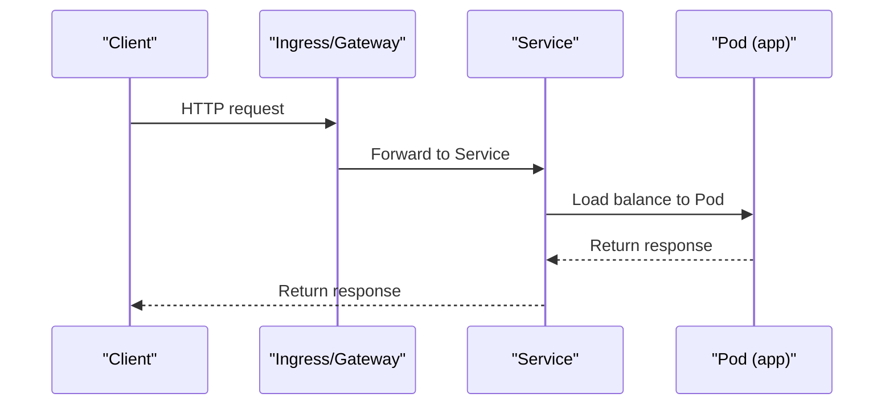
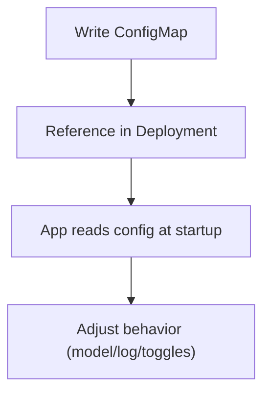
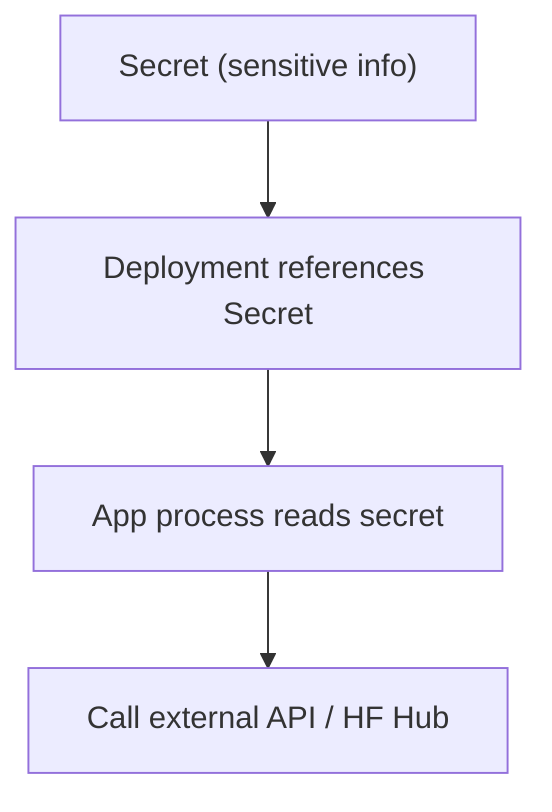
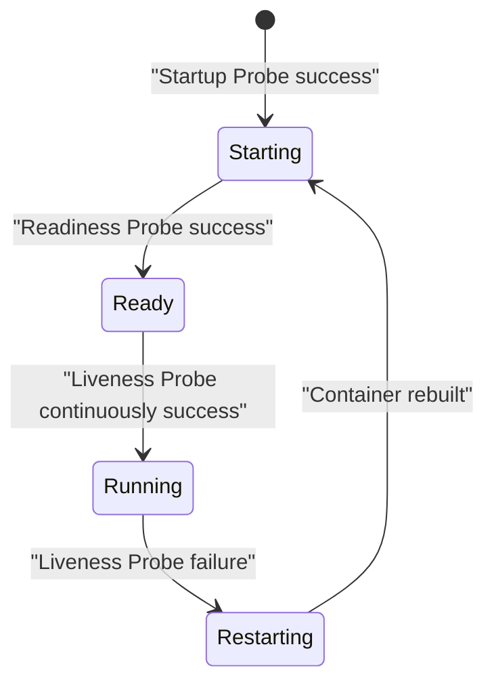
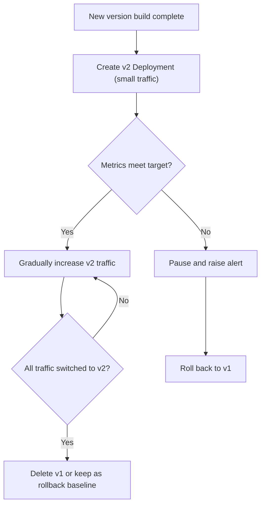
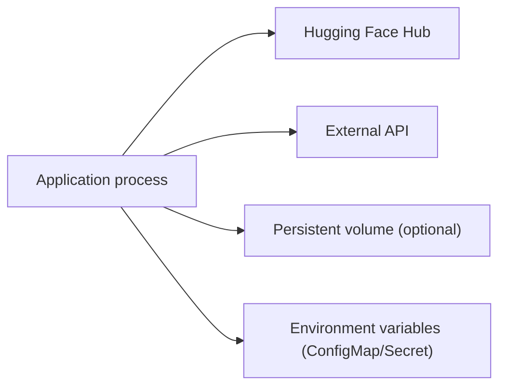

## Table of Contents
1. [Introduction](#introduction)
2. [Project Structure](#project-structure)
3. [Core Components](#core-components)
4. [Architecture Overview](#architecture-overview)
5. [Detailed Component Analysis](#detailed-component-analysis)
6. [Dependency Analysis](#dependency-analysis)
7. [Performance Considerations](#performance-considerations)
8. [Troubleshooting Guide](#troubleshooting-guide)
9. [Conclusion](#conclusion)
10. [Appendix](#appendix)

## Introduction
This document is aimed at those orchestrating and running the project's services on Kubernetes, providing an actionable orchestration guide. The content covers Deployment, Service, ConfigMap, Secret, health-check probes, rolling update strategies, and kubectl command examples. Since the repository does not include ready-made Kubernetes YAML, this document provides "directly applicable" configuration templates and best practices based on the project code and runtime characteristics, ensuring that key elements such as GPU resource requests, CPU/memory limits, replica count, load balancing, ports and service discovery, environment variables and model parameters, sensitive information storage, health checks, and rolling updates are complete and actionable.

## Project Structure
The repository body is a Python application (with inference/training scripts), deployed to the cloud via Modal; the Kubernetes orchestration configuration is managed as external YAML. Therefore, this document focuses on how to orchestrate the application in K8s without changing the repository's internal structure.

**Diagram sources**
- [README.md:1-50](file://README.md#L1-L50)
- [modal_app.py:1-50](file://modal_app.py#L1-L50)
- [pyproject.toml:1-50](file://pyproject.toml#L1-L50)

**Section sources**
- [README.md:1-50](file://README.md#L1-L50)
- [modal_app.py:1-50](file://modal_app.py#L1-L50)
- [pyproject.toml:1-50](file://pyproject.toml#L1-L50)

## Core Components
- Deployment: carries the application Pods, defining the image, replica count, GPU/CPU/memory requests and limits, environment variables, volume mounts, probes, and rolling update strategy.
- Service: exposes the HTTP API externally, enabling load balancing and service discovery.
- ConfigMap: injects non-sensitive configuration (environment variables, model parameters, log level).
- Secret: securely stores sensitive information such as Hugging Face Token and API Key.
- Health Probes: Liveness, Readiness, and Startup probes ensure service availability and startup ordering.
- Rolling Update: blue-green/canary/rollback strategies are implemented through the Deployment's rollout control combined with Ingress/Service.

**Section sources**
- [README.md:1-50](file://README.md#L1-L50)

## Architecture Overview
The following diagram shows the K8s-level orchestration relationships for this application: Ingress/Gateway routes traffic to the Service, which forwards to the Pods under the Deployment; the application inside the Pod reads configuration from the ConfigMap, obtains secrets from the Secret, and accesses the Hugging Face Hub or external APIs.

**Diagram sources**
- [README.md:1-50](file://README.md#L1-L50)
- [modal_app.py:1-50](file://modal_app.py#L1-L50)

## Detailed Component Analysis

### Deployment Resource Configuration
- Image and tags: use the built image address with a semantic version tag.
- Replica count: set the initial replicas based on QPS and GPU capacity, combined with HPA for autoscaling.
- GPU resource requests: set the number of nvidia.com/gpu based on per-card VRAM and concurrency needs.
- CPU/memory limits: set requests/limits for each Pod to avoid contention and OOM.
- Environment variables: referenced from ConfigMap/Secret, such as HF_TOKEN, LOG_LEVEL, MODEL_NAME.
- Volume mounts: model weights, cache directory, log output paths.
- Probes:
  - Liveness: HTTP GET /healthz or TCP probe of the port.
  - Readiness: HTTP GET /readyz or a custom readiness endpoint.
  - Startup: for scenarios where large-model cold start is slow, extend initialDelaySeconds and periodSeconds.
- Rolling update:
  - maxUnavailable/maxSurge control the rollout cadence.
  - revisionHistoryLimit keeps historical versions for quick rollback.
  - Combine with Ingress/Service weight switching to achieve blue-green/canary.

**Diagram sources**
- [README.md:1-50](file://README.md#L1-L50)

**Section sources**
- [README.md:1-50](file://README.md#L1-L50)

### Service Definition
- Type: ClusterIP (internal) or LoadBalancer/NodePort (external).
- Port mapping: expose the HTTP API port (e.g., 8080/8000).
- Selector: matches the Deployment's Pod labels.
- Session affinity: enable sessionAffinity if session stickiness is needed.
- Load balancing: handled by the underlying cloud provider LB or Ingress Controller.

**Diagram sources**
- [README.md:1-50](file://README.md#L1-L50)

**Section sources**
- [README.md:1-50](file://README.md#L1-L50)

### ConfigMap Usage
- Environment variable configuration: put non-sensitive items such as HF_TOKEN, LOG_LEVEL, MODEL_NAME into a ConfigMap, and reference them in the Deployment via envFrom or env.
- Model parameter configuration: mount JSON/YAML config files as data keys via files or inject via environment variables.
- Log level setting: control the application log output granularity via LOG_LEVEL.

**Diagram sources**
- [README.md:1-50](file://README.md#L1-L50)

**Section sources**
- [README.md:1-50](file://README.md#L1-L50)

### Secret Management
- Purpose: stores Hugging Face Token, third-party API Key, database passwords, etc.
- Creation: kubectl create secret or inject via CI/CD.
- Usage: reference in the Deployment via envFrom.secretRef or volumeMount.
- Security recommendations: enable etcd encryption, least-privilege RBAC, and audit logging.

**Diagram sources**
- [README.md:1-50](file://README.md#L1-L50)

**Section sources**
- [README.md:1-50](file://README.md#L1-L50)

### Health Check Configuration
- Liveness Probe: restart the Pod on failure, used to detect deadlocks/crashes.
- Readiness Probe: remove from the Service on failure, used for traffic isolation during rolling updates and scaling.
- Startup Probe: suitable for scenarios where large-model loading is time-consuming, avoiding premature failure determination.
- Typical endpoints: /healthz, /readyz, /metrics.

**Diagram sources**
- [README.md:1-50](file://README.md#L1-L50)

**Section sources**
- [README.md:1-50](file://README.md#L1-L50)

### Rolling Update Strategy
- Blue-green deployment: achieve zero-downtime switching via two Deployments (v1/v2) + Service selector switch.
- Canary release: first route a small amount of new replicas, observe metrics, then gradually expand.
- Rollback strategy: use kubectl rollout undo or specify a revision to roll back.
- Control parameters: maxUnavailable, maxSurge, revisionHistoryLimit.

**Diagram sources**
- [README.md:1-50](file://README.md#L1-L50)

**Section sources**
- [README.md:1-50](file://README.md#L1-L50)

## Dependency Analysis
- Application dependencies:
  - Hugging Face Hub: authenticate via HF_TOKEN to pull models or call APIs.
  - External API: authenticate via the API Key in the Secret.
- Runtime dependencies:
  - NVIDIA GPU driver and Device Plugin (nvidia.com/gpu).
  - Persistent volumes (optional): model cache, logs, checkpoints.
- Orchestration dependencies:
  - Ingress/Gateway: expose HTTP services externally.
  - ConfigMap/Secret: configuration and secret injection.

**Diagram sources**
- [README.md:1-50](file://README.md#L1-L50)

**Section sources**
- [README.md:1-50](file://README.md#L1-L50)

## Performance Considerations
- GPU resource planning: evaluate VRAM usage based on model size and concurrency, and reasonably set nvidia.com/gpu and the memory limit.
- CPU/memory limits: prevent neighbor-Pod jitter from affecting others by setting reasonable requests/limits.
- Replicas and horizontal scaling: combine HPA/VPA to autoscale based on CPU/GPU/Memory and custom metrics (QPS, latency).
- Startup optimization: warm up the model, pre-pull the image, and use a local cache disk to reduce cold-start time.
- Network and I/O: use high-performance storage classes, enable connection reuse, and set reasonable timeouts and retries.

[This section is general guidance and does not directly analyze specific files.]

## Troubleshooting Guide
- Pod cannot be scheduled:
  - Check whether nodes have GPU resources and correct taint/tolerations.
  - Confirm nvidia-device-plugin is running normally.
- Startup failure:
  - Check events and logs to confirm whether HF_TOKEN is correct and the image pull succeeded.
  - Verify ConfigMap/Secret names and key names.
- Service unavailable:
  - Check whether the Service selector matches the Pod labels.
  - Verify the reachability of the Readiness/Liveness probe endpoints.
- Rolling update issues:
  - Check whether maxUnavailable/maxSurge are too small, causing slow upgrades.
  - Use rollout status/history to diagnose version state.

**Section sources**
- [README.md:1-50](file://README.md#L1-L50)

## Conclusion
Through the systematic orchestration of the above Deployment, Service, ConfigMap, Secret, probes, and rolling updates, the project can be run stably and securely on Kubernetes. It is recommended to uniformly generate and release the YAML in CI/CD, and to use GitOps tools for version management and rollback.

[This section is summary content and does not directly analyze specific files.]

## Appendix

### Complete YAML Configuration Example (Checklist)
- Deployment
  - metadata.name, labels.app
  - spec.replicas
  - spec.selector.matchLabels
  - spec.template.metadata.labels
  - spec.template.spec.containers[].image
  - resources.requests.limits (cpu, memory, nvidia.com/gpu)
  - env/envFrom (ConfigMap/Secret)
  - volumeMounts (model/cache/log)
  - livenessProbe/readinessProbe/startupProbe (httpGet/tcpSocket)
  - strategy.rollingUpdate (maxUnavailable, maxSurge)
  - revisionHistoryLimit
- Service
  - metadata.name, labels.app
  - spec.type (ClusterIP/LoadBalancer)
  - spec.selector.matchLabels
  - spec.ports[].port/targetPort
- ConfigMap
  - data.HF_TOKEN, data.LOG_LEVEL, data.MODEL_NAME
- Secret
  - type: Opaque
  - data.HF_TOKEN, data.API_KEY (base64)

[This section is a template checklist and does not directly analyze specific files.]

### Common kubectl Commands
- Create resources
  - kubectl apply -f deployment.yaml
  - kubectl apply -f service.yaml
  - kubectl apply -f configmap.yaml
  - kubectl apply -f secret.yaml
- View status
  - kubectl get pods -l app=your-app
  - kubectl get svc -l app=your-app
  - kubectl describe pod <pod-name>
  - kubectl logs -f <pod-name>
- Rolling update and rollback
  - kubectl rollout status deployment/<name>
  - kubectl rollout history deployment/<name>
  - kubectl rollout undo deployment/<name> --to-revision=<rev>
- Scale
  - kubectl scale deployment/<name> --replicas=<N>
  - kubectl autoscale deployment/<name> --min=<m> --max=<M> --cpu-percent=

[This section is an operations guide and does not directly analyze specific files.]
