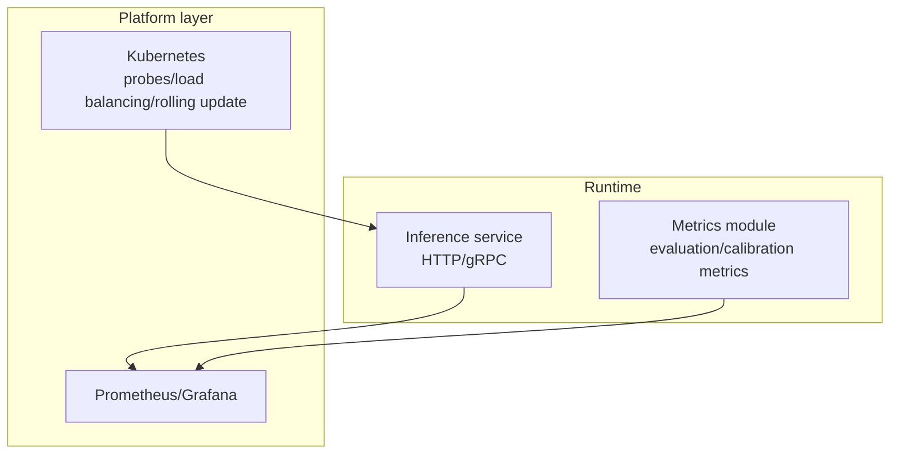
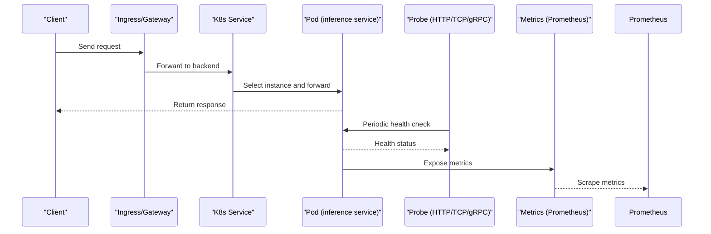
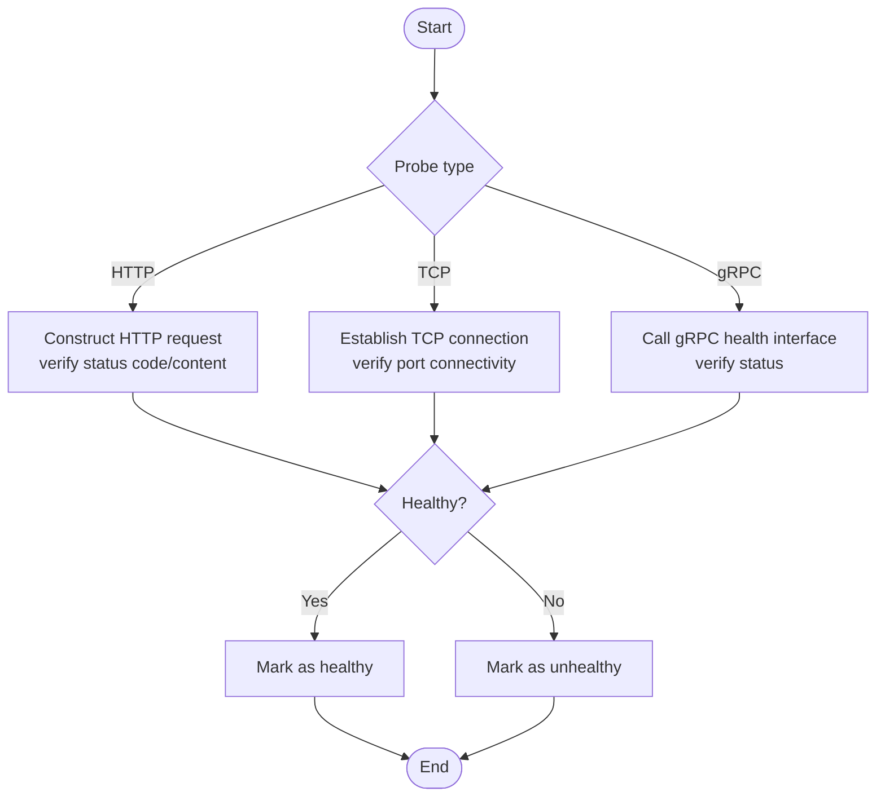
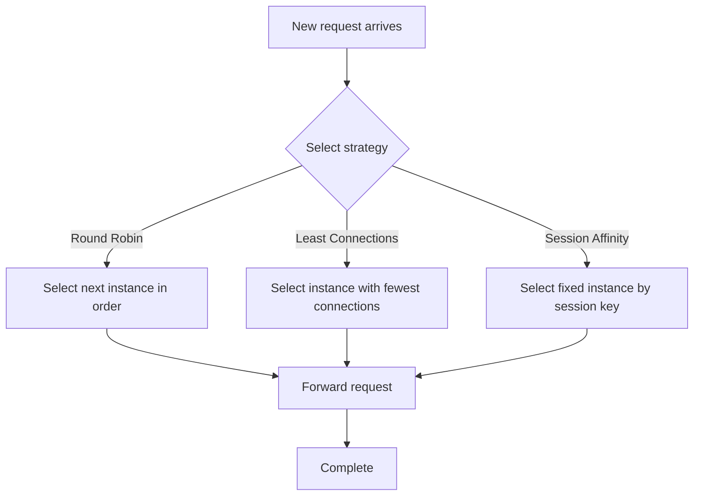
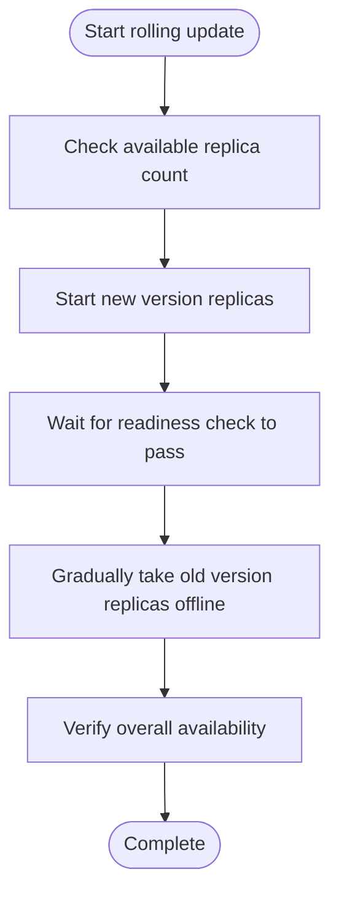
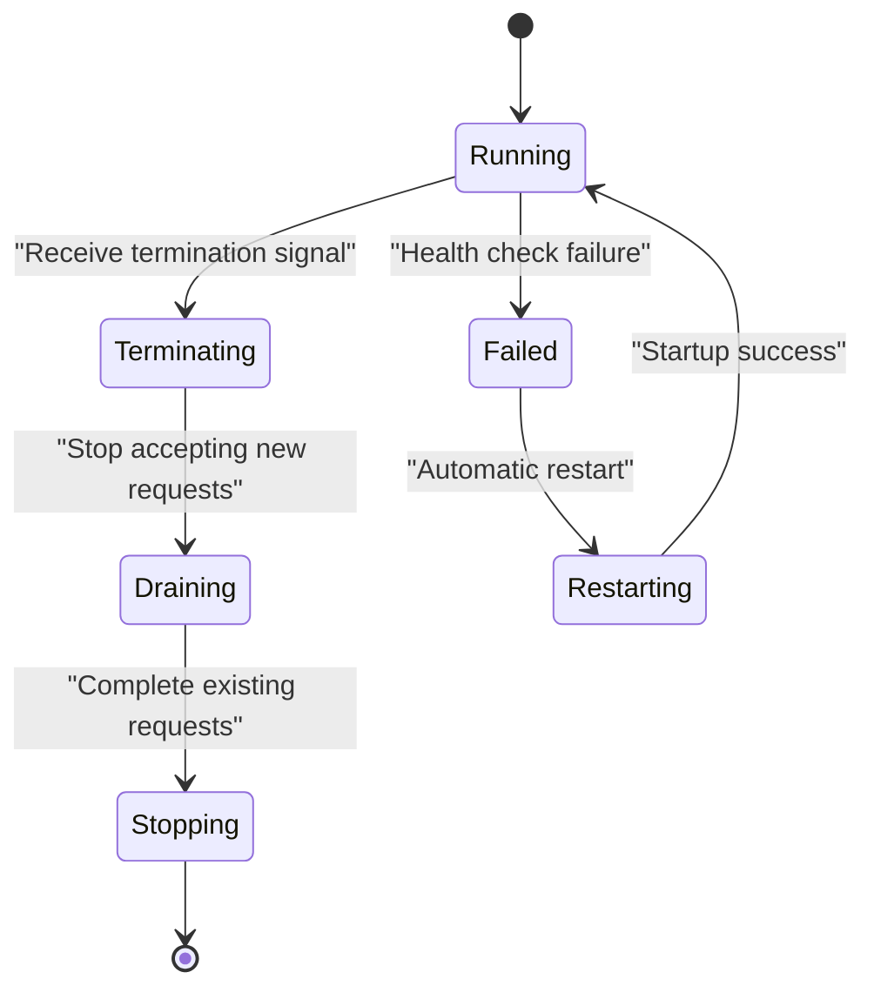
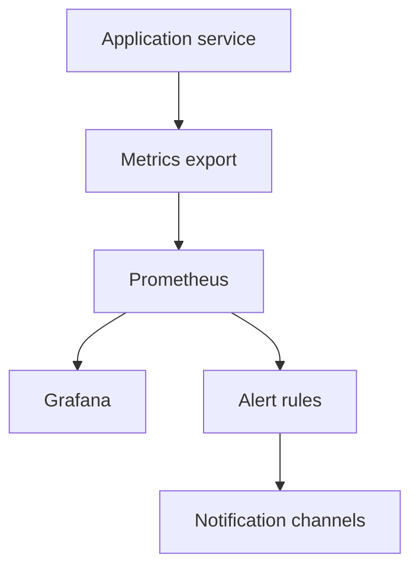
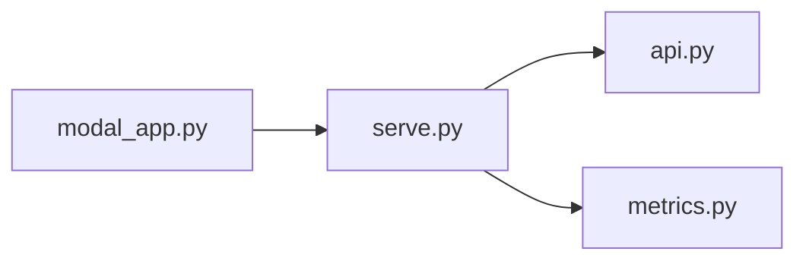

## Table of Contents
1. [Introduction](#introduction)
2. [Project Structure](#project-structure)
3. [Core Components](#core-components)
4. [Architecture Overview](#architecture-overview)
5. [Detailed Component Analysis](#detailed-component-analysis)
6. [Dependency Analysis](#dependency-analysis)
7. [Performance Considerations](#performance-considerations)
8. [Troubleshooting Guide](#troubleshooting-guide)
9. [Conclusion](#conclusion)
10. [Appendix](#appendix)

## Introduction
This document focuses on the topic of "service discovery and health checks", combining the inference service and observability-related code in the repository to systematically review the following capabilities:
- Probe configuration: usage and best practices of HTTP, TCP, and gRPC probes in Kubernetes (conceptual description).
- Load balancing strategies: round-robin, least-connections, and session-affinity configuration approaches.
- Rolling update mechanism: key parameters such as max unavailable, max surge, and readiness delay.
- Failure recovery strategies: automatic restart, graceful termination, and state recovery.
- Monitoring integration: Prometheus metrics export, Grafana dashboards, and alert rules.
- Practical configuration examples: landing recommendations for Ingress, Service Mesh, and distributed tracing.

It should be specifically noted: this repository mainly focuses on model training, evaluation, and the service entrypoint, and does not include a built-in custom health-check endpoint or load-balancing implementation; therefore, the details of probes, load balancing, and rolling updates are primarily based on general cloud-native practices, with cross-references to the repository's service entrypoint and metrics module.

## Project Structure
From the perspective of service-oriented and observability, the core runtime-related locations in the repository include:
- Inference service entrypoint: used to expose HTTP/gRPC interfaces and handle requests.
- Metrics module: provides metric computation logic for evaluation and calibration, which can serve as a reference for extending Prometheus metrics.
- Deployment and run scripts: responsible for startup, scheduling, and observability tasks.

[This diagram is a conceptual diagram and does not directly map to specific source files.]

## Core Components
- Inference service entrypoint
  - serve.py: defines the startup and run flow of the inference service; it is the entrypoint that exposes capabilities externally.
  - api.py: defines API routes and request handling logic, typically corresponding to HTTP interfaces.
- Metrics and observability
  - metrics.py: contains metric computation logic for evaluation and calibration, which can serve as the basis for extending Prometheus metrics.
- Deployment and run
  - modal_app.py: encapsulates the Modal platform's run entrypoint, responsible for orchestrating tasks such as trials, probing, and benchmarking.

**Section sources**
- [serve.py](file://kev/serve.py)
- [api.py](file://kev/api.py)
- [metrics.py:387-387](file://kev/metrics.py#L387-L387)
- [modal_app.py](file://modal_app.py)

## Architecture Overview
The following diagram shows the interaction of service discovery and health checks in a typical cloud-native environment, and how this repository's service and metrics modules plug into platform capabilities.

[This diagram is a conceptual diagram and does not directly map to specific source files.]

## Detailed Component Analysis

### Probe Configuration (HTTP / TCP / gRPC)
- HTTP probe
  - Use case: web services, REST APIs, health pages.
  - Key points: path, port, timeout, interval, success threshold, failure threshold.
  - Recommendation: decouple the health check from the business load to avoid affecting the main chain.
- TCP probe
  - Use case: only verifies port reachability, suitable for non-HTTP services or fast-failure detection.
  - Key points: port, timeout, interval.
- gRPC probe
  - Use case: services based on gRPC, can use grpc_health_probe or a custom Health service.
  - Key points: service name, method, timeout, retry strategy.

[This diagram is a conceptual diagram and does not directly map to specific source files.]

### Load Balancing Strategies (Round Robin / Least Connections / Session Affinity)
- Round Robin
  - Characteristics: evenly distributes, simple and reliable.
  - Suitable for: stateless services, scenarios where request duration is similar.
- Least Connections
  - Characteristics: preferentially selects the instance with the fewest current connections.
  - Suitable for: long connections, scenarios with large differences in request duration.
- Session Affinity (Sticky Session)
  - Characteristics: requests from the same client land on the same instance as much as possible.
  - Suitable for: stateful services, local cache, or session-binding scenarios.

[This diagram is a conceptual diagram and does not directly map to specific source files.]

### Rolling Update Mechanism (Max Unavailable / Max Surge / Readiness Delay)
- Max Unavailable
  - Role: controls the number of replicas allowed to be simultaneously unavailable during the rollout.
  - Recommendation: set based on resource capacity and traffic peaks to avoid avalanche.
- Max Surge
  - Role: controls the number of replicas allowed to temporarily exceed during the rollout.
  - Recommendation: reserve scaling space to ensure the new version goes online before the old version goes offline.
- Readiness Delay
  - Role: wait a period after Pod startup before performing the readiness check, to avoid misjudgment.
  - Recommendation: set reasonably based on cold-start time and model loading time.

[This diagram is a conceptual diagram and does not directly map to specific source files.]

### Failure Recovery Strategies (Automatic Restart / Graceful Termination / State Recovery)
- Automatic restart
  - Triggers: health check failure, process crash, OOM, etc.
  - Note: avoid frequent restarts causing jitter; combine with backoff and circuit breaking.
- Graceful termination
  - Goal: after receiving a termination signal, stop accepting new requests and exit only after completing existing requests.
  - Recommendation: combine with queue consumption, connection pool closure, cache refresh, and other steps.
- State recovery
  - Goal: recover context, sessions, checkpoints, etc. from persistent storage.
  - Recommendation: idempotent initialization, resume from breakpoint, consistency verification.

[This diagram is a conceptual diagram and does not directly map to specific source files.]

### Monitoring Integration (Prometheus / Grafana / Alerts)
- Prometheus metrics export
  - Recommended to expose: request volume, latency distribution, error rate, resource usage, key business metrics.
  - Metric naming: follow a unified prefix and dimension convention for easy aggregation and querying.
- Grafana dashboard
  - Recommended views: overview, SLO/SLI, error hotspots, slow requests, resource water level.
  - Linkage: with alert rules, supporting multi-environment comparison.
- Alert rules
  - Recommended thresholds: sudden error rate spike, rising P95/P99 latency, excessive resource utilization, health-check failure.
  - Notification channels: email, IM, phone, and other multi-channel options.

[This diagram is a conceptual diagram and does not directly map to specific source files.]

### Practical Configuration Examples (Ingress / Service Mesh / Distributed Tracing)
- Ingress configuration
  - Key points: TLS termination, path routing, timeout, rate limiting, canary release.
  - Recommendation: combine with health checks and blue-green/canary release.
- Service Mesh integration
  - Key points: mTLS, traffic mirroring, circuit breaking, retries, timeout, tracing injection.
  - Recommendation: unified governance policy, centralized observability.
- Distributed tracing
  - Key points: TraceID propagation, span granularity, sampling strategy, visualization.
  - Recommendation: correlate with logs and metrics to form full-chain observability.

[This section is a conceptual description and does not directly reference specific source files.]

## Dependency Analysis
- Coupling between service entrypoint and metrics module
  - serve.py, as the service startup entrypoint, usually registers the API routes defined by api.py.
  - metrics.py provides metric computation logic, which can be registered as Prometheus metrics at service startup.
- Run scripts and platform
  - modal_app.py is responsible for orchestrating tasks on the Modal platform, and may indirectly invoke the service entrypoint and metrics module.

**Diagram sources**
- [serve.py](file://kev/serve.py)
- [api.py](file://kev/api.py)
- [metrics.py:387-387](file://kev/metrics.py#L387-L387)
- [modal_app.py](file://modal_app.py)

**Section sources**
- [serve.py](file://kev/serve.py)
- [api.py](file://kev/api.py)
- [metrics.py:387-387](file://kev/metrics.py#L387-L387)
- [modal_app.py](file://modal_app.py)

## Performance Considerations
- Health check frequency and overhead
  - High-frequency checks reduce fault detection latency but increase extra load; balance detection sensitivity against resource consumption.
- Impact of rolling updates on throughput
  - The combination of MaxSurge and MaxUnavailable affects instantaneous throughput and latency; it is recommended to perform rolling updates during off-peak periods.
- Impact of metric collection on performance
  - High-cardinality metrics and high-frequency collection increase Prometheus pressure; it is recommended to downsample, deduplicate, and aggregate.

[This section is general guidance and does not directly analyze specific files.]

## Troubleshooting Guide
- Health check failure
  - Check whether the probe path, port, and protocol are consistent with the API.
  - Review service logs and metrics to locate the root cause of the anomaly.
- Rolling update stuck
  - Check the readiness check logic and delay settings to confirm whether the new version is truly ready.
  - Observe replica status and events to troubleshoot resource shortages or dependency issues.
- Missing or anomalous metrics
  - Confirm the metrics export endpoint is reachable and Prometheus scraping is working.
  - Check whether the metric naming and dimensions meet expectations.

**Section sources**
- [AGENTS.md](file://AGENTS.md)
- [PLAN.md](file://PLAN.md)

## Conclusion
This repository centers on the service entrypoint and metrics module, and combined with the capabilities of the cloud-native platform, can implement a complete service discovery and health check system. Through reasonable probe configuration, load balancing strategies, rolling update parameters, and failure recovery mechanisms, along with Prometheus/Grafana monitoring and alerting, it can ensure high availability and observability of the service. For Ingress, Service Mesh, and distributed tracing, it is recommended to adopt mature industry solutions aligned with the platform's governance capabilities, forming a unified operations and observability system.

## Appendix
- Glossary
  - Probe: a mechanism used to detect the health status of a service.
  - Rolling update: a release method that gradually replaces service instances.
  - Readiness check: a check that determines whether a service is ready to receive traffic.
  - Graceful termination: handling existing requests before the service exits.
  - Metrics export: exposing service runtime data to the monitoring system.

[This section is supplementary and does not directly analyze specific files.]
