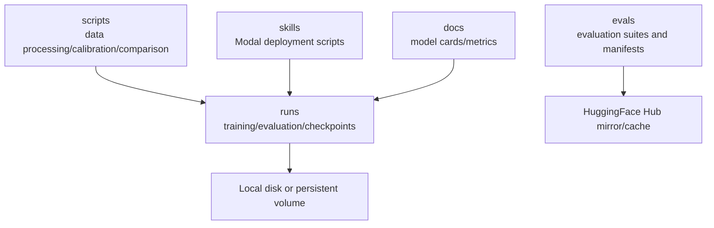
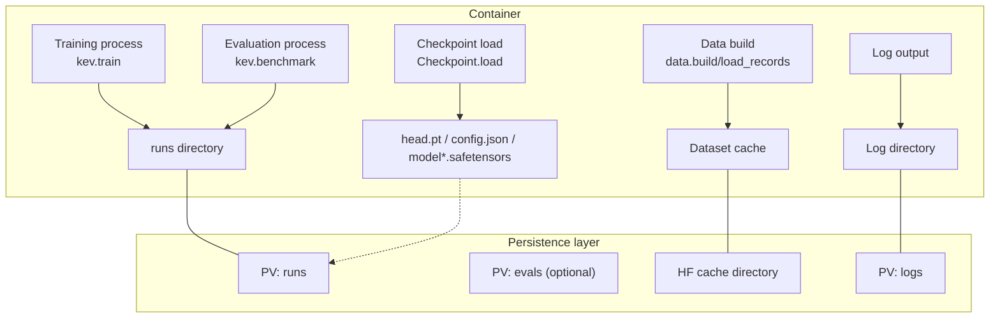
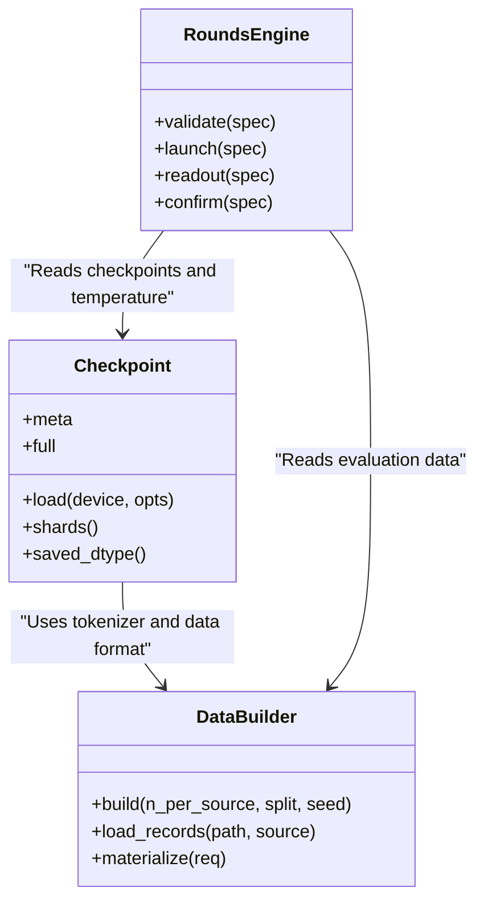

## Table of Contents
1. [Introduction](#introduction)
2. [Project Structure](#project-structure)
3. [Core Components](#core-components)
4. [Architecture Overview](#architecture-overview)
5. [Detailed Component Analysis](#detailed-component-analysis)
6. [Dependency Analysis](#dependency-analysis)
7. [Performance Considerations](#performance-considerations)
8. [Troubleshooting Guide](#troubleshooting-guide)
9. [Conclusion](#conclusion)
10. [Appendix](#appendix)

## Introduction
This document is aimed at engineers deploying Kev training and inference workloads in Kubernetes or container environments, systematically explaining the design and practice of "storage volume mounting". The document covers:
- Persistence strategy: model weights, training data, checkpoints, and evaluation results
- Storage volume type selection and configuration recommendations: HostPath, NFS, cloud storage (S3/GCS)
- Data lifecycle management: backup, cleanup, version control
- Log management: structured logging, rotation, centralized collection
- Storage performance optimization: IOPS, caching, read/write separation
- Practical configuration examples: PVC, StorageClass, dynamic volume provisioning

Kev's codebase primarily uses local paths and the Hugging Face Hub as data sources; training outputs, evaluation results, and checkpoints are written to the local runs directory by default, and are remotely executed and pulled via scripts and the Modal platform. Therefore, production environments should persist runs, dataset cache, Hub cache, and logs to persistent volumes, ensuring recoverability, observability, and portability.

## Project Structure
From a storage perspective, the key directories and their responsibilities are as follows:
- runs: training runs, evaluation results, temperature fitting, and intermediate artifacts
- evals: evaluation suites and manifests, used for frozen dataset references and validation
- scripts: data processing, calibration, comparison, and other utility scripts
- skills: skills and deployment scripts (including Modal deployment related)
- docs: model cards and metric declarations

Diagram sources
- [README.md:282-341](file://README.md#L282-L341)
- [README.md:303-322](file://README.md#L303-L322)

Section sources
- [README.md:282-341](file://README.md#L282-L341)
- [README.md:303-322](file://README.md#L303-L322)

## Core Components
- Checkpoint loader: unified read rules for LoRA adapters and full weights, supporting local paths and Hub repositories, responsible for consistency validation of head.pt, tokenizer, config.json, and safetensors shards
- Data builder: converts public datasets into TypeSafe request format, generates internal records with source, hash, and version information
- Research round orchestration: defines experiment plans, input paths, temperature pools, and evaluation panels, driving the training and evaluation flow on Modal

Section sources
- [checkpoint.py:1-17](file://kev/checkpoint.py#L1-L17)
- [checkpoint.py:168-236](file://kev/checkpoint.py#L168-L236)
- [data.py:1-14](file://kev/data.py#L1-L14)
- [data.py:298-317](file://kev/data.py#L298-L317)
- [rounds.py:1-81](file://kev/rounds.py#L1-L81)

## Architecture Overview
The following diagram shows Kev's typical data flow and storage mount points inside the container:

Diagram sources
- [README.md:282-341](file://README.md#L282-L341)
- [README.md:303-322](file://README.md#L303-L322)
- [checkpoint.py:168-236](file://kev/checkpoint.py#L168-L236)
- [data.py:298-317](file://kev/data.py#L298-L317)

## Detailed Component Analysis

### Persistent Storage Strategy
- Model weight storage
  - Checkpoints contain head.pt, tokenizer, LoRA adapters, or full backbone shards (model*.safetensors). The loader validates weights_dtype, base/base_revision, and file layout consistency
  - It is recommended to mount the runs directory as a high-reliability persistent volume to avoid checkpoint loss due to Pod restarts
- Training data persistence
  - data.build uses the datasets library to load public datasets and records each sample's source, row hash, and text hash, facilitating reproducibility and auditing
  - It is recommended to mount the HF dataset cache directory to a persistent volume to reduce repeated downloads and network jitter
- Check result saving
  - The benchmark and rounds flows write rows.json, metrics, and temperature fitting results to runs subdirectories
  - It is recommended to enable snapshots and incremental backups for runs, retaining a complete evidence chain for each trial

Section sources
- [checkpoint.py:1-17](file://kev/checkpoint.py#L1-L17)
- [checkpoint.py:190-211](file://kev/checkpoint.py#L190-L211)
- [data.py:298-317](file://kev/data.py#L298-L317)
- [README.md:303-322](file://README.md#L303-L322)

### Storage Volume Type Selection and Configuration
- HostPath
  - Use case: single-node debugging, temporary validation
  - Risk: not migratable across nodes, no elastic scaling
  - Recommendation: only for dev machines or CI nodes, not for production
- NFS
  - Use case: multiple Pods sharing read-only datasets, historical runs archives
  - Note: IOPS may become a bottleneck under dense small-file writes; use with caching and batched writes
- Cloud storage (S3/GCS)
  - Use case: large-scale datasets, cross-region replication, long-term archiving
  - Recommendation: use object storage as a cold-data and backup target; still use block storage or high-performance file systems for hot data

### Data Lifecycle Management
- Backup strategy
  - runs: snapshot by trial label and timestamp; keep the most recent N versions and key milestones
  - evals: fix versions of manifest and parquet branches, periodically verify SHA256
  - logs: rotationally archive to object storage, retaining for the compliance period
- Cleanup strategy
  - Delete intermediate artifacts of failed trials (e.g., incomplete rows.json, temporary shards)
  - Clean expired HF caches and old tokenizers to free space
- Version control
  - All runs and evals are version-locked via hashes and manifests; checkpoint meta records metadata such as base, revision, weights_dtype
  - It is recommended to manage StorageClass, PVC, and namespaces in GitOps to ensure environment consistency

Section sources
- [checkpoint.py:190-211](file://kev/checkpoint.py#L190-L211)
- [data.py:298-317](file://kev/data.py#L298-L317)
- [README.md:324-341](file://README.md#L324-L341)

### Log File Management
- Structured logging
  - Recommended to output in JSON format, including fields such as run_id, trial, suite, metric, latency_ms
- Log rotation
  - Rotate based on dual thresholds of size and time; keep the most recent N files and a total capacity cap
- Centralized log collection
  - Mount the log directory to a persistent volume, collected to ELK/Loki by a sidecar or DaemonSet
  - Desensitize sensitive information before sending

### Storage Performance Optimization
- IOPS tuning
  - Prefer high-IOPS block storage for the training phase; reuse the read-only dataset cache during evaluation
- Caching strategy
  - Place HF datasets and tokenizer cache on local SSD or memory disk (tmpfs) to improve first-read speed
- Read/write separation
  - Training writes to runs, evaluation reads from runs; read-only datasets and model weights are mounted via read-only PVC

## Dependency Analysis
Kev's core dependencies revolve around the three elements of "checkpoint—data—orchestration":

Diagram sources
- [checkpoint.py:168-236](file://kev/checkpoint.py#L168-L236)
- [data.py:298-317](file://kev/data.py#L298-L317)
- [rounds.py:1-81](file://kev/rounds.py#L1-L81)

Section sources
- [checkpoint.py:168-236](file://kev/checkpoint.py#L168-L236)
- [data.py:298-317](file://kev/data.py#L298-L317)
- [rounds.py:1-81](file://kev/rounds.py#L1-L81)

## Performance Considerations
- Differences between training and evaluation paths
  - Training: many small files and frequent writes, requiring high IOPS and stable throughput
  - Evaluation: read-dominated, suitable for read-only cache and parallel reads
- Backend and precision
  - Checkpoint loading supports bf16/fp32 paths; serving defaults to bf16 to reduce latency and VRAM usage
- Cache hits
  - The same document asked multiple times can reuse the state cache, reducing repeated computation and I/O

Section sources
- [checkpoint.py:83-146](file://kev/checkpoint.py#L83-L146)
- [README.md:355-383](file://README.md#L355-L383)

## Troubleshooting Guide
- Checkpoint inconsistency
  - Symptom: error on load that weights_dtype and config.json are inconsistent
  - Handling: verify the dtype name in head.pt and config.json, re-export or correct the metadata
- Dataset missing or version drift
  - Symptom: datasets load fails or hash validation mismatch
  - Handling: pin the revision or parquet branch; verify manifest and SHA256
- Temperature fitting anomaly
  - Symptom: temperature value deviates from expected or evaluation metrics are unstable
  - Handling: check whether the temperature pool has mixed in training data; use rounds.validate to validate

Section sources
- [checkpoint.py:267-278](file://kev/checkpoint.py#L267-L278)
- [data.py:298-317](file://kev/data.py#L298-L317)
- [rounds.py:507-578](file://kev/rounds.py#L507-L578)

## Conclusion
By mounting runs, dataset cache, and logs to appropriate persistent volumes, combined with versioning and backup strategies, Kev's training and evaluation can achieve high availability, reproducibility, and observability in container environments. Production deployments are recommended to:
- Use high-performance block storage for training and evaluation
- Use read-only PVCs or object storage for read-only datasets and model weights
- Centrally collect logs with rotation archiving
- Strictly version and hash-validate to ensure data and checkpoint consistency

## Appendix

### Practical Configuration Examples (Conceptual)
- PVC definition
  - Create a dedicated PVC for runs, bound to a high-performance StorageClass
  - Create read-only PVCs for evals and HF cache, shared across multiple Pods
- StorageClass configuration
  - For training: high IOPS, low latency
  - For archiving: low cost, high durability
- Dynamic volume provisioning
  - Use a CSI driver to automatically create and scale volumes
  - Combine Snapshot and Clone for fast trial recovery

[This section is conceptual guidance and does not involve specific code files.]
