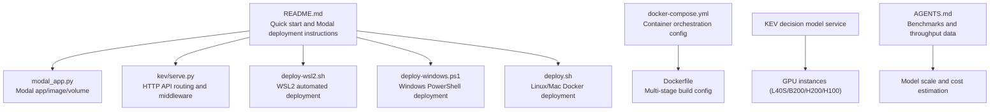
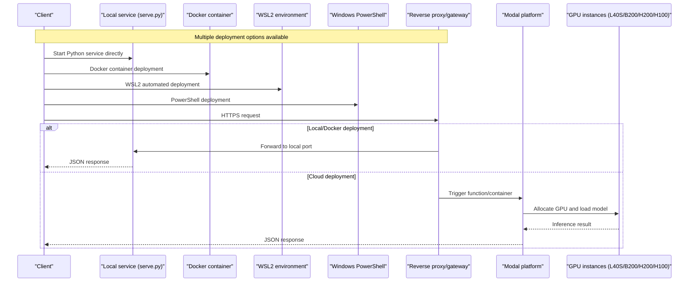
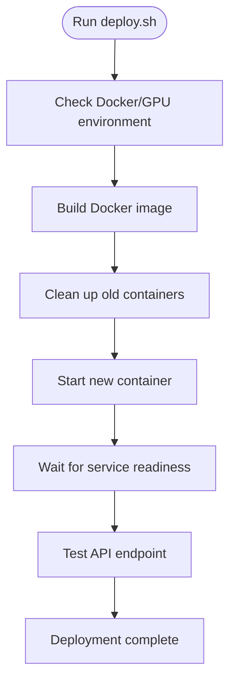
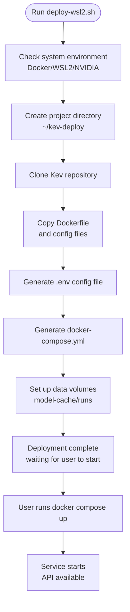
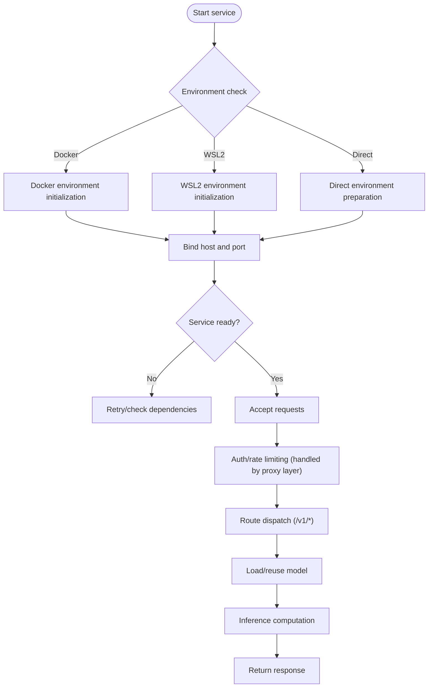
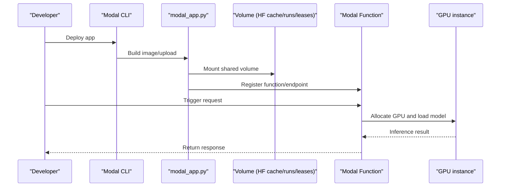
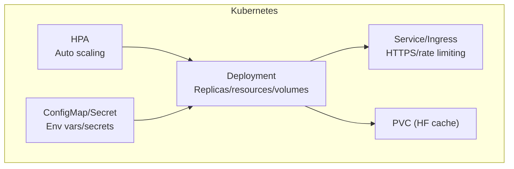
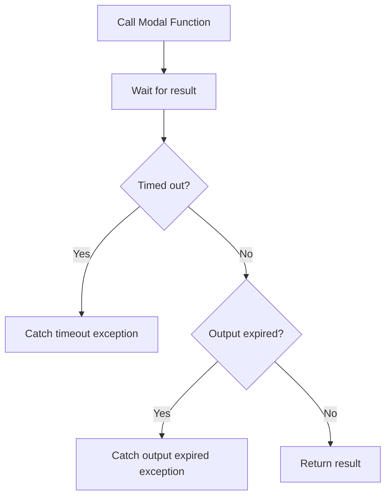
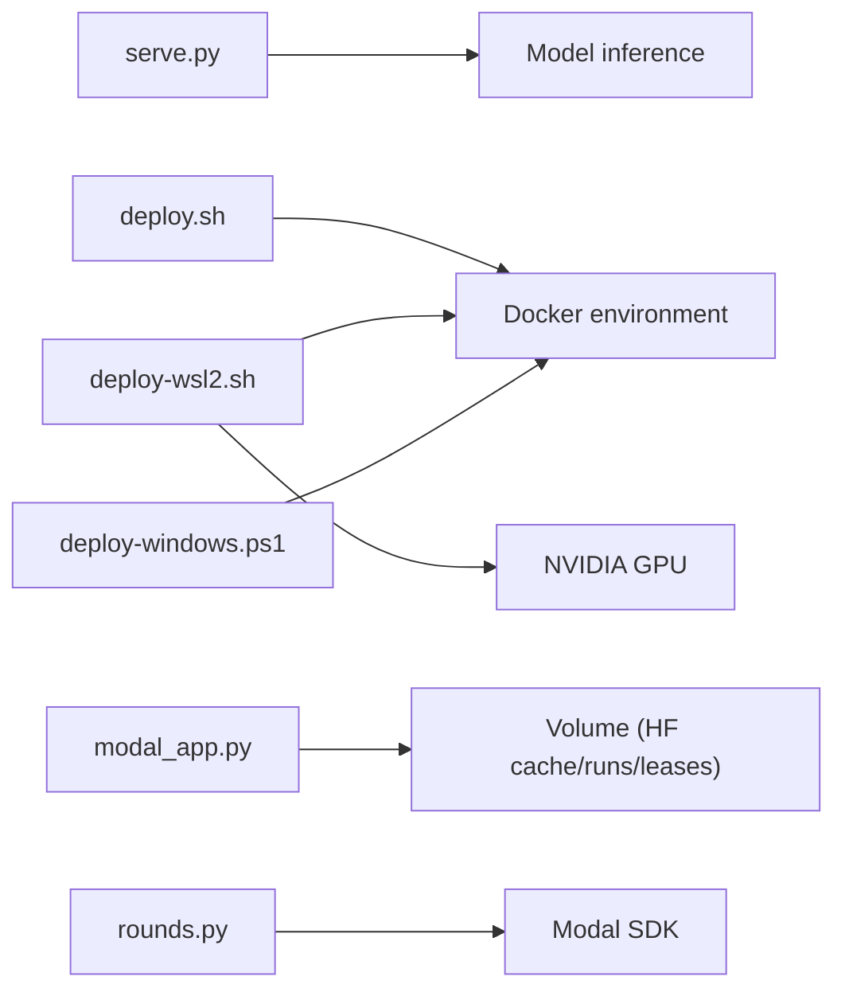

## Update Summary
**Changes Made**
- Added a Docker local deployment section, including one-click deployment scripts and multi-platform support
- Updated the local deployment section to cover three deployment methods: WSL2, Windows PowerShell, and native Docker
- Added Docker Compose orchestration configuration instructions and production optimization parameters
- Expanded containerized deployment options, including image building, volume management, and health checks
- Updated the troubleshooting guide to cover the new Docker deployment methods

## Table of Contents
1. [Introduction](#introduction)
2. [Project Structure](#project-structure)
3. [Core Components](#core-components)
4. [Architecture Overview](#architecture-overview)
5. [Detailed Component Analysis](#detailed-component-analysis)
6. [Dependency Analysis](#dependency-analysis)
7. [Performance and Cost](#performance-and-cost)
8. [Production Environment Configuration](#production-environment-configuration)
9. [Troubleshooting](#troubleshooting)
10. [Conclusion](#conclusion)

## Introduction
This guide is for teams that want to serve Kev and bring it into production. It covers local deployment (WSL2, Windows PowerShell, Docker), cloud deployment (Modal), containerization and orchestration, production high availability and security, monitoring and logging, model scale and hardware selection, HTTPS and access control, as well as troubleshooting and performance tuning. The documentation is based on the existing implementation in the repository, and focuses on the following entry points:
- **Docker local deployment**: Deploy via Docker containerization, supporting GPU acceleration and various runtime environments
- **WSL2 automated deployment**: Automated deployment scripts optimized for Windows users
- **Windows PowerShell deployment**: Native PowerShell-compatible Docker deployment solution
- **Local inference service**: Start an HTTP API via the serve module within the Python package
- **Cloud inference service**: Deploy HTTPS endpoints with one click via a Modal app, with automatic GPU resource selection per model
- **Modal calls in the training/experiment pipeline**: Asynchronously invoke Modal Functions within the rounds pipeline

## Project Structure
Kev's deployment-related code is mainly distributed across the following locations:
- The root-level README provides quick start and Modal deployment instructions
- **New** deploy-wsl2.sh provides an automated deployment experience for WSL2 environments
- **New** deploy-windows.ps1 provides Windows PowerShell-compatible deployment
- **New** deploy.sh provides one-click Docker deployment for Linux/Mac
- modal_app.py defines the Modal app, image, volume mounts, and runtime parameters
- kev/serve.py provides HTTP API routing and middleware
- kev/rounds.py invokes Modal Functions within the experiment pipeline
- AGENTS.md records performance benchmarks and Modal server-side throughput data
- **New** Dockerfile provides multi-stage build configuration
- **New** docker-compose.yml provides container orchestration configuration

**Diagram Sources**
- [README.md:196-208](file://README.md#L196-L208)
- [deploy-wsl2.sh:1-184](file://deploy-wsl2.sh#L1-L184)
- [deploy-windows.ps1:1-134](file://deploy-windows.ps1#L1-L134)
- [deploy.sh:1-288](file://deploy.sh#L1-L288)
- [docker-compose.yml:1-163](file://docker-compose.yml#L1-L163)
- [Dockerfile:1-47](file://Dockerfile#L1-L47)
- [modal_app.py:52-79](file://modal_app.py#L52-L79)
- [serve.py:231-297](file://kev/serve.py#L231-L297)
- [rounds.py:1130-1159](file://kev/rounds.py#L1130-L1159)
- [AGENTS.md:331-366](file://AGENTS.md#L331-L366)

**Section Sources**
- [README.md:196-208](file://README.md#L196-L208)
- [deploy-wsl2.sh:1-184](file://deploy-wsl2.sh#L1-L184)
- [deploy-windows.ps1:1-134](file://deploy-windows.ps1#L1-L134)
- [deploy.sh:1-288](file://deploy.sh#L1-L288)
- [docker-compose.yml:1-163](file://docker-compose.yml#L1-L163)
- [Dockerfile:1-47](file://Dockerfile#L1-L47)
- [modal_app.py:52-79](file://modal_app.py#L52-L79)
- [serve.py:231-297](file://kev/serve.py#L231-L297)
- [rounds.py:1130-1159](file://kev/rounds.py#L1130-L1159)
- [AGENTS.md:331-366](file://AGENTS.md#L331-L366)

## Core Components
- **Docker local deployment**
  - Lightweight image based on Debian Slim + Python 3.13
  - Supports GPU passthrough and automatic CPU-mode detection
  - Provides health checks and automatic restart policies
- **WSL2 automated deployment**
  - One-click initialization of the WSL2 environment, automatically checking Docker and NVIDIA drivers
  - Generates environment variable configuration files and Docker Compose configuration
  - Supports GPU acceleration and automatic CPU-mode detection
- **Windows PowerShell deployment**
  - Fully compatible with the Windows PowerShell environment
  - Automatically detects the Docker and GPU environments
  - Built-in service readiness detection and API testing
- **Local inference service (HTTP API)**
  - Exposes endpoints such as /v1/systemone, /v1/systemone/permute, /v1/systemone/separate
  - Provides /v1/models to query available model information
  - Uses HTTP middleware for request processing
- Modal cloud service
  - Image based on Debian Slim + Python 3.13
  - Mounts HuggingFace cache volumes and runs/leases volumes
  - Selects model and GPU based on environment variables (e.g. KEV_MODEL); different models automatically match L40S/B200/H200/H100
- Modal calls in the experiment pipeline
  - Asynchronously invokes Modal Functions within the rounds pipeline, handling exceptions such as timeouts and result expiration

**Section Sources**
- [Dockerfile:1-47](file://Dockerfile#L1-L47)
- [deploy-wsl2.sh:13-35](file://deploy-wsl2.sh#L13-L35)
- [deploy-windows.ps1:14-25](file://deploy-windows.ps1#L14-L25)
- [serve.py:231-297](file://kev/serve.py#L231-L297)
- [modal_app.py:52-79](file://modal_app.py#L52-L79)
- [rounds.py:1130-1159](file://kev/rounds.py#L1130-L1159)

## Architecture Overview
The diagram below shows the end-to-end path from the client to the backend service, including local Docker deployment, WSL2 deployment, Windows PowerShell deployment, and cloud Modal deployment.

**Diagram Sources**
- [deploy-wsl2.sh:1-184](file://deploy-wsl2.sh#L1-L184)
- [deploy-windows.ps1:1-134](file://deploy-windows.ps1#L1-L134)
- [deploy.sh:1-288](file://deploy.sh#L1-L288)
- [README.md:196-208](file://README.md#L196-L208)
- [modal_app.py:52-79](file://modal_app.py#L52-L79)
- [serve.py:231-297](file://kev/serve.py#L231-L297)

## Detailed Component Analysis

### Docker Local Deployment (New)
**Update** Added a complete Docker local deployment solution

- **Image building**
  - Based on the python:3.13-slim-bookworm base image
  - Single-stage build to avoid network issues
  - Pre-installs core dependencies such as FastAPI, PyTorch, and Transformers
  - Exposes port 8008 and provides health checks
- **Container configuration**
  - Supports GPU passthrough (NVIDIA Container Toolkit)
  - Environment variable configuration (model selection, precision settings, batch size)
  - Volume mounts for model weight persistence
  - Automatic restart policy and health checks
- **One-click deployment script**
  - `deploy.sh` provides the complete deployment flow
  - Automatically checks the GPU environment and dependencies
  - Builds the image, starts the container, and tests the API
  - Supports multiple subcommands (deploy, status, stop, restart, logs, clean)

**Diagram Sources**
- [deploy.sh:202-243](file://deploy.sh#L202-L243)
- [Dockerfile:1-47](file://Dockerfile#L1-L47)

**Section Sources**
- [Dockerfile:1-47](file://Dockerfile#L1-L47)
- [deploy.sh:1-288](file://deploy.sh#L1-L288)

### WSL2 Automated Deployment (New)
**Update** Added a WSL2 deployment solution designed specifically for Windows users

- **Environment preparation**
  - Automatically checks the Docker Desktop and WSL2 environment
  - Detects NVIDIA drivers and GPU availability
  - Validates Docker Compose functionality
- **One-click deployment flow**
  - Creates the project directory structure (`~/kev-deploy`)
  - Clones the Kev repository and copies necessary files
  - Generates the `.env` environment variable configuration file
  - Creates the `docker-compose.yml` orchestration configuration
  - Sets up data persistence volumes (`model-cache`, `runs`)
- **GPU support**
  - Automatically detects the NVIDIA GPU and configures the CUDA device
  - Supports GPU acceleration and automatic CPU-mode switching
  - Integrates Docker Desktop GPU passthrough
- **Production-ready configuration**
  - Pre-configured performance optimization parameters (batch size, CUDA Graphs, fused kernels)
  - Network configuration and security options
  - Health checks and automatic restart policy

**Diagram Sources**
- [deploy-wsl2.sh:13-92](file://deploy-wsl2.sh#L13-L92)
- [deploy-wsl2.sh:94-162](file://deploy-wsl2.sh#L94-L162)

**Section Sources**
- [deploy-wsl2.sh:1-184](file://deploy-wsl2.sh#L1-L184)

### Windows PowerShell Deployment (New)
**Update** Added a native Windows PowerShell deployment script

- **Compatibility support**
  - Fully compatible with the Windows PowerShell environment
  - Supports both Git Bash and native PowerShell
  - Automatically detects the Docker and GPU environments
- **Automation flow**
  - Builds the Docker image and optimizes memory usage
  - Automatically cleans up old containers and starts a new instance
  - Built-in service readiness detection and API testing
- **Interactive experience**
  - Colorized output and progress feedback
  - Automatically tests API endpoints
  - Displays resource usage statistics

**Section Sources**
- [deploy-windows.ps1:1-134](file://deploy-windows.ps1#L1-L134)

### Local Deployment (HTTP Service)
- **Environment preparation**
  - Install the Python environment and dependencies (refer to pyproject.toml and README)
  - Prepare GPU drivers and CUDA (if GPU acceleration is needed)
  - **New** Docker or WSL2 is recommended for the best experience
- **Start the service**
  - Start the serve module via the Python package entry point, listening on the specified host and port
  - **New** Use `./deploy.sh deploy` for one-click Docker deployment
  - **New** Use `wsl bash deploy-wsl2.sh` for WSL2 deployment
  - It is recommended to place it behind a reverse proxy in production (Nginx/Traefik/Cloud LB)
- **Network and security**
  - Expose the service only on an intranet or trusted network
  - Use a reverse proxy to enable TLS (HTTPS), rate limiting, and authentication (API Key/Token)
- **Verify endpoints**
  - Call /v1/models to get the model list
  - Call the /v1/systemone series of endpoints for inference

**Diagram Sources**
- [deploy.sh:202-243](file://deploy.sh#L202-L243)
- [deploy-wsl2.sh:13-35](file://deploy-wsl2.sh#L13-L35)
- [serve.py:231-297](file://kev/serve.py#L231-L297)

**Section Sources**
- [deploy.sh:202-243](file://deploy.sh#L202-L243)
- [deploy-wsl2.sh:13-35](file://deploy-wsl2.sh#L13-L35)
- [serve.py:231-297](file://kev/serve.py#L231-L297)

### Cloud Deployment (Modal Platform)
- Account and permissions
  - Register a Modal account, complete authentication, and apply for quota
- App deployment
  - Use modal_app.py as the app entry point, build the image, and deploy
  - Mount shared volumes: HuggingFace cache, runs, leases
- GPU resource selection
  - Select the model via environment variables (e.g. KEV_MODEL); the platform automatically matches the appropriate GPU (L40S/B200/H200/H100)
- Cost optimization
  - Use the "scale-to-zero when idle" feature to reduce idle costs
  - Set concurrency and batch size reasonably to avoid frequent cold starts

**Diagram Sources**
- [modal_app.py:52-79](file://modal_app.py#L52-L79)
- [README.md:196-208](file://README.md#L196-L208)

**Section Sources**
- [modal_app.py:52-79](file://modal_app.py#L52-L79)
- [README.md:196-208](file://README.md#L196-L208)

### Containerization and Kubernetes Orchestration
- **Docker image**
  - Based on Debian Slim + Python 3.13, installing dependencies on demand
  - Use the serve module as the process entry point, exposing the HTTP port
  - **New** Single-stage build to optimize image size and performance
- **Docker Compose orchestration**
  - Production service configuration (GPU support, resource limits, health checks)
  - Development service configuration (source hot reload, debug support)
  - Network configuration and data volume management
- **Kubernetes orchestration**
  - Deployment: replica count, resource limits (CPU/GPU), volume mounts (HF cache)
  - Service/Ingress: expose HTTPS externally, configure certificates and rate limiting
  - HorizontalPodAutoscaler: scale based on CPU/GPU utilization or custom metrics
  - ConfigMap/Secret: inject environment variables (model name, secrets, etc.)

[This section is a conceptual orchestration description and does not directly map to specific source files]

### Modal Calls in the Experiment Pipeline
- Invoke Modal Functions within the rounds pipeline, handling the following exceptions:
  - Timeout (TimeoutError)
  - Function timeout (FunctionTimeoutError)
  - Output expired (OutputExpiredError)

**Diagram Sources**
- [rounds.py:1130-1159](file://kev/rounds.py#L1130-L1159)

**Section Sources**
- [rounds.py:1130-1159](file://kev/rounds.py#L1130-L1159)

## Dependency Analysis
- **Local service dependencies**
  - HTTP framework and routing (serve.py)
  - Model loading and inference logic (implemented internally by the serve module)
- **Docker deployment dependencies**
  - Docker Engine and Container Runtime
  - NVIDIA Container Toolkit (GPU support)
  - Docker Compose orchestration tool
- **WSL2 deployment dependencies**
  - Docker Desktop and WSL2 environment
  - NVIDIA drivers and GPU support
  - Docker Compose orchestration tool
- **Windows PowerShell deployment dependencies**
  - Docker Desktop for Windows
  - PowerShell 5.1+ or PowerShell Core
  - NVIDIA drivers (GPU support)
- **Modal service dependencies**
  - Modal SDK (image building, volume mounting, function deployment)
  - HuggingFace cache volume (accelerates model downloads)
- **Experiment pipeline dependencies**
  - Modal Function invocation and exception handling (rounds.py)

**Diagram Sources**
- [serve.py:231-297](file://kev/serve.py#L231-L297)
- [deploy.sh:24-60](file://deploy.sh#L24-L60)
- [deploy-wsl2.sh:13-35](file://deploy-wsl2.sh#L13-L35)
- [deploy-windows.ps1:14-25](file://deploy-windows.ps1#L14-L25)
- [modal_app.py:52-79](file://modal_app.py#L52-L79)
- [rounds.py:1130-1159](file://kev/rounds.py#L1130-L1159)

**Section Sources**
- [serve.py:231-297](file://kev/serve.py#L231-L297)
- [deploy.sh:24-60](file://deploy.sh#L24-L60)
- [deploy-wsl2.sh:13-35](file://deploy-wsl2.sh#L13-L35)
- [deploy-windows.ps1:14-25](file://deploy-windows.ps1#L14-L25)
- [modal_app.py:52-79](file://modal_app.py#L52-L79)
- [rounds.py:1130-1159](file://kev/rounds.py#L1130-L1159)

## Performance and Cost
- **Performance benchmarks**
  - Local vs. cloud throughput comparison: refer to the benchmark data in AGENTS.md
  - Modal server-side throughput under high concurrency
  - **New** Docker deployment shows significant performance gains in GPU environments
- **GPU selection and cost**
  - Small models (e.g. Kev-4B) suit L40S/L4
  - Medium models (e.g. Kev-9B) suit H100/H200
  - Large models (e.g. Kev-27B) suit B200/H200/H100
- **Cost optimization strategies**
  - Use Modal's "scale-to-zero" capability to reduce idle costs
  - Set batch size and concurrency reasonably to balance latency and throughput
  - Prewarm commonly used models to reduce cold-start overhead
  - **New** Docker deployment supports CPU mode for development and testing to reduce cost
  - **New** Use Docker volumes to cache model weights and avoid repeated downloads

**Section Sources**
- [AGENTS.md:331-366](file://AGENTS.md#L331-L366)
- [README.md:196-208](file://README.md#L196-L208)
- [deploy-wsl2.sh:24-29](file://deploy-wsl2.sh#L24-L29)
- [deploy.sh:32-60](file://deploy.sh#L32-L60)

## Production Environment Configuration
- **Load balancing**
  - Use a cloud provider LB or Ingress controller for traffic distribution
  - Health checks and graceful shutdown
- **Auto scaling**
  - Based on CPU/GPU utilization or custom metrics (QPS/latency)
  - Set minimum/maximum replica counts to avoid thrashing
- **Monitoring and alerting**
  - Collect QPS, latency, error rate, and GPU utilization
  - Set threshold alerts (e.g. P99 latency, sudden error rate spikes)
- **Log collection**
  - Structured log output, centralized collection (ELK/Loki)
  - Correlate request IDs for easy tracing
- **Security hardening**
  - **New** Docker deployment supports API Key authentication
  - **New** WSL2 deployment supports API Key authentication
  - Network isolation and firewall configuration
  - Regular security updates and vulnerability scanning
- **Containerization best practices**
  - **New** Use multi-stage builds to reduce image size
  - **New** Configure resource limits and memory constraints
  - **New** Enable health checks and automatic restarts
  - **New** Use read-only file systems to improve security

[This section describes general production practices and does not directly map to specific source files]

## Troubleshooting
- **Common issues**
  - Model loading failure: check HF cache volume mount and network connectivity
  - GPU unavailable: confirm driver version and container GPU support
  - Slow cold start: prewarm the model or adjust Modal's minimum instance count
  - **New** Docker environment issues: check the Docker Engine status and NVIDIA Container Toolkit
  - **New** WSL2 environment issues: check the Docker Desktop configuration and WSL2 status
- **Docker-specific issues**
  - **New** Image build failure: check network connectivity and dependency installation
  - **New** GPU not recognized: check NVIDIA drivers and Docker GPU passthrough configuration
  - **New** Port conflict: change the default port or use a different port mapping
  - **New** Out of memory: adjust the MAX_BATCH and KEV_PREFIX_CACHE parameters
- **WSL2-specific issues**
  - **New** Docker not detected: ensure Docker Desktop is started and the WSL2 backend is enabled
  - **New** GPU not recognized: check NVIDIA driver version and Docker GPU passthrough configuration
  - **New** Port conflict: change the default port or use a different port mapping
- **Windows PowerShell-specific issues**
  - **New** PowerShell syntax errors: ensure correct PowerShell syntax is used
  - **New** Docker command failures: check whether Docker Desktop is running
  - **New** GPU detection failures: confirm NVIDIA drivers are installed correctly
- **Debugging steps**
  - Inspect service logs and Modal function logs
  - Narrow down the problem scope step by step (network/dependencies/model/hardware)
  - **New** Use `docker logs -f kev-server` to view Docker deployment logs
  - **New** Use `docker compose logs -f kev-server` to view WSL2 deployment logs
  - **New** Use `docker stats kev-server` to view resource usage
- **Recovery strategies**
  - Restart the Pod/container, roll back to a stable version
  - Switch to a backup GPU type or model
  - **New** Re-run `deploy.sh clean` to clean up the Docker environment
  - **New** Re-run `deploy-wsl2.sh` to reset the WSL2 deployment environment

**Section Sources**
- [modal_app.py:52-79](file://modal_app.py#L52-L79)
- [serve.py:231-297](file://kev/serve.py#L231-L297)
- [deploy-wsl2.sh:17-35](file://deploy-wsl2.sh#L17-L35)
- [deploy.sh:24-60](file://deploy.sh#L24-L60)
- [deploy-windows.ps1:14-25](file://deploy-windows.ps1#L14-L25)

## Conclusion
Kev provides flexible deployment options: the **newly added Docker local deployment** offers an out-of-the-box experience for various environments, combined with WSL2 automated deployment, Windows PowerShell support, and Modal cloud elastic scaling. With reasonable GPU selection, containerized orchestration, and production-grade security and monitoring configuration, costs can be controlled while ensuring performance. It is recommended to combine monitoring and alerting during the canary release phase, gradually expanding traffic to ensure stability and user experience.

**Recommended deployment flow**:
1. **First deployment**: Use `deploy.sh` for quick Docker deployment
2. **Windows users**: Use `deploy-wsl2.sh` for WSL2 automated deployment
3. **PowerShell users**: Use `deploy-windows.ps1` for native PowerShell deployment
4. **Production environment**: Combine Kubernetes orchestration and a monitoring system
5. **Cloud scaling**: Use Modal for elastic deployment and cost optimization
