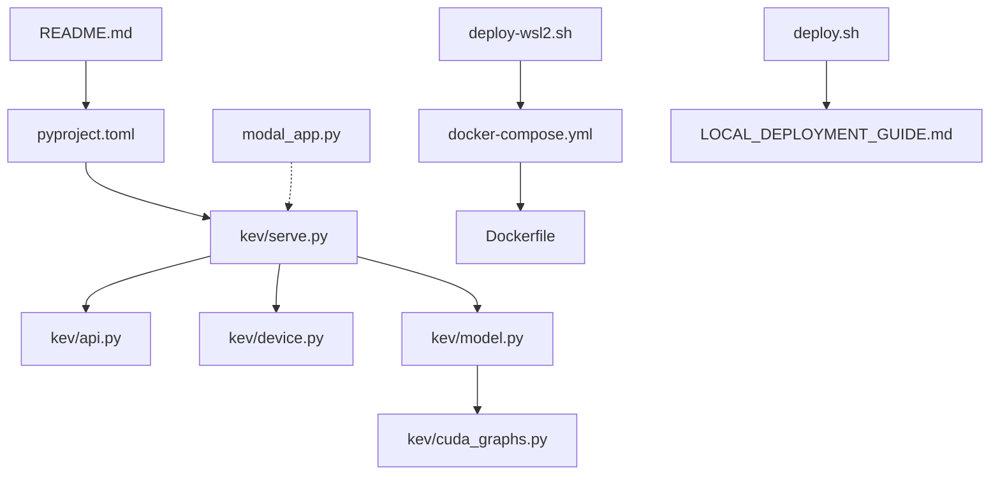
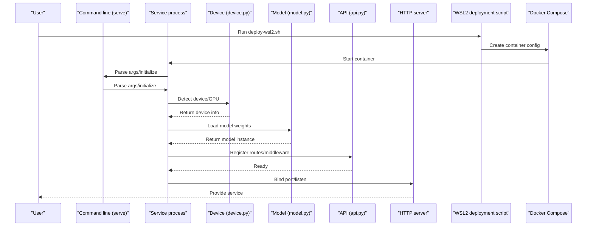
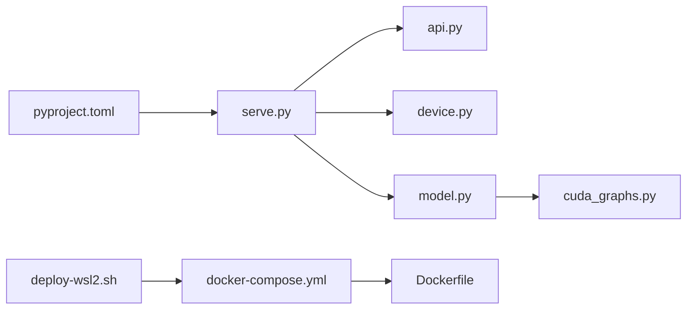

## Update Summary
**Changes**
- Added WSL2 automated deployment script support
- Enhanced the Docker Compose configuration to support GPU passthrough
- Simplified the Dockerfile build process
- Improved the deployment scripts and environment verification mechanism

## Table of Contents
1. [Introduction](#introduction)
2. [Project Structure](#project-structure)
3. [Core Components](#core-components)
4. [Architecture Overview](#architecture-overview)
5. [Detailed Component Analysis](#detailed-component-analysis)
6. [Dependency Analysis](#dependency-analysis)
7. [Performance Considerations](#performance-considerations)
8. [Troubleshooting Guide](#troubleshooting-guide)
9. [Conclusion](#conclusion)

## Introduction
This guide is for users who want to deploy the Kev service in a local environment, covering environment preparation, dependency installation, service startup, network and security configuration, common issues, and performance tuning. Kev provides a Python package and command-line entry point, supporting the launch of the inference service via the serve subcommand; it also includes key modules such as API routing, device and CUDA graph optimization. The **newly added WSL2 automated deployment script** provides a one-click deployment experience for Windows users.

## Project Structure
- The top-level README provides an overview and usage instructions.
- pyproject.toml defines the Python version constraints and dependencies, and is the key basis for local environment preparation.
- kev/serve.py provides the service startup logic (command-line arguments, port, model loading, etc.).
- kev/api.py exposes HTTP API routing and request handling.
- kev/device.py is responsible for device selection and GPU/CPU detection.
- kev/model.py encapsulates model loading and inference flow.
- kev/cuda_graphs.py provides CUDA Graph-related optimization capabilities.
- modal_app.py is the cloud Modal deployment entry point and is not required for local deployment.
- **deploy-wsl2.sh** newly added WSL2 automated deployment script.
- **docker-compose.yml** enhanced container orchestration configuration.
- **Dockerfile** simplified single-stage build configuration.



Diagram Sources
- [README.md:1-50](file://README.md#L1-L50)
- [pyproject.toml:1-80](file://pyproject.toml#L1-L80)
- [serve.py:1-120](file://kev/serve.py#L1-L120)
- [api.py:1-120](file://kev/api.py#L1-L120)
- [device.py:1-80](file://kev/device.py#L1-L80)
- [model.py:1-120](file://kev/model.py#L1-L120)
- [cuda_graphs.py:1-80](file://kev/cuda_graphs.py#L1-L80)
- [modal_app.py:1-60](file://modal_app.py#L1-L60)
- [deploy-wsl2.sh:1-184](file://deploy-wsl2.sh#L1-L184)
- [docker-compose.yml:1-163](file://docker-compose.yml#L1-L163)
- [Dockerfile:1-47](file://Dockerfile#L1-L47)
- [deploy.sh:1-288](file://deploy.sh#L1-L288)
- [LOCAL_DEPLOYMENT_GUIDE.md:1-364](file://LOCAL_DEPLOYMENT_GUIDE.md#L1-L364)

Section Sources
- [README.md:1-50](file://README.md#L1-L50)
- [pyproject.toml:1-80](file://pyproject.toml#L1-L80)

## Core Components
- Service launcher: serve.py parses command-line arguments, initializes logging, loads the model, and starts the HTTP service.
- API routing: api.py defines interface paths, request validation, and response formats.
- Device management: device.py detects available GPU/CPU and sets environment variables and device context.
- Model encapsulation: model.py unifies model loading, caching, and inference invocation.
- CUDA graph optimization: cuda_graphs.py enables CUDA Graphs on supported hardware to improve throughput.
- Dependencies and environment: pyproject.toml declares the Python version and third-party library dependencies.
- **WSL2 deployment script**: deploy-wsl2.sh provides a one-click deployment experience for Windows + WSL2 + Docker Desktop.
- **Container orchestration**: docker-compose.yml defines container configurations for production and development environments.
- **Image building**: Dockerfile provides an optimized single-stage build configuration.

Section Sources
- [serve.py:1-120](file://kev/serve.py#L1-L120)
- [api.py:1-120](file://kev/api.py#L1-L120)
- [device.py:1-80](file://kev/device.py#L1-L80)
- [model.py:1-120](file://kev/model.py#L1-L120)
- [cuda_graphs.py:1-80](file://kev/cuda_graphs.py#L1-L80)
- [pyproject.toml:1-80](file://pyproject.toml#L1-L80)
- [deploy-wsl2.sh:1-184](file://deploy-wsl2.sh#L1-L184)
- [docker-compose.yml:1-163](file://docker-compose.yml#L1-L163)
- [Dockerfile:1-47](file://Dockerfile#L1-L47)

## Architecture Overview
Local deployment adopts a "command-line entry point + HTTP service" architecture: the user starts the service via the command line, and the service internally loads the model and exposes the API externally. The device layer is responsible for GPU/CPU selection, and CUDA graph optimization is used to improve inference performance. The **newly added WSL2 deployment script** provides automated environment preparation and container orchestration for Windows users.



Diagram Sources
- [serve.py:1-120](file://kev/serve.py#L1-L120)
- [device.py:1-80](file://kev/device.py#L1-L80)
- [model.py:1-120](file://kev/model.py#L1-L120)
- [api.py:1-120](file://kev/api.py#L1-L120)
- [deploy-wsl2.sh:1-184](file://deploy-wsl2.sh#L1-L184)
- [docker-compose.yml:1-163](file://docker-compose.yml#L1-L163)

## Detailed Component Analysis

### Environment and Dependency Preparation
- Python version: Use the minimum version defined in pyproject.toml (>=3.12,<3.14).
- CUDA drivers and GPU: Install the CUDA driver matching PyTorch; if using CUDA graph optimization, ensure the GPU architecture and driver version meet the requirements.
- Dependency installation: It is recommended to use uv or pip to install project dependencies; uv can speed up dependency resolution and installation.
- Environment variables: Depending on the behavior of device.py and model.py, you may need to set variables such as CUDA_VISIBLE_DEVICES and PYTORCH_CUDA_ALLOC_CONF to control memory allocation and visible devices.

**New WSL2 deployment method**
- Prerequisite checks: Automatically detect dependencies such as Docker, NVIDIA drivers, and Docker Compose.
- Environment verification: Validate the system environment and display detailed check results.
- Directory structure: Automatically create the ~/kev-deploy project directory and necessary subdirectories.
- Configuration file generation: Automatically generate the .env environment variable file and docker-compose.yml configuration.

Recommended steps
- Confirm the Python version meets the pyproject.toml requirements.
- Install the CUDA driver and cuDNN, and verify nvidia-smi and torch.cuda.is_available().
- Run dependency installation in the project root directory:
  - Using uv: uv sync or uv pip install -e .
  - Using pip: pip install -e .
- If you need to limit visible GPUs, set the environment variable and restart the service.

**Section Sources**
- [pyproject.toml:1-80](file://pyproject.toml#L1-L80)
- [device.py:1-80](file://kev/device.py#L1-L80)
- [model.py:1-120](file://kev/model.py#L1-L120)
- [deploy-wsl2.sh:13-35](file://deploy-wsl2.sh#L13-L35)

### WSL2 Automated Deployment Flow

**New feature**: The deploy-wsl2.sh script provides a complete WSL2 environment deployment experience

#### Environment Verification and Preparation
The script first performs system environment checks:
- Docker installation verification
- NVIDIA GPU detection (nvidia-smi)
- Docker Compose availability check
- Display detailed system information and check results

#### Project Directory Structure Creation
Automatically create the following directory structure:
- ~/kev-deploy: main project directory
- ~/kev-deploy/model-cache: model weight cache directory
- ~/kev-deploy/runs: run logs and status directory
- Clone the kev repository into the project directory

#### Automatic Configuration File Generation
Generate two key configuration files:

**.env environment variable file**:
```bash
KEV_MODEL=jaredpalmer/kev-4b
KEV_DTYPE=bf16
KEV_PREFIX_CACHE=4
CUDA_VISIBLE_DEVICES=0
MAX_BATCH=64
KEV_CUDA_GRAPHS=1
KEV_FUSED=1
HOST=0.0.0.0
PORT=8008
```

**docker-compose.yml container orchestration configuration**:
- Define the kev-server service
- Configure NVIDIA GPU runtime support
- Set port mapping 8008:8008
- Mount persistent volumes (model-cache, runs)
- Configure health checks and automatic restart policy

#### Deployment Startup Flow
```bash
# Execute in PowerShell or CMD
cd 
wsl bash deploy-wsl2.sh

# Enter the deployment directory
cd ~/kev-deploy

# Start the service
docker compose up -d --build

# View logs
docker compose logs -f kev-server
```

**Section Sources**
- [deploy-wsl2.sh:1-184](file://deploy-wsl2.sh#L1-L184)
- [docker-compose.yml:1-163](file://docker-compose.yml#L1-L163)

### Service Startup Flow
- Command-line entry point: Start the service via the serve subcommand, supporting parameters such as port, model path, and device selection.
- Configuration file: If a YAML/JSON configuration exists, its path can be passed via a command-line argument; otherwise the default configuration is used.
- Port setting: The default port can be overridden on the command line; the service will bind successfully when the port is free.
- Startup order: Parse arguments → initialize logging → detect device → load model → register API → start HTTP server.

Common parameters (examples)
- --port or -p: specify the listening port
- --model-path or -m: model weight directory or repository identifier
- --device or -d: select cpu/gpu or a specific GPU ID
- --config: configuration file path (if it exists)

**Section Sources**
- [serve.py:1-120](file://kev/serve.py#L1-L120)
- [api.py:1-120](file://kev/api.py#L1-L120)

### Network Configuration
- Local access address: Listens on 127.0.0.1 by default; if LAN access is needed, the port must be opened at the reverse proxy or firewall level.
- Firewall settings: Allow the service port (e.g. 8000), and only allow trusted IPs to access it.
- HTTPS certificate: The service itself may not have built-in TLS; it is recommended to use a reverse proxy such as Nginx/Traefik to provide HTTPS and certificate management.

**WSL2-specific configuration**
- Port mapping: The Docker Compose configuration maps the container's 8008 port to the host's 8008 port
- Network mode: Use bridge network mode to facilitate communication between containers
- Cross-platform access: Supports direct access to the service in WSL2 from the Windows host

**Section Sources**
- [serve.py:1-120](file://kev/serve.py#L1-L120)
- [docker-compose.yml:120-122](file://docker-compose.yml#L120-L122)

### Security Settings
- API key management: It is recommended to implement authentication at the reverse proxy layer (e.g. Token validation, OAuth), or add authentication middleware at the API layer.
- Access control: Combine firewall whitelists with the reverse proxy's IP whitelist strategy.
- Request limits: Apply rate limiting and connection limits via the reverse proxy or gateway to prevent abuse.

**WSL2 security configuration**
- Environment variable protection: Manage sensitive configuration via the .env file to avoid hardcoding
- Container isolation: Docker containers provide an additional security isolation layer
- Least privilege: Run a minimal-privilege service account inside the container

**Section Sources**
- [api.py:1-120](file://kev/api.py#L1-L120)
- [deploy-wsl2.sh:84-86](file://deploy-wsl2.sh#L84-L86)

### Performance Tuning
- CUDA graph optimization: Enable the optimization provided by cuda_graphs.py on supported GPUs to reduce kernel launch overhead and improve throughput.
- Memory optimization: Adjust the PYTORCH_CUDA_ALLOC_CONF parameter to avoid fragmentation; set batch size and sequence length reasonably.
- Concurrency and threads: Adjust worker processes and thread counts based on CPU/GPU resources to avoid contention.
- I/O and caching: Prewarm the model and reuse sessions to reduce repeated loading and initialization overhead.

**WSL2 performance optimization**
- GPU passthrough: Achieve near-native performance via the NVIDIA Container Runtime
- Memory management: Set a reasonable memory limit (16G) in the Docker Compose configuration
- Cache optimization: Persist the model cache directory to avoid repeated downloads
- Batch tuning: MAX_BATCH=64 suits most scenarios and can be adjusted based on hardware

**Section Sources**
- [cuda_graphs.py:1-80](file://kev/cuda_graphs.py#L1-L80)
- [model.py:1-120](file://kev/model.py#L1-L120)
- [deploy-wsl2.sh:76-78](file://deploy-wsl2.sh#L76-L78)
- [docker-compose.yml:34-36](file://docker-compose.yml#L34-L36)

## Dependency Analysis
- serve.py depends on api.py, device.py, and model.py to complete service assembly.
- model.py depends on cuda_graphs.py to enable GPU optimization.
- pyproject.toml centrally manages the Python version and third-party dependencies to ensure environment consistency.
- **deploy-wsl2.sh depends on docker-compose.yml and Dockerfile to complete container orchestration**.
- **docker-compose.yml depends on Dockerfile to define the container build process**.



Diagram Sources
- [serve.py:1-120](file://kev/serve.py#L1-L120)
- [api.py:1-120](file://kev/api.py#L1-L120)
- [device.py:1-80](file://kev/device.py#L1-L80)
- [model.py:1-120](file://kev/model.py#L1-L120)
- [cuda_graphs.py:1-80](file://kev/cuda_graphs.py#L1-L80)
- [pyproject.toml:1-80](file://pyproject.toml#L1-L80)
- [deploy-wsl2.sh:1-184](file://deploy-wsl2.sh#L1-L184)
- [docker-compose.yml:1-163](file://docker-compose.yml#L1-L163)
- [Dockerfile:1-47](file://Dockerfile#L1-L47)

Section Sources
- [serve.py:1-120](file://kev/serve.py#L1-L120)
- [pyproject.toml:1-80](file://pyproject.toml#L1-L80)

## Performance Considerations
- Hardware requirements: Different model scales have different memory requirements; small models (e.g. 0.8B/4B) can usually run on lower-memory devices, while large models (e.g. 9B/27B) require higher memory and bandwidth.
- Inference optimization: Prioritize enabling CUDA graph optimization; set batch size, max sequence length, and sampling parameters such as temperature reasonably.
- Monitoring and metrics: Record latency, throughput, memory usage, and error rate, and tune continuously.

**WSL2 performance benchmark reference**
- L40S GPU: Kev-4B short-text inference ~41.5ms, with 64 concurrent clients reaching 51.4 req/s
- H100 GPU: Kev-4B short-text inference ~18.1ms, with 64 concurrent clients reaching 100.8 req/s
- CPU mode: Kev-4B short-text inference ~500ms, with concurrency ~5 req/s

**Section Sources**
- [LOCAL_DEPLOYMENT_GUIDE.md:300-308](file://LOCAL_DEPLOYMENT_GUIDE.md#L300-L308)

## Troubleshooting Guide
- Unable to detect GPU: Check that the CUDA driver matches the PyTorch version; confirm nvidia-smi works; set CUDA_VISIBLE_DEVICES if necessary.
- Out of memory: Reduce batch size and sequence length; enable memory optimization options; use a smaller model or a quantized version.
- Port occupied: Change the port or terminate the occupying process; check system firewall rules.
- Model loading failure: Confirm the model path is correct and permissions are sufficient; check whether the network download source is reachable.
- Service exits immediately after startup: View the log output to locate the exception stack; gradually disable optimization features (such as CUDA graphs) to pinpoint the problem.

**WSL2-specific troubleshooting**
- Docker not installed: Install Docker Desktop for Windows and ensure the WSL2 backend is enabled
- NVIDIA GPU not recognized: Check the NVIDIA driver installation and confirm nvidia-smi is available in WSL2
- Container startup failure: View docker compose logs -f kev-server for detailed error messages
- Port conflict: Modify the port mapping in docker-compose.yml or use netstat to find the occupying process
- Slow model download: Pre-download the model to the local cache directory, or accelerate the download via a proxy

**Section Sources**
- [device.py:1-80](file://kev/device.py#L1-L80)
- [model.py:1-120](file://kev/model.py#L1-L120)
- [serve.py:1-120](file://kev/serve.py#L1-L120)
- [LOCAL_DEPLOYMENT_GUIDE.md:236-297](file://LOCAL_DEPLOYMENT_GUIDE.md#L236-L297)

## Conclusion
By following this guide, you can quickly set up the Kev service in a local environment: prepare the Python and CUDA environment, install dependencies, start the service, and configure networking and security. The **newly added WSL2 automated deployment script** provides an out-of-the-box deployment experience for Windows users, supporting one-click environment preparation, container orchestration, and GPU passthrough. Combined with CUDA graph optimization and reasonable parameter tuning, you can achieve a stable and efficient inference experience. If you encounter problems, please refer to the troubleshooting section for step-by-step diagnosis.

**Recommended deployment flow**:
1. **First deployment**: Use the `deploy-wsl2.sh` script to initialize the WSL2 environment with one click
2. **Start the service**: `docker compose up -d --build`
3. **Verify functionality**: Test the API endpoints and service health status
4. **Daily operations**: View logs, monitor health status, and periodically update the image

**Maintainer**: Kev Team
**Last updated**: 2026-10-02
**License**: Apache-2.0
