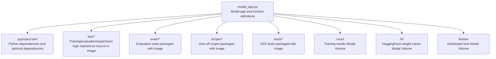
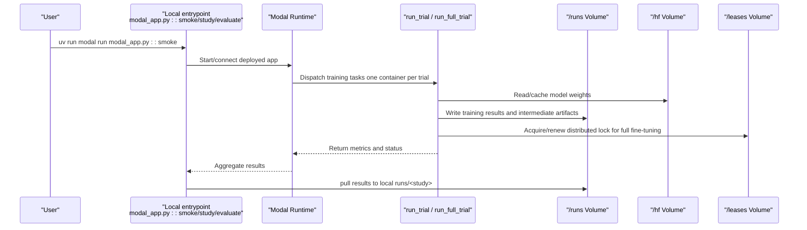
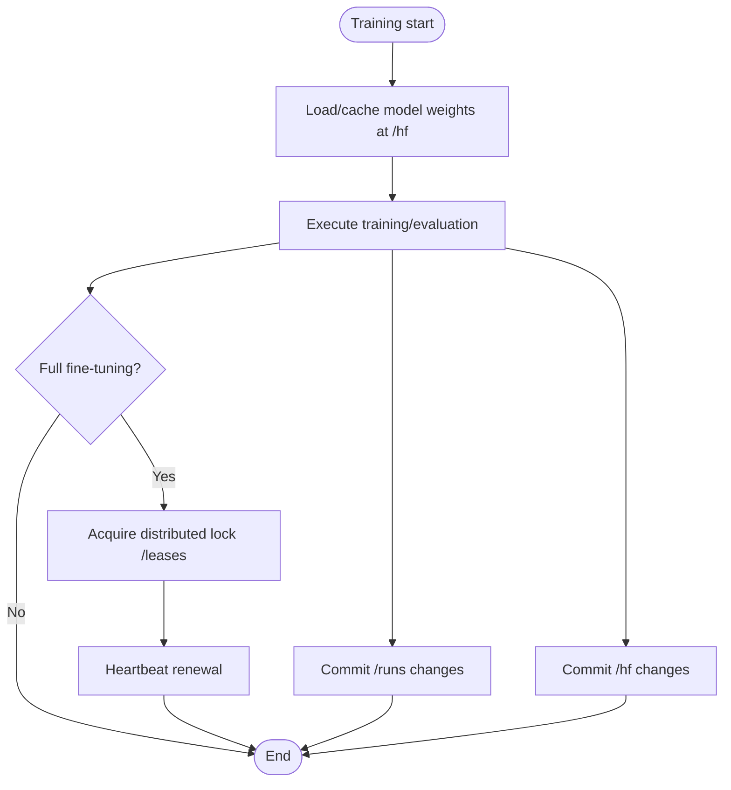
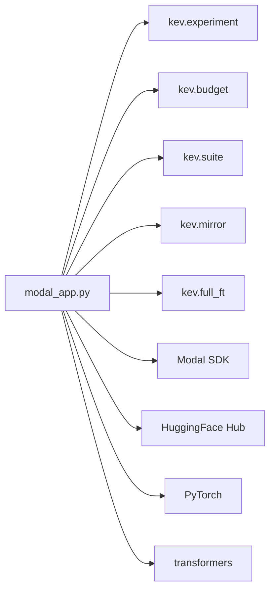

## Table of Contents
1. [Introduction](#introduction)
2. [Project Structure](#project-structure)
3. [Core Components](#core-components)
4. [Architecture Overview](#architecture-overview)
5. [Detailed Component Analysis](#detailed-component-analysis)
6. [Dependency Analysis](#dependency-analysis)
7. [Performance and Resource Optimization Suggestions](#performance-and-resource-optimization-suggestions)
8. [Troubleshooting Guide](#troubleshooting-guide)
9. [Conclusion](#conclusion)
10. [Appendix: Quick Reference of Common Deployment Commands](#appendix-quick-reference-of-common-deployment-commands)

## Introduction
This document is aimed at research and engineering personnel running Kev training, evaluation, and publishing flows on Modal, focusing on the following objectives:
- Explain the key configuration items of `modal_app.py`: app name, GPU type selection, and container image build parameters.
- Describe the dependency management strategy: Python version, PyTorch/CUDA version, the transformers library, and custom package installation methods.
- Document Volume mounting: model weight cache, training result storage, and distributed locks.
- Provide concrete deployment commands: smoke tests, parallel training launch, and resource allocation configuration.
- Offer performance optimization suggestions: container count limits, timeout settings, and memory configuration tuning.

## Project Structure
The Modal app entry point is `modal_app.py` at the repository root, which organizes training, evaluation, image building, Volume mounting, and the local entrypoint via Modal App/Functions; dependency declarations are in `pyproject.toml`.

**Diagram sources**
- [modal_app.py:38-83](file://modal_app.py#L38-L83)
- [modal_app.py:53-75](file://modal_app.py#L53-L75)
- [modal_app.py:76-83](file://modal_app.py#L76-L83)

**Section sources**
- [modal_app.py:1-19](file://modal_app.py#L1-L19)
- [modal_app.py:38-83](file://modal_app.py#L38-L83)
- [pyproject.toml:1-62](file://pyproject.toml#L1-L62)

## Core Components
- App and image
  - The app name is controlled by an environment variable, defaulting to `kev-research`.
  - The image is based on Debian Slim + Python 3.13, uses uv to sync pinned dependencies, and additionally installs CUDA-related packages such as flash-linear-attention, triton, and causal-conv1d.
- GPU and resources
  - The default GPU is `H100`, switchable via `KEV_GPU` to `T4` (free tier) or `H200`.
  - The training function allows a maximum of 24 concurrent containers, timeouts of several hours, and dynamically adjusts memory per task.
- Volume mounting
  - `/hf`: HuggingFace weights and Triton compilation cache.
  - `/runs`: training results, evaluation outputs, snapshots, and final checkpoints.
  - `/leases`: distributed lock for full fine-tuning attempts.
- Local entrypoints
  - `smoke`, `study`, `evaluate`, `base_probe`, `benchmarks`, `serving`, `gpu_tests`, `pull`, `locked_test`, `resume`, etc.

**Section sources**
- [modal_app.py:38-83](file://modal_app.py#L38-L83)
- [modal_app.py:96-116](file://modal_app.py#L96-L116)
- [modal_app.py:179-180](file://modal_app.py#L179-L180)
- [modal_app.py:245-266](file://modal_app.py#L245-L266)
- [modal_app.py:287-292](file://modal_app.py#L287-L292)
- [modal_app.py:318-320](file://modal_app.py#L318-L320)
- [modal_app.py:383-389](file://modal_app.py#L383-L389)
- [modal_app.py:565-578](file://modal_app.py#L565-L578)
- [modal_app.py:612-629](file://modal_app.py#L612-L629)
- [modal_app.py:1073-1078](file://modal_app.py#L1073-L1078)
- [modal_app.py:1232-1266](file://modal_app.py#L1232-L1266)

## Architecture Overview
The following diagram shows the key call path from the local CLI to the Modal container, including training, evaluation, result pulling, and the distributed lock.

**Diagram sources**
- [modal_app.py:96-116](file://modal_app.py#L96-L116)
- [modal_app.py:118-176](file://modal_app.py#L118-L176)
- [modal_app.py:1258-1266](file://modal_app.py#L1258-L1266)
- [modal_app.py:1041-1063](file://modal_app.py#L1041-L1063)

## Detailed Component Analysis

### Configuration Options and Environment Variables
- APP_NAME
  - Overridden via `KEV_APP_NAME`, default `kev-research`.
  - Used to isolate Modal Apps across different research environments.
- GPU type
  - Specified via `KEV_GPU`, default `H100`; the free tier can use `T4`; large tasks can use `H200`.
  - The `gpu=` parameter of all Functions uses this value.
- Workspaces and mounts
  - `RUNS_MOUNT="/runs"`, `HF_MOUNT="/hf"`, `LEASES_MOUNT="/leases"`.
  - The three Volumes correspond to training results, HF weight cache, and distributed lock respectively.
- Secret
  - If `KEV_HF_SECRET` is set, the Secret name is injected into the image environment and mounted when access to gated models is needed.

**Section sources**
- [modal_app.py:38-50](file://modal_app.py#L38-L50)
- [modal_app.py:53-83](file://modal_app.py#L53-L83)

### Container Image Build Parameters
- Base image
  - `modal.Image.debian_slim(python_version="3.13")`.
- System dependencies
  - Install git.
- Python dependencies
  - Use `uv_sync(uv_project_dir=ROOT, groups=[], extras=["serve"])` to sync pinned dependencies, including the serve optional dependency.
  - Additional installs:
    - `flash-linear-attention==0.5.2`
    - `triton>=3.7.1`
    - `causal-conv1d` pre-compiled wheel (matching torch 2.8 / CUDA 12 / Python 3.13), with `--no-deps` to avoid falling back to an older triton version.
    - `pytest` (for GPU testing).
- Source and data
  - Inject local `kev` source, `uv.lock`, `pyproject.toml`, `evals`, `scripts`, `tests`, and specific experiment config files.
- Environment variables
  - `HF_HOME`, `HF_HUB_DISABLE_PROGRESS_BARS`, `TOKENIZERS_PARALLELISM=false`, `PYTHONUNBUFFERED=1`, `TRITON_CACHE_DIR`, `KEV_APP_NAME`, `KEV_GPU`.

**Section sources**
- [modal_app.py:53-75](file://modal_app.py#L53-L75)
- [modal_app.py:44-50](file://modal_app.py#L44-L50)
- [pyproject.toml:21-30](file://pyproject.toml#L21-L30)
- [pyproject.toml:37-54](file://pyproject.toml#L37-L54)

### Dependency Management
- Python version
  - The image is fixed to Python 3.13; the project requires `>=3.12,<3.14`.
- PyTorch and CUDA
  - The project constrains `torch>=2.6,<2.9`; the image comment notes that Linux torch wheels are CUDA builds, and triton is pinned to 3.4 (but the image also requires triton>=3.7.1 for Hopper compatibility).
- transformers
  - The project constrains `transformers>=5.17,<6`.
- Custom packages
  - `flash-linear-attention`, `triton`, and `causal-conv1d` are installed via `uv_pip_install`.
  - causal-conv1d uses a pre-compiled wheel to avoid introducing an incompatible triton via dependency resolution.

**Section sources**
- [modal_app.py:53-75](file://modal_app.py#L53-L75)
- [pyproject.toml:13-30](file://pyproject.toml#L13-L30)

### Volume Mounting and Persistence
- kev-hf-cache (/hf)
  - Mounted as the HF weight cache and Triton compilation cache directory.
  - Committed after training to reduce repeated downloads and compilation.
- kev-runs (/runs)
  - Training results, evaluation outputs, snapshots, and final checkpoints.
  - Supports incremental commit and pull; large weight shards and resume points are not pulled locally by default unless explicitly requested.
- kev-leases (/leases)
  - Distributed lock file for full fine-tuning attempts, preventing multiple attempts from writing to the same trial simultaneously.
  - A heartbeat thread periodically refreshes; on failure, logs are recorded and it waits for the next retry.

**Diagram sources**
- [modal_app.py:118-176](file://modal_app.py#L118-L176)
- [modal_app.py:855-930](file://modal_app.py#L855-L930)

**Section sources**
- [modal_app.py:76-83](file://modal_app.py#L76-L83)
- [modal_app.py:118-176](file://modal_app.py#L118-L176)
- [modal_app.py:855-930](file://modal_app.py#L855-L930)

### Deployment Commands and Parallel Training
- Smoke test
  - `uv run modal run modal_app.py::smoke`
  - Uses the GPU specified by `KEV_GPU` by default; can be set to `T4` via an environment variable to use the free tier.
- Parallel training
  - `uv run modal run modal_app.py::study --suite evals/decision-v1 --plan experiments/mbp-comparison.json --name mbp-comparison-v1`
  - Each trial gets an independent container; maximum 24 concurrent containers.
  - Supports detached mode (default) and attached mode.
- Resource allocation
  - CPU, memory, timeout, and retry count are determined by each Function's decorator parameters; full fine-tuning tasks get larger disk and longer timeouts.
- Result pulling
  - `uv run modal run modal_app.py::pull --name <study>`
  - By default, large weight shards and resume points are not pulled; add `--weights` to force pulling.

**Section sources**
- [modal_app.py:1073-1078](file://modal_app.py#L1073-L1078)
- [modal_app.py:1258-1266](file://modal_app.py#L1258-L1266)
- [modal_app.py:1016-1031](file://modal_app.py#L1016-L1031)
- [modal_app.py:1041-1063](file://modal_app.py#L1041-L1063)

## Dependency Analysis
- In-app dependencies
  - `modal_app.py` depends on modules such as `kev.experiment`, `kev.budget`, `kev.suite`, `kev.mirror`, `kev.full_ft`.
  - These modules are injected as source in the image, ensuring in-container behavior matches local.
- External dependencies
  - Modal SDK (development dependency), HuggingFace Hub (weight download and upload), PyTorch/Transformers (model inference and training).
- Coupling and cohesion
  - Training and evaluation logic is centralized in `kev/*`; the Modal layer only handles orchestration, resources, and persistence, with low coupling.
  - The Volume abstraction decouples persistence details from business logic.

**Diagram sources**
- [modal_app.py:35-36](file://modal_app.py#L35-L36)
- [modal_app.py:96-116](file://modal_app.py#L96-L116)
- [modal_app.py:179-180](file://modal_app.py#L179-L180)

**Section sources**
- [modal_app.py:35-36](file://modal_app.py#L35-L36)
- [modal_app.py:96-116](file://modal_app.py#L96-L116)
- [modal_app.py:179-180](file://modal_app.py#L179-L180)

## Performance and Resource Optimization Suggestions
- Container count limit
  - The training function sets `max_containers=24`, avoiding launching too many containers at once and exhausting platform quota.
  - For large-scale parallel training, it is recommended to submit studies in batches, or use detached mode with `pull` to collect results asynchronously.
- Timeout settings
  - Normal training has a shorter timeout; full fine-tuning has a longer timeout (e.g., 8 hours or 24 hours), which should be adjusted based on model size and dataset size.
  - Evaluation tasks can set timeouts per suite (e.g., longstate, documents, transfer-v9, longdoc).
- Memory configuration
  - Full fine-tuning tasks have a higher memory ceiling; some scenarios require explicitly raising the memory ceiling to avoid OOM.
  - Loading large weights passes through host memory; raise the memory configuration when necessary.
- Caching and I/O
  - Enable HF cache and Triton compilation cache to reduce repeated download and compilation time.
  - Use Volume incremental commits to avoid re-pulling all results every training run.

**Section sources**
- [modal_app.py:103-116](file://modal_app.py#L103-L116)
- [modal_app.py:179-180](file://modal_app.py#L179-L180)
- [modal_app.py:245-266](file://modal_app.py#L245-L266)
- [modal_app.py:580-587](file://modal_app.py#L580-L587)

## Troubleshooting Guide
- Code inconsistency
  - If the `kev/*.py` hashes inside the container do not match local, an error is raised requiring the latest app to be deployed first.
- Distributed lock conflict
  - Full fine-tuning attempts coordinate via the lease file on `/leases`; if the heartbeat expires or the lock is held by another attempt, the new attempt is refused.
- Results not pulled
  - Large weight shards and resume points are not pulled by default; use explicit `--weights` to view the complete checkpoint locally.
- Permissions and Secret
  - Accessing gated models requires correctly setting `KEV_HF_SECRET`, and ensuring the Secret name matches the container's environment variable.

**Section sources**
- [modal_app.py:124-129](file://modal_app.py#L124-L129)
- [modal_app.py:855-930](file://modal_app.py#L855-L930)
- [modal_app.py:529-563](file://modal_app.py#L529-L563)
- [modal_app.py:44-50](file://modal_app.py#L44-L50)

## Conclusion
This document systematically reviews Kev's deployment flow on Modal, covering configuration items, dependency management, Volume mounting, deployment commands, and performance optimization suggestions. By properly setting `KEV_APP_NAME`, `KEV_GPU`, and Volume mounting, combined with tuning of container count, timeout, and memory, training and evaluation tasks can be completed efficiently while ensuring stability.

## Appendix: Quick Reference of Common Deployment Commands
- Smoke test
  - `uv run modal run modal_app.py::smoke`
- Parallel training
  - `uv run modal run modal_app.py::study --suite evals/decision-v1 --plan experiments/mbp-comparison.json --name mbp-comparison-v1`
- Evaluate an existing checkpoint
  - `uv run modal run modal_app.py::evaluate --run jaredpalmer/kev-0.5b --suite evals/transfer-v1 --name transfer-kev-v01-h100`
- Pull results
  - `uv run modal run modal_app.py::pull --name <study>`
- Serving benchmark
  - `uv run modal run modal_app.py::serving --run <hub id> --gpu <GPU> --name <name>`

**Section sources**
- [modal_app.py:1258-1266](file://modal_app.py#L1258-L1266)
- [modal_app.py:1073-1078](file://modal_app.py#L1073-L1078)
- [modal_app.py:287-292](file://modal_app.py#L287-L292)
