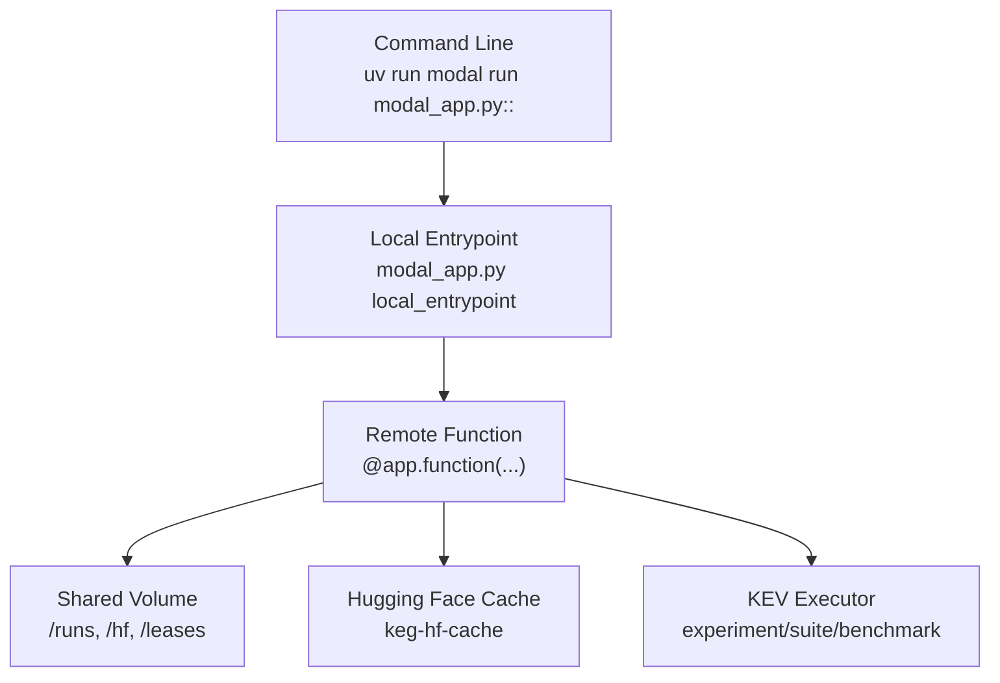
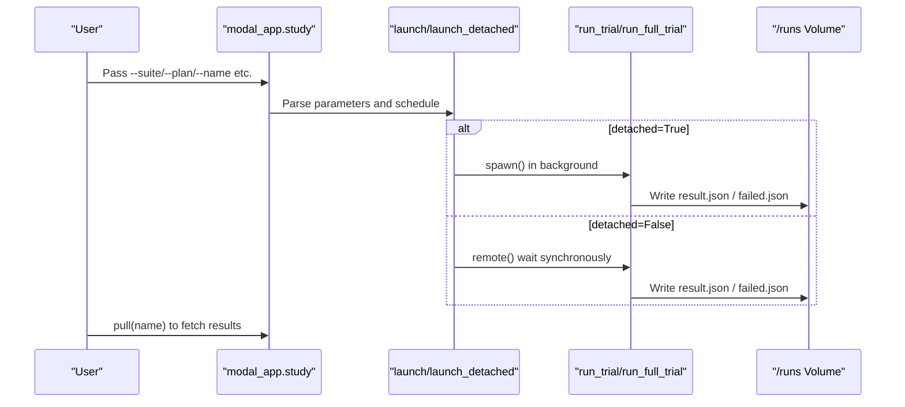
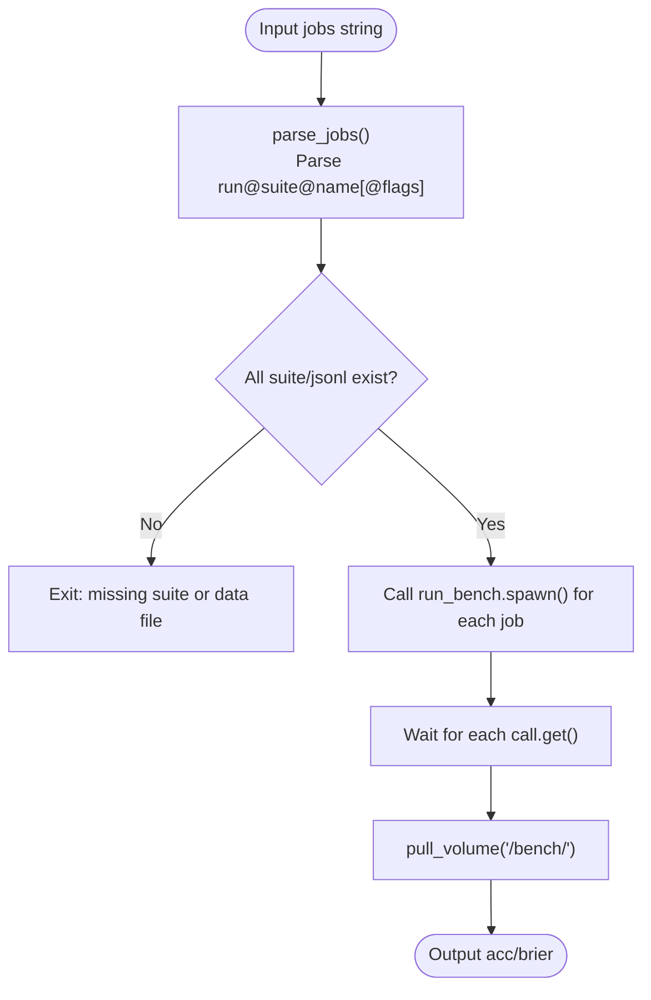
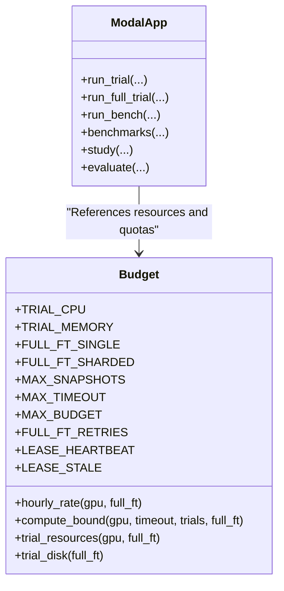
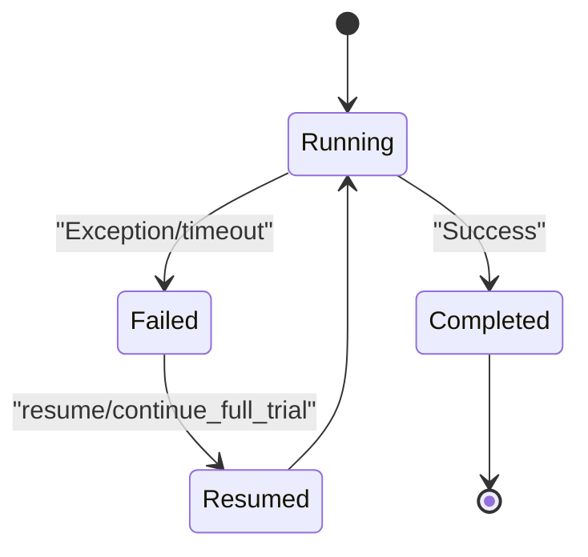

## Table of Contents
1. [Introduction](#introduction)
2. [Project Structure and Entrypoints](#project-structure-and-entrypoints)
3. [Core Deployment Commands Overview](#core-deployment-commands-overview)
4. [Command Parameter Reference](#command-parameter-reference)
5. [Resource Allocation and Quotas](#resource-allocation-and-quotas)
6. [Error Handling, Retries, and Continuation](#error-handling-retries-and-continuation)
7. [Monitoring and Alerting Suggestions](#monitoring-and-alerting-suggestions)
8. [Common Troubleshooting](#common-troubleshooting)
9. [Conclusion](#conclusion)

## Introduction
This document is aimed at engineers running KEV research, evaluation, and benchmarking on Modal, systematically explaining the command formats and configuration methods for the following deployment scenarios:
- Quick smoke test: `uv run modal run modal_app.py::smoke`
- Parallel study: `uv run modal run modal_app.py::study --suite ... --plan ... --name ...`
- Model evaluation: `uv run modal run modal_app.py::evaluate --run ... --suite ... --name ...`
- Benchmarking: `uv run modal run modal_app.py::benchmarks --jobs ...`

The document also covers GPU type selection, concurrent container count limits, timeout settings, budget control, error handling, retry mechanisms, and continuation strategies.

## Project Structure and Entrypoints
The Modal app exposes several local entrypoints via `modal_app.py`, each responsible for parsing user parameters, constructing remote function calls, launching containers, and pulling results. Key entrypoints include:
- `smoke`: quick smoke test
- `study`: launch multiple trials in parallel per the plan
- `evaluate`: score an existing checkpoint on a specified suite
- `benchmarks`: batch-run benchmark for multiple run@suite@name tasks

**Diagram sources**
- [modal_app.py:53-83](file://modal_app.py#L53-L83)
- [modal_app.py:96-115](file://modal_app.py#L96-L115)
- [modal_app.py:245-267](file://modal_app.py#L245-L267)
- [modal_app.py:612-629](file://modal_app.py#L612-L629)

**Section sources**
- [modal_app.py:53-83](file://modal_app.py#L53-L83)
- [modal_app.py:295-309](file://modal_app.py#L295-L309)
- [modal_app.py:612-629](file://modal_app.py#L612-L629)

## Core Deployment Commands Overview

### Quick Smoke Test
- Command: `uv run modal run modal_app.py::smoke`
- Purpose: validate the end-to-end flow with a minimal suite and plan; suitable for T4 free quota or quick regression.
- Behavior: internally calls `launch(...)` to start a study, using the current environment's GPU type by default (determined by `KEV_GPU`).

**Section sources**
- [modal_app.py:1258-1260](file://modal_app.py#L1258-L1260)
- [modal_app.py:38-42](file://modal_app.py#L38-L42)

### Parallel Study
- Command: `uv run modal run modal_app.py::study --suite <path> --plan <JSON> --name <name>`
- Optional parameters:
  - `--gpu`: GPU type, e.g. H100/H200/B200/T4; supports multi-GPU notation `H200:8`
  - `--existing`: comma-separated checkpoint list (Hub id or `/runs/...`)
  - `--transfer`: transfer evaluation suite path
  - `--budget`: research budget cap (USD)
  - `--timeout`: maximum duration of a single attempt (seconds)
  - `--detached`: whether to launch in the background (default True)
- Behavior: generate multiple trials from the plan, each running in an independent container; results are written to the shared volume `/runs/<study>/<trial>/...`.

**Diagram sources**
- [modal_app.py:1073-1078](file://modal_app.py#L1073-L1078)
- [modal_app.py:96-115](file://modal_app.py#L96-L115)
- [modal_app.py:1232-1238](file://modal_app.py#L1232-L1238)

**Section sources**
- [modal_app.py:1073-1078](file://modal_app.py#L1073-L1078)
- [modal_app.py:1081-1093](file://modal_app.py#L1081-L1093)
- [modal_app.py:1232-1238](file://modal_app.py#L1232-L1238)

### Model Evaluation (evaluate)
- Command: `uv run modal run modal_app.py::evaluate --run <checkpoint> --suite <path> --name <name>`
- Optional parameters:
  - `--gpu`: GPU type
  - `--transfer`: attach a transfer evaluation suite
- Behavior: score the given checkpoint on the suite's dev set; results are written to `/runs/<name>/...`.

**Section sources**
- [modal_app.py:1263-1266](file://modal_app.py#L1263-L1266)

### Benchmarking (benchmarks)
- Command: `uv run modal run modal_app.py::benchmarks --jobs "<run>@<suite-or-jsonl>@<name>[@flags],..."`
- Optional parameters:
  - `--gpu`: GPU type
  - `--timeout`: unified timeout (seconds); computed per suite automatically if not set
- Behavior: call `run_bench` for each job; results are pulled to local `runs/<name>/...`.

**Diagram sources**
- [modal_app.py:590-609](file://modal_app.py#L590-L609)
- [modal_app.py:612-629](file://modal_app.py#L612-L629)
- [modal_app.py:259-267](file://modal_app.py#L259-L267)

**Section sources**
- [modal_app.py:590-609](file://modal_app.py#L590-L609)
- [modal_app.py:612-629](file://modal_app.py#L612-L629)
- [modal_app.py:259-267](file://modal_app.py#L259-L267)

## Command Parameter Reference

### Common Parameters
- `--gpu`: GPU type, supporting single or multi-GPU notation (e.g., `H200:8`). Default comes from the `KEV_GPU` environment variable.
- `--timeout`: maximum duration of a single attempt (seconds). Different commands have defaults or compute dynamically per suite.
- `--budget`: research budget cap (USD), used for admission bound validation.
- `--detached`: whether to launch in the background (study).

### study Parameters
- `--suite`: evaluation suite path (relative path within the repository).
- `--plan`: experiment plan JSON file path.
- `--name`: name of this research run, corresponding to `/runs/<name>/...`.
- `--existing`: comma-separated checkpoint list (Hub id or `/runs/...`).
- `--transfer`: attach transfer evaluation suite path.

### evaluate Parameters
- `--run`: checkpoint to evaluate (Hub id or `/runs/...`).
- `--suite`: evaluation suite path.
- `--name`: output name.
- `--transfer`: attach transfer evaluation suite path.

### benchmarks Parameters
- `--jobs`: comma-separated task list, each in the format `run@suite-or-jsonl@name[@flags]`.
- `--gpu`: GPU type.
- `--timeout`: unified timeout (seconds); uses the per-suite computed default if not set.

**Section sources**
- [modal_app.py:1073-1078](file://modal_app.py#L1073-L1078)
- [modal_app.py:1263-1266](file://modal_app.py#L1263-L1266)
- [modal_app.py:612-629](file://modal_app.py#L612-L629)
- [modal_app.py:590-609](file://modal_app.py#L590-L609)

## Resource Allocation and Quotas

### GPU Type and Concurrency
- GPU types: H100, H200, B200, T4. Specifiable via the `KEV_GPU` environment variable or `--gpu`.
- Concurrent container count: `max_containers=24`, applicable to training and evaluation functions.
- Multi-GPU notation: `H200:8` means using 8 GPUs within a single container.

**Diagram sources**
- [budget.py:1-50](file://kev/budget.py#L1-L50)
- [budget.py:53-108](file://kev/budget.py#L53-L108)
- [modal_app.py:103-115](file://modal_app.py#L103-L115)

### Memory and CPU
- Normal trial: 4 CPU cores, memory request/limit `(65536, 196608)` MiB.
- Full fine-tuning (full_ft):
  - Single GPU: `(368640, 409600)` MiB
  - Multi-GPU: `(409600, 471040)` MiB
  - Ephemeral disk: 1 TiB (ephemeral_disk)

### Timeout and Budget
- Maximum timeout: LoRA study 28800 seconds (8 hours), full fine-tuning 86400 seconds (24 hours).
- Maximum budget: LoRA study $250, full fine-tuning $1000.
- Continuation count: full fine-tuning allows at most 1 + FULL_FT_RETRIES attempts.

**Section sources**
- [budget.py:1-50](file://kev/budget.py#L1-L50)
- [budget.py:53-108](file://kev/budget.py#L53-L108)
- [modal_app.py:103-115](file://modal_app.py#L103-L115)

## Error Handling, Retries, and Continuation

### Failure Recording
- If a trial throws an exception, the system writes `failed.json`, containing the error type and a message summary.
- In full fine-tuning, a failure does not continue running but returns a failure status for the upper layer to read.

### Retry Mechanism
- Modal-side retry: disabled by default (`retries=0`) to avoid duplicate billing and concurrency conflicts.
- Full fine-tuning continuation: safely continue via `continue_full_trial` based on the lease and attempt ledger, allowing at most 1 + FULL_FT_RETRIES attempts.

### Continuation Strategy
- `resume`: perform subsequent evaluation on completed-but-resultless trials; trigger the next attempt for incomplete full fine-tuning trials.
- Lease heartbeat: refreshes every 60 seconds; exceeding 900 seconds is considered stale, allowing a new attempt to take over.

**Diagram sources**
- [modal_app.py:118-177](file://modal_app.py#L118-L177)
- [modal_app.py:1116-1189](file://modal_app.py#L1116-L1189)
- [modal_app.py:1202-1229](file://modal_app.py#L1202-L1229)

**Section sources**
- [modal_app.py:118-177](file://modal_app.py#L118-L177)
- [modal_app.py:1116-1189](file://modal_app.py#L1116-L1189)
- [modal_app.py:1202-1229](file://modal_app.py#L1202-L1229)
- [budget.py:33-44](file://kev/budget.py#L33-L44)

## Monitoring and Alerting Suggestions

### Logs and Metrics
- Each trial outputs device info, torch version, whether it continues running, final objective, clean_acc, wall_seconds, and gate check results.
- Benchmarking outputs acc and brier, facilitating cross comparison.

### Alert Triggers
- `failed.json` appears: marks the trial as failed, requiring manual intervention or automatic retry.
- Budget overrun: admission bound rejects new attempts.
- Lease stale: the old container may still be writing; the new attempt must wait.

### Monitoring Integration Suggestions
- Periodically scan `/runs/<study>/<trial>/result.json` and `failed.json`, aggregating success rate and duration.
- Monitor Modal call status (timeout/refused/running), combined with the lease heartbeat to judge container health.
- Perform trend analysis on benchmarking outputs to identify performance degradation.

**Section sources**
- [modal_app.py:144-177](file://modal_app.py#L144-L177)
- [modal_app.py:612-629](file://modal_app.py#L612-L629)
- [modal_app.py:1116-1189](file://modal_app.py#L1116-L1189)

## Common Troubleshooting

### Issue: Suite path does not exist
- Symptom: benchmarks fails at startup reporting a missing suite or data file.
- Solution: confirm the `--suite` or `.jsonl` path exists in the current checkout.

**Section sources**
- [modal_app.py:620-622](file://modal_app.py#L620-L622)

### Issue: Full fine-tuning disk exhaustion
- Symptom: snapshot write fails, trial marked failed.
- Solution: reduce the number of snapshots (MAX_SNAPSHOTS=8), or clean up historical runs.

**Section sources**
- [budget.py:11-18](file://kev/budget.py#L11-L18)

### Issue: Lease conflict prevents continuation
- Symptom: continue_full_trial reports lease fresh, waiting for the old container to finish.
- Solution: wait for LEASE_STALE (900 seconds) before retrying, or check whether the old container is still running.

**Section sources**
- [modal_app.py:1172-1178](file://modal_app.py#L1172-L1178)
- [budget.py:33-44](file://kev/budget.py#L33-L44)

## Conclusion
This document systematizes KEV's deployment commands and resource configuration on Modal, covering the four major scenarios of smoke, study, evaluate, and benchmarks, and detailing parameter usage, GPU selection, concurrency limits, timeout and budget control, as well as error handling, retry, and continuation mechanisms. By understanding these commands and configurations, users can efficiently run research, evaluation, and benchmarking while maintaining stability and observability in large-scale experiments.
