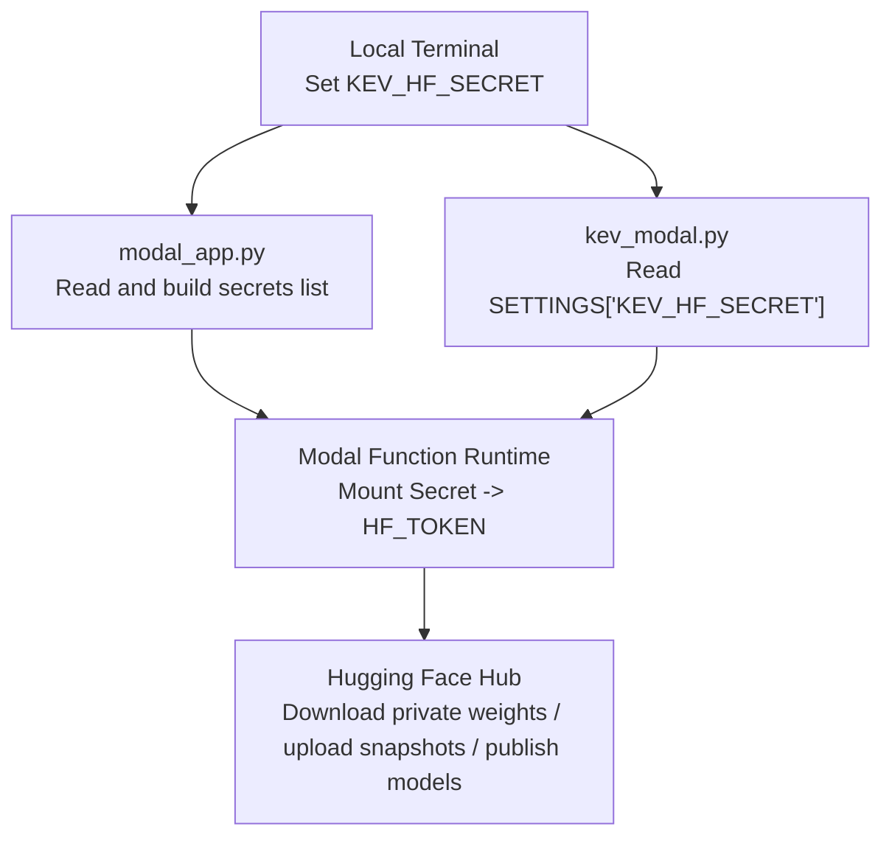
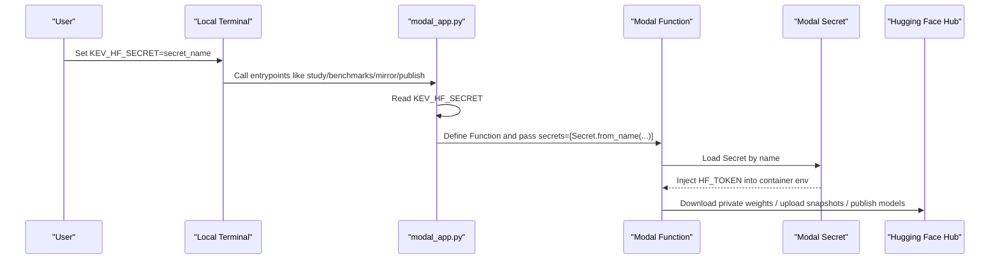
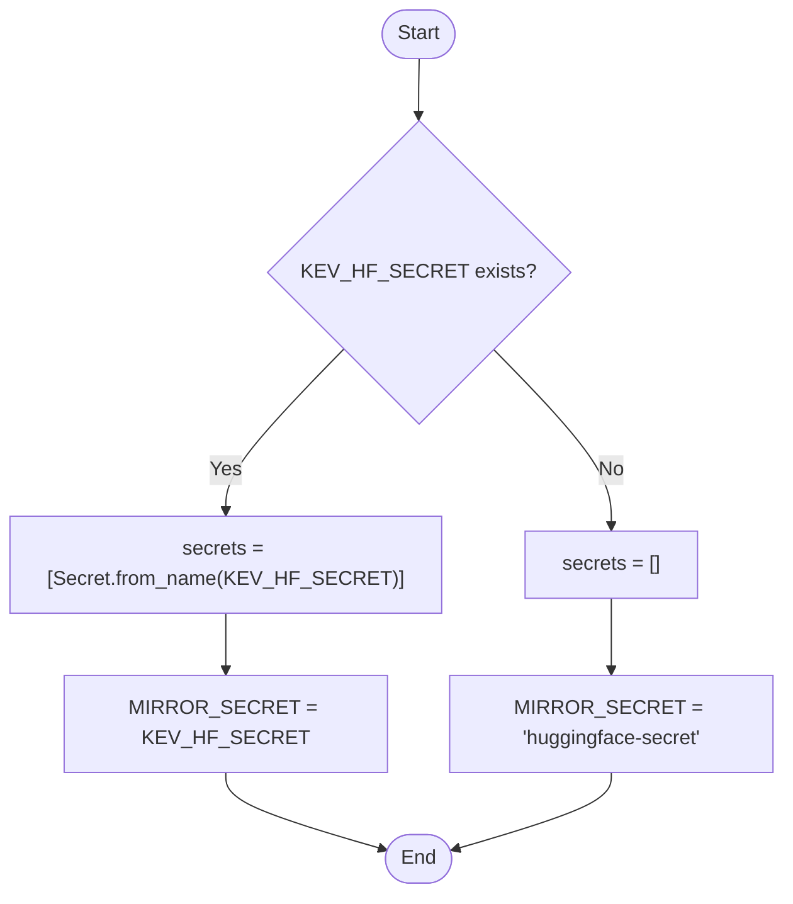
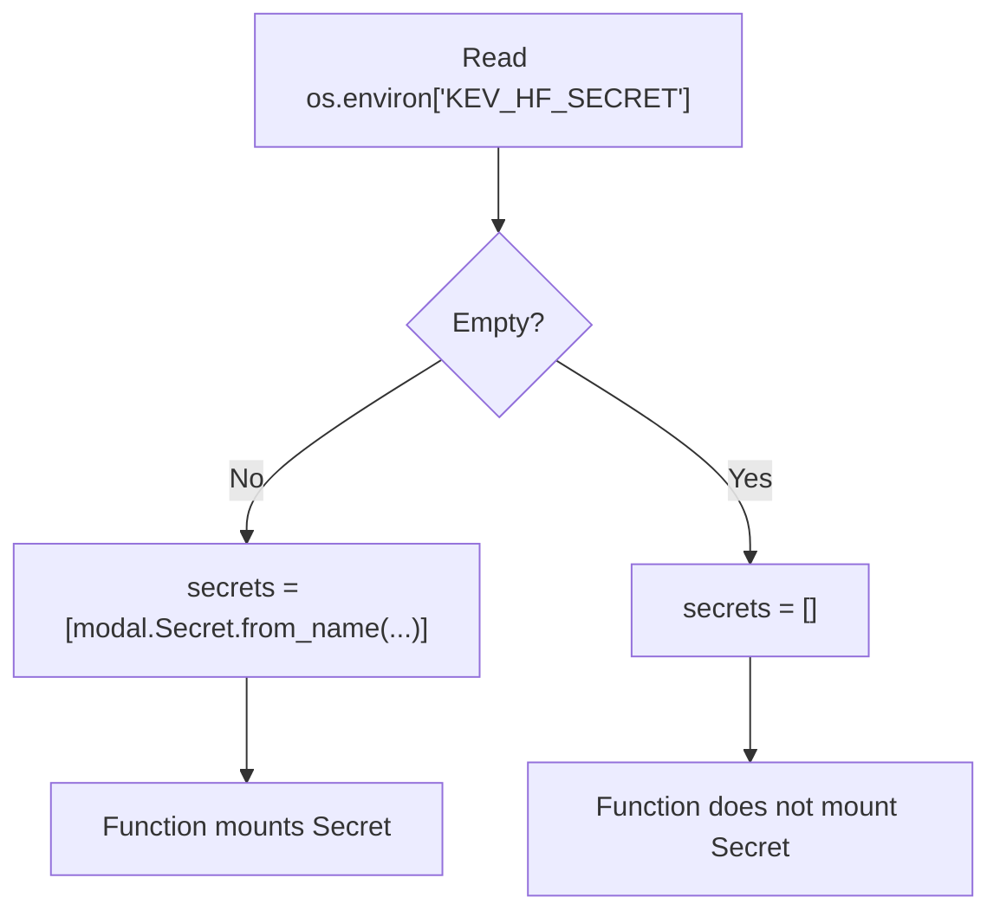
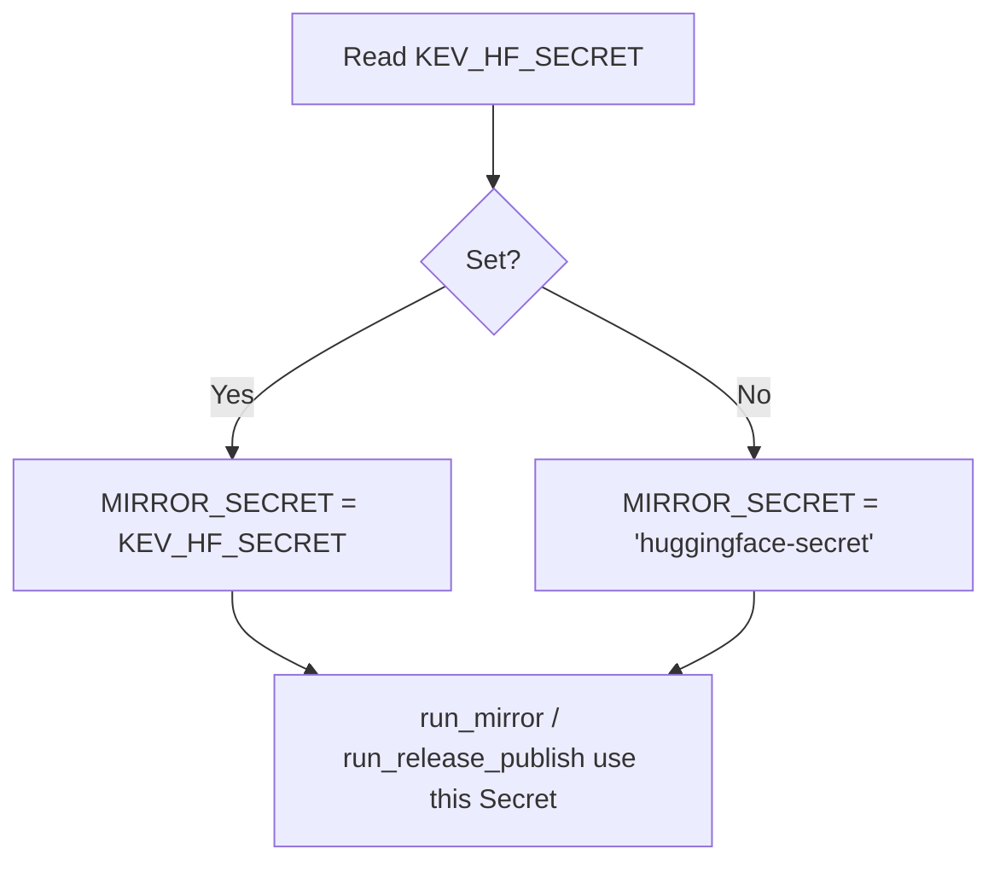
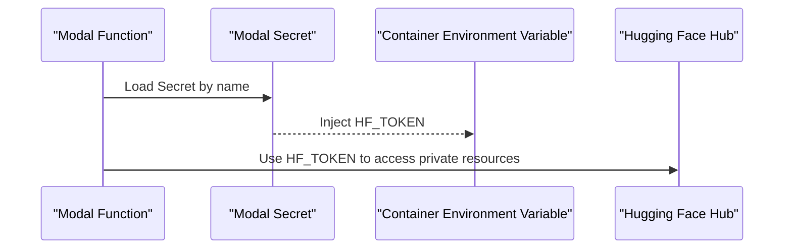
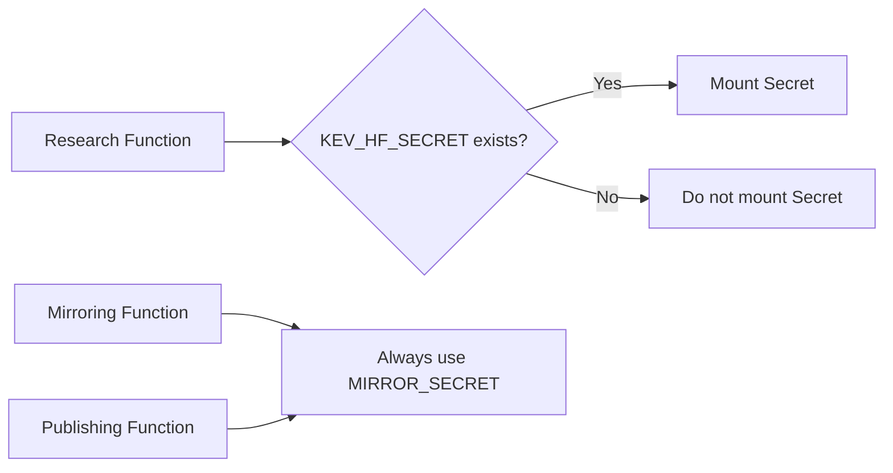
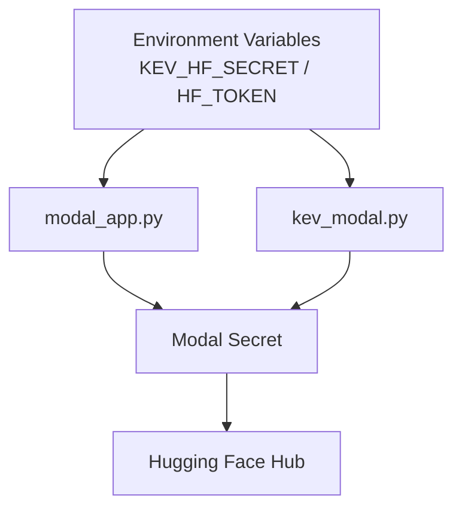

## Table of Contents
1. [Introduction](#introduction)
2. [Project Structure and Secret Boundaries](#project-structure-and-secret-boundaries)
3. [Core Components and Responsibilities](#core-components-and-responsibilities)
4. [Architecture Overview](#architecture-overview)
5. [Detailed Component Analysis](#detailed-component-analysis)
6. [Dependency Analysis](#dependency-analysis)
7. [Performance and Reliability Considerations](#performance-and-reliability-considerations)
8. [Troubleshooting Guide](#troubleshooting-guide)
9. [Conclusion](#conclusion)
10. [Appendix: Configuration List and Best Practices](#appendix-configuration-list-and-best-practices)

## Introduction
This document focuses on KEV's secrets and security mechanisms in the Modal environment, with emphasis on the following objectives:
- The meaning, source, and propagation path of the KEV_HF_SECRET environment variable.
- The management approach for the Hugging Face Token (HF_TOKEN) and Secret name mapping.
- The construction logic of the secrets list: conditional Secret injection and MIRROR_SECRET default-value handling.
- Security best practices: Token rotation strategy, access control, and audit logging.
- Common issues and solutions: troubleshooting errors such as Token expiration and insufficient permissions.

This repository runs training, evaluation, mirroring, and publishing flows via Modal; the Hugging Face Token is injected into the container as a Modal Secret, avoiding writing sensitive values into code or the image.

## Project Structure and Secret Boundaries
- Research orchestration entry: modal_app.py
  - Responsible for defining and scheduling Modal Functions for research tasks, evaluation, benchmarking, image upload, and publishing.
  - Uses the KEV_HF_SECRET environment variable to decide whether a Modal Secret carrying HF_TOKEN needs to be mounted.
- Fine-tuning skill script: skills/kev-finetune/scripts/kev_modal.py
  - A user-facing fine-tuning workflow that also decides whether to mount a Secret via KEV_HF_SECRET, and validates HF_TOKEN when publishing.
- Documentation and conventions: AGENTS.md
  - Describes the research flow, Modal usage, and Secret usage scenarios and caveats.

Diagram sources
- [modal_app.py:44-50](file://modal_app.py#L44-L50)
- [modal_app.py:82-83](file://modal_app.py#L82-L83)
- [modal_app.py:272-273](file://modal_app.py#L272-L273)
- [modal_app.py:688-693](file://modal_app.py#L688-L693)
- [kev_modal.py:29-33](file://skills/kev-finetune/scripts/kev_modal.py#L29-L33)
- [kev_modal.py:62-64](file://skills/kev-finetune/scripts/kev_modal.py#L62-L64)
- [kev_modal.py:384-403](file://skills/kev-finetune/scripts/kev_modal.py#L384-L403)

Section sources
- [modal_app.py:1-18](file://modal_app.py#L1-L18)
- [modal_app.py:44-50](file://modal_app.py#L44-L50)
- [modal_app.py:82-83](file://modal_app.py#L82-L83)
- [modal_app.py:272-273](file://modal_app.py#L272-L273)
- [modal_app.py:688-693](file://modal_app.py#L688-L693)
- [kev_modal.py:29-33](file://skills/kev-finetune/scripts/kev_modal.py#L29-L33)
- [kev_modal.py:62-64](file://skills/kev-finetune/scripts/kev_modal.py#L62-L64)
- [kev_modal.py:384-403](file://skills/kev-finetune/scripts/kev_modal.py#L384-L403)
- [AGENTS.md:107-109](file://AGENTS.md#L107-L109)

## Core Components and Responsibilities
- modal_app.py
  - worker_environment: injects the app name, GPU, and optionally KEV_HF_SECRET into the container.
  - secrets list: when KEV_HF_SECRET exists, builds a list containing that Secret for Functions that need to access Hugging Face to mount.
  - MIRROR_SECRET: the Secret name used by run_mirror and run_release_publish; if KEV_HF_SECRET is not explicitly set, it falls back to the default name huggingface-secret.
  - run_mirror: a CPU task that mirrors the complete checkpoint directory to a private Hub repository, using the HF_TOKEN provided by MIRROR_SECRET.
  - run_release_publish: publishes the staged checkpoint to the Hub, also using MIRROR_SECRET.
- skills/kev-finetune/scripts/kev_modal.py
  - SETTINGS: records startup configuration, including KEV_HF_SECRET (name only, not the value).
  - hf_secret: based on whether SETTINGS["KEV_HF_SECRET"] is non-empty, decides whether to mount the Secret.
  - run_publish: requires HF_TOKEN to exist inside the container, otherwise raises an error; uploads the model via kev.publish.

Section sources
- [modal_app.py:44-50](file://modal_app.py#L44-L50)
- [modal_app.py:82-83](file://modal_app.py#L82-L83)
- [modal_app.py:272-273](file://modal_app.py#L272-L273)
- [modal_app.py:688-693](file://modal_app.py#L688-L693)
- [kev_modal.py:29-33](file://skills/kev-finetune/scripts/kev_modal.py#L29-L33)
- [kev_modal.py:62-64](file://skills/kev-finetune/scripts/kev_modal.py#L62-L64)
- [kev_modal.py:384-403](file://skills/kev-finetune/scripts/kev_modal.py#L384-L403)

## Architecture Overview
The following diagram shows the key path from setting KEV_HF_SECRET locally to using HF_TOKEN inside the container to access Hugging Face.

Diagram sources
- [modal_app.py:44-50](file://modal_app.py#L44-L50)
- [modal_app.py:82-83](file://modal_app.py#L82-L83)
- [modal_app.py:272-273](file://modal_app.py#L272-L273)
- [modal_app.py:688-693](file://modal_app.py#L688-L693)

## Detailed Component Analysis

### KEV_HF_SECRET Environment Variable and Secret Name Mapping
- Role
  - Specifies the name of the Modal Secret, which should contain the key HF_TOKEN.
  - The Secret is only mounted on Functions that need to access Hugging Face.
- Propagation path
  - worker_environment: when a secret_name is passed in, writes KEV_HF_SECRET into the container environment variable.
  - Image build stage: image.env reads the current environment's KEV_HF_SECRET so subsequent Functions can reuse it.
  - secrets list: if KEV_HF_SECRET exists, build secrets=[modal.Secret.from_name(os.environ["KEV_HF_SECRET"])].
- Default behavior
  - For run_mirror and run_release_publish, MIRROR_SECRET prefers KEV_HF_SECRET; if not set, it falls back to huggingface-secret.

Diagram sources
- [modal_app.py:44-50](file://modal_app.py#L44-L50)
- [modal_app.py:82-83](file://modal_app.py#L82-L83)

Section sources
- [modal_app.py:44-50](file://modal_app.py#L44-L50)
- [modal_app.py:82-83](file://modal_app.py#L82-L83)

### The Construction Logic of the secrets List
- Conditional injection
  - When os.environ.get("KEV_HF_SECRET") is non-empty, the secrets list contains the corresponding Secret.
  - Otherwise the secrets list is empty, and the Function does not mount any Secret.
- Scope of impact
  - All Functions that need to access Hugging Face (such as run_trial, run_bench, run_base_probe, run_mirror, run_release_publish, etc.) use the secrets list or explicitly from_name(MIRROR_SECRET).
- Risk points
  - If KEV_HF_SECRET is set locally but not correctly propagated to the Worker image, it may cause dependency-count mismatch errors.

Diagram sources
- [modal_app.py:82-83](file://modal_app.py#L82-L83)

Section sources
- [modal_app.py:82-83](file://modal_app.py#L82-L83)

### MIRROR_SECRET Default-Value Handling
- Purpose
  - run_mirror and run_release_publish always use the Secret specified by MIRROR_SECRET.
- Default value
  - If KEV_HF_SECRET is not set, MIRROR_SECRET defaults to huggingface-secret.
- Reason
  - These CPU tasks need HF_TOKEN to upload snapshots or publish models; even if research Functions do not need a Secret, the mirroring-related tasks still do.

Diagram sources
- [modal_app.py:82-83](file://modal_app.py#L82-L83)
- [modal_app.py:272-273](file://modal_app.py#L272-L273)
- [modal_app.py:688-693](file://modal_app.py#L688-L693)

Section sources
- [modal_app.py:82-83](file://modal_app.py#L82-L83)
- [modal_app.py:272-273](file://modal_app.py#L272-L273)
- [modal_app.py:688-693](file://modal_app.py#L688-L693)

### Hugging Face Token Management
- Storage location
  - HF_TOKEN is stored in the value of the Modal Secret, whose name is specified by KEV_HF_SECRET.
- Injection method
  - When the Modal Function starts, the Secret is loaded by name and HF_TOKEN is injected into the container environment variable.
- Validation
  - kev_modal.py's run_publish checks inside the container whether HF_TOKEN exists, raising an error if not.
- Usage scenarios
  - Download private base weights.
  - Upload snapshots to a private Hub repository.
  - Publish models to the Hub.

Diagram sources
- [modal_app.py:82-83](file://modal_app.py#L82-L83)
- [modal_app.py:272-273](file://modal_app.py#L272-L273)
- [modal_app.py:688-693](file://modal_app.py#L688-L693)
- [kev_modal.py:384-403](file://skills/kev-finetune/scripts/kev_modal.py#L384-L403)

Section sources
- [modal_app.py:82-83](file://modal_app.py#L82-L83)
- [modal_app.py:272-273](file://modal_app.py#L272-L273)
- [modal_app.py:688-693](file://modal_app.py#L688-L693)
- [kev_modal.py:384-403](file://skills/kev-finetune/scripts/kev_modal.py#L384-L403)

### Conditional Secret Injection and Mirroring Tasks
- Research Functions
  - Only mount the Secret when KEV_HF_SECRET exists.
- Mirroring and Publishing Functions
  - Always use MIRROR_SECRET, ensuring mirroring and publishing work even if research Functions do not need a Secret.

Diagram sources
- [modal_app.py:82-83](file://modal_app.py#L82-L83)
- [modal_app.py:272-273](file://modal_app.py#L272-L273)
- [modal_app.py:688-693](file://modal_app.py#L688-L693)

Section sources
- [modal_app.py:82-83](file://modal_app.py#L82-L83)
- [modal_app.py:272-273](file://modal_app.py#L272-L273)
- [modal_app.py:688-693](file://modal_app.py#L688-L693)

## Dependency Analysis
- Environment variable dependencies
  - KEV_HF_SECRET: decides whether a Secret needs to be mounted.
  - HF_TOKEN: injected by the Modal Secret, used by the Hugging Face SDK.
- Module dependencies
  - modal_app.py depends on modal.Secret.from_name to load the Secret.
  - kev_modal.py depends on SETTINGS["KEV_HF_SECRET"] and os.environ["HF_TOKEN"].
- External dependencies
  - Hugging Face Hub: used to download private weights, upload snapshots, and publish models.

Diagram sources
- [modal_app.py:82-83](file://modal_app.py#L82-L83)
- [modal_app.py:272-273](file://modal_app.py#L272-L273)
- [modal_app.py:688-693](file://modal_app.py#L688-L693)
- [kev_modal.py:29-33](file://skills/kev-finetune/scripts/kev_modal.py#L29-L33)
- [kev_modal.py:62-64](file://skills/kev-finetune/scripts/kev_modal.py#L62-L64)
- [kev_modal.py:384-403](file://skills/kev-finetune/scripts/kev_modal.py#L384-L403)

Section sources
- [modal_app.py:82-83](file://modal_app.py#L82-L83)
- [modal_app.py:272-273](file://modal_app.py#L272-L273)
- [modal_app.py:688-693](file://modal_app.py#L688-L693)
- [kev_modal.py:29-33](file://skills/kev-finetune/scripts/kev_modal.py#L29-L33)
- [kev_modal.py:62-64](file://skills/kev-finetune/scripts/kev_modal.py#L62-L64)
- [kev_modal.py:384-403](file://skills/kev-finetune/scripts/kev_modal.py#L384-L403)

## Performance and Reliability Considerations
- Mirroring task timeout
  - run_mirror sets a longer timeout to support large-weight uploads.
- Retry strategy
  - The mirror logic performs limited retries on upload failures, but does not let training be interrupted by mirror failures.
- Size and caching
  - HF_HOME points to a shared cache volume, reducing repeated download cost.
- Container isolation
  - Each Function runs independently, and Secrets are mounted only on demand, reducing the exposure surface.

Section sources
- [modal_app.py:269-284](file://modal_app.py#L269-L284)
- [modal_app.py:688-706](file://modal_app.py#L688-L706)

## Troubleshooting Guide
- Common error: Worker dependency count mismatch
  - Symptom: a message that the number of object IDs received by the Worker dependency graph does not match the environment variables.
  - Cause: KEV_HF_SECRET is set locally but not propagated to the Worker image.
  - Solution: ensure KEV_HF_SECRET is written into image.env at image build time, or correctly propagated via worker_environment.
- Common error: missing HF_TOKEN in container
  - Symptom: an error during publish saying there is no HF_TOKEN in the container.
  - Cause: KEV_HF_SECRET is not set, or the Secret name is incorrect.
  - Solution: create a Modal Secret containing HF_TOKEN, and specify its name via KEV_HF_SECRET.
- Common error: insufficient permissions
  - Symptom: cannot download private weights or upload to a private repository.
  - Cause: HF_TOKEN has insufficient permissions or the Secret name is wrong.
  - Solution: check whether the HF_TOKEN in the Secret has read/write permissions for the corresponding repository.
- Common error: Token expired
  - Symptom: previously working requests suddenly fail.
  - Cause: HF_TOKEN has expired.
  - Solution: update the HF_TOKEN in the Modal Secret, and ensure KEV_HF_SECRET points to the correct Secret name.

Section sources
- [runs\calibration-screen-startup\report.json:4](file://runs/calibration-screen-startup/report.json#L4)
- [modal_app.py:82-83](file://modal_app.py#L82-L83)
- [modal_app.py:272-273](file://modal_app.py#L272-L273)
- [modal_app.py:688-693](file://modal_app.py#L688-L693)
- [kev_modal.py:384-403](file://skills/kev-finetune/scripts/kev_modal.py#L384-L403)

## Conclusion
- KEV_HF_SECRET is the bridge connecting the local environment to the Modal Secret, deciding whether a Secret needs to be mounted.
- The secrets list uses conditional injection, mounting Secrets only when needed, reducing the exposure surface.
- MIRROR_SECRET ensures mirroring and publishing tasks are always available, even if research Functions do not need a Secret.
- It is recommended to follow the principle of least privilege, rotate Tokens regularly, and log key operations.

## Appendix: Configuration List and Best Practices

### Configuration List
- KEV_HF_SECRET
  - Type: string
  - Required: depends on functionality
  - Default: none
  - Description: the name of the Modal Secret, which contains HF_TOKEN.
- HF_TOKEN
  - Type: string
  - Source: value of the Modal Secret
  - Description: Hugging Face access token.

### Security Best Practices
- Token rotation strategy
  - Rotate HF_TOKEN regularly to avoid long-lived Tokens.
  - After rotation, update the Modal Secret and ensure KEV_HF_SECRET points to the new Secret.
- Access control
  - Use different Secrets for different environments (development, testing, production).
  - Restrict the visibility and access permissions of Secrets.
- Audit logging
  - Record the creation, update, and deletion operations of Secrets.
  - Record the time and result of key API calls (download, upload, publish).

Section sources
- [modal_app.py:82-83](file://modal_app.py#L82-L83)
- [modal_app.py:272-273](file://modal_app.py#L272-L273)
- [modal_app.py:688-693](file://modal_app.py#L688-L693)
- [kev_modal.py:29-33](file://skills/kev-finetune/scripts/kev_modal.py#L29-L33)
- [kev_modal.py:62-64](file://skills/kev-finetune/scripts/kev_modal.py#L62-L64)
- [kev_modal.py:384-403](file://skills/kev-finetune/scripts/kev_modal.py#L384-L403)
- [AGENTS.md:107-109](file://AGENTS.md#L107-L109)
