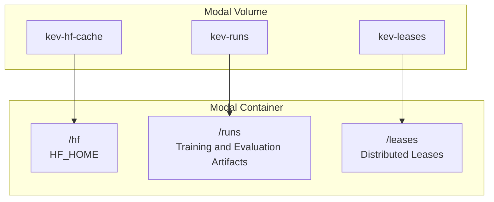
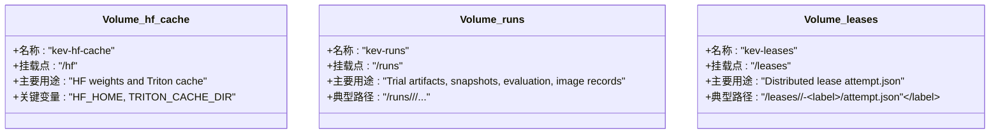
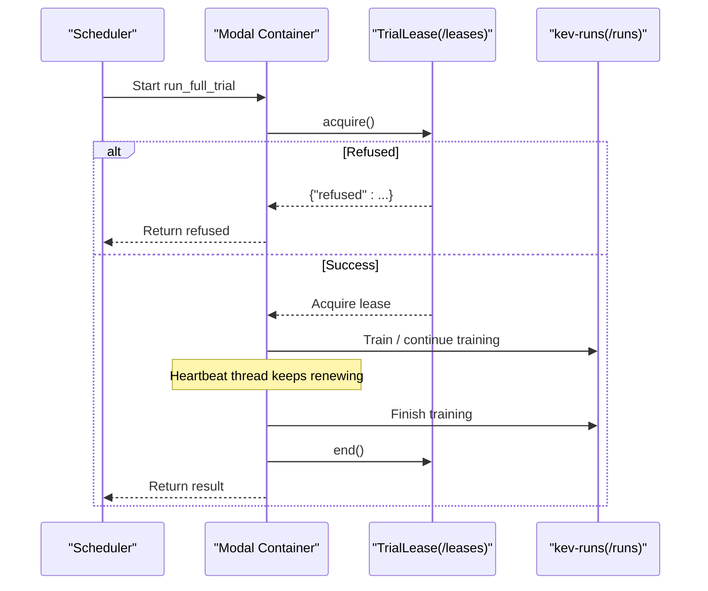
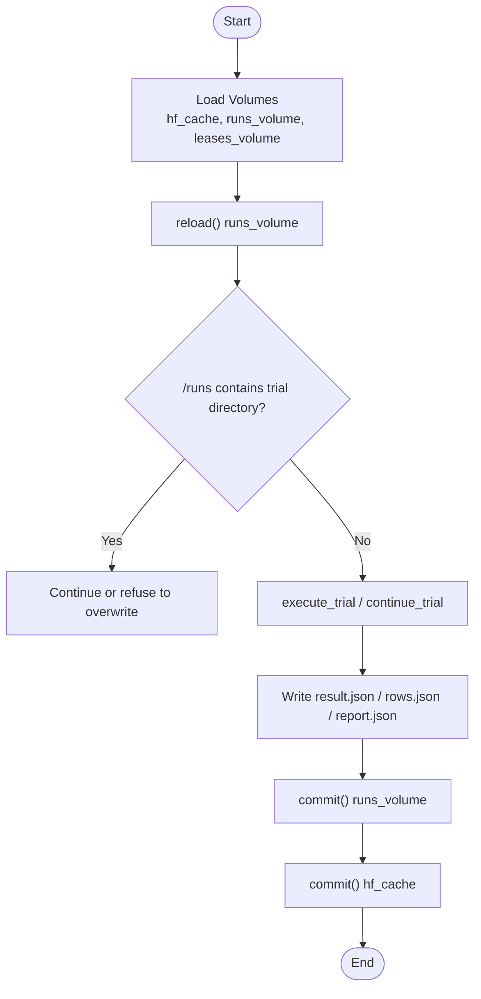
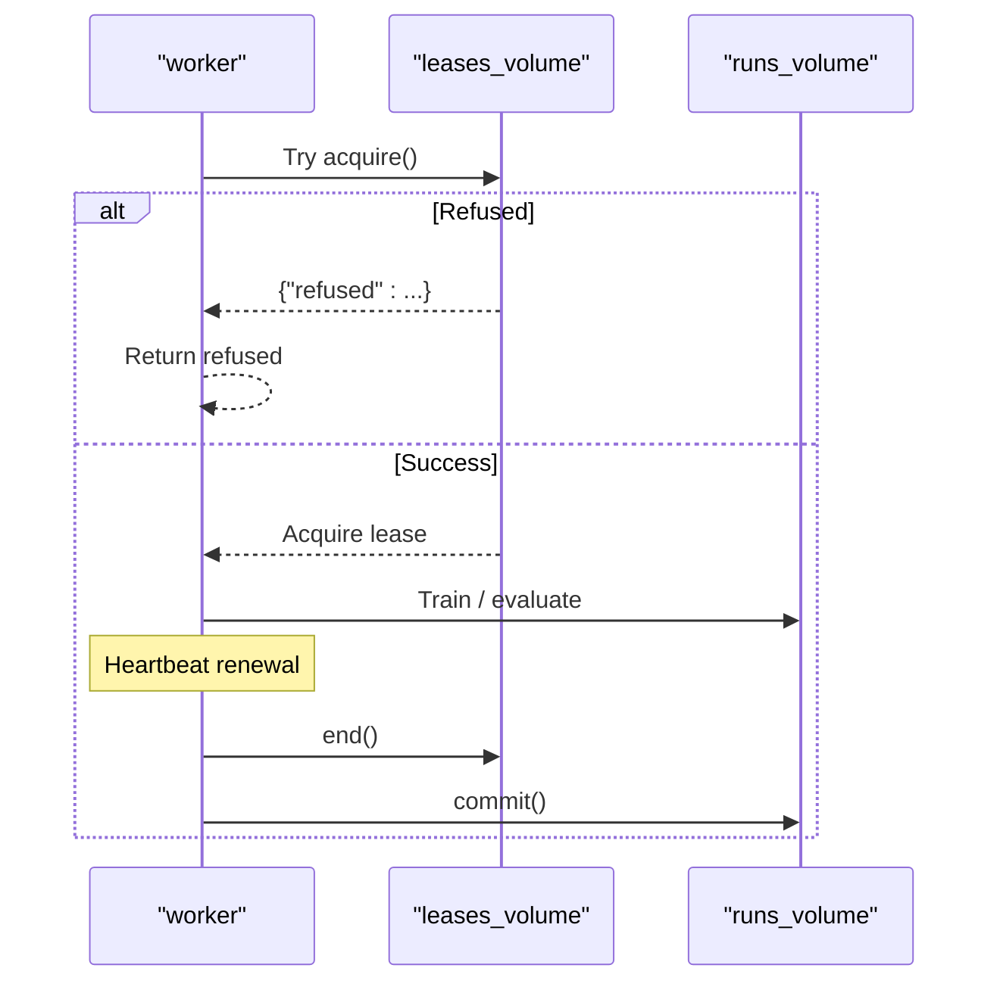
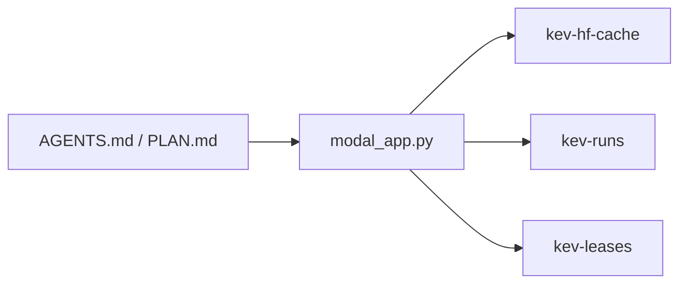

## Table of Contents
1. [Introduction](#introduction)
2. [Project Structure and Volume Overview](#project-structure-and-volume-overview)
3. [Core Volume Definitions and Purposes](#core-volume-definitions-and-purposes)
4. [Volume Lifecycle Management](#volume-lifecycle-management)
5. [Permissions and Data Persistence Strategy](#permissions-and-data-persistence-strategy)
6. [Monitoring, Cleanup, and Failure Recovery Best Practices](#monitoring-cleanup-and-failure-recovery-best-practices)
7. [Architecture and Call Sequence Diagrams](#architecture-and-call-sequence-diagrams)
8. [Dependency Analysis](#dependency-analysis)
9. [Performance Considerations](#performance-considerations)
10. [Conclusion](#conclusion)

## Introduction
This document targets Kev's training, evaluation, and publishing flows on Modal, focusing on three core Volumes:
- kev-hf-cache: Hugging Face model weight cache, mounted at `/hf` inside the container.
- kev-runs: training results, snapshots, evaluation outputs, and other experiment artifacts, mounted at `/runs` inside the container.
- kev-leases: distributed locks (attempt-level leases), used for mutual exclusion across multiple instances of full fine-tuning tasks, mounted at `/leases` inside the container.

The document explains each Volume's responsibilities, lifecycle, read/write mode, permissions, and persistence strategy, and provides best practices for monitoring, cleanup, and failure recovery.

## Project Structure and Volume Overview
Kev's Modal app declares and mounts three Volumes via modal_app.py; training and evaluation functions access these Volumes at fixed paths inside the container:
- /hf: HF_HOME, used to cache base model weights and the Triton compilation cache.
- /runs: the persistence location for all research trials, snapshots, evaluation results, image records, etc.
- /leases: the directory holding the distributed lease files attempt.json for full fine-tuning attempts.

**Diagram sources**
- [modal_app.py:40-81](file://modal_app.py#L40-L81)

**Section sources**
- [modal_app.py:40-81](file://modal_app.py#L40-L81)

## Core Volume Definitions and Purposes
- kev-hf-cache
  - Mount point: /hf
  - Purpose: caches Hugging Face base model weights, tokenizers, Triton compilation cache, etc.
  - Key environment variables: HF_HOME=/hf; TRITON_CACHE_DIR=/hf/triton-cache.
  - Typical writers: training, evaluation, benchmarking, probe, and other functions that load base models.
- kev-runs
  - Mount point: /runs
  - Purpose: stores trial directories, checkpoints, snapshots, evaluation rows/report, locked test results, image records, etc.
  - Typical writers: run_trial, run_full_trial, run_locked_test, run_mirror, run_interpolate, run_merge_adapter, etc.
- kev-leases
  - Mount point: /leases
  - Purpose: stores attempt.json for each full fine-tuning attempt, enabling multi-instance mutual exclusion and heartbeat renewal.
  - Typical writer: TrialLease within run_full_trial.

**Diagram sources**
- [modal_app.py:40-81](file://modal_app.py#L40-L81)

**Section sources**
- [modal_app.py:40-81](file://modal_app.py#L40-L81)

## Volume Lifecycle Management
### The Role of create_if_missing=True
- All three Volumes are created or retrieved with create_if_missing=True:
  - hf_cache = modal.Volume.from_name("kev-hf-cache", create_if_missing=True)
  - runs_volume = modal.Volume.from_name("kev-runs", create_if_missing=True)
  - leases_volume = modal.Volume.from_name("kev-leases", create_if_missing=True)
- Meaning: if the Volume does not exist it is created automatically, avoiding first-run failures due to a missing Volume; it also ensures multiple functions share the same named Volume.

**Section sources**
- [modal_app.py:75-81](file://modal_app.py#L75-L81)

### When to Use reload()
- Call reload() at the start of every function that needs to read Volume data, to ensure the local container sees the latest committed data:
  - run_attempt: runs_volume.reload()
  - run_locked_test: runs_volume.reload()
  - run_mirror: runs_volume.reload()
  - run_interpolate: runs_volume.reload()
  - run_merge_adapter: runs_volume.reload()
  - run_release_copy: runs_volume.reload()
  - run_release_publish: runs_volume.reload()
- Purpose: prevent the "committed file not found" problem caused by a stale view of the Volume after the container starts.

**Section sources**
- [modal_app.py:144-176](file://modal_app.py#L144-L176)
- [modal_app.py:180-227](file://modal_app.py#L180-L227)
- [modal_app.py:272-284](file://modal_app.py#L272-L284)
- [modal_app.py:418-431](file://modal_app.py#L418-L431)
- [modal_app.py:467-480](file://modal_app.py#L467-L480)
- [modal_app.py:667-676](file://modal_app.py#L667-L676)
- [modal_app.py:688-706](file://modal_app.py#L688-L706)

### When to Use commit()
- Commit the Volume uniformly after writes complete, to guarantee data consistency:
  - run_attempt: runs_volume.commit() and hf_cache.commit() in the finally block
  - run_locked_test: runs_volume.commit() after completing suite evaluation
  - run_tool: runs_volume.commit() and hf_cache.commit() after the sub-script finishes
  - run_mirror: runs_volume.commit() after uploading the image record
  - run_interpolate: runs_volume.commit() in the on_done callback and the finally block
  - run_merge_adapter: runs_volume.commit() after merging completes
  - run_release_copy: runs_volume.commit() after copying completes
  - run_gpu_tests: hf_cache.commit() after GPU tests complete
- Note: in full fine-tuning, the resume point and snapshot are committed by the VolumeWatcher and background threads, avoiding committing the entire runs volume in a half-written state.

**Section sources**
- [modal_app.py:144-176](file://modal_app.py#L144-L176)
- [modal_app.py:180-227](file://modal_app.py#L180-L227)
- [modal_app.py:230-242](file://modal_app.py#L230-L242)
- [modal_app.py:272-284](file://modal_app.py#L272-L284)
- [modal_app.py:418-431](file://modal_app.py#L418-L431)
- [modal_app.py:467-480](file://modal_app.py#L467-L480)
- [modal_app.py:667-676](file://modal_app.py#L667-L676)
- [modal_app.py:383-389](file://modal_app.py#L383-L389)

### Distributed Lease and Heartbeat
- Full fine-tuning attempts use /leases/<study>/<index>-<label>/attempt.json as a distributed lock.
- Each attempt holds a lease and periodically renews it via a heartbeat in a separate thread; the lease ends on a clean exit.
- If another attempt's lease is still fresh, the new attempt returns refused and does not overwrite the existing trial.
- After a timeout interruption, the next continue_full_trial waits for the old lease to end or expire before starting a new attempt.

**Diagram sources**
- [modal_app.py:118-142](file://modal_app.py#L118-L142)

**Section sources**
- [modal_app.py:118-142](file://modal_app.py#L118-L142)
- [AGENTS.md:99-100](file://AGENTS.md#L99-L100)

## Permissions and Data Persistence Strategy
### Permissions and Secrets
- HF_TOKEN is injected via a Modal Secret:
  - At runtime, the Secret name is specified via os.environ["KEV_HF_SECRET"].
  - The image environment variable KEV_HF_SECRET is propagated in worker_environment.
  - run_mirror and release_publish use MIRROR_SECRET (default huggingface-secret).
- The public verification path (release_verify) uses a temporary HF_HOME and anonymous access to verify public checkpoints without a Secret and without the kev-hf-cache Volume.

**Section sources**
- [modal_app.py:44-50](file://modal_app.py#L44-L50)
- [modal_app.py:82-83](file://modal_app.py#L82-L83)
- [modal_app.py:722-746](file://modal_app.py#L722-L746)

### Data Persistence Strategy
- kev-hf-cache
  - Persists base model weights and the Triton compilation cache, reducing repeated download and compilation costs.
  - At the end of training, evaluation, benchmarking, GPU testing, and other functions, hf_cache.commit() is committed.
- kev-runs
  - Trial artifacts, snapshots, evaluation results, and image records are all persisted to /runs.
  - Large weight files (model*.safetensors) and resume points typically stay on the Volume; local pull skips them by default unless --weights is explicitly set.
  - Snapshots and the final checkpoint are committed by the VolumeWatcher and background threads at key points, avoiding half-written states.
- kev-leases
  - Stores only the lightweight attempt.json and heartbeat info, and is not committed together with the runs volume, to avoid committing a half-written checkpoint.

**Section sources**
- [modal_app.py:40-81](file://modal_app.py#L40-L81)
- [modal_app.py:144-176](file://modal_app.py#L144-L176)
- [modal_app.py:529-562](file://modal_app.py#L529-L562)
- [modal_app.py:795-800](file://modal_app.py#L795-L800)

## Monitoring, Cleanup, and Failure Recovery Best Practices
### Monitoring
- Observe /runs/<study>/<trial>/result.json, failed.json, snapshot.json, training_metrics.json.
- Observe the heartbeat and status of /leases/<study>/<index>-<label>/attempt.json.
- Use modal_app.py::pull to fetch trial results; by default it skips large weights and resume points to avoid local disk pressure.

### Cleanup
- Do not arbitrarily delete checkpoints or snapshots under /runs unless you clearly understand the impact.
- Large weights and resume points are recommended to remain on the Volume; only pull necessary files locally.
- If cleanup is needed, evaluate its impact on subsequent resumes, snapshot selection, and Hub mirroring.

### Failure Recovery
- Training anomalies:
  - Non-timeout errors are written to failed.json and training does not continue.
  - After a timeout interruption, the next continue_full_trial continues from the most recently committed resume point.
- Distributed lock conflicts:
  - If attempt.json is found to still be active, wait for the old attempt to finish or expire before starting a new attempt.
- Data inconsistency:
  - Call reload() before entering each function to ensure the latest committed data is visible.
  - Commit uniformly after writes complete, to avoid partial commits.

**Section sources**
- [modal_app.py:144-176](file://modal_app.py#L144-L176)
- [modal_app.py:529-562](file://modal_app.py#L529-L562)
- [AGENTS.md:99-115](file://AGENTS.md#L99-L115)

## Architecture and Call Sequence Diagrams
### Training and Evaluation Main Flow

**Diagram sources**
- [modal_app.py:144-176](file://modal_app.py#L144-L176)

**Section sources**
- [modal_app.py:144-176](file://modal_app.py#L144-L176)

### Distributed Lock Flow

**Diagram sources**
- [modal_app.py:118-142](file://modal_app.py#L118-L142)

**Section sources**
- [modal_app.py:118-142](file://modal_app.py#L118-L142)

## Dependency Analysis
- modal_app.py is the center of Volume mounting and usage:
  - Declares hf_cache, runs_volume, leases_volume.
  - Reads and writes Volumes in functions for training, evaluation, mirroring, interpolation, merging, publishing, etc.
- AGENTS.md and PLAN.md provide background and constraints:
  - AGENTS.md describes Volume purposes, Secret configuration, pull behavior, and the distributed lock mechanism.
  - PLAN.md emphasizes the persistence and mirroring strategy for checkpoints and snapshots.

**Diagram sources**
- [modal_app.py:75-81](file://modal_app.py#L75-L81)
- [AGENTS.md:245-253](file://AGENTS.md#L245-L253)
- [PLAN.md:363-365](file://PLAN.md#L363-L365)

**Section sources**
- [modal_app.py:75-81](file://modal_app.py#L75-L81)
- [AGENTS.md:245-253](file://AGENTS.md#L245-L253)
- [PLAN.md:363-365](file://PLAN.md#L363-L365)

## Performance Considerations
- Large weights and resume points:
  - model*.safetensors and resume points typically remain on the Volume; local pull skips them by default, avoiding local disk and network pressure.
  - Use --weights to pull all files if a complete local checkpoint reproduction is needed.
- Commit frequency:
  - Frequent commit() increases I/O overhead; it is recommended to commit at key nodes, such as training-step completion, snapshot completion, and evaluation completion.
- Concurrency and locks:
  - Full fine-tuning attempts achieve mutual exclusion via /leases, preventing multiple instances from writing to the same trial directory simultaneously.
- Cache hits:
  - kev-hf-cache can significantly reduce base model download and Triton compilation time; reusing the same Volume is recommended.

**Section sources**
- [modal_app.py:529-562](file://modal_app.py#L529-L562)
- [modal_app.py:144-176](file://modal_app.py#L144-L176)
- [modal_app.py:118-142](file://modal_app.py#L118-L142)

## Conclusion
- kev-hf-cache, kev-runs, and kev-leases respectively take on the responsibilities of weight caching, trial artifacts, and distributed locking.
- create_if_missing=True ensures the Volume is available on first use; reload() and commit() guarantee data consistency and visibility.
- Permissions are managed via Modal Secrets, and data persistence follows the strategy of "keep large files on the Volume, pull small files locally".
- Monitoring and failure recovery revolve around result.json, failed.json, attempt.json, and the VolumeWatcher.
- Best practices include: clean up carefully, commit reasonably, leverage caching, and avoid concurrency conflicts.
