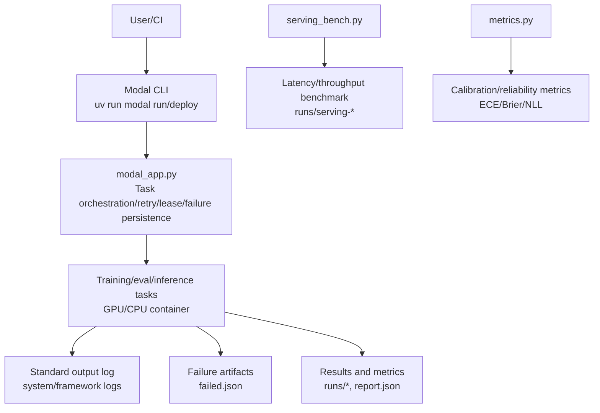
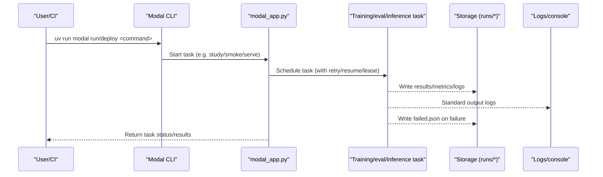
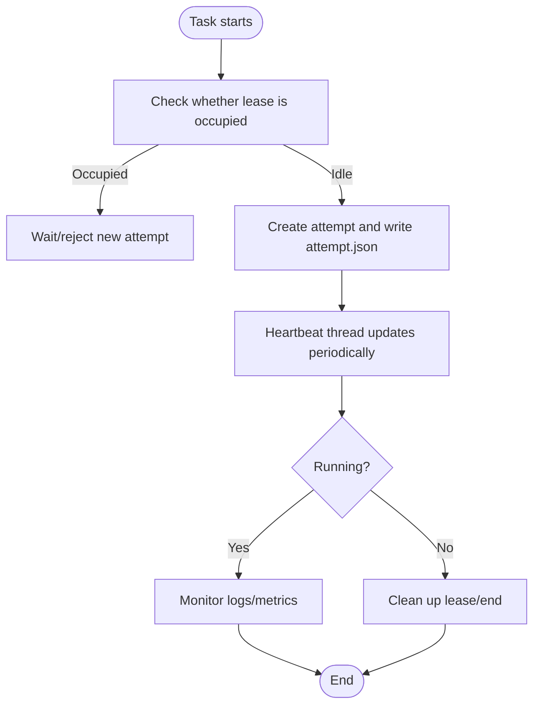
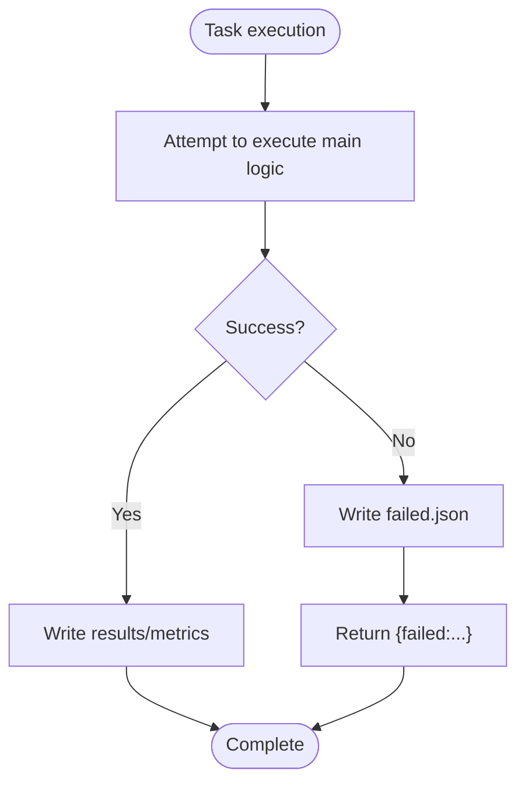
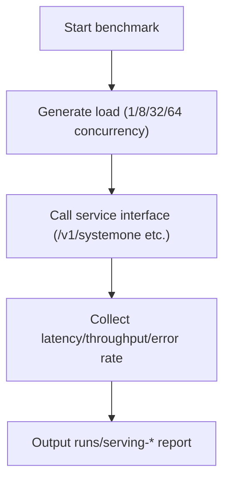
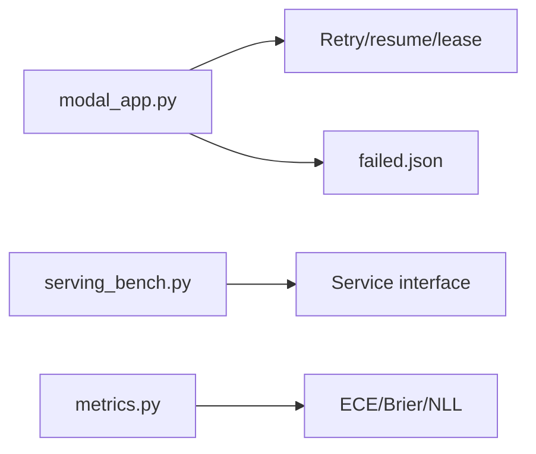

## Table of Contents
1. [Introduction](#introduction)
2. [Project Structure](#project-structure)
3. [Core Components](#core-components)
4. [Architecture Overview](#architecture-overview)
5. [Detailed Component Analysis](#detailed-component-analysis)
6. [Dependency Analysis](#dependency-analysis)
7. [Performance Considerations](#performance-considerations)
8. [Troubleshooting Guide](#troubleshooting-guide)
9. [Conclusion](#conclusion)
10. [Appendix](#appendix)

## Introduction
This document is for operations and R&D personnel running Kev on Modal, and systematically explains how to perform end-to-end monitoring of task execution, container lifecycle, error diagnosis, performance metrics, and logs. The content covers:
- Runtime status viewing: Modal console interface, task status tracking, container lifecycle monitoring
- Error tracing: exception capture mechanisms, failed.json records, debug information collection
- Performance metrics: GPU utilization, memory usage, inference latency, throughput statistics
- Log configuration: standard output redirection, structured log format, log rotation strategy
- Monitoring best practices: key metric definitions, alert rules, performance baselines
- Monitoring script examples and dashboard configuration suggestions

## Project Structure
The key locations around Modal monitoring and logging are as follows:
- modal_app.py: Modal app entry point, hosting task orchestration and retry for study/smoke/pull/resume/serve, as well as lease, failure persistence, and other logic
- scripts/serving_bench.py: Service performance benchmark (latency, throughput)
- kev/metrics.py: Evaluation metric computation (ECE/Brier/NLL, etc.), used for calibration and reporting
- AGENTS.md / PLAN.md / README.md: Engineering context, run methods, performance data, and constraints

Diagram Sources
- [modal_app.py](file://modal_app.py)
- [scripts/serving_bench.py](file://scripts/serving_bench.py)
- [kev/metrics.py](file://kev/metrics.py)

Section Sources
- [AGENTS.md:94-122](file://AGENTS.md#L94-L122)
- [AGENTS.md:239-252](file://AGENTS.md#L239-L252)
- [README.md:183-193](file://README.md#L183-L193)

## Core Components
- Modal task orchestration and retry
  - Exposes multiple commands (smoke/study/pull/resume/serve, etc.) via modal_app.py, triggered by uv run modal run/deploy
  - Supports retry, resume, lease mutual exclusion, failure persistence (failed.json), heartbeat keep-alive, etc.
- Service performance benchmark
  - scripts/serving_bench.py measures latency and throughput, and outputs to runs/serving-*
- Metrics and calibration
  - kev/metrics.py provides pure NumPy metric computation such as ECE/Brier/NLL, supporting calibration and reporting

Section Sources
- [AGENTS.md:239-252](file://AGENTS.md#L239-L252)
- [AGENTS.md:328-334](file://AGENTS.md#L328-L334)
- [AGENTS.md:387](file://AGENTS.md#L387)

## Architecture Overview
The diagram below shows the end-to-end flow from user trigger to produced metrics and logs, as well as the state and resource observation points on the Modal platform side.

Diagram Sources
- [modal_app.py](file://modal_app.py)
- [AGENTS.md:94-122](file://AGENTS.md#L94-L122)

## Detailed Component Analysis

### Runtime Status Viewing (Modal Console, Task Status, Container Lifecycle)
- Modal console
  - View function calls, task queues, container instances, resource allocation, and exit codes via the Modal console
  - Locate specific study/trial/call using the command name and parameters of modal_app.py
- Task status tracking
  - Use watch or resume commands to observe task progress; failed tasks are not auto-resumed and require manual intervention
  - Maintain task status and attempt records via runs/<study>.watch.json and runs/<study>.spawn.json
- Container lifecycle monitoring
  - Each full-weight attempt holds a lease file attempt.json, containing nonce, attempt, call id, and heartbeat interval
  - The heartbeat thread updates periodically; marks completion on cleanup exit; if a newer old lease is found, new attempts are rejected until the old lease ends or expires

Diagram Sources
- [AGENTS.md:94-122](file://AGENTS.md#L94-L122)

Section Sources
- [AGENTS.md:94-122](file://AGENTS.md#L94-L122)

### Error Tracing (Exception Capture, failed.json, Debug Info)
- Exception capture mechanism
  - The failure path does not raise an exception, but writes failed.json and returns {"failed": ...} to avoid auto-resume
  - Timeouts and network errors have dedicated handling (e.g. timeouts recorded as "timeout", DNS/connection errors can be retried)
- failed.json records
  - Located in the runs directory, convenient for later review and automated inspection
- Debug information collection
  - Standard output logs include framework and custom logs; enable remote mode when necessary to unify error semantics (e.g. convert 400/413/422 to ContextOverflow)

Diagram Sources
- [AGENTS.md:112-122](file://AGENTS.md#L112-L122)

Section Sources
- [AGENTS.md:112-122](file://AGENTS.md#L112-L122)

### Performance Metric Collection (GPU Utilization, Memory, Latency, Throughput)
- GPU utilization and memory
  - Collected via the Modal console and host system tools (nvidia-smi, process monitoring)
  - Long-context inference causes significant VRAM growth; pay attention to peak and resident memory
- Inference latency
  - Use serving_bench.py to measure latency distribution under single-request/concurrent conditions
  - The server interface returns a latency_ms field for easy instrumentation
- Throughput statistics
  - Multi-client concurrent load testing, counting QPS and tail latency (P95/P99)
  - Compare throughput and latency trade-offs under different batch sizes

Diagram Sources
- [scripts/serving_bench.py](file://scripts/serving_bench.py)
- [AGENTS.md:328-334](file://AGENTS.md#L328-L334)

Section Sources
- [AGENTS.md:328-334](file://AGENTS.md#L328-L334)
- [README.md:183-193](file://README.md#L183-L193)

### Log Configuration (Standard Output, Structured Logging, Rotation)
- Standard output redirection
  - All task standard output is aggregated by the Modal platform and viewable in the console
  - It is recommended to print structured JSON lines on critical paths for easy downstream parsing
- Structured log format
  - Recommended to include: timestamp, level, module, trace_id, task_id, step, duration, metric key-value pairs
  - Output metrics computed by metrics.py (ECE/Brier/NLL) as structured fields
- Log rotation strategy
  - Split by task/day/size, retain the most recent N copies, archive to object storage
  - Apply independent retention policies to failed.json and runs/* results

[This section is general practice guidance and does not directly analyze specific files]

## Dependency Analysis
- modal_app.py depends on:
  - Task scheduling and retry logic
  - Lease and heartbeat mechanism
  - Failure persistence (failed.json)
- scripts/serving_bench.py depends on:
  - Service interface (latency/throughput)
- kev/metrics.py depends on:
  - Metric computation (ECE/Brier/NLL, etc.)

Diagram Sources
- [modal_app.py](file://modal_app.py)
- [scripts/serving_bench.py](file://scripts/serving_bench.py)
- [kev/metrics.py](file://kev/metrics.py)

Section Sources
- [AGENTS.md:94-122](file://AGENTS.md#L94-L122)
- [AGENTS.md:328-334](file://AGENTS.md#L328-L334)
- [AGENTS.md:387](file://AGENTS.md#L387)

## Performance Considerations
- Long-context inference VRAM and latency
  - Long state significantly increases VRAM usage and inference time; plan GPU specifications based on model size and context length
- Batch size and throughput
  - Increasing batch improves throughput but may increase latency and VRAM pressure; balance P95/P99 latency
- Temperature and calibration
  - Calibration temperature affects confidence ranking; fit and record on a fixed dataset to avoid drift

[This section is general guidance and does not directly analyze specific files]

## Troubleshooting Guide
- Common failure types
  - Timeout: Recorded as "timeout"; check task duration and resource quota
  - Network error: DNS/connection errors can be retried; check external dependencies and network policy
  - Insufficient resources: VRAM overflow or CPU overload; adjust batch or GPU specification
- Quick localization
  - View failed.json for failure details
  - View runs/<study>.watch.json and .spawn.json to understand task status and attempt history
  - Verify the heartbeat and end markers in the lease file attempt.json
- Recovery steps
  - After fixing the configuration, use resume to continue
  - For non-fatal errors, enable retry strategy

Section Sources
- [AGENTS.md:112-122](file://AGENTS.md#L112-L122)

## Conclusion
Through the Modal console, task status files, failed.json, and structured logs, you can build complete runtime visibility. Combined with serving_bench.py and metrics.py, you can continuously measure latency, throughput, and reliability metrics, forming a stable performance baseline and alerting system. It is recommended to clarify key metric thresholds and alert rules before deployment, and regress against the baseline when releasing changes.

[This section is a summary and does not directly analyze specific files]

## Appendix

### Monitoring Script Examples and Dashboard Configuration Suggestions
- Monitoring scripts
  - Use scripts/serving_bench.py to periodically run load tests, outputting runs/serving-* reports
  - Integrate into CI; block release on failure
- Dashboard configuration
  - Panel 1: Task status (success/failure/timeout/retry count)
  - Panel 2: GPU utilization and VRAM peak
  - Panel 3: Latency distribution (P50/P95/P99) and throughput (QPS)
  - Panel 4: Metric trends (ECE/Brier/NLL)
  - Alert rules:
    - Failure rate > threshold (e.g. 5%)
    - P95 latency > threshold (e.g. 200ms)
    - ECE/Brier exceeds baseline (e.g. +0.01)
    - GPU VRAM peak approaching limit (e.g. > 90%)

[This section is general practice guidance and does not directly analyze specific files]
