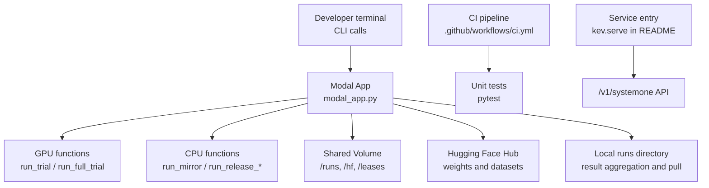
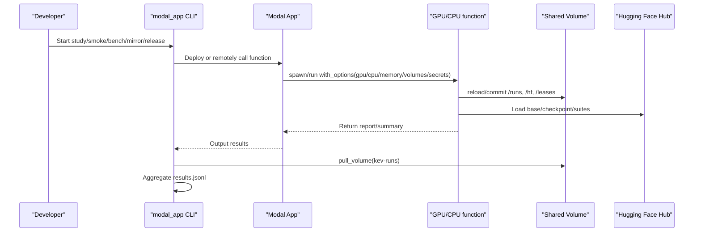
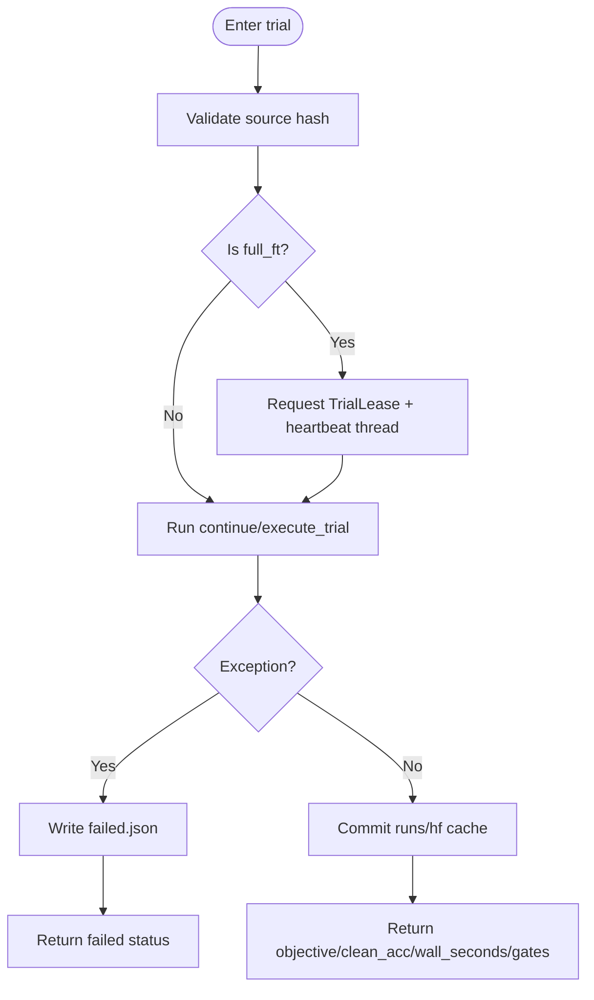
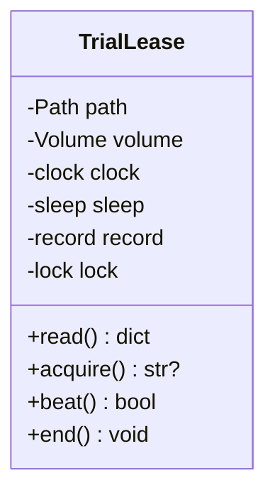
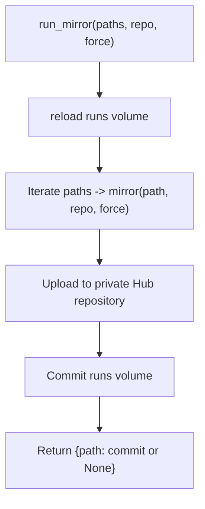
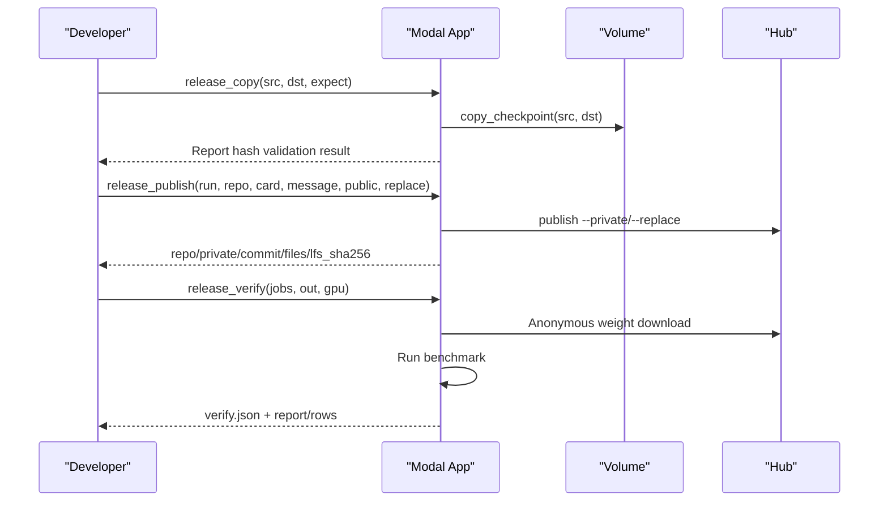
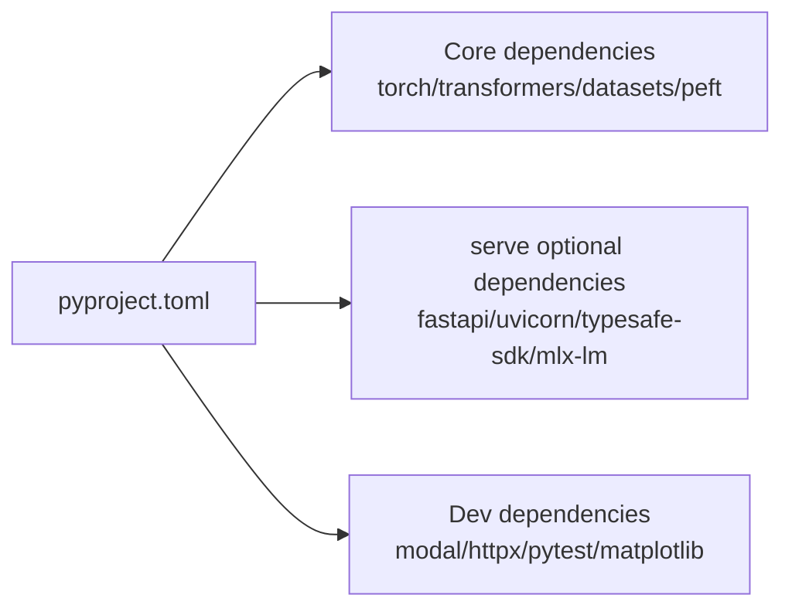
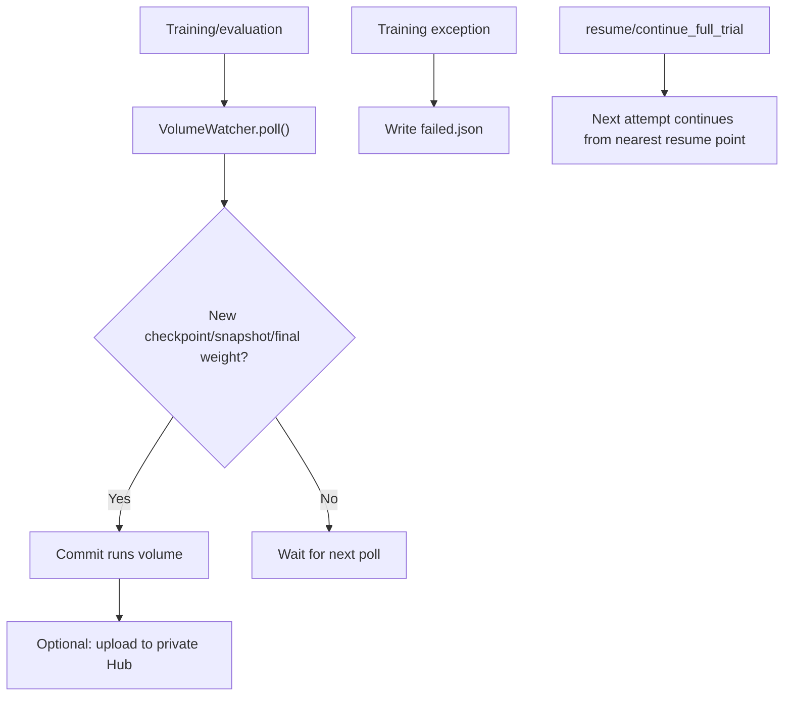

## Table of Contents
1. [Introduction](#introduction)
2. [Project Structure](#project-structure)
3. [Core Components](#core-components)
4. [Architecture Overview](#architecture-overview)
5. [Detailed Component Analysis](#detailed-component-analysis)
6. [Dependency Analysis](#dependency-analysis)
7. [Performance and Capacity Planning](#performance-and-capacity-planning)
8. [Security and Access Control](#security-and-access-control)
9. [Backup, Persistence, and Disaster Recovery](#backup-persistence-and-disaster-recovery)
10. [CI/CD and Automated Deployment](#cicd-and-automated-deployment)
11. [Monitoring, Alerting, and Observability](#monitoring-alerting-and-observability)
12. [Failure Handling Playbook](#failure-handling-playbook)
13. [Conclusion](#conclusion)

## Introduction
This guide is for engineering teams deploying Kev's decision model into production with Modal as the runtime. Based on the Modal app entry point, service descriptions, dependency definitions, and CI configuration in the repository, it summarizes best practices for high availability, backup and recovery, security, performance, automated operations, and cost control, and provides ready-to-use configuration templates and a troubleshooting checklist.

Kev provides a TypeSafe-compatible `/v1/systemone` API, supporting local or cloud GPU inference; on the Modal side, functional containers execute training, evaluation, and image publishing tasks, and persist weights, checkpoints, and results via shared Volumes.

**Section Sources**
- [README.md:13-23](file://README.md#L13-L23)
- [README.md:172-184](file://README.md#L172-L184)

## Project Structure
The repository revolves around "research scripts + inference service + Modal orchestration":
- `modal_app.py`: Modal App definition, GPU/CPU functions, Volume mounting, Secret injection, job scheduling, and result pulling.
- `README.md`: API, deployment methods, performance tables, training and evaluation commands.
- `pyproject.toml`: Python dependencies, optional serve dependencies, Modal dev dependency versions.
- `.github/workflows/ci.yml`: Python unit test and frontend type-check pipeline.

**Diagram Sources**
- [modal_app.py:33-83](file://modal_app.py#L33-L83)
- [modal_app.py:96-116](file://modal_app.py#L96-L116)
- [modal_app.py:272-293](file://modal_app.py#L272-L293)
- [modal_app.py:667-706](file://modal_app.py#L667-L706)
- [README.md:172-184](file://README.md#L172-L184)

**Section Sources**
- [modal_app.py:33-83](file://modal_app.py#L33-L83)
- [README.md:172-184](file://README.md#L172-L184)
- [pyproject.toml:37-54](file://pyproject.toml#L37-L54)
- [.github/workflows/ci.yml:1-35](file://.github/workflows/ci.yml#L1-L35)

## Core Components
- Modal App and image building: Fixed Python version, locked dependencies, CUDA/Triton-related packages installed, and local source and evals/scripts/tests mounted.
- Training and evaluation functions: Run in independent containers per study/trial, mounting the `/runs` and HF cache Volumes.
- Full fine-tuning retry and lease: Use `TrialLease` and a heartbeat mechanism to avoid concurrent attempt conflicts.
- Checkpoint and snapshot mirroring: `run_mirror` uploads the complete checkpoint to a private Hub repository.
- Release flow: Copy, verify, and publish release checkpoints, supporting public or private repositories.
- Anonymous verification: Simulate a token-less user downloading public weights and running evaluations to ensure external availability.

**Section Sources**
- [modal_app.py:53-83](file://modal_app.py#L53-L83)
- [modal_app.py:96-116](file://modal_app.py#L96-L116)
- [modal_app.py:855-930](file://modal_app.py#L855-L930)
- [modal_app.py:272-293](file://modal_app.py#L272-L293)
- [modal_app.py:667-706](file://modal_app.py#L667-L706)
- [modal_app.py:722-746](file://modal_app.py#L722-L746)

## Architecture Overview
The diagram below shows the key interaction paths from the CLI to Modal functions, Volumes, and the HF Hub, as well as local result pulling and aggregation.

**Diagram Sources**
- [modal_app.py:96-116](file://modal_app.py#L96-L116)
- [modal_app.py:272-293](file://modal_app.py#L272-L293)
- [modal_app.py:541-562](file://modal_app.py#L541-L562)
- [modal_app.py:1041-1063](file://modal_app.py#L1041-L1063)

## Detailed Component Analysis

### Training and Evaluation Functions (run_trial / run_full_trial)
- Each trial runs in one container; the GPU is determined by the environment variable `KEV_GPU`.
- Mount `/runs` and `/hf`, optionally mount `/leases`.
- Full fine-tuning requires a larger ephemeral_disk and writes `failed.json` on failure.
- Validate the in-container source hash via `expected_sources` to ensure traceability.

**Diagram Sources**
- [modal_app.py:118-176](file://modal_app.py#L118-L176)

**Section Sources**
- [modal_app.py:96-116](file://modal_app.py#L96-L116)
- [modal_app.py:118-176](file://modal_app.py#L118-L176)

### Full Fine-Tuning Retry and Lease (TrialLease)
- Use `/leases/<study>/<trial>/attempt.json` to record nonce, attempt, call_id, started, heartbeat, ended.
- A heartbeat thread periodically refreshes heartbeat to avoid being mistakenly judged as stale.
- acquire() rejects attempts already occupied by a fresh lease; end() marks completion, avoiding subsequent waits for a stale lease.

**Diagram Sources**
- [modal_app.py:855-930](file://modal_app.py#L855-L930)

**Section Sources**
- [modal_app.py:855-930](file://modal_app.py#L855-L930)

### Checkpoint and Snapshot Mirroring (run_mirror)
- CPU function, mounts `/runs`, reads the complete checkpoint directory on the Volume.
- Calls `kev.mirror` to upload to a private Hub repository, creating a missing repository and rejecting public repositories.
- Upload failure does not raise an exception; the Volume copy is retained as the primary data source.

**Diagram Sources**
- [modal_app.py:272-284](file://modal_app.py#L272-L284)

**Section Sources**
- [modal_app.py:272-284](file://modal_app.py#L272-L284)

### Release Flow (release_copy / release_publish / release_verify)
- `run_release_copy`: Copies the Volume checkpoint to the release directory, validating weight hashes.
- `run_release_publish`: Publishes from the Volume to a private Hub, supporting `--private` and `--replace`.
- `run_release_verify`: Downloads public weights in an anonymous environment and evaluates them to verify external availability.

**Diagram Sources**
- [modal_app.py:667-706](file://modal_app.py#L667-L706)
- [modal_app.py:722-746](file://modal_app.py#L722-L746)

**Section Sources**
- [modal_app.py:667-706](file://modal_app.py#L667-L706)
- [modal_app.py:722-746](file://modal_app.py#L722-L746)

## Dependency Analysis
- Python runtime and core libraries: torch, transformers, accelerate, datasets, peft, pydantic, scikit-learn.
- Optional serve dependencies: fastapi, uvicorn, typesafe-sdk, mlx-lm (Apple Silicon only).
- Dev dependencies: httpx, matplotlib, modal==1.5.5, pytest.

**Diagram Sources**
- [pyproject.toml:21-30](file://pyproject.toml#L21-L30)
- [pyproject.toml:37-54](file://pyproject.toml#L37-L54)

**Section Sources**
- [pyproject.toml:21-30](file://pyproject.toml#L21-L30)
- [pyproject.toml:37-54](file://pyproject.toml#L37-L54)

## Performance and Capacity Planning
- GPU selection and throughput: README provides latency and QPS tables for different models and GPUs; Kev-27B performs similarly on B200/H200/H100, limited by compute-bound factors.
- Memory and VRAM: Kev-9B requires about 17 GB of VRAM; Kev-27B weights are 51 GB, plus about 66 GB with serving buffers.
- Batching and caching: The server caches repeated text to reduce repeated computation; requests are forwarded in batches by token budget.
- Modal resources: Function definitions specify cpu/memory/timeout/max_containers; full fine-tuning requires a larger ephemeral_disk.

Recommendations:
- Select the GPU based on model size: Kev-0.8B can run on L4, Kev-4B/9B recommend L40S/H100, Kev-27B recommends B200/H200/H100.
- Set reasonable timeout and memory to avoid frequent timeout retries driving up cost.
- Use batch requests and caching strategies to improve throughput.

**Section Sources**
- [README.md:355-383](file://README.md#L355-L383)
- [modal_app.py:103-116](file://modal_app.py#L103-L116)

## Security and Access Control
- API Key: The server can require `Authorization: Bearer <key>` via `KEV_API_KEY`.
- Secret management: Modal functions inject keys such as HF_TOKEN via `modal.Secret.from_name(...)`, avoiding hardcoding.
- Network isolation: The server binds to `127.0.0.1` by default; if external exposure is needed, route through a reverse proxy or Modal's provided HTTPS endpoint.
- Access control list: The repository does not have a built-in ACL; it is recommended to implement IP/tenant whitelisting and rate limiting at the gateway layer.

Production recommendations:
- Inject all sensitive information via Modal Secret; do not expose it in images or code.
- Services exposed externally must enable API Key validation and implement authentication and rate limiting at the gateway layer.
- Use private Hub repositories to mirror weights and avoid public leakage.

**Section Sources**
- [README.md:250-259](file://README.md#L250-L259)
- [modal_app.py:44-50](file://modal_app.py#L44-L50)
- [modal_app.py:82-83](file://modal_app.py#L82-L83)
- [modal_app.py:272-284](file://modal_app.py#L272-L284)

## Backup, Persistence, and Disaster Recovery
- Data persistence:
  - `/runs`: Experiment results, checkpoints, snapshots, locked test summaries.
  - `/hf`: HF cache (base weights, triton cache).
  - `/leases`: Lease files for full fine-tuning attempts.
- Checkpoint management:
  - `VolumeWatcher` polls `latest.json`, the snapshot directory, and the final checkpoint, triggering Volume commits and mirror uploads.
  - Writes `failed.json` on full fine-tuning failure to avoid repeated execution.
- Disaster recovery:
  - The primary data source is the Volume; `run_mirror` failure does not affect the Volume.
  - `modal_app.py::mirror_snapshots` can be used to re-upload.
  - Use `resume` to continue unfinished full fine-tuning or complete calibration/evaluation.

**Diagram Sources**
- [modal_app.py:795-841](file://modal_app.py#L795-L841)
- [modal_app.py:1116-1189](file://modal_app.py#L1116-L1189)

**Section Sources**
- [modal_app.py:795-841](file://modal_app.py#L795-L841)
- [modal_app.py:1116-1189](file://modal_app.py#L1116-L1189)

## CI/CD and Automated Deployment
- CI pipeline:
  - Python environment: checkout, setup uv, sync serve dependencies, run unit tests.
  - Playground: Node 22, npm ci, lint, typegen, tsc type-check.
- Deployment flow:
  - `modal deploy modal_app.py` deploys the App, keeping the study alive in the cloud and reconnectable.
  - `modal run modal_app.py::study` starts the study, supporting detached mode.
  - `modal run modal_app.py::pull --name <study>` pulls results and aggregates them.

Production recommendations:
- Incorporate `modal deploy` into the release pipeline to ensure the App version is consistent with the code.
- Use `remote_source_hashes` to validate the deployed image source hash and prevent inconsistency.
- Treat `release_copy` and `release_publish` as controlled release steps requiring manual approval.

**Section Sources**
- [.github/workflows/ci.yml:1-35](file://.github/workflows/ci.yml#L1-L35)
- [modal_app.py:979-990](file://modal_app.py#L979-L990)
- [modal_app.py:1074-1078](file://modal_app.py#L1074-L1078)
- [modal_app.py:1232-1238](file://modal_app.py#L1232-L1238)

## Monitoring, Alerting, and Observability
The current repository does not have a built-in centralized monitoring and alerting system, but observability can be enhanced through the following means:
- Log collection: Collect Modal function stdout/stderr, correlating call_id with trial labels.
- Metric reporting: Report `wall_seconds`, `clean_acc`, `gates`, error rate, and retry counts to the monitoring system.
- Health checks: Periodically call the `/v1/models` and `/v1/systemone` health interfaces.
- Cost tracking: Track GPU type, duration, and concurrency, and estimate cost in combination with the README price table.

Recommendations:
- Record request ID, latency, and error codes at the gateway layer, and correlate them with Modal call_id.
- Set alert thresholds for key events such as timeouts, failures, and lease conflicts.
- Periodically generate capacity and cost reports to optimize GPU selection and concurrency strategy.

[This section is general operations guidance and does not directly analyze specific files]

## Failure Handling Playbook
Common issues and handling:
- Source inconsistency: The deployed image and the local checkout of `kev/*.py` have mismatched hashes; the App needs to be re-deployed.
- Lease conflict: Multiple attempts simultaneously seize the same trial; new attempts are rejected; wait for the old attempt to end or become stale.
- Checkpoint not committed: VolumeWatcher polling failure will retry; check Volume permissions and network.
- Weights cannot be downloaded: Confirm HF_TOKEN is correctly injected into the Secret and the target repository is accessible.
- Anonymous verification failure: Check public repository permissions and LFS file integrity.

Handling steps:
- View function logs and `failed.json`.
- Use `resume` to continue unfinished trials or complete evaluation.
- Use `mirror_snapshots` to re-upload weights.
- Use `release_verify` to verify public weight availability.

**Section Sources**
- [modal_app.py:979-990](file://modal_app.py#L979-L990)
- [modal_app.py:855-930](file://modal_app.py#L855-L930)
- [modal_app.py:1116-1189](file://modal_app.py#L1116-L1189)
- [modal_app.py:722-746](file://modal_app.py#L722-L746)

## Conclusion
Kev's production deployment uses Modal as the runtime, implementing a closed loop of training, evaluation, publishing, and verification through functional containers, shared Volumes, and Secret management. The production environment should focus on:
- High availability: multi-replica functions, lease debouncing, heartbeat renewal, failure retry, and recovery.
- Backup and recovery: Volume as the primary data source, private Hub mirroring as redundancy.
- Security: Secret injection, API Key, private repositories.
- Performance: reasonable GPU selection, batching and caching, resource quotas.
- Automation: CI/CD, controlled releases, anonymous verification.
- Observability: logs, metrics, health checks, cost tracking.
