## Table of Contents
1. [Introduction](#introduction)
2. [Project Structure](#project-structure)
3. [Core Components](#core-components)
4. [Architecture Overview](#architecture-overview)
5. [Detailed Component Analysis](#detailed-component-analysis)
6. [Dependency Analysis](#dependency-analysis)
7. [Performance and Capacity Planning](#performance-and-capacity-planning)
8. [Monitoring and Alerting](#monitoring-and-alerting)
9. [Log Collection and Management](#log-collection-and-management)
10. [Load Balancing and Auto Scaling](#load-balancing-and-auto-scaling)
11. [Security Hardening](#security-hardening)
12. [Troubleshooting Guide](#troubleshooting-guide)
13. [Conclusion](#conclusion)

## Introduction
This guide is for engineering teams deploying and running this project in production environments, and provides actionable configuration and practices around the following goals:
- Load balancing and reverse proxy, session affinity, and health checks
- Auto scaling strategies based on CPU/GPU utilization
- Monitoring metric definitions, thresholds, and notification channels
- Structured log format, log rotation, and centralized storage
- Performance benchmarking methods and capacity planning recommendations
- Network security policies, access control, and audit logging

This project is a collection of model inference and service-related code, including the service entry point, API routing, metrics collection, benchmarking tools, and device management modules. Production deployments typically run in a containerized manner and expose external interfaces through a reverse proxy.

## Project Structure
The repository root contains the core Python package, sample and experimental data, evaluation scripts, and tools. The code directly related to production deployment is mainly located in the kev subpackage, including service startup, API routing, metrics and benchmarking tools, etc.

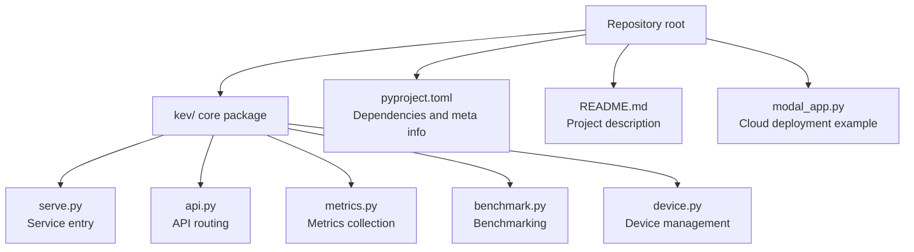

**Diagram Sources**
- [serve.py:1-200](file://kev/serve.py#L1-L200)
- [api.py:1-200](file://kev/api.py#L1-L200)
- [metrics.py:1-200](file://kev/metrics.py#L1-L200)
- [benchmark.py:1-200](file://kev/benchmark.py#L1-L200)
- [device.py:1-200](file://kev/device.py#L1-L200)
- [pyproject.toml:1-200](file://pyproject.toml#L1-L200)
- [README.md:1-200](file://README.md#L1-L200)
- [modal_app.py:1-200](file://modal_app.py#L1-L200)

**Section Sources**
- [README.md:1-200](file://README.md#L1-L200)
- [pyproject.toml:1-200](file://pyproject.toml#L1-L200)

## Core Components
- Service entry (serve.py): Responsible for process startup, port binding, middleware registration, and lifecycle management.
- API routing (api.py): Defines external HTTP interfaces, request validation, response structures, and error codes.
- Metrics collection (metrics.py): Exposes key system and application metrics for the monitoring system to scrape.
- Benchmarking (benchmark.py): Provides methods for evaluating throughput, latency, and resource utilization.
- Device management (device.py): Encapsulates GPU/CPU detection, memory management, and multi-card scheduling logic.
- Dependencies and packaging (pyproject.toml): Declares runtime dependencies, version constraints, and build configuration.
- Cloud deployment example (modal_app.py): Demonstrates containerized deployment on a cloud platform.

**Section Sources**
- [serve.py:1-200](file://kev/serve.py#L1-L200)
- [api.py:1-200](file://kev/api.py#L1-L200)
- [metrics.py:1-200](file://kev/metrics.py#L1-L200)
- [benchmark.py:1-200](file://kev/benchmark.py#L1-L200)
- [device.py:1-200](file://kev/device.py#L1-L200)
- [pyproject.toml:1-200](file://pyproject.toml#L1-L200)
- [modal_app.py:1-200](file://modal_app.py#L1-L200)

## Architecture Overview
The diagram below shows a typical deployment topology in a production environment: clients enter the service cluster through a reverse proxy, service instances internally invoke API routing, metrics are pulled by the monitoring system, and logs are routed to a centralized log platform after local rotation.

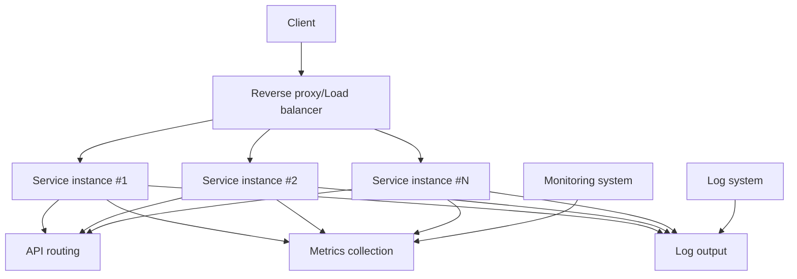

**Diagram Sources**
- [serve.py:1-200](file://kev/serve.py#L1-L200)
- [api.py:1-200](file://kev/api.py#L1-L200)
- [metrics.py:1-200](file://kev/metrics.py#L1-L200)

## Detailed Component Analysis

### Service Entry (serve.py)
- Responsibilities: Initialize the application, load configuration, register middleware, start the HTTP server, and gracefully shut down.
- Key points:
  - Port and environment variable injection
  - Health check endpoint mounting
  - Concurrency and timeout parameters
  - Integration with metrics and logging systems

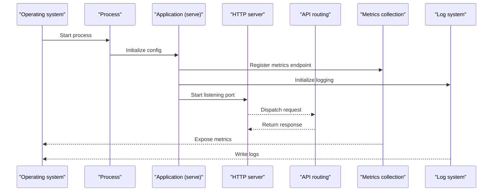

**Diagram Sources**
- [serve.py:1-200](file://kev/serve.py#L1-L200)
- [api.py:1-200](file://kev/api.py#L1-L200)
- [metrics.py:1-200](file://kev/metrics.py#L1-L200)

**Section Sources**
- [serve.py:1-200](file://kev/serve.py#L1-L200)

### API Routing (api.py)
- Responsibilities: Define REST/JSON interfaces, parameter validation, business processing, error codes, and retry strategies.
- Key points:
  - Input validation and rate limiting
  - Idempotency and caching strategies
  - Unified error response format
  - Instrumentation with metrics and logging

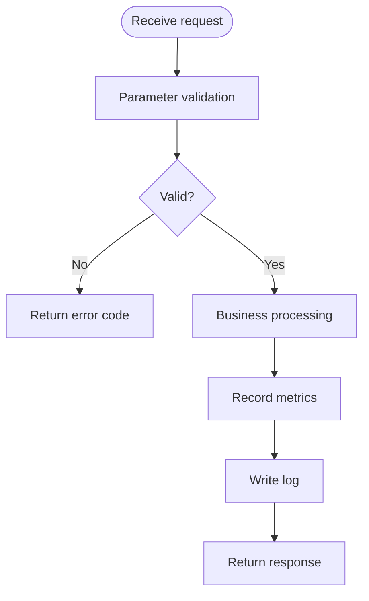

**Diagram Sources**
- [api.py:1-200](file://kev/api.py#L1-L200)
- [metrics.py:1-200](file://kev/metrics.py#L1-L200)

**Section Sources**
- [api.py:1-200](file://kev/api.py#L1-L200)

### Metrics Collection (metrics.py)
- Responsibilities: Expose system and application metrics such as QPS, latency percentiles, error rate, GPU utilization, and memory usage.
- Key points:
  - Metric naming conventions and label dimensions
  - Sampling frequency and aggregation windows
  - Integration with monitoring stacks such as Prometheus/Grafana

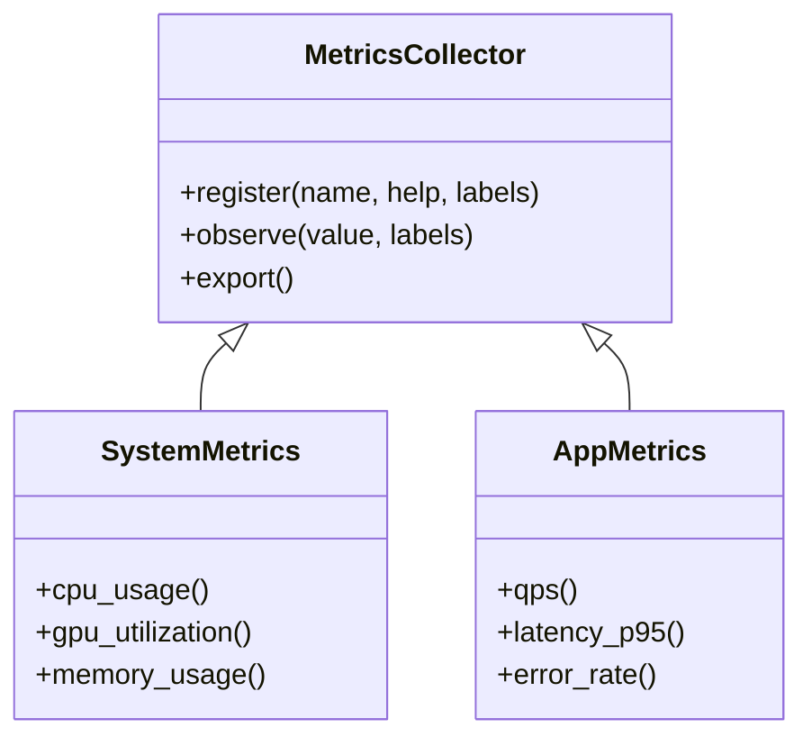

**Diagram Sources**
- [metrics.py:1-200](file://kev/metrics.py#L1-L200)

**Section Sources**
- [metrics.py:1-200](file://kev/metrics.py#L1-L200)

### Benchmarking (benchmark.py)
- Responsibilities: Provide end-to-end load testing scripts that measure throughput, latency, and resource consumption to assist capacity planning.
- Key points:
  - Concurrency and load curves
  - Metric export and result summarization
  - Coordination with the device management module

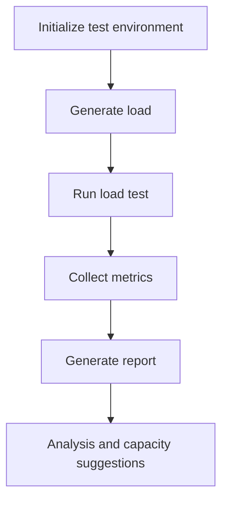

**Diagram Sources**
- [benchmark.py:1-200](file://kev/benchmark.py#L1-L200)
- [device.py:1-200](file://kev/device.py#L1-L200)

**Section Sources**
- [benchmark.py:1-200](file://kev/benchmark.py#L1-L200)

### Device Management (device.py)
- Responsibilities: Detect available GPU/CPU, allocate memory, perform multi-card parallelism, and isolate resources.
- Key points:
  - Device enumeration and affinity settings
  - Memory defragmentation and prewarming
  - Exception recovery and fallback strategies

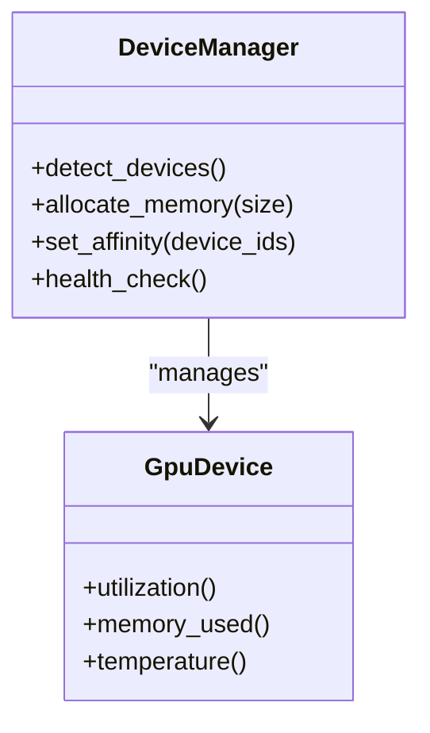

**Diagram Sources**
- [device.py:1-200](file://kev/device.py#L1-L200)

**Section Sources**
- [device.py:1-200](file://kev/device.py#L1-L200)

### Dependencies and Packaging (pyproject.toml)
- Responsibilities: Declare runtime dependencies, version constraints, build commands, and meta information.
- Key points:
  - Dependency minimization and security update strategy
  - Build artifacts and image layer optimization
  - Environment variable and configuration injection

**Section Sources**
- [pyproject.toml:1-200](file://pyproject.toml#L1-L200)

### Cloud Deployment Example (modal_app.py)
- Responsibilities: Demonstrate containerized deployment on a cloud platform, including resource limits, scaling, and network exposure.
- Key points:
  - Container image and startup command
  - Resource quotas and elastic scaling
  - External access and domain binding

**Section Sources**
- [modal_app.py:1-200](file://modal_app.py#L1-L200)

## Dependency Analysis
- The service entry depends on API routing, metrics collection, and the logging system.
- API routing depends on business logic and metric instrumentation.
- Metrics collection depends on system and application state.
- Benchmarking depends on device management and metric export.
- Device management depends on underlying drivers and system libraries.

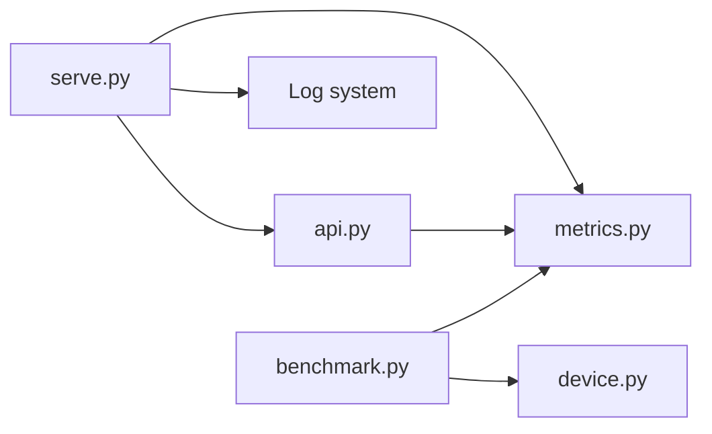

**Diagram Sources**
- [serve.py:1-200](file://kev/serve.py#L1-L200)
- [api.py:1-200](file://kev/api.py#L1-L200)
- [metrics.py:1-200](file://kev/metrics.py#L1-L200)
- [benchmark.py:1-200](file://kev/benchmark.py#L1-L200)
- [device.py:1-200](file://kev/device.py#L1-L200)

**Section Sources**
- [serve.py:1-200](file://kev/serve.py#L1-L200)
- [api.py:1-200](file://kev/api.py#L1-L200)
- [metrics.py:1-200](file://kev/metrics.py#L1-L200)
- [benchmark.py:1-200](file://kev/benchmark.py#L1-L200)
- [device.py:1-200](file://kev/device.py#L1-L200)

## Performance and Capacity Planning
- Benchmarking methods:
  - Use the benchmarking module to construct different concurrency and load curves, measuring QPS, P95/P99 latency, and error rate.
  - Combine with the device management module to observe GPU utilization, memory usage, and temperature to identify bottlenecks.
  - Export metrics to the monitoring system to form trend charts and capacity baselines.
- Capacity planning recommendations:
  - Determine single-instance capacity based on peak QPS and P95 latency targets, then calculate the instance count based on redundancy and canary requirements.
  - Reserve a 20%-30% resource buffer to handle burst traffic and thrashing.
  - Periodically re-test and update the capacity model, incorporating it into the change review process.

[This section is general guidance and does not directly analyze specific files]

## Monitoring and Alerting
- Key metric definitions:
  - System-level: CPU usage, memory usage, disk I/O, network throughput.
  - Application-level: QPS, latency percentiles, error rate, queue length, cache hit rate.
  - Device-level: GPU utilization, memory usage, temperature, power consumption.
- Threshold settings:
  - Set multi-level thresholds (warning, critical) based on historical baselines and SLI/SLO.
  - Use sliding windows and percentile statistics for bursts and long-tail latency.
- Notification channels:
  - Integration with email, IM, phone, and ticketing systems.
  - Alert convergence and deduplication to avoid alert storms.

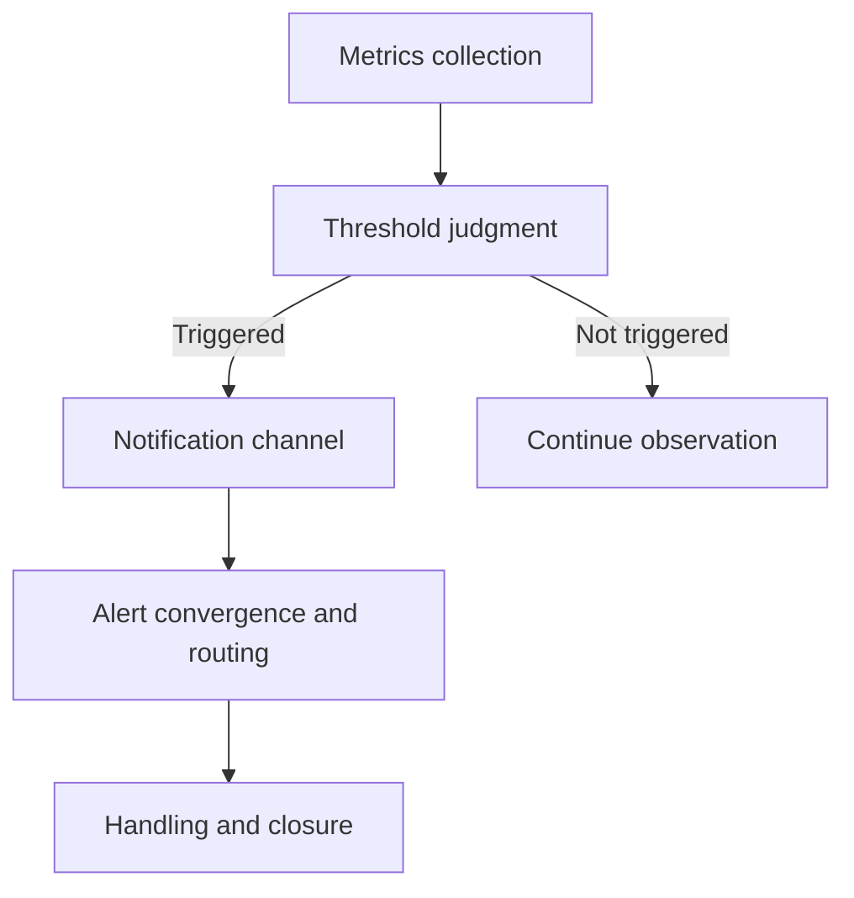

**Diagram Sources**
- [metrics.py:1-200](file://kev/metrics.py#L1-L200)

**Section Sources**
- [metrics.py:1-200](file://kev/metrics.py#L1-L200)

## Log Collection and Management
- Structured log format:
  - Unified fields: timestamp, level, service name, instance ID, request ID, user ID, operation, result, duration, error code.
  - JSON or key-value format for easy parsing and retrieval.
- Log rotation:
  - Rotate on both size and time dimensions, with retention period and compression strategy.
  - Asynchronous writes and backpressure control to avoid blocking the main flow.
- Centralized storage:
  - Forward to a centralized platform via a log collector, building indexes and query views.
  - Sensitive information desensitization and access control.

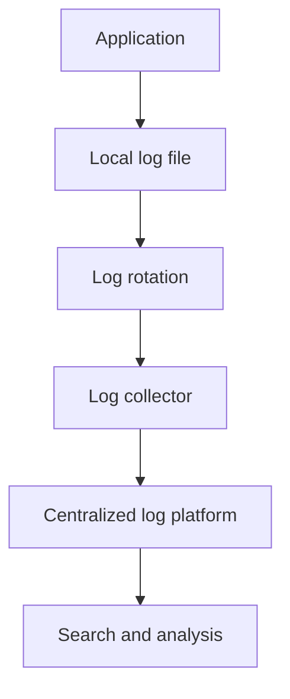

[This section is general guidance and does not directly analyze specific files]

## Load Balancing and Auto Scaling
- Reverse proxy settings:
  - Enable HTTPS termination, TLS certificate management, request header rewriting, and path mapping.
  - Connection pool and timeout configuration to ensure stability under high concurrency.
- Session affinity:
  - Sticky sessions based on Cookie or IP hash to ensure state consistency.
  - Stateless service design is preferred; use external session storage when necessary.
- Health checks:
  - Liveness and readiness probes, combined with business semantics for deep checks.
  - Separate failure and recovery thresholds to avoid frequent up/down transitions.
- Auto scaling strategy:
  - HPA/VPA rules based on CPU/GPU utilization and queue length.
  - Minimum/maximum instance counts, cooldown time, and step scaling.
  - Rolling updates and blue-green/canary releases to reduce risk.

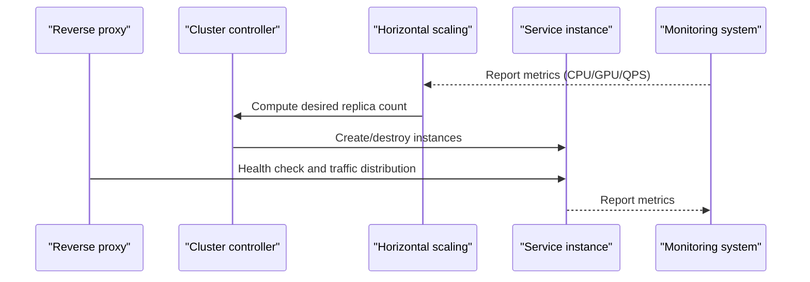

**Diagram Sources**
- [serve.py:1-200](file://kev/serve.py#L1-L200)
- [metrics.py:1-200](file://kev/metrics.py#L1-L200)

**Section Sources**
- [serve.py:1-200](file://kev/serve.py#L1-L200)
- [metrics.py:1-200](file://kev/metrics.py#L1-L200)

## Security Hardening
- Network security policies:
  - Only open necessary ports, following the principle of least privilege.
  - Encrypt intranet communication and use mutual authentication.
- Access control lists:
  - Fine-grained authorization based on roles and resources.
  - Authentication and rate limiting at the API gateway layer.
- Audit logging:
  - Record all management-plane operations and sensitive data access.
  - Tamper-proofing and compliant retention.

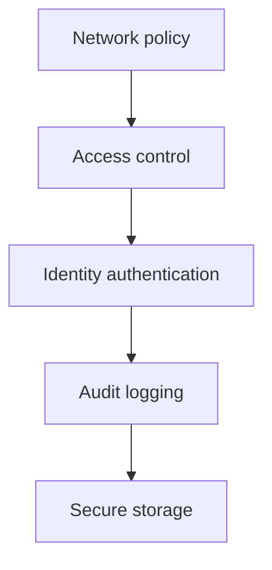

[This section is general guidance and does not directly analyze specific files]

## Troubleshooting Guide
- Common problem localization:
  - Service cannot start: Check port occupancy, missing dependencies, and configuration errors.
  - High latency and low throughput: Check metric percentiles, GPU utilization, and memory usage.
  - Health check failure: Confirm business readiness conditions and dependent service status.
- Diagnostic steps:
  - Start from the reverse proxy logs to locate the request chain.
  - Cross-validate with metrics and logs to narrow down the problem scope.
  - Use benchmarking to reproduce the problem and verify the fix.

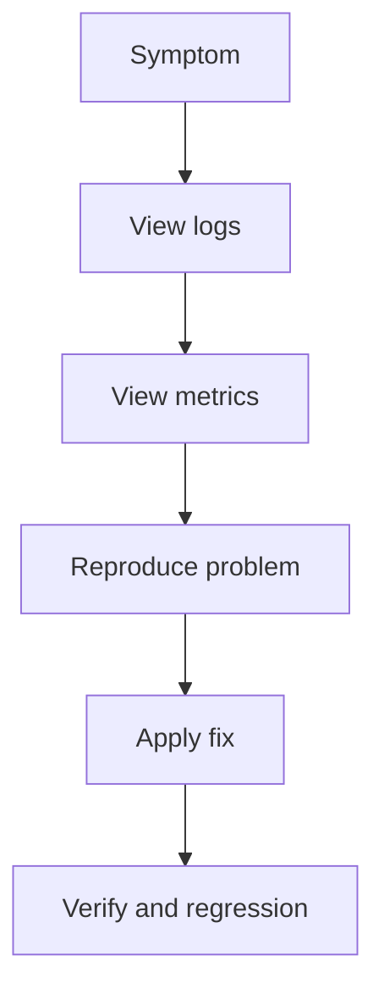

[This section is general guidance and does not directly analyze specific files]

## Conclusion
By integrating the service entry, API routing, metrics collection, benchmarking, and device management modules into a unified operations system, together with a reverse proxy, health checks, auto scaling, and centralized logging, a stable, observable, and scalable production environment can be achieved. It is recommended to complete capacity planning and load testing before launch, continuously iterate on monitoring thresholds and alerting strategies, and ensure security and compliance.
