## Table of Contents
1. [Introduction](#introduction)
2. [Project Structure](#project-structure)
3. [Core Components](#core-components)
4. [Architecture Overview](#architecture-overview)
5. [Detailed Component Analysis](#detailed-component-analysis)
6. [Dependency Analysis](#dependency-analysis)
7. [Performance and Reliability Considerations](#performance-and-reliability-considerations)
8. [Troubleshooting Guide](#troubleshooting-guide)
9. [Conclusion](#conclusion)

## Introduction
This document focuses on the "release infrastructure", tracing the complete chain from model checkpoints to distributable artifacts, and from local scripts to continuous integration and containerized deployment. The content covers:
- Release orchestration and artifact building
- Checkpoint release and confirmation flow
- Metric and version number generation
- Space/service publishing scripts
- CI pipeline and containerized deployment entry points

## Project Structure
The infrastructure around releases is mainly distributed across the following locations:
- Python release tooling and interfaces: kev/publish.py
- Release-related scripts: scripts/* (artifact building, checkpoint release, confirmation, number statistics, space publishing)
- Continuous integration: .github/workflows/ci.yml
- Deployment and containerization: deploy.sh, modal_app.py, docker-compose.yml, Dockerfile

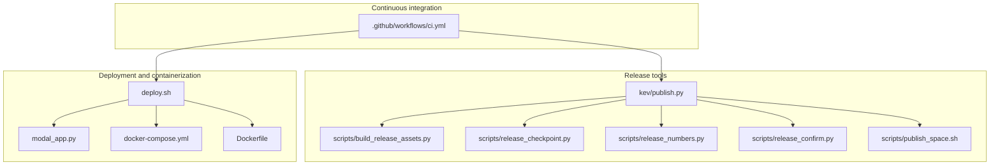

**Diagram Sources**
- [kev/publish.py](file://kev/publish.py)
- [scripts/build_release_assets.py](file://scripts/build_release_assets.py)
- [scripts/release_checkpoint.py](file://scripts/release_checkpoint.py)
- [scripts/release_numbers.py](file://scripts/release_numbers.py)
- [scripts/release_confirm.py](file://scripts/release_confirm.py)
- [scripts/publish_space.sh](file://scripts/publish_space.sh)
- [.github/workflows/ci.yml](file://.github/workflows/ci.yml)
- [deploy.sh](file://deploy.sh)
- [modal_app.py](file://modal_app.py)
- [docker-compose.yml](file://docker-compose.yml)
- [Dockerfile](file://Dockerfile)

**Section Sources**
- [kev/publish.py](file://kev/publish.py)
- [scripts/build_release_assets.py](file://scripts/build_release_assets.py)
- [scripts/release_checkpoint.py](file://scripts/release_checkpoint.py)
- [scripts/release_numbers.py](file://scripts/release_numbers.py)
- [scripts/release_confirm.py](file://scripts/release_confirm.py)
- [scripts/publish_space.sh](file://scripts/publish_space.sh)
- [.github/workflows/ci.yml](file://.github/workflows/ci.yml)
- [deploy.sh](file://deploy.sh)
- [modal_app.py](file://modal_app.py)
- [docker-compose.yml](file://docker-compose.yml)
- [Dockerfile](file://Dockerfile)

## Core Components
- Release orchestrator: Responsible for chaining together artifact building, checkpoint release, metric computation, and space publishing, providing a unified CLI or API entry point.
- Artifact builder: Packages training outputs, configuration, and evaluation results into distributable release assets.
- Checkpoint publisher: Uploads the selected checkpoint to target storage and generates metadata.
- Number statistics generator: Aggregates key metrics and version information, outputting data for release notes and dashboards.
- Release confirmer: Performs consistency checks and manual confirmation before release.
- Space publishing script: Pushes front-end/documentation/demo spaces to the hosting platform.
- CI pipeline: Triggers build, test, and release tasks, ensuring quality gates.
- Deployment and containerization: Provides service capabilities via Docker and Modal.

**Section Sources**
- [kev/publish.py](file://kev/publish.py)
- [scripts/build_release_assets.py](file://scripts/build_release_assets.py)
- [scripts/release_checkpoint.py](file://scripts/release_checkpoint.py)
- [scripts/release_numbers.py](file://scripts/release_numbers.py)
- [scripts/release_confirm.py](file://scripts/release_confirm.py)
- [scripts/publish_space.sh](file://scripts/publish_space.sh)

## Architecture Overview
The diagram below shows the end-to-end flow from code commit to artifact release, as well as the call relationships between components.

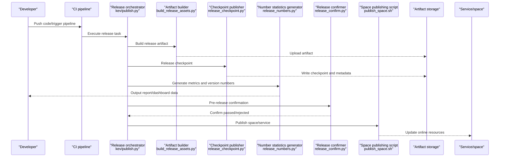

**Diagram Sources**
- [.github/workflows/ci.yml](file://.github/workflows/ci.yml)
- [kev/publish.py](file://kev/publish.py)
- [scripts/build_release_assets.py](file://scripts/build_release_assets.py)
- [scripts/release_checkpoint.py](file://scripts/release_checkpoint.py)
- [scripts/release_numbers.py](file://scripts/release_numbers.py)
- [scripts/release_confirm.py](file://scripts/release_confirm.py)
- [scripts/publish_space.sh](file://scripts/publish_space.sh)

## Detailed Component Analysis

### Release Orchestrator (kev/publish.py)
Responsibilities and key points:
- Unified entry point: Aggregates sub-tasks such as artifact building, checkpoint release, metric statistics, and space publishing.
- Parameter parsing: Receives options such as version, branch, environment, storage path, and whether to skip confirmation.
- Flow control: Executes each stage in order, with support for failure rollback and retry strategies.
- Logging and auditing: Records key steps and output locations for easy tracing and post-mortem.

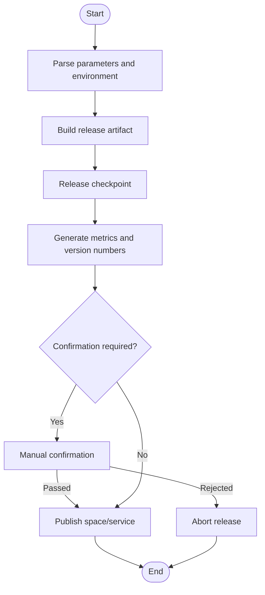

**Diagram Sources**
- [kev/publish.py](file://kev/publish.py)

**Section Sources**
- [kev/publish.py](file://kev/publish.py)

### Artifact Builder (scripts/build_release_assets.py)
Responsibilities and key points:
- Collect training outputs, configuration files, evaluation results, and change logs.
- Generate standardized directory structure and manifest files.
- Compression and signing (optional) to ensure artifact integrity and traceability.

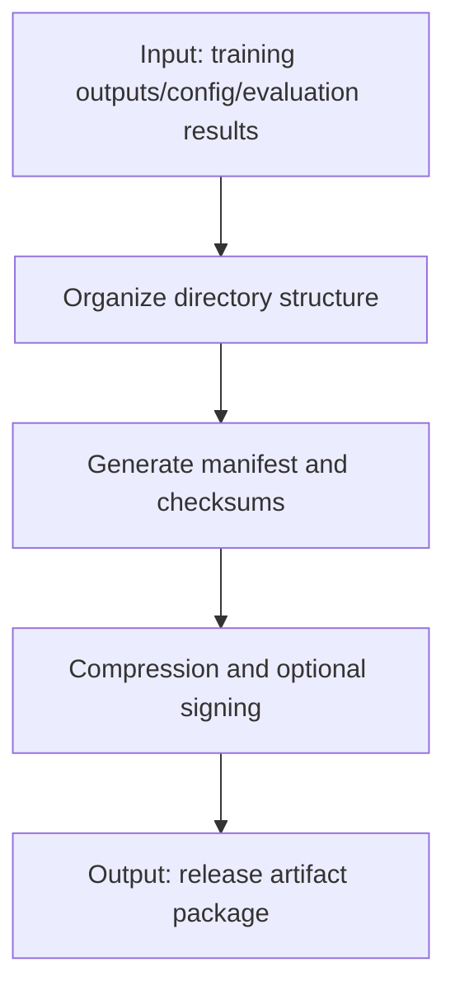

**Diagram Sources**
- [scripts/build_release_assets.py](file://scripts/build_release_assets.py)

**Section Sources**
- [scripts/build_release_assets.py](file://scripts/build_release_assets.py)

### Checkpoint Publisher (scripts/release_checkpoint.py)
Responsibilities and key points:
- Select target checkpoint (by version/round/metric threshold).
- Upload to object storage or model repository, generating index and metadata.
- Validate upload integrity and record release snapshot.

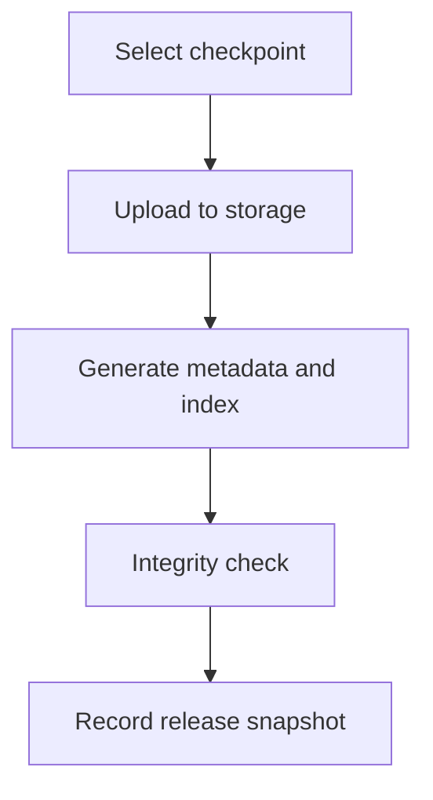

**Diagram Sources**
- [scripts/release_checkpoint.py](file://scripts/release_checkpoint.py)

**Section Sources**
- [scripts/release_checkpoint.py](file://scripts/release_checkpoint.py)

### Number Statistics Generator (scripts/release_numbers.py)
Responsibilities and key points:
- Aggregate key metrics (e.g. accuracy, latency, throughput).
- Compare against baseline/historical versions, generating a diff report.
- Output structured data for dashboards and release notes.

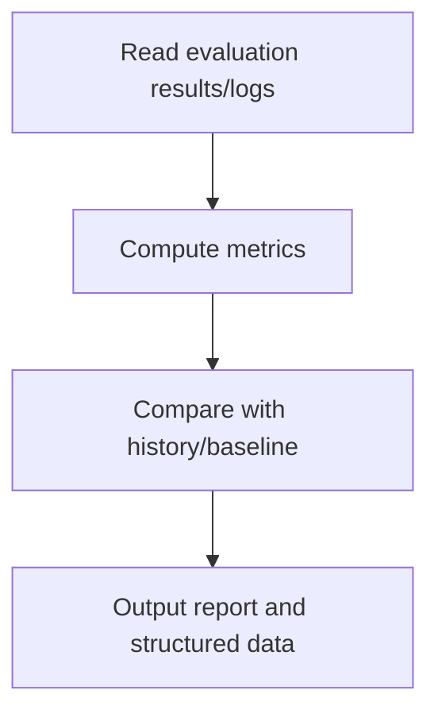

**Diagram Sources**
- [scripts/release_numbers.py](file://scripts/release_numbers.py)

**Section Sources**
- [scripts/release_numbers.py](file://scripts/release_numbers.py)

### Release Confirmer (scripts/release_confirm.py)
Responsibilities and key points:
- Perform consistency checks before release (artifact hash, checkpoint index, metric thresholds).
- Support manual approval flow, recording approval comments and timestamps.
- If not passed, block subsequent release actions.

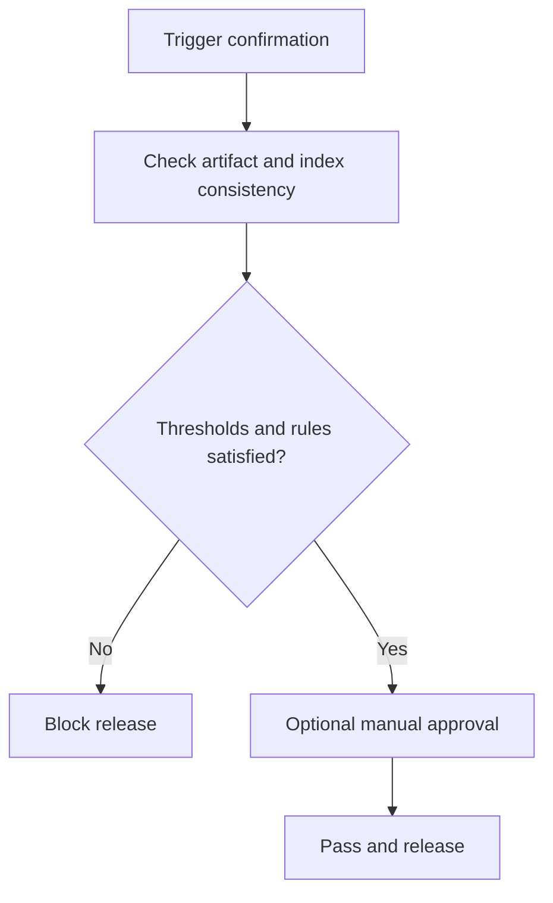

**Diagram Sources**
- [scripts/release_confirm.py](file://scripts/release_confirm.py)

**Section Sources**
- [scripts/release_confirm.py](file://scripts/release_confirm.py)

### Space Publishing Script (scripts/publish_space.sh)
Responsibilities and key points:
- Push front-end/documentation/demo spaces to the hosting platform.
- Handle environment variable and credential injection.
- Return a release status code and link for easy CI integration.

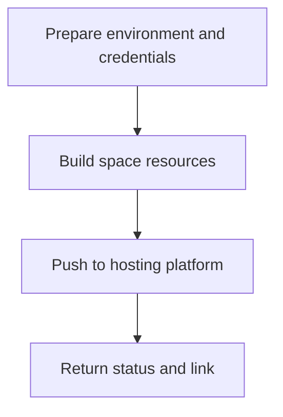

**Diagram Sources**
- [scripts/publish_space.sh](file://scripts/publish_space.sh)

**Section Sources**
- [scripts/publish_space.sh](file://scripts/publish_space.sh)

### Continuous Integration (.github/workflows/ci.yml)
Responsibilities and key points:
- Listen for code changes and trigger build, test, and release tasks.
- Execute multi-stage tasks in parallel, with timeout and caching strategies.
- Invoke the release orchestrator and deployment scripts on successful stages.

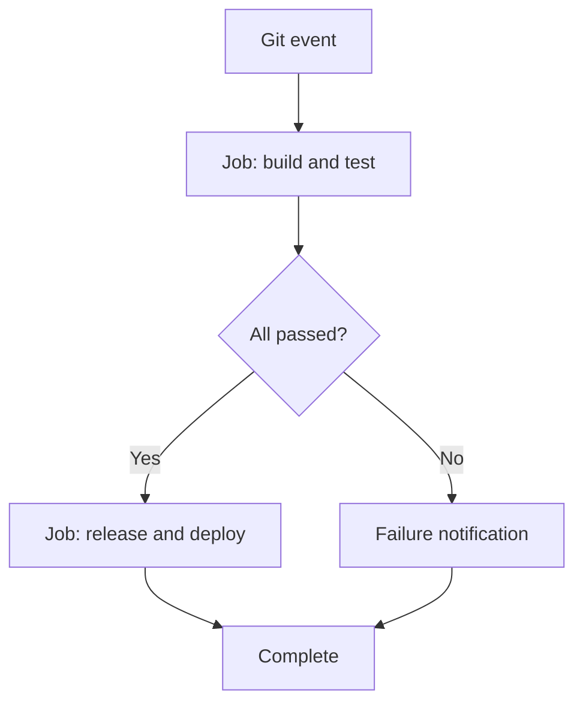

**Diagram Sources**
- [.github/workflows/ci.yml](file://.github/workflows/ci.yml)

**Section Sources**
- [.github/workflows/ci.yml](file://.github/workflows/ci.yml)

### Deployment and Containerization (deploy.sh / modal_app.py / docker-compose.yml / Dockerfile)
Responsibilities and key points:
- deploy.sh: Encapsulates one-click deployment commands, coordinating container and service startup.
- Dockerfile: Defines image build steps and runtime environment.
- docker-compose.yml: Orchestrates multi-service dependencies (e.g. inference service, monitoring, logging).
- modal_app.py: Deployment entry point for cloud functions/services.

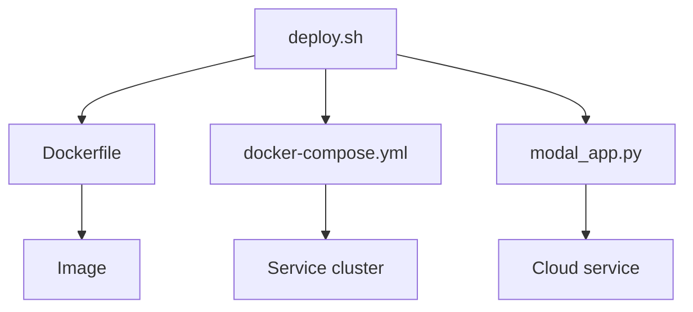

**Diagram Sources**
- [deploy.sh](file://deploy.sh)
- [Dockerfile](file://Dockerfile)
- [docker-compose.yml](file://docker-compose.yml)
- [modal_app.py](file://modal_app.py)

**Section Sources**
- [deploy.sh](file://deploy.sh)
- [modal_app.py](file://modal_app.py)
- [docker-compose.yml](file://docker-compose.yml)
- [Dockerfile](file://Dockerfile)

## Dependency Analysis
- Component coupling:
  - The release orchestrator depends on the artifact builder, checkpoint publisher, number statistics generator, release confirmer, and space publishing script.
  - The CI pipeline drives the release orchestrator and deployment scripts.
  - The deployment scripts depend on the container image and service orchestration files.
- External dependencies:
  - Object storage/model repository (for checkpoint and artifact uploads).
  - Hosting platform (for space/service publishing).
  - Cloud platform SDK (Modal, etc.).

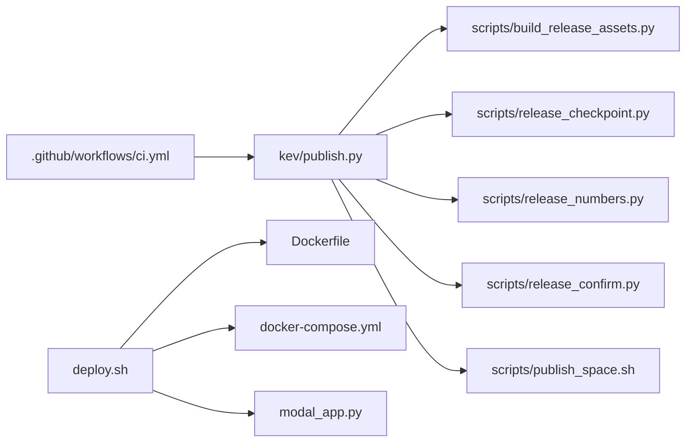

**Diagram Sources**
- [.github/workflows/ci.yml](file://.github/workflows/ci.yml)
- [kev/publish.py](file://kev/publish.py)
- [scripts/build_release_assets.py](file://scripts/build_release_assets.py)
- [scripts/release_checkpoint.py](file://scripts/release_checkpoint.py)
- [scripts/release_numbers.py](file://scripts/release_numbers.py)
- [scripts/release_confirm.py](file://scripts/release_confirm.py)
- [scripts/publish_space.sh](file://scripts/publish_space.sh)
- [deploy.sh](file://deploy.sh)
- [Dockerfile](file://Dockerfile)
- [docker-compose.yml](file://docker-compose.yml)
- [modal_app.py](file://modal_app.py)

**Section Sources**
- [kev/publish.py](file://kev/publish.py)
- [.github/workflows/ci.yml](file://.github/workflows/ci.yml)
- [deploy.sh](file://deploy.sh)

## Performance and Reliability Considerations
- Concurrency and caching:
  - The CI executes build and test in parallel to reduce overall time.
  - Artifact and dependency caches are reused to improve repeated build efficiency.
- Idempotency and rollback:
  - The release process is idempotent, supporting failure retry and partial rollback.
  - Both checkpoints and artifacts carry checksums to ensure consistency.
- Observability and alerting:
  - Key steps output structured logs for easy retrieval and alerting.
  - After release completes, status and links are automatically reported and incorporated into the monitoring dashboard.

[This section is general guidance and does not directly analyze specific files]

## Troubleshooting Guide
Common issues and localization suggestions:
- Artifact build failure:
  - Check whether the input artifacts exist and are in the correct format; review the error stack in the build log.
  - Confirm dependency installation and permission configuration.
- Checkpoint upload failure:
  - Verify storage credentials and network connectivity; check target bucket/repository permissions.
  - Verify checkpoint size and timeout configuration.
- Metric statistics anomaly:
  - Confirm evaluation result paths and field naming are consistent; check threshold configuration.
- Release confirmation rejected:
  - Review consistency check results and threshold rules; adjust rules or add materials as needed.
- Space publishing failure:
  - Check hosting platform credentials and quota; confirm build artifact integrity.
- Deployment failure:
  - Check Docker image build logs and service orchestration configuration; confirm ports and dependent services are available.

**Section Sources**
- [scripts/build_release_assets.py](file://scripts/build_release_assets.py)
- [scripts/release_checkpoint.py](file://scripts/release_checkpoint.py)
- [scripts/release_numbers.py](file://scripts/release_numbers.py)
- [scripts/release_confirm.py](file://scripts/release_confirm.py)
- [scripts/publish_space.sh](file://scripts/publish_space.sh)
- [Dockerfile](file://Dockerfile)
- [docker-compose.yml](file://docker-compose.yml)

## Conclusion
This release infrastructure centers on the "release orchestrator", chaining artifact building, checkpoint release, metric statistics, release confirmation, and space publishing, and achieves automation and observability through the CI pipeline and containerized deployment. The following areas are recommended for continuous optimization:
- Enhance the visualization and auditing capabilities of the release process
- Improve failure recovery and canary release mechanisms
- Expand multi-platform/multi-cloud deployment support
- Strengthen security and compliance checks (signing, scanning, compliance checklists)

[This section is a summary and does not directly analyze specific files]
