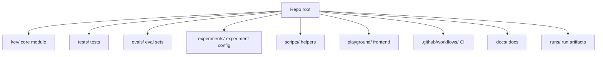
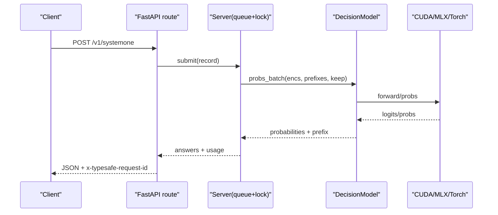
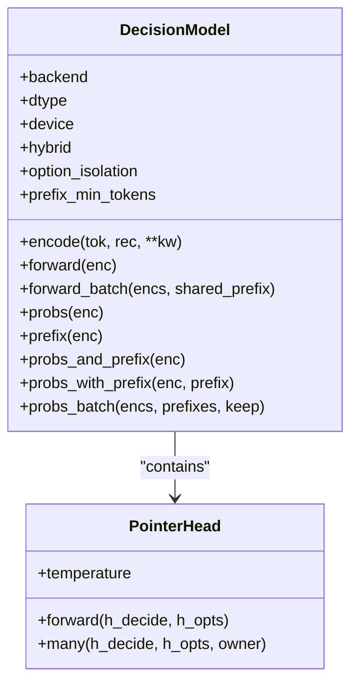
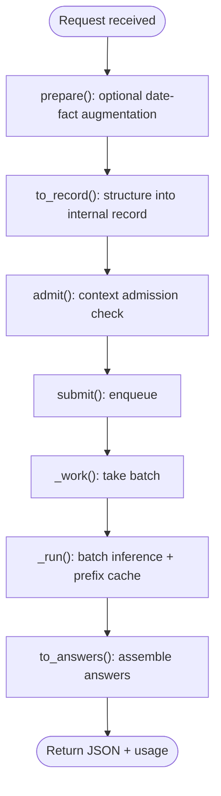
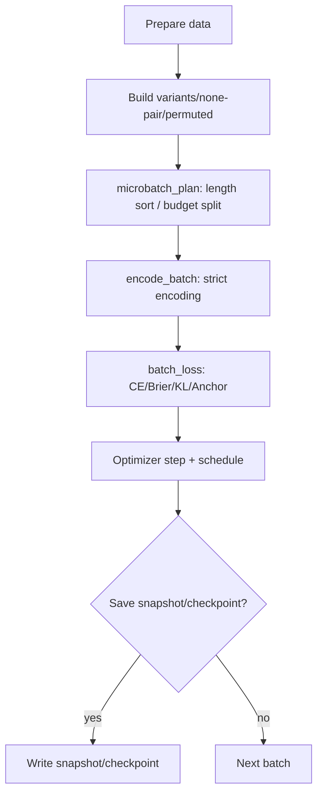
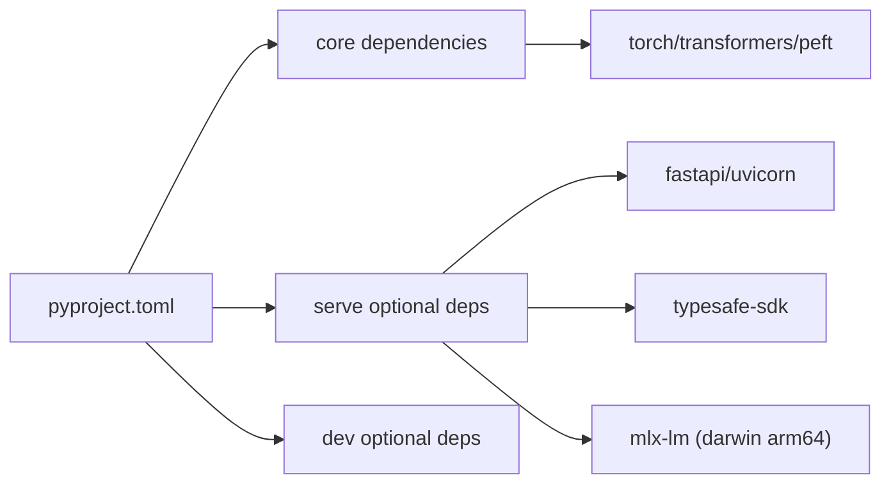
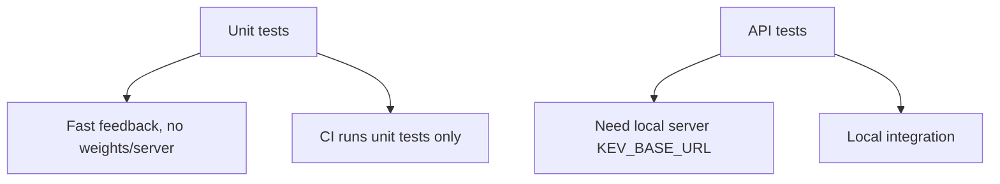
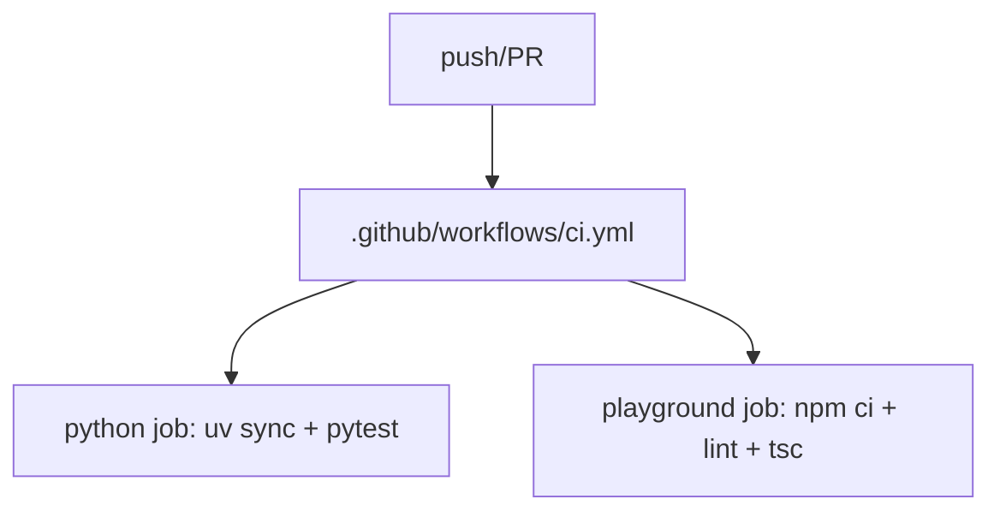

## Table of Contents
1. Introduction
2. Project Structure
3. Core Components
4. Architecture Overview
5. Detailed Component Analysis
6. Dependency Analysis
7. Performance and Capacity Planning
8. Testing Strategy
9. Code Conventions
10. Continuous Integration
11. Debugging Tips and Common Tools
12. Contributing Guide
13. Experiment Management
14. Conclusion

## Introduction
Kev is a family of small decision models built on Qwen3.5/Qwen3.8, providing a TypeSafe System One compatible inference API. It supports three question types — yes/no (noul), choice, and score — outputs calibrated probabilities by default, and offers complete capabilities for LoRA fine-tuning, full fine-tuning, local/cloud deployment, and evaluation benchmarks. This guide is for developers and covers environment setup, module responsibilities, dependency relationships, testing, CI, debugging, contribution, and experiment management.

## Project Structure
The repo is organized in layers: "Python core + frontend Playground + evaluation data + experiment config":
- kev/: Python core implementation (model, training, serving, evaluation, utilities)
- tests/: unit tests, API consistency tests, MLX backend verification, etc.
- evals/: frozen evaluation sets and manifests
- experiments/: experiment plans and versioned configs
- scripts/: helper scripts for data processing, report generation, interpolation, etc.
- playground/: Next.js interactive frontend
- .github/workflows: CI pipelines
- docs/: model cards and documentation
- runs/: training/evaluation run artifacts (generated by the user or CI)

## Core Components
- Model and inference
  - Encoder and attention mask: pack state and multiple question branches into a single sequence, using a block-causal mask to isolate questions from each other; for hybrid backbones (including Gated DeltaNet) it automatically switches to row-form inference.
  - Pointer head: scores the hidden states of each question's `<decide>` and option `</opt>`; optional temperature calibration at inference time.
  - Prefix cache: caches state KV on the server to avoid recomputing long documents.
- Training
  - LoRA and full fine-tuning: incremental fine-tuning from a base or a trained checkpoint; supports shared prefix, length sorting, micro-batch splitting, gradient clipping, snapshots, and resume.
- Serving
  - FastAPI gateway: exposes `/v1/systemone` and demo endpoints; Bearer auth; request-id passthrough; state prefix cache and OOM recovery.
- Evaluation
  - Benchmark: accuracy, Brier, calibration error, automation ratio, option-order stability, question isolation.

## Architecture Overview
Kev's core pipeline: client → FastAPI service → model thread → inference backend (CUDA/MLX/Torch) → returns answers and usage stats. On the training side, train.py loads datasets, builds variants, runs optimization, and saves checkpoints.

## Detailed Component Analysis

### Model and Inference (DecisionModel)
- Encoding and context limits
  - encode() packs state and multiple question branches, maintaining seg/pos/opt metadata; supports option_isolation to construct strict permutation invariance.
  - admit()/ContextOverflow performs context admission checks on the server, rejecting over-long states or branches.
- Mask and row form
  - branch_mask/branch_mask_batch implement the block-causal mask; when the backbone is hybrid or the packed sequence is too long, it switches to rows_form row-form inference.
- Pointer head and temperature
  - PointerHead scales logits by temperature in eval mode; training always uses T=1.
- Prefix cache and batching
  - prefix()/probs_and_prefix()/probs_with_prefix() reuse state KV; probs_batch() combines CUDA Graphs for batched scheduling.

### Serving (FastAPI + Server)
- Routes and auth
  - `/v1/systemone` main entry; `/v1/models` model card; demo endpoints permute/separate.
  - Bearer auth (KEV_API_KEY); response header x-typesafe-request-id.
- Request handling
  - prepare() optionally augments with date facts; to_record/to_answers map inputs and outputs.
  - Server.submit() enqueues; _work() is consumed by a single model thread; _run() batches and maintains PrefixCache.
- Prefix cache
  - PrefixCache controls size/min_tokens/max_tokens, LRU eviction, clears and retries once on OOM.

### Training (LoRA / Full Fine-Tuning)
- Data and variants
  - training_requests() supports a frozen suite, custom JSONL, and replay sampling; filters eval-only sources.
  - record_variants() generates augmented copies and none-pair siblings; permuted_copy() is used for permutation KL.
- Batches and memory
  - microbatch_plan() supports length_sort and pass_tokens_max to control padded tokens; row_passes() splits forward/backward by budget.
- Loss and optimization
  - question_loss() supports CE/Brier/Focal/ordinal regression; anchor_loss/permutation_kl are optional regularizers.
  - MasterAdamW (full) or AdamW (LoRA), OneCycleLR scheduler, gradient clipping.
- Checkpoints and snapshots
  - supports resume, staged snapshots, and weight interpolation (WiSE-FT).

## Dependency Analysis
- Python runtime and core libraries
  - Python >=3.12,<3.14; torch>=2.6,<2.9; transformers>=5.17,<6; accelerate/datasets/peft/pydantic/scikit-learn.
- Optional dependencies
  - serve: fastapi/typesafe-sdk/uvicorn; mlx-lm optional on Apple Silicon.
  - dev: httpx/matplotlib/modal/pytest.
- Key couplings
  - serve.py depends on api/checkpoint/device/model; train.py depends on data/suite/model/full_ft; tests cover unit/api/mlx paths.

## Performance and Capacity Planning
- Inference
  - GPU choice and throughput are in the README table; bf16 by default, fp32 for reproducible eval; CUDA Graphs on by default to reduce kernel launch overhead.
  - Prefix cache hits significantly reduce repeated-document cost; MLX auto-enables on Apple Silicon.
- Training
  - bf16 autocast + fp32 master (full); MPS releases cache each step; length_sort/pass_tokens_max cap padded tokens.
- Capacity guidance
  - Kev-4B needs ~17 GB VRAM; Kev-27B ~51 GB weights + buffer; on Mac the full weights load directly without merging.

## Testing Strategy
- Unit tests (no weights, no server)
  - cover API mapping, confidence formula, mask rules, tokenizer safety, prefix-cache behavior, OOM recovery, CUDA Graphs grouping, etc.
  - Command: `uv run --extra serve python -m pytest tests/test_unit.py -q`
- API consistency tests (require a running server)
  - verify TypeSafe example requests, SDK sync/async clients, model-card fields, over-long state rejection and truncation marks.
  - Command: `KEV_BASE_URL=http://127.0.0.1:8009 uv run --extra serve python -m pytest tests/test_api.py -q`
- Other tests
  - research/generator/convention/doc-tools/hard/devtools/breadth/rounds/skill-scripts all run in CI.

## Code Conventions
- Naming and style
  - Python modules are snake_case; functions/variables snake_case; classes PascalCase; constants UPPER_SNAKE_CASE.
  - Use pydantic for request/response modeling; prefer clear exceptions (e.g. ContextOverflow) for errors.
- Comment standards
  - Module-level docstrings describe responsibility and usage; key functions document parameters/return values; inline comments explain design trade-offs for complex logic.
- Commit message format
  - Follow Conventional Commits: `<type>(<scope>): <subject>`, e.g. `feat(train): add length_sort for balanced micro-batches`.
- Typing and validation
  - All external input is validated by pydantic; the serving layer uses uniform 422 error semantics; logs and metrics keep only the minimum necessary information.

## Continuous Integration
- Triggers
  - push to main and all pull_requests.
- Jobs
  - python: install dependencies (including serve extra), run the unit-test suite (no server, no weights).
  - playground: Node 22, npm ci, lint, Next typegen and tsc type checking.

## Debugging Tips and Common Tools
- Common issues
  - MPS out of memory: ensure a single task runs; avoid output_hidden_states and peft trainable_token_indices.
  - Playground buttons unresponsive: use localhost:3001; adjust allowedDevOrigins if needed.
  - datasets script unsupported: use legacy-datasets/banking77 (the repo is adapted).
- Diagnostic endpoints
  - `/v1/models` shows backend, precision, temperature, prefix-cache stats, CUDA Graphs stats.
  - `/v1/systemone/permute` observes how option order affects probabilities; `/v1/systemone/separate` compares packed vs separate.
- Environment variables
  - KEV_TEMPERATURE/KEV_DATE_FACTS/KEV_TRUNCATE_STATES/KEV_DTYPE/KEV_API_KEY control behavior.

## Contributing Guide
- Branching strategy
  - main is protected; feature branches are prefixed with feat/fix/chore; commit messages follow Conventional Commits.
- Pull Request flow
  - Self-test: run unit and API tests locally; start the local service to verify the end-to-end flow when needed.
  - Review: focus on the blast radius (model/serving/training/eval) and include necessary cases and results.
- Code review criteria
  - Correctness: boundary conditions, error handling, type validation complete.
  - Performance: avoid unnecessary full copies; use caching and batching sensibly.
  - Maintainability: clear module boundaries and comments; new config needs defaults and env-var switches.

## Experiment Management
- Experiment config
  - experiments/*.json define training plans; study_v3 and similar scripts drive multi-round experiments on Modal.
- Result recording
  - runs/<name>/training_config.json records parameters, suite sha256, base revision, init_source, etc.; metrics and grad_norm are summarized.
- Model version control
  - Checkpoint.meta records base/lora/head_dim/weights_dtype/holdout, etc.; head.pt carries the pointer head and temperature; supports loading from a Hub ID or local directory.
- Weight interpolation and snapshots
  - interpolate_checkpoint.py supports WiSE-FT style linear interpolation; full_ft supports staged snapshots and resume.

## Conclusion
Kev provides an integrated decision-model solution from training to serving. Through clear module boundaries, strict context and mask design, complete testing and CI, and flexible experiment and deployment capabilities, developers can rapidly iterate on their own decision tasks and run them stably in production. When contributing, follow the conventions in this guide, make full use of evaluation and debugging tools, and ensure quality and efficiency.
