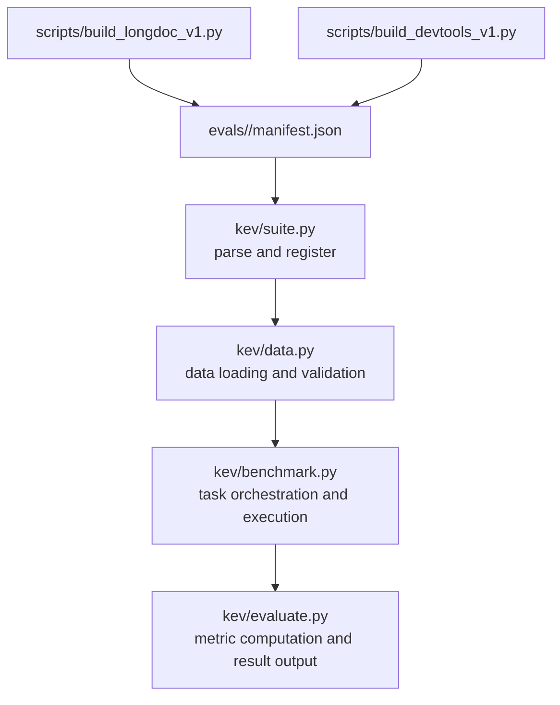
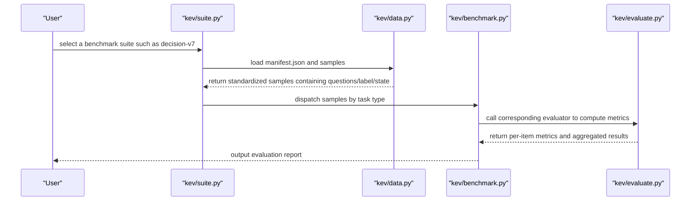
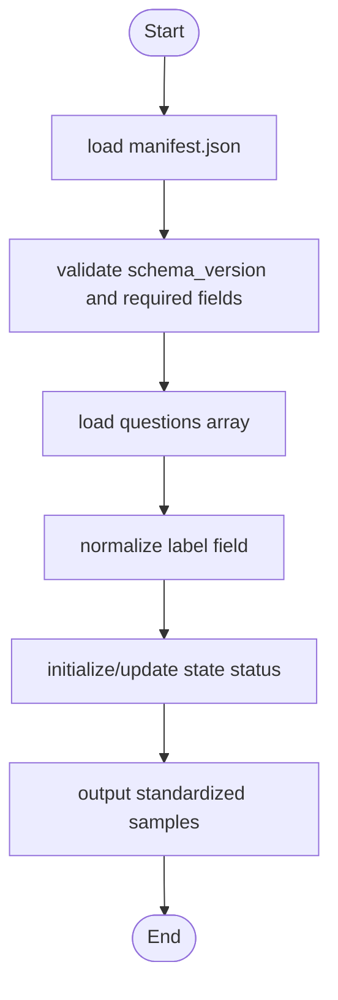
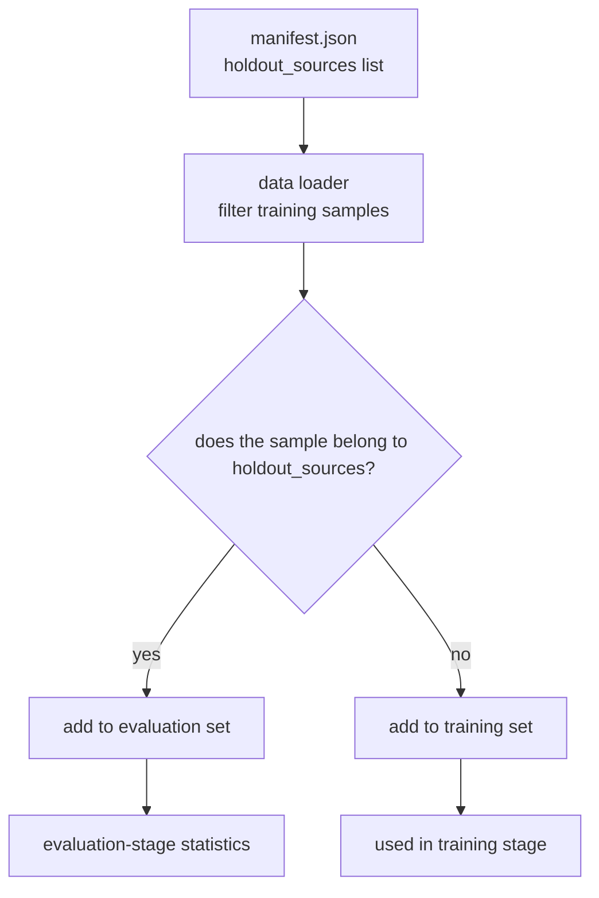
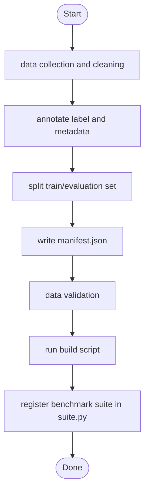
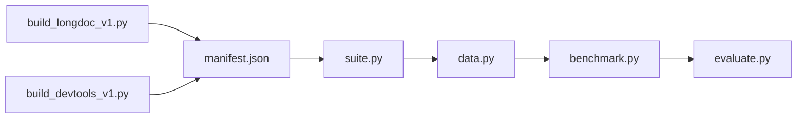

## Table of Contents
1. [Introduction](#introduction)
2. [Project Structure](#project-structure)
3. [Core Components](#core-components)
4. [Architecture Overview](#architecture-overview)
5. [Detailed Component Analysis](#detailed-component-analysis)
6. [Dependency Analysis](#dependency-analysis)
7. [Performance Considerations](#performance-considerations)
8. [Troubleshooting Guide](#troubleshooting-guide)
9. [Conclusion](#conclusion)
10. [Appendix](#appendix)

## Introduction
This document systematically documents the Kev benchmark test suite, focusing on the following evaluation sets:
- decision-v7 (training-source evaluation)
- transfer-v4 / transfer-v9 (novel-source generalization evaluation)
- longdoc-v1 (long-document processing capability)
- devtools-v1 (development-tool usage capability)

The document explains the design purpose and characteristics of each evaluation set, the structure specification of manifest.json, the data-format conventions (questions array, label field, state), the holdout_sources mechanism, as well as the workflow for creating custom evaluation sets and version-compatibility notes.

## Project Structure
Kev's benchmark data is located in the evals directory. Each evaluation set is organized as an independent subdirectory and described via manifest.json with metadata and sample sources. The build scripts are located in the scripts directory, while the evaluation and loading logic lives in the kev directory.

**Diagram Sources**
- [kev/suite.py](file://kev/suite.py)
- [kev/data.py](file://kev/data.py)
- [kev/benchmark.py](file://kev/benchmark.py)
- [kev/evaluate.py](file://kev/evaluate.py)
- [scripts/build_longdoc_v1.py](file://scripts/build_longdoc_v1.py)
- [scripts/build_devtools_v1.py](file://scripts/build_devtools_v1.py)

**Section Sources**
- [kev/suite.py](file://kev/suite.py)
- [kev/data.py](file://kev/data.py)
- [kev/benchmark.py](file://kev/benchmark.py)
- [kev/evaluate.py](file://kev/evaluate.py)
- [scripts/build_longdoc_v1.py](file://scripts/build_longdoc_v1.py)
- [scripts/build_devtools_v1.py](file://scripts/build_devtools_v1.py)

## Core Components
- Evaluation-set manifest (manifest.json): defines metadata such as data-source origins, sample counts, task-type distribution, version information, and holdout_sources.
- Data loader (data.py): reads the manifest, validates fields, loads the questions array, and standardizes the label and state.
- Evaluation orchestration (benchmark.py): dispatches samples to the corresponding evaluator based on the manifest's task type, and controls batching and resource scheduling.
- Metric computation (evaluate.py): scores model outputs, aggregates statistics, and generates reports.
- Build scripts (build_*): used to generate or update the data and manifest of a specific evaluation set.

**Section Sources**
- [kev/data.py](file://kev/data.py)
- [kev/benchmark.py](file://kev/benchmark.py)
- [kev/evaluate.py](file://kev/evaluate.py)

## Architecture Overview
The following diagram shows the end-to-end flow from manifest to evaluation results, including data loading, task dispatch, metric computation, and result aggregation.

**Diagram Sources**
- [kev/suite.py](file://kev/suite.py)
- [kev/data.py](file://kev/data.py)
- [kev/benchmark.py](file://kev/benchmark.py)
- [kev/evaluate.py](file://kev/evaluate.py)

## Detailed Component Analysis

### Evaluation-Set Overview and Design Purpose
- decision-v7 (training-source evaluation)
  - Design purpose: evaluate the model's decision capability and stability on known training sources, serving as a baseline comparison.
  - Characteristics: samples come from data domains visible during the training phase, making it easy to measure overfitting and consistency.
  - Key manifest: [evals/v7/decision-v7/manifest.json](file://evals/v7/decision-v7/manifest.json)

- transfer-v4 / transfer-v9 (novel-source generalization evaluation)
  - Design purpose: evaluate the model's generalization ability on unseen data sources, emphasizing cross-domain transfer.
  - Characteristics: holdout_sources are used to isolate training sources and ensure evaluation rigor; compared to v4, v9 may contain more diverse sources and tasks.
  - Key manifests:
    - [evals/v4/transfer-v4/manifest.json](file://evals/v4/transfer-v4/manifest.json)
    - [evals/v9/transfer-v9/manifest.json](file://evals/v9/transfer-v9/manifest.json)

- longdoc-v1 (long-document processing capability)
  - Design purpose: evaluate the model's information extraction, reasoning, and summarization capabilities in long contexts.
  - Characteristics: samples typically contain longer text and complex dependencies, requiring stronger memory and attention mechanisms.
  - Build script: [scripts/build_longdoc_v1.py](file://scripts/build_longdoc_v1.py)
  - Key manifest: [evals/longdoc-v1/manifest.json](file://evals/longdoc-v1/manifest.json)

- devtools-v1 (development-tool usage capability)
  - Design purpose: evaluate the model's understanding and operation of the development toolchain (e.g., command line, debugging, code generation).
  - Characteristics: tasks mostly involve tool invocation, command composition, and error diagnosis.
  - Build script: [scripts/build_devtools_v1.py](file://scripts/build_devtools_v1.py)
  - Key manifest: [evals/devtools-v1/manifest.json](file://evals/devtools-v1/manifest.json)

**Section Sources**
- [evals/v7/decision-v7/manifest.json](file://evals/v7/decision-v7/manifest.json)
- [evals/v9/transfer-v9/manifest.json](file://evals/v9/transfer-v9/manifest.json)
- [evals/longdoc-v1/manifest.json](file://evals/longdoc-v1/manifest.json)
- [evals/devtools-v1/manifest.json](file://evals/devtools-v1/manifest.json)
- [scripts/build_longdoc_v1.py](file://scripts/build_longdoc_v1.py)
- [scripts/build_devtools_v1.py](file://scripts/build_devtools_v1.py)

### manifest.json Structure Specification
The following is a description of common fields (the actual key names depend on the specific manifest):
- Basic information
  - name: the evaluation-set name (e.g., decision-v7, transfer-v9, longdoc-v1, devtools-v1)
  - version: the manifest version number (used for compatibility and traceability)
  - description: description of the evaluation-set's goal and scope
- Data sources
  - sources: list of data sources (repositories, datasets, URLs, etc.)
  - holdout_sources: used to isolate "unseen data sources" and ensure generalization evaluation is not contaminated
- Sample statistics
  - total_samples: total number of samples
  - task_distribution: task-type distribution (e.g., decision, tool_use, long_context, etc.)
- Data paths
  - data_files: file paths for the questions or other input data
  - labels_file: label-file path (if separated from questions)
- Quality and validation
  - schema_version: data-schema version
  - validation_rules: validation rules (required fields, enumerated values, etc.)

Example manifest references:
- [evals/v7/decision-v7/manifest.json](file://evals/v7/decision-v7/manifest.json)
- [evals/v9/transfer-v9/manifest.json](file://evals/v9/transfer-v9/manifest.json)
- [evals/longdoc-v1/manifest.json](file://evals/longdoc-v1/manifest.json)
- [evals/devtools-v1/manifest.json](file://evals/devtools-v1/manifest.json)

**Section Sources**
- [evals/v7/decision-v7/manifest.json](file://evals/v7/decision-v7/manifest.json)
- [evals/v9/transfer-v9/manifest.json](file://evals/v9/transfer-v9/manifest.json)
- [evals/longdoc-v1/manifest.json](file://evals/longdoc-v1/manifest.json)
- [evals/devtools-v1/manifest.json](file://evals/devtools-v1/manifest.json)

### Data Format Specification
- questions array
  - Each element represents an evaluation sample, containing fields such as the question description, context, options, or instructions.
  - Typical fields: id, prompt/context, options (optional), metadata (optional).
- label field
  - Represents the correct answer or expected output, which may be single-choice, multi-choice, or free text.
  - For tool-invocation tasks, the label may contain command sequences or action steps.
- state status information
  - Records the processing status of a sample (e.g., pending, processed, failed), facilitating pipeline tracking and retries.
  - Can be used for quality control and progress monitoring.

The data loading and validation flow is as follows:

**Diagram Sources**
- [kev/data.py](file://kev/data.py)

**Section Sources**
- [kev/data.py](file://kev/data.py)

### holdout_sources Mechanism
- Purpose: in transfer-type evaluation sets, certain data sources are marked as holdout, ensuring the model cannot see these sources during training, thereby truly evaluating generalization ability.
- Implementation notes:
  - Declare the holdout_sources list in manifest.json.
  - During the data-loading stage, filter out samples belonging to holdout_sources from entering the training set, keeping them only in the evaluation set.
  - During the evaluation stage, perform separate statistics on holdout_sources to facilitate analysis of generalization performance across different sources.

**Diagram Sources**
- [evals/v9/transfer-v9/manifest.json](file://evals/v9/transfer-v9/manifest.json)
- [kev/data.py](file://kev/data.py)

**Section Sources**
- [evals/v9/transfer-v9/manifest.json](file://evals/v9/transfer-v9/manifest.json)
- [kev/data.py](file://kev/data.py)

### Custom Evaluation-Set Creation Steps
1. Prepare data
   - Collect raw data (text, commands, logs, etc.), ensuring traceable sources.
   - Clean and deduplicate to ensure data quality.
2. Annotation and split
   - Annotate a label (answer or expected action) for each sample.
   - Split the train/evaluation set, setting holdout_sources when necessary.
3. Write manifest.json
   - Fill in fields such as name, version, description, sources, total_samples, task_distribution, data_files.
   - Specify schema_version and validation_rules.
4. Data validation
   - Run the data loader to validate that questions, label, and state conform to the specification.
5. Build and publish
   - Use build scripts (e.g., build_longdoc_v1.py, build_devtools_v1.py) to generate or update the manifest.
   - Submit to the evals directory and register the new evaluation set in suite.py.

**Diagram Sources**
- [scripts/build_longdoc_v1.py](file://scripts/build_longdoc_v1.py)
- [scripts/build_devtools_v1.py](file://scripts/build_devtools_v1.py)
- [kev/suite.py](file://kev/suite.py)

**Section Sources**
- [scripts/build_longdoc_v1.py](file://scripts/build_longdoc_v1.py)
- [scripts/build_devtools_v1.py](file://scripts/build_devtools_v1.py)
- [kev/suite.py](file://kev/suite.py)

### Dataset Version Management and Compatibility
- Versioning strategy
  - The version field in manifest.json identifies the manifest version, and schema_version identifies the data-schema version.
  - When the data structure changes, upgrade schema_version while maintaining backward compatibility (e.g., adding optional fields).
- Compatibility checks
  - The data loader should support multiple schema_versions, providing downgrade or conversion logic.
  - The evaluation flow performs version validation before loading to avoid failures caused by incompatible data.
- Rollback and audit
  - Retain historical manifests and data snapshots to facilitate experiment reproduction and auditing.
  - After a release or major change, update the README and experiment configuration to reflect the new version.

**Section Sources**
- [kev/data.py](file://kev/data.py)
- [kev/suite.py](file://kev/suite.py)

## Dependency Analysis
The dependency relationships between evaluation-set manifests and the evaluation flow are as follows:

**Diagram Sources**
- [kev/suite.py](file://kev/suite.py)
- [kev/data.py](file://kev/data.py)
- [kev/benchmark.py](file://kev/benchmark.py)
- [kev/evaluate.py](file://kev/evaluate.py)
- [scripts/build_longdoc_v1.py](file://scripts/build_longdoc_v1.py)
- [scripts/build_devtools_v1.py](file://scripts/build_devtools_v1.py)

**Section Sources**
- [kev/suite.py](file://kev/suite.py)
- [kev/data.py](file://kev/data.py)
- [kev/benchmark.py](file://kev/benchmark.py)
- [kev/evaluate.py](file://kev/evaluate.py)
- [scripts/build_longdoc_v1.py](file://scripts/build_longdoc_v1.py)
- [scripts/build_devtools_v1.py](file://scripts/build_devtools_v1.py)

## Performance Considerations
- Data-loading optimization
  - Use streaming reads and paginated loading for large questions arrays to reduce memory peaks.
  - Cache validated manifests and indexes to avoid repeated parsing.
- Evaluation parallelization
  - Based on the task dispatch in benchmark.py, support multi-threaded or multi-process parallel evaluation.
  - Enable batching and early-stopping strategies for long-document tasks (longdoc-v1) to improve throughput.
- Metric-computation efficiency
  - evaluate.py performs vectorized computation for common metrics (accuracy, F1, tool-call success rate).
  - Incrementally aggregate results to avoid full recomputation.

[This section provides general guidance and does not involve specific file analysis]

## Troubleshooting Guide
- Missing manifest fields or type errors
  - Symptom: data loading fails, throwing a validation exception.
  - Troubleshooting: check the required fields and schema_version of manifest.json, and confirm the data_files path is correct.
- Inconsistent label format
  - Symptom: during the evaluation stage the answer cannot be matched, resulting in anomalous scores.
  - Troubleshooting: unify the enumerated values of the label or normalize the free text (case, whitespace).
- holdout_sources not taking effect
  - Symptom: generalization evaluation scores are artificially high.
  - Troubleshooting: confirm that the holdout_sources list is consistent with the data-source identifiers, and verify whether the data loader filters correctly.
- Build script errors
  - Symptom: generating the manifest or data fails.
  - Troubleshooting: check the script parameters and input data paths, and inspect the logs to locate the error.

**Section Sources**
- [kev/data.py](file://kev/data.py)
- [scripts/build_longdoc_v1.py](file://scripts/build_longdoc_v1.py)
- [scripts/build_devtools_v1.py](file://scripts/build_devtools_v1.py)

## Conclusion
The Kev benchmark test suite provides a comprehensive evaluation of decision capability, generalization ability, long-document processing, and development-tool usage through structured manifest.json files and a clear evaluation flow. With the holdout_sources mechanism and strict version management, evaluation rigor and reproducibility are ensured. It is recommended to follow the data-format specification and build flow when using it, and to combine them with performance-optimization strategies to improve evaluation efficiency.

[This section is summary content and does not involve specific file analysis]

## Appendix
- Quick reference for common manifest fields
  - name, version, description, sources, holdout_sources, total_samples, task_distribution, data_files, labels_file, schema_version, validation_rules
- Related scripts
  - [scripts/build_longdoc_v1.py](file://scripts/build_longdoc_v1.py)
  - [scripts/build_devtools_v1.py](file://scripts/build_devtools_v1.py)
- Evaluation entry points
  - [kev/suite.py](file://kev/suite.py)
  - [kev/benchmark.py](file://kev/benchmark.py)
  - [kev/evaluate.py](file://kev/evaluate.py)

[This section is supplementary information and does not involve specific file analysis]
