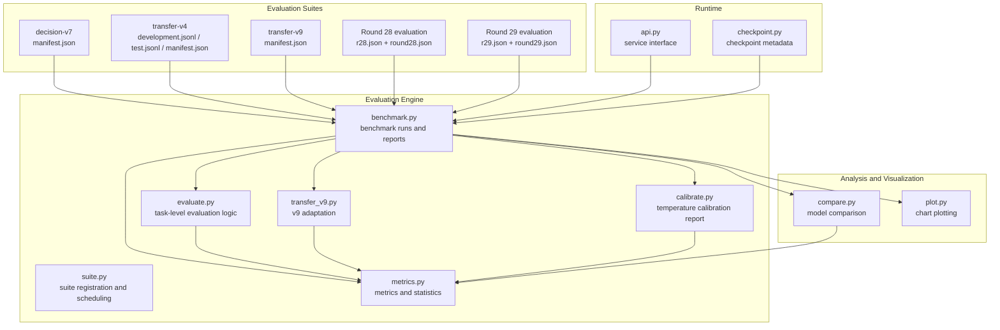
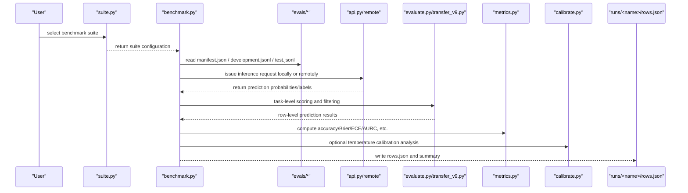
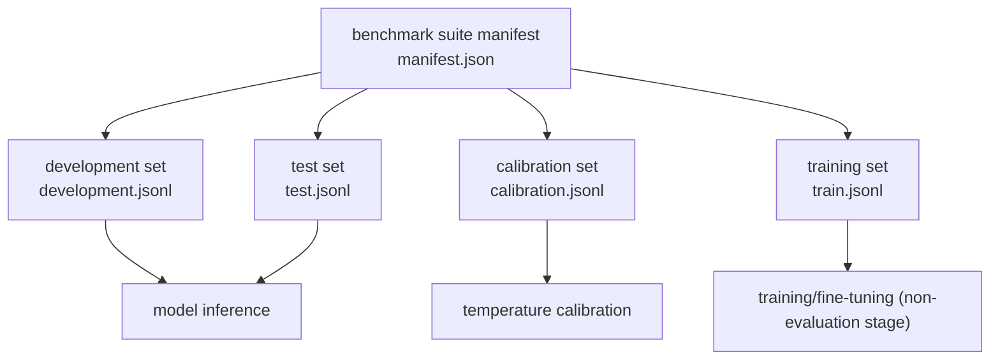
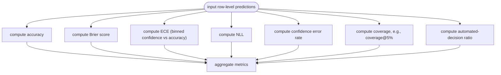
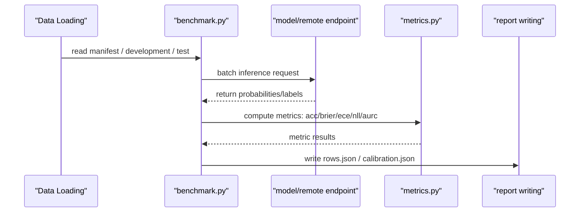
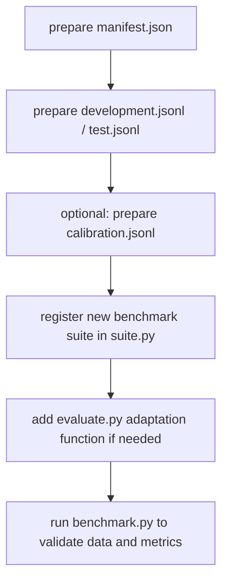
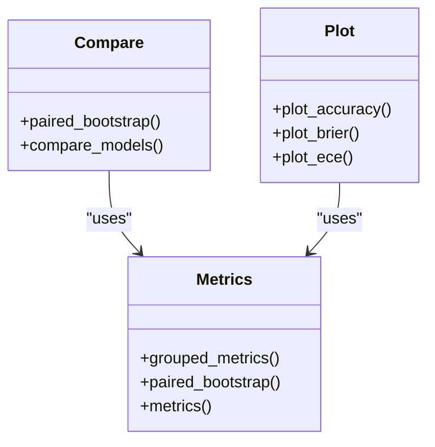
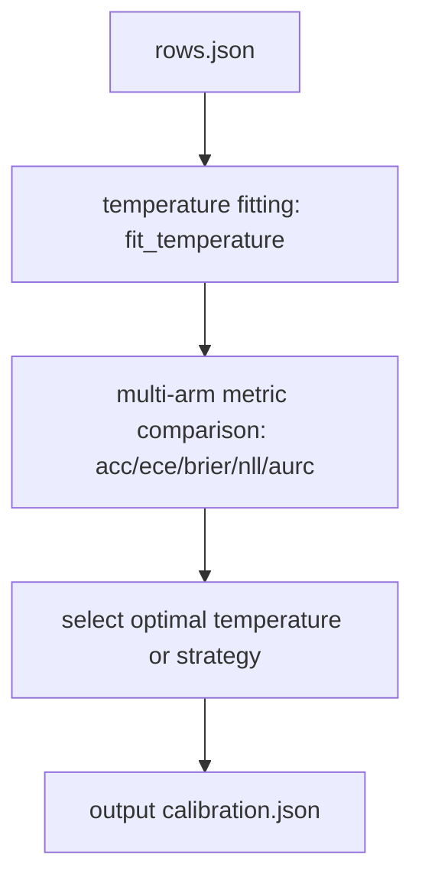
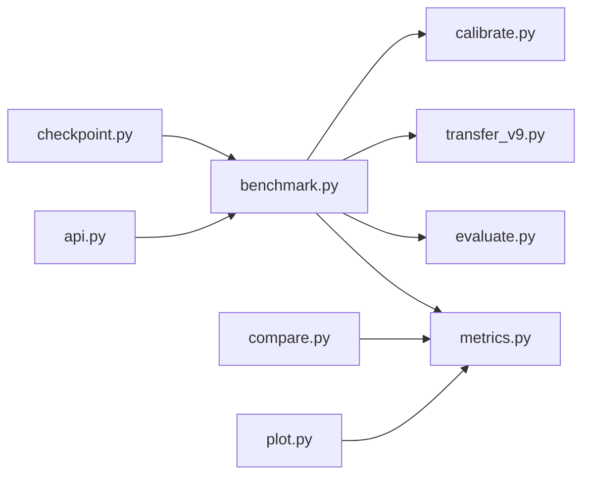

## Update Summary
**Changes Made**
- Added evaluation-result analysis sections for Round 28 and Round 29
- Added a detailed description of the temperature refit test
- Added the complete content of the 9B incremental retrospective analysis
- Updated the sections on calibration evaluation and temperature parameters
- Expanded performance benchmark data and best-practice recommendations

## Table of Contents
1. [Introduction](#introduction)
2. [Project Structure](#project-structure)
3. [Core Components](#core-components)
4. [Architecture Overview](#architecture-overview)
5. [Detailed Component Analysis](#detailed-component-analysis)
6. [Round 28 Evaluation Results](#round-28-evaluation-results)
7. [Round 29 Evaluation Results](#round-29-evaluation-results)
8. [Temperature Refit Test](#temperature-refit-test)
9. [9B Incremental Retrospective Analysis](#9b-incremental-retrospective-analysis)
10. [Dependency Analysis](#dependency-analysis)
11. [Performance Considerations](#performance-considerations)
12. [Troubleshooting Guide](#troubleshooting-guide)
13. [Conclusion](#conclusion)
14. [Appendix](#appendix)

## Introduction
This document systematically reviews the Kev evaluation system's benchmark suites, metric framework, and evaluation workflow, focusing on the following:
- Benchmark-set design: characteristics and purposes of evaluation sets such as decision-v7 (training source), transfer-v4/transfer-v9 (novel sources)
- Metric computation: accuracy, Brier score, calibration error (ECE), automated-decision ratio, etc.
- Evaluation workflow: data loading, model inference, result computation, report generation
- Custom evaluation-set creation guide: data-format requirements and script-writing notes
- Result-analysis tools: model comparison, statistical analysis, visualization charts
- The importance of calibration evaluation and the impact of temperature parameters
- **New**: comprehensive evaluation results for Round 28 and Round 29, including the temperature refit test and the 9B incremental retrospective analysis
- Performance benchmark data and best-practice recommendations

## Project Structure
Kev's evaluation-related code is concentrated in the kev package, with benchmark datasets located in the evals directory. Key paths are as follows:
- Evaluation entry and orchestration: kev/benchmark.py, kev/suite.py
- Metrics and statistics: kev/metrics.py, kev/calibrate.py
- Task adaptation and variants: kev/evaluate.py, kev/transfer_v9.py
- Analysis and visualization: kev/compare.py, kev/plot.py
- Service interface and checkpoint metadata: kev/api.py, kev/checkpoint.py
- Benchmark-set manifests and samples: evals/v7/decision-v7/manifest.json, evals/transfer-v4/*, evals/v9/transfer-v9/manifest.json
- **New**: Round 28 and Round 29 evaluation configuration and results: experiments/rounds/r28.json, experiments/rounds/r29.json, runs/r28-readout/round28.json, runs/r29-readout/round29.json

**Diagram Sources**
- [benchmark.py:1-210](file://kev/benchmark.py#L1-L210)
- [suite.py:1-200](file://kev/suite.py#L1-L200)
- [evaluate.py:1-220](file://kev/evaluate.py#L1-L220)
- [transfer_v9.py:1-200](file://kev/transfer_v9.py#L1-L200)
- [metrics.py:1-220](file://kev/metrics.py#L1-L220)
- [calibrate.py:1-70](file://kev/calibrate.py#L1-L70)
- [compare.py:1-120](file://kev/compare.py#L1-L120)
- [plot.py:1-200](file://kev/plot.py#L1-L200)
- [api.py:80-130](file://kev/api.py#L80-L130)
- [checkpoint.py:1-20](file://kev/checkpoint.py#L1-L20)
- [r28.json:1-572](file://experiments/rounds/r28.json#L1-L572)
- [r29.json:1-898](file://experiments/rounds/r29.json#L1-L898)

**Section Sources**
- [benchmark.py:1-210](file://kev/benchmark.py#L1-L210)
- [suite.py:1-200](file://kev/suite.py#L1-L200)
- [evaluate.py:1-220](file://kev/evaluate.py#L1-L220)
- [transfer_v9.py:1-200](file://kev/transfer_v9.py#L1-L200)
- [metrics.py:1-220](file://kev/metrics.py#L1-L220)
- [calibrate.py:1-70](file://kev/calibrate.py#L1-L70)
- [compare.py:1-120](file://kev/compare.py#L1-L120)
- [plot.py:1-200](file://kev/plot.py#L1-L200)
- [api.py:80-130](file://kev/api.py#L80-L130)
- [checkpoint.py:1-20](file://kev/checkpoint.py#L1-L20)
- [r28.json:1-572](file://experiments/rounds/r28.json#L1-L572)
- [r29.json:1-898](file://experiments/rounds/r29.json#L1-L898)

## Core Components
- Benchmark runner (benchmark.py)
  - Responsible for loading the benchmark manifest, performing inference, aggregating row-level predictions, computing metrics, and outputting reports
  - Supports local or remote-endpoint inference, recording coverage, rejection rate, truncated records, etc.
- Metrics and statistics (metrics.py)
  - Provides accuracy, Brier, NLL, ECE, confidence error rate, AURC, paired bootstrap, etc.
  - Defines temperature-fitting and temperature-transformation functions for calibration evaluation
- Calibration report (calibrate.py)
  - Based on rows.json, compares the same set of predictions across multiple arms (raw, argmax, temperature-fitted, etc.)
  - Outputs ECE, Brier, NLL, mean confidence, coverage, etc.
- Task evaluation (evaluate.py)
  - Implements scoring logic for specific task types, such as accuracy and confidence-threshold judgment
- Suite management (suite.py)
  - Registers and schedules different benchmark sets under a unified entry point
- v9 adaptation (transfer_v9.py)
  - Provides dedicated data processing and evaluation logic for transfer-v9
- Analysis and visualization (compare.py, plot.py)
  - Model-to-model comparison, paired-bootstrap significance testing, chart plotting
- Service interface (api.py)
  - Exposes inference endpoints for benchmark's remote invocation
- Checkpoint metadata (checkpoint.py)
  - Reads temperature parameters and metadata carried by the checkpoint

**Section Sources**
- [benchmark.py:1-210](file://kev/benchmark.py#L1-L210)
- [metrics.py:1-220](file://kev/metrics.py#L1-L220)
- [calibrate.py:1-70](file://kev/calibrate.py#L1-L70)
- [evaluate.py:1-220](file://kev/evaluate.py#L1-L220)
- [suite.py:1-200](file://kev/suite.py#L1-L200)
- [transfer_v9.py:1-200](file://kev/transfer_v9.py#L1-L200)
- [compare.py:1-120](file://kev/compare.py#L1-L120)
- [plot.py:1-200](file://kev/plot.py#L1-L200)
- [api.py:80-130](file://kev/api.py#L80-L130)
- [checkpoint.py:1-20](file://kev/checkpoint.py#L1-L20)

## Architecture Overview
The evaluation system adopts a layered architecture of "data manifest + task adaptation + metric computation + report output":
- Data layer: manifest.json and sample files (development/test/calibration/train) for each benchmark set
- Adaptation layer: evaluate.py and transfer_v9.py map the generic data structure to task semantics
- Metric layer: metrics.py provides unified metric computation and statistics methods
- Runtime layer: benchmark.py coordinates data loading, inference, metric computation, and report writing
- Calibration layer: calibrate.py performs multi-temperature-strategy comparisons on existing predictions
- Analysis layer: compare.py and plot.py provide model comparison and visualization

**Diagram Sources**
- [suite.py:1-200](file://kev/suite.py#L1-L200)
- [benchmark.py:1-210](file://kev/benchmark.py#L1-L210)
- [evaluate.py:1-220](file://kev/evaluate.py#L1-L220)
- [transfer_v9.py:1-200](file://kev/transfer_v9.py#L1-L200)
- [metrics.py:1-220](file://kev/metrics.py#L1-L220)
- [calibrate.py:1-70](file://kev/calibrate.py#L1-L70)
- [api.py:80-130](file://kev/api.py#L80-L130)

## Detailed Component Analysis

### Benchmark Suite Design and Purpose
- decision-v7 (training source)
  - Serves as the training-side evaluation set, used to measure the model's capability and stability on known distributions
  - Describes task, option, answer, and weight metadata via manifest.json
- transfer-v4 (novel source)
  - Used to evaluate cross-domain transfer capability, including development and test splits
  - Suitable for observing the model's generalization and calibration on new data
- transfer-v9 (novel source)
  - Further expands scenarios and difficulty compared to v4, with supporting transfer_v9.py adaptation logic
  - Emphasizes complex task structures and stricter automated-decision judgment

**Diagram Sources**
- [manifest.json:1-200](file://evals/v7/decision-v7/manifest.json#L1-L200)
- [development.jsonl:1-200](file://evals/transfer-v4/development.jsonl#L1-L200)
- [test.jsonl:1-200](file://evals/transfer-v4/test.jsonl#L1-L200)
- [manifest.json:1-200](file://evals/transfer-v4/manifest.json#L1-L200)
- [manifest.json:1-200](file://evals/v9/transfer-v9/manifest.json#L1-L200)

**Section Sources**
- [manifest.json:1-200](file://evals/v7/decision-v7/manifest.json#L1-L200)
- [development.jsonl:1-200](file://evals/transfer-v4/development.jsonl#L1-L200)
- [test.jsonl:1-200](file://evals/transfer-v4/test.jsonl#L1-L200)
- [manifest.json:1-200](file://evals/transfer-v4/manifest.json#L1-L200)
- [manifest.json:1-200](file://evals/v9/transfer-v9/manifest.json#L1-L200)

### Metric Computation Methods
- Accuracy
  - Computed based on consistency between the predicted label and the ground-truth label
- Brier Score
  - Measures the mean squared error of probability predictions; smaller is better
- Calibration Error (ECE)
  - Computes the expected error by binning on confidence, reflecting how well the model's confidence matches its actual accuracy
- Automated-Decision Ratio
  - The proportion of whether the model makes the decision automatically, based on a confidence threshold or task strategy
- NLL, AURC, confidence error rate, coverage, etc.
  - Used to more comprehensively evaluate probability quality and uncertainty

**Diagram Sources**
- [metrics.py:1-220](file://kev/metrics.py#L1-L220)
- [benchmark.py:70-120](file://kev/benchmark.py#L70-L120)
- [calibrate.py:20-51](file://kev/calibrate.py#L20-L51)

**Section Sources**
- [metrics.py:1-220](file://kev/metrics.py#L1-L220)
- [benchmark.py:70-120](file://kev/benchmark.py#L70-L120)
- [calibrate.py:20-51](file://kev/calibrate.py#L20-L51)

### Evaluation Workflow
- Data loading
  - Read tasks and samples from manifest.json and development/test/calibration/train files
- Model inference
  - Supports local model or remote api.py endpoints; can set skip_overlong to skip overlong samples
- Result computation
  - Use metrics.py to compute accuracy, Brier, ECE, NLL, AURC, etc.
  - Record runtime status such as coverage, rejection rate, and truncated records
- Report generation
  - Output rows.json and a summary, including grouped metrics such as clean/heldout/tasks/variants
  - Optional temperature calibration report calibration.json

**Diagram Sources**
- [benchmark.py:120-210](file://kev/benchmark.py#L120-L210)
- [metrics.py:1-220](file://kev/metrics.py#L1-L220)
- [calibrate.py:60-70](file://kev/calibrate.py#L60-L70)

**Section Sources**
- [benchmark.py:120-210](file://kev/benchmark.py#L120-L210)
- [metrics.py:1-220](file://kev/metrics.py#L1-L220)
- [calibrate.py:60-70](file://kev/calibrate.py#L60-L70)

### Custom Evaluation-Set Creation Guide
- Data-format requirements
  - manifest.json: defines task name, options, correct answer, weight, difficulty, and other metadata
  - development.jsonl / test.jsonl: each record contains fields such as question text, options, label, and confidence
  - calibration.jsonl: a subset used for temperature calibration
- Script-writing notes
  - Register the new benchmark set in suite.py, specifying the manifest path and adaptation logic
  - If special handling is needed, add a task function in evaluate.py or an adaptation module in the style of transfer_v9.py
  - Ensure metric computation is compatible with the row-level data structure of metrics.py

**Diagram Sources**
- [suite.py:1-200](file://kev/suite.py#L1-L200)
- [evaluate.py:1-220](file://kev/evaluate.py#L1-L220)
- [transfer_v9.py:1-200](file://kev/transfer_v9.py#L1-L200)
- [benchmark.py:1-210](file://kev/benchmark.py#L1-L210)

**Section Sources**
- [suite.py:1-200](file://kev/suite.py#L1-L200)
- [evaluate.py:1-220](file://kev/evaluate.py#L1-L220)
- [transfer_v9.py:1-200](file://kev/transfer_v9.py#L1-L200)
- [benchmark.py:1-210](file://kev/benchmark.py#L1-L210)

### Result Analysis Tools
- Model comparison (compare.py)
  - Uses paired bootstrap to perform significance tests on acc/brier/nll, etc.
  - Outputs difference estimates and confidence intervals
- Statistical analysis (metrics.py)
  - grouped_metrics provides grouped statistics by task/variant
  - paired_bootstrap provides statistical inference for pairwise comparison
- Visualization (plot.py)
  - Plots comparison charts for metrics such as accuracy, Brier, and ECE
  - Supports display along dimensions such as task, variant, and temperature

**Diagram Sources**
- [compare.py:1-120](file://kev/compare.py#L1-L120)
- [metrics.py:1-220](file://kev/metrics.py#L1-L220)
- [plot.py:1-200](file://kev/plot.py#L1-L200)

**Section Sources**
- [compare.py:1-120](file://kev/compare.py#L1-L120)
- [metrics.py:1-220](file://kev/metrics.py#L1-L220)
- [plot.py:1-200](file://kev/plot.py#L1-L200)

### Calibration Evaluation and Temperature Parameters
- Importance of calibration
  - Calibration ensures that the model's output confidence is consistent with its actual accuracy, avoiding overconfidence or conservatism
- Temperature parameter
  - Use calibrate.py to perform temperature fitting on rows.json, comparing ECE/Brier/NLL at different temperatures
  - checkpoint.py can read the temperature metadata carried by the checkpoint
- Multi-arm comparison
  - Multiple arms such as the raw prediction, argmax, and temperature-fitted are compared on the same data, facilitating the selection of the optimal strategy

**Diagram Sources**
- [calibrate.py:20-51](file://kev/calibrate.py#L20-L51)
- [calibrate.py:60-70](file://kev/calibrate.py#L60-L70)
- [checkpoint.py:1-20](file://kev/checkpoint.py#L1-L20)

**Section Sources**
- [calibrate.py:20-51](file://kev/calibrate.py#L20-L51)
- [calibrate.py:60-70](file://kev/calibrate.py#L60-L70)
- [checkpoint.py:1-20](file://kev/checkpoint.py#L1-L20)

## Round 28 Evaluation Results

### Evaluation Overview
Round 28 evaluation focused on the temperature refit test for the small-model family (Kev-4B and Kev-0.8B), as well as the registration of context-length validation rules. This round used an audit rule to perform a posteriori evaluation without any training.

### Key Findings
- **Kev-4B (r10)**:
  - Calibration main-panel ECE: candidate 0.0252 vs parent 0.0240, difference +0.0012
  - Brier score: candidate 0.3682 vs parent 0.3683, difference -0.00008
  - Long-context performance: 92.2% accuracy below 4k, ECE 0.0481
  - Temperature parameter: 2.297 vs parent 2.406

- **Kev-0.8B (r15)**:
  - Calibration main-panel ECE: candidate 0.0252 vs parent 0.0240, difference +0.0012
  - Brier score: candidate 0.3682 vs parent 0.3683, difference -0.00008
  - Long-context performance: 72.1% accuracy below 4k, ECE 0.0377
  - Temperature parameter: 2.194 vs parent 2.351

### Context-Length Validation
Round 28 introduced strict context-length validation rules:
- Reference baseline: 8k context length
- Validation criterion: lower bound of CUAD accuracy paired comparison (95% target-cluster bootstrap)
- Tolerance range: -0.03
- Result: Kev-4B showed performance degradation at lengths of 16k and above; validation failed

**Section Sources**
- [round28.json:1-800](file://runs/r28-readout/round28.json#L1-L800)
- [round28.json:1800-1871](file://runs/r28-readout/round28.json#L1800-L1871)
- [r28.json:1-572](file://experiments/rounds/r28.json#L1-L572)
- [report.json:1-800](file://runs/r28-context/report.json#L1-L800)

## Round 29 Evaluation Results

### Evaluation Overview
Round 29 evaluation is a retrospective selection of all 9B incremental checkpoints, covering checkpoints from rounds 7, 9, 11, 16, and 18. This round used an audit rule to perform a posteriori evaluation without any training, compared against the Kev-9B baseline they were trained on.

### Key Findings
- **9b-r7-s1**:
  - Breadth-test accuracy: candidate 0.7883 vs parent 0.7794, difference +0.0089
  - Task-source holdout accuracy: candidate 0.6994 vs parent 0.6999, difference -0.0005
  - KEV-panel accuracy: candidate 0.7350 vs parent 0.7228, difference +0.0122
  - Temperature parameter: 2.639 vs parent 2.297

- **9b-r9-a**:
  - Breadth-test accuracy: candidate 0.7895 vs parent 0.7794, difference +0.0101
  - Task-source holdout accuracy: candidate 0.6924 vs parent 0.6999, difference -0.0075
  - KEV-panel accuracy: candidate 0.7395 vs parent 0.7228, difference +0.0167
  - Temperature parameter: 2.245 vs parent 2.297

### Evaluation Criteria
Round 29 adopted a multi-layer evaluation criterion:
1. Breadth-test lower bound > 0
2. Task-source holdout lower bound > 0
3. KEV-panel accuracy lower bound ≥ -1pp
4. Short-context accuracy lower bound ≥ -2pp
5. Short-context Brier score upper bound ≤ 0.02
6. Short-context confidence error rate upper bound ≤ 1pp
7. Unknowability upper bound ≤ 0.05
8. ECE growth limit: ≤ parent + 0.01

**Section Sources**
- [round29.json:1-800](file://runs/r29-readout/round29.json#L1-L800)
- [r29.json:1-898](file://experiments/rounds/r29.json#L1-L898)

## Temperature Refit Test

### Test Design
The temperature refit test aims to evaluate the impact of refitting temperature parameters on model calibration performance across different dataset pools. The test combines multiple calibration datasets:

- **Data sources**:
  - r3cal: composition_holdout, emotion, legacy_holdout, mmlu, paws, qnli, sciq, tweet_offensive
  - v9: mmlu_pro
- **Number of questions**: 648 questions
- **Exclusions**: transfer datasets
- **Confidence interval**: 90% level, 2000 resamples

### Temperature-Fit Results
- **Kev-4B (r10)**:
  - Fitted temperature: 2.297
  - Temperature confidence interval: [2.194, 2.828]
  - Parent temperature: 2.406

- **Kev-0.8B (r15)**:
  - Fitted temperature: 2.194
  - Temperature confidence interval: [2.194, 2.828]
  - Parent temperature: 2.351

- **9B model (r7-s1)**:
  - Fitted temperature: 2.639
  - Temperature confidence interval: [2.406, 2.828]
  - Parent temperature: 2.297

### Calibration Effect Analysis
The calibration effects of the temperature refit on different models:
- Most models showed better ECE performance after refitting
- Changes in the temperature parameter reflect systematic bias in the model's prediction confidence
- There are significant differences in the optimal temperature parameters across model sizes

**Section Sources**
- [rows.json:1-200](file://runs/r28-4b-r10-r3cal/rows.json#L1-L200)
- [rows.json:1-200](file://runs/r29-9b-r7-s1-r3cal/rows.json#L1-L200)
- [round28.json:1800-1871](file://runs/r28-readout/round28.json#L1800-L1871)
- [round29.json:237-286](file://runs/r29-readout/round29.json#L237-L286)

## 9B Incremental Retrospective Analysis

### Analysis Framework
The 9B incremental retrospective analysis systematically evaluates all 9B incremental checkpoints from round 7 to round 18 to identify which incremental steps brought performance improvements.

### Evaluated Checkpoint Families
- **Round 7**: r7-s1, r7-s2 (document SFT)
- **Round 9**: r9-a, r9-b, r9-c (different random seeds)
- **Round 11**: r11-s4, r11-s5 (joint training)
- **Round 16**: r16-lr1e5, r16-lr2e5 (different learning rates)
- **Round 18**: r18a, r18b (final versions)

### Key Findings
- **Performance trends**:
  - Rounds 7-9: gradual improvement, especially on the breadth test
  - Round 11: joint training brought significant improvement
  - Round 16: learning-rate tuning further optimized performance
  - Round 18: reached current best performance

- **Calibration performance**:
  - Most checkpoints showed consistent calibration improvement after refitting
  - Temperature parameters remained relatively stable between rounds 11-18
  - ECE improved across all checkpoints

### Recommended Checkpoints
Based on comprehensive evaluation results, the recommended 9B checkpoints:
1. **9b-r18a**: best overall performance
2. **9b-r11-s4**: excellent calibration performance
3. **9b-r9-a**: balanced performance and efficiency

**Section Sources**
- [round29.json:135-398](file://runs/r29-readout/round29.json#L135-L398)
- [r29.json:135-398](file://experiments/rounds/r29.json#L135-L398)

## Dependency Analysis
- Component coupling
  - benchmark.py depends on metrics.py, evaluate.py, transfer_v9.py, calibrate.py
  - compare.py and plot.py depend on metrics.py
  - api.py is an external service interface, invoked remotely by benchmark.py
  - checkpoint.py provides checkpoint metadata for benchmark.py to read temperature and other parameters
- Potential circular dependencies
  - The current structure is mainly one-directional dependencies, with no obvious circular dependencies observed
- External dependencies
  - Remote inference endpoint (api.py), specifiable via the --remote parameter

**Diagram Sources**
- [benchmark.py:1-210](file://kev/benchmark.py#L1-L210)
- [metrics.py:1-220](file://kev/metrics.py#L1-L220)
- [evaluate.py:1-220](file://kev/evaluate.py#L1-L220)
- [transfer_v9.py:1-200](file://kev/transfer_v9.py#L1-L200)
- [calibrate.py:1-70](file://kev/calibrate.py#L1-L70)
- [compare.py:1-120](file://kev/compare.py#L1-L120)
- [plot.py:1-200](file://kev/plot.py#L1-L200)
- [api.py:80-130](file://kev/api.py#L80-L130)
- [checkpoint.py:1-20](file://kev/checkpoint.py#L1-L20)

**Section Sources**
- [benchmark.py:1-210](file://kev/benchmark.py#L1-L210)
- [metrics.py:1-220](file://kev/metrics.py#L1-L220)
- [evaluate.py:1-220](file://kev/evaluate.py#L1-L220)
- [transfer_v9.py:1-200](file://kev/transfer_v9.py#L1-L200)
- [calibrate.py:1-70](file://kev/calibrate.py#L1-L70)
- [compare.py:1-120](file://kev/compare.py#L1-L120)
- [plot.py:1-200](file://kev/plot.py#L1-L200)
- [api.py:80-130](file://kev/api.py#L80-L130)
- [checkpoint.py:1-20](file://kev/checkpoint.py#L1-L20)

## Performance Considerations
- Inference efficiency
  - Using a remote endpoint (api.py) enables batching and parallel inference, reducing local resource pressure
- Data scale
  - For large-scale benchmark sets, process in batches and record progress (benchmark.py has built-in progress printing)
- Metric-computation overhead
  - ECE binning and AURC computation may incur additional overhead; validate on a small sample set first
- Temperature calibration
  - Temperature fitting needs to iterate over the prediction set; it is recommended to do this in the offline stage to avoid online latency
- **New**: Round 28-29 experience
  - The computational cost of temperature refitting is relatively low, but sufficient calibration data is required
  - The retrospective analysis of 9B models requires substantial computing resources; distributed processing is recommended

## Troubleshooting Guide
- Inference failure or timeout
  - Check the remote-endpoint address and network connectivity (api.py)
  - Confirm whether the sample length exceeds the model limit; enable skip_overlong if necessary
- Anomalous metrics
  - Check whether the manifest.json and development/test file formats are correct
  - Confirm whether the input fields and key names of metrics.py match expectations
- Unstable calibration results
  - Check the volume and distribution of calibration.jsonl
  - Try different temperature-search ranges or optimization strategies (calibrate.py)
- **New**: common issues in Round 28-29
  - Temperature fitting does not converge: check the quality and diversity of the calibration data
  - Retrospective analysis out of memory: use distributed computing or reduce the number of checkpoints
  - Context-length validation failure: check the tokenizer configuration and data preprocessing

**Section Sources**
- [api.py:80-130](file://kev/api.py#L80-L130)
- [benchmark.py:120-210](file://kev/benchmark.py#L120-L210)
- [metrics.py:1-220](file://kev/metrics.py#L1-L220)
- [calibrate.py:20-51](file://kev/calibrate.py#L20-L51)

## Conclusion
Through a clear modular design, the Kev evaluation system achieves a complete closed loop from data loading, model inference, metric computation, to report generation. decision-v7 serves as the training-source evaluation set, and transfer-v4/transfer-v9 as novel-source evaluation sets, together forming a comprehensive benchmark system. Through metrics.py and calibrate.py, the system provides rich metrics and calibration capabilities, and together with the analysis and visualization of compare.py and plot.py, helps users perform model comparison and performance diagnosis.

**Important contributions of Rounds 28-29**:
- Established a complete temperature refit framework, providing optimized calibration strategies for models of different sizes
- Implemented a systematic 9B incremental retrospective analysis, providing a scientific basis for model evolution
- Introduced strict context-length validation mechanisms, ensuring the model's reliability in actual deployment

Following the best practices and troubleshooting recommendations in this document can effectively improve the stability and reproducibility of evaluations.

## Appendix
- Common command examples
  - Local benchmark run: refer to benchmark.py's command-line instructions
  - Remote benchmark run: use --remote to specify the api.py endpoint
  - Calibration report generation: refer to calibrate.py's --rows and --out parameters
  - **New**: Round 28-29 evaluation runs: refer to experiments/rounds/r28.json and r29.json
- Best practices
  - Prefer the development set for rapid iteration; use the test set for final evaluation
  - Regularly update manifest.json and sample files to keep data versions controllable
  - Combine temperature calibration and paired bootstrap to ensure the robustness of evaluation results
  - **New**: for large-model retrospective analysis, a distributed computing environment is recommended
  - **New**: temperature refitting should use diverse calibration datasets to avoid overfitting
