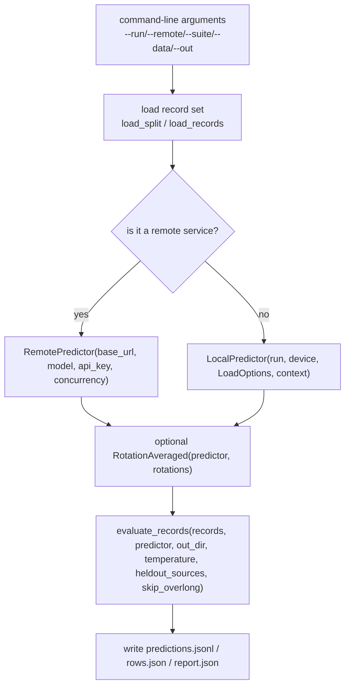
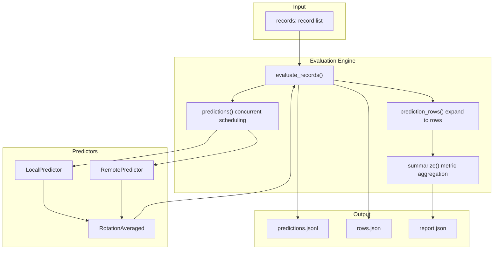
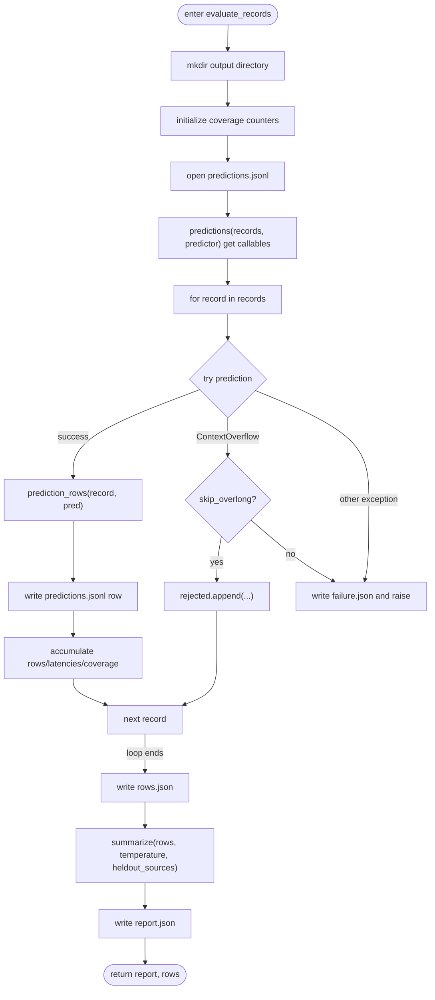
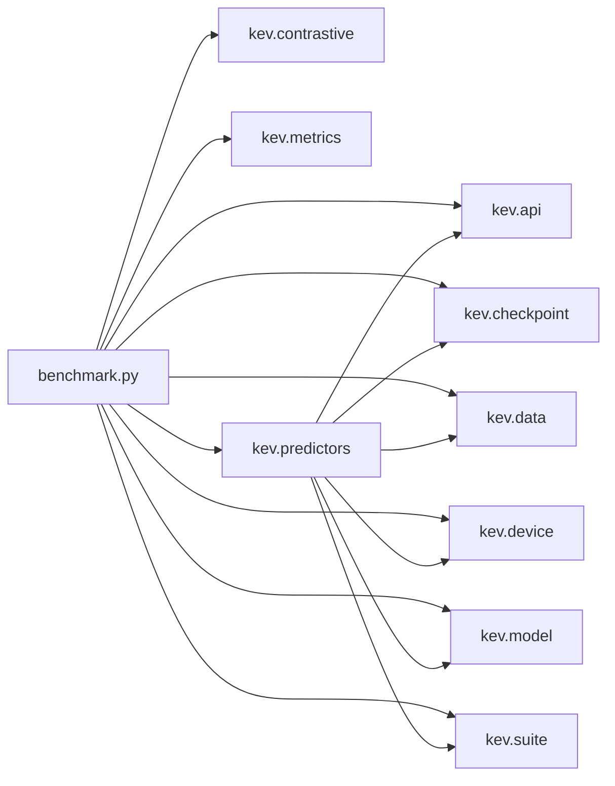

## Table of Contents
1. [Introduction](#introduction)
2. [Project Structure](#project-structure)
3. [Core Components](#core-components)
4. [Architecture Overview](#architecture-overview)
5. [Detailed Component Analysis](#detailed-component-analysis)
6. [Dependency Analysis](#dependency-analysis)
7. [Performance and Stability Considerations](#performance-and-stability-considerations)
8. [Troubleshooting Guide](#troubleshooting-guide)
9. [Conclusion](#conclusion)
10. [Appendix: Output File Formats](#appendix-output-file-formats)

## Introduction
This document systematically explains the Kev evaluation workflow, covering the complete chain from data loading, model inference, result computation, to report generation. It focuses on the following capabilities:
- The core responsibilities of `evaluate_records()`: concurrent scheduling, error handling, coverage statistics, latency statistics, and long-context overflow handling.
- The usage scenarios, configuration options, and behavioral differences between `LocalPredictor` and `RemotePredictor`.
- The option-rotation mechanism of the `RotationAveraged` predictor and how it improves stability.
- Context-overflow handling and the usage of the `skip_overlong` parameter.
- Best practices for batch evaluation and distributed evaluation.
- Progress monitoring and exception-handling strategies.
- The structure of the evaluation artifacts `predictions.jsonl`, `rows.json`, and `report.json`.

## Project Structure
Kev's evaluation entry point is in the module `kev.benchmark`, and the predictor implementations are in `kev.predictors`. The overall flow is as follows:
- Command-line argument parsing and dataset/suite loading.
- Select `LocalPredictor` or `RemotePredictor` based on whether a remote service is used.
- Optionally wrap the predictor with `RotationAveraged` for option-rotation averaging.
- Call `evaluate_records()` to perform the evaluation and write the artifacts.
- Aggregate metrics and generate the report.

Diagram Sources
- [benchmark.py:171-210](file://kev/benchmark.py#L171-L210)
- [predictors.py:93-147](file://kev/predictors.py#L93-L147)
- [predictors.py:162-207](file://kev/predictors.py#L162-L207)

Section Sources
- [benchmark.py:1-28](file://kev/benchmark.py#L1-L28)
- [predictors.py:1-35](file://kev/predictors.py#L1-L35)

## Core Components
This section focuses on the main evaluation flow and key functions:
- `evaluate_records()`: evaluation orchestration, concurrent scheduling, coverage statistics, error handling, latency statistics, report aggregation.
- `prediction_rows()`: expand prediction results into per-question (question-level) row records.
- `summarize()`: compute metrics, calibration metrics, variant groupings, task groupings, etc. based on the row records.
- `predictions()`: produce callables in order, internally using a thread pool to control concurrency.

Section Sources
- [benchmark.py:48-103](file://kev/benchmark.py#L48-L103)
- [benchmark.py:106-168](file://kev/benchmark.py#L106-L168)

## Architecture Overview
The following diagram shows the end-to-end data flow and control flow of the evaluation, including the two paths of local inference and remote inference, as well as the rotation-averaging wrapper layer.

Diagram Sources
- [benchmark.py:106-168](file://kev/benchmark.py#L106-L168)
- [predictors.py:93-147](file://kev/predictors.py#L93-L147)
- [predictors.py:162-207](file://kev/predictors.py#L162-L207)
- [predictors.py:213-251](file://kev/predictors.py#L213-L251)

## Detailed Component Analysis

### evaluate_records(): Evaluation Orchestration and Coverage Statistics
Key responsibilities:
- Create the output directory and initialize coverage counters: number of requested records, number of requested questions, number of evaluated records, number of evaluated questions, number of rejected records, number of truncated records.
- Open `predictions.jsonl` and stream-write the request summary, ID, prediction result, and expanded rows for each record.
- Obtain ordered callables via `predictions()`, which supports concurrency internally.
- Catch `ContextOverflow` and other exceptions:
  - If `skip_overlong` is enabled, append the rejected record to `rejected.json` and continue; otherwise write `failure.json` and raise an exception to abort.
- Accumulate latency and compute the median and P95.
- Write `rows.json` and `report.json`, and include coverage, latency, temperature, whether logits were recorded, and long-row statistics in the report.

Diagram Sources
- [benchmark.py:124-168](file://kev/benchmark.py#L124-L168)

Section Sources
- [benchmark.py:124-168](file://kev/benchmark.py#L124-L168)

### LocalPredictor: Local Inference
Usage scenarios:
- Load the checkpoint locally and perform inference, suitable for offline evaluation, experiment reproduction, and scenarios requiring high precision.

Key features:
- FP32 precise inference: disable TF32 and SDPA fusion kernels to ensure reproducibility.
- Long-context optimization: when the longest row exceeds a threshold, switch to an efficient attention kernel to reduce memory usage.
- Environment fingerprint: records the backend, device, package versions, attention implementation, DeltaNet forward implementation, etc., for cross-run comparability.
- Returned fields: probabilities, logits, inference_temperature, latency_ms, input_tokens, and a kernels flag when necessary.

Configuration options:
- run: checkpoint path or Hub ID.
- device: cpu/mps/cuda.
- opts: LoadOptions, including temperature, etc.
- context: maximum state length, branch count, packing limit, from the suite manifest or default constants.

Section Sources
- [predictors.py:93-147](file://kev/predictors.py#L93-L147)
- [predictors.py:67-90](file://kev/predictors.py#L67-L90)

### RemotePredictor: Remote Inference
Usage scenarios:
- Connect to any TypeSafe System One compatible endpoint, suitable for online evaluation, multi-instance parallelism, and centralized server-side deployment.

Key features:
- Concurrency control: `concurrency` indicates the number of simultaneously held requests, managed by `predictions()` through a thread pool.
- Retry and backoff: exponential backoff retries for 408, 429, 5xx, and connection/timeout errors; client errors fail immediately.
- Rejection semantics: specific HTTP status codes are mapped to `ContextOverflow`, so the upper layer can handle them as "rejections".
- Returned fields: probabilities, latency_ms, input_tokens, and records the server-side model identifier.

Configuration options:
- base_url: service base address.
- model: requested model name.
- api_key: authentication token.
- timeout: per-request timeout.
- retries: maximum number of retries.
- concurrency: concurrency level.

Section Sources
- [predictors.py:162-207](file://kev/predictors.py#L162-L207)

### RotationAveraged: Option-Rotation Averaging
Motivation:
- Reduce the influence of multiple-choice option order on the probability distribution, improving stability and robustness.

Mechanism:
- Cyclically shift the options of each Choice question and call the underlying predictor separately for each.
- If all rounds return logits, compute the mean in logit space; otherwise compute the geometric mean in log-probability space.
- The final probabilities are normalized via softmax to ensure consistency with the logits.
- Cost: each record requires multiple forward passes (equal to the number of rotations).

Configuration options:
- predictor: the wrapped predictor (LocalPredictor or RemotePredictor).
- rotations: number of rotations, at least 2.

Section Sources
- [predictors.py:213-251](file://kev/predictors.py#L213-L251)

### Context-Overflow Handling and skip_overlong
- When a record cannot be encoded into the context, a `ContextOverflow` is raised.
- `skip_overlong=True`: the record is rejected but the evaluation is not interrupted; it is written to `rejected.json`, and rejected_records in the coverage increases.
- `skip_overlong=False`: on the first overflow, write `failure.json` and raise an exception, terminating the evaluation.
- External data (passed via `--data`) enables `skip_overlong` by default; a frozen suite decides based on the manifest's `eval_only` flag.

Section Sources
- [benchmark.py:124-168](file://kev/benchmark.py#L124-L168)
- [benchmark.py:191-204](file://kev/benchmark.py#L191-L204)

### Concurrency and Order Consistency
- `predictions()` decides whether to use a thread pool based on the predictor's `concurrency` attribute.
- Regardless of concurrency, the outer loop produces results in the original record order, ensuring stable output order.
- For remote predictors, each request is independent and concurrent; for local predictors, execution is usually serial.

Section Sources
- [benchmark.py:106-122](file://kev/benchmark.py#L106-L122)
- [predictors.py:162-175](file://kev/predictors.py#L162-L175)

## Dependency Analysis
- `benchmark.py` depends on:
  - `kev.api`: question-key generation, date-fact injection.
  - `kev.checkpoint`: checkpoint loading options.
  - `kev.contrastive`: paired-flip statistics.
  - `kev.data`: API request construction, record loading.
  - `kev.device`: device synchronization.
  - `kev.metrics`: metric computation, NLL, calibration, etc.
  - `kev.model`: context-overflow exception, row splitting, thresholds.
  - `kev.predictors`: predictor implementations.
  - `kev.suite`: suite loading, manifest reading, encoding constants, JSON writing.
- `predictors.py` depends on:
  - `torch`, `transformers.integrations.sdpa_attention`: attention-kernel switching.
  - `kev.api`, `kev.checkpoint`, `kev.data`, `kev.device`, `kev.model`, `kev.suite`: tools required for inference.

Diagram Sources
- [benchmark.py:19-27](file://kev/benchmark.py#L19-L27)
- [predictors.py:23-28](file://kev/predictors.py#L23-L28)

Section Sources
- [benchmark.py:19-27](file://kev/benchmark.py#L19-L27)
- [predictors.py:23-28](file://kev/predictors.py#L23-L28)

## Performance and Stability Considerations
- Local inference precision:
  - Disable TF32 and SDPA fusion kernels to ensure FP32 precision and reproducibility.
  - Use efficient attention kernels in the long-context path to avoid memory explosion, at the cost of minor numerical differences from using different kernel sets.
- Remote inference reliability:
  - Exponential backoff retries for network jitter and transient server errors.
  - Clearly distinguish "server rejection" from "transient error"; the former is handled directly as context overflow.
- Stability enhancement:
  - `RotationAveraged` reduces order bias through option-rotation averaging, improving robustness.
- Throughput and latency:
  - Remote inference can improve throughput via `concurrency`; local inference is limited by GPU/CPU resources.
  - The report includes the median and P95 latency for performance analysis.

Section Sources
- [predictors.py:93-147](file://kev/predictors.py#L93-L147)
- [predictors.py:162-207](file://kev/predictors.py#L162-L207)
- [predictors.py:213-251](file://kev/predictors.py#L213-L251)
- [benchmark.py:158-167](file://kev/benchmark.py#L158-L167)

## Troubleshooting Guide
Common problems and handling suggestions:
- Context overflow:
  - Symptom: a `ContextOverflow` is raised.
  - Handling: set `skip_overlong=True` to skip overlong records; or adjust the `context` limit.
  - Artifacts: `rejected.json` lists the rejected records; if skipping is not enabled, `failure.json` is written and the run is interrupted.
- Remote endpoint rejection:
  - Symptom: HTTP status codes such as 400/413/422.
  - Handling: treat it as context overflow; check the server-side context limit and request size.
- Network errors and server errors:
  - Symptom: 408, 429, 5xx, connection/timeout errors.
  - Handling: automatic retries with exponential backoff; if failures persist, check server health and network connectivity.
- Client errors:
  - Symptom: 401, 403, 404, etc.
  - Handling: fail immediately; check authentication, URL, model name, and other configurations.
- Probability validation failure:
  - Symptom: probability keys do not match, non-finite values, out of range, sum not equal to 1.
  - Handling: check the predictor output format and numeric range.

Section Sources
- [benchmark.py:124-168](file://kev/benchmark.py#L124-L168)
- [predictors.py:150-207](file://kev/predictors.py#L150-L207)

## Conclusion
Through a clear modular design, Kev's evaluation workflow automates the entire chain from data loading, inference, result expansion, to metric aggregation and report generation. `evaluate_records()` provides robust error handling and coverage statistics; `LocalPredictor` and `RemotePredictor` respectively satisfy offline-precision and online-scalability needs; `RotationAveraged` improves stability through option-rotation averaging. Combined with concurrent scheduling, retry mechanisms, and long-context optimization, the flow ensures result reliability while balancing efficiency and maintainability.

## Appendix: Output File Formats

### predictions.jsonl
- One JSON object per line, corresponding to one record.
- Fields:
  - request_sha256: request summary hash.
  - id: record ID.
  - prediction: prediction result object (including probabilities, logits, latency_ms, input_tokens, etc.).
  - rows: expanded question-level row list.

Section Sources
- [benchmark.py:149-150](file://kev/benchmark.py#L149-L150)

### rows.json
- An array where each element is a row (one question), containing:
  - id, group, question, source, task, type, variant, keys, label, control_id, pair_id, sibling, parent.
  - p: probability vector (in keys order).
  - raw_probability_sum: raw probability sum.
  - zero_count: number of zero probabilities.
  - logits: optional, raw logits (in keys order).
  - inference_temperature: optional, inference temperature.
  - kernels: optional, flag indicating the long-row efficient kernel was used.

Section Sources
- [benchmark.py:48-70](file://kev/benchmark.py#L48-L70)
- [benchmark.py:158-158](file://kev/benchmark.py#L158-L158)

### report.json
- Top-level fields:
  - objective: objective value (negative mean NLL).
  - paired_flip: paired-flip statistics.
  - unknowable: unknowable-sample report.
  - clean: clean-sample metrics.
  - tasks: metrics grouped by task.
  - variants: metrics grouped by variant.
  - heldout_tasks: held-out task-group metrics (if any).
  - permutation: permutation-perturbation statistics (n, mean_max_delta, flip_rate).
  - temperature: evaluation temperature.
  - calibrated_clean: calibrated clean-sample metrics.
  - metric_policy: metric-policy metadata (version, selective tie-handling, coverage definition, AURC, confidence-error rate, etc.).
  - coverage: coverage statistics (requested_records, requested_questions, evaluated_records, evaluated_questions, rejected_records, truncated_records).
  - latency_ms: latency statistics (median, p95).
  - calibration: calibration information (inference_temperature, additional_temperature, logits_recorded).
  - long_rows: long-row statistics (count, records, kernels, threshold).
  - suite_sha256, data, date_facts, rotations, run, split, calibration_applied, environment, remote: environment and run metadata.

Section Sources
- [benchmark.py:73-103](file://kev/benchmark.py#L73-L103)
- [benchmark.py:160-167](file://kev/benchmark.py#L160-L167)
- [benchmark.py:205-209](file://kev/benchmark.py#L205-L209)
