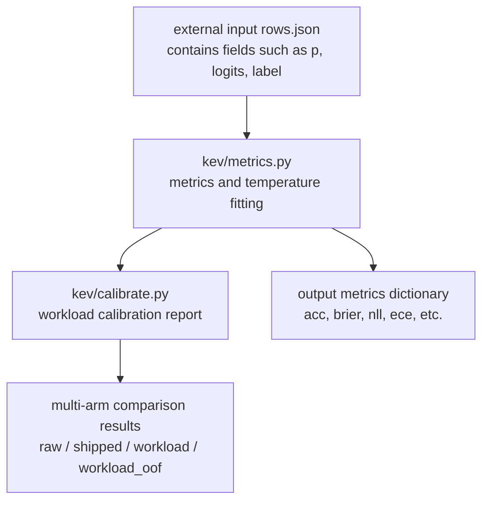
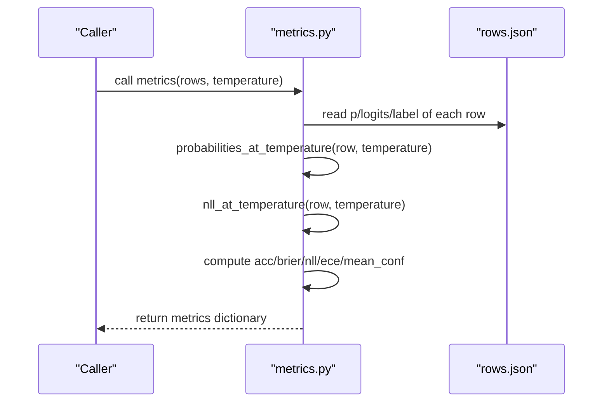
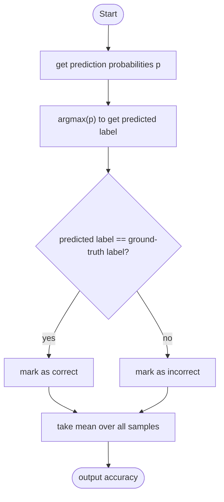
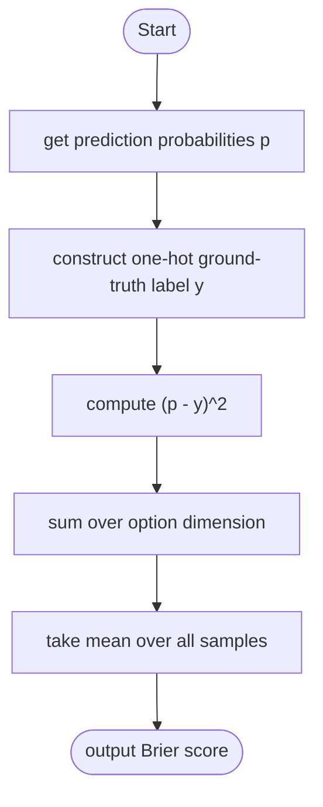
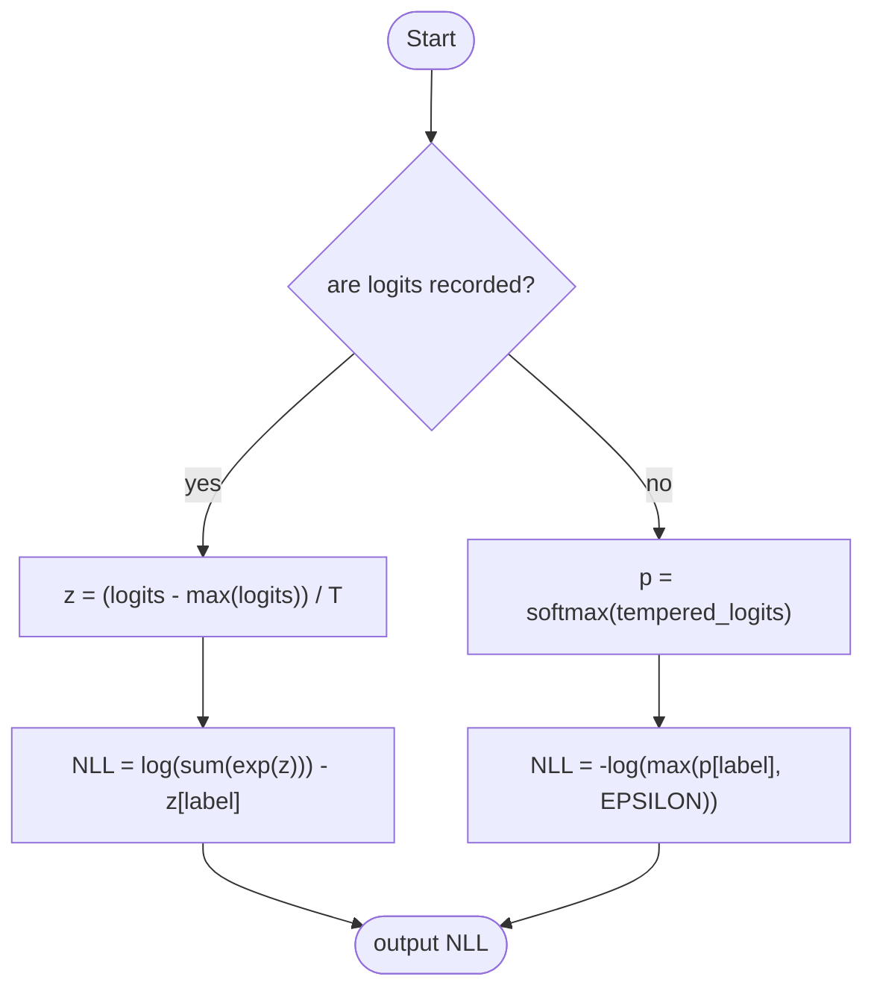
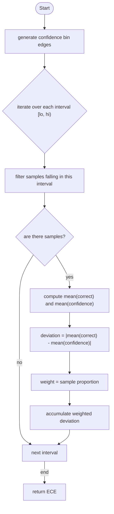
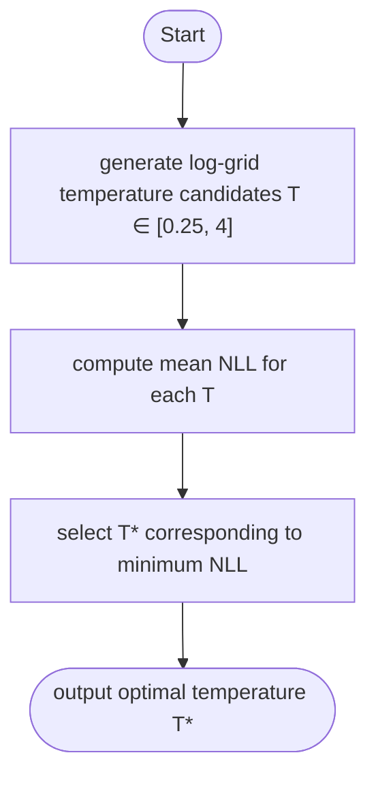
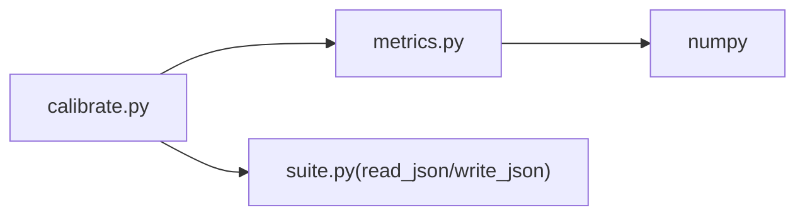

## Table of Contents
1. [Introduction](#introduction)
2. [Project Structure](#project-structure)
3. [Core Components](#core-components)
4. [Architecture Overview](#architecture-overview)
5. [Detailed Component Analysis](#detailed-component-analysis)
6. [Dependency Analysis](#dependency-analysis)
7. [Performance Considerations](#performance-considerations)
8. [Troubleshooting Guide](#troubleshooting-guide)
9. [Conclusion](#conclusion)
10. [Appendix: Usage Examples and Best Practices](#appendix-usage-examples-and-best-practices)

## Introduction
This document targets the evaluation need of "accuracy and probability calibration". It systematically reviews the core implementations in the codebase for computing accuracy, Brier score, negative log-likelihood (NLL), expected calibration error (ECE), and temperature scaling tuning. Key topics include:
- Accuracy is based on matching the predicted label with the ground-truth label;
- Brier score measures the mean squared error between the predicted probability distribution and the one-hot ground-truth label;
- NLL evaluates the log loss of the probability model;
- The binning method of ECE: binning by confidence and computing the deviation between accuracy and average confidence within each bin;
- The mathematical principle and parameter-tuning method of temperature scaling;
- How to use functions such as metrics(), probabilities_at_temperature(), and nll_at_temperature() for metric computation;
- Performance-optimization suggestions and common-problem troubleshooting.

## Project Structure
The core modules directly related to this topic are located under the kev package:
- kev/metrics.py: implements all metrics and utility functions for accuracy, Brier, NLL, ECE, selective prediction, temperature fitting, paired bootstrap sampling, etc.;
- kev/calibrate.py: provides the workload-dimension calibration-report generation flow, encapsulating the scoring comparison from raw rows to different temperatures.

Diagram Sources
- [metrics.py:1-100](file://kev/metrics.py#L1-L100)
- [calibrate.py:1-45](file://kev/calibrate.py#L1-L45)

Section Sources
- [metrics.py:1-100](file://kev/metrics.py#L1-L100)
- [calibrate.py:1-45](file://kev/calibrate.py#L1-L45)

## Core Components
- Probability and temperature handling
  - probabilities_at_temperature(row, temperature=1.0): returns the sample's probability distribution at the given temperature T; when T=1 it returns the recorded probability p directly, otherwise applies temperature scaling to the logits and then softmax.
  - _tempered_logits(row, temperature): subtracts the maximum from the logits and divides by the temperature to ensure numerical stability; if logits are not recorded, approximates with log(max(p, EPSILON)).
  - nll_at_temperature(row, temperature=1.0): computes the NLL at the given temperature; prefers exact logits computation, otherwise falls back to the probability form.
- Metric computation
  - ece(conf, correct, bins=10): bins uniformly by confidence and computes the weighted average of |accuracy - average confidence|.
  - metrics(rows, temperature=1.0): batch-computes acc, brier, nll, ece, mean_conf, selective-prediction metrics (such as coverage at error budget, AURC), etc.
- Temperature fitting
  - fit_temperature(rows, aggregation="macro", points=81): searches over a log grid of 0.25..4 for the temperature that minimizes the mean NLL; supports micro or macro aggregation.
  - TEMPERATURE_FIT: default configuration (aggregation="micro", points=121), used for releasing checkpoints and workload calibration.
- Data flow and helpers
  - raw_row(row), tempered_row(row, temperature), served_at(rows, temperature): uniformly handle rows that have recorded inference_temperature, recovering the original logits or serving at a specified temperature.
  - grouped_metrics(rows, key, temperature=1.0): computes metrics by grouping key.
  - calibration_by_length(rows, lengths=None, edges=LENGTH_EDGES): evaluates calibration bucketed by state token length.
  - paired_bootstrap(...), cross_validated_temperature(...): paired bootstrap sampling and cross-validated temperature reporting.

Section Sources
- [metrics.py:24-53](file://kev/metrics.py#L24-L53)
- [metrics.py:64-100](file://kev/metrics.py#L64-L100)
- [metrics.py:276-294](file://kev/metrics.py#L276-L294)
- [metrics.py:224-261](file://kev/metrics.py#L224-L261)

## Architecture Overview
The following diagram shows the overall flow from raw prediction rows to final metric output, including the key steps of temperature scaling and metric computation.

Diagram Sources
- [metrics.py:39-53](file://kev/metrics.py#L39-L53)
- [metrics.py:64-100](file://kev/metrics.py#L64-L100)

## Detailed Component Analysis

### Accuracy
- Definition: the predicted class is the index corresponding to the maximum-probability item; it is correct when it matches the ground-truth label.
- Implementation notes:
  - In metrics(), for each sample compute argmax(p) == label, and take the mean as the accuracy.
  - Note: argmax does not change with temperature, so accuracy stays consistent across different temperatures.

Diagram Sources
- [metrics.py:68-74](file://kev/metrics.py#L68-L74)

Section Sources
- [metrics.py:68-74](file://kev/metrics.py#L68-L74)

### Brier Score
- Definition: the mean squared error between the predicted probability distribution and the one-hot ground-truth label.
- Implementation notes:
  - For each sample compute the sum of (p - y_onehot)^2, then take the mean over all samples.
  - Smaller is better, indicating the probability distribution is closer to the true distribution.

Diagram Sources
- [metrics.py:71-74](file://kev/metrics.py#L71-L74)

Section Sources
- [metrics.py:71-74](file://kev/metrics.py#L71-L74)

### Negative Log-Likelihood (NLL)
- Definition: log loss, measuring the negative log-likelihood of the probability model for the ground-truth label.
- Implementation notes:
  - If logits are recorded, use the numerically stable formula after temperature scaling: log(sum(exp(z))) - z[label].
  - If no logits, fall back to -log(max(p[label], EPSILON)).

Diagram Sources
- [metrics.py:29-36](file://kev/metrics.py#L29-L36)
- [metrics.py:48-53](file://kev/metrics.py#L48-L53)

Section Sources
- [metrics.py:29-36](file://kev/metrics.py#L29-L36)
- [metrics.py:48-53](file://kev/metrics.py#L48-L53)

### Expected Calibration Error (ECE)
- Definition: bin by confidence, compute the absolute deviation between accuracy and average confidence within each bin, and sum weighted by sample weights.
- Binning strategy:
  - Use np.linspace(0, 1, bins+1) to generate boundaries;
  - For each interval [lo, hi), count the samples falling into the interval and compute the difference between mean(correct) and mean(confidence);
  - Use m.mean() as the weight of the bin, and accumulate to get ECE.

Diagram Sources
- [metrics.py:15-21](file://kev/metrics.py#L15-L21)

Section Sources
- [metrics.py:15-21](file://kev/metrics.py#L15-L21)

### Temperature Scaling
- Mathematical principle:
  - Scale the logits z: z' = (z - max(z)) / T, then apply softmax to obtain probabilities;
  - T > 1 makes the distribution smoother (lower confidence), T < 1 makes the distribution sharper (higher confidence).
- Tuning method:
  - Enumerate candidate temperatures on a log grid of 0.25..4;
  - Compute the mean NLL for each candidate temperature (supports micro or macro aggregation);
  - Select the temperature that minimizes the mean NLL as the optimal temperature.

Diagram Sources
- [metrics.py:276-294](file://kev/metrics.py#L276-L294)

Section Sources
- [metrics.py:276-294](file://kev/metrics.py#L276-L294)

### Key Function Descriptions and Usage Paths
- probabilities_at_temperature(row, temperature=1.0)
  - Purpose: returns the probability distribution at the given temperature; when T=1 returns p directly, otherwise applies temperature scaling to the logits and then softmax.
  - Reference path: [metrics.py:39-45](file://kev/metrics.py#L39-L45)
- nll_at_temperature(row, temperature=1.0)
  - Purpose: returns the NLL at the given temperature; prefers exact logits computation, otherwise falls back to the probability form.
  - Reference path: [metrics.py:48-53](file://kev/metrics.py#L48-L53)
- metrics(rows, temperature=1.0)
  - Purpose: batch-computes accuracy, Brier, NLL, ECE, mean_conf, selective-prediction metrics, etc.
  - Reference path: [metrics.py:64-100](file://kev/metrics.py#L64-L100)

Section Sources
- [metrics.py:39-53](file://kev/metrics.py#L39-L53)
- [metrics.py:64-100](file://kev/metrics.py#L64-L100)

## Dependency Analysis
- Module coupling
  - calibrate.py depends on the metric and temperature-fitting functions provided by metrics.py;
  - metrics.py is self-contained numpy computation logic internally, with no external model dependencies, facilitating offline scoring.
- Data contract
  - rows elements need to contain p, label, and optionally logits;
  - If inference_temperature exists, it must be handled correctly in raw_row()/tempered_row().

Diagram Sources
- [calibrate.py:18-22](file://kev/calibrate.py#L18-L22)
- [metrics.py:7-11](file://kev/metrics.py#L7-L11)

Section Sources
- [calibrate.py:18-22](file://kev/calibrate.py#L18-L22)
- [metrics.py:7-11](file://kev/metrics.py#L7-L11)

## Performance Considerations
- Vectorized computation
  - All metric computations are based on numpy array operations, avoiding Python loop overhead;
  - It is recommended to pass in batch rows whenever possible and let metrics() compute them all at once.
- Numerical stability
  - Subtract the maximum from logits before exp to avoid overflow;
  - Use EPSILON when falling back to probabilities to prevent log(0).
- Temperature-grid size
  - Default points=81; released checkpoints use points=121; can be adjusted based on data volume and precision needs.
- Selective prediction
  - coverage_at_error and AURC are computed via sorting and cumulative statistics, with complexity O(n log n).

[This section provides general performance guidance and does not directly analyze specific files]

## Troubleshooting Guide
- Empty dataset
  - metrics() throws an exception on empty rows; ensure there is at least one valid sample.
- Illegal temperature parameter
  - _check_temperature() requires the temperature to be a finite positive value; otherwise it raises ValueError.
- Missing or mismatched logits
  - If logits are used for computation but the shape does not match or the values are non-finite, an exception is thrown;
  - If a row does not record logits and the original logits need to be recovered, inference_temperature must be provided.
- Inconsistent confidence and correctness vectors
  - Selective-prediction-related functions require confidence and correct to be of equal length and valid types.

Section Sources
- [metrics.py:24-27](file://kev/metrics.py#L24-L27)
- [metrics.py:29-36](file://kev/metrics.py#L29-L36)
- [metrics.py:64-66](file://kev/metrics.py#L64-L66)
- [metrics.py:103-122](file://kev/metrics.py#L103-L122)

## Conclusion
This repository provides complete implementations of accuracy and probability-calibration metrics, covering Brier, NLL, ECE, and temperature-scaling tuning. Through metrics() multiple metrics can be obtained at once, and together with probabilities_at_temperature() and nll_at_temperature() evaluation can be performed at any temperature. calibrate.py further encapsulates the workload-dimension calibration-report flow, facilitating temperature calibration and effect comparison of the model before actual deployment.

[This section is summary content and does not directly analyze specific files]

## Appendix: Usage Examples and Best Practices

### Using metrics() to compute metrics
- Input: rows (a list), each element containing p, label, and optionally logits;
- Output: a dictionary containing fields such as acc, brier, nll, ece, mean_conf, coverage_at_*error, aurc, selective;
- Reference path: [metrics.py:64-100](file://kev/metrics.py#L64-L100)

### Using probabilities_at_temperature()
- Purpose: obtain the probability distribution at the given temperature T;
- Applicable scenario: comparing probability-calibration effects at different temperatures;
- Reference path: [metrics.py:39-45](file://kev/metrics.py#L39-L45)

### Using nll_at_temperature()
- Purpose: compute the NLL at the given temperature T;
- Applicable scenario: the objective function for temperature fitting;
- Reference path: [metrics.py:48-53](file://kev/metrics.py#L48-L53)

### Temperature fitting and reporting
- Use fit_temperature() to search for the temperature with minimum NLL on a log grid of 0.25..4;
- Use calibrate.py's workload-report flow to compare the four arms raw/shipped/workload/workload_oof;
- Reference paths:
  - [metrics.py:276-294](file://kev/metrics.py#L276-L294)
  - [calibrate.py:28-44](file://kev/calibrate.py#L28-L44)

### Best Practices
- Always use the recorded logits to compute NLL to ensure numerical stability;
- Perform temperature fitting on workload data before deployment, and use out-of-fold evaluation to avoid overfitting;
- Combine ECE, Brier, NLL, and selective-prediction metrics to comprehensively evaluate calibration quality;
- For large-scale data, prefer the vectorized interface (metrics()) to reduce Python-layer overhead.

[This section provides usage guidance and does not directly analyze specific files]
