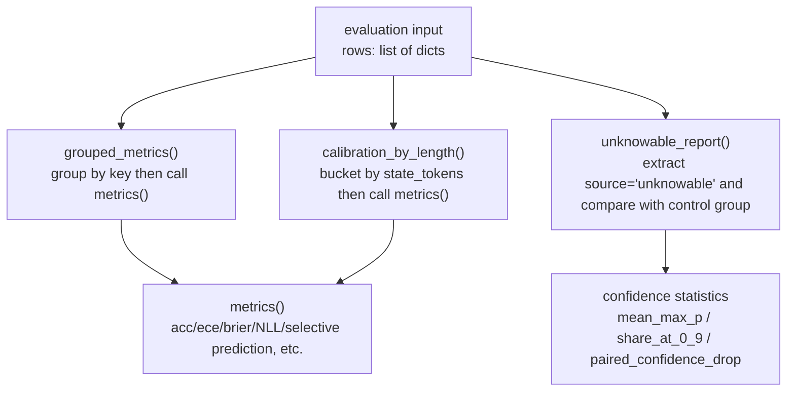
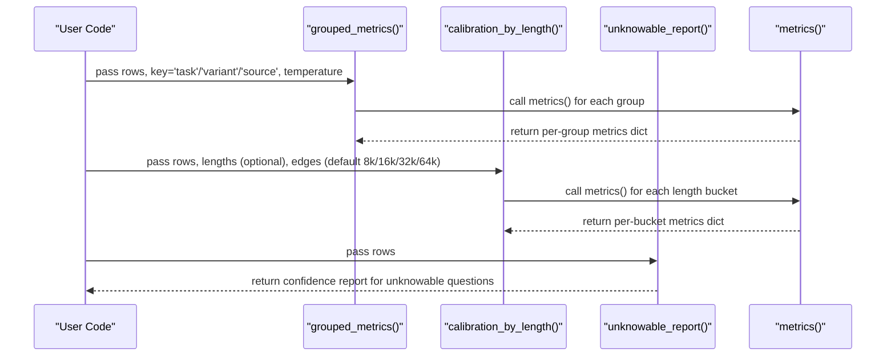
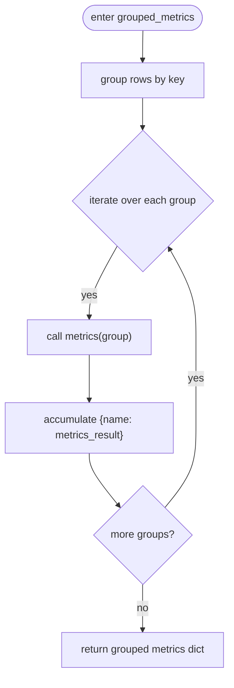
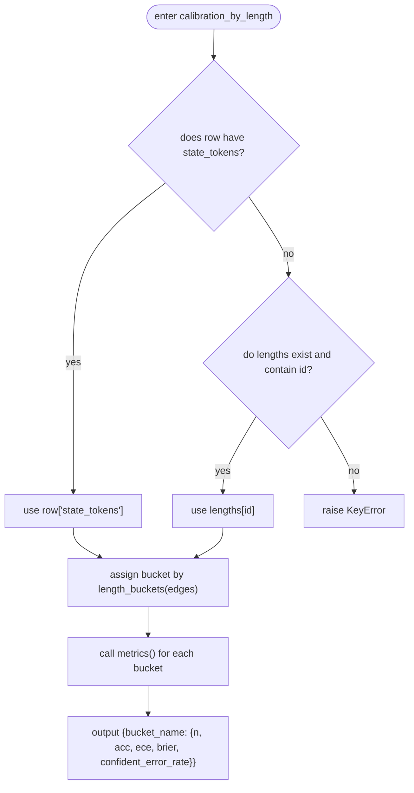
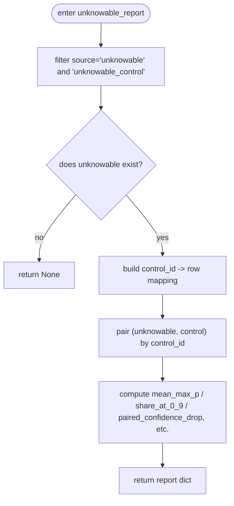
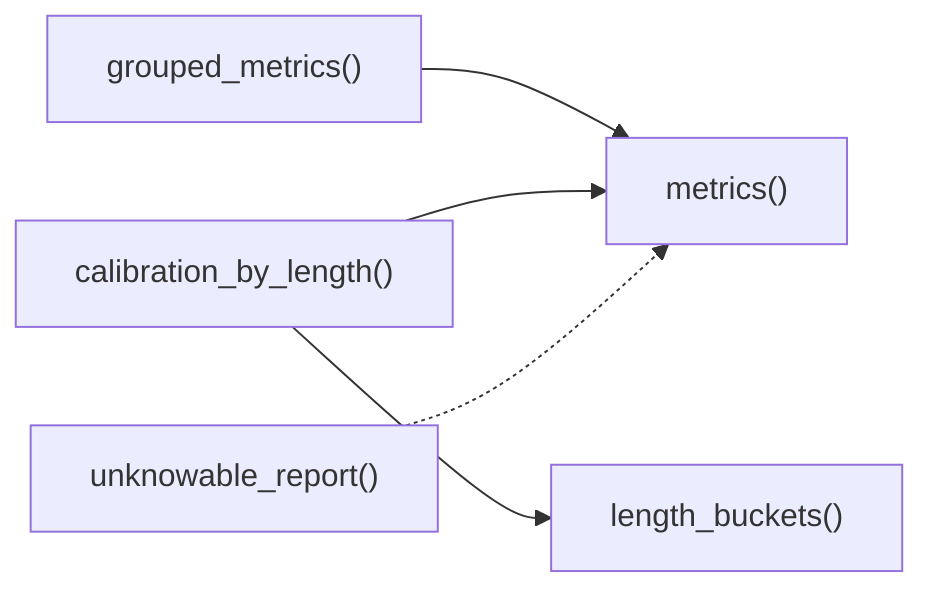

## Table of Contents
1. [Introduction](#introduction)
2. [Project Structure](#project-structure)
3. [Core Components](#core-components)
4. [Architecture Overview](#architecture-overview)
5. [Detailed Component Analysis](#detailed-component-analysis)
6. [Dependency Analysis](#dependency-analysis)
7. [Performance Considerations](#performance-considerations)
8. [Troubleshooting Guide](#troubleshooting-guide)
9. [Conclusion](#conclusion)
10. [Appendix: Usage Examples and Result Interpretation](#appendix-usage-examples-and-result-interpretation)

## Introduction
This document focuses on the "grouping statistics and analysis" capability in model evaluation, organized around the following key functions:
- grouped_metrics(): groups evaluation samples by dimensions such as task, variant, and source, and computes per-group metrics.
- calibration_by_length(): long-context calibration analysis bucketed by state-token length, supporting boundaries such as 8k/16k/32k/64k.
- unknowable_report(): special handling for "unknowable questions", including confidence analysis after evidence removal and paired control-group comparison.

These tools are implemented in pure NumPy and operate directly on the row records produced by the benchmark (containing fields such as p, label, type, keys, task, source, variant), without depending on torch or a specific model, facilitating offline analysis of saved rows.json.

## Project Structure
This functionality is located in kev/metrics.py, which provides unified scoring, calibration, selective prediction, temperature fitting, and cluster resampling capabilities. The main entry points related to grouping statistics are:
- grouped_metrics(rows, key, temperature=1.0)
- calibration_by_length(rows, lengths=None, edges=LENGTH_EDGES)
- unknowable_report(rows)

Diagram Sources
- [metrics.py:167-187](file://kev/metrics.py#L167-L187)
- [metrics.py:206-221](file://kev/metrics.py#L206-L221)
- [metrics.py:64-100](file://kev/metrics.py#L64-L100)

Section Sources
- [metrics.py:1-10](file://kev/metrics.py#L1-L10)

## Core Components
This section outlines the responsibilities and input/output conventions of the three core functions.

- grouped_metrics(rows, key, temperature=1.0)
  - Purpose: groups rows by the specified key (e.g., "task", "variant", "source") and independently calls metrics() for each group to compute metrics.
  - Input: rows (list of row records), key (grouping key name), temperature (optional, default 1.0).
  - Output: a dictionary whose keys are the grouping values and whose values are the structures returned by metrics().

- calibration_by_length(rows, lengths=None, edges=LENGTH_EDGES)
  - Purpose: assigns each record to a different length bucket according to its "state token count", and computes acc, ece, brier, confident_error_rate within each bucket.
  - Input: rows; optional lengths (id -> state_tokens mapping); edges (bucket boundaries, default 8192/16384/32768/65536).
  - Output: a dictionary whose keys are bucket names (such as under_8k, 8k_16k, 16k_32k, 32k_64k, 64k_plus, plus 8k_plus, 16k_plus, 32k_plus) and whose values are dictionaries containing n and each metric.

- unknowable_report(rows)
  - Purpose: for records with source="unknowable", evaluates whether the model can still "know what it does not know" after evidence is removed, and performs a paired comparison with the intact control group (source="unknowable_control").
  - Input: rows.
  - Output: a dictionary containing confidence-related metrics such as mean_max_p, share_at_0_9, paired_confidence_drop; if no comparable data exists, some fields are None.

Section Sources
- [metrics.py:167-187](file://kev/metrics.py#L167-L187)
- [metrics.py:190-221](file://kev/metrics.py#L190-L221)

## Architecture Overview
The following diagram shows the complete flow from raw evaluation rows to grouping/length/unknowable reports.

Diagram Sources
- [metrics.py:167-187](file://kev/metrics.py#L167-L187)
- [metrics.py:206-221](file://kev/metrics.py#L206-L221)
- [metrics.py:64-100](file://kev/metrics.py#L64-L100)

## Detailed Component Analysis

### grouped_metrics(): Multi-Dimensional Grouping Statistics
- Grouping logic
  - Use defaultdict(list) to aggregate rows by row[key].
  - Call metrics() for each group and generate the final dictionary using sorted grouping keys.
- Applicable dimensions
  - task: performance differences across task categories.
  - variant: performance across variants (e.g., clean, adversarial).
  - source: data source (e.g., unknowable, unknowable_control).
- Complexity
  - Time O(N), space O(N) (grouped storage).
- Error handling
  - When a group is empty, metrics() raises an exception internally (an empty set cannot be scored).

Diagram Sources
- [metrics.py:183-187](file://kev/metrics.py#L183-L187)
- [metrics.py:64-100](file://kev/metrics.py#L64-L100)

Section Sources
- [metrics.py:183-187](file://kev/metrics.py#L183-L187)
- [metrics.py:64-100](file://kev/metrics.py#L64-L100)

### calibration_by_length(): Length Bucketing and Long-Context Calibration
- Bucketing strategy
  - Default boundaries LENGTH_EDGES = (8192, 16384, 32768, 65536).
  - length_buckets() generates disjoint buckets: under_8k, 8k_16k, 16k_32k, 32k_64k, 64k_plus, plus tail buckets 8k_plus, 16k_plus, 32k_plus.
  - All boundaries are multiples of 1024, and naming uses k as the unit (e.g., 8k, 16k).
- Source of state token count
  - Prefer row["state_tokens"]; otherwise obtain via lengths[row["id"]].
  - If both are missing, raise KeyError.
- Metric computation
  - Call metrics() within each bucket, keeping only LENGTH_METRICS = ("acc", "ece", "brier", "confident_error_rate").
  - An empty bucket returns n=0 with metrics None.
- Importance of long-context calibration
  - In long-context scenarios, the model's probability calibration may degrade due to attention dispersion or memory decay.
  - Length bucketing can identify calibration bias in specific length intervals (rising ECE, Brier, high-confidence error rate), guiding targeted optimization (e.g., longer-context training, prompt engineering, retrieval augmentation).

Diagram Sources
- [metrics.py:194-221](file://kev/metrics.py#L194-L221)
- [metrics.py:64-100](file://kev/metrics.py#L64-L100)

Section Sources
- [metrics.py:190-221](file://kev/metrics.py#L190-L221)

### unknowable_report(): Unknowable Questions and Paired Control Groups
- Design motivation
  - "Unknowable questions" deliberately remove the key evidence required for the decision, used to test whether the model can correctly express uncertainty.
  - Accuracy is meaningless on such questions; the focus is on whether the model gives low confidence and whether it is significantly lower than its intact control group.
- Data processing
  - Filter records with source="unknowable" and source="unknowable_control".
  - If there are no unknowable records, return None.
  - Pair the unknowable records with their control group via control_id.
- Metric meanings
  - mean_max_p: the average maximum probability of the unknowable group (lower is better).
  - share_at_0_9: the proportion of the unknowable group with confidence ≥0.9 (lower is better).
  - control_mean_max_p / control_share_at_0_9: the corresponding metrics of the control group.
  - paired_confidence_drop: the average difference (control confidence - unknowable confidence) in paired samples (higher means the confidence drops more after evidence removal, i.e., better "knowing it does not know").
  - share_less_confident_than_control: the proportion of paired samples where the unknowable confidence is lower than the control.
- Typical usage
  - Combined with grouped_metrics(rows, key="source") to observe the difference between unknowable and unknowable_control.
  - Combined with calibration_by_length() to inspect the confidence behavior of unknowable questions under long context.

Diagram Sources
- [metrics.py:167-180](file://kev/metrics.py#L167-L180)

Section Sources
- [metrics.py:167-180](file://kev/metrics.py#L167-L180)

## Dependency Analysis
- grouped_metrics() depends on metrics() to compute per-group accuracy, ECE, Brier, NLL, selective-prediction, and other metrics.
- calibration_by_length() depends on length_buckets() to generate buckets, then calls metrics().
- unknowable_report() does not depend on metrics(), and directly performs statistics and paired comparison on confidence.
- All three jointly depend on the underlying data structure: rows is a list of dicts containing fields such as p, label, type, keys, task, source, variant, id, control_id, state_tokens.

Diagram Sources
- [metrics.py:64-100](file://kev/metrics.py#L64-L100)
- [metrics.py:183-187](file://kev/metrics.py#L183-L187)
- [metrics.py:194-221](file://kev/metrics.py#L194-L221)
- [metrics.py:167-180](file://kev/metrics.py#L167-L180)

Section Sources
- [metrics.py:64-100](file://kev/metrics.py#L64-L100)
- [metrics.py:167-180](file://kev/metrics.py#L167-L180)
- [metrics.py:183-187](file://kev/metrics.py#L183-L187)
- [metrics.py:194-221](file://kev/metrics.py#L194-L221)

## Performance Considerations
- Time complexity
  - grouped_metrics(): O(N) grouping + linear scan of metrics() per group, overall O(N).
  - calibration_by_length(): O(N) bucket assignment + metrics() per bucket, overall O(N).
  - unknowable_report(): O(N) filtering and pairing, overall O(N).
- Space complexity
  - Grouping and bucketing require additional storage, O(N).
- Numerical stability
  - metrics() internally clips and normalizes logits and probabilities to avoid NaN/Inf.
- Extensibility
  - Length bucketing granularity can be adjusted via custom edges, adapting to different context-length distributions.

[This section is general performance discussion and does not directly analyze specific code snippets]

## Troubleshooting Guide
- grouped_metrics()
  - Symptom: errors when a group is empty.
  - Cause: metrics() does not accept empty input.
  - Handling: ensure the grouping key has valid data, or filter empty groups before calling.
- calibration_by_length()
  - Symptom: raises KeyError indicating missing state-token count.
  - Cause: row does not record state_tokens and lengths is not provided or does not contain that id.
  - Handling: supply the lengths mapping or ensure the row contains state_tokens.
- unknowable_report()
  - Symptom: returns None.
  - Cause: no records with source="unknowable" exist.
  - Handling: confirm the dataset contains unknowable questions and their control group.

Section Sources
- [metrics.py:64-100](file://kev/metrics.py#L64-L100)
- [metrics.py:167-180](file://kev/metrics.py#L167-L180)
- [metrics.py:206-221](file://kev/metrics.py#L206-L221)

## Conclusion
- grouped_metrics() provides flexible multi-dimensional grouping statistics, making it easy to discover performance differences across tasks, variants, or data sources.
- calibration_by_length() helps locate calibration degradation in long-context scenarios through state-token-length bucketing analysis, supporting boundaries such as 8k/16k/32k/64k.
- unknowable_report() focuses on confidence analysis of "unknowable questions", evaluating whether the model can correctly express uncertainty through paired comparison with the control group.
- Together, the three form a complete grouping-statistics and long-context-calibration analysis system, assisting model diagnosis and optimization.

[This section is summary content and does not directly analyze specific code snippets]

## Appendix: Usage Examples and Result Interpretation

- Example 1: Grouping statistics by task
  - Call grouped_metrics(rows, key="task").
  - Interpretation: compare accuracy, ECE, Brier, and high-confidence error rate across tasks to identify weak tasks.
- Example 2: Grouping statistics by variant
  - Call grouped_metrics(rows, key="variant").
  - Interpretation: compare the performance of variants such as clean and adversarial to assess robustness.
- Example 3: Grouping statistics by source
  - Call grouped_metrics(rows, key="source").
  - Interpretation: observe the difference between unknowable and unknowable_control, and combine with unknowable_report() for deeper analysis.
- Example 4: Length bucketing analysis
  - Call calibration_by_length(rows, lengths=lengths_map) or calibration_by_length(rows) (if the row contains state_tokens).
  - Interpretation: focus on ECE and Brier in buckets such as 8k_16k, 16k_32k, 32k_64k, 64k_plus to identify long-context calibration degradation intervals.
- Example 5: Unknowable-question confidence analysis
  - Call unknowable_report(rows).
  - Interpretation: the lower the mean_max_p, the lower the share_at_0_9, and the higher the paired_confidence_drop, the more the model tends to express uncertainty after evidence removal.

[This section is a conceptual example and does not directly reference specific code snippets]
