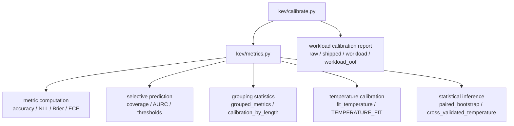
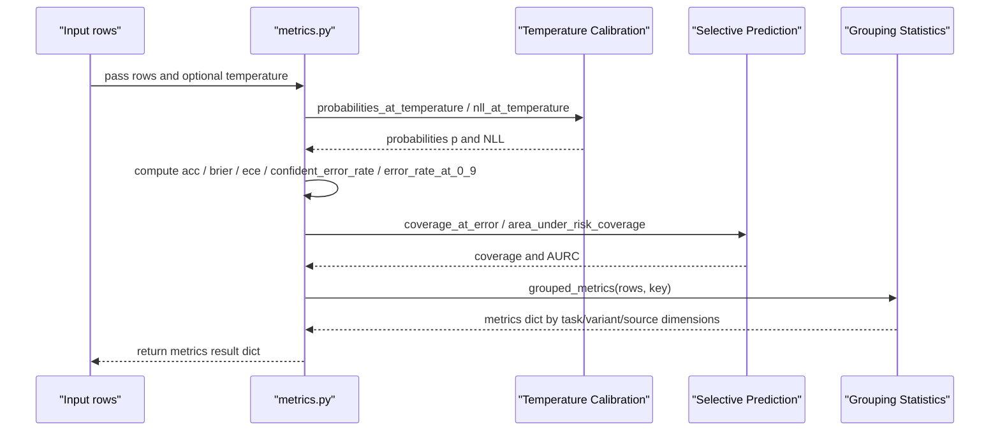
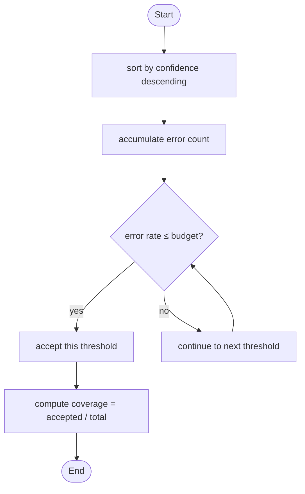
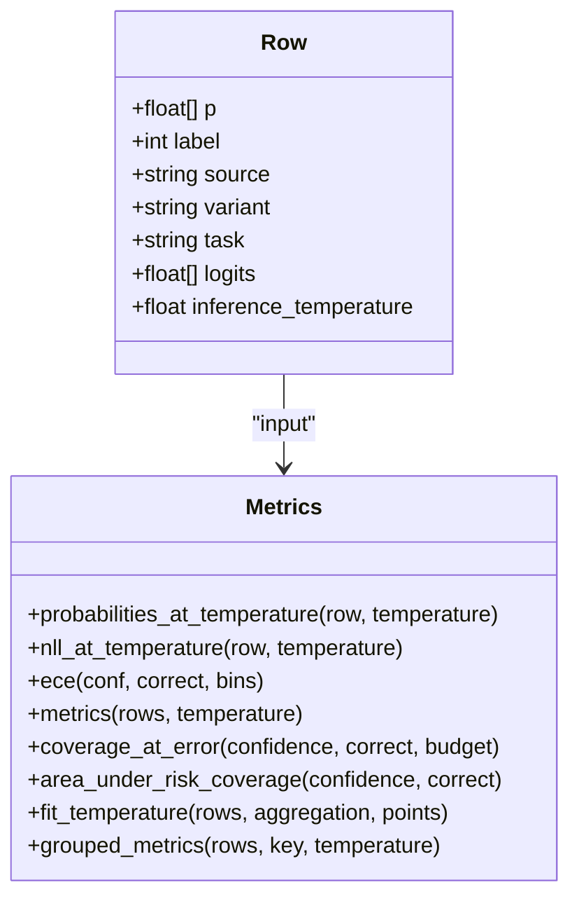
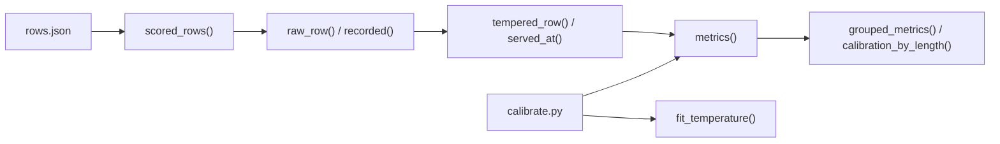

## Table of Contents
1. [Introduction](#introduction)
2. [Project Structure](#project-structure)
3. [Core Components](#core-components)
4. [Architecture Overview](#architecture-overview)
5. [Detailed Component Analysis](#detailed-component-analysis)
6. [Dependency Analysis](#dependency-analysis)
7. [Performance and Optimization Suggestions](#performance-and-optimization-suggestions)
8. [Troubleshooting Guide](#troubleshooting-guide)
9. [Conclusion](#conclusion)
10. [Appendix: Metric Quick Reference](#appendix-metric-quick-reference)

## Introduction
This document systematically reviews the performance-metric computation implementation of the Kev project, covering the following goals:
- Core metric computation methods: accuracy, Brier score, negative log-likelihood (NLL), calibration error (ECE).
- Confidence-related metrics: confident_error_rate (high-confidence error rate), error_rate_at_0_9 (error rate at threshold 0.9), AURC (area under the risk-coverage curve).
- Grouping statistics grouped_metrics: performance analysis along dimensions such as task, variant, and source.
- Special handling logic for unknowable questions.
- The mathematical principle of probability calibration and the impact of the temperature parameter T.
- Performance considerations and optimization suggestions for metric computation.
- How to use the metrics() function for custom metric computation.

## Project Structure
The code directly related to performance metrics is concentrated in two modules:
- kev/metrics.py: metric definitions, temperature calibration, selective prediction, grouping statistics, paired bootstrap, and cross-validation, etc.
- kev/calibrate.py: a workload-oriented temperature-calibration report generator that calls the utility functions in metrics to output multi-arm comparison results.

Diagram Sources
- [metrics.py:15-100](file://kev/metrics.py#L15-L100)
- [metrics.py:183-221](file://kev/metrics.py#L183-L221)
- [metrics.py:276-294](file://kev/metrics.py#L276-L294)
- [metrics.py:308-370](file://kev/metrics.py#L308-L370)
- [calibrate.py:28-44](file://kev/calibrate.py#L28-L44)

Section Sources
- [metrics.py:1-10](file://kev/metrics.py#L1-L10)
- [calibrate.py:1-17](file://kev/calibrate.py#L1-L17)

## Core Components
This section focuses on the core functions and data structures used for metric computation in metrics.py.

- ece(conf, correct, bins=10): expected calibration error with equal-width bins.
- probabilities_at_temperature(row, temperature): computes the probability distribution at a given temperature.
- nll_at_temperature(row, temperature): computes the negative log-likelihood at a given temperature.
- _row_scores(row): the additive metric vector for a single sample, for use by paired bootstrap.
- metrics(rows, temperature=1.0): batch metric aggregation, including accuracy, NLL, Brier, ECE, confidence metrics, selective-prediction metrics, etc.
- coverage_at_error(confidence, correct, budget): coverage under a fixed error budget.
- area_under_risk_coverage(confidence, correct): AURC.
- select_threshold(confidence, correct, budget, min_accepted=1): selects a threshold that satisfies the error budget.
- evaluate_threshold(confidence, correct, threshold): evaluates the coverage and risk at a specified threshold.
- unknowable_report(rows): a confidence report for unknowable questions.
- grouped_metrics(rows, key, temperature=1.0): computes metrics grouped by an arbitrary key.
- length_buckets(edges) and calibration_by_length(rows, lengths=None, edges=LENGTH_EDGES): length-bucketed calibration analysis by state length.
- tempered_row(row, temperature), raw_row(row), recorded(row), served_at(rows, temperature), served(fit_rows, eval_rows, **fit_kwargs): temperature transformation and row-data standardization.
- fit_temperature(rows, aggregation="macro", points=81): optimal-temperature fitting based on grid search.
- cluster_resamples(rows, samples, seed), grouped_folds(rows, folds, seed), out_of_fold_rows(rows, folds=5, seed=0, **fit_kwargs), cross_validated_temperature(rows, folds=5, seed=0, samples=1000, **fit_kwargs): cluster resampling, grouped fold splitting, and cross-validated temperature reporting.
- paired_bootstrap(candidate, reference, samples=1000, seed=0, metric="nll", aggregation="macro"): paired bootstrap comparison of candidate and reference models.

Section Sources
- [metrics.py:15-21](file://kev/metrics.py#L15-L21)
- [metrics.py:29-53](file://kev/metrics.py#L29-L53)
- [metrics.py:56-100](file://kev/metrics.py#L56-L100)
- [metrics.py:103-164](file://kev/metrics.py#L103-L164)
- [metrics.py:167-180](file://kev/metrics.py#L167-L180)
- [metrics.py:183-221](file://kev/metrics.py#L183-L221)
- [metrics.py:224-267](file://kev/metrics.py#L224-L267)
- [metrics.py:276-294](file://kev/metrics.py#L276-L294)
- [metrics.py:297-370](file://kev/metrics.py#L297-L370)
- [metrics.py:372-427](file://kev/metrics.py#L372-L427)

## Architecture Overview
The following diagram shows the key flow from raw row data to final metric output, including temperature calibration, metric aggregation, selective prediction, and grouping statistics.

Diagram Sources
- [metrics.py:39-53](file://kev/metrics.py#L39-L53)
- [metrics.py:64-100](file://kev/metrics.py#L64-L100)
- [metrics.py:103-147](file://kev/metrics.py#L103-L147)
- [metrics.py:183-187](file://kev/metrics.py#L183-L187)

## Detailed Component Analysis

### Core Metric Computation Methods

#### Accuracy
- Definition: the proportion of predicted classes equal to the ground-truth label.
- Implementation notes: take the class corresponding to the maximum probability as the prediction, compare with label to get a boolean correctness, then take the mean.
- Complexity: O(n), where n is the number of samples.

Section Sources
- [metrics.py:56-61](file://kev/metrics.py#L56-L61)
- [metrics.py:68-74](file://kev/metrics.py#L68-L74)

#### Brier Score
- Definition: the mean squared error between the predicted probability distribution and the one-hot ground-truth label.
- Implementation notes: for each sample compute the sum of (p - y_onehot)^2, then average over all samples.
- Complexity: O(n·k), where k is the number of options.

Section Sources
- [metrics.py:71-74](file://kev/metrics.py#L71-L74)

#### Negative Log-Likelihood (NLL)
- Definition: the negative log-likelihood of the logit corresponding to the ground-truth label at a given temperature T.
- Implementation notes: if logits are recorded, apply temperature scaling and normalization first; otherwise recover an approximate logit from the probability before computing.
- Numerical stability: use EPSILON to prevent log(0).
- Complexity: O(k) per sample.

Section Sources
- [metrics.py:29-36](file://kev/metrics.py#L29-L36)
- [metrics.py:48-53](file://kev/metrics.py#L48-L53)

#### Calibration Error (ECE)
- Definition: bin confidence with equal width, and compute the weighted average of the deviation between accuracy and average confidence within each bin.
- Implementation notes: bins=10 by default for equal-width intervals; boundary handling ensures consistency of closed intervals.
- Complexity: O(n + bins).

Section Sources
- [metrics.py:15-21](file://kev/metrics.py#L15-L21)

#### Confidence-Related Metrics
- confident_error_rate: the proportion of errors with confidence ≥ 0.9.
- error_rate_at_0_9: the error rate on the subset with confidence ≥ 0.9.
- coverage_at_0_9: the coverage with confidence ≥ 0.9.
- confidence_bias: average confidence minus accuracy, diagnosing overconfidence or underconfidence.
- top_bins: statistics on count, error count, and error rate at multiple thresholds (0.9/0.95/0.99).

Section Sources
- [metrics.py:56-61](file://kev/metrics.py#L56-L61)
- [metrics.py:80-91](file://kev/metrics.py#L80-L91)

#### Selective Prediction and AURC
- coverage_at_error(confidence, correct, budget): accept decisions in descending confidence order, the maximum coverage such that the empirical error rate does not exceed the budget.
- risk_coverage_curve(confidence, correct): discrete points of the risk-coverage curve.
- area_under_risk_coverage(confidence, correct): AURC, approximated via trapezoidal integration of the risk-coverage curve.
- select_threshold(confidence, correct, budget, min_accepted=1): selects the minimum threshold that satisfies the error budget.
- evaluate_threshold(confidence, correct, threshold): evaluates the coverage and risk at the specified threshold.

Diagram Sources
- [metrics.py:103-111](file://kev/metrics.py#L103-L111)
- [metrics.py:125-132](file://kev/metrics.py#L125-L132)
- [metrics.py:142-147](file://kev/metrics.py#L142-L147)

Section Sources
- [metrics.py:103-164](file://kev/metrics.py#L103-L164)

### Grouping Statistics (grouped_metrics)
- Function: groups rows by an arbitrary key (such as task, variant, source) and calls metrics() separately for each group to compute metrics.
- Use: multi-dimensional performance analysis, facilitating comparison of performance across tasks, variants, or data sources.
- Note: key must exist in every row, otherwise a KeyError is raised.

Section Sources
- [metrics.py:183-187](file://kev/metrics.py#L183-L187)

### Special Handling of Unknowable Questions
- Background: some questions are designed to be "unknowable" (source='unknowable'), where accuracy is meaningless; the focus is on whether the model "knows what it does not know".
- Handling logic:
  - Only statistics mean_max_p (mean of maximum probability) and share_at_0_9 (proportion ≥ 0.9) are computed.
  - Paired comparison with the intact control (source='unknowable_control') on confidence drop and the proportion below control.
  - The control group's accuracy is also reported, but the unknowable group's own accuracy is not interpretable.
- Filtering: metrics() by default computes only knowable and clean records; unknowable is handled by the dedicated report function.

Section Sources
- [metrics.py:167-180](file://kev/metrics.py#L167-L180)
- [metrics.py:264-267](file://kev/metrics.py#L264-L267)

### Probability Calibration and Temperature Parameter T
- Temperature scaling: logits are scaled by (z - max(z)) / T and then softmax; T > 1 is smoother (lower confidence), T < 1 is sharper (higher confidence).
- Probability recovery: when logits are not recorded, recover an approximate logit from p (log(max(p, EPSILON))).
- Temperature fitting: search on a log grid of 0.25..4 for the T that minimizes the (micro or macro) mean NLL.
- Serving temperature: served_at() standardizes row data into the form "served at a certain temperature", ensuring cross-source consistency and comparability.

Diagram Sources
- [metrics.py:29-53](file://kev/metrics.py#L29-L53)
- [metrics.py:64-100](file://kev/metrics.py#L64-L100)
- [metrics.py:276-294](file://kev/metrics.py#L276-L294)

Section Sources
- [metrics.py:29-53](file://kev/metrics.py#L29-L53)
- [metrics.py:224-267](file://kev/metrics.py#L224-L267)
- [metrics.py:276-294](file://kev/metrics.py#L276-L294)

### Custom Metric Computation with metrics()
- Input: a list of rows, each row containing at least p, label, and optionally logits, inference_temperature, task, variant, source, and other metadata.
- Output: a dictionary containing fields such as n, nll, acc, ece, brier, mean_conf, confident_error_rate, coverage_at_0_9, accuracy_at_0_9, coverage_at_5pct_error, coverage_at_1pct_error, aurc, error_rate_at_0_9, confidence_bias, top_bins, selective.
- Extension: combine grouped_metrics(rows, key) to split computation by task/variant/source, or use calibration_by_length(rows, lengths, edges) to bucket analysis by state length.

Section Sources
- [metrics.py:64-100](file://kev/metrics.py#L64-L100)
- [metrics.py:183-187](file://kev/metrics.py#L183-L187)
- [metrics.py:206-221](file://kev/metrics.py#L206-L221)

## Dependency Analysis
- metrics.py is self-contained internally: all metrics and statistical methods are implemented in the same file, avoiding external dependency on torch/tensorflow.
- calibrate.py depends on metrics.py: it imports utility functions such as fit_temperature, metrics, out_of_fold_rows, paired_bootstrap, raw_row, tempered_row, scored_rows to build the workload calibration report.
- Data flow:
  - Input rows.json → scored_rows() filters clean knowable samples → raw_row()/tempered_row() standardizes temperature → metrics() aggregates metrics → grouped_metrics()/calibration_by_length() performs multi-dimensional analysis.
  - Temperature fitting: fit_temperature() searches the grid for the optimal T → served_at()/served() applies the temperature.

Diagram Sources
- [metrics.py:224-267](file://kev/metrics.py#L224-L267)
- [metrics.py:276-294](file://kev/metrics.py#L276-L294)
- [calibrate.py:28-44](file://kev/calibrate.py#L28-L44)

Section Sources
- [metrics.py:224-267](file://kev/metrics.py#L224-L267)
- [calibrate.py:28-44](file://kev/calibrate.py#L28-L44)

## Performance and Optimization Suggestions
- Vectorized computation:
  - Use numpy array operations instead of Python loops to reduce interpretation overhead.
  - For large k (number of options), prefer matrix operations to compute Brier and NLL.
- Memory management:
  - For large-scale rows, process metrics() in batches or switch to streaming aggregation to avoid loading all intermediate arrays at once.
- Numerical stability:
  - Keep EPSILON to prevent overflow; clip logits or probabilities before log/exp.
- Temperature-fitting optimization:
  - More grid points (points) is more accurate but slower; can be adjusted based on task scale.
  - Use micro/macro aggregation to balance task weights; macro is more sensitive to long-tail tasks.
- Selective prediction:
  - Pre-sort the confidence array and reuse cumsum results to reduce repeated computation.
- I/O and serialization:
  - When saving rows.json, attach logits and inference_temperature to avoid precision loss in later reconstruction.

[This section is general guidance and does not require specific file references]

## Troubleshooting Guide
- Empty dataset: metrics() throws ValueError on empty rows.
- Illegal temperature: a non-positive or non-finite temperature triggers ValueError.
- Inconsistent logits shape: logits shape must match p and be fully finite.
- Illegal error budget: coverage_at_error requires budget ∈ [0,1].
- Confidence and correctness dimension mismatch: selective-related functions require equal-length vectors of valid types.
- Missing unknown field: grouped_metrics() and calibration_by_length() require the corresponding key to exist in the row.
- Inconsistent paired comparison: paired_bootstrap() requires candidate and reference to have the same id/question and label order.

Section Sources
- [metrics.py:24-27](file://kev/metrics.py#L24-L27)
- [metrics.py:29-36](file://kev/metrics.py#L29-L36)
- [metrics.py:103-122](file://kev/metrics.py#L103-L122)
- [metrics.py:372-397](file://kev/metrics.py#L372-L397)

## Conclusion
The Kev performance-metric system is organized around three dimensions—accuracy, calibration, and selective prediction—providing a complete toolchain from basic metrics to advanced statistical inference. Through temperature calibration and grouping statistics, users can perform fine-grained analysis across tasks, variants, and data sources; the special handling of unknowable helps identify the model's self-cognition ability. In practical engineering, it is recommended to combine vectorized computation, numerical stability, and batch-processing strategies to obtain efficient and reliable metric evaluation.

[This section is summary content and does not require specific file references]

## Appendix: Metric Quick Reference
- accuracy: the proportion of predicted classes consistent with the ground-truth label.
- Brier: the mean squared error between the predicted probability and the one-hot label.
- NLL: the negative log-likelihood of the logit corresponding to the ground-truth label.
- ECE: the calibration error after confidence binning.
- confident_error_rate: the error proportion with confidence ≥ 0.9.
- error_rate_at_0_9: the error rate on the subset with confidence ≥ 0.9.
- coverage_at_0_9: the coverage with confidence ≥ 0.9.
- coverage_at_5pct_error / coverage_at_1pct_error: coverage under a fixed error budget.
- AURC: area under the risk-coverage curve.
- confidence_bias: average confidence minus accuracy.
- selective: coverage and accuracy at different confidence quantiles (0.5/0.8).

Section Sources
- [metrics.py:64-100](file://kev/metrics.py#L64-L100)
