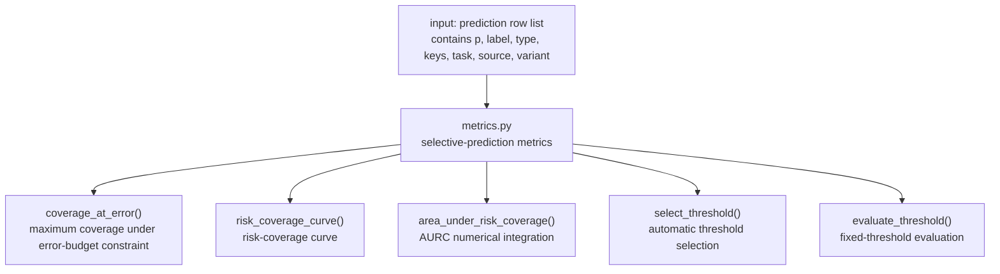
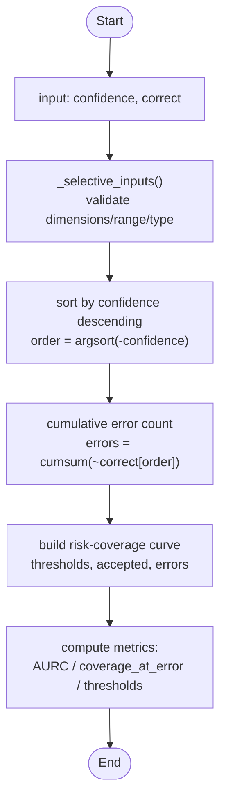
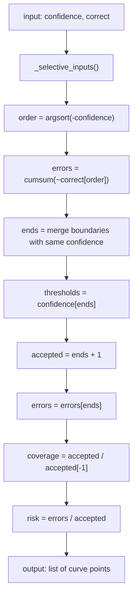
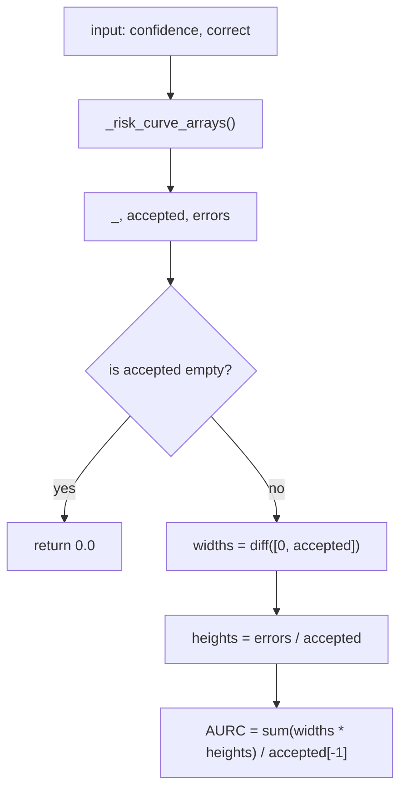
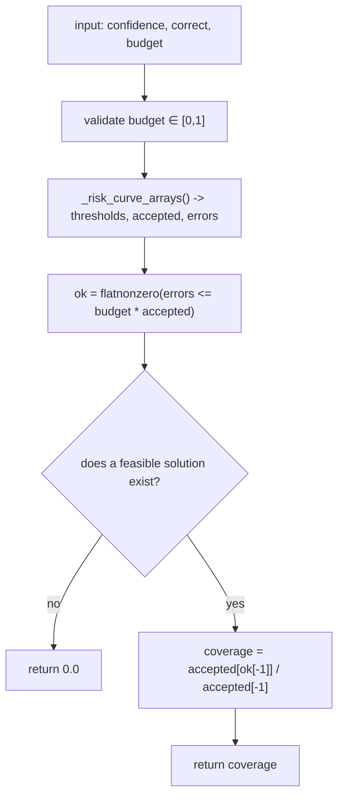
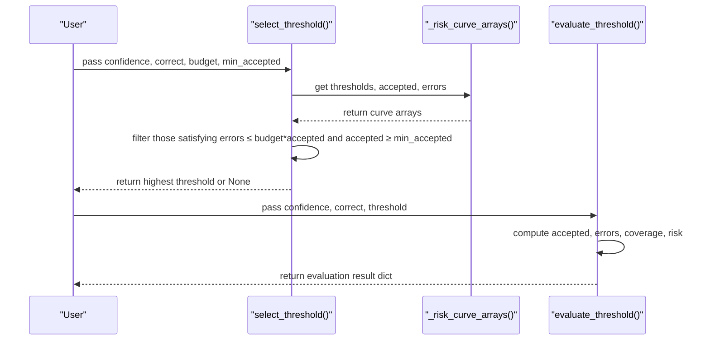
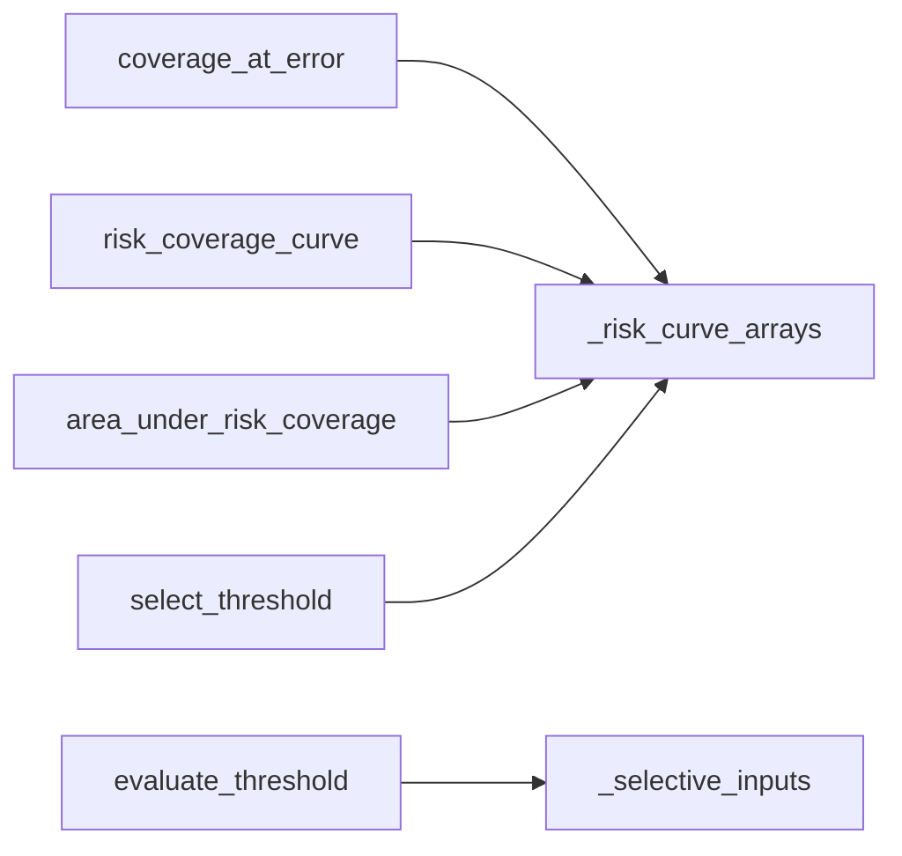

## Table of Contents
1. [Introduction](#introduction)
2. [Project Structure](#project-structure)
3. [Core Components](#core-components)
4. [Architecture Overview](#architecture-overview)
5. [Detailed Component Analysis](#detailed-component-analysis)
6. [Dependency Analysis](#dependency-analysis)
7. [Performance Considerations](#performance-considerations)
8. [Troubleshooting Guide](#troubleshooting-guide)
9. [Conclusion](#conclusion)
10. [Appendix: Usage Examples and Best Practices](#appendix-usage-examples-and-best-practices)

## Introduction
This document targets the "Selective Prediction" evaluation system, focusing on the following goals:
- Explain the computation method and business meaning of the high-confidence error rate confident_error_rate and the error rate at the 0.9 threshold error_rate_at_0_9.
- Detail the construction process of the risk-coverage curve risk_coverage_curve: sorting by confidence, cumulative error counting, and coverage computation.
- Explain the numerical-integration method for the area under the curve AURC and its role in model-reliability assessment.
- Document the selective-automation logic of coverage_at_error(): finding the maximum coverage under an error-budget constraint.
- Provide usage guidance for select_threshold() and evaluate_threshold() to help choose a confidence threshold according to business needs.
- Summarize best practices for selective prediction in real-world applications.

## Project Structure
The selective-prediction implementation in this repository is concentrated in metrics.py, which scores "row-level prediction results" in pure NumPy, without depending on a specific model or framework, facilitating offline evaluation and comparison.

Diagram Sources
- [metrics.py:103-164](file://kev/metrics.py#L103-L164)

Section Sources
- [metrics.py:1-10](file://kev/metrics.py#L1-L10)

## Core Components
This section outlines the key functions and their responsibilities:
- coverage_at_error(confidence, correct, budget): given an error budget, accept samples from highest to lowest confidence to maximize coverage while keeping the empirical error rate within the budget.
- risk_coverage_curve(confidence, correct): generate risk-coverage curve data points, including threshold, accepted count, error count, coverage, and risk.
- area_under_risk_coverage(confidence, correct): compute AURC based on numerical integration of the risk-coverage curve.
- select_threshold(confidence, correct, budget, min_accepted=1): under the error budget and minimum accepted-count constraints, return the highest confidence threshold.
- evaluate_threshold(confidence, correct, threshold): evaluate a specified threshold, outputting accepted count, error count, coverage, and risk.

Section Sources
- [metrics.py:103-164](file://kev/metrics.py#L103-L164)

## Architecture Overview
The core flow of selective-prediction evaluation is as follows:
- The input is the confidence and correctness for each sample.
- _risk_curve_arrays sorts the samples in descending confidence order and computes the cumulative error count.
- Based on the above arrays, the risk-coverage curve is built, AURC is computed, and the maximum coverage and threshold satisfying the budget are solved.
- Interfaces such as coverage_at_error, risk_coverage_curve, area_under_risk_coverage, select_threshold, and evaluate_threshold are exposed externally.

Diagram Sources
- [metrics.py:114-146](file://kev/metrics.py#L114-L146)

## Detailed Component Analysis

### High-Confidence Error Rate confident_error_rate and Error Rate at 0.9 Threshold error_rate_at_0_9
- confident_error_rate: among all samples, filter the subset with confidence ≥ 0.9 and compute the proportion of errors within it. Used to measure the risk surface of "high confidence but wrong".
- error_rate_at_0_9: also targets the subset with confidence ≥ 0.9 and computes its error rate; returns null when no sample with confidence ≥ 0.9 exists.

These two metrics are commonly used to quickly diagnose whether the model exhibits "overconfident errors", especially in safety-sensitive scenarios where high-confidence errors must be strictly controlled.

Section Sources
- [metrics.py:56-62](file://kev/metrics.py#L56-L62)
- [metrics.py:78-91](file://kev/metrics.py#L78-L91)

### Risk-Coverage Curve risk_coverage_curve
Construction steps:
1. Input confidence and correct, and validate their validity.
2. Sort in descending confidence order to obtain order.
3. Compute cumulative error count errors = cumsum(~correct[order]).
4. Merge boundary points with the same confidence to obtain thresholds, accepted, errors.
5. For each threshold point, compute coverage = n / N and risk = e / n.

Diagram Sources
- [metrics.py:114-139](file://kev/metrics.py#L114-L139)

Section Sources
- [metrics.py:114-139](file://kev/metrics.py#L114-L139)

### Numerical Integration of AURC (Area Under the Curve)
AURC is a scalar metric obtained by numerically integrating the risk-coverage curve, used to comprehensively evaluate the model's "average risk at different coverage levels". Implementation notes:
- Use the already-computed accepted and errors sequences.
- Obtain the width of adjacent intervals via np.diff(accepted).
- Within each interval, approximate risk using errors / accepted as the height.
- Sum over all intervals and divide by the total accepted count accepted[-1] to obtain the normalized area under the curve.

Diagram Sources
- [metrics.py:142-146](file://kev/metrics.py#L142-L146)

Section Sources
- [metrics.py:142-146](file://kev/metrics.py#L142-L146)

### Selective Automation Logic of coverage_at_error()
Goal: under the error-budget constraint, find the set of samples accepted from highest to lowest confidence such that the empirical error rate does not exceed budget while maximizing coverage.

Algorithm flow:
1. Validate budget ∈ [0, 1].
2. Call _risk_curve_arrays to obtain thresholds, accepted, errors.
3. Filter indices ok that satisfy errors ≤ budget × accepted.
4. If a feasible solution exists, take the coverage of the last feasible point accepted[ok[-1]] / accepted[-1]; otherwise return 0.0.

Diagram Sources
- [metrics.py:103-111](file://kev/metrics.py#L103-L111)
- [metrics.py:125-132](file://kev/metrics.py#L125-L132)

Section Sources
- [metrics.py:103-111](file://kev/metrics.py#L103-L111)
- [metrics.py:125-132](file://kev/metrics.py#L125-L132)

### select_threshold() and evaluate_threshold()
- select_threshold(confidence, correct, budget, min_accepted=1):
  - Under the error-budget and minimum-accepted-count constraints, return the highest confidence threshold.
  - If no feasible solution, return None.
- evaluate_threshold(confidence, correct, threshold):
  - Evaluate the given threshold, outputting accepted count, error count, coverage, and risk.
  - Supports threshold=None meaning reject all (abstain-all).

Diagram Sources
- [metrics.py:149-164](file://kev/metrics.py#L149-L164)
- [metrics.py:125-132](file://kev/metrics.py#L125-L132)

Section Sources
- [metrics.py:149-164](file://kev/metrics.py#L149-L164)
- [metrics.py:125-132](file://kev/metrics.py#L125-L132)

## Dependency Analysis
The dependency relationships of the selective-prediction functions are as follows:
- coverage_at_error depends on _risk_curve_arrays.
- risk_coverage_curve depends on _risk_curve_arrays.
- area_under_risk_coverage depends on _risk_curve_arrays.
- select_threshold depends on _risk_curve_arrays.
- evaluate_threshold depends on _selective_inputs.

Diagram Sources
- [metrics.py:103-164](file://kev/metrics.py#L103-L164)

Section Sources
- [metrics.py:103-164](file://kev/metrics.py#L103-L164)

## Performance Considerations
- Time complexity: the main operations are sorting and cumulative summation, with complexity about O(N log N), suitable for medium-scale datasets.
- Space complexity: auxiliary arrays (order, errors, thresholds, accepted) occupy O(N).
- Numerical stability: confidence must be finite and within [0, 1]; boolean correctness must be strictly validated.
- Vectorization optimization: NumPy operations such as argsort, cumsum, and diff are efficient, avoiding explicit loops.

## Troubleshooting Guide
Common problems and handling suggestions:
- Error budget not in [0, 1]: coverage_at_error raises ValueError. Check the budget setting.
- Confidence non-finite or out of range: _selective_inputs raises ValueError. Ensure confidence ∈ [0, 1] with no NaN/Inf.
- Correctness not boolean: _selective_inputs raises ValueError. Ensure correct is a boolean array.
- Invalid threshold: evaluate_threshold raises ValueError. Ensure threshold ∈ [0, 1] or is None.
- Empty input: area_under_risk_coverage returns 0.0 on empty input; coverage_at_error returns 0.0 when no feasible solution exists.

Section Sources
- [metrics.py:103-164](file://kev/metrics.py#L103-L164)

## Conclusion
Selective prediction controls the model's "accept/reject" behavior through confidence thresholds, thereby balancing accuracy and coverage. confident_error_rate and error_rate_at_0_9 are used to identify high-confidence error risk; risk_coverage_curve and AURC provide a global perspective on reliability; coverage_at_error and select_threshold provide automated decision-making capability under business constraints. Combined with evaluate_threshold, thresholds can be flexibly configured in real systems to meet compliance and performance requirements.

## Appendix: Usage Examples and Best Practices

### Usage Examples
- Compute the error rate and coverage at the 0.9 threshold:
  - Use error_rate_at_0_9 and coverage_at_0_9 returned by metrics(rows).
- Compute the maximum coverage under the error budget 0.05:
  - Call coverage_at_error(confidence, correct, 0.05).
- Automatically generate a threshold satisfying the budget and minimum accepted count:
  - Call select_threshold(confidence, correct, budget=0.05, min_accepted=10).
- Evaluate the acceptance at a fixed threshold:
  - Call evaluate_threshold(confidence, correct, threshold=0.9).

### Best Practices
- Calibration first: before using selective prediction, perform temperature fitting to improve probability reliability.
- Multi-threshold strategy: set different thresholds or budgets for different business scenarios, e.g., stricter thresholds for high-risk tasks.
- Monitor high-confidence errors: regularly track confident_error_rate to detect model degradation or distribution drift.
- Visualize the risk-coverage curve: plot the curve via risk_coverage_curve to intuitively understand the risk-coverage trade-off at different thresholds.
- Combine with AURC: in model comparison, AURC can serve as a comprehensive metric reflecting overall reliability.
- Automated threshold selection: in production, use select_threshold to dynamically adjust thresholds to satisfy real-time business constraints.

Section Sources
- [metrics.py:64-100](file://kev/metrics.py#L64-L100)
- [metrics.py:103-164](file://kev/metrics.py#L103-L164)
