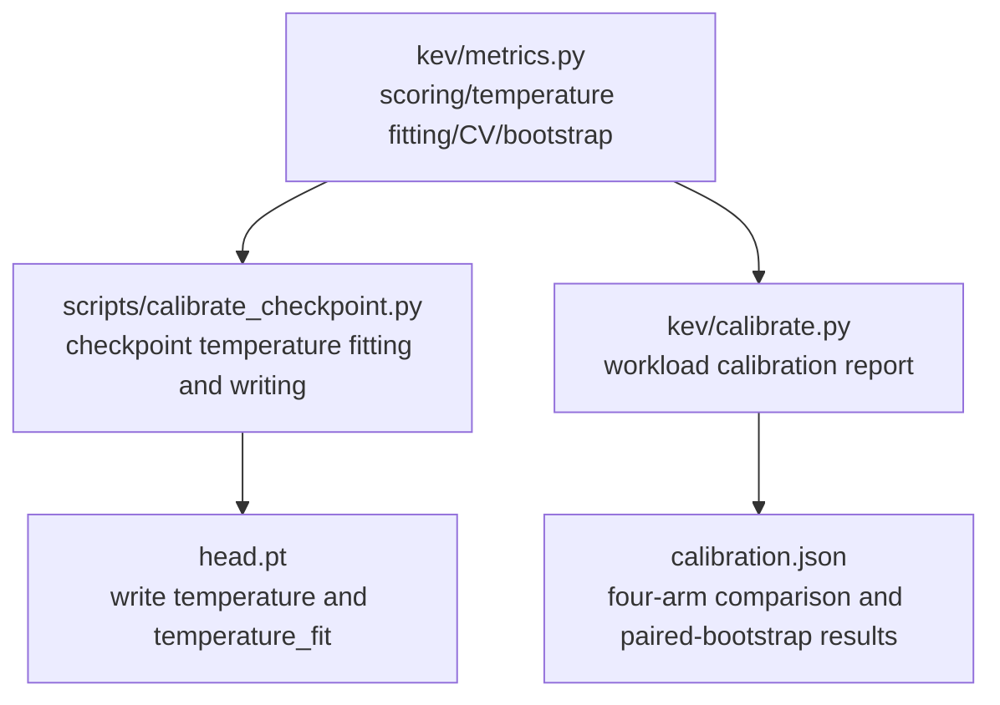
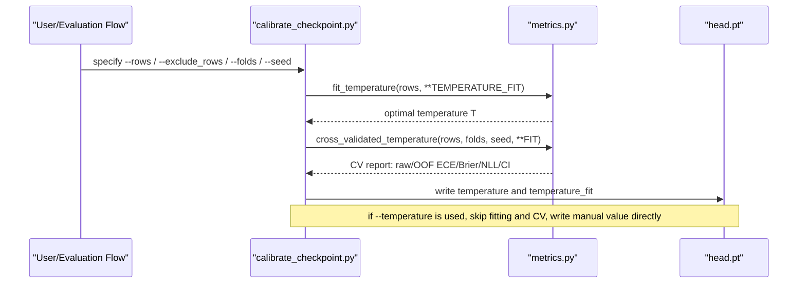
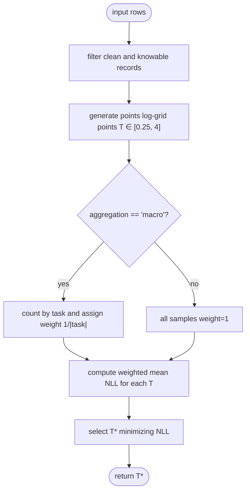
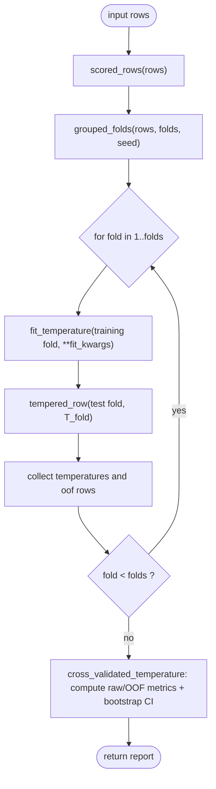
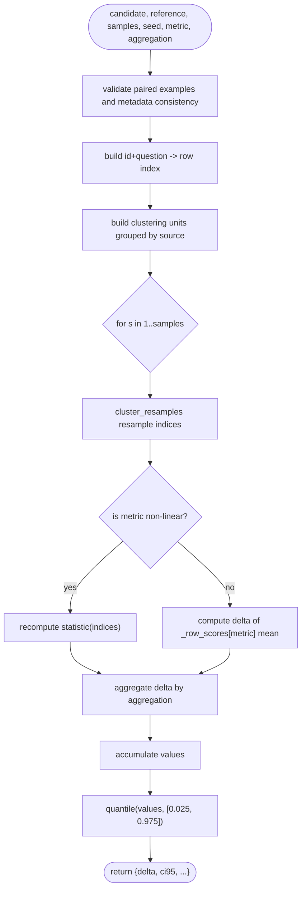
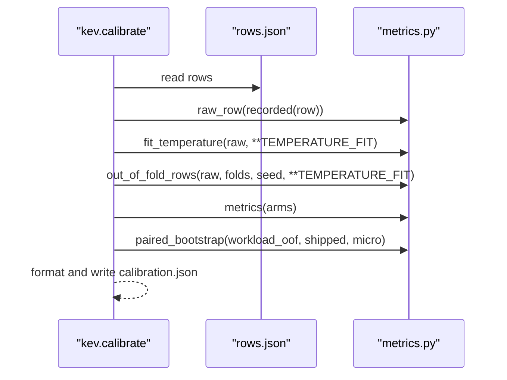
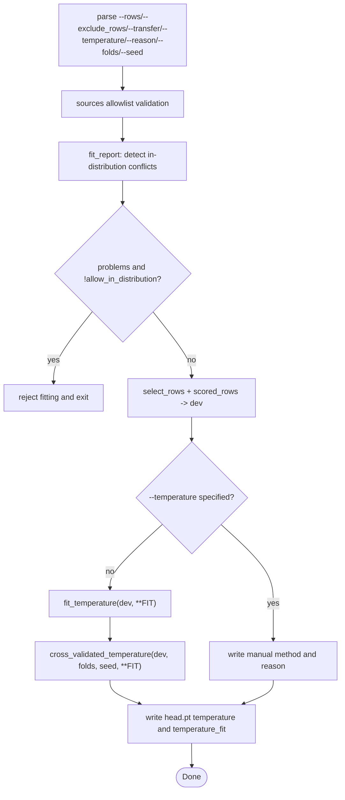
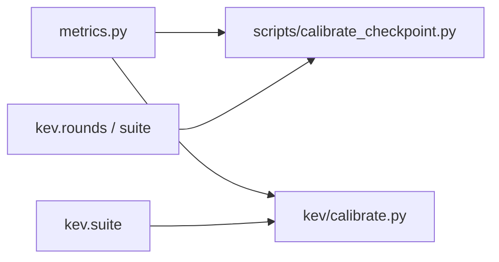

## Table of Contents
1. [Introduction](#introduction)
2. [Project Structure](#project-structure)
3. [Core Components](#core-components)
4. [Architecture Overview](#architecture-overview)
5. [Detailed Component Analysis](#detailed-component-analysis)
6. [Dependency Analysis](#dependency-analysis)
7. [Performance and Complexity](#performance-and-complexity)
8. [Troubleshooting Guide](#troubleshooting-guide)
9. [Conclusion](#conclusion)
10. [Appendix: Configuration and Best Practices](#appendix-configuration-and-best-practices)

## Introduction
This document systematically explains the mathematical principle, implementation details, and validation workflow of temperature calibration in this project, focusing on the following:
- The mathematical objective of temperature-parameter fitting: minimizing the negative log-likelihood (NLL) on a log grid from 0.25 to 4.
- The difference between the micro and macro aggregation strategies, how task weights are assigned, and the applicable scenarios.
- The cross-validated temperature-fitting workflow: the mutually exclusive fold split by (source, group) in out_of_fold_rows(), and the complete report generation of cross_validated_temperature().
- The paired bootstrap statistical test paired_bootstrap(): source-stratified cluster resampling, confidence intervals, and significance judgment.
- The meaning of the temperature_fitting configuration option TEMPERATURE_FIT and adjustment suggestions.
- Application cases and best practices in actual deployment.

## Project Structure
The core code around temperature fitting and validation is concentrated in the following three modules:
- kev/metrics.py: pure-NumPy implementation of scoring, temperature fitting, cross-validation, and paired bootstrap.
- scripts/calibrate_checkpoint.py: a temperature-fitting script for released checkpoints that writes head.pt and outputs an OOF report.
- kev/calibrate.py: a workload-calibration report tool for a single rows.json.

Diagram Sources
- [metrics.py:257-294](file://kev/metrics.py#L257-L294)
- [calibrate_checkpoint.py:36-39](file://scripts/calibrate_checkpoint.py#L36-L39)
- [calibrate.py:21-22](file://kev/calibrate.py#L21-L22)

Section Sources
- [metrics.py:1-427](file://kev/metrics.py#L1-L427)
- [calibrate_checkpoint.py:1-162](file://scripts/calibrate_checkpoint.py#L1-L162)
- [calibrate.py:1-74](file://kev/calibrate.py#L1-L74)

## Core Components
- Temperature transformation and probability computation: scale logits by temperature then softmax to obtain calibrated probabilities.
- NLL computation: precisely compute the negative log-likelihood based on logits or probabilities.
- Temperature fitting fit_temperature: search on a log grid for the temperature that minimizes the mean NLL.
- Cross-validation out_of_fold_rows: a 5-fold mutually exclusive split grouped by (source, group), fitting temperature independently per fold and applying it to the test fold.
- Cross-validation report cross_validated_temperature: aggregates raw vs OOF metrics and provides the 95% CI of the ECE difference via source-stratified cluster bootstrap.
- Paired bootstrap paired_bootstrap: cluster-resamples the metric differences between candidate and reference on the same records, supporting micro/macro aggregation.
- Workload calibration calibrate.py: four-arm comparison of raw/shipped/workload/workload_oof, and outputs the paired bootstrap of workload_oof vs shipped.
- Checkpoint calibration script calibrate_checkpoint.py: reads held-out dataset rows, performs temperature fitting and OOF reporting, and writes head.pt.

Section Sources
- [metrics.py:24-53](file://kev/metrics.py#L24-L53)
- [metrics.py:276-294](file://kev/metrics.py#L276-L294)
- [metrics.py:333-369](file://kev/metrics.py#L333-L369)
- [metrics.py:372-426](file://kev/metrics.py#L372-L426)
- [calibrate.py:28-44](file://kev/calibrate.py#L28-L44)
- [calibrate_checkpoint.py:97-157](file://scripts/calibrate_checkpoint.py#L97-L157)

## Architecture Overview
The overall flow of temperature fitting and validation is as follows:

Diagram Sources
- [calibrate_checkpoint.py:115-157](file://scripts/calibrate_checkpoint.py#L115-L157)
- [metrics.py:276-294](file://kev/metrics.py#L276-L294)
- [metrics.py:351-369](file://kev/metrics.py#L351-L369)

## Detailed Component Analysis

### Mathematical Principle and Implementation of Temperature Fitting
- Temperature transformation: for each record's logits z, compute (z - max(z)) / T, then softmax to obtain probability p; when logits are not recorded, derive log-probabilities from the probability.
- NLL: if logits exist, compute in a numerically stable form; otherwise take the logarithm of the probability.
- Grid search: generate points logarithmically equidistant points in the range 0.25..4, compute the mean NLL for each T, and select the minimum.
- Aggregation strategies:
  - micro: all questions are averaged with equal weight for NLL.
  - macro: group by task first, average NLL within the group, then average over all tasks, equivalent to assigning each sample a weight of 1/|task|.

Diagram Sources
- [metrics.py:24-53](file://kev/metrics.py#L24-L53)
- [metrics.py:276-294](file://kev/metrics.py#L276-L294)

Section Sources
- [metrics.py:24-53](file://kev/metrics.py#L24-L53)
- [metrics.py:276-294](file://kev/metrics.py#L276-L294)

### Aggregation Strategy micro vs macro and Task Weighting
- micro: suitable for an overall calibration objective, emphasizing total NLL minimization, fitting for relatively uniform data distributions.
- macro: treats each task equally, avoiding domination by large tasks, suitable for heterogeneous multi-task scenarios, especially when some tasks have far more samples than others.
- Weight assignment:
  - micro: w_i = 1.
  - macro: w_i = 1 / |{j : row_j.task == row_i.task}|.

Section Sources
- [metrics.py:276-294](file://kev/metrics.py#L276-L294)

### Cross-Validated Temperature Fitting: out_of_fold_rows and cross_validated_temperature
- out_of_fold_rows:
  - Uses grouped_folds to perform a mutually exclusive fold split per (source, group) unit, ensuring that sibling questions and variants within the same source do not cross folds.
  - Fit temperature on each fold's training set and apply that temperature to the corresponding test fold, returning the OOF row sequence and per-fold temperature.
- cross_validated_temperature:
  - Computes the raw and OOF metrics summaries (n/ece/brier/nll/confident_error_rate/coverage_at_5pct_error).
  - Performs cluster_resamples resampling per source-stratified (source, group) unit, computes ECE for raw and OOF separately, and obtains the 95% CI of the delta.
  - separated indicates whether the CI of the delta contains 0, used to judge whether there is a significant difference between OOF and raw.

Diagram Sources
- [metrics.py:317-348](file://kev/metrics.py#L317-L348)
- [metrics.py:351-369](file://kev/metrics.py#L351-L369)

Section Sources
- [metrics.py:317-348](file://kev/metrics.py#L317-L348)
- [metrics.py:351-369](file://kev/metrics.py#L351-L369)

### Paired Bootstrap Statistical Test: paired_bootstrap
- Purpose: compare the metric difference between candidate and reference on the same record set, providing robust confidence intervals and significance judgment.
- Key steps:
  - Validate paired examples: id+question must be consistent, label and keys order must be consistent, source/group/task/type metadata must be consistent.
  - Statistics:
    - Additive metrics (e.g., nll, acc, brier): resample the mean of _row_scores.
    - Non-linear metrics (ece, aurc, coverage_at_*): recompute the metric at each resampling.
  - Aggregation: micro over all samples; macro computes delta per task then averages.
  - Resampling unit: cluster_resamples resamples by (source, group) cluster, ensuring sibling questions and variants move together.
  - Output: delta point estimate, 95% CI, sample count, group count, unit, and method description.

Diagram Sources
- [metrics.py:372-426](file://kev/metrics.py#L372-L426)
- [metrics.py:308-314](file://kev/metrics.py#L308-L314)

Section Sources
- [metrics.py:308-314](file://kev/metrics.py#L308-L314)
- [metrics.py:372-426](file://kev/metrics.py#L372-L426)

### Workload Calibration Report: kev.calibrate
- Four-arm comparison:
  - raw: recover the checkpoint's original logits (T=1).
  - shipped: probabilities at the temperature the checkpoint was served at.
  - workload: served at the temperature fitted on the current rows.
  - workload_oof: OOF predictions obtained by grouped mutually exclusive CV on the current rows.
- Output:
  - Each arm's n/acc/ece/brier/nll/mean_conf/confident_error_rate/coverage_at_5pct_error/aurc.
  - Paired bootstrap (micro) of workload_oof vs shipped for ece/brier/coverage_at_5pct_error/aurc.
  - Records the fitted configuration, folds, seed, and note.

Diagram Sources
- [calibrate.py:28-44](file://kev/calibrate.py#L28-L44)
- [metrics.py:224-261](file://kev/metrics.py#L224-L261)

Section Sources
- [calibrate.py:28-44](file://kev/calibrate.py#L28-L44)

### Checkpoint Temperature Fitting and Writing: scripts/calibrate_checkpoint.py
- Input constraints:
  - rows must be a held-out dataset and cannot share data with the checkpoint's training data (detected via pool_conflicts).
  - --allow-in-distribution is allowed to force fitting, but records the in_distribution reason.
- Workflow:
  - Parse --rows and --exclude_rows, filter clean records.
  - If --temperature is not specified, call fit_temperature(dev, **FIT) to get T.
  - Print the raw/calibrated metrics of the fit rows and optional transfer.
  - If auto-fitting, call cross_validated_temperature(dev, folds, seed, **FIT), printing OOF ECE and CI.
  - Write head.pt's temperature and temperature_fit (including method, CV report, fit_rows, training_suites, in_distribution flag).

Diagram Sources
- [calibrate_checkpoint.py:48-64](file://scripts/calibrate_checkpoint.py#L48-L64)
- [calibrate_checkpoint.py:97-112](file://scripts/calibrate_checkpoint.py#L97-L112)
- [calibrate_checkpoint.py:115-157](file://scripts/calibrate_checkpoint.py#L115-L157)

Section Sources
- [calibrate_checkpoint.py:48-64](file://scripts/calibrate_checkpoint.py#L48-L64)
- [calibrate_checkpoint.py:97-112](file://scripts/calibrate_checkpoint.py#L97-L112)
- [calibrate_checkpoint.py:115-157](file://scripts/calibrate_checkpoint.py#L115-L157)

## Dependency Analysis
- metrics.py is jointly depended on by calibrate_checkpoint.py and calibrate.py, providing unified temperature-fitting, scoring, and statistical-test capabilities.
- calibrate_checkpoint.py also depends on rounds.suite and suite.manifest for data-leakage detection and source validation.
- calibrate.py depends on suite.read_json/write_json for report read/write.

Diagram Sources
- [calibrate_checkpoint.py:36-40](file://scripts/calibrate_checkpoint.py#L36-L40)
- [calibrate.py:21-22](file://kev/calibrate.py#L21-L22)

Section Sources
- [calibrate_checkpoint.py:36-40](file://scripts/calibrate_checkpoint.py#L36-L40)
- [calibrate.py:21-22](file://kev/calibrate.py#L21-L22)

## Performance and Complexity
- Temperature fitting:
  - Time complexity: O(points × N), where N is the number of valid samples and points is the number of grid points (default 121).
  - Space complexity: O(N) to store losses and weights.
- Cross-validation:
  - Time complexity: O(folds × points × N), folds typically 5.
  - Space complexity: O(N) to store OOF rows and per-fold temperature.
- Paired bootstrap:
  - Time complexity: O(samples × N) or O(samples × G) (G is the number of groups), depending on whether the metric is additive.
  - Space complexity: O(samples) to store the statistics array.

Section Sources
- [metrics.py:276-294](file://kev/metrics.py#L276-L294)
- [metrics.py:333-348](file://kev/metrics.py#L333-L348)
- [metrics.py:372-426](file://kev/metrics.py#L372-L426)

## Troubleshooting Guide
- Invalid temperature:
  - A non-finite or non-positive temperature triggers ValueError.
- Input validation:
  - Empty rows cannot be scored.
  - Clean and knowable records are required.
  - Temperature fitting requires raw logits and does not accept already-calibrated output.
- Cross-validation:
  - folds must be ≥ 2.
  - An error occurs when the number of groups is less than folds.
- Paired bootstrap:
  - Paired examples must match exactly (id+question, label, keys, source/group/task/type).
  - Unsupported metric or aggregation raises an error.
- Checkpoint script:
  - Misspelled sources allowlist is rejected.
  - Detected in-distribution data leakage causes fitting to be rejected unless --allow-in-distribution is explicitly given.

Section Sources
- [metrics.py:24-27](file://kev/metrics.py#L24-L27)
- [metrics.py:64-67](file://kev/metrics.py#L64-L67)
- [metrics.py:276-285](file://kev/metrics.py#L276-L285)
- [metrics.py:333-348](file://kev/metrics.py#L333-L348)
- [metrics.py:372-396](file://kev/metrics.py#L372-L396)
- [calibrate_checkpoint.py:127-135](file://scripts/calibrate_checkpoint.py#L127-L135)

## Conclusion
This project implements a rigorous temperature-calibration and validation pipeline:
- Minimizes NLL on a log grid of 0.25..4, supporting both micro and macro aggregation strategies to flexibly adapt to different task distributions.
- Obtains an unbiased OOF calibration estimate through grouped mutually exclusive 5-fold cross-validation, and provides the confidence interval of the ECE difference via source-stratified cluster bootstrap.
- Paired bootstrap provides a robust inter-model difference test, supporting multiple metrics and aggregation methods.
- The checkpoint script and workload-report tool engineer the above capabilities, facilitating deployment and auditing.

## Appendix: Configuration and Best Practices

### TEMPERATURE_FIT Configuration Options
- Default values:
  - aggregation: "micro"
  - points: 121
- Meaning:
  - aggregation: determines the NLL aggregation method; micro weights all questions equally, macro treats each task equally.
  - points: number of log-grid points; more points gives a finer search but higher computational cost.
- Adjustment suggestions:
  - Heterogeneous multi-task with large task-size differences: prefer macro to avoid domination by large tasks.
  - Resource-constrained or quick screening: reduce points (e.g., 81) to lower computation.
  - Final fitting before deployment: keep the default micro and 121-point grid to ensure stability and comparability.

Section Sources
- [metrics.py:269-273](file://kev/metrics.py#L269-L273)
- [metrics.py:276-294](file://kev/metrics.py#L276-L294)

### Deployment Application Cases and Best Practices
- Releasing checkpoints:
  - Use scripts/calibrate_checkpoint.py to fit temperature on the held-out dataset and write head.pt.
  - Enable cross_validated_temperature to output OOF ECE and CI, ensuring in-sample fitting does not leak.
  - If a manual temperature is needed, --reason must be provided and recorded in head.pt.
- Workload calibration:
  - Use kev.calibrate to generate a four-arm report for the local rows.json, evaluating the difference between workload_oof vs shipped.
  - Pay attention to coverage_at_5pct_error and AURC, and combine with ECE/Brier to comprehensively judge calibration quality.
- Data-leakage prevention:
  - Strictly use a held-out dataset as the fitting set, avoiding sharing with training data.
  - Use --exclude_rows to exclude duplicate or sensitive records.
- Statistical testing:
  - Use paired_bootstrap for paired comparison between candidate and reference, paying attention to whether the CI under both micro and macro aggregations contains 0.
  - For non-linear metrics (ECE/AURC), recompute the statistic at each resampling to ensure robust estimation.

Section Sources
- [calibrate_checkpoint.py:1-32](file://scripts/calibrate_checkpoint.py#L1-L32)
- [calibrate_checkpoint.py:115-157](file://scripts/calibrate_checkpoint.py#L115-L157)
- [calibrate.py:1-17](file://kev/calibrate.py#L1-L17)
- [calibrate.py:28-44](file://kev/calibrate.py#L28-L44)
