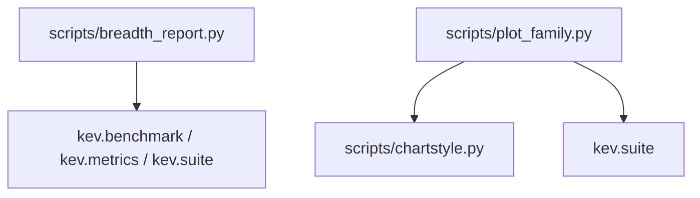
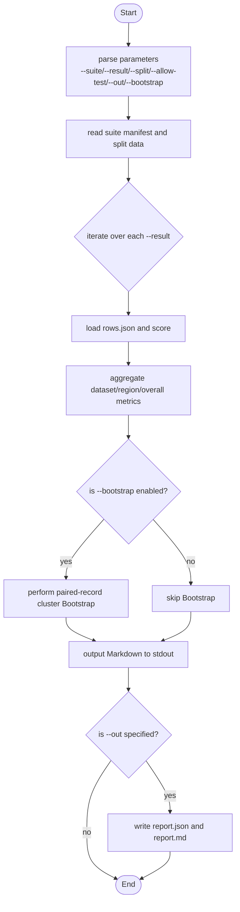
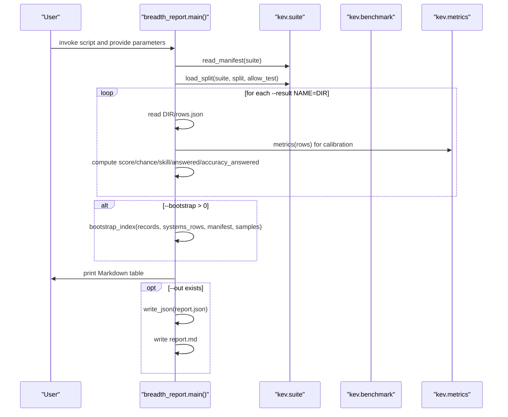
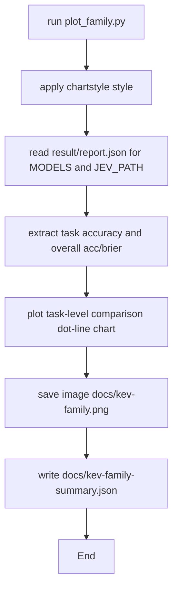
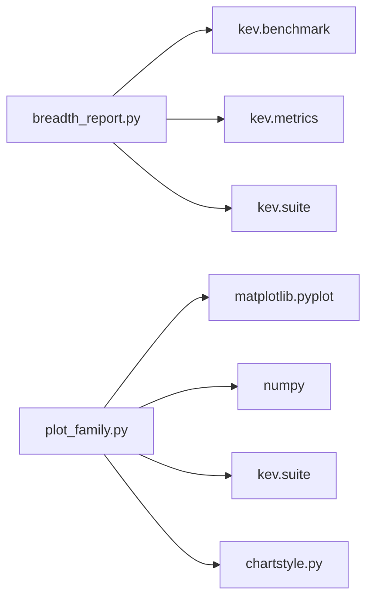

## Table of Contents
1. [Introduction](#introduction)
2. [Project Structure](#project-structure)
3. [Core Components](#core-components)
4. [Architecture Overview](#architecture-overview)
5. [Detailed Component Analysis](#detailed-component-analysis)
6. [Dependency Analysis](#dependency-analysis)
7. [Performance and Best Practices](#performance-and-best-practices)
8. [Troubleshooting and Debugging](#troubleshooting-and-debugging)
9. [Conclusion](#conclusion)
10. [Appendix: Common Commands and Output Interpretation](#appendix-common-commands-and-output-interpretation)

## Introduction
This document targets the Kev evaluation and analysis workflow, focusing on two key scripts:
- breadth_report.py: scores, calibrates, and estimates uncertainty for the breadth-v1 suite, and generates a report.
- plot_family.py: plots the comparison of the Kev family (Kev series) and Jev on out-of-domain tasks and outputs a summary JSON.

The document details command-line parameters, typical usage, output meaning, batch-processing mode, error handling, and performance-optimization suggestions.

## Project Structure
The scripts directly related to this document are located in the scripts directory:
- scripts/breadth_report.py: breadth evaluation report generator.
- scripts/plot_family.py: model-family comparison plotter.
- scripts/chartstyle.py: plotting style and helper functions (referenced by plot_family.py).

Diagram Sources
- [breadth_report.py:14-23](file://scripts/breadth_report.py#L14-L23)
- [plot_family.py:7-14](file://scripts/plot_family.py#L7-L14)

Section Sources
- [breadth_report.py:1-23](file://scripts/breadth_report.py#L1-L23)
- [plot_family.py:1-14](file://scripts/plot_family.py#L1-L14)

## Core Components
- breadth_report.py
  - Function: reads the suite manifest and split data, loads each system's result rows.json, computes accuracy, coverage-adjusted score, chance level, skill index, and calibration metrics (ECE/Brier/NLL), supports paired-record-cluster-guided Bootstrap confidence intervals, and outputs report.json and report.md.
  - Key parameters: --suite, --result, --split, --allow-test, --out, --bootstrap.
- plot_family.py
  - Function: extracts transfer metrics from saved result files, plots a comparison dot-line chart of the Kev series and Jev on a fixed task list, and outputs images and a summary JSON.
  - Input: hardcoded MODELS paths and JEV_PATH; no command-line parameters.
  - Output: docs/kev-family.png and docs/kev-family-summary.json.

Section Sources
- [breadth_report.py:1-23](file://scripts/breadth_report.py#L1-L23)
- [plot_family.py:1-22](file://scripts/plot_family.py#L1-L22)

## Architecture Overview
The workflow of breadth_report.py:
- Parse command-line parameters.
- Read the suite manifest and split data.
- Iterate over the multiple system directories specified by --result, load rows.json, and score.
- Optionally perform Bootstrap to estimate index confidence intervals.
- Print a Markdown table and write report.json and report.md to --out.

Diagram Sources
- [breadth_report.py:160-199](file://scripts/breadth_report.py#L160-L199)

Section Sources
- [breadth_report.py:160-199](file://scripts/breadth_report.py#L160-L199)

## Detailed Component Analysis

### Detailed: breadth_report.py
- Parameter description
  - --suite: required. Suite directory containing manifest.json and other manifests.
  - --result: required, repeatable. In NAME=DIR form, NAME is the system name and DIR is the result directory containing rows.json (and optionally report.json).
  - --split: development or test, default development.
  - --allow-test: allow using the test split (which may be restricted when the split is only in a private image).
  - --out: optional. Report output directory; writes report.json and report.md.
  - --bootstrap: integer, default 0. When non-zero, performs paired-record-cluster Bootstrap, estimating the 95% confidence interval of the indices and their differences.

- Scoring and calibration
  - Dataset level: coverage-adjusted score, chance level, skill index, answered proportion, answered-sample accuracy.
  - Region level: average skill/score of several datasets, plus pooled-row calibration metrics.
  - Overall level: raw_index, Decision-Index-style index, accuracy of answered questions, total question count, calibration metrics, average dataset ECE.
  - Calibration metrics: ECE, Brier, NLL, mean_conf.

- Bootstrap
  - Within each dataset, sample records with replacement, keep the same sampling sequence across systems, recompute dataset skill, region means, and the total index, and obtain the 95% interval and the interval of differences relative to the first system.

- Output
  - Console: Markdown tables (region and dataset dimensions).
  - If --out is specified: report.json (containing suite, manifest sha256, split, formula, sources, systems, uncertainty), report.md.

Diagram Sources
- [breadth_report.py:160-199](file://scripts/breadth_report.py#L160-L199)
- [breadth_report.py:106-136](file://scripts/breadth_report.py#L106-L136)
- [breadth_report.py:79-103](file://scripts/breadth_report.py#L79-L103)

Section Sources
- [breadth_report.py:28-103](file://scripts/breadth_report.py#L28-L103)
- [breadth_report.py:112-157](file://scripts/breadth_report.py#L112-L157)
- [breadth_report.py:160-199](file://scripts/breadth_report.py#L160-L199)

### Detailed: plot_family.py
- Function
  - Reads the Kev series and Jev result files from hardcoded paths, extracts transfer.tasks and each task's accuracy, plots a horizontal dot-line chart, annotates the best Kev and Jev values, and lists each model's overall accuracy at the bottom.
  - Outputs docs/kev-family.png and the summary docs/kev-family-summary.json.

- Input and style
  - Depends on scripts/chartstyle.py for plotting style and text-layout helpers.
  - Accepts no command-line parameters; data sources are configured via the MODELS and JEV_PATH constants.

Diagram Sources
- [plot_family.py:25-28](file://scripts/plot_family.py#L25-L28)
- [plot_family.py:31-70](file://scripts/plot_family.py#L31-L70)

Section Sources
- [plot_family.py:1-22](file://scripts/plot_family.py#L1-L22)
- [plot_family.py:25-70](file://scripts/plot_family.py#L25-L70)

## Dependency Analysis
- breadth_report.py
  - Depends on kev.benchmark.labels (label mapping), kev.metrics.metrics (calibration metrics), kev.suite.digest/load_split/read_json/read_manifest/write_json (suite and I/O).
- plot_family.py
  - Depends on matplotlib.pyplot, numpy, kev.suite.read_json/write_json, scripts.chartstyle (style and layout).

Diagram Sources
- [breadth_report.py:14-23](file://scripts/breadth_report.py#L14-L23)
- [plot_family.py:7-14](file://scripts/plot_family.py#L7-L14)

Section Sources
- [breadth_report.py:14-23](file://scripts/breadth_report.py#L14-L23)
- [plot_family.py:7-14](file://scripts/plot_family.py#L7-L14)

## Performance and Best Practices
- breadth_report.py
  - For large datasets, it is recommended to first use --split development for quick validation, then switch to test (requires --allow-test) for final evaluation.
  - Only enable --bootstrap when statistical significance is needed; larger samples significantly increase runtime.
  - When comparing multiple systems, ensure the rows.json structure in each --result directory is consistent with the suite to avoid redundant computation.
  - Point --out to a separate directory to facilitate versioning and CI archiving.
- plot_family.py
  - Modify MODELS or JEV_PATH to include new models or different round results.
  - If the task list needs updating, synchronously modify the TASKS constant.
  - It is recommended to install matplotlib and numpy in a virtual environment to avoid environment conflicts.

[This section is general guidance and does not require specific file references]

## Troubleshooting and Debugging
- breadth_report.py
  - Permission error: when the suite's split is only in a private image, unauthorized access raises PermissionError. In that case, check the environment variables or credentials, or use --allow-test with an available test split.
  - Inconsistent labels: if the labels in rows.json are inconsistent with the suite definition, an error "wrong suite or split" is raised. Verify the suite version and the source of rows.json.
  - Parameter format error: --result must be in NAME=DIR form, otherwise a parameter error is raised.
  - Missing output: when --out is not specified, no file is written; only Markdown is printed.
- plot_family.py
  - Missing dependency: not installing matplotlib/numpy causes import failure.
  - Path error: if the file pointed to by MODELS or JEV_PATH does not exist, reading fails. Confirm the runs directory structure and file names.
  - Missing style module: an unavailable chartstyle.py causes style-related plotting errors.

Section Sources
- [breadth_report.py:170-178](file://scripts/breadth_report.py#L170-L178)
- [breadth_report.py:182-195](file://scripts/breadth_report.py#L182-L195)
- [plot_family.py:31-70](file://scripts/plot_family.py#L31-L70)

## Conclusion
- breadth_report.py provides a complete breadth-v1 evaluation pipeline supporting multi-system comparison, coverage adjustment, calibration, and Bootstrap uncertainty estimation, suitable for automated report generation.
- plot_family.py focuses on visualizing the out-of-domain capability comparison between the Kev series and Jev, facilitating external presentation and internal review.
- Reasonably combining parameters and batch-processing strategies improves efficiency while ensuring quality.

[This section is summary content and does not require specific file references]

## Appendix: Common Commands and Output Interpretation

- Basic usage (single system)
  - Example: python scripts/breadth_report.py --suite evals/breadth-v1 --result MyModel=runs/my-model --out runs/my-report
  - Effect: scores a single system, outputs Markdown to the console, and writes report.json and report.md.

- Multi-system comparison
  - Example: python scripts/breadth_report.py --suite evals/breadth-v1 --result A=runs/a --result B=runs/b --out runs/compare
  - Effect: evaluates A and B simultaneously and presents them side by side in the report.

- Using the test split
  - Example: python scripts/breadth_report.py --suite evals/breadth-v1 --result A=runs/a --split test --allow-test --out runs/test-report
  - Effect: enables evaluation on the test split (requires corresponding permissions).

- Adding Bootstrap uncertainty estimation
  - Example: python scripts/breadth_report.py --suite evals/breadth-v1 --result A=runs/a --result B=runs/b --bootstrap 2000 --out runs/bootstrap-report
  - Effect: performs 2000 paired-record-cluster Bootstrap iterations, outputting the 95% confidence interval of the indices and their differences.

- Model-family comparison plotting
  - Example: python scripts/plot_family.py
  - Effect: generates docs/kev-family.png and docs/kev-family-summary.json, showing the performance of the Kev series and Jev on the frozen out-of-domain suite.

- Key points for output interpretation
  - Region table: one row per region, columns show each system's accuracy/index/ECE.
  - Dataset details: each dataset's score/skill/answered/ECE, as well as the chance level.
  - Overall metrics: raw_index, Decision-Index-style index, pooled ECE, average dataset ECE.
  - Bootstrap results: the 95% interval of the indices and their differences relative to the first system.

Section Sources
- [breadth_report.py:160-199](file://scripts/breadth_report.py#L160-L199)
- [plot_family.py:31-70](file://scripts/plot_family.py#L31-L70)
