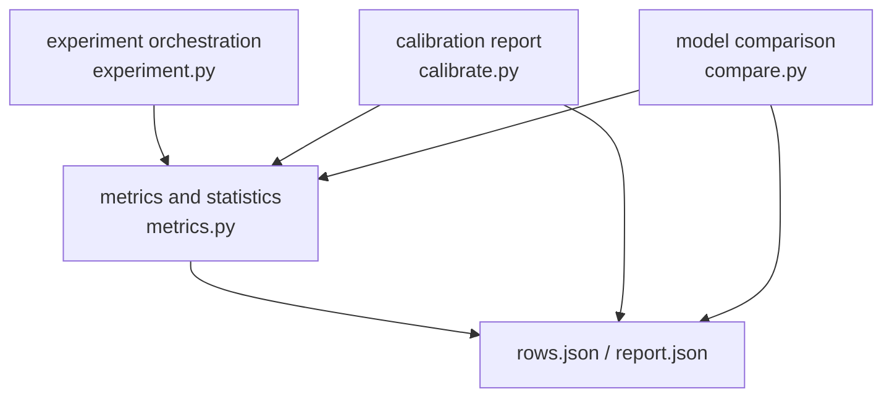
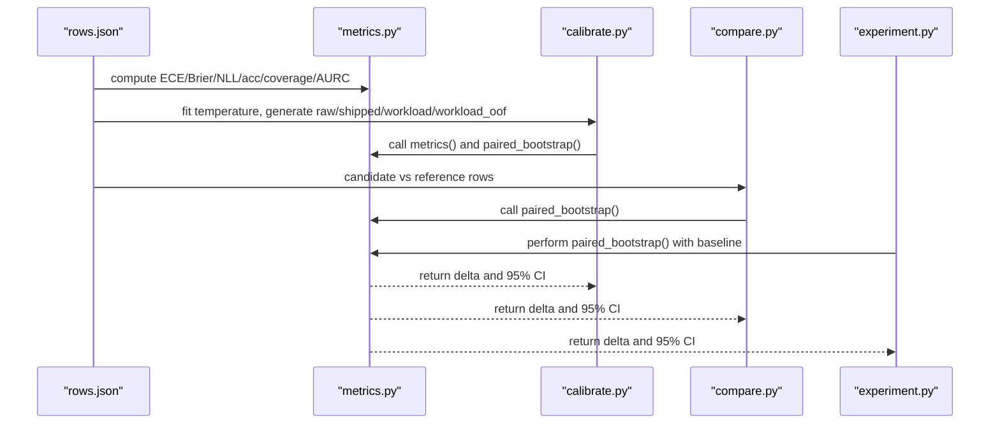
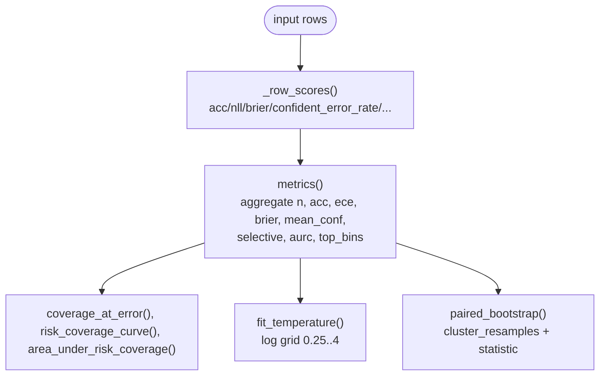
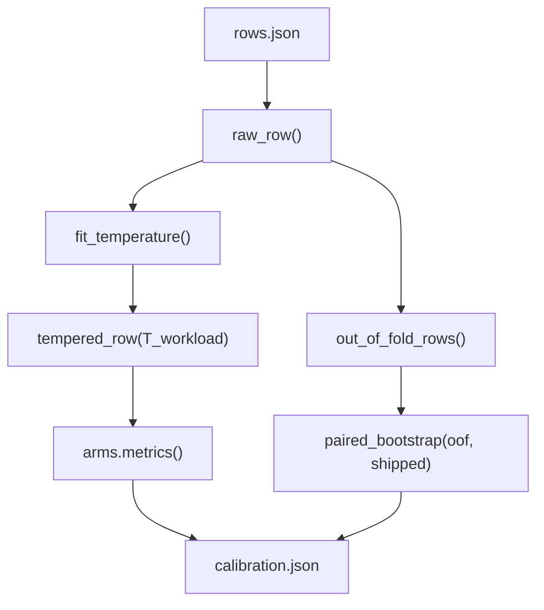
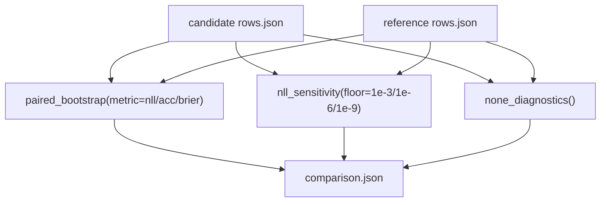
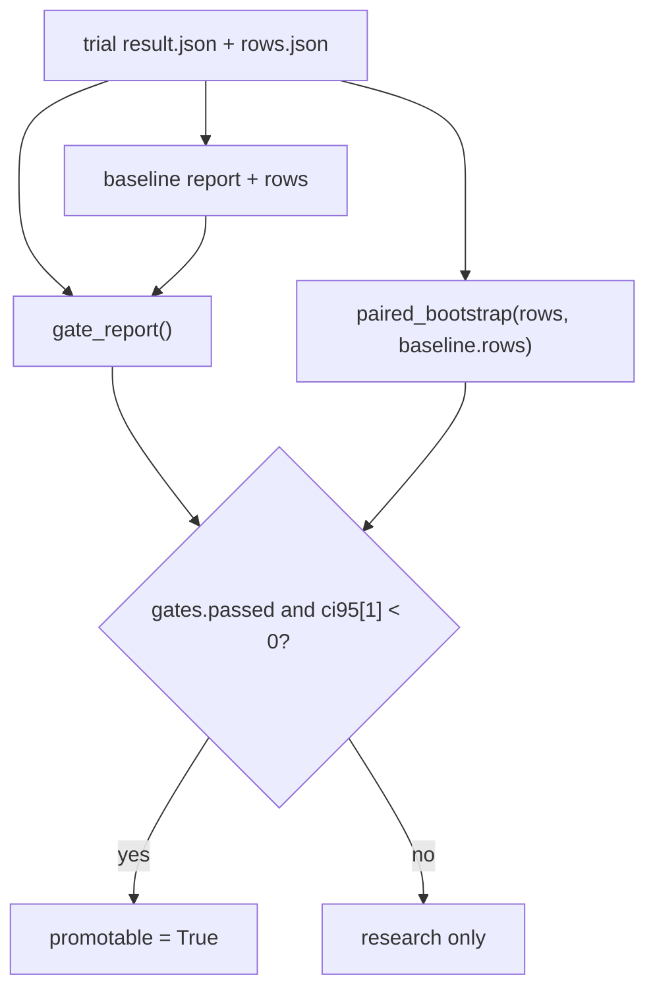
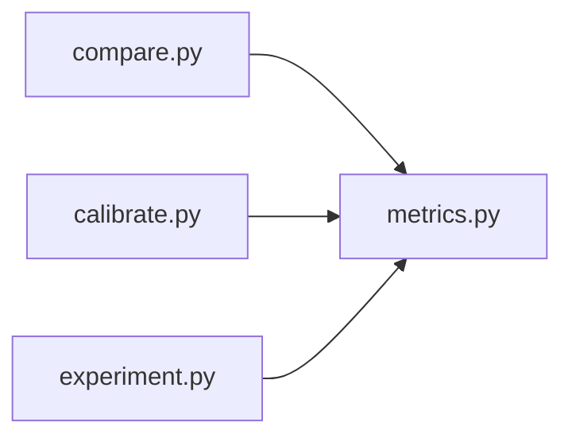
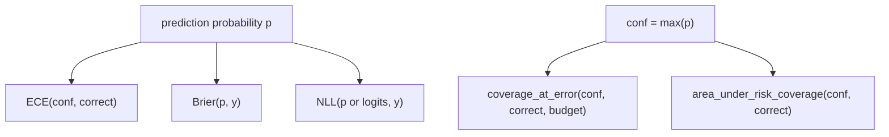
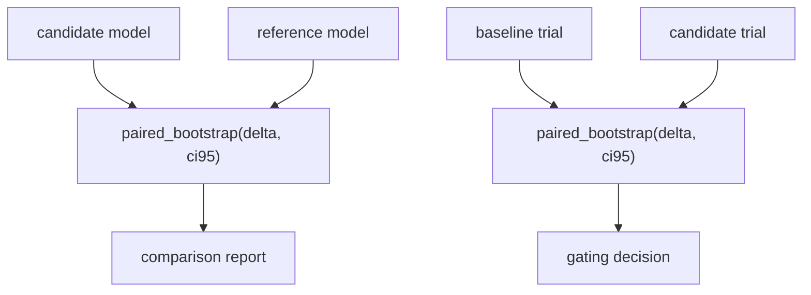
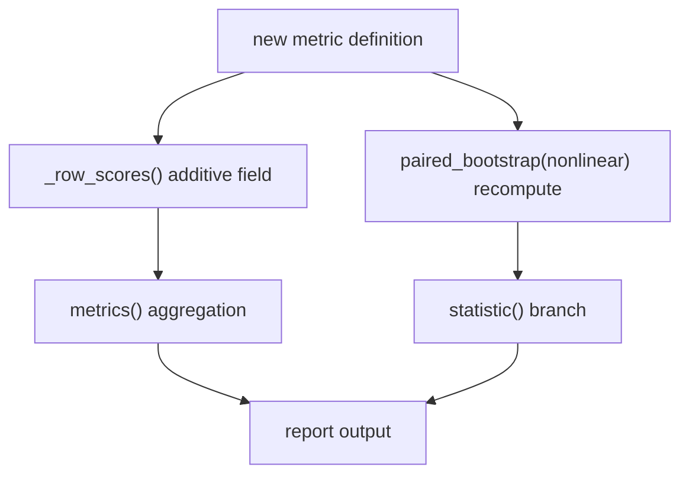

## Table of Contents
1. [Introduction](#introduction)
2. [Project Structure](#project-structure)
3. [Core Components](#core-components)
4. [Architecture Overview](#architecture-overview)
5. [Detailed Component Analysis](#detailed-component-analysis)
6. [Dependency Analysis](#dependency-analysis)
7. [Performance and Statistical Characteristics](#performance-and-statistical-characteristics)
8. [Calibration Metric Comparison Methods](#calibration-metric-comparison-methods)
9. [Multi-Model Comparison and Analysis Patterns](#multi-model-comparison-and-analysis-patterns)
10. [Visualization Suggestions](#visualization-suggestions)
11. [Custom Extension Guide](#custom-extension-guide)
12. [Practical Case Analysis](#practical-case-analysis)
13. [Problem Diagnosis and Troubleshooting](#problem-diagnosis-and-troubleshooting)
14. [Conclusion](#conclusion)

## Introduction
This document targets "model performance comparison analysis", focusing on the following goals:
- Use the bootstrap method for statistical significance testing, providing confidence intervals and hypothesis-testing ideas.
- Explain the computation method and applicable scenarios of skill score, chance level, and coverage-adjusted score.
- Explain the implementation principle of confidence-interval computation and hypothesis testing.
- Provide analysis patterns and visualization methods for multi-model comparison.
- Explain the comparison method for calibration metrics (ECE, Brier, NLL).
- Give a guide for extending custom comparison metrics.
- Include practical case analysis and problem-diagnosis methods.

This project implements scoring, selective prediction, temperature calibration, and record-cluster paired bootstrap in `kev/metrics.py`; workload calibration reports in `kev/calibrate.py`; paired comparison of candidate and reference models in `kev/compare.py`; and research-experiment evaluation and baseline-comparison workflows in `kev/experiment.py`.

## Project Structure
The core code around performance comparison is concentrated in the following modules:
- `kev/metrics.py`: metric computation, selective prediction, temperature fitting, bootstrap, and cross-validation.
- `kev/calibrate.py`: generates a calibration report from saved rows.json, and performs an OOF vs shipped bootstrap comparison.
- `kev/compare.py`: paired comparison of candidate and reference model results, outputting paired-bootstrap results and NLL floor sensitivity.
- `kev/experiment.py`: trial runs, mechanism checks, gating strategy, and paired-bootstrap comparison with the baseline.

**Diagram Sources**
- [experiment.py:314-379](file://kev/experiment.py#L314-L379)
- [calibrate.py:28-44](file://kev/calibrate.py#L28-L44)
- [compare.py:31-58](file://kev/compare.py#L31-L58)
- [metrics.py:64-100](file://kev/metrics.py#L64-L100)

**Section Sources**
- [experiment.py:1-12](file://kev/experiment.py#L1-L12)
- [metrics.py:1-6](file://kev/metrics.py#L1-L6)
- [calibrate.py:1-17](file://kev/calibrate.py#L1-L17)
- [compare.py:1-11](file://kev/compare.py#L1-L11)

## Core Components
- Metrics and scoring: accuracy, ECE, Brier, NLL, selective-prediction coverage, AURC, threshold selection, etc.
- Temperature calibration: search for the optimal temperature by micro/macro average NLL, supporting out-of-fold calibration.
- Bootstrap and paired comparison: record-cluster paired bootstrap, outputting delta and 95% CI.
- Calibration report: four-arm comparison of raw/shipped/workload/workload_oof, bootstrap of OOF vs shipped.
- Model comparison: paired bootstrap of candidate vs reference, NLL floor sensitivity, none_of_the_above diagnosis.
- Experiment orchestration: mechanism checks, gating strategy, paired bootstrap comparison with the baseline.

**Section Sources**
- [metrics.py:15-100](file://kev/metrics.py#L15-L100)
- [metrics.py:269-294](file://kev/metrics.py#L269-L294)
- [metrics.py:308-427](file://kev/metrics.py#L308-L427)
- [calibrate.py:28-44](file://kev/calibrate.py#L28-L44)
- [compare.py:31-58](file://kev/compare.py#L31-L58)
- [experiment.py:372-379](file://kev/experiment.py#L372-L379)

## Architecture Overview
The following diagram shows the end-to-end flow from data to report: raw row data goes through metric computation, temperature calibration, and bootstrap statistics, eventually forming a comparable report.

**Diagram Sources**
- [metrics.py:64-100](file://kev/metrics.py#L64-L100)
- [metrics.py:372-427](file://kev/metrics.py#L372-L427)
- [calibrate.py:28-44](file://kev/calibrate.py#L28-L44)
- [compare.py:31-58](file://kev/compare.py#L31-L58)
- [experiment.py:372-379](file://kev/experiment.py#L372-L379)

## Detailed Component Analysis

### Metrics and Scoring (metrics.py)
- ECE: bin by confidence, sum of weighted absolute errors.
- Brier: sum of squared errors between the probability distribution and the one-hot target.
- NLL: negative log-likelihood computed from logits or probabilities, supporting temperature scaling.
- Selective prediction: coverage, risk-coverage curve, AURC, threshold selection.
- Temperature fitting: minimize micro/macro average NLL on a log grid.
- Bootstrap: record-cluster paired bootstrap, supporting non-linear metric recomputation.

**Diagram Sources**
- [metrics.py:56-100](file://kev/metrics.py#L56-L100)
- [metrics.py:103-164](file://kev/metrics.py#L103-L164)
- [metrics.py:276-294](file://kev/metrics.py#L276-L294)
- [metrics.py:308-427](file://kev/metrics.py#L308-L427)

**Section Sources**
- [metrics.py:15-100](file://kev/metrics.py#L15-L100)
- [metrics.py:103-164](file://kev/metrics.py#L103-L164)
- [metrics.py:269-294](file://kev/metrics.py#L269-L294)
- [metrics.py:308-427](file://kev/metrics.py#L308-L427)

### Calibration Report (calibrate.py)
- Four-arm comparison: raw, shipped, workload, workload_oof.
- Paired bootstrap of workload_oof vs shipped, metrics including ECE, Brier, coverage (error budget 5%), AURC.
- Outputs a formatted report for quick review.

**Diagram Sources**
- [calibrate.py:28-44](file://kev/calibrate.py#L28-L44)
- [metrics.py:224-261](file://kev/metrics.py#L224-L261)
- [metrics.py:333-369](file://kev/metrics.py#L333-L369)

**Section Sources**
- [calibrate.py:1-17](file://kev/calibrate.py#L1-L17)
- [calibrate.py:28-44](file://kev/calibrate.py#L28-L44)
- [calibrate.py:47-56](file://kev/calibrate.py#L47-L56)

### Model Comparison (compare.py)
- Paired bootstrap of candidate vs reference, metrics are NLL, acc, Brier.
- NLL floor sensitivity: compare macro-average NLL under different floor values.
- none_of_the_above diagnosis: count the mean none probability and the proportion exceeding 0.5 for the none_present/none_absent subsets.

**Diagram Sources**
- [compare.py:13-28](file://kev/compare.py#L13-L28)
- [compare.py:31-58](file://kev/compare.py#L31-L58)
- [metrics.py:372-427](file://kev/metrics.py#L372-L427)

**Section Sources**
- [compare.py:13-28](file://kev/compare.py#L13-L28)
- [compare.py:31-58](file://kev/compare.py#L31-L58)

### Experiment Orchestration and Baseline Comparison (experiment.py)
- Mechanism checks and gating strategy: isolation, task-accuracy regression, variant accuracy, permutation flip, holdout-set correctness, transfer confident errors, and no degradation of transfer accuracy/Brier.
- Paired bootstrap with the baseline: add gates and paired_comparison to decide candidate_for_locked_test.
- Aggregation stage: use the first non-legacy trial as the baseline, compare trial by trial, and write results.jsonl.

**Diagram Sources**
- [experiment.py:188-214](file://kev/experiment.py#L188-L214)
- [experiment.py:372-379](file://kev/experiment.py#L372-L379)
- [experiment.py:392-414](file://kev/experiment.py#L392-L414)

**Section Sources**
- [experiment.py:161-214](file://kev/experiment.py#L161-L214)
- [experiment.py:372-379](file://kev/experiment.py#L372-L379)
- [experiment.py:392-414](file://kev/experiment.py#L392-L414)

## Dependency Analysis
- `compare.py` depends on `metrics.paired_bootstrap`.
- `calibrate.py` depends on `metrics.fit_temperature`, `metrics.out_of_fold_rows`, `metrics.paired_bootstrap`, `metrics.raw_row`, `metrics.tempered_row`, `metrics.scored_rows`.
- `experiment.py` depends on `metrics.fit_temperature`, `metrics.paired_bootstrap`.
- `metrics.py` is a pure numpy implementation with no external model dependency, and can score rows.json directly.

**Diagram Sources**
- [compare.py:9-10](file://kev/compare.py#L9-L10)
- [calibrate.py:21-22](file://kev/calibrate.py#L21-L22)
- [experiment.py:33-36](file://kev/experiment.py#L33-L36)
- [metrics.py:1-6](file://kev/metrics.py#L1-L6)

**Section Sources**
- [compare.py:1-11](file://kev/compare.py#L1-L11)
- [calibrate.py:18-23](file://kev/calibrate.py#L18-L23)
- [experiment.py:29-36](file://kev/experiment.py#L29-L36)
- [metrics.py:1-6](file://kev/metrics.py#L1-L6)

## Performance and Statistical Characteristics
- Time complexity:
  - Metric aggregation: linear in the number of samples.
  - Risk-coverage curve: sorting O(n log n), followed by a linear scan.
  - Bootstrap: recompute the statistic at each resample, overall complexity about O(samples * n).
- Space complexity:
  - Mainly stores rows and intermediate arrays; memory usage scales linearly with sample size.
- Numerical stability:
  - Clip probability with EPSILON to avoid log(0).
  - Validate logits for finiteness and dimension consistency.
- Grouping and clustering:
  - Cluster by (source, group) to ensure sibling questions and variants of the same record are sampled together, reducing variance.

**Section Sources**
- [metrics.py:103-164](file://kev/metrics.py#L103-L164)
- [metrics.py:297-315](file://kev/metrics.py#L297-L315)
- [metrics.py:372-427](file://kev/metrics.py#L372-L427)

## Calibration Metric Comparison Methods
- ECE (Expected Calibration Error): bin by confidence, measuring the deviation between predicted confidence and actual accuracy.
- Brier: mean squared error between the probability distribution and the true label, smaller is better.
- NLL (Negative Log-Likelihood): measures probability-mass allocation, smaller is better.
- Selective prediction:
  - coverage_at_error: maximize the accepted proportion within the error budget.
  - AURC: area under the risk-coverage curve, smaller is more robust.
- Temperature calibration:
  - fit_temperature: minimize micro/macro average NLL on a log grid.
  - out_of_fold_rows: group-disjoint out-of-fold calibration to avoid overfitting.

**Diagram Sources**
- [metrics.py:15-21](file://kev/metrics.py#L15-L21)
- [metrics.py:48-53](file://kev/metrics.py#L48-L53)
- [metrics.py:64-100](file://kev/metrics.py#L64-L100)
- [metrics.py:103-146](file://kev/metrics.py#L103-L146)
- [metrics.py:276-294](file://kev/metrics.py#L276-L294)

**Section Sources**
- [metrics.py:15-21](file://kev/metrics.py#L15-L21)
- [metrics.py:48-53](file://kev/metrics.py#L48-L53)
- [metrics.py:64-100](file://kev/metrics.py#L64-L100)
- [metrics.py:103-146](file://kev/metrics.py#L103-L146)
- [metrics.py:276-294](file://kev/metrics.py#L276-L294)

## Multi-Model Comparison and Analysis Patterns
- Paired comparison:
  - Candidate vs reference: use `paired_bootstrap` to compute delta and 95% CI.
  - Supported metrics: nll, acc, brier, and non-linear metrics such as ece, aurc, coverage.
- Baseline comparison:
  - In research experiments, the first non-legacy trial serves as the baseline, and the rest are compared against it.
  - Combine with the gating strategy to decide whether to enter the locked test.
- Workload calibration:
  - workload_oof vs shipped: evaluate the difference between the deployment temperature and the locally fitted temperature.

**Diagram Sources**
- [compare.py:42-47](file://kev/compare.py#L42-L47)
- [experiment.py:372-379](file://kev/experiment.py#L372-L379)
- [metrics.py:372-427](file://kev/metrics.py#L372-L427)

**Section Sources**
- [compare.py:31-58](file://kev/compare.py#L31-L58)
- [experiment.py:372-379](file://kev/experiment.py#L372-L379)
- [metrics.py:372-427](file://kev/metrics.py#L372-L427)

## Visualization Suggestions
- Bar chart: comparison of acc, ece, brier, nll across models.
- Error bars: 95% CI from bootstrap shown on the delta.
- Risk-coverage curve: AURC and curve shape across different models.
- Heatmap: calibration_by_length metrics across different length buckets.
- Scatter plot: confidence vs accuracy, observing over/under-confidence.

(This section is conceptual guidance and does not directly analyze specific files)

## Custom Extension Guide
- Adding metrics:
  - If the metric can be decomposed into per-question additive terms, add a field in `_row_scores` and aggregate it in `metrics()`.
  - If it is a non-linear metric, add it to the nonlinear set in `paired_bootstrap` so it is recomputed at each resample.
- Custom aggregation:
  - Supports micro/macro aggregation; macro groups by task then takes the mean.
- Custom bootstrap statistic:
  - Add a branch in the `statistic` function to handle new non-linear metrics.
- Custom threshold and selective prediction:
  - Use `select_threshold` and `evaluate_threshold` to customize threshold strategies.

**Diagram Sources**
- [metrics.py:56-100](file://kev/metrics.py#L56-L100)
- [metrics.py:372-427](file://kev/metrics.py#L372-L427)

**Section Sources**
- [metrics.py:56-100](file://kev/metrics.py#L56-L100)
- [metrics.py:372-427](file://kev/metrics.py#L372-L427)

## Practical Case Analysis
- Case 1: workload calibration
  - Input: a model's rows.json.
  - Steps: raw → fit_temperature → workload → workload_oof → paired_bootstrap(oof vs shipped).
  - Output: calibration.json, containing four-arm metrics and the delta and CI of OOF vs shipped.
- Case 2: candidate vs reference comparison
  - Input: candidate and reference rows.json.
  - Steps: paired_bootstrap(nll/acc/brier), NLL floor sensitivity, none_of_the_above diagnosis.
  - Output: comparison.json, containing paired results and diagnostic information.
- Case 3: research experiment and baseline comparison
  - Input: trial result.json and rows.json.
  - Steps: mechanism checks, gating strategy, paired_bootstrap(rows, baseline.rows).
  - Output: comparison.json, containing gates and paired_comparison.

**Section Sources**
- [calibrate.py:28-44](file://kev/calibrate.py#L28-L44)
- [compare.py:31-58](file://kev/compare.py#L31-L58)
- [experiment.py:372-379](file://kev/experiment.py#L372-L379)

## Problem Diagnosis and Troubleshooting
- Common errors:
  - Empty population: cannot score empty rows.
  - Invalid temperature: temperature must be positive and finite.
  - Inconsistent logits: logits dimension does not match the number of options.
  - Inconsistent paired-comparison keys: candidate and reference id/question must be exactly the same.
  - Inconsistent paired-comparison metadata: source/group/task/type must be consistent.
- Troubleshooting suggestions:
  - Check the variant and source filtering logic of rows.json.
  - Confirm the completeness of logits and inference_temperature records.
  - Verify that candidate and reference suite_sha256 match.

**Section Sources**
- [metrics.py:64-66](file://kev/metrics.py#L64-L66)
- [metrics.py:24-36](file://kev/metrics.py#L24-L36)
- [metrics.py:378-397](file://kev/metrics.py#L378-L397)
- [compare.py:39-40](file://kev/compare.py#L39-L40)

## Conclusion
This project provides a complete model-performance comparison analysis toolchain:
- Metric computation and selective prediction.
- Temperature calibration and OOF evaluation.
- Record-cluster paired bootstrap, providing robust confidence intervals and significance testing.
- Multi-model comparison and workload calibration reports.
- An extensible metric and statistics framework supporting custom analysis and visualization.

By using these tools reasonably, model comparison can be performed on a rigorous statistical basis, ensuring the reliability and reproducibility of conclusions.
