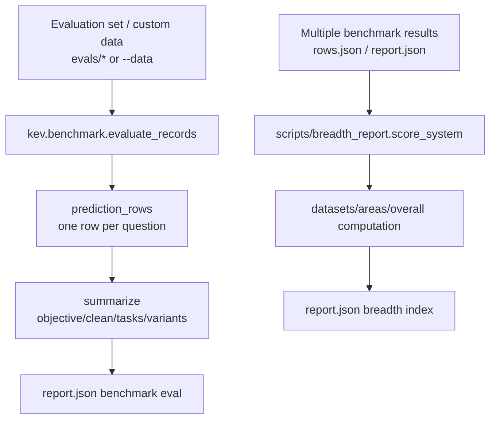
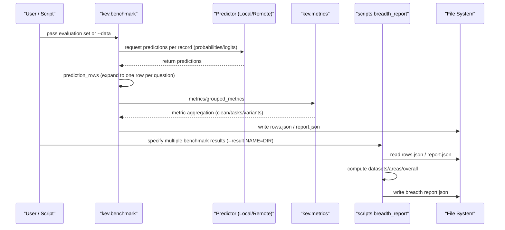
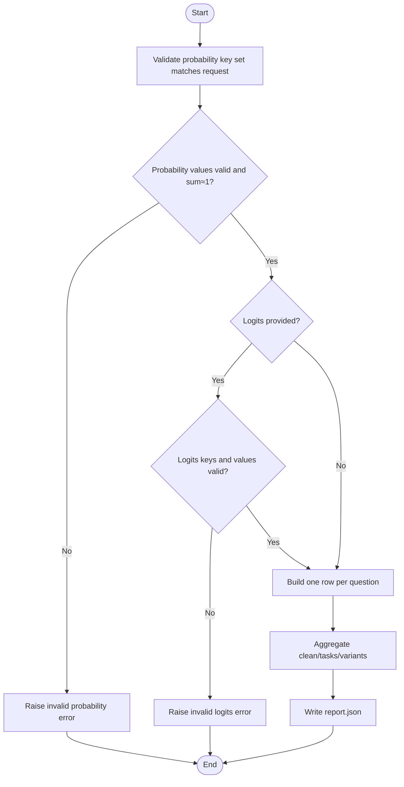
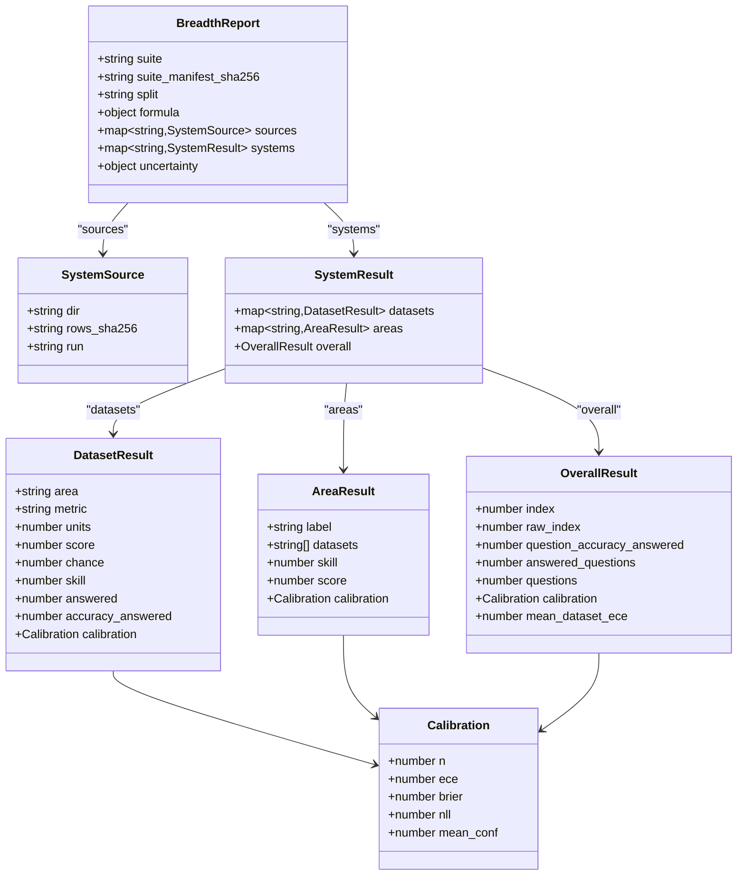

## Table of Contents
1. [Introduction](#introduction)
2. [Project Structure](#project-structure)
3. [Core Components](#core-components)
4. [Architecture Overview](#architecture-overview)
5. [Detailed Component Analysis](#detailed-component-analysis)
6. [Dependency Analysis](#dependency-analysis)
7. [Performance and Constraints](#performance-and-constraints)
8. [Troubleshooting Guide](#troubleshooting-guide)
9. [Conclusion](#conclusion)
10. [Appendix: JSON Schema](#appendix-json-schema)

## Introduction
This document systematically describes the two types of report data structures produced by Kev evaluation:
- Benchmark evaluation report (generated by kev.benchmark): used to measure the model's accuracy, calibration, coverage, and latency at the task-level, variant-level, and overall level, and outputs key fields such as objective, clean, tasks, variants, and calibration.
- Breadth index report (generated by scripts/breadth_report.py): based on the performance of multiple systems across datasets, it computes skill scores, area aggregation, and overall index, including nested structures such as datasets, areas, and overall.

The document provides field types, meanings, constraints, data flow, structural differences across scenarios, and a complete JSON Schema definition, to facilitate validation and integration with downstream tools.

## Project Structure
Kev's evaluation and reporting involve two main paths:
- Benchmark evaluation path: reads the evaluation set or custom data, calls the predictor to obtain probabilities/log-probabilities, expands them into rows at question granularity, and aggregates into report.json.
- Breadth index path: reads multiple benchmark evaluation results (rows.json and optional report.json), combines the dataset/area definitions from the manifest, computes skill, area, and overall metrics, and outputs a new report.json.



Diagram Sources
- [kev/benchmark.py:124-167](file://kev/benchmark.py#L124-L167)
- [scripts/breadth_report.py:112-136](file://scripts/breadth_report.py#L112-L136)

Section Sources
- [kev/benchmark.py:1-215](file://kev/benchmark.py#L1-L215)
- [scripts/breadth_report.py:1-200](file://scripts/breadth_report.py#L1-L200)

## Core Components
- Benchmark evaluation report (benchmark.report.json)
  - Top-level key fields: objective, clean, tasks, variants, coverage, latency_ms, calibration, metric_policy, permutation, heldout_tasks, long_rows, suite_sha256, split, run, remote, environment, date_facts, rotations, calibration_applied, etc.
  - Key sub-objects:
    - clean: overall metrics for the "clean" variant (acc, nll, ece, brier, mean_conf, confident_error_rate, coverage_at_*, aurc, error_rate_at_0_9, confidence_bias, top_bins, selective, score_mae, ranked_probability_score).
    - tasks: metrics dictionary grouped by task dimension.
    - variants: metrics dictionary grouped by variant dimension.
    - calibration: calibration-related metadata (inference_temperature, additional_temperature, logits_recorded).
    - metric_policy: metric version and computation conventions (version=2).
- Breadth index report (breadth report.json)
  - Top-level key fields: suite, suite_manifest_sha256, split, formula, sources, systems, uncertainty.
  - Each system under systems contains: datasets, areas, overall.
  - Each dataset in datasets contains: area, metric, units, score, chance, skill, answered, accuracy_answered, calibration.
  - Each area in areas contains: label, datasets, skill, score, calibration.
  - overall contains: index, raw_index, question_accuracy_answered, answered_questions, questions, calibration, mean_dataset_ece.

Section Sources
- [kev/benchmark.py:73-103](file://kev/benchmark.py#L73-L103)
- [scripts/breadth_report.py:112-136](file://scripts/breadth_report.py#L112-L136)
- [runs/breadth-v1-report/report.json:1-380](file://runs/breadth-v1-report/report.json#L1-L380)
- [runs/calibration-audit-v1/report.json:1-120](file://runs/calibration-audit-v1/report.json#L1-L120)

## Architecture Overview
The following diagram shows the end-to-end flow from input to report, as well as the data dependencies between the two report types.



Diagram Sources
- [kev/benchmark.py:106-167](file://kev/benchmark.py#L106-L167)
- [scripts/breadth_report.py:160-195](file://scripts/breadth_report.py#L160-L195)

## Detailed Component Analysis

### Benchmark evaluation report (benchmark.report.json)
- Top-level fields
  - objective: scalar, negative mean NLL (excluding unknowable control items), used as the optimization objective.
  - coverage: records requested/evaluated/rejected/truncated counts, ensuring interpretability.
  - latency_ms: median and P95 latency.
  - calibration: calibration metadata (inference temperature, additional temperature, whether logits are recorded).
  - metric_policy: metric version and computation conventions (version=2).
  - permutation: option-order perturbation statistics (flip rate, mean max delta).
  - heldout_tasks: metrics for tasks from untrained sources (optional).
  - long_rows: statistics for long rows using efficient kernels (optional).
  - suite_sha256/split/run/remote/environment/date_facts/rotations/calibration_applied: runtime and environment metadata.
- clean/tasks/variants
  - All contain n, acc, nll, ece, brier, mean_conf, confident_error_rate, coverage_at_0_9, accuracy_at_0_9, coverage_at_5pct_error, coverage_at_1pct_error, aurc, error_rate_at_0_9, confidence_bias, top_bins, selective, score_mae, ranked_probability_score.
  - tasks indexed by task key; variants indexed by variant key.
- Constraints and validation
  - Probability distributions must match the requested option key set, values must be finite and within [0,1], and the sum must be close to 1 (tiny tolerance allowed).
  - If logits are provided, the key set and value validity are likewise checked.
  - The answer ID set must match the request.



Diagram Sources
- [kev/benchmark.py:36-70](file://kev/benchmark.py#L36-L70)
- [kev/benchmark.py:73-103](file://kev/benchmark.py#L73-L103)

Section Sources
- [kev/benchmark.py:36-103](file://kev/benchmark.py#L36-L103)
- [runs/calibration-audit-v1/report.json:1-120](file://runs/calibration-audit-v1/report.json#L1-L120)

### Breadth index report (breadth report.json)
- Top-level fields
  - suite: evaluation suite path.
  - suite_manifest_sha256: manifest digest.
  - split: partition (development/test).
  - formula: scoring formula description (helper, metrics, chance, skill, calibration).
  - sources: source directory, rows_sha256, and run identifier for each system.
  - systems: datasets/areas/overall for each system.
  - uncertainty: optional paired-record-clustered Bootstrap confidence intervals.
- datasets (each dataset)
  - area: the area it belongs to.
  - metric: metric type (accuracy or case_exact).
  - units: number of units (questions or records).
  - score: coverage-adjusted score.
  - chance: random expected score.
  - skill: chance-corrected skill score (clip((score-chance)/(1-chance))).
  - answered: proportion answered.
  - accuracy_answered: accuracy of answered samples.
  - calibration: ECE/Brier/NLL/mean_conf/n.
- areas (each area)
  - label: human-readable label.
  - datasets: list of dataset names included in the area.
  - skill: arithmetic mean of dataset skills within the area.
  - score: arithmetic mean of dataset scores within the area.
  - calibration: pooled calibration metrics for the area.
- overall (total)
  - index: 100 × five-area skill mean (Decision Index style).
  - raw_index: 100 × five-area raw score mean.
  - question_accuracy_answered: accuracy across all answered questions.
  - answered_questions/questions: number of answered questions and total questions.
  - calibration: pooled calibration metrics for the total.
  - mean_dataset_ece: mean of dataset ECE.



Diagram Sources
- [scripts/breadth_report.py:112-136](file://scripts/breadth_report.py#L112-L136)
- [runs/breadth-v1-report/report.json:1-380](file://runs/breadth-v1-report/report.json#L1-L380)

Section Sources
- [scripts/breadth_report.py:112-136](file://scripts/breadth_report.py#L112-L136)
- [runs/breadth-v1-report/report.json:1-380](file://runs/breadth-v1-report/report.json#L1-L380)

### Report structure differences across evaluation scenarios
- Benchmark evaluation report (decision/hard/devtools/longdoc, etc.)
  - Focuses on task-level and variant-level metrics, emphasizing calibration and selective coverage (top_bins/selective) and risk-coverage curves (aurc/confident_error_rate).
  - Typical fields: objective, clean, tasks, variants, coverage, latency_ms, calibration, metric_policy, permutation, heldout_tasks, long_rows.
- Breadth index report (breadth-v1)
  - Focuses on skill across datasets and area aggregation, outputs index/raw_index and mean_dataset_ece.
  - Typical fields: suite, formula, sources, systems.datasets/areas/overall, uncertainty.
- Calibration audit report (calibration-audit-v1)
  - Focuses on model-level calibration and selective metrics, including temperature, raw.temperature_replay, micro/tasks, and other multi-level metrics.
  - Typical fields: metric_version, suite_sha256, models.<name>.temperature, raw, temperature_replay.

Section Sources
- [runs/calibration-audit-v1/report.json:1-120](file://runs/calibration-audit-v1/report.json#L1-L120)
- [runs/breadth-v1-report/report.json:1-380](file://runs/breadth-v1-report/report.json#L1-L380)

## Dependency Analysis
- Data flow
  - Benchmark evaluation: records → prediction_rows → summarize → report.json.
  - Breadth index: rows.json from multiple benchmark results → score_system → datasets/areas/overall → report.json.
- Component coupling
  - benchmark.py depends on kev.metrics and kev.suite; breadth_report.py reuses benchmark.labels and metrics.
  - The two are decoupled via rows.json, facilitating cross-system comparison.
- External dependencies
  - The predictor can be local or remote; remote mode attaches remote metadata (base_url, requested_model, served_model, concurrency).


Diagram Sources
- [kev/benchmark.py:124-167](file://kev/benchmark.py#L124-L167)
- [scripts/breadth_report.py:160-195](file://scripts/breadth_report.py#L160-L195)

Section Sources
- [kev/benchmark.py:124-167](file://kev/benchmark.py#L124-L167)
- [scripts/breadth_report.py:160-195](file://scripts/breadth_report.py#L160-L195)

## Performance and Constraints
- Probability and distribution constraints
  - The probability key set must exactly match the requested options.
  - Probability values must be finite and within [0,1], and their sum must equal 1 within tolerance.
  - If logits are provided, the key set and value validity are likewise checked.
- Coverage and rejection
  - When context overflow or exceptions occur, record rejected/truncated counts and write failure.json if necessary.
- Long row handling
  - When a single row exceeds a threshold, it may use an efficient attention kernel, and long_rows (count/records/kernels/threshold) is recorded in report.json.
- Latency statistics
  - The report includes median and P95 latency, for performance comparison.

Section Sources
- [kev/benchmark.py:36-70](file://kev/benchmark.py#L36-L70)
- [kev/benchmark.py:124-167](file://kev/benchmark.py#L124-L167)

## Troubleshooting Guide
- Probability key mismatch
  - Symptom: error indicating probability keys do not match the request.
  - Troubleshoot: confirm the predictor returns probability keys consistent with the evaluation question option keys.
- Invalid probability values or sum not equal to 1
  - Symptom: error indicating non-finite values, out-of-range, or anomalous sum.
  - Troubleshoot: check the numeric range and normalization logic; mind floating-point tolerance.
- Inconsistent answer IDs
  - Symptom: error indicating answer IDs do not match the request.
  - Troubleshoot: ensure the key set of prediction["probabilities"] matches record["questions"].
- Context overflow
  - Symptom: records rejected, ContextOverflow appears in failure.json.
  - Troubleshoot: shorten the input or use skip_overlong (only for external data).
- Remote call failure
  - Symptom: connection or model name error in remote mode.
  - Troubleshoot: verify base_url, requested_model, served_model, and concurrency parameters.

Section Sources
- [kev/benchmark.py:36-70](file://kev/benchmark.py#L36-L70)
- [kev/benchmark.py:124-167](file://kev/benchmark.py#L124-L167)

## Conclusion
- The benchmark evaluation report provides comprehensive task-level and variant-level metrics, emphasizing calibration and selective coverage, suitable for diagnosing model capability and reliability.
- The breadth index report focuses on skill across datasets and area aggregation, providing a Decision Index style comprehensive ranking and uncertainty estimation.
- The two report types are decoupled via rows.json, supporting both independent evaluation and cross comparison and secondary processing.
- It is recommended that consumers strictly validate probability distributions and key sets, and interpret results in conjunction with metadata such as coverage/long_rows.

## Appendix: JSON Schema
The following Schema describes the core structure of the two report types, for validation and integration use.

### Benchmark evaluation report Schema
```json
{
  "$schema": "http://json-schema.org/draft-07/schema#",
  "type": "object",
  "required": ["objective", "clean", "tasks", "variants", "coverage", "latency_ms", "calibration", "metric_policy"],
  "properties": {
    "objective": {"type": "number"},
    "clean": {
      "type": "object",
      "required": ["n", "acc", "nll", "ece", "brier", "mean_conf", "confident_error_rate", "coverage_at_0_9", "accuracy_at_0_9", "coverage_at_5pct_error", "coverage_at_1pct_error", "aurc", "error_rate_at_0_9", "confidence_bias", "top_bins", "selective"],
      "properties": {
        "n": {"type": "number"},
        "acc": {"type": "number"},
        "nll": {"type": "number"},
        "ece": {"type": "number"},
        "brier": {"type": "number"},
        "mean_conf": {"type": "number"},
        "confident_error_rate": {"type": "number"},
        "coverage_at_0_9": {"type": "number"},
        "accuracy_at_0_9": {"type": "number"},
        "coverage_at_5pct_error": {"type": "number"},
        "coverage_at_1pct_error": {"type": "number"},
        "aurc": {"type": "number"},
        "error_rate_at_0_9": {"type": "number"},
        "confidence_bias": {"type": "number"},
        "top_bins": {
          "type": "object",
          "patternProperties": {"^[0-9.]+$": {"type": "object", "required": ["n", "errors", "error_rate"], "properties": {"n": {"type": "number"}, "errors": {"type": "number"}, "error_rate": {"type": "number"}}}}
        },
        "selective": {
          "type": "object",
          "patternProperties": {"^[0-9.]+$": {"type": "object", "required": ["coverage", "accuracy", "confidence_cutoff"], "properties": {"coverage": {"type": "number"}, "accuracy": {"type": "number"}, "confidence_cutoff": {"type": "number"}}}}
        },
        "score_mae": {"type": "number"},
        "ranked_probability_score": {"type": "number"}
      }
    },
    "tasks": {"type": "object", "additionalProperties": true},
    "variants": {"type": "object", "additionalProperties": true},
    "coverage": {
      "type": "object",
      "required": ["requested_records", "requested_questions", "evaluated_records", "evaluated_questions", "rejected_records", "truncated_records"],
      "properties": {
        "requested_records": {"type": "number"},
        "requested_questions": {"type": "number"},
        "evaluated_records": {"type": "number"},
        "evaluated_questions": {"type": "number"},
        "rejected_records": {"type": "number"},
        "truncated_records": {"type": "number"}
      }
    },
    "latency_ms": {
      "type": "object",
      "required": ["median", "p95"],
      "properties": {"median": {"type": "number"}, "p95": {"type": "number"}}
    },
    "calibration": {
      "type": "object",
      "properties": {
        "inference_temperature": {"type": ["number", "null"]},
        "additional_temperature": {"type": "number"},
        "logits_recorded": {"type": "boolean"}
      }
    },
    "metric_policy": {
      "type": "object",
      "required": ["version"],
      "properties": {
        "version": {"type": "number"},
        "selective_ties": {"type": "string"},
        "coverage_at_error": {"type": "string"},
        "aurc": {"type": "string"},
        "confident_error_rate": {"type": "string"},
        "error_rate_at_0_9": {"type": "string"},
        "nll": {"type": "string"},
        "nll_floor": {"type": "number"},
        "renormalize_returned_probabilities": {"type": "boolean"},
        "raw_sums_outside_1e_5": {"type": "number"},
        "returned_zeros": {"type": "number"}
      }
    },
    "permutation": {
      "type": "object",
      "properties": {
        "n": {"type": "number"},
        "mean_max_delta": {"type": ["number", "null"]},
        "flip_rate": {"type": ["number", "null"]}
      }
    },
    "heldout_tasks": {"type": "object"},
    "long_rows": {
      "type": "object",
      "properties": {
        "count": {"type": "number"},
        "records": {"type": "number"},
        "kernels": {"type": "array", "items": {"type": "string"}},
        "threshold": {"type": "number"}
      }
    },
    "suite_sha256": {"type": "string"},
    "split": {"type": "string"},
    "run": {"type": "string"},
    "remote": {
      "type": ["object", "null"],
      "properties": {
        "base_url": {"type": "string"},
        "requested_model": {"type": "string"},
        "served_model": {"type": "string"},
        "concurrency": {"type": "number"}
      }
    },
    "environment": {"type": ["string", "null"]},
    "date_facts": {"type": "boolean"},
    "rotations": {"type": "number"},
    "calibration_applied": {"type": ["boolean", "null"]}
  }
}
```

### Breadth index report Schema
```json
{
  "$schema": "http://json-schema.org/draft-07/schema#",
  "type": "object",
  "required": ["suite", "suite_manifest_sha256", "split", "formula", "sources", "systems"],
  "properties": {
    "suite": {"type": "string"},
    "suite_manifest_sha256": {"type": "string"},
    "split": {"type": "string"},
    "formula": {
      "type": "object",
      "properties": {
        "helper": {"type": "string"},
        "metrics": {"type": "object"},
        "chance": {"type": "string"},
        "skill": {"type": "string"},
        "calibration": {"type": "string"}
      }
    },
    "sources": {
      "type": "object",
      "additionalProperties": {
        "type": "object",
        "required": ["dir", "rows_sha256"],
        "properties": {
          "dir": {"type": "string"},
          "rows_sha256": {"type": "string"},
          "run": {"type": ["string", "null"]}
        }
      }
    },
    "systems": {
      "type": "object",
      "additionalProperties": {
        "type": "object",
        "required": ["datasets", "areas", "overall"],
        "properties": {
          "datasets": {
            "type": "object",
            "additionalProperties": {
              "type": "object",
              "required": ["area", "metric", "units", "score", "chance", "skill", "answered", "accuracy_answered", "calibration"],
              "properties": {
                "area": {"type": "string"},
                "metric": {"type": "string"},
                "units": {"type": "number"},
                "score": {"type": "number"},
                "chance": {"type": "number"},
                "skill": {"type": "number"},
                "answered": {"type": "number"},
                "accuracy_answered": {"type": ["number", "null"]},
                "calibration": {
                  "type": "object",
                  "required": ["n", "ece", "brier", "nll", "mean_conf"],
                  "properties": {
                    "n": {"type": "number"},
                    "ece": {"type": "number"},
                    "brier": {"type": "number"},
                    "nll": {"type": "number"},
                    "mean_conf": {"type": "number"}
                  }
                }
              }
            }
          },
          "areas": {
            "type": "object",
            "additionalProperties": {
              "type": "object",
              "required": ["label", "datasets", "skill", "score", "calibration"],
              "properties": {
                "label": {"type": "string"},
                "datasets": {"type": "array", "items": {"type": "string"}},
                "skill": {"type": "number"},
                "score": {"type": "number"},
                "calibration": {
                  "type": "object",
                  "required": ["n", "ece", "brier", "nll", "mean_conf"],
                  "properties": {
                    "n": {"type": "number"},
                    "ece": {"type": "number"},
                    "brier": {"type": "number"},
                    "nll": {"type": "number"},
                    "mean_conf": {"type": "number"}
                  }
                }
              }
            }
          },
          "overall": {
            "type": "object",
            "required": ["index", "raw_index", "question_accuracy_answered", "answered_questions", "questions", "calibration", "mean_dataset_ece"],
            "properties": {
              "index": {"type": "number"},
              "raw_index": {"type": "number"},
              "question_accuracy_answered": {"type": ["number", "null"]},
              "answered_questions": {"type": "number"},
              "questions": {"type": "number"},
              "calibration": {
                "type": "object",
                "required": ["n", "ece", "brier", "nll", "mean_conf"],
                "properties": {
                  "n": {"type": "number"},
                  "ece": {"type": "number"},
                  "brier": {"type": "number"},
                  "nll": {"type": "number"},
                  "mean_conf": {"type": "number"}
                }
              },
              "mean_dataset_ece": {"type": ["number", "null"]}
            }
          }
        }
      }
    },
    "uncertainty": {
      "type": ["object", "null"],
      "properties": {
        "samples": {"type": "number"},
        "seed": {"type": "number"},
        "unit": {"type": "string"},
        "index": {"type": "object"},
        "difference_from": {"type": "string"},
        "difference": {"type": "object"}
      }
    }
  }
}
```
